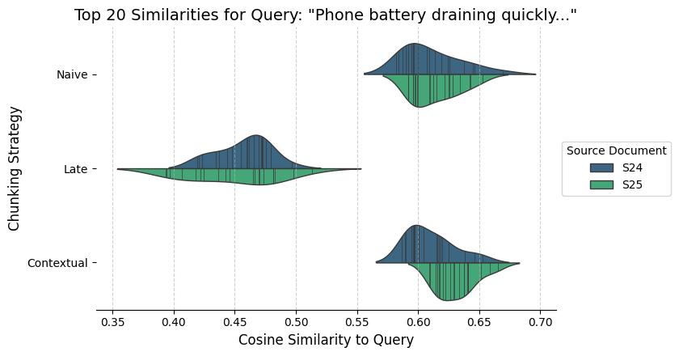
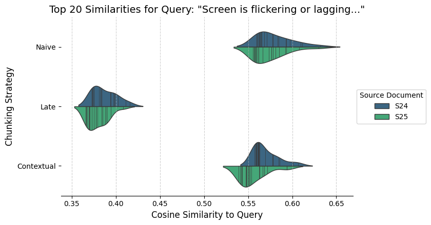
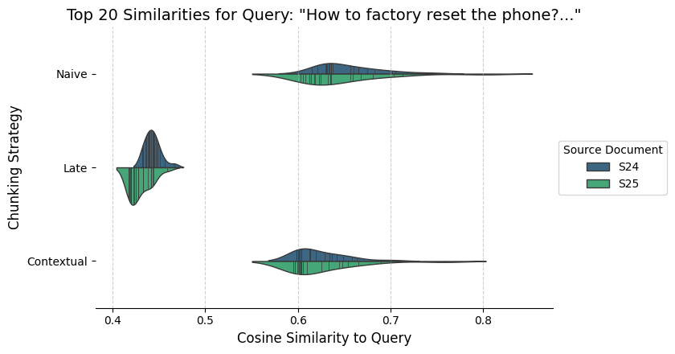
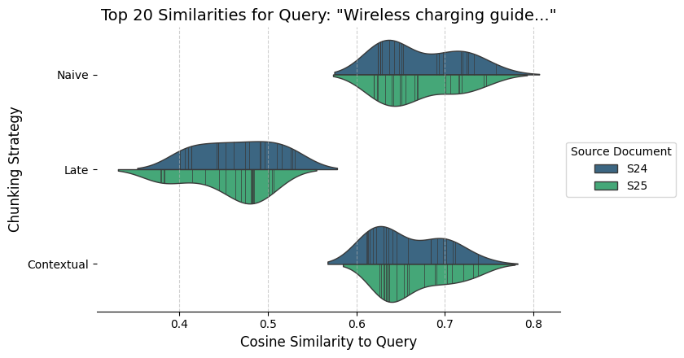

# Query Analysis Report (2025-03-30 19:23:43.380371)

Embedding Model: `nomic-ai/nomic-embed-text-v1.5`
Dimensionality Reduction for Spatial Plots: `PCA`
Number of Top Results per Group: `20`

## Query 1: `How to fix overheating?`

### Top Results Dataframe

| source   | strategy   |   similarity | text                                                                                                                                                                                                                                                                                                                                                                                                                                                                                                                             |
|:---------|:-----------|-------------:|:---------------------------------------------------------------------------------------------------------------------------------------------------------------------------------------------------------------------------------------------------------------------------------------------------------------------------------------------------------------------------------------------------------------------------------------------------------------------------------------------------------------------------------|
| S24      | Contextual |       0.6877 | erheating ###### If you begin to feel uncomfortable because of the device overheating, stop using the device. When the device heats up, the features and performance may be limited or the device may turn off to cool down. The feature is only available on supported models. - If the device overheats, the screen brightness, the screen refresh rate, and the performance speed will be limited to lower the device’s temperature. Even if the battery charging indicator icon appears, charging may be slow. When charging |
| S24      | Contextual |       0.6746 | the device may feel hotter to the touch. This does not affect the device’s lifespan or performance and is in the device’s normal range of operation. If the battery becomes too hot, the charging speed may decrease or the charger may stop charging. ###### Do the following when the device heats up: - Disconnect the charger from the device and close any running apps. Wait for the device to cool down and then begin charging the device again. - If the lower part of the device overheats, it could be because the co |
| S24      | Contextual |       0.6657 | orarily heat up because of increased battery consumption. Close any running apps and do not use the device for a while. Refer to the following examples of situations in which the device may overheat. - During the initial setup after purchase or when restoring data - When downloading large files 181 ----- ###### Usage notices - When using apps that require more power or using apps for extended periods ‒ When playing high-quality games for extended periods ‒ When recording videos for extended periods ‒ When s |
| S24      | Contextual |       0.6153 | is completely dry. The device can be damaged if an accessory or charger is connected when the multipurpose jack is not yet dry. The water and dust resistance of your Samsung Galaxy device is not permanent and may diminish over time because of normal wear and tear. 180 ----- ###### Usage notices ### Device overheating situations and solutions ##### When the device heats up while charging the battery ###### While charging, the device and the charger may become hot. During wireless charging or fast charging,   |
| S24      | Contextual |       0.6091 | device. - Turn off the Wi-Fi, GPS, and Bluetooth features when not using them. - Close apps that increase battery consumption or that run in the background when not in use. - Delete unnecessary files or unused apps. - Decrease the screen brightness. - If the device overheats or feels hot for a prolonged period, do not use it for a while. If the device continues to overheat, contact a Samsung Service Centre or an authorised service centre. ###### 182 ----- ###### Usage notices ##### Precautions for device ov |
| S24      | Contextual |       0.5977 | environment ###### Your device may heat up because of the environment in the following conditions. Use caution to avoid shortening the battery’s lifespan, damaging the device, or causing a fire. - Do not store your device in very cold or very hot temperatures. - Do not expose your device to direct sunlight for extended periods. - Do not use or store your device for extended periods in very hot areas, such as inside a car in the summertime. - Do not place the device in any areas that may overheat, such as o  |
| S24      | Contextual |       0.5928 | - When using the Mobile Hotspot and Tethering feature - When using the device in areas with weak signals or no reception - When charging the battery with a damaged USB cable - When the device’s multipurpose jack is damaged or exposed to foreign materials, such as liquid, dust, metal powder, and pencil lead - When you are roaming ###### Do the following when the device heats up: - Keep the device updated with the latest software. - Conflicts between running apps may cause the device to heat up. Restart the   |
| S24      | Contextual |       0.5777 | stops because of a rise in the device’s temperature, the battery indicator icon will blink. - If the device reaches a certain temperature, a warning message will appear to prevent device failure, skin irritation and damage, and battery leakage. Running apps will be closed and all calling and other features will be limited, except for emergency calls, until the device cools down. - If the second message appears because of a further increase of the device’s temperature, the device will turn off. Do not use t  |
| S24      | Contextual |       0.5664 | turbed. - Game optimisation : Change the performance mode. - Battery : Check the remaining battery usage time. • Temperature / Memory : Check the device’s temperature and memory status. You can also set the device to automatically adjust the volume or video frame rate to prevent the device from overheating and to stop apps from running in the background when there is not enough memory. - You can set to open the Game Booster panel from the navigation bar while the → navigation bar is set to Swipe gestures .  |
| S24      | Contextual |       0.5615 | htness : Adjust the brightness of the display. - Adaptive brightness : Set the device to keep track of your brightness adjustments and apply them automatically in similar lighting conditions. - Extra brightness : Set the display to be brighter than the maximum brightness. This feature is available when you turn off the Adaptive brightness feature. • Motion smoothness : Change the refresh rate of the screen. When a high refresh rate is set, the screen will scroll more smoothly. Refer to Motion smoothness for |
| S24      | Contextual |       0.5578 | nnected USB cable is damaged. Replace the damaged USB cable with a new Samsung-approved one. - When using a wireless charger, do not place foreign materials, such as metal objects, magnets, and magnetic stripe cards, between the device and the wireless charger. ###### The wireless charging or fast charging feature is only available on supported models. ##### When the device heats up during use ###### When you use features or apps that require more power or use them for extended periods, your device may temp |
| S24      | Contextual |       0.5571 | stable power supply while charging, the screen may not function. If this happens, unplug the charger from the device. - While charging, the device and the charger may heat up. This is normal and should not affect the device’s lifespan or performance. If the battery gets hotter than usual, the charger may stop charging. - If the device is not charging properly, take the device and the charger to a Samsung Service Centre or an authorised service centre. 17 ----- ###### Getting started ### Nano-SIM card and eS |
| S24      | Contextual |       0.5548 | safe. - Performance profile : Change the performance profile in consideration of the device’s processing speed, battery life, and cooling efficiency. - Auto optimisation : Perform auto optimisation by closing background apps or cleaning up memory, to keep the device running in its best condition. Tap Auto restart to set the device to restart automatically when performance issues are detected or at a time you set. - Software update : Update your device’s software through the firmware over-the-air (FOTA) serv |
| S24      | Contextual |       0.5547 | - If the screen is scratched or damaged, visit a Samsung Service Centre or an authorised service centre. Your device freezes or encounters a fatal problem Try the following solutions. If the problem is still not resolved, contact a Samsung Service Centre or an authorised service centre. Restarting the device If your device freezes or hangs, you may need to close apps or turn off the device and turn it on again. Forcing restart If your device is frozen and unresponsive, press and hold the Side button and th  |
| S24      | Contextual |       0.5530 | rmation. Regularly back up your data to a safe location, such as Samsung Cloud or a computer, so that you can restore it if the data is damaged or lost because of an unintended factory data reset. ##### Samsung Cloud ###### Back up your device’s data to Samsung Cloud and restore it later. Backing up data You can back up your device’s data to Samsung Cloud. 1 On the Settings screen, tap Accounts and backup and tap Back up data under Samsung Cloud . 2 Tap the switches next to the items you want to back up and |
| S24      | Contextual |       0.5499 | he device until the device’s temperature is within the recommended operating temperature range. If the second warning message appears during an emergency call, the call will not be disconnected by a forced termination. Recommended operating temperature range The device’s recommended operating temperature is between 0 °C to 35 °C. Using the device outside of the recommended temperature range may damage the device or reduce the battery’s lifespan. 183 ----- ###### Usage notices ##### Precautions for operating |
| S24      | Contextual |       0.5490 | Use a high refresh rate to prevent the screen from flickering when switching between screens. The screen will scroll more smoothly. When you select a standard refresh rate, you can use the battery longer. 1 On the Settings screen, tap Display → Motion smoothness . 2 Select a refresh rate. - Adaptive : Get smoother animations and scrolling by automatically adjusting your screen refresh rate into a higher one. • Standard : Use a standard refresh rate in normal situations to conserve battery power. 147 ----- # |
| S24      | Contextual |       0.5447 | ion or the surrounding environment. 15 ----- ###### Getting started Setting the limit for power sharing You can set the device to stop power sharing when the remaining battery power drops below a certain level. → → Open Settings, tap Battery Wireless power sharing Battery limit, and then set the limit. ##### Reducing the battery consumption ###### Your device provides various options that help you conserve battery power. - Optimise the device using the device care feature. - When you are not using the devic |
| S24      | Contextual |       0.5442 | at the charger is connected properly. - Visit a Samsung Service Centre or an authorised service centre and have the battery replaced. 202 ----- ###### Appendix The battery depletes faster than when first purchased - When you expose the device or the battery to very cold or very hot temperatures, the useful charge may be reduced. - Battery consumption will increase when you use certain features or apps, such as GPS, games, or the internet. - The battery is consumable and the useful charge will get shorter ov |
| S24      | Contextual |       0.5367 | ed apps and malware to optimise your device. - Battery : Check the remaining battery power and time to use the device. For devices with low battery levels, conserve battery power by turning on power saving features. Refer to Battery for more information. 171 ----- ###### Settings - Storage : Check the status of used and available storage and free up storage by deleting unnecessary files, such as the files in the recycle bin, unused files, or duplicated files after checking them. - The actual available capac |
| S24      | Late       |       0.4259 | injuries or damage to your device. - Connecting the charger improperly may cause serious damage to the device. Any damage caused by misuse is not covered by the warranty. - Use only USB Type-C cable supplied with the device. The device may be damaged if you use Micro USB cable. - If you charge the device while the multipurpose jack is wet, the device may be damaged. Thoroughly dry the multipurpose jack before charging the device. - To save energy, unplug the charger when not in use. The charger does not ha  |
| S24      | Late       |       0.4239 | e, turn off the screen by pressing the Side button. - Turn on power saving mode. - Close unnecessary apps. • Turn off the Bluetooth feature when not in use. - Turn off auto-syncing of apps that need to be synced. - Decrease the backlight time. - Decrease the screen brightness. 16 ----- ###### Getting started ##### Battery charging tips and precautions ###### Use only Samsung-approved battery, charger, and cable specifically designed for your device. Incompatible battery, charger, and cable can cause serious |
| S24      | Late       |       0.4180 | stable power supply while charging, the screen may not function. If this happens, unplug the charger from the device. - While charging, the device and the charger may heat up. This is normal and should not affect the device’s lifespan or performance. If the battery gets hotter than usual, the charger may stop charging. - If the device is not charging properly, take the device and the charger to a Samsung Service Centre or an authorised service centre. 17 ----- ###### Getting started ### Nano-SIM card and eS |
| S24      | Late       |       0.4165 | g your phone. Depending on the type of accessories or cover being used, the Wireless power sharing feature may not work properly. It is recommended to remove any accessories and cover being used before using this feature. 1 Open the notification panel, swipe downwards, and then tap ( Wireless power sharing ) to turn it on. If you cannot find ( Wireless power sharing ) on the quick settings panel, tap → Edit and drag the button over to add it. 2 Place the other device on the centre of your phone, with their  |
| S24      | Late       |       0.4100 | ve a power switch, so you must unplug the charger from the electric socket when not in use to avoid wasting power. The charger should remain close to the electric socket and easily accessible while charging. - When using a charger, it is recommended to use an approved charger that guarantees the charging performance. - If the battery is completely discharged, the device cannot be turned on immediately when the charger is connected. Allow a depleted battery to charge for a few minutes before turning on the d |
| S24      | Late       |       0.4069 | evice. - If you use multiple apps at once, network apps, or apps that need a connection to another device, the battery will drain quickly. To avoid losing power during a data transfer, always use these apps after fully charging the battery. - Using a power source other than the charger, such as a computer, may result in a slower charging speed because of a lower electric current. - The device can be used while it is charging, but it may take longer to fully charge the battery. - If the device receives an un |
| S24      | Late       |       0.4069 | fast charger. To use the fast wireless charging feature, use a charger and components that support the feature. You can check the connection status of the charger by opening Settings and tapping Battery . • → If fast charging does not work, open Settings, tap Battery Charging settings, and then check if the feature you want is turned on. Also, check if the USB cable and the USB power adapter are connected properly. - You can charge the battery more quickly while the device or its screen is turned off. - If  |
| S24      | Late       |       0.4067 | the wireless charger has an internal fan, the fan may produce noise during fast wireless charging. Add a routine to set the fast wireless charging feature to turn off automatically at the preset time using Routines . When the fast wireless charging feature turns off, the charger’s fan noise and the indicator light will be reduced. 14 ----- ###### Getting started ##### Wireless power sharing ###### You can charge another device with your phone’s battery. You can still charge another device even while chargin |
| S24      | Late       |       0.4048 | ap the Show Apps screen button on Home screen switch to turn it on. The Apps button will be added at the bottom of the Home screen. Apps button 27 ----- ###### Getting started Editing the Home screen On the Home screen, touch and hold an empty area, or pinch your fingers together to access the editing options. You can set the wallpaper, add widgets, and more. You can also add, delete, or rearrange Home screen panels. • Adding panels: Swipe to the left, and then tap . - Moving panels: Drag a panel preview to |
| S24      | Late       |       0.4033 | n. - Press twice or press and hold to open the app or feature you set. - Press simultaneously to capture a screenshot. - Press and hold simultaneously to turn off the device. Setting the Side button holding the Side button. want. Soft buttons Recents button Back button Home button ###### When you turn on the screen, the soft buttons will appear at the bottom of the screen. Refer to Navigation bar (soft buttons) for more information. 12 ----- ###### Getting started ### Charging the battery ##### Wireless cha |
| S24      | Late       |       0.4030 | it to the target position. Swiping Swipe upwards, downwards, to the left, or to the right. ###### Touching and holding Touch and hold the screen for approximately 2 seconds. Double tapping Double tap the screen. Spreading and pinching Spread two fingers apart or pinch on the screen. ###### • Do not allow the screen to come into contact with other electrical devices. Electrostatic discharges can cause the screen to malfunction. - To avoid damaging the screen, do not tap it with anything sharp or apply exces  |
| S24      | Late       |       0.4030 | ion or the surrounding environment. 15 ----- ###### Getting started Setting the limit for power sharing You can set the device to stop power sharing when the remaining battery power drops below a certain level. → → Open Settings, tap Battery Wireless power sharing Battery limit, and then set the limit. ##### Reducing the battery consumption ###### Your device provides various options that help you conserve battery power. - Optimise the device using the device care feature. - When you are not using the devic |
| S24      | Late       |       0.4014 | ot work smoothly depending on the type of accessory or cover. For stable wireless charging, it is recommended to separate the cover or accessory from the device. 13 ----- ###### Getting started Precautions for wireless charging If you do not follow the precautions, the device may not charge properly or may overheat, or the device and any cards may be damaged. - Do not place the device on the wireless charger with a credit card or radio-frequency identification (RFID) card (such as a transportation card or a |
| S24      | Late       |       0.4003 | sive pressure to it with your fingertips or other object. - It is recommended not to use fixed graphics on part or all of the screen for extended periods. Doing so may result in afterimages (screen burn-in) or ghosting. The device may not recognise touch inputs close to the edges of the screen, which are outside of the touch input area. 25 ----- ###### Getting started ##### Navigation bar (soft buttons) ###### currently being used or usage environment. Recents • Tap to open the list of recent apps. - Tap to |
| S24      | Late       |       0.3992 | rging ###### The device has a built-in wireless charging coil. You can charge the battery using a wireless charger (sold separately). Place the centre of the device’s back on the centre of the wireless charger to charge the battery. After fully charging, disconnect the device from the wireless charger. The estimated charging time will appear on the notification panel. The actual charging time assumes that the device is not in use, and it may vary depending on the charging conditions. Wireless charging may n |
| S24      | Late       |       0.3989 | s icons for all apps, including newly installed apps. Switching between Home and Apps screens On the Home screen, swipe upwards to open the Apps screen. To return to the Home screen, swipe upwards or downwards on the Apps screen. Alternatively, tap the Home button ( ) or the Back button ( ). Finder Favourite apps Home screen Apps screen If you add the Apps button on the Home screen, you can open the Apps screen by tapping the button. On the Home screen, touch and hold an empty area, tap Settings, and then t |
| S24      | Late       |       0.3987 | ards, and then tap . 2 Tap Power off . To restart the device, tap Restart . If you want to set the device to turn off when you press and hold the Side button, tap Side button settings and tap Power off menu under Press and hold . Forcing restart If your device is frozen and unresponsive, press and hold the Side button and the Volume Down button simultaneously for more than 7 seconds to restart it. Emergency calls and medical information You can make an emergency call or check the medical information you sav |
| S24      | Late       |       0.3982 | key card) placed between the back of the device and the device cover. - Do not place the device on the wireless charger when conductive materials, such as metal objects and magnets, are placed between the device and the wireless charger. - If you use the wireless charger in areas with weak network signals, you may lose network reception. - Use Samsung-approved wireless chargers. If you use other wireless chargers, the battery may not charge properly. ##### Quick charging ###### Use a super fast charger or   |
| S24      | Late       |       0.3978 | backs facing. Phone Galaxy Watch Galaxy Buds 3 When you are finished charging, disconnect the other device from your phone. Do not use headphones while sharing power. Doing so may affect nearby devices. - The location of the wireless charging coil may differ depending on the device. Adjust the devices so the charging coils connect properly. - Some features are not available while sharing power. - Only devices that support the wireless charging feature can be charged using this feature. Some devices may not  |
| S24      | Late       |       0.3957 | . - Settings : Configure settings for the Home screen, such as the screen layout. Displaying all apps on the Home screen Without using a separate Apps screen, you can set the device to display all apps on the Home screen. On the Home screen, touch and hold an empty area, and then tap Settings → Home screen layout → Home screen only → Apply . 28 ----- ###### Getting started Launching Finder Search for content on the device. 1 On the Apps screen, tap Search . 2 Enter a keyword. Apps and content on your device |
| S24      | Naive      |       0.7344 | erheating ###### If you begin to feel uncomfortable because of the device overheating, stop using the device. When the device heats up, the features and performance may be limited or the device may turn off to cool down. The feature is only available on supported models. - If the device overheats, the screen brightness, the screen refresh rate, and the performance speed will be limited to lower the device’s temperature. Even if the battery charging indicator icon appears, charging may be slow. When charging |
| S24      | Naive      |       0.7203 | the device may feel hotter to the touch. This does not affect the device’s lifespan or performance and is in the device’s normal range of operation. If the battery becomes too hot, the charging speed may decrease or the charger may stop charging. ###### Do the following when the device heats up: - Disconnect the charger from the device and close any running apps. Wait for the device to cool down and then begin charging the device again. - If the lower part of the device overheats, it could be because the co |
| S24      | Naive      |       0.7200 | orarily heat up because of increased battery consumption. Close any running apps and do not use the device for a while. Refer to the following examples of situations in which the device may overheat. - During the initial setup after purchase or when restoring data - When downloading large files 181 ----- ###### Usage notices - When using apps that require more power or using apps for extended periods ‒ When playing high-quality games for extended periods ‒ When recording videos for extended periods ‒ When s |
| S24      | Naive      |       0.6631 | device. - Turn off the Wi-Fi, GPS, and Bluetooth features when not using them. - Close apps that increase battery consumption or that run in the background when not in use. - Delete unnecessary files or unused apps. - Decrease the screen brightness. - If the device overheats or feels hot for a prolonged period, do not use it for a while. If the device continues to overheat, contact a Samsung Service Centre or an authorised service centre. ###### 182 ----- ###### Usage notices ##### Precautions for device ov |
| S24      | Naive      |       0.6495 | turbed. - Game optimisation : Change the performance mode. - Battery : Check the remaining battery usage time. • Temperature / Memory : Check the device’s temperature and memory status. You can also set the device to automatically adjust the volume or video frame rate to prevent the device from overheating and to stop apps from running in the background when there is not enough memory. - You can set to open the Game Booster panel from the navigation bar while the → navigation bar is set to Swipe gestures .  |
| S24      | Naive      |       0.6403 | - When using the Mobile Hotspot and Tethering feature - When using the device in areas with weak signals or no reception - When charging the battery with a damaged USB cable - When the device’s multipurpose jack is damaged or exposed to foreign materials, such as liquid, dust, metal powder, and pencil lead - When you are roaming ###### Do the following when the device heats up: - Keep the device updated with the latest software. - Conflicts between running apps may cause the device to heat up. Restart the   |
| S24      | Naive      |       0.6391 | environment ###### Your device may heat up because of the environment in the following conditions. Use caution to avoid shortening the battery’s lifespan, damaging the device, or causing a fire. - Do not store your device in very cold or very hot temperatures. - Do not expose your device to direct sunlight for extended periods. - Do not use or store your device for extended periods in very hot areas, such as inside a car in the summertime. - Do not place the device in any areas that may overheat, such as o  |
| S24      | Naive      |       0.6375 | is completely dry. The device can be damaged if an accessory or charger is connected when the multipurpose jack is not yet dry. The water and dust resistance of your Samsung Galaxy device is not permanent and may diminish over time because of normal wear and tear. 180 ----- ###### Usage notices ### Device overheating situations and solutions ##### When the device heats up while charging the battery ###### While charging, the device and the charger may become hot. During wireless charging or fast charging,   |
| S24      | Naive      |       0.6192 | stops because of a rise in the device’s temperature, the battery indicator icon will blink. - If the device reaches a certain temperature, a warning message will appear to prevent device failure, skin irritation and damage, and battery leakage. Running apps will be closed and all calling and other features will be limited, except for emergency calls, until the device cools down. - If the second message appears because of a further increase of the device’s temperature, the device will turn off. Do not use t  |
| S24      | Naive      |       0.6019 | stable power supply while charging, the screen may not function. If this happens, unplug the charger from the device. - While charging, the device and the charger may heat up. This is normal and should not affect the device’s lifespan or performance. If the battery gets hotter than usual, the charger may stop charging. - If the device is not charging properly, take the device and the charger to a Samsung Service Centre or an authorised service centre. 17 ----- ###### Getting started ### Nano-SIM card and eS |
| S24      | Naive      |       0.5981 | safe. - Performance profile : Change the performance profile in consideration of the device’s processing speed, battery life, and cooling efficiency. - Auto optimisation : Perform auto optimisation by closing background apps or cleaning up memory, to keep the device running in its best condition. Tap Auto restart to set the device to restart automatically when performance issues are detected or at a time you set. - Software update : Update your device’s software through the firmware over-the-air (FOTA) serv |
| S24      | Naive      |       0.5938 | at the charger is connected properly. - Visit a Samsung Service Centre or an authorised service centre and have the battery replaced. 202 ----- ###### Appendix The battery depletes faster than when first purchased - When you expose the device or the battery to very cold or very hot temperatures, the useful charge may be reduced. - Battery consumption will increase when you use certain features or apps, such as GPS, games, or the internet. - The battery is consumable and the useful charge will get shorter ov |
| S24      | Naive      |       0.5926 | - If the screen is scratched or damaged, visit a Samsung Service Centre or an authorised service centre. Your device freezes or encounters a fatal problem Try the following solutions. If the problem is still not resolved, contact a Samsung Service Centre or an authorised service centre. Restarting the device If your device freezes or hangs, you may need to close apps or turn off the device and turn it on again. Forcing restart If your device is frozen and unresponsive, press and hold the Side button and th  |
| S24      | Naive      |       0.5925 | ards, and then tap . 2 Tap Power off . To restart the device, tap Restart . If you want to set the device to turn off when you press and hold the Side button, tap Side button settings and tap Power off menu under Press and hold . Forcing restart If your device is frozen and unresponsive, press and hold the Side button and the Volume Down button simultaneously for more than 7 seconds to restart it. Emergency calls and medical information You can make an emergency call or check the medical information you sav |
| S24      | Naive      |       0.5897 | nnected USB cable is damaged. Replace the damaged USB cable with a new Samsung-approved one. - When using a wireless charger, do not place foreign materials, such as metal objects, magnets, and magnetic stripe cards, between the device and the wireless charger. ###### The wireless charging or fast charging feature is only available on supported models. ##### When the device heats up during use ###### When you use features or apps that require more power or use them for extended periods, your device may temp |
| S24      | Naive      |       0.5888 | htness : Adjust the brightness of the display. - Adaptive brightness : Set the device to keep track of your brightness adjustments and apply them automatically in similar lighting conditions. - Extra brightness : Set the display to be brighter than the maximum brightness. This feature is available when you turn off the Adaptive brightness feature. • Motion smoothness : Change the refresh rate of the screen. When a high refresh rate is set, the screen will scroll more smoothly. Refer to Motion smoothness for |
| S24      | Naive      |       0.5867 | Use a high refresh rate to prevent the screen from flickering when switching between screens. The screen will scroll more smoothly. When you select a standard refresh rate, you can use the battery longer. 1 On the Settings screen, tap Display → Motion smoothness . 2 Select a refresh rate. - Adaptive : Get smoother animations and scrolling by automatically adjusting your screen refresh rate into a higher one. • Standard : Use a standard refresh rate in normal situations to conserve battery power. 147 ----- # |
| S24      | Naive      |       0.5812 | ice. You can also schedule software updates. - Diagnostics : Test your device using Samsung Members. • Maintenance mode : Turn on maintenance mode to protect your privacy while someone else is using your device, such as when you send it for repairs. ### Apps ###### Manage the device’s apps and change their settings. You can check the apps’ usage information, change their notification or permission settings, or uninstall or disable unnecessary apps. On the Settings screen, tap Apps . 172 ----- ###### Setting |
| S24      | Naive      |       0.5797 | he device until the device’s temperature is within the recommended operating temperature range. If the second warning message appears during an emergency call, the call will not be disconnected by a forced termination. Recommended operating temperature range The device’s recommended operating temperature is between 0 °C to 35 °C. Using the device outside of the recommended temperature range may damage the device or reduce the battery’s lifespan. 183 ----- ###### Usage notices ##### Precautions for operating |
| S24      | Naive      |       0.5788 | to stop recording the video. - If you use the video zoom feature for a long time while recording a video, the video quality may diminish to prevent your device from overheating. - The optical zoom may not work in low-light environments. Changing the resolution You can record high-resolution videos with a maximum resolution of 8K. In shooting options, tap to change the resolution to the one you want, and record a video. When you finish recording a video, play it in the Gallery app. When you tap on a frame th |
| S25      | Contextual |       0.6791 | the device continues to overheat, contact a Samsung Service Centre or an authorised service centre. 162 ----- ###### Usage notices ##### Precautions for device overheating ###### If you begin to feel uncomfortable because of the device overheating, stop using the device. When the device heats up, the features and performance may be limited or the device may turn off to cool down. The feature is only available on supported models. - If the device overheats, the screen brightness, the screen refresh rate, and |
| S25      | Contextual |       0.6460 | olutions ##### When the device heats up while charging the battery ###### While charging, the device and the charger may become hot. During wireless charging or fast charging, the device may feel hotter to the touch. This does not affect the device’s lifespan or performance and is in the device’s normal range of operation. If the battery becomes too hot, the charging speed may decrease or the charger may stop charging. ###### Do the following when the device heats up: - Disconnect the charger from the devic |
| S25      | Contextual |       0.6407 | supported models. ##### When the device heats up during use ###### When you use features or apps that require more power or use them for extended periods, your device may temporarily heat up because of increased battery consumption. Close any running apps and do not use the device for a while. Refer to the following examples of situations in which the device may overheat. - During the initial setup after purchase or when restoring data - When downloading large files 161 ----- ###### Usage notices - When us  |
| S25      | Contextual |       0.6356 | he following when the device heats up: - Keep the device updated with the latest software. - Conflicts between running apps may cause the device to heat up. Restart the device. - Turn off the Wi-Fi, GPS, and Bluetooth features when not using them. - Close apps that increase battery consumption or that run in the background when not in use. - Delete unnecessary files or unused apps. - Decrease the screen brightness. - If the device overheats or feels hot for a prolonged period, do not use it for a while. If  |
| S25      | Contextual |       0.5919 | e’s temperature if the temperature rises above a certain level. Changing the performance mode You can change the game performance mode. Tap → → Game optimisation and select the mode you want. • Performance : This focuses on giving you high performance while playing games. If you use this mode, your device may heat up because of increased battery consumption. • Standard : This balances the performance and the battery usage time. - Battery saver : This saves battery power while playing games. Battery power ef |
| S25      | Contextual |       0.5855 | ls, until the device cools down. - If the second message appears because of a further increase of the device’s temperature, the device will turn off. Do not use the device until the device’s temperature is within the recommended operating temperature range. If the second warning message appears during an emergency call, the call will not be disconnected by a forced termination. Recommended operating temperature range The device’s recommended operating temperature is between 0 °C to 35 °C. Using the device o |
| S25      | Contextual |       0.5774 | ideration of the device’s processing speed, battery life, and cooling efficiency. - Auto optimisation : Perform auto optimisation by closing background apps or cleaning up memory, to keep the device running in its best condition. Tap Auto restart to set the device to restart automatically when performance issues are detected or at a time you set. - Software update : Update your device’s software through the firmware over-the-air (FOTA) service. You can also schedule software updates. - Diagnostics : Test yo |
| S25      | Contextual |       0.5727 | eing clear during a call. - The screen and other features may not work properly if the device is used in water. - Do not connect the charger or any accessories until the device is completely dry. The device can be damaged if an accessory or charger is connected when the multipurpose jack is not yet dry. The water and dust resistance of your Samsung Galaxy device is not permanent and may diminish over time because of normal wear and tear. 160 ----- ###### Usage notices ### Device overheating situations and s |
| S25      | Contextual |       0.5607 | close apps or turn off the device and turn it on again. Forcing restart If your device is frozen and unresponsive, press and hold the Side button and the Volume Down button simultaneously for more than 7 seconds to restart it. Resetting the device If these methods do not solve your problem, perform a factory data reset. Open Settings and tap General management → Reset → Factory data reset → Reset → Delete all . Before performing the factory data reset, remember to make backup copies of all important data st |
| S25      | Contextual |       0.5585 | utside of the recommended temperature range may damage the device or reduce the battery’s lifespan. 163 ----- ###### Usage notices ##### Precautions for operating environment ###### Your device may heat up because of the environment in the following conditions. Use caution to avoid shortening the battery’s lifespan, damaging the device, or causing a fire. - Do not store your device in very cold or very hot temperatures. - Do not expose your device to direct sunlight for extended periods. - Do not use or sto |
| S25      | Contextual |       0.5571 | Adjust the brightness of the display. - Adaptive brightness : Set the device to keep track of your brightness adjustments and apply them automatically in similar lighting conditions. - Extra brightness : Set the display to be brighter than the maximum brightness. This feature is available when you turn off the Adaptive brightness feature. 127 ----- ###### Settings • Motion smoothness : Change the refresh rate of the screen. When a high refresh rate is set, the screen will scroll more smoothly. Refer to Mot  |
| S25      | Contextual |       0.5568 | en exposed to water - Restart your device to clear any temporary software problems. - Ensure that your device software is updated to the latest version. - If the screen is scratched or damaged, visit a Samsung Service Centre or an authorised service centre. Your device freezes or encounters a fatal problem Try the following solutions. If the problem is still not resolved, contact a Samsung Service Centre or an authorised service centre. Restarting the device If your device freezes or hangs, you may need to  |
| S25      | Contextual |       0.5557 | re your device for extended periods in very hot areas, such as inside a car in the summertime. - Do not place the device in any areas that may overheat, such as on an electric heating mat. - Do not store your device near or in heaters, microwaves, hot cooking equipment, or high pressure containers. - Do not use a cable whose covering is peeled off or damaged, and do not use any charger or battery that is damaged or malfunctioning. 164 ----- ## Appendix ### Accessibility ##### About Accessibility ###### Impr |
| S25      | Contextual |       0.5557 | the performance speed will be limited to lower the device’s temperature. Even if the battery charging indicator icon appears, charging may be slow. When charging stops because of a rise in the device’s temperature, the battery indicator icon will blink. - If the device reaches a certain temperature, a warning message will appear to prevent device failure, skin irritation and damage, and battery leakage. Running apps will be closed and all calling and other features will be limited, except for emergency cal  |
| S25      | Contextual |       0.5524 | e and close any running apps. Wait for the device to cool down and then begin charging the device again. - If the lower part of the device overheats, it could be because the connected USB cable is damaged. Replace the damaged USB cable with a new Samsung-approved one. - When using a wireless charger, do not place foreign materials, such as metal objects, magnets, and magnetic stripe cards, between the device and the wireless charger. ###### The wireless charging or fast charging feature is only available on |
| S25      | Contextual |       0.5524 | ring when switching between screens. The screen will scroll more smoothly. When you select a standard refresh rate, you can use the battery longer. 1 On the Settings screen, tap Display → Motion smoothness . 2 Select a refresh rate. - Adaptive : Get smoother animations and scrolling by automatically adjusting your screen refresh rate into a higher one. • Standard : Use a standard refresh rate in normal situations to conserve battery power. ##### Changing the screen mode or adjusting the display colour ##### |
| S25      | Contextual |       0.5502 | Settings Optimising the full screen colour balance Optimise the display colour by adjusting the colour tones to your preference. On the Settings screen, tap Display → Screen mode → Vivid and adjust the colour adjustment bar under White balance . When you drag the colour adjustment bar towards Cool, the blue colour tone will increase. When you drag the bar towards Warm, the red colour tone will increase. Adjusting the screen tone by colour value Increase or lower certain colour tones by adjusting the Red, G  |
| S25      | Contextual |       0.5475 | ion smoothness for more information. - Eye comfort shield : Reduce eye strain by limiting the amount of blue light emitted by the screen. You can set a schedule for applying this feature. - Adaptive colour tone : Adjust the colours and white balance based on the ambient lighting conditions to make colours appear more natural in different environments. • Screen mode : Change the screen mode to adjust the display’s colour and contrast. Refer to Changing the screen mode or adjusting the display colour for more |
| S25      | Contextual |       0.5439 | Power saving : Turn on power saving mode to extend the battery’s usage time. - Background usage limits : Limit battery usage for apps that you do not use often. - Battery protection : Set to stop charging when the battery is fully charged or limit the maximum charge to the preset level. - Today : Check the battery level and usage history. - Charging settings : Configure the charging settings. 130 ----- ###### Settings - Wireless power sharing : Charge another device with your phone’s battery. Refer to Wirel |
| S25      | Contextual |       0.5400 | ng and pinching Spread two fingers apart or pinch on the screen. ###### • Do not allow the screen to come into contact with other electrical devices. Electrostatic discharges can cause the screen to malfunction. - To avoid damaging the screen, do not tap it with anything sharp or apply excessive pressure to it with your fingertips or other object. - It is recommended not to use fixed graphics on part or all of the screen for extended periods. Doing so may result in afterimages (screen burn-in) or ghosting.  |
| S25      | Late       |       0.4162 | ng and pinching Spread two fingers apart or pinch on the screen. ###### • Do not allow the screen to come into contact with other electrical devices. Electrostatic discharges can cause the screen to malfunction. - To avoid damaging the screen, do not tap it with anything sharp or apply excessive pressure to it with your fingertips or other object. - It is recommended not to use fixed graphics on part or all of the screen for extended periods. Doing so may result in afterimages (screen burn-in) or ghosting.  |
| S25      | Late       |       0.4152 | klight time. - Decrease the screen brightness. 14 ----- ###### Getting started ##### Battery charging tips and precautions ###### Use only Samsung-approved battery, charger, and cable specifically designed for your device. Incompatible battery, charger, and cable can cause serious injuries or damage to your device. - Connecting the charger improperly may cause serious damage to the device. Any damage caused by misuse is not covered by the warranty. - Use only USB Type-C cable supplied with the device. The d |
| S25      | Late       |       0.4136 | battery. - Using a power source other than the charger, such as a computer, may result in a slower charging speed because of a lower electric current. - The device can be used while it is charging, but it may take longer to fully charge the battery. - If the device receives an unstable power supply while charging, the screen may not function. If this happens, unplug the charger from the device. - While charging, the device and the charger may heat up. This is normal and should not affect the device’s lifes  |
| S25      | Late       |       0.4095 | evice may be damaged if you use Micro USB cable. - If you charge the device while the multipurpose jack is wet, the device may be damaged. Thoroughly dry the multipurpose jack before charging the device. - To save energy, unplug the charger when not in use. The charger does not have a power switch, so you must unplug the charger from the electric socket when not in use to avoid wasting power. The charger should remain close to the electric socket and easily accessible while charging. - When using a charger, |
| S25      | Late       |       0.4079 | ap Battery Wireless power sharing Battery limit, and then set the limit. ##### Reducing the battery consumption ###### Your device provides various options that help you conserve battery power. - Optimise the device using the device care feature. - When you are not using the device, turn off the screen by pressing the Side button. - Turn on power saving mode. - Close unnecessary apps. • Turn off the Bluetooth feature when not in use. - Turn off auto-syncing of apps that need to be synced. - Decrease the bac |
| S25      | Late       |       0.4067 | it is recommended to use an approved charger that guarantees the charging performance. - If the battery is completely discharged, the device cannot be turned on immediately when the charger is connected. Allow a depleted battery to charge for a few minutes before turning on the device. - If you use multiple apps at once, network apps, or apps that need a connection to another device, the battery will drain quickly. To avoid losing power during a data transfer, always use these apps after fully charging the  |
| S25      | Late       |       0.4007 | eature may not work properly. It is recommended to remove any accessories and cover being used before using this feature. 1 Open Settings, tap Battery → Wireless power sharing, and then tap the switch to turn it on. 2 Place the other device on the centre of your phone, with their backs facing. Phone Galaxy Watch Galaxy Buds 3 When you are finished charging, disconnect the other device from your phone. Do not use headphones while sharing power. Doing so may affect nearby devices. - The location of the wirele |
| S25      | Late       |       0.3989 | he feature. You can check the connection status of the charger by opening Settings and tapping Battery . • → If fast charging does not work, open Settings, tap Battery Charging settings, and then check if the feature you want is turned on. Also, check if the USB cable and the USB power adapter are connected properly. - You can charge the battery more quickly while the device or its screen is turned off. - If the wireless charger has an internal fan, the fan may produce noise during fast wireless charging. A |
| S25      | Late       |       0.3986 | pan or performance. If the battery gets hotter than usual, the charger may stop charging. - If the device is not charging properly, take the device and the charger to a Samsung Service Centre or an authorised service centre. 15 ----- ###### Getting started ### Nano-SIM card and eSIM ###### Insert the SIM or USIM card or download the eSIM provided by your carrier. Differing from a physical nano-SIM card, an eSIM is an embedded digital SIM. To have two phone numbers or carriers for a single device, insert ano |
| S25      | Late       |       0.3949 | ess simultaneously to capture a screenshot. - Press and hold simultaneously to turn off the device. Setting the Side button holding the Side button. want. Soft buttons Recents button Back button Home button ###### When you turn on the screen, the soft buttons will appear at the bottom of the screen. Refer to Navigation bar (soft buttons) for more information. 10 ----- ###### Getting started ##### Wireless charging ###### The device has a built-in wireless charging coil. You can charge the battery using a wi |
| S25      | Late       |       0.3926 | dd a routine to set the fast wireless charging feature to turn off automatically at the preset time using Routines . When the fast wireless charging feature turns off, the charger’s fan noise and the indicator light will be reduced. 12 ----- ###### Getting started ##### Wireless power sharing ###### You can charge another device with your phone’s battery. You can still charge another device even while charging your phone. Depending on the type of accessories or cover being used, the Wireless power sharing f |
| S25      | Late       |       0.3913 | rt the tray back into the tray slot. - Insert the ejection pin into the tray’s hole to remove the tray. - Use only a nano-SIM card. - Use caution not to lose or let others use the SIM or USIM card. Samsung is not responsible for any damages or inconveniences caused by lost or stolen cards. - Ensure that the ejection pin is perpendicular to the hole. Otherwise, the device may be damaged. - If the card is not fixed firmly into the tray, the SIM card may leave or fall out of the tray. - If you insert the tray  |
| S25      | Late       |       0.3911 | ther SIM or USIM card or download another eSIM. - eSIM may not be available depending on the region, carrier, or model. - Some services that require a network connection may not be available depending on the carrier. 16 ----- ###### 1 Insert the ejection pin into the hole on the tray to loosen the tray. 2 Pull out the tray gently from the tray slot. 3 Place the SIM or USIM card on the tray with the gold-coloured contacts facing upwards and gently press the SIM or USIM card into the tray to secure it. 4 Inse |
| S25      | Late       |       0.3902 | ss charging coil may differ depending on the device. Adjust the devices so the charging coils connect properly. - Some features are not available while sharing power. - Only devices that support the wireless charging feature can be charged using this feature. Some devices may not be charged. To check out devices that support the Wireless power sharing feature, visit the Samsung website. - To charge properly, do not move or use either device while charging. - The power charged to the other device may be less |
| S25      | Late       |       0.3898 | , unwanted noises may occur during calls or media playback. - Do not cover the proximity/light sensor area with accessories, such as stickers or a cover. Doing so may cause the sensor to malfunction. - The light may flicker at the top of the device during calls because of proximity sensor operation. 9 ----- ###### Getting started Hard buttons - When the device is off, press and hold to turn it on. • Press to turn on or lock the screen. - Press twice or press and hold to open the app or feature you set. - Pr |
| S25      | Late       |       0.3895 | button and the Volume Down button simultaneously. Alternatively, open the quick settings panel and tap . 2 Tap Power off → Power off . To restart the device, tap Restart → Restart . If you want to set the device to turn off when you press and hold the Side button, tap Side button settings → Long press → Power off menu . Forcing restart If your device is frozen and unresponsive, press and hold the Side button and the Volume Down button simultaneously for more than 7 seconds to restart it. Emergency calls an  |
| S25      | Late       |       0.3887 | commended to separate the cover or accessory from the device. 11 ----- ###### Getting started Precautions for wireless charging If you do not follow the precautions, the device may not charge properly or may overheat, or the device and any cards may be damaged. - Do not place the device on the wireless charger with a credit card or radio-frequency identification (RFID) card (such as a transportation card or a key card) placed between the back of the device and the device cover. - Do not place the device on  |
| S25      | Late       |       0.3885 | ons for using the device 159 Notes on package contents and accessories 160 Maintaining water and dust resistance 161 Device overheating situations and solutions ###### 3 ----- ###### Table of Contents #### Appendix ###### 165 Accessibility 179 Troubleshooting 184 Removing the battery ###### 4 ----- ## Getting started ### Device layout and functions ###### ▶ Galaxy S25 Ultra: Speaker Front camera Proximity/Light sensor Microphone Air vent hole Volume button Side button Screen Fingerprint recognition sensor S |
| S25      | Late       |       0.3871 | than the amount shared to it by your phone. - If you charge the other device while charging your phone, the charging speed may decrease or the device may not charge properly depending on the charger type. - The charging speed or efficiency may vary depending on the phone’s condition or the surrounding environment. 13 ----- ###### Getting started Setting the limit for power sharing You can set the device to stop power sharing when the remaining battery power drops below a certain level. → → Open Settings, t  |
| S25      | Late       |       0.3853 | reless charger (sold separately). Place the centre of the device’s back on the centre of the wireless charger to charge the battery. After fully charging, disconnect the device from the wireless charger. The estimated charging time will appear on the notification panel. The actual charging time assumes that the device is not in use, and it may vary depending on the charging conditions. Wireless charging may not work smoothly depending on the type of accessory or cover. For stable wireless charging, it is re |
| S25      | Naive      |       0.7126 | he following when the device heats up: - Keep the device updated with the latest software. - Conflicts between running apps may cause the device to heat up. Restart the device. - Turn off the Wi-Fi, GPS, and Bluetooth features when not using them. - Close apps that increase battery consumption or that run in the background when not in use. - Delete unnecessary files or unused apps. - Decrease the screen brightness. - If the device overheats or feels hot for a prolonged period, do not use it for a while. If  |
| S25      | Naive      |       0.7030 | the device continues to overheat, contact a Samsung Service Centre or an authorised service centre. 162 ----- ###### Usage notices ##### Precautions for device overheating ###### If you begin to feel uncomfortable because of the device overheating, stop using the device. When the device heats up, the features and performance may be limited or the device may turn off to cool down. The feature is only available on supported models. - If the device overheats, the screen brightness, the screen refresh rate, and |
| S25      | Naive      |       0.6847 | supported models. ##### When the device heats up during use ###### When you use features or apps that require more power or use them for extended periods, your device may temporarily heat up because of increased battery consumption. Close any running apps and do not use the device for a while. Refer to the following examples of situations in which the device may overheat. - During the initial setup after purchase or when restoring data - When downloading large files 161 ----- ###### Usage notices - When us  |
| S25      | Naive      |       0.6773 | olutions ##### When the device heats up while charging the battery ###### While charging, the device and the charger may become hot. During wireless charging or fast charging, the device may feel hotter to the touch. This does not affect the device’s lifespan or performance and is in the device’s normal range of operation. If the battery becomes too hot, the charging speed may decrease or the charger may stop charging. ###### Do the following when the device heats up: - Disconnect the charger from the devic |
| S25      | Naive      |       0.6359 | e’s temperature if the temperature rises above a certain level. Changing the performance mode You can change the game performance mode. Tap → → Game optimisation and select the mode you want. • Performance : This focuses on giving you high performance while playing games. If you use this mode, your device may heat up because of increased battery consumption. • Standard : This balances the performance and the battery usage time. - Battery saver : This saves battery power while playing games. Battery power ef |
| S25      | Naive      |       0.6313 | ideration of the device’s processing speed, battery life, and cooling efficiency. - Auto optimisation : Perform auto optimisation by closing background apps or cleaning up memory, to keep the device running in its best condition. Tap Auto restart to set the device to restart automatically when performance issues are detected or at a time you set. - Software update : Update your device’s software through the firmware over-the-air (FOTA) service. You can also schedule software updates. - Diagnostics : Test yo |
| S25      | Naive      |       0.6185 | e and close any running apps. Wait for the device to cool down and then begin charging the device again. - If the lower part of the device overheats, it could be because the connected USB cable is damaged. Replace the damaged USB cable with a new Samsung-approved one. - When using a wireless charger, do not place foreign materials, such as metal objects, magnets, and magnetic stripe cards, between the device and the wireless charger. ###### The wireless charging or fast charging feature is only available on |
| S25      | Naive      |       0.6168 | re your device for extended periods in very hot areas, such as inside a car in the summertime. - Do not place the device in any areas that may overheat, such as on an electric heating mat. - Do not store your device near or in heaters, microwaves, hot cooking equipment, or high pressure containers. - Do not use a cable whose covering is peeled off or damaged, and do not use any charger or battery that is damaged or malfunctioning. 164 ----- ## Appendix ### Accessibility ##### About Accessibility ###### Impr |
| S25      | Naive      |       0.6118 | ls, until the device cools down. - If the second message appears because of a further increase of the device’s temperature, the device will turn off. Do not use the device until the device’s temperature is within the recommended operating temperature range. If the second warning message appears during an emergency call, the call will not be disconnected by a forced termination. Recommended operating temperature range The device’s recommended operating temperature is between 0 °C to 35 °C. Using the device o |
| S25      | Naive      |       0.6101 | close apps or turn off the device and turn it on again. Forcing restart If your device is frozen and unresponsive, press and hold the Side button and the Volume Down button simultaneously for more than 7 seconds to restart it. Resetting the device If these methods do not solve your problem, perform a factory data reset. Open Settings and tap General management → Reset → Factory data reset → Reset → Delete all . Before performing the factory data reset, remember to make backup copies of all important data st |
| S25      | Naive      |       0.5936 | en exposed to water - Restart your device to clear any temporary software problems. - Ensure that your device software is updated to the latest version. - If the screen is scratched or damaged, visit a Samsung Service Centre or an authorised service centre. Your device freezes or encounters a fatal problem Try the following solutions. If the problem is still not resolved, contact a Samsung Service Centre or an authorised service centre. Restarting the device If your device freezes or hangs, you may need to  |
| S25      | Naive      |       0.5901 | the performance speed will be limited to lower the device’s temperature. Even if the battery charging indicator icon appears, charging may be slow. When charging stops because of a rise in the device’s temperature, the battery indicator icon will blink. - If the device reaches a certain temperature, a warning message will appear to prevent device failure, skin irritation and damage, and battery leakage. Running apps will be closed and all calling and other features will be limited, except for emergency cal  |
| S25      | Naive      |       0.5894 | utside of the recommended temperature range may damage the device or reduce the battery’s lifespan. 163 ----- ###### Usage notices ##### Precautions for operating environment ###### Your device may heat up because of the environment in the following conditions. Use caution to avoid shortening the battery’s lifespan, damaging the device, or causing a fire. - Do not store your device in very cold or very hot temperatures. - Do not expose your device to direct sunlight for extended periods. - Do not use or sto |
| S25      | Naive      |       0.5844 | - When you expose the device or the battery to very cold or very hot temperatures, the useful charge may be reduced. - Battery consumption will increase when you use certain features or apps, such as GPS, games, or the internet. - The battery is consumable and the useful charge will get shorter over time. Error messages appear when opening the camera Your device must have sufficient available storage and battery power to operate the camera app. If you receive error messages when opening the camera, try the  |
| S25      | Naive      |       0.5776 | t appears at the left bottom of the screen to Max, you may get clearer pictures. 2 Tap and hold your device steady until shooting is complete. ##### Food mode ###### Take pictures of food with more vibrant colours. 1 On the shooting modes list, tap MORE → FOOD . A frame will appear on the screen and the area outside the frame will be blurred. 2 To resize the frame, drag a corner of the frame. Tap the area you want or drag the frame to move it. 3 Tap → and drag the adjustment bar to adjust the colour tempera |
| S25      | Naive      |       0.5770 | Adjust the brightness of the display. - Adaptive brightness : Set the device to keep track of your brightness adjustments and apply them automatically in similar lighting conditions. - Extra brightness : Set the display to be brighter than the maximum brightness. This feature is available when you turn off the Adaptive brightness feature. 127 ----- ###### Settings • Motion smoothness : Change the refresh rate of the screen. When a high refresh rate is set, the screen will scroll more smoothly. Refer to Mot  |
| S25      | Naive      |       0.5768 | Settings Optimising the full screen colour balance Optimise the display colour by adjusting the colour tones to your preference. On the Settings screen, tap Display → Screen mode → Vivid and adjust the colour adjustment bar under White balance . When you drag the colour adjustment bar towards Cool, the blue colour tone will increase. When you drag the bar towards Warm, the red colour tone will increase. Adjusting the screen tone by colour value Increase or lower certain colour tones by adjusting the Red, G  |
| S25      | Naive      |       0.5756 | ring when switching between screens. The screen will scroll more smoothly. When you select a standard refresh rate, you can use the battery longer. 1 On the Settings screen, tap Display → Motion smoothness . 2 Select a refresh rate. - Adaptive : Get smoother animations and scrolling by automatically adjusting your screen refresh rate into a higher one. • Standard : Use a standard refresh rate in normal situations to conserve battery power. ##### Changing the screen mode or adjusting the display colour ##### |
| S25      | Naive      |       0.5740 | he feature. You can check the connection status of the charger by opening Settings and tapping Battery . • → If fast charging does not work, open Settings, tap Battery Charging settings, and then check if the feature you want is turned on. Also, check if the USB cable and the USB power adapter are connected properly. - You can charge the battery more quickly while the device or its screen is turned off. - If the wireless charger has an internal fan, the fan may produce noise during fast wireless charging. A |
| S25      | Naive      |       0.5700 | ng and pinching Spread two fingers apart or pinch on the screen. ###### • Do not allow the screen to come into contact with other electrical devices. Electrostatic discharges can cause the screen to malfunction. - To avoid damaging the screen, do not tap it with anything sharp or apply excessive pressure to it with your fingertips or other object. - It is recommended not to use fixed graphics on part or all of the screen for extended periods. Doing so may result in afterimages (screen burn-in) or ghosting.  |

### Similarity Distribution

*Error generating/saving PCA plot.*

---

## Query 2: `Phone battery draining quickly`

### Top Results Dataframe

| source   | strategy   |   similarity | text                                                                                                                                                                                                                                                                                                                                                                                                                                                                                                                             |
|:---------|:-----------|-------------:|:---------------------------------------------------------------------------------------------------------------------------------------------------------------------------------------------------------------------------------------------------------------------------------------------------------------------------------------------------------------------------------------------------------------------------------------------------------------------------------------------------------------------------------|
| S24      | Contextual |       0.6530 | een, tap Battery . - Power saving : Turn on power saving mode to extend the battery’s usage time. - Background usage limits : Limit battery usage for apps that you do not use often. - Battery protection : Set to stop charging when the battery is fully charged or limit the maximum charge to the preset level. - Charging settings : Configure the charging settings. - Wireless power sharing : Charge another device with your phone’s battery. Refer to Wireless power sharing for more information. - Show battery per |
| S24      | Contextual |       0.6462 | centage : Display the remaining battery percentage on the status bar. - Battery information : Check out battery information, such as the battery capacity. - The usage time left shows the time remaining before the battery power runs out. Usage time left may vary depending on your device settings and operating conditions. - You might not receive notifications from some apps that use power saving mode. ### Wallpaper and style ###### Change the wallpaper settings for the Home screen and the locked screen. On th |
| S24      | Contextual |       0.6379 | evice. - If you use multiple apps at once, network apps, or apps that need a connection to another device, the battery will drain quickly. To avoid losing power during a data transfer, always use these apps after fully charging the battery. - Using a power source other than the charger, such as a computer, may result in a slower charging speed because of a lower electric current. - The device can be used while it is charging, but it may take longer to fully charge the battery. - If the device receives an un |
| S24      | Contextual |       0.6253 | ion or the surrounding environment. 15 ----- ###### Getting started Setting the limit for power sharing You can set the device to stop power sharing when the remaining battery power drops below a certain level. → → Open Settings, tap Battery Wireless power sharing Battery limit, and then set the limit. ##### Reducing the battery consumption ###### Your device provides various options that help you conserve battery power. - Optimise the device using the device care feature. - When you are not using the devic |
| S24      | Contextual |       0.6196 | stops because of a rise in the device’s temperature, the battery indicator icon will blink. - If the device reaches a certain temperature, a warning message will appear to prevent device failure, skin irritation and damage, and battery leakage. Running apps will be closed and all calling and other features will be limited, except for emergency calls, until the device cools down. - If the second message appears because of a further increase of the device’s temperature, the device will turn off. Do not use t  |
| S24      | Contextual |       0.6185 | at the charger is connected properly. - Visit a Samsung Service Centre or an authorised service centre and have the battery replaced. 202 ----- ###### Appendix The battery depletes faster than when first purchased - When you expose the device or the battery to very cold or very hot temperatures, the useful charge may be reduced. - Battery consumption will increase when you use certain features or apps, such as GPS, games, or the internet. - The battery is consumable and the useful charge will get shorter ov |
| S24      | Contextual |       0.6170 | orarily heat up because of increased battery consumption. Close any running apps and do not use the device for a while. Refer to the following examples of situations in which the device may overheat. - During the initial setup after purchase or when restoring data - When downloading large files 181 ----- ###### Usage notices - When using apps that require more power or using apps for extended periods ‒ When playing high-quality games for extended periods ‒ When recording videos for extended periods ‒ When s |
| S24      | Contextual |       0.6156 | the device may feel hotter to the touch. This does not affect the device’s lifespan or performance and is in the device’s normal range of operation. If the battery becomes too hot, the charging speed may decrease or the charger may stop charging. ###### Do the following when the device heats up: - Disconnect the charger from the device and close any running apps. Wait for the device to cool down and then begin charging the device again. - If the lower part of the device overheats, it could be because the co |
| S24      | Contextual |       0.6151 | fast charger. To use the fast wireless charging feature, use a charger and components that support the feature. You can check the connection status of the charger by opening Settings and tapping Battery . • → If fast charging does not work, open Settings, tap Battery Charging settings, and then check if the feature you want is turned on. Also, check if the USB cable and the USB power adapter are connected properly. - You can charge the battery more quickly while the device or its screen is turned off. - If  |
| S24      | Contextual |       0.6045 | ards, and then tap . 2 Tap Power off . To restart the device, tap Restart . If you want to set the device to turn off when you press and hold the Side button, tap Side button settings and tap Power off menu under Press and hold . Forcing restart If your device is frozen and unresponsive, press and hold the Side button and the Volume Down button simultaneously for more than 7 seconds to restart it. Emergency calls and medical information You can make an emergency call or check the medical information you sav |
| S24      | Contextual |       0.6008 | cessary data, such as cache, using the device care feature or manually delete unused apps or files to free up storage space. The Home button does not appear The navigation bar containing the Home button may disappear while using certain apps or features. To access the navigation bar, drag upwards from the bottom of the screen. ### Removing the battery ###### To remove the battery, contact an authorised service centre. To obtain battery removal instructions, please visit www.samsung.com/global/ecodesign_ener |
| S24      | Contextual |       0.6007 | its appearance may be affected. - Connectivity problems and battery drain may occur in the following situations: ‒ If you attach metallic stickers on the antenna area of the device ‒ If you attach a device cover made with metallic material to the device ‒ If you cover the device’s antenna area with your hands or other objects while using certain features, such as calls or the mobile data connection - If the air vent hole is covered by an accessory, such as a protective film or sticker, unwanted noises may   |
| S24      | Contextual |       0.5970 | rging ###### The device has a built-in wireless charging coil. You can charge the battery using a wireless charger (sold separately). Place the centre of the device’s back on the centre of the wireless charger to charge the battery. After fully charging, disconnect the device from the wireless charger. The estimated charging time will appear on the notification panel. The actual charging time assumes that the device is not in use, and it may vary depending on the charging conditions. Wireless charging may n |
| S24      | Contextual |       0.5964 | is completely dry. The device can be damaged if an accessory or charger is connected when the multipurpose jack is not yet dry. The water and dust resistance of your Samsung Galaxy device is not permanent and may diminish over time because of normal wear and tear. 180 ----- ###### Usage notices ### Device overheating situations and solutions ##### When the device heats up while charging the battery ###### While charging, the device and the charger may become hot. During wireless charging or fast charging,   |
| S24      | Contextual |       0.5963 | Use a high refresh rate to prevent the screen from flickering when switching between screens. The screen will scroll more smoothly. When you select a standard refresh rate, you can use the battery longer. 1 On the Settings screen, tap Display → Motion smoothness . 2 Select a refresh rate. - Adaptive : Get smoother animations and scrolling by automatically adjusting your screen refresh rate into a higher one. • Standard : Use a standard refresh rate in normal situations to conserve battery power. 147 ----- # |
| S24      | Contextual |       0.5958 | ed apps and malware to optimise your device. - Battery : Check the remaining battery power and time to use the device. For devices with low battery levels, conserve battery power by turning on power saving features. Refer to Battery for more information. 171 ----- ###### Settings - Storage : Check the status of used and available storage and free up storage by deleting unnecessary files, such as the files in the recycle bin, unused files, or duplicated files after checking them. - The actual available capac |
| S24      | Contextual |       0.5945 | e Volume Down button simultaneously for more than 7 seconds to restart it. Resetting the device If these methods do not solve your problem, perform a factory data reset. Open Settings and tap General management → Reset → Factory data reset → Reset → Delete all . Before performing the factory data reset, remember to make backup copies of all important data stored in the device. 201 ----- ###### Appendix Calls are not connected - Ensure that you have accessed the right cellular network. - Ensure that you have |
| S24      | Contextual |       0.5900 | amount of time you use your device while walking. • Volume monitor : Turn on the volume monitor to protect your hearing. • Parental controls : Manage your children’s digital use. ### Device care ###### The device care feature provides an overview of the status of your device’s battery, storage, memory, and system security. You can also optimise the device. On the Settings screen, tap Device care . - Optimise now : Close apps running in the background or using an abnormal amount of battery and scan for crash |
| S24      | Contextual |       0.5892 | stable power supply while charging, the screen may not function. If this happens, unplug the charger from the device. - While charging, the device and the charger may heat up. This is normal and should not affect the device’s lifespan or performance. If the battery gets hotter than usual, the charger may stop charging. - If the device is not charging properly, take the device and the charger to a Samsung Service Centre or an authorised service centre. 17 ----- ###### Getting started ### Nano-SIM card and eS |
| S24      | Contextual |       0.5865 | the wireless charger has an internal fan, the fan may produce noise during fast wireless charging. Add a routine to set the fast wireless charging feature to turn off automatically at the preset time using Routines . When the fast wireless charging feature turns off, the charger’s fan noise and the indicator light will be reduced. 14 ----- ###### Getting started ##### Wireless power sharing ###### You can charge another device with your phone’s battery. You can still charge another device even while chargin |
| S24      | Late       |       0.4968 | evice. - If you use multiple apps at once, network apps, or apps that need a connection to another device, the battery will drain quickly. To avoid losing power during a data transfer, always use these apps after fully charging the battery. - Using a power source other than the charger, such as a computer, may result in a slower charging speed because of a lower electric current. - The device can be used while it is charging, but it may take longer to fully charge the battery. - If the device receives an un |
| S24      | Late       |       0.4793 | e, turn off the screen by pressing the Side button. - Turn on power saving mode. - Close unnecessary apps. • Turn off the Bluetooth feature when not in use. - Turn off auto-syncing of apps that need to be synced. - Decrease the backlight time. - Decrease the screen brightness. 16 ----- ###### Getting started ##### Battery charging tips and precautions ###### Use only Samsung-approved battery, charger, and cable specifically designed for your device. Incompatible battery, charger, and cable can cause serious |
| S24      | Late       |       0.4759 | fast charger. To use the fast wireless charging feature, use a charger and components that support the feature. You can check the connection status of the charger by opening Settings and tapping Battery . • → If fast charging does not work, open Settings, tap Battery Charging settings, and then check if the feature you want is turned on. Also, check if the USB cable and the USB power adapter are connected properly. - You can charge the battery more quickly while the device or its screen is turned off. - If  |
| S24      | Late       |       0.4732 | ve a power switch, so you must unplug the charger from the electric socket when not in use to avoid wasting power. The charger should remain close to the electric socket and easily accessible while charging. - When using a charger, it is recommended to use an approved charger that guarantees the charging performance. - If the battery is completely discharged, the device cannot be turned on immediately when the charger is connected. Allow a depleted battery to charge for a few minutes before turning on the d |
| S24      | Late       |       0.4725 | the wireless charger has an internal fan, the fan may produce noise during fast wireless charging. Add a routine to set the fast wireless charging feature to turn off automatically at the preset time using Routines . When the fast wireless charging feature turns off, the charger’s fan noise and the indicator light will be reduced. 14 ----- ###### Getting started ##### Wireless power sharing ###### You can charge another device with your phone’s battery. You can still charge another device even while chargin |
| S24      | Late       |       0.4723 | ion or the surrounding environment. 15 ----- ###### Getting started Setting the limit for power sharing You can set the device to stop power sharing when the remaining battery power drops below a certain level. → → Open Settings, tap Battery Wireless power sharing Battery limit, and then set the limit. ##### Reducing the battery consumption ###### Your device provides various options that help you conserve battery power. - Optimise the device using the device care feature. - When you are not using the devic |
| S24      | Late       |       0.4716 | backs facing. Phone Galaxy Watch Galaxy Buds 3 When you are finished charging, disconnect the other device from your phone. Do not use headphones while sharing power. Doing so may affect nearby devices. - The location of the wireless charging coil may differ depending on the device. Adjust the devices so the charging coils connect properly. - Some features are not available while sharing power. - Only devices that support the wireless charging feature can be charged using this feature. Some devices may not  |
| S24      | Late       |       0.4693 | g your phone. Depending on the type of accessories or cover being used, the Wireless power sharing feature may not work properly. It is recommended to remove any accessories and cover being used before using this feature. 1 Open the notification panel, swipe downwards, and then tap ( Wireless power sharing ) to turn it on. If you cannot find ( Wireless power sharing ) on the quick settings panel, tap → Edit and drag the button over to add it. 2 Place the other device on the centre of your phone, with their  |
| S24      | Late       |       0.4657 | rging ###### The device has a built-in wireless charging coil. You can charge the battery using a wireless charger (sold separately). Place the centre of the device’s back on the centre of the wireless charger to charge the battery. After fully charging, disconnect the device from the wireless charger. The estimated charging time will appear on the notification panel. The actual charging time assumes that the device is not in use, and it may vary depending on the charging conditions. Wireless charging may n |
| S24      | Late       |       0.4615 | be charged. To check out devices that support the Wireless power sharing feature, visit the Samsung website. - To charge properly, do not move or use either device while charging. - The power charged to the other device may be less than the amount shared to it by your phone. - If you charge the other device while charging your phone, the charging speed may decrease or the device may not charge properly depending on the charger type. - The charging speed or efficiency may vary depending on the phone’s condit |
| S24      | Late       |       0.4601 | key card) placed between the back of the device and the device cover. - Do not place the device on the wireless charger when conductive materials, such as metal objects and magnets, are placed between the device and the wireless charger. - If you use the wireless charger in areas with weak network signals, you may lose network reception. - Use Samsung-approved wireless chargers. If you use other wireless chargers, the battery may not charge properly. ##### Quick charging ###### Use a super fast charger or   |
| S24      | Late       |       0.4597 | injuries or damage to your device. - Connecting the charger improperly may cause serious damage to the device. Any damage caused by misuse is not covered by the warranty. - Use only USB Type-C cable supplied with the device. The device may be damaged if you use Micro USB cable. - If you charge the device while the multipurpose jack is wet, the device may be damaged. Thoroughly dry the multipurpose jack before charging the device. - To save energy, unplug the charger when not in use. The charger does not ha  |
| S24      | Late       |       0.4554 | stable power supply while charging, the screen may not function. If this happens, unplug the charger from the device. - While charging, the device and the charger may heat up. This is normal and should not affect the device’s lifespan or performance. If the battery gets hotter than usual, the charger may stop charging. - If the device is not charging properly, take the device and the charger to a Samsung Service Centre or an authorised service centre. 17 ----- ###### Getting started ### Nano-SIM card and eS |
| S24      | Late       |       0.4479 | IM ###### Insert the SIM or USIM card or download the eSIM provided by your carrier. Differing from a physical nano-SIM card, an eSIM is an embedded digital SIM. To have two phone numbers or carriers for a single device, insert another SIM or USIM card or download another eSIM. - eSIM may not be available depending on the region, carrier, or model. - Some services that require a network connection may not be available depending on the carrier. - Using both the nano-SIM card and the eSIM, or two eSIMs may re |
| S24      | Late       |       0.4437 | elect an option you want, tap Next, and then follow the on-screen instructions to transfer data. Do not disconnect the USB cable from the device when you are transferring files. Doing so may cause data loss or device damage. Transferring data increases the battery power consumption of your device. Ensure that your device is sufficiently charged before transferring data. If the battery power is low, data transfer may be interrupted. 23 ----- ###### Getting started Transferring data wirelessly Transfer data f |
| S24      | Late       |       0.4373 | n. - Press twice or press and hold to open the app or feature you set. - Press simultaneously to capture a screenshot. - Press and hold simultaneously to turn off the device. Setting the Side button holding the Side button. want. Soft buttons Recents button Back button Home button ###### When you turn on the screen, the soft buttons will appear at the bottom of the screen. Refer to Navigation bar (soft buttons) for more information. 12 ----- ###### Getting started ### Charging the battery ##### Wireless cha |
| S24      | Late       |       0.4344 | ot work smoothly depending on the type of accessory or cover. For stable wireless charging, it is recommended to separate the cover or accessory from the device. 13 ----- ###### Getting started Precautions for wireless charging If you do not follow the precautions, the device may not charge properly or may overheat, or the device and any cards may be damaged. - Do not place the device on the wireless charger with a credit card or radio-frequency identification (RFID) card (such as a transportation card or a |
| S24      | Late       |       0.4237 | sult in slower data transfer speeds in some areas. 18 ----- ###### 1 Insert the ejection pin into the hole on the tray to loosen the tray. 2 Pull out the tray gently from the tray slot. 3 Place the SIM or USIM card on the tray with the gold-coloured contacts facing upwards and gently press the SIM or USIM card into the tray to secure it. 4 Insert the tray back into the tray slot. - Insert the ejection pin into the tray’s hole to remove the tray. - Use only a nano-SIM card. - Use caution not to lose or let o |
| S24      | Late       |       0.4210 | device, tap Connect . 7 On your new phone, select an option you want, tap Next, and then follow the on-screen instructions to transfer data. Transferring backup data Back up data from your previous device to a computer, Samsung Cloud, or external storage and import the data to your new phone. Visit www.samsung.com/smartswitch for more information. 24 ----- ###### Getting started ### Understanding the screen ##### Controlling the screen ###### Tapping Tap the screen. Dragging Touch and hold an item and drag  |
| S24      | Late       |       0.4194 | it to the target position. Swiping Swipe upwards, downwards, to the left, or to the right. ###### Touching and holding Touch and hold the screen for approximately 2 seconds. Double tapping Double tap the screen. Spreading and pinching Spread two fingers apart or pinch on the screen. ###### • Do not allow the screen to come into contact with other electrical devices. Electrostatic discharges can cause the screen to malfunction. - To avoid damaging the screen, do not tap it with anything sharp or apply exces  |
| S24      | Naive      |       0.6695 | een, tap Battery . - Power saving : Turn on power saving mode to extend the battery’s usage time. - Background usage limits : Limit battery usage for apps that you do not use often. - Battery protection : Set to stop charging when the battery is fully charged or limit the maximum charge to the preset level. - Charging settings : Configure the charging settings. - Wireless power sharing : Charge another device with your phone’s battery. Refer to Wireless power sharing for more information. - Show battery per |
| S24      | Naive      |       0.6462 | evice. - If you use multiple apps at once, network apps, or apps that need a connection to another device, the battery will drain quickly. To avoid losing power during a data transfer, always use these apps after fully charging the battery. - Using a power source other than the charger, such as a computer, may result in a slower charging speed because of a lower electric current. - The device can be used while it is charging, but it may take longer to fully charge the battery. - If the device receives an un |
| S24      | Naive      |       0.6447 | centage : Display the remaining battery percentage on the status bar. - Battery information : Check out battery information, such as the battery capacity. - The usage time left shows the time remaining before the battery power runs out. Usage time left may vary depending on your device settings and operating conditions. - You might not receive notifications from some apps that use power saving mode. ### Wallpaper and style ###### Change the wallpaper settings for the Home screen and the locked screen. On th |
| S24      | Naive      |       0.6373 | at the charger is connected properly. - Visit a Samsung Service Centre or an authorised service centre and have the battery replaced. 202 ----- ###### Appendix The battery depletes faster than when first purchased - When you expose the device or the battery to very cold or very hot temperatures, the useful charge may be reduced. - Battery consumption will increase when you use certain features or apps, such as GPS, games, or the internet. - The battery is consumable and the useful charge will get shorter ov |
| S24      | Naive      |       0.6258 | stops because of a rise in the device’s temperature, the battery indicator icon will blink. - If the device reaches a certain temperature, a warning message will appear to prevent device failure, skin irritation and damage, and battery leakage. Running apps will be closed and all calling and other features will be limited, except for emergency calls, until the device cools down. - If the second message appears because of a further increase of the device’s temperature, the device will turn off. Do not use t  |
| S24      | Naive      |       0.6241 | is completely dry. The device can be damaged if an accessory or charger is connected when the multipurpose jack is not yet dry. The water and dust resistance of your Samsung Galaxy device is not permanent and may diminish over time because of normal wear and tear. 180 ----- ###### Usage notices ### Device overheating situations and solutions ##### When the device heats up while charging the battery ###### While charging, the device and the charger may become hot. During wireless charging or fast charging,   |
| S24      | Naive      |       0.6191 | its appearance may be affected. - Connectivity problems and battery drain may occur in the following situations: ‒ If you attach metallic stickers on the antenna area of the device ‒ If you attach a device cover made with metallic material to the device ‒ If you cover the device’s antenna area with your hands or other objects while using certain features, such as calls or the mobile data connection - If the air vent hole is covered by an accessory, such as a protective film or sticker, unwanted noises may   |
| S24      | Naive      |       0.6136 | the device may feel hotter to the touch. This does not affect the device’s lifespan or performance and is in the device’s normal range of operation. If the battery becomes too hot, the charging speed may decrease or the charger may stop charging. ###### Do the following when the device heats up: - Disconnect the charger from the device and close any running apps. Wait for the device to cool down and then begin charging the device again. - If the lower part of the device overheats, it could be because the co |
| S24      | Naive      |       0.6091 | orarily heat up because of increased battery consumption. Close any running apps and do not use the device for a while. Refer to the following examples of situations in which the device may overheat. - During the initial setup after purchase or when restoring data - When downloading large files 181 ----- ###### Usage notices - When using apps that require more power or using apps for extended periods ‒ When playing high-quality games for extended periods ‒ When recording videos for extended periods ‒ When s |
| S24      | Naive      |       0.6070 | stable power supply while charging, the screen may not function. If this happens, unplug the charger from the device. - While charging, the device and the charger may heat up. This is normal and should not affect the device’s lifespan or performance. If the battery gets hotter than usual, the charger may stop charging. - If the device is not charging properly, take the device and the charger to a Samsung Service Centre or an authorised service centre. 17 ----- ###### Getting started ### Nano-SIM card and eS |
| S24      | Naive      |       0.5999 | e Volume Down button simultaneously for more than 7 seconds to restart it. Resetting the device If these methods do not solve your problem, perform a factory data reset. Open Settings and tap General management → Reset → Factory data reset → Reset → Delete all . Before performing the factory data reset, remember to make backup copies of all important data stored in the device. 201 ----- ###### Appendix Calls are not connected - Ensure that you have accessed the right cellular network. - Ensure that you have |
| S24      | Naive      |       0.5968 | cessary data, such as cache, using the device care feature or manually delete unused apps or files to free up storage space. The Home button does not appear The navigation bar containing the Home button may disappear while using certain apps or features. To access the navigation bar, drag upwards from the bottom of the screen. ### Removing the battery ###### To remove the battery, contact an authorised service centre. To obtain battery removal instructions, please visit www.samsung.com/global/ecodesign_ener |
| S24      | Naive      |       0.5959 | rging ###### The device has a built-in wireless charging coil. You can charge the battery using a wireless charger (sold separately). Place the centre of the device’s back on the centre of the wireless charger to charge the battery. After fully charging, disconnect the device from the wireless charger. The estimated charging time will appear on the notification panel. The actual charging time assumes that the device is not in use, and it may vary depending on the charging conditions. Wireless charging may n |
| S24      | Naive      |       0.5959 | ion or the surrounding environment. 15 ----- ###### Getting started Setting the limit for power sharing You can set the device to stop power sharing when the remaining battery power drops below a certain level. → → Open Settings, tap Battery Wireless power sharing Battery limit, and then set the limit. ##### Reducing the battery consumption ###### Your device provides various options that help you conserve battery power. - Optimise the device using the device care feature. - When you are not using the devic |
| S24      | Naive      |       0.5944 | device. - Turn off the Wi-Fi, GPS, and Bluetooth features when not using them. - Close apps that increase battery consumption or that run in the background when not in use. - Delete unnecessary files or unused apps. - Decrease the screen brightness. - If the device overheats or feels hot for a prolonged period, do not use it for a while. If the device continues to overheat, contact a Samsung Service Centre or an authorised service centre. ###### 182 ----- ###### Usage notices ##### Precautions for device ov |
| S24      | Naive      |       0.5922 | the wireless charger has an internal fan, the fan may produce noise during fast wireless charging. Add a routine to set the fast wireless charging feature to turn off automatically at the preset time using Routines . When the fast wireless charging feature turns off, the charger’s fan noise and the indicator light will be reduced. 14 ----- ###### Getting started ##### Wireless power sharing ###### You can charge another device with your phone’s battery. You can still charge another device even while chargin |
| S24      | Naive      |       0.5898 | fast charger. To use the fast wireless charging feature, use a charger and components that support the feature. You can check the connection status of the charger by opening Settings and tapping Battery . • → If fast charging does not work, open Settings, tap Battery Charging settings, and then check if the feature you want is turned on. Also, check if the USB cable and the USB power adapter are connected properly. - You can charge the battery more quickly while the device or its screen is turned off. - If  |
| S24      | Naive      |       0.5872 | be charged. To check out devices that support the Wireless power sharing feature, visit the Samsung website. - To charge properly, do not move or use either device while charging. - The power charged to the other device may be less than the amount shared to it by your phone. - If you charge the other device while charging your phone, the charging speed may decrease or the device may not charge properly depending on the charger type. - The charging speed or efficiency may vary depending on the phone’s condit |
| S24      | Naive      |       0.5842 | environment ###### Your device may heat up because of the environment in the following conditions. Use caution to avoid shortening the battery’s lifespan, damaging the device, or causing a fire. - Do not store your device in very cold or very hot temperatures. - Do not expose your device to direct sunlight for extended periods. - Do not use or store your device for extended periods in very hot areas, such as inside a car in the summertime. - Do not place the device in any areas that may overheat, such as o  |
| S24      | Naive      |       0.5821 | he device until the device’s temperature is within the recommended operating temperature range. If the second warning message appears during an emergency call, the call will not be disconnected by a forced termination. Recommended operating temperature range The device’s recommended operating temperature is between 0 °C to 35 °C. Using the device outside of the recommended temperature range may damage the device or reduce the battery’s lifespan. 183 ----- ###### Usage notices ##### Precautions for operating |
| S25      | Contextual |       0.6653 | it is recommended to use an approved charger that guarantees the charging performance. - If the battery is completely discharged, the device cannot be turned on immediately when the charger is connected. Allow a depleted battery to charge for a few minutes before turning on the device. - If you use multiple apps at once, network apps, or apps that need a connection to another device, the battery will drain quickly. To avoid losing power during a data transfer, always use these apps after fully charging the  |
| S25      | Contextual |       0.6589 | emaining battery power and time to use the device. For devices with low battery levels, conserve battery power by turning on power saving features. Refer to Battery for more information. 151 ----- ###### Settings - Storage : Check the status of used and available storage and free up storage by deleting unnecessary files, such as the files in the recycle bin, unused files, or duplicated files after checking them. - The actual available capacity of the internal storage is less than the specified capacity beca |
| S25      | Contextual |       0.6512 | battery. - Using a power source other than the charger, such as a computer, may result in a slower charging speed because of a lower electric current. - The device can be used while it is charging, but it may take longer to fully charge the battery. - If the device receives an unstable power supply while charging, the screen may not function. If this happens, unplug the charger from the device. - While charging, the device and the charger may heat up. This is normal and should not affect the device’s lifes  |
| S25      | Contextual |       0.6410 | ap Battery Wireless power sharing Battery limit, and then set the limit. ##### Reducing the battery consumption ###### Your device provides various options that help you conserve battery power. - Optimise the device using the device care feature. - When you are not using the device, turn off the screen by pressing the Side button. - Turn on power saving mode. - Close unnecessary apps. • Turn off the Bluetooth feature when not in use. - Turn off auto-syncing of apps that need to be synced. - Decrease the bac |
| S25      | Contextual |       0.6406 | the performance speed will be limited to lower the device’s temperature. Even if the battery charging indicator icon appears, charging may be slow. When charging stops because of a rise in the device’s temperature, the battery indicator icon will blink. - If the device reaches a certain temperature, a warning message will appear to prevent device failure, skin irritation and damage, and battery leakage. Running apps will be closed and all calling and other features will be limited, except for emergency cal  |
| S25      | Contextual |       0.6401 | Power saving : Turn on power saving mode to extend the battery’s usage time. - Background usage limits : Limit battery usage for apps that you do not use often. - Battery protection : Set to stop charging when the battery is fully charged or limit the maximum charge to the preset level. - Today : Check the battery level and usage history. - Charging settings : Configure the charging settings. 130 ----- ###### Settings - Wireless power sharing : Charge another device with your phone’s battery. Refer to Wirel |
| S25      | Contextual |       0.6377 | he feature. You can check the connection status of the charger by opening Settings and tapping Battery . • → If fast charging does not work, open Settings, tap Battery Charging settings, and then check if the feature you want is turned on. Also, check if the USB cable and the USB power adapter are connected properly. - You can charge the battery more quickly while the device or its screen is turned off. - If the wireless charger has an internal fan, the fan may produce noise during fast wireless charging. A |
| S25      | Contextual |       0.6375 | ess power sharing for more information. • Auto dim screen : Dim the screen when the remaining battery power drops below a certain level. - Show battery percentage : Display the remaining battery percentage on the status bar. - Battery information : Check out battery information. - The usage time left shows the time remaining before the battery power runs out. Usage time left may vary depending on your device settings and operating conditions. - You might not receive notifications from some apps that use pow |
| S25      | Contextual |       0.6337 | button and the Volume Down button simultaneously. Alternatively, open the quick settings panel and tap . 2 Tap Power off → Power off . To restart the device, tap Restart → Restart . If you want to set the device to turn off when you press and hold the Side button, tap Side button settings → Long press → Power off menu . Forcing restart If your device is frozen and unresponsive, press and hold the Side button and the Volume Down button simultaneously for more than 7 seconds to restart it. Emergency calls an  |
| S25      | Contextual |       0.6295 | olutions ##### When the device heats up while charging the battery ###### While charging, the device and the charger may become hot. During wireless charging or fast charging, the device may feel hotter to the touch. This does not affect the device’s lifespan or performance and is in the device’s normal range of operation. If the battery becomes too hot, the charging speed may decrease or the charger may stop charging. ###### Do the following when the device heats up: - Disconnect the charger from the devic |
| S25      | Contextual |       0.6291 | services may be disabled because of issues with the carrier’s network. The battery does not charge properly (For Samsung-approved chargers) - Ensure that the charger is connected properly. - Visit a Samsung Service Centre or an authorised service centre and have the battery replaced. Bring the charger and USB cable you are using for better service support. If wireless charging is not working, bring the wireless charger as well. 181 ----- ###### Appendix The battery depletes faster than when first purchased  |
| S25      | Contextual |       0.6262 | reen, or Blue value individually. 1 On the Settings screen, tap Display → Screen mode → Vivid . 2 Tap Advanced settings . 3 Adjust the R (Red), G (Green), or B (Blue) colour bar to your preference. The screen tone will be adjusted. To adjust the vividness level, drag the bar under Vividness . ### Battery ###### Check the remaining battery power and time to use the device. For devices with low battery levels, conserve battery power by turning on power saving features. On the Settings screen, tap Battery . -  |
| S25      | Contextual |       0.6220 | than the amount shared to it by your phone. - If you charge the other device while charging your phone, the charging speed may decrease or the device may not charge properly depending on the charger type. - The charging speed or efficiency may vary depending on the phone’s condition or the surrounding environment. 13 ----- ###### Getting started Setting the limit for power sharing You can set the device to stop power sharing when the remaining battery power drops below a certain level. → → Open Settings, t  |
| S25      | Contextual |       0.6203 | ideration of the device’s processing speed, battery life, and cooling efficiency. - Auto optimisation : Perform auto optimisation by closing background apps or cleaning up memory, to keep the device running in its best condition. Tap Auto restart to set the device to restart automatically when performance issues are detected or at a time you set. - Software update : Update your device’s software through the firmware over-the-air (FOTA) service. You can also schedule software updates. - Diagnostics : Test yo |
| S25      | Contextual |       0.6179 | ring when switching between screens. The screen will scroll more smoothly. When you select a standard refresh rate, you can use the battery longer. 1 On the Settings screen, tap Display → Motion smoothness . 2 Select a refresh rate. - Adaptive : Get smoother animations and scrolling by automatically adjusting your screen refresh rate into a higher one. • Standard : Use a standard refresh rate in normal situations to conserve battery power. ##### Changing the screen mode or adjusting the display colour ##### |
| S25      | Contextual |       0.6173 | ear while using certain apps or features. To access the navigation bar, drag upwards from the bottom of the screen. ### Removing the battery ###### To remove the battery, contact an authorised service centre. To obtain battery removal instructions, please visit www.samsung.com/global/ecodesign_energy. - For your safety, you must not attempt to remove the battery. If the battery is not properly removed, it may lead to damage to the battery and device, cause personal injury, and result in the device being uns |
| S25      | Contextual |       0.6157 | - When you expose the device or the battery to very cold or very hot temperatures, the useful charge may be reduced. - Battery consumption will increase when you use certain features or apps, such as GPS, games, or the internet. - The battery is consumable and the useful charge will get shorter over time. Error messages appear when opening the camera Your device must have sufficient available storage and battery power to operate the camera app. If you receive error messages when opening the camera, try the  |
| S25      | Contextual |       0.6145 | supported models. ##### When the device heats up during use ###### When you use features or apps that require more power or use them for extended periods, your device may temporarily heat up because of increased battery consumption. Close any running apps and do not use the device for a while. Refer to the following examples of situations in which the device may overheat. - During the initial setup after purchase or when restoring data - When downloading large files 161 ----- ###### Usage notices - When us  |
| S25      | Contextual |       0.6098 | close apps or turn off the device and turn it on again. Forcing restart If your device is frozen and unresponsive, press and hold the Side button and the Volume Down button simultaneously for more than 7 seconds to restart it. Resetting the device If these methods do not solve your problem, perform a factory data reset. Open Settings and tap General management → Reset → Factory data reset → Reset → Delete all . Before performing the factory data reset, remember to make backup copies of all important data st |
| S25      | Contextual |       0.6092 | eing clear during a call. - The screen and other features may not work properly if the device is used in water. - Do not connect the charger or any accessories until the device is completely dry. The device can be damaged if an accessory or charger is connected when the multipurpose jack is not yet dry. The water and dust resistance of your Samsung Galaxy device is not permanent and may diminish over time because of normal wear and tear. 160 ----- ###### Usage notices ### Device overheating situations and s |
| S25      | Late       |       0.5133 | it is recommended to use an approved charger that guarantees the charging performance. - If the battery is completely discharged, the device cannot be turned on immediately when the charger is connected. Allow a depleted battery to charge for a few minutes before turning on the device. - If you use multiple apps at once, network apps, or apps that need a connection to another device, the battery will drain quickly. To avoid losing power during a data transfer, always use these apps after fully charging the  |
| S25      | Late       |       0.4981 | ap Battery Wireless power sharing Battery limit, and then set the limit. ##### Reducing the battery consumption ###### Your device provides various options that help you conserve battery power. - Optimise the device using the device care feature. - When you are not using the device, turn off the screen by pressing the Side button. - Turn on power saving mode. - Close unnecessary apps. • Turn off the Bluetooth feature when not in use. - Turn off auto-syncing of apps that need to be synced. - Decrease the bac |
| S25      | Late       |       0.4829 | battery. - Using a power source other than the charger, such as a computer, may result in a slower charging speed because of a lower electric current. - The device can be used while it is charging, but it may take longer to fully charge the battery. - If the device receives an unstable power supply while charging, the screen may not function. If this happens, unplug the charger from the device. - While charging, the device and the charger may heat up. This is normal and should not affect the device’s lifes  |
| S25      | Late       |       0.4818 | klight time. - Decrease the screen brightness. 14 ----- ###### Getting started ##### Battery charging tips and precautions ###### Use only Samsung-approved battery, charger, and cable specifically designed for your device. Incompatible battery, charger, and cable can cause serious injuries or damage to your device. - Connecting the charger improperly may cause serious damage to the device. Any damage caused by misuse is not covered by the warranty. - Use only USB Type-C cable supplied with the device. The d |
| S25      | Late       |       0.4812 | than the amount shared to it by your phone. - If you charge the other device while charging your phone, the charging speed may decrease or the device may not charge properly depending on the charger type. - The charging speed or efficiency may vary depending on the phone’s condition or the surrounding environment. 13 ----- ###### Getting started Setting the limit for power sharing You can set the device to stop power sharing when the remaining battery power drops below a certain level. → → Open Settings, t  |
| S25      | Late       |       0.4737 | eature may not work properly. It is recommended to remove any accessories and cover being used before using this feature. 1 Open Settings, tap Battery → Wireless power sharing, and then tap the switch to turn it on. 2 Place the other device on the centre of your phone, with their backs facing. Phone Galaxy Watch Galaxy Buds 3 When you are finished charging, disconnect the other device from your phone. Do not use headphones while sharing power. Doing so may affect nearby devices. - The location of the wirele |
| S25      | Late       |       0.4704 | evice may be damaged if you use Micro USB cable. - If you charge the device while the multipurpose jack is wet, the device may be damaged. Thoroughly dry the multipurpose jack before charging the device. - To save energy, unplug the charger when not in use. The charger does not have a power switch, so you must unplug the charger from the electric socket when not in use to avoid wasting power. The charger should remain close to the electric socket and easily accessible while charging. - When using a charger, |
| S25      | Late       |       0.4699 | ss charging coil may differ depending on the device. Adjust the devices so the charging coils connect properly. - Some features are not available while sharing power. - Only devices that support the wireless charging feature can be charged using this feature. Some devices may not be charged. To check out devices that support the Wireless power sharing feature, visit the Samsung website. - To charge properly, do not move or use either device while charging. - The power charged to the other device may be less |
| S25      | Late       |       0.4664 | pan or performance. If the battery gets hotter than usual, the charger may stop charging. - If the device is not charging properly, take the device and the charger to a Samsung Service Centre or an authorised service centre. 15 ----- ###### Getting started ### Nano-SIM card and eSIM ###### Insert the SIM or USIM card or download the eSIM provided by your carrier. Differing from a physical nano-SIM card, an eSIM is an embedded digital SIM. To have two phone numbers or carriers for a single device, insert ano |
| S25      | Late       |       0.4648 | dd a routine to set the fast wireless charging feature to turn off automatically at the preset time using Routines . When the fast wireless charging feature turns off, the charger’s fan noise and the indicator light will be reduced. 12 ----- ###### Getting started ##### Wireless power sharing ###### You can charge another device with your phone’s battery. You can still charge another device even while charging your phone. Depending on the type of accessories or cover being used, the Wireless power sharing f |
| S25      | Late       |       0.4460 | he feature. You can check the connection status of the charger by opening Settings and tapping Battery . • → If fast charging does not work, open Settings, tap Battery Charging settings, and then check if the feature you want is turned on. Also, check if the USB cable and the USB power adapter are connected properly. - You can charge the battery more quickly while the device or its screen is turned off. - If the wireless charger has an internal fan, the fan may produce noise during fast wireless charging. A |
| S25      | Late       |       0.4425 | the wireless charger when conductive materials, such as metal objects and magnets, are placed between the device and the wireless charger. - If you use the wireless charger in areas with weak network signals, you may lose network reception. - Use Samsung-approved wireless chargers. If you use other wireless chargers, the battery may not charge properly. ##### Quick charging ###### Use a super fast charger or fast charger. To use the fast wireless charging feature, use a charger and components that support t |
| S25      | Late       |       0.4368 | reless charger (sold separately). Place the centre of the device’s back on the centre of the wireless charger to charge the battery. After fully charging, disconnect the device from the wireless charger. The estimated charging time will appear on the notification panel. The actual charging time assumes that the device is not in use, and it may vary depending on the charging conditions. Wireless charging may not work smoothly depending on the type of accessory or cover. For stable wireless charging, it is re |
| S25      | Late       |       0.4247 | ther SIM or USIM card or download another eSIM. - eSIM may not be available depending on the region, carrier, or model. - Some services that require a network connection may not be available depending on the carrier. 16 ----- ###### 1 Insert the ejection pin into the hole on the tray to loosen the tray. 2 Pull out the tray gently from the tray slot. 3 Place the SIM or USIM card on the tray with the gold-coloured contacts facing upwards and gently press the SIM or USIM card into the tray to secure it. 4 Inse |
| S25      | Late       |       0.4217 | ess simultaneously to capture a screenshot. - Press and hold simultaneously to turn off the device. Setting the Side button holding the Side button. want. Soft buttons Recents button Back button Home button ###### When you turn on the screen, the soft buttons will appear at the bottom of the screen. Refer to Navigation bar (soft buttons) for more information. 10 ----- ###### Getting started ##### Wireless charging ###### The device has a built-in wireless charging coil. You can charge the battery using a wi |
| S25      | Late       |       0.4181 | rt the tray back into the tray slot. - Insert the ejection pin into the tray’s hole to remove the tray. - Use only a nano-SIM card. - Use caution not to lose or let others use the SIM or USIM card. Samsung is not responsible for any damages or inconveniences caused by lost or stolen cards. - Ensure that the ejection pin is perpendicular to the hole. Otherwise, the device may be damaged. - If the card is not fixed firmly into the tray, the SIM card may leave or fall out of the tray. - If you insert the tray  |
| S25      | Late       |       0.4067 | commended to separate the cover or accessory from the device. 11 ----- ###### Getting started Precautions for wireless charging If you do not follow the precautions, the device may not charge properly or may overheat, or the device and any cards may be damaged. - Do not place the device on the wireless charger with a credit card or radio-frequency identification (RFID) card (such as a transportation card or a key card) placed between the back of the device and the device cover. - Do not place the device on  |
| S25      | Late       |       0.3968 | tting started Microphone Rear camera Wireless charging coil Flash GPS antenna NFC antenna Main antenna ###### 8 ----- ###### Getting started - When using the speakers, such as when playing media files or using speakerphone, do not place the device close to your ears. - Be careful not to expose the camera lens to a strong light source, such as direct sunlight. If the camera lens is exposed to a strong light source, such as direct sunlight, the camera image sensor may be damaged. A damaged image sensor is irr |
| S25      | Late       |       0.3942 | ng and pinching Spread two fingers apart or pinch on the screen. ###### • Do not allow the screen to come into contact with other electrical devices. Electrostatic discharges can cause the screen to malfunction. - To avoid damaging the screen, do not tap it with anything sharp or apply excessive pressure to it with your fingertips or other object. - It is recommended not to use fixed graphics on part or all of the screen for extended periods. Doing so may result in afterimages (screen burn-in) or ghosting.  |
| S25      | Late       |       0.3937 | text 37 Extracting text #### Apps and features ###### 38 Installing or uninstalling apps 39 Galaxy AI 47 S Pen (Galaxy S25 Ultra) 56 Phone 60 Contacts 63 Camera 81 Gallery 86 Bixby 87 Bixby Vision 88 Multi window (Using multiple apps at once) ###### 89 Samsung Internet 90 Samsung Wallet 94 Samsung Health 94 Samsung Notes 99 Samsung Members 99 Samsung Kids 100 Samsung Global Goals 100 Samsung TV Plus 100 Samsung Find 100 Samsung Shop 101 Galaxy Wearable 101 PENUP (Galaxy S25 Ultra) 101 Calendar 102 Reminder  |
| S25      | Naive      |       0.6527 | it is recommended to use an approved charger that guarantees the charging performance. - If the battery is completely discharged, the device cannot be turned on immediately when the charger is connected. Allow a depleted battery to charge for a few minutes before turning on the device. - If you use multiple apps at once, network apps, or apps that need a connection to another device, the battery will drain quickly. To avoid losing power during a data transfer, always use these apps after fully charging the  |
| S25      | Naive      |       0.6428 | Power saving : Turn on power saving mode to extend the battery’s usage time. - Background usage limits : Limit battery usage for apps that you do not use often. - Battery protection : Set to stop charging when the battery is fully charged or limit the maximum charge to the preset level. - Today : Check the battery level and usage history. - Charging settings : Configure the charging settings. 130 ----- ###### Settings - Wireless power sharing : Charge another device with your phone’s battery. Refer to Wirel |
| S25      | Naive      |       0.6421 | services may be disabled because of issues with the carrier’s network. The battery does not charge properly (For Samsung-approved chargers) - Ensure that the charger is connected properly. - Visit a Samsung Service Centre or an authorised service centre and have the battery replaced. Bring the charger and USB cable you are using for better service support. If wireless charging is not working, bring the wireless charger as well. 181 ----- ###### Appendix The battery depletes faster than when first purchased  |
| S25      | Naive      |       0.6340 | battery. - Using a power source other than the charger, such as a computer, may result in a slower charging speed because of a lower electric current. - The device can be used while it is charging, but it may take longer to fully charge the battery. - If the device receives an unstable power supply while charging, the screen may not function. If this happens, unplug the charger from the device. - While charging, the device and the charger may heat up. This is normal and should not affect the device’s lifes  |
| S25      | Naive      |       0.6286 | than the amount shared to it by your phone. - If you charge the other device while charging your phone, the charging speed may decrease or the device may not charge properly depending on the charger type. - The charging speed or efficiency may vary depending on the phone’s condition or the surrounding environment. 13 ----- ###### Getting started Setting the limit for power sharing You can set the device to stop power sharing when the remaining battery power drops below a certain level. → → Open Settings, t  |
| S25      | Naive      |       0.6257 | the performance speed will be limited to lower the device’s temperature. Even if the battery charging indicator icon appears, charging may be slow. When charging stops because of a rise in the device’s temperature, the battery indicator icon will blink. - If the device reaches a certain temperature, a warning message will appear to prevent device failure, skin irritation and damage, and battery leakage. Running apps will be closed and all calling and other features will be limited, except for emergency cal  |
| S25      | Naive      |       0.6250 | emaining battery power and time to use the device. For devices with low battery levels, conserve battery power by turning on power saving features. Refer to Battery for more information. 151 ----- ###### Settings - Storage : Check the status of used and available storage and free up storage by deleting unnecessary files, such as the files in the recycle bin, unused files, or duplicated files after checking them. - The actual available capacity of the internal storage is less than the specified capacity beca |
| S25      | Naive      |       0.6214 | eing clear during a call. - The screen and other features may not work properly if the device is used in water. - Do not connect the charger or any accessories until the device is completely dry. The device can be damaged if an accessory or charger is connected when the multipurpose jack is not yet dry. The water and dust resistance of your Samsung Galaxy device is not permanent and may diminish over time because of normal wear and tear. 160 ----- ###### Usage notices ### Device overheating situations and s |
| S25      | Naive      |       0.6150 | he feature. You can check the connection status of the charger by opening Settings and tapping Battery . • → If fast charging does not work, open Settings, tap Battery Charging settings, and then check if the feature you want is turned on. Also, check if the USB cable and the USB power adapter are connected properly. - You can charge the battery more quickly while the device or its screen is turned off. - If the wireless charger has an internal fan, the fan may produce noise during fast wireless charging. A |
| S25      | Naive      |       0.6125 | - When you expose the device or the battery to very cold or very hot temperatures, the useful charge may be reduced. - Battery consumption will increase when you use certain features or apps, such as GPS, games, or the internet. - The battery is consumable and the useful charge will get shorter over time. Error messages appear when opening the camera Your device must have sufficient available storage and battery power to operate the camera app. If you receive error messages when opening the camera, try the  |
| S25      | Naive      |       0.6099 | ap Battery Wireless power sharing Battery limit, and then set the limit. ##### Reducing the battery consumption ###### Your device provides various options that help you conserve battery power. - Optimise the device using the device care feature. - When you are not using the device, turn off the screen by pressing the Side button. - Turn on power saving mode. - Close unnecessary apps. • Turn off the Bluetooth feature when not in use. - Turn off auto-syncing of apps that need to be synced. - Decrease the bac |
| S25      | Naive      |       0.6092 | olutions ##### When the device heats up while charging the battery ###### While charging, the device and the charger may become hot. During wireless charging or fast charging, the device may feel hotter to the touch. This does not affect the device’s lifespan or performance and is in the device’s normal range of operation. If the battery becomes too hot, the charging speed may decrease or the charger may stop charging. ###### Do the following when the device heats up: - Disconnect the charger from the devic |
| S25      | Naive      |       0.5999 | supported models. ##### When the device heats up during use ###### When you use features or apps that require more power or use them for extended periods, your device may temporarily heat up because of increased battery consumption. Close any running apps and do not use the device for a while. Refer to the following examples of situations in which the device may overheat. - During the initial setup after purchase or when restoring data - When downloading large files 161 ----- ###### Usage notices - When us  |
| S25      | Naive      |       0.5989 | dd a routine to set the fast wireless charging feature to turn off automatically at the preset time using Routines . When the fast wireless charging feature turns off, the charger’s fan noise and the indicator light will be reduced. 12 ----- ###### Getting started ##### Wireless power sharing ###### You can charge another device with your phone’s battery. You can still charge another device even while charging your phone. Depending on the type of accessories or cover being used, the Wireless power sharing f |
| S25      | Naive      |       0.5980 | ear while using certain apps or features. To access the navigation bar, drag upwards from the bottom of the screen. ### Removing the battery ###### To remove the battery, contact an authorised service centre. To obtain battery removal instructions, please visit www.samsung.com/global/ecodesign_energy. - For your safety, you must not attempt to remove the battery. If the battery is not properly removed, it may lead to damage to the battery and device, cause personal injury, and result in the device being uns |
| S25      | Naive      |       0.5974 | the wireless charger when conductive materials, such as metal objects and magnets, are placed between the device and the wireless charger. - If you use the wireless charger in areas with weak network signals, you may lose network reception. - Use Samsung-approved wireless chargers. If you use other wireless chargers, the battery may not charge properly. ##### Quick charging ###### Use a super fast charger or fast charger. To use the fast wireless charging feature, use a charger and components that support t |
| S25      | Naive      |       0.5959 | reen, or Blue value individually. 1 On the Settings screen, tap Display → Screen mode → Vivid . 2 Tap Advanced settings . 3 Adjust the R (Red), G (Green), or B (Blue) colour bar to your preference. The screen tone will be adjusted. To adjust the vividness level, drag the bar under Vividness . ### Battery ###### Check the remaining battery power and time to use the device. For devices with low battery levels, conserve battery power by turning on power saving features. On the Settings screen, tap Battery . -  |
| S25      | Naive      |       0.5957 | button and the Volume Down button simultaneously. Alternatively, open the quick settings panel and tap . 2 Tap Power off → Power off . To restart the device, tap Restart → Restart . If you want to set the device to turn off when you press and hold the Side button, tap Side button settings → Long press → Power off menu . Forcing restart If your device is frozen and unresponsive, press and hold the Side button and the Volume Down button simultaneously for more than 7 seconds to restart it. Emergency calls an  |
| S25      | Naive      |       0.5919 | ice may be damaged and its appearance may be affected. - Connectivity problems and battery drain may occur in the following situations: ‒ If you attach metallic stickers on the antenna area of the device ‒ If you attach a device cover made with metallic material to the device ‒ If you cover the device’s antenna area with your hands or other objects while using certain features, such as calls or the mobile data connection - If the air vent hole is covered by an accessory, such as a protective film or sticker |
| S25      | Naive      |       0.5918 | ess power sharing for more information. • Auto dim screen : Dim the screen when the remaining battery power drops below a certain level. - Show battery percentage : Display the remaining battery percentage on the status bar. - Battery information : Check out battery information. - The usage time left shows the time remaining before the battery power runs out. Usage time left may vary depending on your device settings and operating conditions. - You might not receive notifications from some apps that use pow |

### Similarity Distribution

*Error generating/saving PCA plot.*

---

## Query 3: `Screen is flickering or lagging`

### Top Results Dataframe

| source   | strategy   |   similarity | text                                                                                                                                                                                                                                                                                                                                                                                                                                                                                                                             |
|:---------|:-----------|-------------:|:---------------------------------------------------------------------------------------------------------------------------------------------------------------------------------------------------------------------------------------------------------------------------------------------------------------------------------------------------------------------------------------------------------------------------------------------------------------------------------------------------------------------------------|
| S24      | Contextual |       0.6066 | Use a high refresh rate to prevent the screen from flickering when switching between screens. The screen will scroll more smoothly. When you select a standard refresh rate, you can use the battery longer. 1 On the Settings screen, tap Display → Motion smoothness . 2 Select a refresh rate. - Adaptive : Get smoother animations and scrolling by automatically adjusting your screen refresh rate into a higher one. • Standard : Use a standard refresh rate in normal situations to conserve battery power. 147 ----- # |
| S24      | Contextual |       0.6011 | - If the screen is scratched or damaged, visit a Samsung Service Centre or an authorised service centre. Your device freezes or encounters a fatal problem Try the following solutions. If the problem is still not resolved, contact a Samsung Service Centre or an authorised service centre. Restarting the device If your device freezes or hangs, you may need to close apps or turn off the device and turn it on again. Forcing restart If your device is frozen and unresponsive, press and hold the Side button and th  |
| S24      | Contextual |       0.5857 | htness : Adjust the brightness of the display. - Adaptive brightness : Set the device to keep track of your brightness adjustments and apply them automatically in similar lighting conditions. - Extra brightness : Set the display to be brighter than the maximum brightness. This feature is available when you turn off the Adaptive brightness feature. • Motion smoothness : Change the refresh rate of the screen. When a high refresh rate is set, the screen will scroll more smoothly. Refer to Motion smoothness for |
| S24      | Contextual |       0.5844 | ##### Settings ##### Changing the screen mode or adjusting the display colour ###### Change the screen mode or adjust the display colour to your preference. Changing the screen mode On the Settings screen, tap Display → Screen mode and select a mode you want. • Vivid : This optimises the colour range, saturation, and sharpness of your display. You can also adjust the display colour balance by colour value. • Natural : This adjusts the screen to a natural tone. • You can adjust the display colour only in Viv |
| S24      | Contextual |       0.5783 | occur during calls or media playback. - Do not cover the proximity/light sensor area with accessories, such as stickers or a cover. Doing so may cause the sensor to malfunction. - The light may flicker at the top of the device during calls because of proximity sensor operation. 11 ----- ###### Getting started Hard buttons - When the device is off, press and hold to turn it on. • Press to turn on or lock the screen. - Press and hold to start a conversation with Bixby. Refer to Using Bixby for more informatio |
| S24      | Contextual |       0.5780 | it to the target position. Swiping Swipe upwards, downwards, to the left, or to the right. ###### Touching and holding Touch and hold the screen for approximately 2 seconds. Double tapping Double tap the screen. Spreading and pinching Spread two fingers apart or pinch on the screen. ###### • Do not allow the screen to come into contact with other electrical devices. Electrostatic discharges can cause the screen to malfunction. - To avoid damaging the screen, do not tap it with anything sharp or apply exces  |
| S24      | Contextual |       0.5779 | quality is poorer than the preview - The quality of your pictures may vary, depending on the surroundings and the photography techniques you use. - If you take pictures in dark areas, at night, or indoors, image noise may occur or images may be out of focus. Error messages appear when opening multimedia files If you receive error messages or multimedia files do not play when you open them on your device, try the following: - Free some storage by transferring files to a computer or deleting files from your d |
| S24      | Contextual |       0.5694 | id mode. • Vivid mode may not be compatible with third-party apps. Optimising the full screen colour balance Optimise the display colour by adjusting the colour tones to your preference. On the Settings screen, tap Display → Screen mode → Vivid and adjust the colour adjustment bar under White balance . When you drag the colour adjustment bar towards Cool, the blue colour tone will increase. When you drag the bar towards Warm, the red colour tone will increase. Adjusting the screen tone by colour value Incre |
| S24      | Contextual |       0.5628 | set as a slow motion section and the video will start playing. Up to two slow motion sections will be created based on the video. To edit the slow motion section, tap and drag the section editing bar to the left or right. Change the playback speed. Slow motion section Start bracket Section editing bar End bracket ###### 76 ----- ###### Apps and features ##### Hyperlapse mode ###### Record scenes, such as passing people or cars, and view them as fast-motion videos. 1 On the shooting modes list, tap MORE → H  |
| S24      | Contextual |       0.5627 | ility → Vision enhancements, and then tap the Reduce animations switch to turn it on. Reducing transparency and blur effects Reduce the transparency and blur effects to make the content on the screen more visible. Open Settings, tap Accessibility → Vision enhancements, and then tap the Reduce transparency and blur switch to turn it on. Dimming the screen Dim the screen below the minimum brightness setting for a more comfortable viewing experience. Open Settings, tap Accessibility → Vision enhancements, and  |
| S24      | Contextual |       0.5622 | y . It is not possible to capture a screenshot while using some apps and features. Excessive shaking or an impact to the device may cause an unintended input for some features using sensors. ##### Video call effects ###### You can use various features such as changing the background during video calls. On the video calling app’s screen, open the notification panel, swipe downwards, and then tap Video call effects . - : Reset the settings. - : Select or add background colours or images to use during video ca |
| S24      | Contextual |       0.5613 | turbed. - Game optimisation : Change the performance mode. - Battery : Check the remaining battery usage time. • Temperature / Memory : Check the device’s temperature and memory status. You can also set the device to automatically adjust the volume or video frame rate to prevent the device from overheating and to stop apps from running in the background when there is not enough memory. - You can set to open the Game Booster panel from the navigation bar while the → navigation bar is set to Swipe gestures .  |
| S24      | Contextual |       0.5613 | ified screen or spread them apart. - When you magnify the entire screen, the keyboards and navigation bar on the screen cannot be magnified. - When this feature is turned on, the performance of some apps may be affected. Using the magnifier Use the camera as a magnifying glass to magnify objects. Open Settings, tap Accessibility → Vision enhancements → Magnifier → Magnifier shortcut, and then tap the switch to turn it on. Then tick the actions to use to start using this feature directly. When you perform th |
| S24      | Contextual |       0.5605 | the pop-up video player. ###### Drag up or down on the left side of the playback screen to adjust the brightness, or drag up or down on the right side of the playback screen to adjust the volume. To rewind or fast-forward, swipe to the left or right on the playback screen. Viewing brighter and clearer videos Increase the screen brightness and make colours more vibrant when you play videos. Open Settings and tap Advanced features → Video brightness → Bright . - This feature is only available in some apps. -  |
| S24      | Contextual |       0.5604 | e preview screen. Videos • Auto FPS : Set the device to record brighter videos in low-light conditions by automatically optimising the frame rate. • Video stabilisation : Turn on anti-shake to reduce or eliminate blurry image resulting from camera shake while recording a video. - Advanced video options ‒ Video format : Select the video format. ‒ High bitrate videos : Increase the bitrate of videos. If you use this feature, the file size may be larger than normal videos. ‒ HDR10+ videos : You can record vide |
| S24      | Contextual |       0.5596 | picture. 1 On the shooting modes list, tap PORTRAIT or tap MORE → PORTRAIT VIDEO . 2 Tap and select a background effect you want. To adjust the intensity of the background effect, drag the adjustment bar. 3 When Ready appears on the preview screen, tap to take a picture or tap to record a video. Background effects Background effect intensity adjustment bar - The available options may vary depending on the shooting mode. - Use this feature in a place that has sufficient light. - The background blur may not b |
| S24      | Contextual |       0.5591 | it. You can set your device to perform a factory data reset if you enter the unlock code incorrectly several times in a row and reach the attempt limit. Open Settings, tap Lock screen and AOD → Secure lock settings, unlock the screen using the preset screen lock method, and then tap the Auto factory reset switch to turn it on. ##### Indicator icons ###### Indicator icons appear on the status bar at the top of the screen. The icons listed in the table are most common. Icon Meaning No signal Signal strength R |
| S24      | Contextual |       0.5589 | safe. - Performance profile : Change the performance profile in consideration of the device’s processing speed, battery life, and cooling efficiency. - Auto optimisation : Perform auto optimisation by closing background apps or cleaning up memory, to keep the device running in its best condition. Tap Auto restart to set the device to restart automatically when performance issues are detected or at a time you set. - Software update : Update your device’s software through the firmware over-the-air (FOTA) serv |
| S24      | Contextual |       0.5583 | YPERLAPSE . 2 Tap AUTO and select a frame rate option. • If you set the frame rate to AUTO, the device will automatically adjust the frame rate according to the changing rate of the scene. • If you want to record star trails, set the frame rate to and tap . 3 Tap to start recording. 4 Tap to finish recording. ##### Customising camera settings ###### On the preview screen, tap . Some options may not be available depending on the shooting mode. Intelligent features • Scan documents and text : When a document  |
| S24      | Contextual |       0.5574 | more information. - Eye comfort shield : Reduce eye strain by limiting the amount of blue light emitted by the screen. You can set a schedule for applying this feature. - Adaptive colour tone : Adjust the colours and white balance based on the ambient lighting conditions to make colours appear more natural in different environments. • Screen mode : Change the screen mode to adjust the display’s colour and contrast. Refer to Changing the screen mode or adjusting the display colour for more information. - Fo  |
| S24      | Late       |       0.4156 | ap the Show Apps screen button on Home screen switch to turn it on. The Apps button will be added at the bottom of the Home screen. Apps button 27 ----- ###### Getting started Editing the Home screen On the Home screen, touch and hold an empty area, or pinch your fingers together to access the editing options. You can set the wallpaper, add widgets, and more. You can also add, delete, or rearrange Home screen panels. • Adding panels: Swipe to the left, and then tap . - Moving panels: Drag a panel preview to |
| S24      | Late       |       0.4111 | it to the target position. Swiping Swipe upwards, downwards, to the left, or to the right. ###### Touching and holding Touch and hold the screen for approximately 2 seconds. Double tapping Double tap the screen. Spreading and pinching Spread two fingers apart or pinch on the screen. ###### • Do not allow the screen to come into contact with other electrical devices. Electrostatic discharges can cause the screen to malfunction. - To avoid damaging the screen, do not tap it with anything sharp or apply exces  |
| S24      | Late       |       0.4025 | s icons for all apps, including newly installed apps. Switching between Home and Apps screens On the Home screen, swipe upwards to open the Apps screen. To return to the Home screen, swipe upwards or downwards on the Apps screen. Alternatively, tap the Home button ( ) or the Back button ( ). Finder Favourite apps Home screen Apps screen If you add the Apps button on the Home screen, you can open the Apps screen by tapping the button. On the Home screen, touch and hold an empty area, tap Settings, and then t |
| S24      | Late       |       0.3992 | return to the Home screen. • Touch and hold to launch the search feature. Back • Tap to return to the previous screen. Hiding the navigation bar Check files or use apps on a wider screen by hiding the navigation bar. Open Settings and tap Display → Navigation bar → Swipe gestures . 26 ----- ###### Getting started ##### Home screen and Apps screen ###### The Home screen is the starting point for accessing all of the device’s features. It displays widgets, shortcuts to apps, and more. The Apps screen display  |
| S24      | Late       |       0.3983 | a new location. - Deleting panels: Tap on the panel. - Wallpaper and style : Change the wallpaper settings for the Home screen and the locked screen. • Themes : Change the device’s theme. Visual elements of interface, such as colours, icons, and wallpapers, will change depending on the selected theme. - Widgets : Widgets are small apps that launch specific app features to provide information and convenient access on your Home screen. Select a widget and tap Add . The widget will be added on the Home screen  |
| S24      | Late       |       0.3969 | n. - Press twice or press and hold to open the app or feature you set. - Press simultaneously to capture a screenshot. - Press and hold simultaneously to turn off the device. Setting the Side button holding the Side button. want. Soft buttons Recents button Back button Home button ###### When you turn on the screen, the soft buttons will appear at the bottom of the screen. Refer to Navigation bar (soft buttons) for more information. 12 ----- ###### Getting started ### Charging the battery ##### Wireless cha |
| S24      | Late       |       0.3944 | cations, indicator icons appear on the status bar. To check out more information about the icons, open the notification panel and check the details. To open the notification panel, drag the status bar downwards. To close the notification panel, swipe upwards on the screen. You can use the following functions on the notification panel. Quick settings Open Settings. Adjust the brightness of the Control connected nearby display. devices, SmartThings devices, and manual routines. Control media on your phone and |
| S24      | Late       |       0.3938 | occur during calls or media playback. - Do not cover the proximity/light sensor area with accessories, such as stickers or a cover. Doing so may cause the sensor to malfunction. - The light may flicker at the top of the device during calls because of proximity sensor operation. 11 ----- ###### Getting started Hard buttons - When the device is off, press and hold to turn it on. • Press to turn on or lock the screen. - Press and hold to start a conversation with Bixby. Refer to Using Bixby for more informatio |
| S24      | Late       |       0.3841 | open Settings, tap Advanced features → Screenshots and screen recordings, and then tap the Show toolbar after capturing switch to turn it on. ##### Screen record ###### Record the screen while using your device. 1 Open the notification panel, swipe downwards, and then tap ( Screen recorder ). 2 Select a sound setting and tap Start recording . After a countdown, recording will start. • To write or draw on the screen, tap . - To show the S Pen pointer on the screen, tap . You can use this feature only when t  |
| S24      | Late       |       0.3840 | . - Settings : Configure settings for the Home screen, such as the screen layout. Displaying all apps on the Home screen Without using a separate Apps screen, you can set the device to display all apps on the Home screen. On the Home screen, touch and hold an empty area, and then tap Settings → Home screen layout → Home screen only → Apply . 28 ----- ###### Getting started Launching Finder Search for content on the device. 1 On the Apps screen, tap Search . 2 Enter a keyword. Apps and content on your device |
| S24      | Late       |       0.3828 | e, turn off the screen by pressing the Side button. - Turn on power saving mode. - Close unnecessary apps. • Turn off the Bluetooth feature when not in use. - Turn off auto-syncing of apps that need to be synced. - Decrease the backlight time. - Decrease the screen brightness. 16 ----- ###### Getting started ##### Battery charging tips and precautions ###### Use only Samsung-approved battery, charger, and cable specifically designed for your device. Incompatible battery, charger, and cable can cause serious |
| S24      | Late       |       0.3826 | sive pressure to it with your fingertips or other object. - It is recommended not to use fixed graphics on part or all of the screen for extended periods. Doing so may result in afterimages (screen burn-in) or ghosting. The device may not recognise touch inputs close to the edges of the screen, which are outside of the touch input area. 25 ----- ###### Getting started ##### Navigation bar (soft buttons) ###### currently being used or usage environment. Recents • Tap to open the list of recent apps. - Tap to |
| S24      | Late       |       0.3808 | en tap Delete folder . Only the folder will be deleted. The folder’s apps will be relocated to the Apps screen. ##### Edge panel ###### You can access your favourite apps and features from the Edge panels. Drag the Edge panel handle towards the centre of the screen. If the Edge panel handle is not visible, open Settings, tap Display, and then tap the Edge panels switch to turn it on. Edge panel settings 30 ----- ###### Getting started ##### Lock screen ###### Pressing the Side button turns off the screen an |
| S24      | Late       |       0.3753 | it. You can set your device to perform a factory data reset if you enter the unlock code incorrectly several times in a row and reach the attempt limit. Open Settings, tap Lock screen and AOD → Secure lock settings, unlock the screen using the preset screen lock method, and then tap the Auto factory reset switch to turn it on. ##### Indicator icons ###### Indicator icons appear on the status bar at the top of the screen. The icons listed in the table are most common. Icon Meaning No signal Signal strength R |
| S24      | Late       |       0.3744 | he S Pen is detached from the device. (Galaxy S24 Ultra) • To record the screen with a video overlay of yourself, tap . 3 When you are finished recording the video, tap . You can check the video in Gallery . To change the screen recorder settings, open Settings and tap Advanced features → Screenshots and screen recordings . 36 ----- ###### Getting started ### Entering text ##### Keyboard layout ###### A keyboard appears automatically when you enter text. Additional keyboard functions Enter uppercase. For al |
| S24      | Late       |       0.3732 | e Rear camera Wireless charging coil Flash GPS antenna NFC antenna Main antenna ###### 10 ----- ###### Getting started - When using the speakers, such as when playing media files or using speakerphone, do not place the device close to your ears. - Be careful not to expose the camera lens to a strong light source, such as direct sunlight. If the camera lens is exposed to a strong light source, such as direct sunlight, the camera image sensor may be damaged. A damaged image sensor is irreparable and will caus |
| S24      | Late       |       0.3729 | elect an option you want, tap Next, and then follow the on-screen instructions to transfer data. Do not disconnect the USB cable from the device when you are transferring files. Doing so may cause data loss or device damage. Transferring data increases the battery power consumption of your device. Ensure that your device is sufficiently charged before transferring data. If the battery power is low, data transfer may be interrupted. 23 ----- ###### Getting started Transferring data wirelessly Transfer data f |
| S24      | Late       |       0.3729 | backs facing. Phone Galaxy Watch Galaxy Buds 3 When you are finished charging, disconnect the other device from your phone. Do not use headphones while sharing power. Doing so may affect nearby devices. - The location of the wireless charging coil may differ depending on the device. Adjust the devices so the charging coils connect properly. - Some features are not available while sharing power. - Only devices that support the wireless charging feature can be charged using this feature. Some devices may not  |
| S24      | Late       |       0.3727 | device, tap Connect . 7 On your new phone, select an option you want, tap Next, and then follow the on-screen instructions to transfer data. Transferring backup data Back up data from your previous device to a computer, Samsung Cloud, or external storage and import the data to your new phone. Visit www.samsung.com/smartswitch for more information. 24 ----- ###### Getting started ### Understanding the screen ##### Controlling the screen ###### Tapping Tap the screen. Dragging Touch and hold an item and drag  |
| S24      | Late       |       0.3725 | perform various actions. Clear all notifications. Access the notification settings. ###### Using the quick settings panel Swipe downwards on the notification panel to open the quick settings panel. 33 ----- ###### Getting started Tap each button to turn the specific feature on or off. To access more detailed settings, tap the button’s text or touch and hold a button. To edit buttons, tap → Edit . Controlling media playback Control media on your phone and connected nearby devices on the notification panel.   |
| S24      | Naive      |       0.6315 | Use a high refresh rate to prevent the screen from flickering when switching between screens. The screen will scroll more smoothly. When you select a standard refresh rate, you can use the battery longer. 1 On the Settings screen, tap Display → Motion smoothness . 2 Select a refresh rate. - Adaptive : Get smoother animations and scrolling by automatically adjusting your screen refresh rate into a higher one. • Standard : Use a standard refresh rate in normal situations to conserve battery power. 147 ----- # |
| S24      | Naive      |       0.6114 | - If the screen is scratched or damaged, visit a Samsung Service Centre or an authorised service centre. Your device freezes or encounters a fatal problem Try the following solutions. If the problem is still not resolved, contact a Samsung Service Centre or an authorised service centre. Restarting the device If your device freezes or hangs, you may need to close apps or turn off the device and turn it on again. Forcing restart If your device is frozen and unresponsive, press and hold the Side button and th  |
| S24      | Naive      |       0.6096 | it to the target position. Swiping Swipe upwards, downwards, to the left, or to the right. ###### Touching and holding Touch and hold the screen for approximately 2 seconds. Double tapping Double tap the screen. Spreading and pinching Spread two fingers apart or pinch on the screen. ###### • Do not allow the screen to come into contact with other electrical devices. Electrostatic discharges can cause the screen to malfunction. - To avoid damaging the screen, do not tap it with anything sharp or apply exces  |
| S24      | Naive      |       0.5972 | will void your warranty. 176 ----- ###### Usage notices - You can see the screen clearly even in strong outdoor sunlight by automatically adjusting the contrast range based on the surrounding environment. Because of the nature of the product, displaying fixed graphics for extended periods may result in afterimages (screen burn-in) or ghosting. ‒ It is recommended not to use fixed graphics on part or all of the screen for extended periods and turn off the screen when not using the device. ‒ You can set the s |
| S24      | Naive      |       0.5930 | occur during calls or media playback. - Do not cover the proximity/light sensor area with accessories, such as stickers or a cover. Doing so may cause the sensor to malfunction. - The light may flicker at the top of the device during calls because of proximity sensor operation. 11 ----- ###### Getting started Hard buttons - When the device is off, press and hold to turn it on. • Press to turn on or lock the screen. - Press and hold to start a conversation with Bixby. Refer to Using Bixby for more informatio |
| S24      | Naive      |       0.5925 | ##### Settings ##### Changing the screen mode or adjusting the display colour ###### Change the screen mode or adjust the display colour to your preference. Changing the screen mode On the Settings screen, tap Display → Screen mode and select a mode you want. • Vivid : This optimises the colour range, saturation, and sharpness of your display. You can also adjust the display colour balance by colour value. • Natural : This adjusts the screen to a natural tone. • You can adjust the display colour only in Viv |
| S24      | Naive      |       0.5845 | htness : Adjust the brightness of the display. - Adaptive brightness : Set the device to keep track of your brightness adjustments and apply them automatically in similar lighting conditions. - Extra brightness : Set the display to be brighter than the maximum brightness. This feature is available when you turn off the Adaptive brightness feature. • Motion smoothness : Change the refresh rate of the screen. When a high refresh rate is set, the screen will scroll more smoothly. Refer to Motion smoothness for |
| S24      | Naive      |       0.5835 | quality is poorer than the preview - The quality of your pictures may vary, depending on the surroundings and the photography techniques you use. - If you take pictures in dark areas, at night, or indoors, image noise may occur or images may be out of focus. Error messages appear when opening multimedia files If you receive error messages or multimedia files do not play when you open them on your device, try the following: - Free some storage by transferring files to a computer or deleting files from your d |
| S24      | Naive      |       0.5782 | turbed. - Game optimisation : Change the performance mode. - Battery : Check the remaining battery usage time. • Temperature / Memory : Check the device’s temperature and memory status. You can also set the device to automatically adjust the volume or video frame rate to prevent the device from overheating and to stop apps from running in the background when there is not enough memory. - You can set to open the Game Booster panel from the navigation bar while the → navigation bar is set to Swipe gestures .  |
| S24      | Naive      |       0.5777 | id mode. • Vivid mode may not be compatible with third-party apps. Optimising the full screen colour balance Optimise the display colour by adjusting the colour tones to your preference. On the Settings screen, tap Display → Screen mode → Vivid and adjust the colour adjustment bar under White balance . When you drag the colour adjustment bar towards Cool, the blue colour tone will increase. When you drag the bar towards Warm, the red colour tone will increase. Adjusting the screen tone by colour value Incre |
| S24      | Naive      |       0.5712 | ified screen or spread them apart. - When you magnify the entire screen, the keyboards and navigation bar on the screen cannot be magnified. - When this feature is turned on, the performance of some apps may be affected. Using the magnifier Use the camera as a magnifying glass to magnify objects. Open Settings, tap Accessibility → Vision enhancements → Magnifier → Magnifier shortcut, and then tap the switch to turn it on. Then tick the actions to use to start using this feature directly. When you perform th |
| S24      | Naive      |       0.5684 | creen to turn off automatically when you are not using it. Open Settings, tap Display → Screen timeout, and then select the length of time you want the device to wait before turning off the screen. ‒ To set the screen to automatically adjust its brightness based on the surrounding environment, open Settings, tap Display, and then tap the Adaptive brightness switch to turn it on. - Depending on the region or model, some devices are required to receive approval from the Federal Communications Commission (FCC) |
| S24      | Naive      |       0.5651 | otions and gestures ###### Turn on the motion feature and configure settings. On the Settings screen, tap Advanced features → Motions and gestures . • Lift to wake : Set the device to turn on the screen when you pick it up. - Double tap to turn on screen : Set the device to turn on the screen by double tapping anywhere on the screen while the screen is turned off. - Double tap to turn off screen : Set the device to turn off the screen by double tapping an empty area on the Home screen or the locked screen.  |
| S24      | Naive      |       0.5648 | h recognition works slowly or improperly - Touch recognition may not work properly in the following situations: ‒ If you attach a screen protector or optional accessories to the screen ‒ If you are wearing gloves, if your hands are not clean while touching the screen, or if you tap the screen with a sharp object or your fingertips ‒ In humid conditions or when exposed to water - Restart your device to clear any temporary software problems. - Ensure that your device software is updated to the latest version. |
| S24      | Naive      |       0.5637 | e preview screen. Videos • Auto FPS : Set the device to record brighter videos in low-light conditions by automatically optimising the frame rate. • Video stabilisation : Turn on anti-shake to reduce or eliminate blurry image resulting from camera shake while recording a video. - Advanced video options ‒ Video format : Select the video format. ‒ High bitrate videos : Increase the bitrate of videos. If you use this feature, the file size may be larger than normal videos. ‒ HDR10+ videos : You can record vide |
| S24      | Naive      |       0.5630 | ting modes list, tap MORE → NIGHT . If you set the time that appears at the right bottom of the screen to Max, you may get clearer pictures. 2 Tap and hold your device steady until shooting is complete. ##### Food mode ###### Take pictures of food with more vibrant colours. 1 On the shooting modes list, tap MORE → FOOD . A frame will appear on the screen and the area outside the frame will be blurred. 2 To resize the frame, drag a corner of the frame. Tap the area you want or drag the frame to move it. 3 Ta |
| S24      | Naive      |       0.5625 | device must support HDR10+. 78 ----- ###### Apps and features General - Tracking auto-focus : Set the device to track and automatically focus on a selected subject. When you select a subject on the preview screen, the device will focus on the subject even if the subject is moving or you change the camera’s position. Tracking a subject may fail in the following conditions: - The subject is too big or too small. - The subject moves excessively. - The subject is backlit or you are shooting in a dark place. - C |
| S24      | Naive      |       0.5610 | set as a slow motion section and the video will start playing. Up to two slow motion sections will be created based on the video. To edit the slow motion section, tap and drag the section editing bar to the left or right. Change the playback speed. Slow motion section Start bracket Section editing bar End bracket ###### 76 ----- ###### Apps and features ##### Hyperlapse mode ###### Record scenes, such as passing people or cars, and view them as fast-motion videos. 1 On the shooting modes list, tap MORE → H  |
| S24      | Naive      |       0.5599 | YPERLAPSE . 2 Tap AUTO and select a frame rate option. • If you set the frame rate to AUTO, the device will automatically adjust the frame rate according to the changing rate of the scene. • If you want to record star trails, set the frame rate to and tap . 3 Tap to start recording. 4 Tap to finish recording. ##### Customising camera settings ###### On the preview screen, tap . Some options may not be available depending on the shooting mode. Intelligent features • Scan documents and text : When a document  |
| S24      | Naive      |       0.5596 | more information. - Eye comfort shield : Reduce eye strain by limiting the amount of blue light emitted by the screen. You can set a schedule for applying this feature. - Adaptive colour tone : Adjust the colours and white balance based on the ambient lighting conditions to make colours appear more natural in different environments. • Screen mode : Change the screen mode to adjust the display’s colour and contrast. Refer to Changing the screen mode or adjusting the display colour for more information. - Fo  |
| S25      | Contextual |       0.5941 | ng and pinching Spread two fingers apart or pinch on the screen. ###### • Do not allow the screen to come into contact with other electrical devices. Electrostatic discharges can cause the screen to malfunction. - To avoid damaging the screen, do not tap it with anything sharp or apply excessive pressure to it with your fingertips or other object. - It is recommended not to use fixed graphics on part or all of the screen for extended periods. Doing so may result in afterimages (screen burn-in) or ghosting.  |
| S25      | Contextual |       0.5939 | ring when switching between screens. The screen will scroll more smoothly. When you select a standard refresh rate, you can use the battery longer. 1 On the Settings screen, tap Display → Motion smoothness . 2 Select a refresh rate. - Adaptive : Get smoother animations and scrolling by automatically adjusting your screen refresh rate into a higher one. • Standard : Use a standard refresh rate in normal situations to conserve battery power. ##### Changing the screen mode or adjusting the display colour ##### |
| S25      | Contextual |       0.5717 | ion smoothness for more information. - Eye comfort shield : Reduce eye strain by limiting the amount of blue light emitted by the screen. You can set a schedule for applying this feature. - Adaptive colour tone : Adjust the colours and white balance based on the ambient lighting conditions to make colours appear more natural in different environments. • Screen mode : Change the screen mode to adjust the display’s colour and contrast. Refer to Changing the screen mode or adjusting the display colour for more |
| S25      | Contextual |       0.5680 | en exposed to water - Restart your device to clear any temporary software problems. - Ensure that your device software is updated to the latest version. - If the screen is scratched or damaged, visit a Samsung Service Centre or an authorised service centre. Your device freezes or encounters a fatal problem Try the following solutions. If the problem is still not resolved, contact a Samsung Service Centre or an authorised service centre. Restarting the device If your device freezes or hangs, you may need to  |
| S25      | Contextual |       0.5665 | Settings Optimising the full screen colour balance Optimise the display colour by adjusting the colour tones to your preference. On the Settings screen, tap Display → Screen mode → Vivid and adjust the colour adjustment bar under White balance . When you drag the colour adjustment bar towards Cool, the blue colour tone will increase. When you drag the bar towards Warm, the red colour tone will increase. Adjusting the screen tone by colour value Increase or lower certain colour tones by adjusting the Red, G  |
| S25      | Contextual |       0.5628 | : Hide the Edge panel handle while playing games. 105 ----- ###### Apps and features - Block auto brightness : Disable automatic screen brightness adjustments while playing games. - Block Bixby : Turn off Bixby while playing games. • Edit : Edit the options list. - Game optimisation : Check the current performance mode. - Temp : Check the device’s temperature status. • RAM : Check the available memory. - Available options may vary depending on the game. - Game performance may be limited to control the devic |
| S25      | Contextual |       0.5622 | Adjust the brightness of the display. - Adaptive brightness : Set the device to keep track of your brightness adjustments and apply them automatically in similar lighting conditions. - Extra brightness : Set the display to be brighter than the maximum brightness. This feature is available when you turn off the Adaptive brightness feature. 127 ----- ###### Settings • Motion smoothness : Change the refresh rate of the screen. When a high refresh rate is set, the screen will scroll more smoothly. Refer to Mot  |
| S25      | Contextual |       0.5538 | # Change the screen mode or adjust the display colour to your preference. Changing the screen mode On the Settings screen, tap Display → Screen mode and select a mode you want. • Vivid : This optimises the colour range, saturation, and sharpness of your display. You can also adjust the display colour balance by colour value. • Natural : This adjusts the screen to a natural tone. • You can adjust the display colour only in Vivid mode. • Vivid mode may not be compatible with third-party apps. 129 ----- ###### |
| S25      | Contextual |       0.5519 | , unwanted noises may occur during calls or media playback. - Do not cover the proximity/light sensor area with accessories, such as stickers or a cover. Doing so may cause the sensor to malfunction. - The light may flicker at the top of the device during calls because of proximity sensor operation. 9 ----- ###### Getting started Hard buttons - When the device is off, press and hold to turn it on. • Press to turn on or lock the screen. - Press twice or press and hold to open the app or feature you set. - Pr |
| S25      | Contextual |       0.5508 | res. Avoid taking pictures of indistinct backgrounds, such as an empty sky or a plain wall. ##### Slow motion mode ###### Record a video for viewing it in slow motion. You can specify sections of your videos to be played in slow motion. 1 On the shooting modes list, tap MORE → SLOW MOTION and tap to record a video. 2 When you are finished recording, tap to stop. 3 On the preview screen, tap the preview thumbnail. The fast section of the video will be set as a slow motion section and the video will start pla |
| S25      | Contextual |       0.5500 | the Smart View feature. Skip to the previous video. Touch and hold to rewind. Rewind or fast-forward by dragging the bar. Capture the current screen. Create a GIF. Change the screen ratio. Configure the caption settings. More options Skip to the next video. Touch and hold to fast-forward. Pause and resume playback. Lock the playback screen. Rotate the screen. Change the playback speed. Switch to the pop-up video player. ###### Drag up or down on the left side of the playback screen to adjust the brightness, |
| S25      | Contextual |       0.5485 | ideration of the device’s processing speed, battery life, and cooling efficiency. - Auto optimisation : Perform auto optimisation by closing background apps or cleaning up memory, to keep the device running in its best condition. Tap Auto restart to set the device to restart automatically when performance issues are detected or at a time you set. - Software update : Update your device’s software through the firmware over-the-air (FOTA) service. You can also schedule software updates. - Diagnostics : Test yo |
| S25      | Contextual |       0.5477 | hosting. ‒ It is recommended not to use fixed graphics on part or all of the screen for extended periods and turn off the screen when not using the device. ‒ You can set the screen to turn off automatically when you are not using it. Open Settings, tap Display → Screen timeout, and then select the length of time you want the device to wait before turning off the screen. ‒ To set the screen to automatically adjust its brightness based on the surrounding environment, open Settings, tap Display, and then tap t |
| S25      | Contextual |       0.5474 | 6 ----- ###### Appendix Reducing screen motion effects Reduce animation effects if you are sensitive to animations or screen movement. Open Settings, tap Accessibility → Vision enhancements, and then tap the Reduce animations switch to turn it on. Reducing transparency and blur effects Reduce the transparency and blur effects to make the content on the screen more visible. Open Settings, tap Accessibility → Vision enhancements, and then tap the Reduce transparency and blur switch to turn it on. Dimming the  |
| S25      | Contextual |       0.5430 | View your phone’s displayed content on a large screen by connecting your phone to a screen mirroring-enabled TV or monitor. 1 Open the quick settings panel and tap Smart View . 2 Select a device to mirror your phone’s screen. When you play a video with Smart View, the resolution may vary depending on the TV model. Casting apps to the screen Only display the video on the connected screen while you are checking private messages or using other features on your phone at the same time. Open the app to cast a vid |
| S25      | Contextual |       0.5427 | atures from the Edge panels. Drag the Edge panel handle towards the centre of the screen. If the Edge panel handle is not visible, open Settings, tap Display, and then tap the Edge panels switch to turn it on. Edge panel settings ##### Lock screen ###### Pressing the Side button turns off the screen and locks it. Also, the screen turns off and automatically locks if the device is not used for a specified period. To unlock the screen, swipe in any direction when the screen turns on. If the screen is off or t |
| S25      | Contextual |       0.5414 | DEO . Select options and customise the settings, and then tap to take a picture or tap to record a video. Available options When you tap an option, the options list will appear. On the list, select options and customise the settings. - : Reset the settings. • ISO : Select an ISO value. This controls camera light sensitivity. Low values are for stationary or brightly lit objects. Higher values are for fast-moving or poorly lit objects. However, higher ISO settings can result in noise in pictures or videos. • |
| S25      | Contextual |       0.5414 | use with screen protectors. - Show charging information : Set the device to display the charging information, such as the remaining battery percentage when the screen is off. • Screen saver : Set the device to launch a screensaver when the device is charging. Some features may not be available depending on the model. 128 ----- ###### Settings ##### Motion smoothness ###### The refresh rate is the number of times the screen is refreshed every second. Use a high refresh rate to prevent the screen from flicke  |
| S25      | Contextual |       0.5413 | set the frame rate to AUTO, the device will automatically adjust the frame rate according to the changing rate of the scene. • If you want to record star trails, set the frame rate to and tap . 3 Tap to start recording. 4 Tap to finish recording. You can use the night hyperlapse feature by tapping → or on the shooting options. This feature is good for doing things like taking shots from moving cars that make the light look like it is also moving. ##### Customising camera settings ###### → On the preview sc  |
| S25      | Contextual |       0.5395 | ay’s backlight. - Easy mode : Switch to easy mode to display larger icons and apply a simpler layout to the Home screen. - Edge panels : Change the settings for the Edge panel. - Navigation bar : Change the navigation bar settings. Refer to Navigation bar (soft buttons) for more information. - Accidental touch protection : Set the device to prevent the screen from detecting touch input when it is in a dark place, such as a pocket or bag. - Touch sensitivity : Increase the touch sensitivity of the screen for |
| S25      | Late       |       0.4082 | ng and pinching Spread two fingers apart or pinch on the screen. ###### • Do not allow the screen to come into contact with other electrical devices. Electrostatic discharges can cause the screen to malfunction. - To avoid damaging the screen, do not tap it with anything sharp or apply excessive pressure to it with your fingertips or other object. - It is recommended not to use fixed graphics on part or all of the screen for extended periods. Doing so may result in afterimages (screen burn-in) or ghosting.  |
| S25      | Late       |       0.3945 | some devices or computers. - Samsung takes copyright seriously. Only transfer content that you own or have the right to transfer. 21 ----- ###### Getting started ### Understanding the screen ##### Controlling the screen ###### Tapping Tap the screen. Dragging Touch and hold an item and drag it to the target position. Swiping Swipe upwards, downwards, to the left, or to the right. ###### Touching and holding Touch and hold the screen for approximately 2 seconds. Double tapping Double tap the screen. Spreadi  |
| S25      | Late       |       0.3897 | raw on the screen, tap . - To show the S Pen pointer on the screen, tap . You can use this feature only when the S Pen is detached from the device. (Galaxy S25 Ultra) • To record the screen with a video overlay of yourself, tap . 3 When you are finished recording the video, tap . You can check the video in Gallery . To change the screen recorder settings, open Settings and tap Advanced features → Screenshots and screen recordings . 34 ----- ###### Getting started ### Entering text ##### Keyboard layout #### |
| S25      | Late       |       0.3896 | o display the status bar, drag down from the top of the screen. - Some indicator icons appear only when you open the notification panel. - Some notifications will be displayed as a dot. - The indicator icons may appear differently depending on the carrier or model. 29 ----- ###### Getting started ### Notification panel ###### When you receive new notifications, indicator icons appear on the status bar. Open the notification panel to check the details. To open the notification panel, swipe downwards from the |
| S25      | Late       |       0.3895 | on a wider screen by hiding the navigation bar. Open Settings and tap Display → Navigation bar → Swipe gestures . 23 ----- ###### Getting started ##### Home screen and Apps screen ###### The Home screen is the starting point for accessing all of the device’s features. It displays widgets, shortcuts to apps, and more. The Apps screen displays icons for all apps, including newly installed apps. Switching between Home and Apps screens On the Home screen, swipe upwards to open the Apps screen. To return to the  |
| S25      | Late       |       0.3879 | arted Editing the Home screen On the Home screen, touch and hold an empty area, or pinch your fingers together to access the editing options. You can set the wallpaper, add widgets, and more. You can also add, delete, or rearrange Home screen panels. • Adding panels: Swipe to the left, and then tap . - Moving panels: Drag a panel preview to a new location. - Deleting panels: Tap on the panel. - Wallpaper and style : Change the wallpaper settings for the Home screen and the locked screen. • Themes : Change t |
| S25      | Late       |       0.3852 | top of the screen, except for the right side. To close the notification panel, swipe upwards on the screen. Check the notification details and perform various actions. Access the notification settings. Clear all notifications. 30 ----- ###### Getting started ### Quick settings panel ###### You can turn specific features on or off, such as the Wi-Fi or Bluetooth feature, by tapping each button. To open the quick settings panel, swipe downwards from the top right side of the screen. To close the quick settin  |
| S25      | Late       |       0.3835 | , unwanted noises may occur during calls or media playback. - Do not cover the proximity/light sensor area with accessories, such as stickers or a cover. Doing so may cause the sensor to malfunction. - The light may flicker at the top of the device during calls because of proximity sensor operation. 9 ----- ###### Getting started Hard buttons - When the device is off, press and hold to turn it on. • Press to turn on or lock the screen. - Press twice or press and hold to open the app or feature you set. - Pr |
| S25      | Late       |       0.3794 | The device may not recognise touch inputs close to the edges of the screen, which are outside of the touch input area. 22 ----- ###### Getting started ##### Navigation bar (soft buttons) ###### currently being used or usage environment. Recents • Tap to open the list of recent apps. - Tap to return to the Home screen. Home • Touch and hold to launch Circle to Search . Tap or draw a circle around an image or text. Back • Tap to return to the previous screen. Hiding the navigation bar Check files or use apps  |
| S25      | Late       |       0.3775 | Home screen, swipe upwards or downwards on the Apps screen. Alternatively, tap the Home button ( ) or the Back button ( ). Favourite apps Finder Home screen Apps screen If you add the Apps button on the Home screen, you can open the Apps screen by tapping the button. On the Home screen, touch and hold an empty area, tap Settings, and then tap the Show Apps screen button on Home screen switch to turn it on. The Apps button will be added at the bottom of the Home screen. Apps button 24 ----- ###### Getting st |
| S25      | Late       |       0.3773 | ess simultaneously to capture a screenshot. - Press and hold simultaneously to turn off the device. Setting the Side button holding the Side button. want. Soft buttons Recents button Back button Home button ###### When you turn on the screen, the soft buttons will appear at the bottom of the screen. Refer to Navigation bar (soft buttons) for more information. 10 ----- ###### Getting started ##### Wireless charging ###### The device has a built-in wireless charging coil. You can charge the battery using a wi |
| S25      | Late       |       0.3749 | atures from the Edge panels. Drag the Edge panel handle towards the centre of the screen. If the Edge panel handle is not visible, open Settings, tap Display, and then tap the Edge panels switch to turn it on. Edge panel settings ##### Lock screen ###### Pressing the Side button turns off the screen and locks it. Also, the screen turns off and automatically locks if the device is not used for a specified period. To unlock the screen, swipe in any direction when the screen turns on. If the screen is off or t |
| S25      | Late       |       0.3728 | to select. Then, select an option to use with the selected area. If the options are not visible on the captured screen, open Settings, tap Advanced features → Screenshots and screen recordings, and then tap the Show toolbar after capturing switch to turn it on. ##### Screen record ###### Record the screen while using your device. 1 Open the quick settings panel, tap, and then tap ( Screen recorder ). 2 Select a sound setting and tap Start recording . After a countdown, recording will start. • To write or d  |
| S25      | Late       |       0.3704 | he device’s theme. Visual elements of interface, such as colours, icons, and wallpapers, will change depending on the selected theme. - Widgets : Widgets are small apps that launch specific app features to provide information and convenient access on your Home screen. Select a widget and tap Add . The widget will be added on the Home screen. - Settings : Configure settings for the Home screen, such as the screen layout. Displaying all apps on the Home screen Without using a separate Apps screen, you can set |
| S25      | Late       |       0.3699 | tap Lock screen and AOD → Secure lock settings, unlock the screen using the preset screen lock method, and then tap the Auto factory reset switch to turn it on. ##### Indicator icons ###### Indicator icons appear on the status bar at the top of the screen. The icons listed in the table are most common. Icon Meaning New notifications No signal Signal strength Roaming (outside of normal service area) GPRS network connected EDGE network connected UMTS network connected HSDPA network connected HSPA+ network co  |
| S25      | Late       |       0.3691 | gs panel, swipe upwards on the screen. To access more detailed settings, touch and hold a button. To edit buttons, tap → Edit . Check more buttons. This image may differ depending on the region or model. Controlling media playback Control media on your phone and connected nearby devices on the quick settings panel. 1 Open the quick settings panel and tap Media output . 2 Tap the icons on the controller to control the playback. 31 ----- ###### Getting started Controlling nearby devices Control nearby connect |
| S25      | Late       |       0.3673 | → Network → preferences Auto-update apps, and then select an option. ##### Managing apps ###### Uninstalling or disabling apps Touch and hold an app and select an option. • Uninstall : Uninstall downloaded apps. • Disable : Disable selected default apps that cannot be uninstalled from the device. Some apps may not support this feature. Enabling apps Open Settings, tap Apps → → Disabled → OK, select an app, and then tap Enable . 38 ----- ###### Apps and features Setting app permissions For some apps to opera |
| S25      | Late       |       0.3663 | Smart Switch) ###### Transfer data from your previous device with the USB cable or wirelessly. You can also transfer data from external storage or computer. → Open Settings, tap Accounts and backup Transfer data for device setup, and then follow the on-screen instructions to transfer data. Visit www.samsung.com/smartswitch for details and limitations. • To transfer data using external storage, tap . • To check the data that has been transferred, tap → Transfer result . - This feature may not be supported on |
| S25      | Late       |       0.3663 | Galaxy AI ##### Introduction ###### Use advanced intelligence features to help you use your device. - Some features may not be available depending on the region, carrier, or model. - If you want data processed only within your device to strengthen the protection of your personal information, open Settings, tap Galaxy AI, and then tap the Process data only on device switch to turn it on. Some features require online processing for better results and data processing. ##### Enhancing your communication ######  |
| S25      | Late       |       0.3656 | klight time. - Decrease the screen brightness. 14 ----- ###### Getting started ##### Battery charging tips and precautions ###### Use only Samsung-approved battery, charger, and cable specifically designed for your device. Incompatible battery, charger, and cable can cause serious injuries or damage to your device. - Connecting the charger improperly may cause serious damage to the device. Any damage caused by misuse is not covered by the warranty. - Use only USB Type-C cable supplied with the device. The d |
| S25      | Naive      |       0.6300 | ng and pinching Spread two fingers apart or pinch on the screen. ###### • Do not allow the screen to come into contact with other electrical devices. Electrostatic discharges can cause the screen to malfunction. - To avoid damaging the screen, do not tap it with anything sharp or apply excessive pressure to it with your fingertips or other object. - It is recommended not to use fixed graphics on part or all of the screen for extended periods. Doing so may result in afterimages (screen burn-in) or ghosting.  |
| S25      | Naive      |       0.6080 | ring when switching between screens. The screen will scroll more smoothly. When you select a standard refresh rate, you can use the battery longer. 1 On the Settings screen, tap Display → Motion smoothness . 2 Select a refresh rate. - Adaptive : Get smoother animations and scrolling by automatically adjusting your screen refresh rate into a higher one. • Standard : Use a standard refresh rate in normal situations to conserve battery power. ##### Changing the screen mode or adjusting the display colour ##### |
| S25      | Naive      |       0.5936 | en exposed to water - Restart your device to clear any temporary software problems. - Ensure that your device software is updated to the latest version. - If the screen is scratched or damaged, visit a Samsung Service Centre or an authorised service centre. Your device freezes or encounters a fatal problem Try the following solutions. If the problem is still not resolved, contact a Samsung Service Centre or an authorised service centre. Restarting the device If your device freezes or hangs, you may need to  |
| S25      | Naive      |       0.5921 | , unwanted noises may occur during calls or media playback. - Do not cover the proximity/light sensor area with accessories, such as stickers or a cover. Doing so may cause the sensor to malfunction. - The light may flicker at the top of the device during calls because of proximity sensor operation. 9 ----- ###### Getting started Hard buttons - When the device is off, press and hold to turn it on. • Press to turn on or lock the screen. - Press twice or press and hold to open the app or feature you set. - Pr |
| S25      | Naive      |       0.5854 | : Hide the Edge panel handle while playing games. 105 ----- ###### Apps and features - Block auto brightness : Disable automatic screen brightness adjustments while playing games. - Block Bixby : Turn off Bixby while playing games. • Edit : Edit the options list. - Game optimisation : Check the current performance mode. - Temp : Check the device’s temperature status. • RAM : Check the available memory. - Available options may vary depending on the game. - Game performance may be limited to control the devic |
| S25      | Naive      |       0.5809 | Settings Optimising the full screen colour balance Optimise the display colour by adjusting the colour tones to your preference. On the Settings screen, tap Display → Screen mode → Vivid and adjust the colour adjustment bar under White balance . When you drag the colour adjustment bar towards Cool, the blue colour tone will increase. When you drag the bar towards Warm, the red colour tone will increase. Adjusting the screen tone by colour value Increase or lower certain colour tones by adjusting the Red, G  |
| S25      | Naive      |       0.5781 | ion smoothness for more information. - Eye comfort shield : Reduce eye strain by limiting the amount of blue light emitted by the screen. You can set a schedule for applying this feature. - Adaptive colour tone : Adjust the colours and white balance based on the ambient lighting conditions to make colours appear more natural in different environments. • Screen mode : Change the screen mode to adjust the display’s colour and contrast. Refer to Changing the screen mode or adjusting the display colour for more |
| S25      | Naive      |       0.5764 | Adjust the brightness of the display. - Adaptive brightness : Set the device to keep track of your brightness adjustments and apply them automatically in similar lighting conditions. - Extra brightness : Set the display to be brighter than the maximum brightness. This feature is available when you turn off the Adaptive brightness feature. 127 ----- ###### Settings • Motion smoothness : Change the refresh rate of the screen. When a high refresh rate is set, the screen will scroll more smoothly. Refer to Mot  |
| S25      | Naive      |       0.5762 | # Change the screen mode or adjust the display colour to your preference. Changing the screen mode On the Settings screen, tap Display → Screen mode and select a mode you want. • Vivid : This optimises the colour range, saturation, and sharpness of your display. You can also adjust the display colour balance by colour value. • Natural : This adjusts the screen to a natural tone. • You can adjust the display colour only in Vivid mode. • Vivid mode may not be compatible with third-party apps. 129 ----- ###### |
| S25      | Naive      |       0.5732 | the Smart View feature. Skip to the previous video. Touch and hold to rewind. Rewind or fast-forward by dragging the bar. Capture the current screen. Create a GIF. Change the screen ratio. Configure the caption settings. More options Skip to the next video. Touch and hold to fast-forward. Pause and resume playback. Lock the playback screen. Rotate the screen. Change the playback speed. Switch to the pop-up video player. ###### Drag up or down on the left side of the playback screen to adjust the brightness, |
| S25      | Naive      |       0.5668 | ay’s backlight. - Easy mode : Switch to easy mode to display larger icons and apply a simpler layout to the Home screen. - Edge panels : Change the settings for the Edge panel. - Navigation bar : Change the navigation bar settings. Refer to Navigation bar (soft buttons) for more information. - Accidental touch protection : Set the device to prevent the screen from detecting touch input when it is in a dark place, such as a pocket or bag. - Touch sensitivity : Increase the touch sensitivity of the screen for |
| S25      | Naive      |       0.5616 | View your phone’s displayed content on a large screen by connecting your phone to a screen mirroring-enabled TV or monitor. 1 Open the quick settings panel and tap Smart View . 2 Select a device to mirror your phone’s screen. When you play a video with Smart View, the resolution may vary depending on the TV model. Casting apps to the screen Only display the video on the connected screen while you are checking private messages or using other features on your phone at the same time. Open the app to cast a vid |
| S25      | Naive      |       0.5605 | set the frame rate to AUTO, the device will automatically adjust the frame rate according to the changing rate of the scene. • If you want to record star trails, set the frame rate to and tap . 3 Tap to start recording. 4 Tap to finish recording. You can use the night hyperlapse feature by tapping → or on the shooting options. This feature is good for doing things like taking shots from moving cars that make the light look like it is also moving. ##### Customising camera settings ###### → On the preview sc  |
| S25      | Naive      |       0.5592 | atures from the Edge panels. Drag the Edge panel handle towards the centre of the screen. If the Edge panel handle is not visible, open Settings, tap Display, and then tap the Edge panels switch to turn it on. Edge panel settings ##### Lock screen ###### Pressing the Side button turns off the screen and locks it. Also, the screen turns off and automatically locks if the device is not used for a specified period. To unlock the screen, swipe in any direction when the screen turns on. If the screen is off or t |
| S25      | Naive      |       0.5587 | 6 ----- ###### Appendix Reducing screen motion effects Reduce animation effects if you are sensitive to animations or screen movement. Open Settings, tap Accessibility → Vision enhancements, and then tap the Reduce animations switch to turn it on. Reducing transparency and blur effects Reduce the transparency and blur effects to make the content on the screen more visible. Open Settings, tap Accessibility → Vision enhancements, and then tap the Reduce transparency and blur switch to turn it on. Dimming the  |
| S25      | Naive      |       0.5585 | ying. Up to two slow motion sections will be created based on the video. To edit the slow motion section, tap and drag the section editing bar to the left or right. Change the playback speed. Section editing bar Slow motion section Start bracket End bracket ###### 76 ----- ###### Apps and features ##### Hyperlapse mode ###### Record scenes, such as passing people or cars, and view them as fast-motion videos. 1 On the shooting modes list, tap MORE → HYPERLAPSE . 2 Tap and select a frame rate option. • If you |
| S25      | Naive      |       0.5583 | hosting. ‒ It is recommended not to use fixed graphics on part or all of the screen for extended periods and turn off the screen when not using the device. ‒ You can set the screen to turn off automatically when you are not using it. Open Settings, tap Display → Screen timeout, and then select the length of time you want the device to wait before turning off the screen. ‒ To set the screen to automatically adjust its brightness based on the surrounding environment, open Settings, tap Display, and then tap t |
| S25      | Naive      |       0.5574 | t appears at the left bottom of the screen to Max, you may get clearer pictures. 2 Tap and hold your device steady until shooting is complete. ##### Food mode ###### Take pictures of food with more vibrant colours. 1 On the shooting modes list, tap MORE → FOOD . A frame will appear on the screen and the area outside the frame will be blurred. 2 To resize the frame, drag a corner of the frame. Tap the area you want or drag the frame to move it. 3 Tap → and drag the adjustment bar to adjust the colour tempera |
| S25      | Naive      |       0.5565 | that are provided by Samsung. Performance problems and malfunctions caused by using accessories that are not officially supported are not covered by the warranty. Controlling the Samsung DeX screen Use the following methods to control the Samsung DeX screen on an external display. - Controlling with an external keyboard and mouse You can use a wireless keyboard/mouse. You can set the mouse pointer to flow from the external display to the mobile → device’s screen. Open Settings, select Samsung DeX Mouse and  |
| S25      | Naive      |       0.5554 | conditions that may affect the feature’s performance: - The device may not recognise fingerprints that are affected by wrinkles or scars. - The device may not recognise fingerprints from small or thin fingers. - To improve recognition performance, register the fingerprints of the fingers used most often to perform tasks on the device. 137 ----- ###### Settings - Your device has a built-in fingerprint recognition sensor at the bottom centre of the screen. Ensure that the screen protector or the screen on th  |

### Similarity Distribution

*Error generating/saving PCA plot.*

---

## Query 4: `Camera autofocus not working`

### Top Results Dataframe

| source   | strategy   |   similarity | text                                                                                                                                                                                                                                                                                                                                                                                                                                                                                                                             |
|:---------|:-----------|-------------:|:---------------------------------------------------------------------------------------------------------------------------------------------------------------------------------------------------------------------------------------------------------------------------------------------------------------------------------------------------------------------------------------------------------------------------------------------------------------------------------------------------------------------------------|
| S24      | Contextual |       0.6280 | g based on changes to the subjects or light sources. Touch and hold the area to focus, the AF/AE frame will appear on the area and the focus and exposure setting will be locked. The setting remains locked even after you take a picture. This feature may not be available depending on the shooting mode. 65 ----- ###### Apps and features Options for current shooting mode On the preview screen, use the following options. • : Turn the flash on or off. - : Select the length of the delay before the camera automatic |
| S24      | Contextual |       0.6083 | device must support HDR10+. 78 ----- ###### Apps and features General - Tracking auto-focus : Set the device to track and automatically focus on a selected subject. When you select a subject on the preview screen, the device will focus on the subject even if the subject is moving or you change the camera’s position. Tracking a subject may fail in the following conditions: - The subject is too big or too small. - The subject moves excessively. - The subject is backlit or you are shooting in a dark place. - C |
| S24      | Contextual |       0.6016 | mode Shooting modes list Switch between the front and rear cameras. ###### 63 ----- ###### Apps and features - The preview screen may vary depending on the shooting mode and which camera is being used. - The focus may not be clear if the subject is close. Take pictures or videos from a good distance. - If pictures you take appear blurry, clean the camera lens and try again. - Make sure that the lens is not damaged or contaminated. Otherwise, the device may not work properly in some modes that require high   |
| S24      | Contextual |       0.5904 | ising and tracking people while recording videos. On the shooting modes list, tap VIDEO, tap to turn it on, and then record a video. To track and adjust the shooting angle and zoom in on a selected person, tap the frame that is displayed around the person. To turn off tracking, tap the frame again. ##### Dual rec mode ###### Record videos with two cameras at the same time. You can save the videos of each camera separately and edit them. You can also play the videos in various ways, such as in split view or  |
| S24      | Contextual |       0.5859 | picture. 1 On the shooting modes list, tap PORTRAIT or tap MORE → PORTRAIT VIDEO . 2 Tap and select a background effect you want. To adjust the intensity of the background effect, drag the adjustment bar. 3 When Ready appears on the preview screen, tap to take a picture or tap to record a video. Background effects Background effect intensity adjustment bar - The available options may vary depending on the shooting mode. - Use this feature in a place that has sufficient light. - The background blur may not b |
| S24      | Contextual |       0.5826 | ke self-portraits with a wide-angle shot of the landscape or people, tap . 3 Tap to take a picture. Taking clear close-up pictures (Galaxy S24 Ultra) Take clear close-up pictures of your subject. 1 On the preview screen, tap 1x . 2 Put the camera near to the subject. 3 When appears, tap to take a picture. If this feature is not turned on, tap to turn it on. Applying filter and beauty effects You can select a filter effect and modify facial features, such as your skin tone or face shape, before taking a pict |
| S24      | Contextual |       0.5795 | he frame will be saved as a picture. 74 ----- ###### Apps and features Separating the focus area and the exposure area You can separate the focus area and the exposure area. Touch and hold the preview screen. The AF/AE frame will appear on the screen. Drag the frame to the area where you want to separate the focus area and the exposure area. ##### Night mode ###### Take a picture in low-light conditions, without using the flash. When you use a tripod, you can get brighter and steadier results. 1 On the shoo |
| S24      | Contextual |       0.5785 | resolutions. - Your device’s camera features a wide-angle lens. Minor distortion may occur in wide-angle pictures or videos and does not indicate device performance problems. - The maximum capacity for recording a video may vary depending on the resolution. - The camera may fog up or form condensation if the device is exposed to sudden changes in air temperature, because of the difference in temperature outside and inside the camera cover. Try to avoid such conditions when planning to use the camera. If fog |
| S24      | Contextual |       0.5781 | at you like, the frame will be saved as a picture. Stabilising videos (Super steady) If there is a lot of shaking when recording videos, use the Super steady feature for further video stabilisation. Tap VIDEO on the shooting modes list, tap on the shooting options to turn it on, and then record a video. 69 ----- ###### Apps and features Using the auto framing feature (Changing the shooting angle and zoom by tracking people) You can set the device to change the shooting angle and zoom automatically by recogn |
| S24      | Contextual |       0.5763 | lls. - Background : Change or blur the background during video calls. • Face : Apply beauty effects to the face. • Colour tone : Adjust the screen’s colour tone and brightness. - Auto framing : Turn the auto framing feature on or off. When you turn on this feature, the device changes the shooting angle and zoom automatically by recognising and tracking people during video calls. - Some features may not be available depending on the model. - Some features are available only when using the front camera. 169 - |
| S24      | Contextual |       0.5761 | ery or pictures or videos taken at night. A fast shutter speed allows less light in. This is ideal for capturing pictures or videos of fast-moving subjects. • EV : Change the exposure value. This determines how much light the camera’s sensor receives. For low-light situations, use a higher exposure. • FOCUS : Change the focus mode. Drag the adjustment bar to manually adjust the focus. • WB : Select an appropriate white balance, so images have a true-to-life colour range. You can set the colour temperature.  |
| S24      | Contextual |       0.5698 | elect the desired zoom level from the zoom level list that appears when you tap the zoom icon. To adjust the zoom more precisely, drag the zoom icon, pinch, or spread two fingers apart on the preview screen. If the zoom ratio exceeds a certain amount, a zoom guide map will appear to indicate where you are zooming in on the image. Zoom guide map Zoom Zoom level list Locking the focus (AF) and exposure (AE) You can lock the focus or exposure on a selected area to prevent the camera from automatically adjustin |
| S24      | Contextual |       0.5691 | front camera to take selfies or start recording videos. - Settings to keep : Keep the last settings you used, such as the shooting mode, when you open the camera. • Vibration feedback : Set the device to vibrate in certain situations, such as when you tap the camera button. 79 ----- ###### Apps and features Privacy • Permissions : Access the permissions required to use the Camera app. - Reset settings : Reset the camera settings. • About Camera : Check the Camera app version and legal information. • Contac  |
| S24      | Contextual |       0.5684 | uts off when unused. - Some methods may not be available depending on the carrier or model. 2 Tap the image on the preview screen where the camera should focus. To adjust the brightness of pictures, drag the adjustment bar that appears above or below the circular frame. 3 Tap to take a picture. To change the shooting mode, drag the shooting modes list to the left or right, or swipe to the left or right on the preview screen. Camera settings Zoom Preview thumbnail Take a picture. Options for current shooting |
| S24      | Contextual |       0.5660 | YPERLAPSE . 2 Tap AUTO and select a frame rate option. • If you set the frame rate to AUTO, the device will automatically adjust the frame rate according to the changing rate of the scene. • If you want to record star trails, set the frame rate to and tap . 3 Tap to start recording. 4 Tap to finish recording. ##### Customising camera settings ###### On the preview screen, tap . Some options may not be available depending on the shooting mode. Intelligent features • Scan documents and text : When a document  |
| S24      | Contextual |       0.5649 | hen tap to take a picture or tap to record a video. Available options - : Reset the settings. • ISO : Select an ISO value. This controls camera light sensitivity. Low values are for stationary or brightly lit objects. Higher values are for fast-moving or poorly lit objects. However, higher ISO settings can result in noise in pictures or videos. • SPEED : Adjust the shutter speed. A slow shutter speed allows more light in, so the picture or video becomes brighter. This is ideal for pictures or videos of scen |
| S24      | Contextual |       0.5633 | Video mode ###### The camera adjusts the shooting options automatically depending on the surroundings. 1 On the shooting modes list, tap VIDEO and tap to record a video. - To switch between the front and rear cameras while recording, swipe upwards or downwards on the preview screen or tap . • To capture an image from the video while recording, tap . - To record the sound from a specific direction at a higher volume while recording a video, point the camera towards that direction and adjust the zoom. 2 Tap   |
| S24      | Contextual |       0.5628 | lution pictures. In shooting options, tap 12M to change the resolution to the one you want, and take a picture. The resolution may vary depending on the model. Shot suggestions The camera suggests the ideal composition for the picture by recognising the position and angle of your subject. On the preview screen, tap and tap the Shot suggestions switch to turn it on. 1 On the shooting modes list, tap PHOTO . A guide will appear on the preview screen. 2 Point the guide at the subject. The camera recognises the |
| S24      | Contextual |       0.5624 | ally takes a picture. • 3:4 : Select an aspect ratio for pictures. • 12M : Select a resolution for pictures. - : Turn the motion photo feature on or off. If you turn it on, a video clip will also be taken from a few seconds before tapping the camera button. - : Turn the super steady feature on or off. - : Change the recording time for hyperlapse videos. • AUTO : Select a frame rate for hyperlapse videos. • 9:16 : Select an aspect ratio for videos. • / / FHD : Select a resolution for videos. - : Apply a filt |
| S24      | Contextual |       0.5618 | composition, and the recommended composition appears on the preview screen. 3 Move the device so the guide matches the recommended composition. When the ideal composition is achieved, the guide will change to yellow. 4 Tap to take a picture. Ideal composition Guide 67 ----- ###### Apps and features Taking selfies You can take self-portraits with the front camera. 1 On the preview screen, swipe upwards or downwards, or tap to switch to the front camera for self-portraits. 2 Face the front camera lens. To ta  |
| S24      | Late       |       0.3739 | e Rear camera Wireless charging coil Flash GPS antenna NFC antenna Main antenna ###### 10 ----- ###### Getting started - When using the speakers, such as when playing media files or using speakerphone, do not place the device close to your ears. - Be careful not to expose the camera lens to a strong light source, such as direct sunlight. If the camera lens is exposed to a strong light source, such as direct sunlight, the camera image sensor may be damaged. A damaged image sensor is irreparable and will caus |
| S24      | Late       |       0.3693 | n. - Press twice or press and hold to open the app or feature you set. - Press simultaneously to capture a screenshot. - Press and hold simultaneously to turn off the device. Setting the Side button holding the Side button. want. Soft buttons Recents button Back button Home button ###### When you turn on the screen, the soft buttons will appear at the bottom of the screen. Refer to Navigation bar (soft buttons) for more information. 12 ----- ###### Getting started ### Charging the battery ##### Wireless cha |
| S24      | Late       |       0.3664 | occur during calls or media playback. - Do not cover the proximity/light sensor area with accessories, such as stickers or a cover. Doing so may cause the sensor to malfunction. - The light may flicker at the top of the device during calls because of proximity sensor operation. 11 ----- ###### Getting started Hard buttons - When the device is off, press and hold to turn it on. • Press to turn on or lock the screen. - Press and hold to start a conversation with Bixby. Refer to Using Bixby for more informatio |
| S24      | Late       |       0.3608 | g your phone. Depending on the type of accessories or cover being used, the Wireless power sharing feature may not work properly. It is recommended to remove any accessories and cover being used before using this feature. 1 Open the notification panel, swipe downwards, and then tap ( Wireless power sharing ) to turn it on. If you cannot find ( Wireless power sharing ) on the quick settings panel, tap → Edit and drag the button over to add it. 2 Place the other device on the centre of your phone, with their  |
| S24      | Late       |       0.3579 | e, turn off the screen by pressing the Side button. - Turn on power saving mode. - Close unnecessary apps. • Turn off the Bluetooth feature when not in use. - Turn off auto-syncing of apps that need to be synced. - Decrease the backlight time. - Decrease the screen brightness. 16 ----- ###### Getting started ##### Battery charging tips and precautions ###### Use only Samsung-approved battery, charger, and cable specifically designed for your device. Incompatible battery, charger, and cable can cause serious |
| S24      | Late       |       0.3559 | fast charger. To use the fast wireless charging feature, use a charger and components that support the feature. You can check the connection status of the charger by opening Settings and tapping Battery . • → If fast charging does not work, open Settings, tap Battery Charging settings, and then check if the feature you want is turned on. Also, check if the USB cable and the USB power adapter are connected properly. - You can charge the battery more quickly while the device or its screen is turned off. - If  |
| S24      | Late       |       0.3553 | he S Pen is detached from the device. (Galaxy S24 Ultra) • To record the screen with a video overlay of yourself, tap . 3 When you are finished recording the video, tap . You can check the video in Gallery . To change the screen recorder settings, open Settings and tap Advanced features → Screenshots and screen recordings . 36 ----- ###### Getting started ### Entering text ##### Keyboard layout ###### A keyboard appears automatically when you enter text. Additional keyboard functions Enter uppercase. For al |
| S24      | Late       |       0.3543 | open Settings, tap Advanced features → Screenshots and screen recordings, and then tap the Show toolbar after capturing switch to turn it on. ##### Screen record ###### Record the screen while using your device. 1 Open the notification panel, swipe downwards, and then tap ( Screen recorder ). 2 Select a sound setting and tap Start recording . After a countdown, recording will start. • To write or draw on the screen, tap . - To show the S Pen pointer on the screen, tap . You can use this feature only when t  |
| S24      | Late       |       0.3536 | backs facing. Phone Galaxy Watch Galaxy Buds 3 When you are finished charging, disconnect the other device from your phone. Do not use headphones while sharing power. Doing so may affect nearby devices. - The location of the wireless charging coil may differ depending on the device. Adjust the devices so the charging coils connect properly. - Some features are not available while sharing power. - Only devices that support the wireless charging feature can be charged using this feature. Some devices may not  |
| S24      | Late       |       0.3535 | cations, indicator icons appear on the status bar. To check out more information about the icons, open the notification panel and check the details. To open the notification panel, drag the status bar downwards. To close the notification panel, swipe upwards on the screen. You can use the following functions on the notification panel. Quick settings Open Settings. Adjust the brightness of the Control connected nearby display. devices, SmartThings devices, and manual routines. Control media on your phone and |
| S24      | Late       |       0.3527 | and, swipe your hand to the left or right across the screen. If capturing a screenshot by swiping is not turned on, open Settings, tap Advanced features → Motions and gestures, and then tap the Palm swipe to capture switch to turn it on. It is not possible to capture a screenshot while using some apps and features. After capturing a screenshot, use the following options on the toolbar at the bottom of the screen: - : Capture the current content and the hidden content on an elongated page, such as a webpage. |
| S24      | Late       |       0.3520 | ext from images and use options, such as copying or sharing it. The following actions are an example of extracting text in the Gallery app. 1 While checking an image in the Gallery app, tap . The icon appears only when there is text to extract. 2 Select an area to extract text. 3 Select an option you want. 39 ----- ## Apps and features ### Installing or uninstalling apps ##### Galaxy Store ###### Purchase and download apps. You can download apps that are specialised for Samsung Galaxy devices. Open the Stor |
| S24      | Late       |       0.3492 | When you tap, the screen will automatically scroll down and more content will be captured. - : Write or draw on the screenshot or crop a portion from the screenshot. You can check the cropped area in Gallery . - : Add tags to the screenshot. To search for screenshots by tag, tap and tap the search field in Gallery . You can access the tags list and search for the screenshot you want. 35 ----- ###### Getting started • : Share the screenshot with others. If the options are not visible on the captured screen,  |
| S24      | Late       |       0.3462 | ap the Show Apps screen button on Home screen switch to turn it on. The Apps button will be added at the bottom of the Home screen. Apps button 27 ----- ###### Getting started Editing the Home screen On the Home screen, touch and hold an empty area, or pinch your fingers together to access the editing options. You can set the wallpaper, add widgets, and more. You can also add, delete, or rearrange Home screen panels. • Adding panels: Swipe to the left, and then tap . - Moving panels: Drag a panel preview to |
| S24      | Late       |       0.3435 | perform various actions. Clear all notifications. Access the notification settings. ###### Using the quick settings panel Swipe downwards on the notification panel to open the quick settings panel. 33 ----- ###### Getting started Tap each button to turn the specific feature on or off. To access more detailed settings, tap the button’s text or touch and hold a button. To edit buttons, tap → Edit . Controlling media playback Control media on your phone and connected nearby devices on the notification panel.   |
| S24      | Late       |       0.3426 | the wireless charger has an internal fan, the fan may produce noise during fast wireless charging. Add a routine to set the fast wireless charging feature to turn off automatically at the preset time using Routines . When the fast wireless charging feature turns off, the charger’s fan noise and the indicator light will be reduced. 14 ----- ###### Getting started ##### Wireless power sharing ###### You can charge another device with your phone’s battery. You can still charge another device even while chargin |
| S24      | Late       |       0.3414 | it to the target position. Swiping Swipe upwards, downwards, to the left, or to the right. ###### Touching and holding Touch and hold the screen for approximately 2 seconds. Double tapping Double tap the screen. Spreading and pinching Spread two fingers apart or pinch on the screen. ###### • Do not allow the screen to come into contact with other electrical devices. Electrostatic discharges can cause the screen to malfunction. - To avoid damaging the screen, do not tap it with anything sharp or apply exces  |
| S24      | Late       |       0.3412 | it. You can set your device to perform a factory data reset if you enter the unlock code incorrectly several times in a row and reach the attempt limit. Open Settings, tap Lock screen and AOD → Secure lock settings, unlock the screen using the preset screen lock method, and then tap the Auto factory reset switch to turn it on. ##### Indicator icons ###### Indicator icons appear on the status bar at the top of the screen. The icons listed in the table are most common. Icon Meaning No signal Signal strength R |
| S24      | Late       |       0.3410 | it. 34 ----- ###### Getting started ### Screen capture and screen record ##### Screen capture ###### Capture a screenshot while using the device and write on, draw on, crop, or share the captured screen. You can capture the current screen and scrollable area. How to capture a screenshot Use the following methods to capture a screenshot. You can check the captured screenshots in Gallery . - Button capture Press the Side button and the Volume Down button simultaneously. - Swipe capture With the edge of your h |
| S24      | Late       |       0.3407 | e dots or spots in pictures. - If you use the device with its glass or acrylic body broken, there may be a risk of injury. Use the device only after it has been repaired at a Samsung Service Centre or an authorised service centre. - If dust or foreign materials enter the microphone, speaker, or receiver, or if these parts are covered, the device’s sound may become quiet or certain features may not work. If you attempt to remove the dust or foreign materials with a sharp object, the device may be damaged and |
| S24      | Naive      |       0.6829 | device must support HDR10+. 78 ----- ###### Apps and features General - Tracking auto-focus : Set the device to track and automatically focus on a selected subject. When you select a subject on the preview screen, the device will focus on the subject even if the subject is moving or you change the camera’s position. Tracking a subject may fail in the following conditions: - The subject is too big or too small. - The subject moves excessively. - The subject is backlit or you are shooting in a dark place. - C |
| S24      | Naive      |       0.6442 | g based on changes to the subjects or light sources. Touch and hold the area to focus, the AF/AE frame will appear on the area and the focus and exposure setting will be locked. The setting remains locked even after you take a picture. This feature may not be available depending on the shooting mode. 65 ----- ###### Apps and features Options for current shooting mode On the preview screen, use the following options. • : Turn the flash on or off. - : Select the length of the delay before the camera automatic |
| S24      | Naive      |       0.6332 | mode Shooting modes list Switch between the front and rear cameras. ###### 63 ----- ###### Apps and features - The preview screen may vary depending on the shooting mode and which camera is being used. - The focus may not be clear if the subject is close. Take pictures or videos from a good distance. - If pictures you take appear blurry, clean the camera lens and try again. - Make sure that the lens is not damaged or contaminated. Otherwise, the device may not work properly in some modes that require high   |
| S24      | Naive      |       0.6100 | lls. - Background : Change or blur the background during video calls. • Face : Apply beauty effects to the face. • Colour tone : Adjust the screen’s colour tone and brightness. - Auto framing : Turn the auto framing feature on or off. When you turn on this feature, the device changes the shooting angle and zoom automatically by recognising and tracking people during video calls. - Some features may not be available depending on the model. - Some features are available only when using the front camera. 169 - |
| S24      | Naive      |       0.6068 | ke self-portraits with a wide-angle shot of the landscape or people, tap . 3 Tap to take a picture. Taking clear close-up pictures (Galaxy S24 Ultra) Take clear close-up pictures of your subject. 1 On the preview screen, tap 1x . 2 Put the camera near to the subject. 3 When appears, tap to take a picture. If this feature is not turned on, tap to turn it on. Applying filter and beauty effects You can select a filter effect and modify facial features, such as your skin tone or face shape, before taking a pict |
| S24      | Naive      |       0.5949 | ery or pictures or videos taken at night. A fast shutter speed allows less light in. This is ideal for capturing pictures or videos of fast-moving subjects. • EV : Change the exposure value. This determines how much light the camera’s sensor receives. For low-light situations, use a higher exposure. • FOCUS : Change the focus mode. Drag the adjustment bar to manually adjust the focus. • WB : Select an appropriate white balance, so images have a true-to-life colour range. You can set the colour temperature.  |
| S24      | Naive      |       0.5904 | resolutions. - Your device’s camera features a wide-angle lens. Minor distortion may occur in wide-angle pictures or videos and does not indicate device performance problems. - The maximum capacity for recording a video may vary depending on the resolution. - The camera may fog up or form condensation if the device is exposed to sudden changes in air temperature, because of the difference in temperature outside and inside the camera cover. Try to avoid such conditions when planning to use the camera. If fog |
| S24      | Naive      |       0.5893 | at you like, the frame will be saved as a picture. Stabilising videos (Super steady) If there is a lot of shaking when recording videos, use the Super steady feature for further video stabilisation. Tap VIDEO on the shooting modes list, tap on the shooting options to turn it on, and then record a video. 69 ----- ###### Apps and features Using the auto framing feature (Changing the shooting angle and zoom by tracking people) You can set the device to change the shooting angle and zoom automatically by recogn |
| S24      | Naive      |       0.5892 | he frame will be saved as a picture. 74 ----- ###### Apps and features Separating the focus area and the exposure area You can separate the focus area and the exposure area. Touch and hold the preview screen. The AF/AE frame will appear on the screen. Drag the frame to the area where you want to separate the focus area and the exposure area. ##### Night mode ###### Take a picture in low-light conditions, without using the flash. When you use a tripod, you can get brighter and steadier results. 1 On the shoo |
| S24      | Naive      |       0.5889 | uts off when unused. - Some methods may not be available depending on the carrier or model. 2 Tap the image on the preview screen where the camera should focus. To adjust the brightness of pictures, drag the adjustment bar that appears above or below the circular frame. 3 Tap to take a picture. To change the shooting mode, drag the shooting modes list to the left or right, or swipe to the left or right on the preview screen. Camera settings Zoom Preview thumbnail Take a picture. Options for current shooting |
| S24      | Naive      |       0.5884 | ising and tracking people while recording videos. On the shooting modes list, tap VIDEO, tap to turn it on, and then record a video. To track and adjust the shooting angle and zoom in on a selected person, tap the frame that is displayed around the person. To turn off tracking, tap the frame again. ##### Dual rec mode ###### Record videos with two cameras at the same time. You can save the videos of each camera separately and edit them. You can also play the videos in various ways, such as in split view or  |
| S24      | Naive      |       0.5863 | YPERLAPSE . 2 Tap AUTO and select a frame rate option. • If you set the frame rate to AUTO, the device will automatically adjust the frame rate according to the changing rate of the scene. • If you want to record star trails, set the frame rate to and tap . 3 Tap to start recording. 4 Tap to finish recording. ##### Customising camera settings ###### On the preview screen, tap . Some options may not be available depending on the shooting mode. Intelligent features • Scan documents and text : When a document  |
| S24      | Naive      |       0.5849 | ified screen or spread them apart. - When you magnify the entire screen, the keyboards and navigation bar on the screen cannot be magnified. - When this feature is turned on, the performance of some apps may be affected. Using the magnifier Use the camera as a magnifying glass to magnify objects. Open Settings, tap Accessibility → Vision enhancements → Magnifier → Magnifier shortcut, and then tap the switch to turn it on. Then tick the actions to use to start using this feature directly. When you perform th |
| S24      | Naive      |       0.5840 | front camera to take selfies or start recording videos. - Settings to keep : Keep the last settings you used, such as the shooting mode, when you open the camera. • Vibration feedback : Set the device to vibrate in certain situations, such as when you tap the camera button. 79 ----- ###### Apps and features Privacy • Permissions : Access the permissions required to use the Camera app. - Reset settings : Reset the camera settings. • About Camera : Check the Camera app version and legal information. • Contac  |
| S24      | Naive      |       0.5835 | Video mode ###### The camera adjusts the shooting options automatically depending on the surroundings. 1 On the shooting modes list, tap VIDEO and tap to record a video. - To switch between the front and rear cameras while recording, swipe upwards or downwards on the preview screen or tap . • To capture an image from the video while recording, tap . - To record the sound from a specific direction at a higher volume while recording a video, point the camera towards that direction and adjust the zoom. 2 Tap   |
| S24      | Naive      |       0.5826 | ally takes a picture. • 3:4 : Select an aspect ratio for pictures. • 12M : Select a resolution for pictures. - : Turn the motion photo feature on or off. If you turn it on, a video clip will also be taken from a few seconds before tapping the camera button. - : Turn the super steady feature on or off. - : Change the recording time for hyperlapse videos. • AUTO : Select a frame rate for hyperlapse videos. • 9:16 : Select an aspect ratio for videos. • / / FHD : Select a resolution for videos. - : Apply a filt |
| S24      | Naive      |       0.5746 | picture. 1 On the shooting modes list, tap PORTRAIT or tap MORE → PORTRAIT VIDEO . 2 Tap and select a background effect you want. To adjust the intensity of the background effect, drag the adjustment bar. 3 When Ready appears on the preview screen, tap to take a picture or tap to record a video. Background effects Background effect intensity adjustment bar - The available options may vary depending on the shooting mode. - Use this feature in a place that has sufficient light. - The background blur may not b |
| S24      | Naive      |       0.5744 | hen tap to take a picture or tap to record a video. Available options - : Reset the settings. • ISO : Select an ISO value. This controls camera light sensitivity. Low values are for stationary or brightly lit objects. Higher values are for fast-moving or poorly lit objects. However, higher ISO settings can result in noise in pictures or videos. • SPEED : Adjust the shutter speed. A slow shutter speed allows more light in, so the picture or video becomes brighter. This is ideal for pictures or videos of scen |
| S24      | Naive      |       0.5730 | thumbnail on the preview screen or open the Gallery app and select the file. To check other results, tap the icon. To save the results individually, touch and hold an item, tick the items you want, and then tap . 72 ----- ###### Apps and features ##### Portrait mode / Portrait video mode ###### By using Portrait mode or Portrait video mode, you can capture pictures or videos where the background is blurred and the subject stands out clearly. You can also apply a background effect and edit it after taking a  |
| S24      | Naive      |       0.5728 | adjust the colour temperature. • : In DUAL REC mode, change the saving option. • : In DUAL REC mode, change the screen. - : Customise the shooting options when taking single take shots. The available options may vary depending on the model or shooting mode. 66 ----- ###### Apps and features ##### Photo mode ###### The camera adjusts the shooting options automatically depending on the surroundings. On the shooting modes list, tap PHOTO and tap to take a picture. Changing the resolution You can take high-reso |
| S25      | Contextual |       0.6577 | g the focus (AF) and exposure (AE) You can lock the focus or exposure on a selected area to prevent the camera from automatically adjusting based on changes to the subjects or light sources. Touch and hold the area to focus, the AF/AE frame will appear on the area and the focus and exposure setting will be locked. The setting remains locked even after you take a picture. This feature may not be available depending on the shooting mode. Options for current shooting mode On the preview screen, use the followi |
| S25      | Contextual |       0.6464 | : Set the device to track and automatically focus on a selected subject. When you select a subject on the preview screen, the device will focus on the subject even if the subject is moving or you change the camera’s position. Tracking a subject may fail in the following conditions: - The subject is too big or too small. - The subject moves excessively. - The subject is backlit or you are shooting in a dark place. - Colours or patterns on the subject and the background are the same. - The subject includes h  |
| S25      | Contextual |       0.5972 | amera lens. To take self-portraits with a wide-angle shot of the landscape or people, tap . 3 Tap to take a picture. Taking clear close-up pictures (Galaxy S25 Ultra) Take clear close-up pictures of your subject. 1 On the preview screen, tap 1x . 2 Put the camera near to the subject. 3 When appears, tap to take a picture. If this feature is not turned on, tap to turn it on. 68 ----- ###### Apps and features Scanning documents or text You can scan documents or text. 1 On the shooting modes list, tap PHOTO .  |
| S25      | Contextual |       0.5921 | ear blurry, clean the camera lens and try again. - Make sure that the lens is not damaged or contaminated. Otherwise, the device may not work properly in some modes that require high resolutions. - Your device’s camera features a wide-angle lens. Minor distortion may occur in wide-angle pictures or videos and does not indicate device performance problems. - The camera may fog up or form condensation if the device is exposed to sudden changes in air temperature, because of the difference in temperature outsi |
| S25      | Contextual |       0.5913 | wice or dragging to the left on the locked screen. • Some camera features are not available when you open the Camera app from the locked screen or when the screen is turned off while the screen lock method is set. - The camera automatically shuts off when unused. - Some methods may not be available depending on the carrier or model. 2 Tap the image on the preview screen where the camera should focus. To adjust the brightness of pictures, drag the adjustment bar that appears above or below the circular frame |
| S25      | Contextual |       0.5894 | nd features Separating the focus area and the exposure area You can separate the focus area and the exposure area. Touch and hold the preview screen. The AF/AE frame will appear on the screen. Drag the frame to the area where you want to separate the focus area and the exposure area. ##### Night mode ###### Take a picture in low-light conditions, without using the flash. When you use a tripod, you can get brighter and steadier results. 1 On the shooting modes list, tap MORE → NIGHT . If you set the time tha |
| S25      | Contextual |       0.5847 | automatically by recognising and tracking people while recording videos. On the shooting modes list, tap VIDEO, tap → to turn it on, and then record a video. To track and adjust the shooting angle and zoom in on a selected person, tap the frame that is displayed around the person. To turn off tracking, tap the frame again. ##### Dual rec mode ###### Record videos with two cameras at the same time. You can save the videos of each camera separately and edit them. You can also play the videos in various ways,  |
| S25      | Contextual |       0.5825 | has sufficient light. - The background blur may not be applied properly in the following conditions: ‒ The device or the subject is moving. ‒ The subject is thin or transparent. ‒ The subject has a similar colour to the background. ‒ The subject or background is plain. 73 ----- ###### Apps and features ##### Pro mode / Pro video mode ###### Capture pictures or videos while manually adjusting various shooting options, such as exposure value and ISO value. On the shooting modes list, tap MORE → PRO or PRO VI  |
| S25      | Contextual |       0.5809 | side the frame. • : In DUAL REC mode, change the saving option. • : In SINGLE TAKE mode, turn the pre-recording feature on or off. If you turn it on, a video clip will also be taken from a few seconds before tapping the camera button. The available options may vary depending on the model or shooting mode. ##### Photo mode ###### The camera adjusts the shooting options automatically depending on the surroundings. On the shooting modes list, tap PHOTO and tap to take a picture. Changing the resolution You can |
| S25      | Contextual |       0.5806 | tment bar to manually adjust the focus. • WB : Select an appropriate white balance, so images have a true-to-life colour range. You can set the colour temperature. Changing the resolution You can record high-resolution videos with a maximum resolution of 8K. In shooting options, tap to change the resolution to the one you want, and record a video. When you finish recording a video, play it in the Gallery app. When you tap on a frame that you like, the frame will be saved as a picture. 74 ----- ###### Apps a |
| S25      | Contextual |       0.5791 | ies - Save selfies as previewed : Set the device to save pictures or videos as they appear on the preview screen when taken with the front camera without flipping them. - Swipe up/down to switch cameras : Turn on this feature to switch cameras by swiping upwards or downwards on the preview screen. Videos • Auto FPS : Set the device to record brighter videos in low-light conditions by automatically optimising the frame rate. • Video stabilisation : Turn on anti-shake to reduce or eliminate blurry image resul |
| S25      | Contextual |       0.5790 | colour tone and brightness. - Auto framing : Turn the auto framing feature on or off. When you turn on this feature, the device changes the shooting angle and zoom automatically by recognising and tracking people. • Reactions : Turn the reaction feature on or off. For more information about using the reaction feature, tap . - Some features may not be available depending on the model. - Some features are available only when using the front camera. ##### Galaxy Avatar ###### Create avatars any way you want a  |
| S25      | Contextual |       0.5781 | set the frame rate to AUTO, the device will automatically adjust the frame rate according to the changing rate of the scene. • If you want to record star trails, set the frame rate to and tap . 3 Tap to start recording. 4 Tap to finish recording. You can use the night hyperlapse feature by tapping → or on the shooting options. This feature is good for doing things like taking shots from moving cars that make the light look like it is also moving. ##### Customising camera settings ###### → On the preview sc  |
| S25      | Contextual |       0.5775 | n you tap on a frame that you like, the frame will be saved as a picture. Stabilising videos (Super steady) If there is a lot of shaking when recording videos, use the Super steady feature for further video stabilisation. Tap VIDEO on the shooting modes list, tap on the shooting options to turn it on, and then record a video. 69 ----- ###### Apps and features Using the auto framing feature (Changing the shooting angle and zoom by tracking people) You can set the device to change the shooting angle and zoom  |
| S25      | Contextual |       0.5774 | SPEED : Adjust the shutter speed. A slow shutter speed allows more light in, so the picture or video becomes brighter. This is ideal for pictures or videos of scenery or pictures or videos taken at night. A fast shutter speed allows less light in. This is ideal for capturing pictures or videos of fast-moving subjects. • EV : Change the exposure value. This determines how much light the camera’s sensor receives. For low-light situations, use a higher exposure. • FOCUS : Change the focus mode. Drag the adjus  |
| S25      | Contextual |       0.5768 | orizontal patterns, such as blinds. - The camera shakes excessively. - The video resolution is high. - When zooming in or out using the optical zoom. - Composition guide : Display viewfinder guides to help composition when selecting subjects. - Location tags : Attach a GPS location tag to the picture. - GPS signal strength may decrease in locations where the signal is obstructed, such as between buildings or in low-lying areas, or in poor weather conditions. - Your location may appear on your pictures when  |
| S25      | Contextual |       0.5756 | DEO . Select options and customise the settings, and then tap to take a picture or tap to record a video. Available options When you tap an option, the options list will appear. On the list, select options and customise the settings. - : Reset the settings. • ISO : Select an ISO value. This controls camera light sensitivity. Low values are for stationary or brightly lit objects. Higher values are for fast-moving or poorly lit objects. However, higher ISO settings can result in noise in pictures or videos. • |
| S25      | Contextual |       0.5735 | de and inside the camera cover. Try to avoid such conditions when planning to use the camera. If fogging does occur, allow the camera to dry naturally at room temperature before taking pictures or recording videos, otherwise results may look blurry. 64 ----- ###### Apps and features Using the camera button • Touch and hold the camera button to record a video. - If you drag the camera button to the icon, you can record a video without holding the button. - To take burst shots, swipe the camera button to the  |
| S25      | Contextual |       0.5711 | ng options. To use more options, tap . • : Turn the flash on or off. • 12M : Select a resolution for pictures. - : Turn the motion photo feature on or off. If you turn it on, a video clip will also be taken from a few seconds before or both before and after tapping the camera button. - : Apply a filter effect. - : Turn the super steady feature on or off. - : Select a frame rate for hyperlapse videos. • / / FHD : Select a resolution for videos. - : Turn the HDR feature on or off. If you turn it on, you can r |
| S25      | Contextual |       0.5705 | ts → Magnifier → Magnifier shortcut, and then tap the switch to turn it on. Then tick the actions to use to start using this feature directly. When you perform the action, the camera will work like a magnifying glass. Changing the cursor thickness Open Settings and tap Accessibility → Vision enhancements → Cursor thickness . Changing the size and colour of the pointer Enlarge the pointer when using an external mouse or touchpad. You can also change the colour of the pointer. Open Settings and tap Accessibil |
| S25      | Late       |       0.3624 | , unwanted noises may occur during calls or media playback. - Do not cover the proximity/light sensor area with accessories, such as stickers or a cover. Doing so may cause the sensor to malfunction. - The light may flicker at the top of the device during calls because of proximity sensor operation. 9 ----- ###### Getting started Hard buttons - When the device is off, press and hold to turn it on. • Press to turn on or lock the screen. - Press twice or press and hold to open the app or feature you set. - Pr |
| S25      | Late       |       0.3614 | tting started Microphone Rear camera Wireless charging coil Flash GPS antenna NFC antenna Main antenna ###### 8 ----- ###### Getting started - When using the speakers, such as when playing media files or using speakerphone, do not place the device close to your ears. - Be careful not to expose the camera lens to a strong light source, such as direct sunlight. If the camera lens is exposed to a strong light source, such as direct sunlight, the camera image sensor may be damaged. A damaged image sensor is irr |
| S25      | Late       |       0.3566 | raw on the screen, tap . - To show the S Pen pointer on the screen, tap . You can use this feature only when the S Pen is detached from the device. (Galaxy S25 Ultra) • To record the screen with a video overlay of yourself, tap . 3 When you are finished recording the video, tap . You can check the video in Gallery . To change the screen recorder settings, open Settings and tap Advanced features → Screenshots and screen recordings . 34 ----- ###### Getting started ### Entering text ##### Keyboard layout #### |
| S25      | Late       |       0.3561 | ess simultaneously to capture a screenshot. - Press and hold simultaneously to turn off the device. Setting the Side button holding the Side button. want. Soft buttons Recents button Back button Home button ###### When you turn on the screen, the soft buttons will appear at the bottom of the screen. Refer to Navigation bar (soft buttons) for more information. 10 ----- ###### Getting started ##### Wireless charging ###### The device has a built-in wireless charging coil. You can charge the battery using a wi |
| S25      | Late       |       0.3558 | top of the screen, except for the right side. To close the notification panel, swipe upwards on the screen. Check the notification details and perform various actions. Access the notification settings. Clear all notifications. 30 ----- ###### Getting started ### Quick settings panel ###### You can turn specific features on or off, such as the Wi-Fi or Bluetooth feature, by tapping each button. To open the quick settings panel, swipe downwards from the top right side of the screen. To close the quick settin  |
| S25      | Late       |       0.3505 | crop, or share the captured screen. You can capture the current screen and scrollable area. How to capture a screenshot Use the following methods to capture a screenshot. You can check the captured screenshots in Gallery . - Button capture Press the Side button and the Volume Down button simultaneously. - Swipe capture With the edge of your hand, swipe your hand to the left or right across the screen. If capturing a screenshot by swiping is not turned on, open Settings, tap Advanced features → Motions and g |
| S25      | Late       |       0.3504 | u can download apps that are specialised for Samsung Galaxy devices. Open the Store app. Browse apps by category or tap to search for a keyword. - This app may not be available depending on the carrier or model. • To change the auto update settings, tap Menu → → Auto update apps, and then select an option. ##### Play Store ###### Purchase and download apps. Open the Play Store app. Browse apps by category or search for apps by keyword. To change the auto update settings, tap your account icon, tap Settings  |
| S25      | Late       |       0.3504 | → Network → preferences Auto-update apps, and then select an option. ##### Managing apps ###### Uninstalling or disabling apps Touch and hold an app and select an option. • Uninstall : Uninstall downloaded apps. • Disable : Disable selected default apps that cannot be uninstalled from the device. Some apps may not support this feature. Enabling apps Open Settings, tap Apps → → Disabled → OK, select an app, and then tap Enable . 38 ----- ###### Apps and features Setting app permissions For some apps to opera |
| S25      | Late       |       0.3502 | ap Battery Wireless power sharing Battery limit, and then set the limit. ##### Reducing the battery consumption ###### Your device provides various options that help you conserve battery power. - Optimise the device using the device care feature. - When you are not using the device, turn off the screen by pressing the Side button. - Turn on power saving mode. - Close unnecessary apps. • Turn off the Bluetooth feature when not in use. - Turn off auto-syncing of apps that need to be synced. - Decrease the bac |
| S25      | Late       |       0.3500 | eature may not work properly. It is recommended to remove any accessories and cover being used before using this feature. 1 Open Settings, tap Battery → Wireless power sharing, and then tap the switch to turn it on. 2 Place the other device on the centre of your phone, with their backs facing. Phone Galaxy Watch Galaxy Buds 3 When you are finished charging, disconnect the other device from your phone. Do not use headphones while sharing power. Doing so may affect nearby devices. - The location of the wirele |
| S25      | Late       |       0.3492 | ###### While using some apps, such as the Gallery or Camera app, you can extract text from images and use options, such as copying or sharing it. The following actions are an example of extracting text in the Gallery app. 1 While checking an image in the Gallery app, tap . The icon appears only when there is text to extract. 2 Select an area to extract text. 3 Select an option you want. 37 ----- ## Apps and features ### Installing or uninstalling apps ##### Galaxy Store ###### Purchase and download apps. Yo |
| S25      | Late       |       0.3489 | te properly, they may need permission to access or use information on your device. To access your app permission settings, open Settings and tap Apps . Select an app and tap Permissions . You can check the app’s permissions list and change its permissions. To check or change app permission settings by permission category, open Settings and → → tap Apps Permission manager . Select an item and select an app. If you do not grant permissions to apps, the basic features of the apps may not function properly. ### |
| S25      | Late       |       0.3476 | Galaxy AI ##### Introduction ###### Use advanced intelligence features to help you use your device. - Some features may not be available depending on the region, carrier, or model. - If you want data processed only within your device to strengthen the protection of your personal information, open Settings, tap Galaxy AI, and then tap the Process data only on device switch to turn it on. Some features require online processing for better results and data processing. ##### Enhancing your communication ######  |
| S25      | Late       |       0.3466 | to select. Then, select an option to use with the selected area. If the options are not visible on the captured screen, open Settings, tap Advanced features → Screenshots and screen recordings, and then tap the Show toolbar after capturing switch to turn it on. ##### Screen record ###### Record the screen while using your device. 1 Open the quick settings panel, tap, and then tap ( Screen recorder ). 2 Select a sound setting and tap Start recording . After a countdown, recording will start. • To write or d  |
| S25      | Late       |       0.3423 | he feature. You can check the connection status of the charger by opening Settings and tapping Battery . • → If fast charging does not work, open Settings, tap Battery Charging settings, and then check if the feature you want is turned on. Also, check if the USB cable and the USB power adapter are connected properly. - You can charge the battery more quickly while the device or its screen is turned off. - If the wireless charger has an internal fan, the fan may produce noise during fast wireless charging. A |
| S25      | Late       |       0.3420 | gs panel, swipe upwards on the screen. To access more detailed settings, touch and hold a button. To edit buttons, tap → Edit . Check more buttons. This image may differ depending on the region or model. Controlling media playback Control media on your phone and connected nearby devices on the quick settings panel. 1 Open the quick settings panel and tap Media output . 2 Tap the icons on the controller to control the playback. 31 ----- ###### Getting started Controlling nearby devices Control nearby connect |
| S25      | Late       |       0.3417 | reless charger (sold separately). Place the centre of the device’s back on the centre of the wireless charger to charge the battery. After fully charging, disconnect the device from the wireless charger. The estimated charging time will appear on the notification panel. The actual charging time assumes that the device is not in use, and it may vary depending on the charging conditions. Wireless charging may not work smoothly depending on the type of accessory or cover. For stable wireless charging, it is re |
| S25      | Late       |       0.3408 | klight time. - Decrease the screen brightness. 14 ----- ###### Getting started ##### Battery charging tips and precautions ###### Use only Samsung-approved battery, charger, and cable specifically designed for your device. Incompatible battery, charger, and cable can cause serious injuries or damage to your device. - Connecting the charger improperly may cause serious damage to the device. Any damage caused by misuse is not covered by the warranty. - Use only USB Type-C cable supplied with the device. The d |
| S25      | Late       |       0.3382 | button and the Volume Down button simultaneously. Alternatively, open the quick settings panel and tap . 2 Tap Power off → Power off . To restart the device, tap Restart → Restart . If you want to set the device to turn off when you press and hold the Side button, tap Side button settings → Long press → Power off menu . Forcing restart If your device is frozen and unresponsive, press and hold the Side button and the Volume Down button simultaneously for more than 7 seconds to restart it. Emergency calls an  |
| S25      | Late       |       0.3375 | estures, and then tap the Palm swipe to capture switch to turn it on. It is not possible to capture a screenshot while using some apps and features. After capturing a screenshot, use the following options on the toolbar at the bottom of the screen: - : Capture the current content and the hidden content on an elongated page, such as a webpage. When you tap, the screen will automatically scroll down and more content will be captured. - : Write or draw on the screenshot or crop a portion from the screenshot. Y |
| S25      | Naive      |       0.6815 | : Set the device to track and automatically focus on a selected subject. When you select a subject on the preview screen, the device will focus on the subject even if the subject is moving or you change the camera’s position. Tracking a subject may fail in the following conditions: - The subject is too big or too small. - The subject moves excessively. - The subject is backlit or you are shooting in a dark place. - Colours or patterns on the subject and the background are the same. - The subject includes h  |
| S25      | Naive      |       0.6549 | g the focus (AF) and exposure (AE) You can lock the focus or exposure on a selected area to prevent the camera from automatically adjusting based on changes to the subjects or light sources. Touch and hold the area to focus, the AF/AE frame will appear on the area and the focus and exposure setting will be locked. The setting remains locked even after you take a picture. This feature may not be available depending on the shooting mode. Options for current shooting mode On the preview screen, use the followi |
| S25      | Naive      |       0.6229 | amera lens. To take self-portraits with a wide-angle shot of the landscape or people, tap . 3 Tap to take a picture. Taking clear close-up pictures (Galaxy S25 Ultra) Take clear close-up pictures of your subject. 1 On the preview screen, tap 1x . 2 Put the camera near to the subject. 3 When appears, tap to take a picture. If this feature is not turned on, tap to turn it on. 68 ----- ###### Apps and features Scanning documents or text You can scan documents or text. 1 On the shooting modes list, tap PHOTO .  |
| S25      | Naive      |       0.6220 | ear blurry, clean the camera lens and try again. - Make sure that the lens is not damaged or contaminated. Otherwise, the device may not work properly in some modes that require high resolutions. - Your device’s camera features a wide-angle lens. Minor distortion may occur in wide-angle pictures or videos and does not indicate device performance problems. - The camera may fog up or form condensation if the device is exposed to sudden changes in air temperature, because of the difference in temperature outsi |
| S25      | Naive      |       0.6178 | colour tone and brightness. - Auto framing : Turn the auto framing feature on or off. When you turn on this feature, the device changes the shooting angle and zoom automatically by recognising and tracking people. • Reactions : Turn the reaction feature on or off. For more information about using the reaction feature, tap . - Some features may not be available depending on the model. - Some features are available only when using the front camera. ##### Galaxy Avatar ###### Create avatars any way you want a  |
| S25      | Naive      |       0.6093 | wice or dragging to the left on the locked screen. • Some camera features are not available when you open the Camera app from the locked screen or when the screen is turned off while the screen lock method is set. - The camera automatically shuts off when unused. - Some methods may not be available depending on the carrier or model. 2 Tap the image on the preview screen where the camera should focus. To adjust the brightness of pictures, drag the adjustment bar that appears above or below the circular frame |
| S25      | Naive      |       0.6033 | has sufficient light. - The background blur may not be applied properly in the following conditions: ‒ The device or the subject is moving. ‒ The subject is thin or transparent. ‒ The subject has a similar colour to the background. ‒ The subject or background is plain. 73 ----- ###### Apps and features ##### Pro mode / Pro video mode ###### Capture pictures or videos while manually adjusting various shooting options, such as exposure value and ISO value. On the shooting modes list, tap MORE → PRO or PRO VI  |
| S25      | Naive      |       0.5988 | tment bar to manually adjust the focus. • WB : Select an appropriate white balance, so images have a true-to-life colour range. You can set the colour temperature. Changing the resolution You can record high-resolution videos with a maximum resolution of 8K. In shooting options, tap to change the resolution to the one you want, and record a video. When you finish recording a video, play it in the Gallery app. When you tap on a frame that you like, the frame will be saved as a picture. 74 ----- ###### Apps a |
| S25      | Naive      |       0.5978 | . 63 ----- ###### Apps and features 3 Tap to take a picture. To change the shooting mode, drag the shooting modes list to the left or right, or swipe to the left or right on the preview screen. Options for current shooting mode Take a picture. Switch between the front and Shooting modes list - The preview screen may vary depending on the shooting mode and which camera is being used. - The focus may not be clear if the subject is close. Take pictures or videos from a good distance. - If pictures you take app |
| S25      | Naive      |       0.5950 | orizontal patterns, such as blinds. - The camera shakes excessively. - The video resolution is high. - When zooming in or out using the optical zoom. - Composition guide : Display viewfinder guides to help composition when selecting subjects. - Location tags : Attach a GPS location tag to the picture. - GPS signal strength may decrease in locations where the signal is obstructed, such as between buildings or in low-lying areas, or in poor weather conditions. - Your location may appear on your pictures when  |
| S25      | Naive      |       0.5913 | side the frame. • : In DUAL REC mode, change the saving option. • : In SINGLE TAKE mode, turn the pre-recording feature on or off. If you turn it on, a video clip will also be taken from a few seconds before tapping the camera button. The available options may vary depending on the model or shooting mode. ##### Photo mode ###### The camera adjusts the shooting options automatically depending on the surroundings. On the shooting modes list, tap PHOTO and tap to take a picture. Changing the resolution You can |
| S25      | Naive      |       0.5911 | automatically by recognising and tracking people while recording videos. On the shooting modes list, tap VIDEO, tap → to turn it on, and then record a video. To track and adjust the shooting angle and zoom in on a selected person, tap the frame that is displayed around the person. To turn off tracking, tap the frame again. ##### Dual rec mode ###### Record videos with two cameras at the same time. You can save the videos of each camera separately and edit them. You can also play the videos in various ways,  |
| S25      | Naive      |       0.5899 | set the frame rate to AUTO, the device will automatically adjust the frame rate according to the changing rate of the scene. • If you want to record star trails, set the frame rate to and tap . 3 Tap to start recording. 4 Tap to finish recording. You can use the night hyperlapse feature by tapping → or on the shooting options. This feature is good for doing things like taking shots from moving cars that make the light look like it is also moving. ##### Customising camera settings ###### → On the preview sc  |
| S25      | Naive      |       0.5897 | DEO . Select options and customise the settings, and then tap to take a picture or tap to record a video. Available options When you tap an option, the options list will appear. On the list, select options and customise the settings. - : Reset the settings. • ISO : Select an ISO value. This controls camera light sensitivity. Low values are for stationary or brightly lit objects. Higher values are for fast-moving or poorly lit objects. However, higher ISO settings can result in noise in pictures or videos. • |
| S25      | Naive      |       0.5820 | 2 Point the camera towards the object and tap . The icon will only appear when a document or text is detected. 3 Tap Scan, select the area you want, and then tap Save . ##### Video mode ###### The camera adjusts the shooting options automatically depending on the surroundings. 1 On the shooting modes list, tap VIDEO and tap to record a video. - To switch between the front and rear cameras while recording, swipe upwards or downwards on the preview screen or tap . • To capture an image from the video while re |
| S25      | Naive      |       0.5803 | ed input for some features using sensors. 148 ----- ###### Settings ##### Video effects ###### You can use various features, such as changing the background while using the camera in certain apps. While using the camera in apps that support this feature, open the quick settings panel and tap Video effects . - : Reset the settings. - : Select or add background colours or images to use. - Background : Change or blur the background. • Face : Apply beauty effects to the face. • Colour tone : Adjust the screen’s |
| S25      | Naive      |       0.5799 | de and inside the camera cover. Try to avoid such conditions when planning to use the camera. If fogging does occur, allow the camera to dry naturally at room temperature before taking pictures or recording videos, otherwise results may look blurry. 64 ----- ###### Apps and features Using the camera button • Touch and hold the camera button to record a video. - If you drag the camera button to the icon, you can record a video without holding the button. - To take burst shots, swipe the camera button to the  |
| S25      | Naive      |       0.5794 | SPEED : Adjust the shutter speed. A slow shutter speed allows more light in, so the picture or video becomes brighter. This is ideal for pictures or videos of scenery or pictures or videos taken at night. A fast shutter speed allows less light in. This is ideal for capturing pictures or videos of fast-moving subjects. • EV : Change the exposure value. This determines how much light the camera’s sensor receives. For low-light situations, use a higher exposure. • FOCUS : Change the focus mode. Drag the adjus  |
| S25      | Naive      |       0.5792 | ies - Save selfies as previewed : Set the device to save pictures or videos as they appear on the preview screen when taken with the front camera without flipping them. - Swipe up/down to switch cameras : Turn on this feature to switch cameras by swiping upwards or downwards on the preview screen. Videos • Auto FPS : Set the device to record brighter videos in low-light conditions by automatically optimising the frame rate. • Video stabilisation : Turn on anti-shake to reduce or eliminate blurry image resul |
| S25      | Naive      |       0.5790 | ture. 4 Tap to take a picture. 75 ----- ###### Apps and features ##### Panorama mode ###### Using panorama mode, take a series of pictures and then stitch them together to create a wide scene. 1 On the shooting modes list, tap MORE → PANORAMA . 2 Tap and move the device slowly in one direction. Keep the image within the frame on the camera’s viewfinder. If the preview image is out of the guide frame or you do not move the device, the device will automatically stop taking pictures. 3 Tap to stop taking pictu |

### Similarity Distribution

*Error generating/saving PCA plot.*

---

## Query 5: `Apps are crashing frequently`

### Top Results Dataframe

| source   | strategy   |   similarity | text                                                                                                                                                                                                                                                                                                                                                                                                                                                                                                                             |
|:---------|:-----------|-------------:|:---------------------------------------------------------------------------------------------------------------------------------------------------------------------------------------------------------------------------------------------------------------------------------------------------------------------------------------------------------------------------------------------------------------------------------------------------------------------------------------------------------------------------------|
| S24      | Contextual |       0.6066 | - If the screen is scratched or damaged, visit a Samsung Service Centre or an authorised service centre. Your device freezes or encounters a fatal problem Try the following solutions. If the problem is still not resolved, contact a Samsung Service Centre or an authorised service centre. Restarting the device If your device freezes or hangs, you may need to close apps or turn off the device and turn it on again. Forcing restart If your device is frozen and unresponsive, press and hold the Side button and th  |
| S24      | Contextual |       0.5880 | orarily heat up because of increased battery consumption. Close any running apps and do not use the device for a while. Refer to the following examples of situations in which the device may overheat. - During the initial setup after purchase or when restoring data - When downloading large files 181 ----- ###### Usage notices - When using apps that require more power or using apps for extended periods ‒ When playing high-quality games for extended periods ‒ When recording videos for extended periods ‒ When s |
| S24      | Contextual |       0.5750 | safe. - Performance profile : Change the performance profile in consideration of the device’s processing speed, battery life, and cooling efficiency. - Auto optimisation : Perform auto optimisation by closing background apps or cleaning up memory, to keep the device running in its best condition. Tap Auto restart to set the device to restart automatically when performance issues are detected or at a time you set. - Software update : Update your device’s software through the firmware over-the-air (FOTA) serv |
| S24      | Contextual |       0.5687 | g apps ###### Uninstalling or disabling apps Touch and hold an app and select an option. • Uninstall : Uninstall downloaded apps. • Disable : Disable selected default apps that cannot be uninstalled from the device. Some apps may not support this feature. Enabling apps Open Settings, tap Apps → → Disabled → OK, select an app, and then tap Enable . 40 ----- ###### Apps and features Setting app permissions For some apps to operate properly, they may need permission to access or use information on your device. |
| S24      | Contextual |       0.5675 | s icons for all apps, including newly installed apps. Switching between Home and Apps screens On the Home screen, swipe upwards to open the Apps screen. To return to the Home screen, swipe upwards or downwards on the Apps screen. Alternatively, tap the Home button ( ) or the Back button ( ). Finder Favourite apps Home screen Apps screen If you add the Apps button on the Home screen, you can open the Apps screen by tapping the button. On the Home screen, touch and hold an empty area, tap Settings, and then t |
| S24      | Contextual |       0.5654 | ed apps and malware to optimise your device. - Battery : Check the remaining battery power and time to use the device. For devices with low battery levels, conserve battery power by turning on power saving features. Refer to Battery for more information. 171 ----- ###### Settings - Storage : Check the status of used and available storage and free up storage by deleting unnecessary files, such as the files in the recycle bin, unused files, or duplicated files after checking them. - The actual available capac |
| S24      | Contextual |       0.5635 | - When using the Mobile Hotspot and Tethering feature - When using the device in areas with weak signals or no reception - When charging the battery with a damaged USB cable - When the device’s multipurpose jack is damaged or exposed to foreign materials, such as liquid, dust, metal powder, and pencil lead - When you are roaming ###### Do the following when the device heats up: - Keep the device updated with the latest software. - Conflicts between running apps may cause the device to heat up. Restart the   |
| S24      | Contextual |       0.5634 | ards, and then tap . 2 Tap Power off . To restart the device, tap Restart . If you want to set the device to turn off when you press and hold the Side button, tap Side button settings and tap Power off menu under Press and hold . Forcing restart If your device is frozen and unresponsive, press and hold the Side button and the Volume Down button simultaneously for more than 7 seconds to restart it. Emergency calls and medical information You can make an emergency call or check the medical information you sav |
| S24      | Contextual |       0.5631 | . - Settings : Configure settings for the Home screen, such as the screen layout. Displaying all apps on the Home screen Without using a separate Apps screen, you can set the device to display all apps on the Home screen. On the Home screen, touch and hold an empty area, and then tap Settings → Home screen layout → Home screen only → Apply . 28 ----- ###### Getting started Launching Finder Search for content on the device. 1 On the Apps screen, tap Search . 2 Enter a keyword. Apps and content on your device |
| S24      | Contextual |       0.5570 | ice. You can also schedule software updates. - Diagnostics : Test your device using Samsung Members. • Maintenance mode : Turn on maintenance mode to protect your privacy while someone else is using your device, such as when you send it for repairs. ### Apps ###### Manage the device’s apps and change their settings. You can check the apps’ usage information, change their notification or permission settings, or uninstall or disable unnecessary apps. On the Settings screen, tap Apps . 172 ----- ###### Setting |
| S24      | Contextual |       0.5564 | require a connection to a Wi-Fi or mobile network when using some apps or features. - Content (high quality content) that requires high CPU and memory usage will affect the overall performance of the device. Apps related to the content may not work properly depending on the device’s specifications and the environment that it is used in. - Samsung is not liable for performance issues caused by apps supplied by providers other than Samsung. - Samsung is not liable for performance issues or incompatibilities   |
| S24      | Contextual |       0.5534 | rmation. Regularly back up your data to a safe location, such as Samsung Cloud or a computer, so that you can restore it if the data is damaged or lost because of an unintended factory data reset. ##### Samsung Cloud ###### Back up your device’s data to Samsung Cloud and restore it later. Backing up data You can back up your device’s data to Samsung Cloud. 1 On the Settings screen, tap Accounts and backup and tap Back up data under Samsung Cloud . 2 Tap the switches next to the items you want to back up and |
| S24      | Contextual |       0.5532 | lling a second app 1 On the Settings screen, tap Advanced features → Dual Messenger . 2 Tap the switch of the app you want to uninstall and tap Uninstall . All data related to the second app will be deleted. If you uninstall the first app, the second app will also be deleted. 170 ----- ###### Settings ### Digital Wellbeing and parental controls ###### Check the history of your device usage and use features to prevent your device from interfering with your life. You can also set up parental controls for your |
| S24      | Contextual |       0.5524 | er time. Error messages appear when opening the camera Your device must have sufficient available storage and battery power to operate the camera app. If you receive error messages when opening the camera, try the following: - Charge the battery. - Free some storage by transferring files to a computer or deleting files from your device. • Restart the device. If you are still having trouble with the camera app after trying these tips, contact a Samsung Service Centre or an authorised service centre. Picture  |
| S24      | Contextual |       0.5517 | quality is poorer than the preview - The quality of your pictures may vary, depending on the surroundings and the photography techniques you use. - If you take pictures in dark areas, at night, or indoors, image noise may occur or images may be out of focus. Error messages appear when opening multimedia files If you receive error messages or multimedia files do not play when you open them on your device, try the following: - Free some storage by transferring files to a computer or deleting files from your d |
| S24      | Contextual |       0.5500 | e app. Browse apps by category or tap to search for a keyword. - This app may not be available depending on the carrier or model. • To change the auto update settings, tap Menu → → Auto update apps, and then select an option. ##### Play Store ###### Purchase and download apps. Open the Play Store app. Browse apps by category or search for apps by keyword. To change the auto update settings, tap your account icon, tap Settings → Network → preferences Auto-update apps, and then select an option. ##### Managin |
| S24      | Contextual |       0.5474 | ag and drop various content, such as text, links, or images, to the other app’s screen. Some apps may not support this feature. 97 ----- ###### Apps and features ### Samsung Internet ###### Browse the internet to search for information and bookmark your favourite webpages to access them conveniently. 1 Open the Internet app. 2 Enter the web address or a keyword, and then tap Go . If the toolbar does not appear, swipe downwards slightly on the screen. To switch between tabs, tap or swipe to the left or right |
| S24      | Contextual |       0.5461 | stops because of a rise in the device’s temperature, the battery indicator icon will blink. - If the device reaches a certain temperature, a warning message will appear to prevent device failure, skin irritation and damage, and battery leakage. Running apps will be closed and all calling and other features will be limited, except for emergency calls, until the device cools down. - If the second message appears because of a further increase of the device’s temperature, the device will turn off. Do not use t  |
| S24      | Contextual |       0.5454 | On the Game Booster panel, tap Block during game and tap the Navigation gestures switch to turn it on. - Available options may vary depending on the game. - Game performance may be limited to control the device’s temperature if the temperature rises above a certain level. Opening apps in pop-up windows while playing games You can open apps in pop-up windows while playing a game. Tap and select an app from the apps list. 119 ----- ###### Apps and features ### SmartThings ###### Control and manage smart appli |
| S24      | Contextual |       0.5449 | return to the Home screen. • Touch and hold to launch the search feature. Back • Tap to return to the previous screen. Hiding the navigation bar Check files or use apps on a wider screen by hiding the navigation bar. Open Settings and tap Display → Navigation bar → Swipe gestures . 26 ----- ###### Getting started ##### Home screen and Apps screen ###### The Home screen is the starting point for accessing all of the device’s features. It displays widgets, shortcuts to apps, and more. The Apps screen display  |
| S24      | Late       |       0.4736 | injuries or damage to your device. - Connecting the charger improperly may cause serious damage to the device. Any damage caused by misuse is not covered by the warranty. - Use only USB Type-C cable supplied with the device. The device may be damaged if you use Micro USB cable. - If you charge the device while the multipurpose jack is wet, the device may be damaged. Thoroughly dry the multipurpose jack before charging the device. - To save energy, unplug the charger when not in use. The charger does not ha  |
| S24      | Late       |       0.4715 | e, turn off the screen by pressing the Side button. - Turn on power saving mode. - Close unnecessary apps. • Turn off the Bluetooth feature when not in use. - Turn off auto-syncing of apps that need to be synced. - Decrease the backlight time. - Decrease the screen brightness. 16 ----- ###### Getting started ##### Battery charging tips and precautions ###### Use only Samsung-approved battery, charger, and cable specifically designed for your device. Incompatible battery, charger, and cable can cause serious |
| S24      | Late       |       0.4667 | evice. - If you use multiple apps at once, network apps, or apps that need a connection to another device, the battery will drain quickly. To avoid losing power during a data transfer, always use these apps after fully charging the battery. - Using a power source other than the charger, such as a computer, may result in a slower charging speed because of a lower electric current. - The device can be used while it is charging, but it may take longer to fully charge the battery. - If the device receives an un |
| S24      | Late       |       0.4639 | s icons for all apps, including newly installed apps. Switching between Home and Apps screens On the Home screen, swipe upwards to open the Apps screen. To return to the Home screen, swipe upwards or downwards on the Apps screen. Alternatively, tap the Home button ( ) or the Back button ( ). Finder Favourite apps Home screen Apps screen If you add the Apps button on the Home screen, you can open the Apps screen by tapping the button. On the Home screen, touch and hold an empty area, tap Settings, and then t |
| S24      | Late       |       0.4509 | return to the Home screen. • Touch and hold to launch the search feature. Back • Tap to return to the previous screen. Hiding the navigation bar Check files or use apps on a wider screen by hiding the navigation bar. Open Settings and tap Display → Navigation bar → Swipe gestures . 26 ----- ###### Getting started ##### Home screen and Apps screen ###### The Home screen is the starting point for accessing all of the device’s features. It displays widgets, shortcuts to apps, and more. The Apps screen display  |
| S24      | Late       |       0.4481 | ap the Show Apps screen button on Home screen switch to turn it on. The Apps button will be added at the bottom of the Home screen. Apps button 27 ----- ###### Getting started Editing the Home screen On the Home screen, touch and hold an empty area, or pinch your fingers together to access the editing options. You can set the wallpaper, add widgets, and more. You can also add, delete, or rearrange Home screen panels. • Adding panels: Swipe to the left, and then tap . - Moving panels: Drag a panel preview to |
| S24      | Late       |       0.4478 | . - Settings : Configure settings for the Home screen, such as the screen layout. Displaying all apps on the Home screen Without using a separate Apps screen, you can set the device to display all apps on the Home screen. On the Home screen, touch and hold an empty area, and then tap Settings → Home screen layout → Home screen only → Apply . 28 ----- ###### Getting started Launching Finder Search for content on the device. 1 On the Apps screen, tap Search . 2 Enter a keyword. Apps and content on your device |
| S24      | Late       |       0.4474 | sive pressure to it with your fingertips or other object. - It is recommended not to use fixed graphics on part or all of the screen for extended periods. Doing so may result in afterimages (screen burn-in) or ghosting. The device may not recognise touch inputs close to the edges of the screen, which are outside of the touch input area. 25 ----- ###### Getting started ##### Navigation bar (soft buttons) ###### currently being used or usage environment. Recents • Tap to open the list of recent apps. - Tap to |
| S24      | Late       |       0.4456 | ve a power switch, so you must unplug the charger from the electric socket when not in use to avoid wasting power. The charger should remain close to the electric socket and easily accessible while charging. - When using a charger, it is recommended to use an approved charger that guarantees the charging performance. - If the battery is completely discharged, the device cannot be turned on immediately when the charger is connected. Allow a depleted battery to charge for a few minutes before turning on the d |
| S24      | Late       |       0.4453 | m entering your device. 19 ----- ###### Getting started ##### Downloading an eSIM ###### Open Settings and tap Connections → SIM manager → Add eSIM . When a mobile plan is found, follow the on-screen instructions to download the eSIM. If you have a QR code provided by your carrier, open Settings, tap Connections → SIM manager → Add eSIM → Scan QR code, and then scan the QR code. ##### SIM manager (dual SIM models) ###### Open Settings and tap Connections → SIM manager . • SIM cards : Activate the SIM card t |
| S24      | Late       |       0.4441 | thers use the SIM or USIM card. Samsung is not responsible for any damages or inconveniences caused by lost or stolen cards. - Ensure that the ejection pin is perpendicular to the hole. Otherwise, the device may be damaged. - If the card is not fixed firmly into the tray, the SIM card may leave or fall out of the tray. - If you insert the tray into your device while the tray is wet, your device may be damaged. Always make sure the tray is dry. - Fully insert the tray into the tray slot to prevent liquid fro |
| S24      | Late       |       0.4419 | it to the target position. Swiping Swipe upwards, downwards, to the left, or to the right. ###### Touching and holding Touch and hold the screen for approximately 2 seconds. Double tapping Double tap the screen. Spreading and pinching Spread two fingers apart or pinch on the screen. ###### • Do not allow the screen to come into contact with other electrical devices. Electrostatic discharges can cause the screen to malfunction. - To avoid damaging the screen, do not tap it with anything sharp or apply exces  |
| S24      | Late       |       0.4407 | stable power supply while charging, the screen may not function. If this happens, unplug the charger from the device. - While charging, the device and the charger may heat up. This is normal and should not affect the device’s lifespan or performance. If the battery gets hotter than usual, the charger may stop charging. - If the device is not charging properly, take the device and the charger to a Samsung Service Centre or an authorised service centre. 17 ----- ###### Getting started ### Nano-SIM card and eS |
| S24      | Late       |       0.4379 | a new location. - Deleting panels: Tap on the panel. - Wallpaper and style : Change the wallpaper settings for the Home screen and the locked screen. • Themes : Change the device’s theme. Visual elements of interface, such as colours, icons, and wallpapers, will change depending on the selected theme. - Widgets : Widgets are small apps that launch specific app features to provide information and convenient access on your Home screen. Select a widget and tap Add . The widget will be added on the Home screen  |
| S24      | Late       |       0.4361 | rols 171 Device care 172 Apps 173 General management 174 Accessibility 175 Software update 175 About phone ###### 3 ----- ###### Table of Contents #### Usage notices ###### 176 Precautions for using the device 179 Notes on package contents and accessories 180 Maintaining water and dust resistance 181 Device overheating situations and solutions #### Appendix ###### 185 Accessibility 200 Troubleshooting 205 Removing the battery ###### 4 ----- ## Getting started ### Device layout and functions ###### ▶ Galaxy  |
| S24      | Late       |       0.4356 | IM ###### Insert the SIM or USIM card or download the eSIM provided by your carrier. Differing from a physical nano-SIM card, an eSIM is an embedded digital SIM. To have two phone numbers or carriers for a single device, insert another SIM or USIM card or download another eSIM. - eSIM may not be available depending on the region, carrier, or model. - Some services that require a network connection may not be available depending on the carrier. - Using both the nano-SIM card and the eSIM, or two eSIMs may re |
| S24      | Late       |       0.4354 | ion or the surrounding environment. 15 ----- ###### Getting started Setting the limit for power sharing You can set the device to stop power sharing when the remaining battery power drops below a certain level. → → Open Settings, tap Battery Wireless power sharing Battery limit, and then set the limit. ##### Reducing the battery consumption ###### Your device provides various options that help you conserve battery power. - Optimise the device using the device care feature. - When you are not using the devic |
| S24      | Late       |       0.4334 | sult in slower data transfer speeds in some areas. 18 ----- ###### 1 Insert the ejection pin into the hole on the tray to loosen the tray. 2 Pull out the tray gently from the tray slot. 3 Place the SIM or USIM card on the tray with the gold-coloured contacts facing upwards and gently press the SIM or USIM card into the tray to secure it. 4 Insert the tray back into the tray slot. - Insert the ejection pin into the tray’s hole to remove the tray. - Use only a nano-SIM card. - Use caution not to lose or let o |
| S24      | Late       |       0.4326 | cations, indicator icons appear on the status bar. To check out more information about the icons, open the notification panel and check the details. To open the notification panel, drag the status bar downwards. To close the notification panel, swipe upwards on the screen. You can use the following functions on the notification panel. Quick settings Open Settings. Adjust the brightness of the Control connected nearby display. devices, SmartThings devices, and manual routines. Control media on your phone and |
| S24      | Late       |       0.4315 | e Rear camera Wireless charging coil Flash GPS antenna NFC antenna Main antenna ###### 10 ----- ###### Getting started - When using the speakers, such as when playing media files or using speakerphone, do not place the device close to your ears. - Be careful not to expose the camera lens to a strong light source, such as direct sunlight. If the camera lens is exposed to a strong light source, such as direct sunlight, the camera image sensor may be damaged. A damaged image sensor is irreparable and will caus |
| S24      | Naive      |       0.6275 | - If the screen is scratched or damaged, visit a Samsung Service Centre or an authorised service centre. Your device freezes or encounters a fatal problem Try the following solutions. If the problem is still not resolved, contact a Samsung Service Centre or an authorised service centre. Restarting the device If your device freezes or hangs, you may need to close apps or turn off the device and turn it on again. Forcing restart If your device is frozen and unresponsive, press and hold the Side button and th  |
| S24      | Naive      |       0.6150 | orarily heat up because of increased battery consumption. Close any running apps and do not use the device for a while. Refer to the following examples of situations in which the device may overheat. - During the initial setup after purchase or when restoring data - When downloading large files 181 ----- ###### Usage notices - When using apps that require more power or using apps for extended periods ‒ When playing high-quality games for extended periods ‒ When recording videos for extended periods ‒ When s |
| S24      | Naive      |       0.5919 | g apps ###### Uninstalling or disabling apps Touch and hold an app and select an option. • Uninstall : Uninstall downloaded apps. • Disable : Disable selected default apps that cannot be uninstalled from the device. Some apps may not support this feature. Enabling apps Open Settings, tap Apps → → Disabled → OK, select an app, and then tap Enable . 40 ----- ###### Apps and features Setting app permissions For some apps to operate properly, they may need permission to access or use information on your device. |
| S24      | Naive      |       0.5854 | s icons for all apps, including newly installed apps. Switching between Home and Apps screens On the Home screen, swipe upwards to open the Apps screen. To return to the Home screen, swipe upwards or downwards on the Apps screen. Alternatively, tap the Home button ( ) or the Back button ( ). Finder Favourite apps Home screen Apps screen If you add the Apps button on the Home screen, you can open the Apps screen by tapping the button. On the Home screen, touch and hold an empty area, tap Settings, and then t |
| S24      | Naive      |       0.5811 | ice. You can also schedule software updates. - Diagnostics : Test your device using Samsung Members. • Maintenance mode : Turn on maintenance mode to protect your privacy while someone else is using your device, such as when you send it for repairs. ### Apps ###### Manage the device’s apps and change their settings. You can check the apps’ usage information, change their notification or permission settings, or uninstall or disable unnecessary apps. On the Settings screen, tap Apps . 172 ----- ###### Setting |
| S24      | Naive      |       0.5777 | require a connection to a Wi-Fi or mobile network when using some apps or features. - Content (high quality content) that requires high CPU and memory usage will affect the overall performance of the device. Apps related to the content may not work properly depending on the device’s specifications and the environment that it is used in. - Samsung is not liable for performance issues caused by apps supplied by providers other than Samsung. - Samsung is not liable for performance issues or incompatibilities   |
| S24      | Naive      |       0.5763 | safe. - Performance profile : Change the performance profile in consideration of the device’s processing speed, battery life, and cooling efficiency. - Auto optimisation : Perform auto optimisation by closing background apps or cleaning up memory, to keep the device running in its best condition. Tap Auto restart to set the device to restart automatically when performance issues are detected or at a time you set. - Software update : Update your device’s software through the firmware over-the-air (FOTA) serv |
| S24      | Naive      |       0.5758 | . - Settings : Configure settings for the Home screen, such as the screen layout. Displaying all apps on the Home screen Without using a separate Apps screen, you can set the device to display all apps on the Home screen. On the Home screen, touch and hold an empty area, and then tap Settings → Home screen layout → Home screen only → Apply . 28 ----- ###### Getting started Launching Finder Search for content on the device. 1 On the Apps screen, tap Search . 2 Enter a keyword. Apps and content on your device |
| S24      | Naive      |       0.5743 | stops because of a rise in the device’s temperature, the battery indicator icon will blink. - If the device reaches a certain temperature, a warning message will appear to prevent device failure, skin irritation and damage, and battery leakage. Running apps will be closed and all calling and other features will be limited, except for emergency calls, until the device cools down. - If the second message appears because of a further increase of the device’s temperature, the device will turn off. Do not use t  |
| S24      | Naive      |       0.5695 | - When using the Mobile Hotspot and Tethering feature - When using the device in areas with weak signals or no reception - When charging the battery with a damaged USB cable - When the device’s multipurpose jack is damaged or exposed to foreign materials, such as liquid, dust, metal powder, and pencil lead - When you are roaming ###### Do the following when the device heats up: - Keep the device updated with the latest software. - Conflicts between running apps may cause the device to heat up. Restart the   |
| S24      | Naive      |       0.5695 | ards, and then tap . 2 Tap Power off . To restart the device, tap Restart . If you want to set the device to turn off when you press and hold the Side button, tap Side button settings and tap Power off menu under Press and hold . Forcing restart If your device is frozen and unresponsive, press and hold the Side button and the Volume Down button simultaneously for more than 7 seconds to restart it. Emergency calls and medical information You can make an emergency call or check the medical information you sav |
| S24      | Naive      |       0.5664 | er time. Error messages appear when opening the camera Your device must have sufficient available storage and battery power to operate the camera app. If you receive error messages when opening the camera, try the following: - Charge the battery. - Free some storage by transferring files to a computer or deleting files from your device. • Restart the device. If you are still having trouble with the camera app after trying these tips, contact a Samsung Service Centre or an authorised service centre. Picture  |
| S24      | Naive      |       0.5660 | epending on the region or carrier. 94 ----- ###### Apps and features ### Multi window ##### (Using multiple apps at once) Introduction ###### Run two apps at the same time in split screen view. You can also run multiple apps at the same time in the pop-up view. Split screen view Pop-up view Some apps may not support this feature. 95 ----- ###### Apps and features ##### Launching Multi window by swiping the screen ###### You can launch Multi window by swiping the screen. Swipe with two fingers from the botto |
| S24      | Naive      |       0.5657 | keyboard. ##### Using Samsung DeX ###### Use your mobile device’s features in an interface environment similar to a computer. You can multitask by running multiple apps simultaneously. You can also check your mobile device’s notifications and status. Favourite apps Samsung DeX home screen Taskbar Quick access toolbar Apps button Status bar Notifications - The Samsung DeX screen layout may differ depending on the connected device. - When starting or ending Samsung DeX, running apps may be closed. - Some apps |
| S24      | Naive      |       0.5625 | lling a second app 1 On the Settings screen, tap Advanced features → Dual Messenger . 2 Tap the switch of the app you want to uninstall and tap Uninstall . All data related to the second app will be deleted. If you uninstall the first app, the second app will also be deleted. 170 ----- ###### Settings ### Digital Wellbeing and parental controls ###### Check the history of your device usage and use features to prevent your device from interfering with your life. You can also set up parental controls for your |
| S24      | Naive      |       0.5610 | ag and drop various content, such as text, links, or images, to the other app’s screen. Some apps may not support this feature. 97 ----- ###### Apps and features ### Samsung Internet ###### Browse the internet to search for information and bookmark your favourite webpages to access them conveniently. 1 Open the Internet app. 2 Enter the web address or a keyword, and then tap Go . If the toolbar does not appear, swipe downwards slightly on the screen. To switch between tabs, tap or swipe to the left or right |
| S24      | Naive      |       0.5575 | On the Game Booster panel, tap Block during game and tap the Navigation gestures switch to turn it on. - Available options may vary depending on the game. - Game performance may be limited to control the device’s temperature if the temperature rises above a certain level. Opening apps in pop-up windows while playing games You can open apps in pop-up windows while playing a game. Tap and select an app from the apps list. 119 ----- ###### Apps and features ### SmartThings ###### Control and manage smart appli |
| S24      | Naive      |       0.5559 | quality is poorer than the preview - The quality of your pictures may vary, depending on the surroundings and the photography techniques you use. - If you take pictures in dark areas, at night, or indoors, image noise may occur or images may be out of focus. Error messages appear when opening multimedia files If you receive error messages or multimedia files do not play when you open them on your device, try the following: - Free some storage by transferring files to a computer or deleting files from your d |
| S24      | Naive      |       0.5556 | rmation. Regularly back up your data to a safe location, such as Samsung Cloud or a computer, so that you can restore it if the data is damaged or lost because of an unintended factory data reset. ##### Samsung Cloud ###### Back up your device’s data to Samsung Cloud and restore it later. Backing up data You can back up your device’s data to Samsung Cloud. 1 On the Settings screen, tap Accounts and backup and tap Back up data under Samsung Cloud . 2 Tap the switches next to the items you want to back up and |
| S24      | Naive      |       0.5552 | h recognition works slowly or improperly - Touch recognition may not work properly in the following situations: ‒ If you attach a screen protector or optional accessories to the screen ‒ If you are wearing gloves, if your hands are not clean while touching the screen, or if you tap the screen with a sharp object or your fingertips ‒ In humid conditions or when exposed to water - Restart your device to clear any temporary software problems. - Ensure that your device software is updated to the latest version. |
| S25      | Contextual |       0.6053 | en exposed to water - Restart your device to clear any temporary software problems. - Ensure that your device software is updated to the latest version. - If the screen is scratched or damaged, visit a Samsung Service Centre or an authorised service centre. Your device freezes or encounters a fatal problem Try the following solutions. If the problem is still not resolved, contact a Samsung Service Centre or an authorised service centre. Restarting the device If your device freezes or hangs, you may need to  |
| S25      | Contextual |       0.5865 | ficiency may vary by game. Opening apps in pop-up windows while playing games You can open apps in pop-up windows while playing a game. Tap → Pop-up apps and select an app from the apps list. 106 ----- ###### Apps and features ### SmartThings ###### Control and manage smart appliances and Internet of Things (IoT) products. Open the SmartThings app. For more information, tap Menu → How to use . Manage locations. Invite others using a QR code. Check and manage devices in Map view. More options Add devices or  |
| S25      | Contextual |       0.5704 | close apps or turn off the device and turn it on again. Forcing restart If your device is frozen and unresponsive, press and hold the Side button and the Volume Down button simultaneously for more than 7 seconds to restart it. Resetting the device If these methods do not solve your problem, perform a factory data reset. Open Settings and tap General management → Reset → Factory data reset → Reset → Delete all . Before performing the factory data reset, remember to make backup copies of all important data st |
| S25      | Contextual |       0.5672 | supported models. ##### When the device heats up during use ###### When you use features or apps that require more power or use them for extended periods, your device may temporarily heat up because of increased battery consumption. Close any running apps and do not use the device for a while. Refer to the following examples of situations in which the device may overheat. - During the initial setup after purchase or when restoring data - When downloading large files 161 ----- ###### Usage notices - When us  |
| S25      | Contextual |       0.5626 | ng and pinching Spread two fingers apart or pinch on the screen. ###### • Do not allow the screen to come into contact with other electrical devices. Electrostatic discharges can cause the screen to malfunction. - To avoid damaging the screen, do not tap it with anything sharp or apply excessive pressure to it with your fingertips or other object. - It is recommended not to use fixed graphics on part or all of the screen for extended periods. Doing so may result in afterimages (screen burn-in) or ghosting.  |
| S25      | Contextual |       0.5615 | software through the firmware over-the-air (FOTA) service. You can also schedule software updates. On the Settings screen, tap Software update . • Download and install : Check for and install updates manually. • Auto download : Select when to automatically download software updates. - Last update : Check out information about the last software update. If emergency software updates are released for your device’s security and to block new types of security threats, they will be installed automatically without |
| S25      | Contextual |       0.5598 | → Network → preferences Auto-update apps, and then select an option. ##### Managing apps ###### Uninstalling or disabling apps Touch and hold an app and select an option. • Uninstall : Uninstall downloaded apps. • Disable : Disable selected default apps that cannot be uninstalled from the device. Some apps may not support this feature. Enabling apps Open Settings, tap Apps → → Disabled → OK, select an app, and then tap Enable . 38 ----- ###### Apps and features Setting app permissions For some apps to opera |
| S25      | Contextual |       0.5598 | app - When using large amount of data for syncing with the cloud, email, or other accounts - When using a navigation app in a car while the device is placed in direct sunlight - When using the Mobile Hotspot and Tethering feature - When using the device in areas with weak signals or no reception - When charging the battery with a damaged USB cable - When the device’s multipurpose jack is damaged or exposed to foreign materials, such as liquid, dust, metal powder, and pencil lead - When you are roaming Do t  |
| S25      | Contextual |       0.5598 | ing apps that require more power or using apps for extended periods ‒ When playing high-quality games for extended periods ‒ When recording videos for extended periods ‒ When streaming videos while using the maximum brightness setting ‒ When connecting to a TV - While multitasking (or, when running many apps in the background) ‒ When using Multi window ‒ When updating or installing apps while recording videos ‒ When downloading large files during a video call ‒ When recording videos while using a navigation |
| S25      | Contextual |       0.5563 | nd say it aloud. - The available features and search results may vary depending on the region or carrier. • → If some features do not appear, launch Bixby Vision, tap Settings, and then tap the switches next to the features you want to turn on. 87 ----- ###### Apps and features ### Multi window ##### (Using multiple apps at once) ###### Run apps at the same time in split screen view or multiple apps in the pop-up view. Some apps may not support this feature. Split screen view Pop-up view Launching Multi win |
| S25      | Contextual |       0.5520 | dow • Recents button Tap the Recents button ( ), tap an app’s icon, and then tap Open in split screen view or Open in pop-up view . - Swipe screen Open Settings, tap Advanced features → Multi window, and then tap the Swipe for split screen or Swipe for pop-up view switch to turn it on. - Drag the circles ( ) between the app windows to adjust the size of the windows. - Tap the circles ( ) between the app windows and tap . The apps you are using in the split screen view will be saved as an app pair. - Drag th |
| S25      | Contextual |       0.5515 | ideration of the device’s processing speed, battery life, and cooling efficiency. - Auto optimisation : Perform auto optimisation by closing background apps or cleaning up memory, to keep the device running in its best condition. Tap Auto restart to set the device to restart automatically when performance issues are detected or at a time you set. - Software update : Update your device’s software through the firmware over-the-air (FOTA) service. You can also schedule software updates. - Diagnostics : Test yo |
| S25      | Contextual |       0.5514 | e most used app categories for a day. - Screen time goal : Set goals for how much you use your device a day. - App timers : Limit the daily usage time for each app by setting a timer. When you reach the limit, the app will be turned off and you cannot use it. - Driving monitor : Turn on the driving monitor to monitor the amount of the time you use your device while driving. - Walking monitor : Turn on the walking monitor to monitor the amount of the time you use your device while walking. • Volume monitor : |
| S25      | Contextual |       0.5489 | : Change the settings for wireless emergency alerts. - Earthquake alerts : Turn on the earthquake alert feature. • Unknown tracker alerts : You will receive a notification if an unknown tracker has been detected travelling with you. Some features may not be available depending on the region or the model. ### Accounts and backup ##### Options ###### Sync, back up, or restore your device’s data using Samsung Cloud. You can also sign in to accounts, such as your Samsung account or Google Account, or transfer   |
| S25      | Contextual |       0.5473 | a related to the second app will be deleted. If you uninstall the first app, the second app will also be deleted. 150 ----- ###### Settings ### Digital Wellbeing and parental controls ###### Check the history of your device usage and use features to prevent your device from interfering with your life. You can also set up parental controls for your children and manage their digital use. On the Settings screen, tap Digital Wellbeing and parental controls . - Most used app categories : Check out the list of th |
| S25      | Contextual |       0.5448 | Home screen, swipe upwards or downwards on the Apps screen. Alternatively, tap the Home button ( ) or the Back button ( ). Favourite apps Finder Home screen Apps screen If you add the Apps button on the Home screen, you can open the Apps screen by tapping the button. On the Home screen, touch and hold an empty area, tap Settings, and then tap the Show Apps screen button on Home screen switch to turn it on. The Apps button will be added at the bottom of the Home screen. Apps button 24 ----- ###### Getting st |
| S25      | Contextual |       0.5417 | use the operating system and default apps occupy part of the storage. The available capacity may change when you update the device. - You can check the available capacity of the internal storage in the Specification section for your device on the Samsung website. • Memory : Check memory usage or tap Clean now to free up memory by stopping background apps. - App protection : Scan your device for malware and other suspicious activity to stay safe. - Performance profile : Change the performance profile in cons |
| S25      | Contextual |       0.5364 | services, or create routines. ###### • Home : Add and manage frequently used devices, routines, or services. • Devices : Add or manage devices. • Life : Use various services, such as checking the device status or energy usage, and saving energy by using AI energy mode. • Routines : Add or manage routines. • Menu : Check useful information, supported devices, how to use certain features, and more. - The devices you can connect may vary depending on the region. Available features may differ depending on the c |
| S25      | Contextual |       0.5358 | anced features → Dual Messenger . Supported apps will appear. 2 Tap the switch of an app to install the second app. The second app will be installed. The second app’s icon will be displayed with . Second app - The Dual Messenger feature may not be available depending on the app. - Some features of the app may be limited for the second app. Uninstalling a second app 1 On the Settings screen, tap Advanced features → Dual Messenger . 2 Tap the switch of the app you want to uninstall and tap Uninstall . All dat |
| S25      | Contextual |       0.5356 | selected apps will be created. Tap Folder name and enter a folder name. - Adding more apps Tap on the folder. Tick the apps to add and tap Done . You can also add an app by dragging it to the folder. 26 ----- ###### Getting started - Moving apps from a folder Drag an app to a new location. - Deleting a folder Touch and hold a folder, and then tap Delete . Only the folder will be deleted. The folder’s apps will be relocated to the Apps screen. ##### Edge panel ###### You can access your favourite apps and fe |
| S25      | Late       |       0.4606 | it is recommended to use an approved charger that guarantees the charging performance. - If the battery is completely discharged, the device cannot be turned on immediately when the charger is connected. Allow a depleted battery to charge for a few minutes before turning on the device. - If you use multiple apps at once, network apps, or apps that need a connection to another device, the battery will drain quickly. To avoid losing power during a data transfer, always use these apps after fully charging the  |
| S25      | Late       |       0.4581 | → Network → preferences Auto-update apps, and then select an option. ##### Managing apps ###### Uninstalling or disabling apps Touch and hold an app and select an option. • Uninstall : Uninstall downloaded apps. • Disable : Disable selected default apps that cannot be uninstalled from the device. Some apps may not support this feature. Enabling apps Open Settings, tap Apps → → Disabled → OK, select an app, and then tap Enable . 38 ----- ###### Apps and features Setting app permissions For some apps to opera |
| S25      | Late       |       0.4575 | klight time. - Decrease the screen brightness. 14 ----- ###### Getting started ##### Battery charging tips and precautions ###### Use only Samsung-approved battery, charger, and cable specifically designed for your device. Incompatible battery, charger, and cable can cause serious injuries or damage to your device. - Connecting the charger improperly may cause serious damage to the device. Any damage caused by misuse is not covered by the warranty. - Use only USB Type-C cable supplied with the device. The d |
| S25      | Late       |       0.4542 | te properly, they may need permission to access or use information on your device. To access your app permission settings, open Settings and tap Apps . Select an app and tap Permissions . You can check the app’s permissions list and change its permissions. To check or change app permission settings by permission category, open Settings and → → tap Apps Permission manager . Select an item and select an app. If you do not grant permissions to apps, the basic features of the apps may not function properly. ### |
| S25      | Late       |       0.4522 | u can download apps that are specialised for Samsung Galaxy devices. Open the Store app. Browse apps by category or tap to search for a keyword. - This app may not be available depending on the carrier or model. • To change the auto update settings, tap Menu → → Auto update apps, and then select an option. ##### Play Store ###### Purchase and download apps. Open the Play Store app. Browse apps by category or search for apps by keyword. To change the auto update settings, tap your account icon, tap Settings  |
| S25      | Late       |       0.4484 | ng and pinching Spread two fingers apart or pinch on the screen. ###### • Do not allow the screen to come into contact with other electrical devices. Electrostatic discharges can cause the screen to malfunction. - To avoid damaging the screen, do not tap it with anything sharp or apply excessive pressure to it with your fingertips or other object. - It is recommended not to use fixed graphics on part or all of the screen for extended periods. Doing so may result in afterimages (screen burn-in) or ghosting.  |
| S25      | Late       |       0.4428 | ap Battery Wireless power sharing Battery limit, and then set the limit. ##### Reducing the battery consumption ###### Your device provides various options that help you conserve battery power. - Optimise the device using the device care feature. - When you are not using the device, turn off the screen by pressing the Side button. - Turn on power saving mode. - Close unnecessary apps. • Turn off the Bluetooth feature when not in use. - Turn off auto-syncing of apps that need to be synced. - Decrease the bac |
| S25      | Late       |       0.4417 | et, follow the on-screen instructions to set up your device. If you do not connect to a Wi-Fi network, you might not be able to set up some device features during the initial setup. 19 ----- ###### Getting started ### Samsung account ###### Using the Samsung account, you can use a variety of Samsung services that are provided through mobile devices, TVs, and the Samsung website. To check the list of services that can be used with your Samsung account, visit account.samsung.com. 1 Open Settings and tap Sign  |
| S25      | Late       |       0.4413 | evice may be damaged if you use Micro USB cable. - If you charge the device while the multipurpose jack is wet, the device may be damaged. Thoroughly dry the multipurpose jack before charging the device. - To save energy, unplug the charger when not in use. The charger does not have a power switch, so you must unplug the charger from the electric socket when not in use to avoid wasting power. The charger should remain close to the electric socket and easily accessible while charging. - When using a charger, |
| S25      | Late       |       0.4407 | on a wider screen by hiding the navigation bar. Open Settings and tap Display → Navigation bar → Swipe gestures . 23 ----- ###### Getting started ##### Home screen and Apps screen ###### The Home screen is the starting point for accessing all of the device’s features. It displays widgets, shortcuts to apps, and more. The Apps screen displays icons for all apps, including newly installed apps. Switching between Home and Apps screens On the Home screen, swipe upwards to open the Apps screen. To return to the  |
| S25      | Late       |       0.4387 | pan or performance. If the battery gets hotter than usual, the charger may stop charging. - If the device is not charging properly, take the device and the charger to a Samsung Service Centre or an authorised service centre. 15 ----- ###### Getting started ### Nano-SIM card and eSIM ###### Insert the SIM or USIM card or download the eSIM provided by your carrier. Differing from a physical nano-SIM card, an eSIM is an embedded digital SIM. To have two phone numbers or carriers for a single device, insert ano |
| S25      | Late       |       0.4384 | eature may not work properly. It is recommended to remove any accessories and cover being used before using this feature. 1 Open Settings, tap Battery → Wireless power sharing, and then tap the switch to turn it on. 2 Place the other device on the centre of your phone, with their backs facing. Phone Galaxy Watch Galaxy Buds 3 When you are finished charging, disconnect the other device from your phone. Do not use headphones while sharing power. Doing so may affect nearby devices. - The location of the wirele |
| S25      | Late       |       0.4383 | rt the tray back into the tray slot. - Insert the ejection pin into the tray’s hole to remove the tray. - Use only a nano-SIM card. - Use caution not to lose or let others use the SIM or USIM card. Samsung is not responsible for any damages or inconveniences caused by lost or stolen cards. - Ensure that the ejection pin is perpendicular to the hole. Otherwise, the device may be damaged. - If the card is not fixed firmly into the tray, the SIM card may leave or fall out of the tray. - If you insert the tray  |
| S25      | Late       |       0.4374 | into your device while the tray is wet, your device may be damaged. Always make sure the tray is dry. - Fully insert the tray into the tray slot to prevent liquid from entering your device. 17 ----- ###### Getting started ##### Downloading an eSIM ###### Open Settings and tap Connections → SIM manager → Add eSIM . When a mobile plan is found, follow the on-screen instructions to download the eSIM. If you have a QR code provided by your carrier, open Settings, tap Connections → SIM manager → Add eSIM → Scan  |
| S25      | Late       |       0.4351 | Home screen, swipe upwards or downwards on the Apps screen. Alternatively, tap the Home button ( ) or the Back button ( ). Favourite apps Finder Home screen Apps screen If you add the Apps button on the Home screen, you can open the Apps screen by tapping the button. On the Home screen, touch and hold an empty area, tap Settings, and then tap the Show Apps screen button on Home screen switch to turn it on. The Apps button will be added at the bottom of the Home screen. Apps button 24 ----- ###### Getting st |
| S25      | Late       |       0.4341 | selected apps will be created. Tap Folder name and enter a folder name. - Adding more apps Tap on the folder. Tick the apps to add and tap Done . You can also add an app by dragging it to the folder. 26 ----- ###### Getting started - Moving apps from a folder Drag an app to a new location. - Deleting a folder Touch and hold a folder, and then tap Delete . Only the folder will be deleted. The folder’s apps will be relocated to the Apps screen. ##### Edge panel ###### You can access your favourite apps and fe |
| S25      | Late       |       0.4327 | sages apps. When you enter the topic you want the device to write about, the device will compose sentences in whatever style you select. - : Enter avatars, stickers, and more. You can also enter your avatar stickers that look like you. Refer to Using Galaxy Avatar stickers for more information. • : Translate text and enter it. - : Add an item from the clipboard. - : Change the keyboard settings. Tap to use more keyboard functions. - : Switch to handwriting mode. - : Switch to one-handed operation mode. - :  |
| S25      | Late       |       0.4325 | Galaxy AI ##### Introduction ###### Use advanced intelligence features to help you use your device. - Some features may not be available depending on the region, carrier, or model. - If you want data processed only within your device to strengthen the protection of your personal information, open Settings, tap Galaxy AI, and then tap the Process data only on device switch to turn it on. Some features require online processing for better results and data processing. ##### Enhancing your communication ######  |
| S25      | Late       |       0.4321 | battery. - Using a power source other than the charger, such as a computer, may result in a slower charging speed because of a lower electric current. - The device can be used while it is charging, but it may take longer to fully charge the battery. - If the device receives an unstable power supply while charging, the screen may not function. If this happens, unplug the charger from the device. - While charging, the device and the charger may heat up. This is normal and should not affect the device’s lifes  |
| S25      | Late       |       0.4315 | The device may not recognise touch inputs close to the edges of the screen, which are outside of the touch input area. 22 ----- ###### Getting started ##### Navigation bar (soft buttons) ###### currently being used or usage environment. Recents • Tap to open the list of recent apps. - Tap to return to the Home screen. Home • Touch and hold to launch Circle to Search . Tap or draw a circle around an image or text. Back • Tap to return to the previous screen. Hiding the navigation bar Check files or use apps  |
| S25      | Naive      |       0.6334 | en exposed to water - Restart your device to clear any temporary software problems. - Ensure that your device software is updated to the latest version. - If the screen is scratched or damaged, visit a Samsung Service Centre or an authorised service centre. Your device freezes or encounters a fatal problem Try the following solutions. If the problem is still not resolved, contact a Samsung Service Centre or an authorised service centre. Restarting the device If your device freezes or hangs, you may need to  |
| S25      | Naive      |       0.6149 | ing apps that require more power or using apps for extended periods ‒ When playing high-quality games for extended periods ‒ When recording videos for extended periods ‒ When streaming videos while using the maximum brightness setting ‒ When connecting to a TV - While multitasking (or, when running many apps in the background) ‒ When using Multi window ‒ When updating or installing apps while recording videos ‒ When downloading large files during a video call ‒ When recording videos while using a navigation |
| S25      | Naive      |       0.6136 | app - When using large amount of data for syncing with the cloud, email, or other accounts - When using a navigation app in a car while the device is placed in direct sunlight - When using the Mobile Hotspot and Tethering feature - When using the device in areas with weak signals or no reception - When charging the battery with a damaged USB cable - When the device’s multipurpose jack is damaged or exposed to foreign materials, such as liquid, dust, metal powder, and pencil lead - When you are roaming Do t  |
| S25      | Naive      |       0.5930 | ficiency may vary by game. Opening apps in pop-up windows while playing games You can open apps in pop-up windows while playing a game. Tap → Pop-up apps and select an app from the apps list. 106 ----- ###### Apps and features ### SmartThings ###### Control and manage smart appliances and Internet of Things (IoT) products. Open the SmartThings app. For more information, tap Menu → How to use . Manage locations. Invite others using a QR code. Check and manage devices in Map view. More options Add devices or  |
| S25      | Naive      |       0.5916 | supported models. ##### When the device heats up during use ###### When you use features or apps that require more power or use them for extended periods, your device may temporarily heat up because of increased battery consumption. Close any running apps and do not use the device for a while. Refer to the following examples of situations in which the device may overheat. - During the initial setup after purchase or when restoring data - When downloading large files 161 ----- ###### Usage notices - When us  |
| S25      | Naive      |       0.5903 | close apps or turn off the device and turn it on again. Forcing restart If your device is frozen and unresponsive, press and hold the Side button and the Volume Down button simultaneously for more than 7 seconds to restart it. Resetting the device If these methods do not solve your problem, perform a factory data reset. Open Settings and tap General management → Reset → Factory data reset → Reset → Delete all . Before performing the factory data reset, remember to make backup copies of all important data st |
| S25      | Naive      |       0.5773 | e most used app categories for a day. - Screen time goal : Set goals for how much you use your device a day. - App timers : Limit the daily usage time for each app by setting a timer. When you reach the limit, the app will be turned off and you cannot use it. - Driving monitor : Turn on the driving monitor to monitor the amount of the time you use your device while driving. - Walking monitor : Turn on the walking monitor to monitor the amount of the time you use your device while walking. • Volume monitor : |
| S25      | Naive      |       0.5728 | nd say it aloud. - The available features and search results may vary depending on the region or carrier. • → If some features do not appear, launch Bixby Vision, tap Settings, and then tap the switches next to the features you want to turn on. 87 ----- ###### Apps and features ### Multi window ##### (Using multiple apps at once) ###### Run apps at the same time in split screen view or multiple apps in the pop-up view. Some apps may not support this feature. Split screen view Pop-up view Launching Multi win |
| S25      | Naive      |       0.5721 | dow • Recents button Tap the Recents button ( ), tap an app’s icon, and then tap Open in split screen view or Open in pop-up view . - Swipe screen Open Settings, tap Advanced features → Multi window, and then tap the Swipe for split screen or Swipe for pop-up view switch to turn it on. - Drag the circles ( ) between the app windows to adjust the size of the windows. - Tap the circles ( ) between the app windows and tap . The apps you are using in the split screen view will be saved as an app pair. - Drag th |
| S25      | Naive      |       0.5715 | → Network → preferences Auto-update apps, and then select an option. ##### Managing apps ###### Uninstalling or disabling apps Touch and hold an app and select an option. • Uninstall : Uninstall downloaded apps. • Disable : Disable selected default apps that cannot be uninstalled from the device. Some apps may not support this feature. Enabling apps Open Settings, tap Apps → → Disabled → OK, select an app, and then tap Enable . 38 ----- ###### Apps and features Setting app permissions For some apps to opera |
| S25      | Naive      |       0.5695 | , unwanted noises may occur during calls or media playback. - Do not cover the proximity/light sensor area with accessories, such as stickers or a cover. Doing so may cause the sensor to malfunction. - The light may flicker at the top of the device during calls because of proximity sensor operation. 9 ----- ###### Getting started Hard buttons - When the device is off, press and hold to turn it on. • Press to turn on or lock the screen. - Press twice or press and hold to open the app or feature you set. - Pr |
| S25      | Naive      |       0.5686 | he following when the device heats up: - Keep the device updated with the latest software. - Conflicts between running apps may cause the device to heat up. Restart the device. - Turn off the Wi-Fi, GPS, and Bluetooth features when not using them. - Close apps that increase battery consumption or that run in the background when not in use. - Delete unnecessary files or unused apps. - Decrease the screen brightness. - If the device overheats or feels hot for a prolonged period, do not use it for a while. If  |
| S25      | Naive      |       0.5662 | ng and pinching Spread two fingers apart or pinch on the screen. ###### • Do not allow the screen to come into contact with other electrical devices. Electrostatic discharges can cause the screen to malfunction. - To avoid damaging the screen, do not tap it with anything sharp or apply excessive pressure to it with your fingertips or other object. - It is recommended not to use fixed graphics on part or all of the screen for extended periods. Doing so may result in afterimages (screen burn-in) or ghosting.  |
| S25      | Naive      |       0.5648 | software through the firmware over-the-air (FOTA) service. You can also schedule software updates. On the Settings screen, tap Software update . • Download and install : Check for and install updates manually. • Auto download : Select when to automatically download software updates. - Last update : Check out information about the last software update. If emergency software updates are released for your device’s security and to block new types of security threats, they will be installed automatically without |
| S25      | Naive      |       0.5634 | Home screen, swipe upwards or downwards on the Apps screen. Alternatively, tap the Home button ( ) or the Back button ( ). Favourite apps Finder Home screen Apps screen If you add the Apps button on the Home screen, you can open the Apps screen by tapping the button. On the Home screen, touch and hold an empty area, tap Settings, and then tap the Show Apps screen button on Home screen switch to turn it on. The Apps button will be added at the bottom of the Home screen. Apps button 24 ----- ###### Getting st |
| S25      | Naive      |       0.5612 | a related to the second app will be deleted. If you uninstall the first app, the second app will also be deleted. 150 ----- ###### Settings ### Digital Wellbeing and parental controls ###### Check the history of your device usage and use features to prevent your device from interfering with your life. You can also set up parental controls for your children and manage their digital use. On the Settings screen, tap Digital Wellbeing and parental controls . - Most used app categories : Check out the list of th |
| S25      | Naive      |       0.5606 | : Change the settings for wireless emergency alerts. - Earthquake alerts : Turn on the earthquake alert feature. • Unknown tracker alerts : You will receive a notification if an unknown tracker has been detected travelling with you. Some features may not be available depending on the region or the model. ### Accounts and backup ##### Options ###### Sync, back up, or restore your device’s data using Samsung Cloud. You can also sign in to accounts, such as your Samsung account or Google Account, or transfer   |
| S25      | Naive      |       0.5576 | use the operating system and default apps occupy part of the storage. The available capacity may change when you update the device. - You can check the available capacity of the internal storage in the Specification section for your device on the Samsung website. • Memory : Check memory usage or tap Clean now to free up memory by stopping background apps. - App protection : Scan your device for malware and other suspicious activity to stay safe. - Performance profile : Change the performance profile in cons |
| S25      | Naive      |       0.5574 | the My Files app. To check for unnecessary data and free up the device’s storage, tap Manage storage . To search for files or folders, tap . ### Clock ###### Set alarms, check the current time in many cities around the world, time an event, or set a specific duration. Open the Clock app. ### Calculator ###### Perform basic arithmetic or scientific calculations. Open the Calculator app. • : Check the calculation history. To clear the history, tap Clear history . To close the calculation history panel, tap .  |
| S25      | Naive      |       0.5565 | selected apps will be created. Tap Folder name and enter a folder name. - Adding more apps Tap on the folder. Tick the apps to add and tap Done . You can also add an app by dragging it to the folder. 26 ----- ###### Getting started - Moving apps from a folder Drag an app to a new location. - Deleting a folder Touch and hold a folder, and then tap Delete . Only the folder will be deleted. The folder’s apps will be relocated to the Apps screen. ##### Edge panel ###### You can access your favourite apps and fe |

### Similarity Distribution

*Error generating/saving PCA plot.*

---

## Query 6: `Cannot connect to Wi-Fi`

### Top Results Dataframe

| source   | strategy   |   similarity | text                                                                                                                                                                                                                                                                                                                                                                                                                                                                                                                             |
|:---------|:-----------|-------------:|:---------------------------------------------------------------------------------------------------------------------------------------------------------------------------------------------------------------------------------------------------------------------------------------------------------------------------------------------------------------------------------------------------------------------------------------------------------------------------------------------------------------------------------|
| S24      | Contextual |       0.6867 | Wi-Fi network and access the internet or other network devices. Connecting to a Wi-Fi network 1 On the Settings screen, tap Connections → Wi-Fi and tap the switch to turn it on. 2 Select a network from the Wi-Fi networks list. Networks with a lock icon require a password. - Once the device connects to a Wi-Fi network, the device will reconnect to that network each time it is available without requiring a password. To prevent the device from connecting to the network automatically, tap next to the network a  |
| S24      | Contextual |       0.6466 | urn it on. 2 Select a network from the Wi-Fi networks list. 3 Tap Request password . 4 Accept the share request on the other device. The Wi-Fi password is entered on your device and it is connected to the network. 134 ----- ###### Settings Wi-Fi Direct Wi-Fi Direct connects devices directly through a Wi-Fi network without requiring an access point. 1 On the Settings screen, tap Connections → Wi-Fi and tap the switch to turn it on. 2 Tap → Wi-Fi Direct . The detected devices are listed. If the device you wan |
| S24      | Contextual |       0.6415 | nd tap the Auto reconnect switch to turn it off. - If you cannot connect to a Wi-Fi network properly, restart your device’s Wi-Fi feature or the wireless router. Checking out the Wi-Fi network quality information Check out the Wi-Fi network quality information, such as the speed and stability. On the Settings screen, tap Connections → Wi-Fi and tap the switch to turn it on. The network quality information will appear under the Wi-Fi networks. If it does not appear, tap → Intelligent Wi-Fi and tap the Show n |
| S24      | Contextual |       0.6128 | ll not be backed up. 159 ----- ###### Settings ##### Secure Wi-Fi ###### Secure Wi-Fi is a service that secures your Wi-Fi network connection. It encrypts data using Wi-Fi networks and disables tracking apps and websites so that you can use Wi-Fi networks safely. For example, when using an unsecure Wi-Fi network in public places, such as cafes or airports, Secure Wi-Fi is automatically turned on so that no one can hack your login information or monitor your activity in apps and websites. On the Settings scr |
| S24      | Contextual |       0.6012 | Tethering : Use the phone as a mobile hotspot to share the phone’s mobile data connection with other devices. For more information about Mobile Hotspot, refer to Mobile Hotspot. You may incur additional charges when using this feature. - More connection settings : Customise settings to control other features. Refer to More connection settings for more information. Some features may not be available depending on the model. 133 ----- ###### Settings ##### Wi-Fi ###### Turn on the Wi-Fi feature to connect to a |
| S24      | Contextual |       0.5974 | etwork quality info switch to turn it on. The quality information may not appear depending on the Wi-Fi network. Sharing Wi-Fi network passwords If you make a request to a person who is connected to a secured Wi-Fi network to share its password, you can connect to the network without entering the password. This feature is available between the devices which have contacts each other and the screen of the other device must be turned on. 1 On the Settings screen, tap Connections → Wi-Fi and tap the switch to t |
| S24      | Contextual |       0.5956 | or connected to. - Ensure that your phone and the other Bluetooth device are within the maximum Bluetooth range (10 m). • On your phone, open Settings, tap Connections, and then tap the Bluetooth switch to turn it on again. • On your phone, open Settings, tap General management → Reset → Reset Wi-Fi → and Bluetooth settings Reset settings to reset network settings. You may lose registered information when performing the reset. If these tips do not solve the problem, contact a Samsung Service Centre or an a  |
| S24      | Contextual |       0.5852 | t to connect to is not in the list, request that the device turns on its Wi-Fi Direct feature. 3 Select a device to connect to. The devices will be connected when the other device accepts the Wi-Fi Direct connection request. To end the device connection, select the device to disconnect from the list. ##### Bluetooth ###### Use Bluetooth to exchange data or media files with other Bluetooth-enabled devices. Precautions for using Bluetooth - Samsung is not responsible for the loss, interception, or misuse of d |
| S24      | Contextual |       0.5779 | e Wi-Fi Select apps to protect using Secure Wi-Fi so that you can safely protect data, such as your password or your activity in apps, from being accessed by others. On the Settings screen, tap Security and privacy → More security settings → Secure Wi-Fi → → Settings → Protected apps and tap the switches next to the apps you want to protect using Secure Wi-Fi. Some apps may not support this feature. Purchasing protection plan You are provided with a free protection plan for Wi-Fi networks every month. You c |
| S24      | Contextual |       0.5689 | hernet : When you connect an Ethernet adapter, you can use a wired network and configure network settings. - Keep system configuration up to date : Allow automatic configuration changes to ensure that network connection features work as expected. 139 ----- ###### Settings Printing Configure settings for printer plug-ins installed on the device. You can connect the device to a printer through Wi-Fi or Wi-Fi Direct, and print images or documents. Some printers may not be compatible with the device. Adding pri |
| S24      | Contextual |       0.5688 | for settings by selecting a tag under Suggestions . ### Samsung account ###### Sign in to your Samsung account and manage it. On the Settings screen, tap Samsung account . ### Connections ##### Options ###### Change settings for various connections, such as the Wi-Fi feature and Bluetooth. On the Settings screen, tap Connections . • Wi-Fi : Turn on the Wi-Fi feature to connect to a Wi-Fi network and access the internet or other network devices. Refer to Wi-Fi for more information. • Bluetooth : Use Bluetoo  |
| S24      | Contextual |       0.5673 | een, tap Security and privacy → More security settings → Secure Wi-Fi and follow the on-screen instructions to complete the setup. If you tap Protection activity, you can check the history of how and when your network was protected with Secure Wi-Fi. When Secure Wi-Fi is turned on, the icon will appear on the status bar. - Using this feature may result in a slower Wi-Fi network speed. - This feature may not be available depending on the Wi-Fi network, carrier, or model. Selecting apps to protect using Secur |
| S24      | Contextual |       0.5623 | lways use data and select apps. ##### Allowed networks for apps ###### Set apps to use only a Wi-Fi or mobile data, or both. For example, you can set the device to use only mobile data for apps that you want to keep secure or streaming apps that can be disconnected. Even if you do not turn off the Wi-Fi feature, the apps will open using the mobile data. On the Settings screen, tap Connections → Data usage → Allowed networks for apps . Tap an app you want from the apps list and select a network option. You m |
| S24      | Contextual |       0.5572 | rom your previous device to your new phone wirelessly through Wi-Fi Direct. 1 On the previous device, open Smart Switch . If you do not have the app, download it from Galaxy Store or Play Store . 2 On your new phone, open Settings and tap Accounts and backup → Transfer data for device setup . 3 Place the devices near each other. 4 On the previous device, tap Send data → Wireless . 5 On your new phone, tap Receive data, select your previous device’s operating system, and then tap Wireless . 6 On the previous |
| S24      | Contextual |       0.5552 | ay incur additional charges when using this feature. 138 ----- ###### Settings ##### Mobile Hotspot ###### Use your phone as a mobile hotspot to share your phone’s mobile data connection with other devices. 1 On the Settings screen, tap Connections → Mobile Hotspot and Tethering → Mobile Hotspot . 2 Tap the switch to turn it on. You can change the network name, password, and more. The icon appears on the status bar. 3 On the other device’s screen, search for and select your phone from the Wi-Fi networks lis |
| S24      | Contextual |       0.5457 | uthorised service centre. A connection is not made when you connect the device to a computer - Ensure that the USB cable you are using is compatible with your device. - Ensure that you have the proper driver installed and updated on your computer. Your device cannot find your current location GPS signals may be obstructed in some locations, such as indoors. Set the device to use Wi-Fi or a mobile network to find your current location in these situations. 204 ----- ###### Appendix Data stored in the device h |
| S24      | Contextual |       0.5343 | data usage amount and customise the settings for the limitation. Set the device to automatically disable the mobile data connection when the amount of mobile data you have used reaches your specified limit. You can turn on the data saver feature to prevent some apps running in the background from sending or receiving data. Refer to Data saver for more information. You can also set apps to use only a Wi-Fi or mobile data, or both. Refer to Allowed networks for apps for more information. - Mobile Hotspot and  |
| S24      | Contextual |       0.5282 | require a connection to a Wi-Fi or mobile network when using some apps or features. - Content (high quality content) that requires high CPU and memory usage will affect the overall performance of the device. Apps related to the content may not work properly depending on the device’s specifications and the environment that it is used in. - Samsung is not liable for performance issues caused by apps supplied by providers other than Samsung. - Samsung is not liable for performance issues or incompatibilities   |
| S24      | Contextual |       0.5272 | lly supported are not covered by the warranty. 1 Connect an HDMI adapter to your mobile device. 2 Connect an HDMI cable to the HDMI adapter and to a TV or monitor’s HDMI port. 126 ----- ###### Apps and features 3 On your mobile device’s screen, tap Start . Without changing your mobile device’s screen, the Samsung DeX screen will appear on the connected TV or monitor. HDMI cable (USB Type-C to HDMI) Connecting to a TV wirelessly You can use Samsung DeX by connecting your mobile device to a TV wirelessly. 1 O |
| S24      | Contextual |       0.5262 | . If your device is approved by the FCC, you can check out the FCC ID of the device. To access the FCC ID, open Settings and tap About phone → Status information . If your device does not have an FCC ID, it means that the device has not been authorised for sale in the U.S. or its territories and may only be brought to the U.S. for the owner’s personal use. - The use of ultra-wideband (UWB) transmitters is prohibited when aboard an aeroplane or ship. When you turn on Flight mode, the UWB feature will be turn |
| S24      | Late       |       0.3878 | key card) placed between the back of the device and the device cover. - Do not place the device on the wireless charger when conductive materials, such as metal objects and magnets, are placed between the device and the wireless charger. - If you use the wireless charger in areas with weak network signals, you may lose network reception. - Use Samsung-approved wireless chargers. If you use other wireless chargers, the battery may not charge properly. ##### Quick charging ###### Use a super fast charger or   |
| S24      | Late       |       0.3862 | backs facing. Phone Galaxy Watch Galaxy Buds 3 When you are finished charging, disconnect the other device from your phone. Do not use headphones while sharing power. Doing so may affect nearby devices. - The location of the wireless charging coil may differ depending on the device. Adjust the devices so the charging coils connect properly. - Some features are not available while sharing power. - Only devices that support the wireless charging feature can be charged using this feature. Some devices may not  |
| S24      | Late       |       0.3841 | the wireless charger has an internal fan, the fan may produce noise during fast wireless charging. Add a routine to set the fast wireless charging feature to turn off automatically at the preset time using Routines . When the fast wireless charging feature turns off, the charger’s fan noise and the indicator light will be reduced. 14 ----- ###### Getting started ##### Wireless power sharing ###### You can charge another device with your phone’s battery. You can still charge another device even while chargin |
| S24      | Late       |       0.3825 | g your phone. Depending on the type of accessories or cover being used, the Wireless power sharing feature may not work properly. It is recommended to remove any accessories and cover being used before using this feature. 1 Open the notification panel, swipe downwards, and then tap ( Wireless power sharing ) to turn it on. If you cannot find ( Wireless power sharing ) on the quick settings panel, tap → Edit and drag the button over to add it. 2 Place the other device on the centre of your phone, with their  |
| S24      | Late       |       0.3739 | fast charger. To use the fast wireless charging feature, use a charger and components that support the feature. You can check the connection status of the charger by opening Settings and tapping Battery . • → If fast charging does not work, open Settings, tap Battery Charging settings, and then check if the feature you want is turned on. Also, check if the USB cable and the USB power adapter are connected properly. - You can charge the battery more quickly while the device or its screen is turned off. - If  |
| S24      | Late       |       0.3732 | rging ###### The device has a built-in wireless charging coil. You can charge the battery using a wireless charger (sold separately). Place the centre of the device’s back on the centre of the wireless charger to charge the battery. After fully charging, disconnect the device from the wireless charger. The estimated charging time will appear on the notification panel. The actual charging time assumes that the device is not in use, and it may vary depending on the charging conditions. Wireless charging may n |
| S24      | Late       |       0.3649 | ot work smoothly depending on the type of accessory or cover. For stable wireless charging, it is recommended to separate the cover or accessory from the device. 13 ----- ###### Getting started Precautions for wireless charging If you do not follow the precautions, the device may not charge properly or may overheat, or the device and any cards may be damaged. - Do not place the device on the wireless charger with a credit card or radio-frequency identification (RFID) card (such as a transportation card or a |
| S24      | Late       |       0.3627 | e, turn off the screen by pressing the Side button. - Turn on power saving mode. - Close unnecessary apps. • Turn off the Bluetooth feature when not in use. - Turn off auto-syncing of apps that need to be synced. - Decrease the backlight time. - Decrease the screen brightness. 16 ----- ###### Getting started ##### Battery charging tips and precautions ###### Use only Samsung-approved battery, charger, and cable specifically designed for your device. Incompatible battery, charger, and cable can cause serious |
| S24      | Late       |       0.3603 | it to the target position. Swiping Swipe upwards, downwards, to the left, or to the right. ###### Touching and holding Touch and hold the screen for approximately 2 seconds. Double tapping Double tap the screen. Spreading and pinching Spread two fingers apart or pinch on the screen. ###### • Do not allow the screen to come into contact with other electrical devices. Electrostatic discharges can cause the screen to malfunction. - To avoid damaging the screen, do not tap it with anything sharp or apply exces  |
| S24      | Late       |       0.3560 | rom your previous device to your new phone wirelessly through Wi-Fi Direct. 1 On the previous device, open Smart Switch . If you do not have the app, download it from Galaxy Store or Play Store . 2 On your new phone, open Settings and tap Accounts and backup → Transfer data for device setup . 3 Place the devices near each other. 4 On the previous device, tap Send data → Wireless . 5 On your new phone, tap Receive data, select your previous device’s operating system, and then tap Wireless . 6 On the previous |
| S24      | Late       |       0.3546 | ion or the surrounding environment. 15 ----- ###### Getting started Setting the limit for power sharing You can set the device to stop power sharing when the remaining battery power drops below a certain level. → → Open Settings, tap Battery Wireless power sharing Battery limit, and then set the limit. ##### Reducing the battery consumption ###### Your device provides various options that help you conserve battery power. - Optimise the device using the device care feature. - When you are not using the devic |
| S24      | Late       |       0.3540 | injuries or damage to your device. - Connecting the charger improperly may cause serious damage to the device. Any damage caused by misuse is not covered by the warranty. - Use only USB Type-C cable supplied with the device. The device may be damaged if you use Micro USB cable. - If you charge the device while the multipurpose jack is wet, the device may be damaged. Thoroughly dry the multipurpose jack before charging the device. - To save energy, unplug the charger when not in use. The charger does not ha  |
| S24      | Late       |       0.3530 | be charged. To check out devices that support the Wireless power sharing feature, visit the Samsung website. - To charge properly, do not move or use either device while charging. - The power charged to the other device may be less than the amount shared to it by your phone. - If you charge the other device while charging your phone, the charging speed may decrease or the device may not charge properly depending on the charger type. - The charging speed or efficiency may vary depending on the phone’s condit |
| S24      | Late       |       0.3508 | device, tap Connect . 7 On your new phone, select an option you want, tap Next, and then follow the on-screen instructions to transfer data. Transferring backup data Back up data from your previous device to a computer, Samsung Cloud, or external storage and import the data to your new phone. Visit www.samsung.com/smartswitch for more information. 24 ----- ###### Getting started ### Understanding the screen ##### Controlling the screen ###### Tapping Tap the screen. Dragging Touch and hold an item and drag  |
| S24      | Late       |       0.3482 | elect an option you want, tap Next, and then follow the on-screen instructions to transfer data. Do not disconnect the USB cable from the device when you are transferring files. Doing so may cause data loss or device damage. Transferring data increases the battery power consumption of your device. Ensure that your device is sufficiently charged before transferring data. If the battery power is low, data transfer may be interrupted. 23 ----- ###### Getting started Transferring data wirelessly Transfer data f |
| S24      | Late       |       0.3477 | a new location. - Deleting panels: Tap on the panel. - Wallpaper and style : Change the wallpaper settings for the Home screen and the locked screen. • Themes : Change the device’s theme. Visual elements of interface, such as colours, icons, and wallpapers, will change depending on the selected theme. - Widgets : Widgets are small apps that launch specific app features to provide information and convenient access on your Home screen. Select a widget and tap Add . The widget will be added on the Home screen  |
| S24      | Late       |       0.3418 | n. - Press twice or press and hold to open the app or feature you set. - Press simultaneously to capture a screenshot. - Press and hold simultaneously to turn off the device. Setting the Side button holding the Side button. want. Soft buttons Recents button Back button Home button ###### When you turn on the screen, the soft buttons will appear at the bottom of the screen. Refer to Navigation bar (soft buttons) for more information. 12 ----- ###### Getting started ### Charging the battery ##### Wireless cha |
| S24      | Late       |       0.3405 | us device to your new phone. Open Settings and tap Accounts and backup → Transfer data for device setup . To check the data that has been transferred, tap → Transfer result . - This feature may not be supported on some devices or computers. - Limitations apply. Visit www.samsung.com/smartswitch for details. Samsung takes copyright seriously. Only transfer content that you own or have the right to transfer. Transferring data using a USB cable You can connect your previous device to your new phone with the US |
| S24      | Late       |       0.3400 | oaming (outside of normal service area) 31 ----- ###### Getting started Icon Meaning GPRS network connected EDGE network connected UMTS network connected HSDPA network connected HSPA+ network connected / LTE network connected 5G network connected LTE network connected in LTE network that includes the 5G network Wi-Fi connected Bluetooth feature turned on / S Pen connected/disconnected S Pen battery power level Location services being used Call in progress Missed call New text or multimedia message Alarm tur |
| S24      | Late       |       0.3387 | . - Settings : Configure settings for the Home screen, such as the screen layout. Displaying all apps on the Home screen Without using a separate Apps screen, you can set the device to display all apps on the Home screen. On the Home screen, touch and hold an empty area, and then tap Settings → Home screen layout → Home screen only → Apply . 28 ----- ###### Getting started Launching Finder Search for content on the device. 1 On the Apps screen, tap Search . 2 Enter a keyword. Apps and content on your device |
| S24      | Naive      |       0.7238 | Wi-Fi network and access the internet or other network devices. Connecting to a Wi-Fi network 1 On the Settings screen, tap Connections → Wi-Fi and tap the switch to turn it on. 2 Select a network from the Wi-Fi networks list. Networks with a lock icon require a password. - Once the device connects to a Wi-Fi network, the device will reconnect to that network each time it is available without requiring a password. To prevent the device from connecting to the network automatically, tap next to the network a  |
| S24      | Naive      |       0.6815 | nd tap the Auto reconnect switch to turn it off. - If you cannot connect to a Wi-Fi network properly, restart your device’s Wi-Fi feature or the wireless router. Checking out the Wi-Fi network quality information Check out the Wi-Fi network quality information, such as the speed and stability. On the Settings screen, tap Connections → Wi-Fi and tap the switch to turn it on. The network quality information will appear under the Wi-Fi networks. If it does not appear, tap → Intelligent Wi-Fi and tap the Show n |
| S24      | Naive      |       0.6731 | urn it on. 2 Select a network from the Wi-Fi networks list. 3 Tap Request password . 4 Accept the share request on the other device. The Wi-Fi password is entered on your device and it is connected to the network. 134 ----- ###### Settings Wi-Fi Direct Wi-Fi Direct connects devices directly through a Wi-Fi network without requiring an access point. 1 On the Settings screen, tap Connections → Wi-Fi and tap the switch to turn it on. 2 Tap → Wi-Fi Direct . The detected devices are listed. If the device you wan |
| S24      | Naive      |       0.6375 | ll not be backed up. 159 ----- ###### Settings ##### Secure Wi-Fi ###### Secure Wi-Fi is a service that secures your Wi-Fi network connection. It encrypts data using Wi-Fi networks and disables tracking apps and websites so that you can use Wi-Fi networks safely. For example, when using an unsecure Wi-Fi network in public places, such as cafes or airports, Secure Wi-Fi is automatically turned on so that no one can hack your login information or monitor your activity in apps and websites. On the Settings scr |
| S24      | Naive      |       0.6182 | Tethering : Use the phone as a mobile hotspot to share the phone’s mobile data connection with other devices. For more information about Mobile Hotspot, refer to Mobile Hotspot. You may incur additional charges when using this feature. - More connection settings : Customise settings to control other features. Refer to More connection settings for more information. Some features may not be available depending on the model. 133 ----- ###### Settings ##### Wi-Fi ###### Turn on the Wi-Fi feature to connect to a |
| S24      | Naive      |       0.6168 | or connected to. - Ensure that your phone and the other Bluetooth device are within the maximum Bluetooth range (10 m). • On your phone, open Settings, tap Connections, and then tap the Bluetooth switch to turn it on again. • On your phone, open Settings, tap General management → Reset → Reset Wi-Fi → and Bluetooth settings Reset settings to reset network settings. You may lose registered information when performing the reset. If these tips do not solve the problem, contact a Samsung Service Centre or an a  |
| S24      | Naive      |       0.6120 | t to connect to is not in the list, request that the device turns on its Wi-Fi Direct feature. 3 Select a device to connect to. The devices will be connected when the other device accepts the Wi-Fi Direct connection request. To end the device connection, select the device to disconnect from the list. ##### Bluetooth ###### Use Bluetooth to exchange data or media files with other Bluetooth-enabled devices. Precautions for using Bluetooth - Samsung is not responsible for the loss, interception, or misuse of d |
| S24      | Naive      |       0.6114 | etwork quality info switch to turn it on. The quality information may not appear depending on the Wi-Fi network. Sharing Wi-Fi network passwords If you make a request to a person who is connected to a secured Wi-Fi network to share its password, you can connect to the network without entering the password. This feature is available between the devices which have contacts each other and the screen of the other device must be turned on. 1 On the Settings screen, tap Connections → Wi-Fi and tap the switch to t |
| S24      | Naive      |       0.6004 | uthorised service centre. A connection is not made when you connect the device to a computer - Ensure that the USB cable you are using is compatible with your device. - Ensure that you have the proper driver installed and updated on your computer. Your device cannot find your current location GPS signals may be obstructed in some locations, such as indoors. Set the device to use Wi-Fi or a mobile network to find your current location in these situations. 204 ----- ###### Appendix Data stored in the device h |
| S24      | Naive      |       0.5877 | will be used. ### Accessibility ###### Configure various settings to improve accessibility to the device. Refer to Accessibility for more information. On the Settings screen, tap Accessibility . 174 ----- ###### Settings ### Software update ###### Update your device’s software through the firmware over-the-air (FOTA) service. You can also schedule software updates. On the Settings screen, tap Software update . • Download and install : Check for and install updates manually. • Auto download over Wi-Fi : Set  |
| S24      | Naive      |       0.5865 | e Wi-Fi Select apps to protect using Secure Wi-Fi so that you can safely protect data, such as your password or your activity in apps, from being accessed by others. On the Settings screen, tap Security and privacy → More security settings → Secure Wi-Fi → → Settings → Protected apps and tap the switches next to the apps you want to protect using Secure Wi-Fi. Some apps may not support this feature. Purchasing protection plan You are provided with a free protection plan for Wi-Fi networks every month. You c |
| S24      | Naive      |       0.5863 | for settings by selecting a tag under Suggestions . ### Samsung account ###### Sign in to your Samsung account and manage it. On the Settings screen, tap Samsung account . ### Connections ##### Options ###### Change settings for various connections, such as the Wi-Fi feature and Bluetooth. On the Settings screen, tap Connections . • Wi-Fi : Turn on the Wi-Fi feature to connect to a Wi-Fi network and access the internet or other network devices. Refer to Wi-Fi for more information. • Bluetooth : Use Bluetoo  |
| S24      | Naive      |       0.5840 | een, tap Security and privacy → More security settings → Secure Wi-Fi and follow the on-screen instructions to complete the setup. If you tap Protection activity, you can check the history of how and when your network was protected with Secure Wi-Fi. When Secure Wi-Fi is turned on, the icon will appear on the status bar. - Using this feature may result in a slower Wi-Fi network speed. - This feature may not be available depending on the Wi-Fi network, carrier, or model. Selecting apps to protect using Secur |
| S24      | Naive      |       0.5817 | hernet : When you connect an Ethernet adapter, you can use a wired network and configure network settings. - Keep system configuration up to date : Allow automatic configuration changes to ensure that network connection features work as expected. 139 ----- ###### Settings Printing Configure settings for printer plug-ins installed on the device. You can connect the device to a printer through Wi-Fi or Wi-Fi Direct, and print images or documents. Some printers may not be compatible with the device. Adding pri |
| S24      | Naive      |       0.5779 | ay incur additional charges when using this feature. 138 ----- ###### Settings ##### Mobile Hotspot ###### Use your phone as a mobile hotspot to share your phone’s mobile data connection with other devices. 1 On the Settings screen, tap Connections → Mobile Hotspot and Tethering → Mobile Hotspot . 2 Tap the switch to turn it on. You can change the network name, password, and more. The icon appears on the status bar. 3 On the other device’s screen, search for and select your phone from the Wi-Fi networks lis |
| S24      | Naive      |       0.5747 | lways use data and select apps. ##### Allowed networks for apps ###### Set apps to use only a Wi-Fi or mobile data, or both. For example, you can set the device to use only mobile data for apps that you want to keep secure or streaming apps that can be disconnected. Even if you do not turn off the Wi-Fi feature, the apps will open using the mobile data. On the Settings screen, tap Connections → Data usage → Allowed networks for apps . Tap an app you want from the apps list and select a network option. You m |
| S24      | Naive      |       0.5650 | i-Fi [®], Wi-Fi Direct [™], Wi-Fi CERTIFIED [™], and the Wi-Fi logo are registered trademarks of the Wi-Fi Alliance. - Manufactured under license from Dolby Laboratories. Dolby, Dolby Atmos, and the double-D symbol are trademarks of Dolby Laboratories. - All other trademarks and copyrights are the property of their respective owners. -----                                                                                                                                                                            |
| S24      | Naive      |       0.5626 | rom your previous device to your new phone wirelessly through Wi-Fi Direct. 1 On the previous device, open Smart Switch . If you do not have the app, download it from Galaxy Store or Play Store . 2 On your new phone, open Settings and tap Accounts and backup → Transfer data for device setup . 3 Place the devices near each other. 4 On the previous device, tap Send data → Wireless . 5 On your new phone, tap Receive data, select your previous device’s operating system, and then tap Wireless . 6 On the previous |
| S24      | Naive      |       0.5608 | nnected or audio quality is poor - Ensure that you are not blocking the device’s internal antenna. - When you are in areas with weak signals or poor reception, you may lose reception. You may have connectivity problems because of issues with the carrier’s base station. Move to another area and try again. - When using the device while moving, wireless network services may be disabled because of issues with the carrier’s network. The battery does not charge properly (For Samsung-approved chargers) - Ensure th |
| S24      | Naive      |       0.5592 | data usage amount and customise the settings for the limitation. Set the device to automatically disable the mobile data connection when the amount of mobile data you have used reaches your specified limit. You can turn on the data saver feature to prevent some apps running in the background from sending or receiving data. Refer to Data saver for more information. You can also set apps to use only a Wi-Fi or mobile data, or both. Refer to Allowed networks for apps for more information. - Mobile Hotspot and  |
| S25      | Contextual |       0.6915 | ###### Turn on the Wi-Fi feature to connect to a Wi-Fi network and access the internet or other network devices. Connecting to a Wi-Fi network 1 On the Settings screen, tap Connections → Wi-Fi and tap the switch to turn it on. 2 Select a network from the Wi-Fi networks list. Networks with a lock icon require a password. - Once the device connects to a Wi-Fi network, the device will reconnect to that network each time it is available without requiring a password. To prevent the device from connecting to the  |
| S25      | Contextual |       0.6430 | network automatically, tap next to the network and tap the Auto reconnect switch to turn it off. - If you cannot connect to a Wi-Fi network properly, restart your device’s Wi-Fi feature or the wireless router. Sharing Wi-Fi network passwords If you make a request to a person who is connected to a secured Wi-Fi network to share its password, you can connect to the network without entering the password. This feature is available between the devices which have contacts each other and the screen of the other d  |
| S25      | Contextual |       0.6322 | witch to turn it on. 2 Tap → Wi-Fi Direct . The detected devices are listed. If the device you want to connect to is not in the list, request that the device turns on its Wi-Fi Direct feature. 3 Select a device to connect to. The devices will be connected when the other device accepts the Wi-Fi Direct connection request. To end the device connection, select the device to disconnect from the list. ##### Bluetooth ###### Use Bluetooth to exchange data or media files with other Bluetooth-enabled devices. Preca |
| S25      | Contextual |       0.6256 | evice must be turned on. 1 On the Settings screen, tap Connections → Wi-Fi and tap the switch to turn it on. 2 Select a network from the Wi-Fi networks list. 3 Tap Request password . 4 Accept the share request on the other device. The Wi-Fi password is entered on your device and it is connected to the network. 115 ----- ###### Settings Wi-Fi Direct Wi-Fi Direct connects devices directly through a Wi-Fi network without requiring an access point. 1 On the Settings screen, tap Connections → Wi-Fi and tap the s |
| S25      | Contextual |       0.5912 | , tap . You can also search for settings by selecting a recommended feature or a topic. ### Sign in to your Galaxy ###### Sign in to your Samsung account and manage it. On the Settings screen, tap Sign in to your Galaxy . ### Connections ##### Options ###### Change settings for various connections, such as the Wi-Fi feature and Bluetooth. On the Settings screen, tap Connections . • Wi-Fi : Turn on the Wi-Fi feature to connect to a Wi-Fi network and access the internet or other network devices. Refer to Wi-F |
| S25      | Contextual |       0.5831 | ou can check the history of how and when your network was protected with Secure Wi-Fi. When Secure Wi-Fi is turned on, the icon will appear on the status bar. - Using this feature may result in a slower Wi-Fi network speed. - This feature may not be available depending on the Wi-Fi network, carrier, or model. Selecting apps to protect using Secure Wi-Fi Select apps to protect using Secure Wi-Fi so that you can safely protect data, such as your password or your activity in apps, from being accessed by others |
| S25      | Contextual |       0.5755 | is turned on To select apps to use data without restriction, tap Apps that can always use data and select apps. ##### Allowed networks for apps ###### Set apps to use only a Wi-Fi or mobile data, or both. For example, you can set the device to use only mobile data for apps that you want to keep secure or streaming apps that can be disconnected. Even if you do not turn off the Wi-Fi feature, the apps will open using the mobile data. On the Settings screen, tap Connections → Data usage → Allowed networks for  |
| S25      | Contextual |       0.5752 | t on again. • On your phone, open Settings, tap General management → Reset → Reset Wi-Fi → and Bluetooth settings Reset settings to reset network settings. You may lose registered information when performing the reset. If these tips do not solve the problem, contact a Samsung Service Centre or an authorised service centre. A connection is not made when you connect the device to a computer - Ensure that the USB cable you are using is compatible with your device. - Ensure that you have the proper driver insta |
| S25      | Contextual |       0.5721 | g Wi-Fi networks and disables tracking apps and websites so that you can use Wi-Fi networks safely. For example, when using an unsecure Wi-Fi network in public places, such as cafes or airports, Secure Wi-Fi is automatically turned on so that no one can hack your login information or monitor your activity in apps and websites. On the Settings screen, tap Security and privacy → More security settings → Secure Wi-Fi and follow the on-screen instructions to complete the setup. If you tap Protection activity, y |
| S25      | Contextual |       0.5633 | apps for more information. - Mobile Hotspot and Tethering : Use the phone as a mobile hotspot to share the phone’s mobile data connection with other devices. For more information about Mobile Hotspot, refer to Mobile Hotspot. You may incur additional charges when using this feature. - More connection settings : Customise settings to control other features. Refer to More connection settings for more information. Some features may not be available depending on the model. 114 ----- ###### Settings ##### Wi-Fi  |
| S25      | Contextual |       0.5603 | other device’s screen, search for and select your phone from the Wi-Fi networks list. Alternatively, tap QR code on the Mobile Hotspot screen and scan the QR code with the other device. • If the mobile hotspot is not found, on your phone, set Band to 2.4 GHz, tap Advanced, and then tap the Hidden network switch to turn it off. - If you turn on the Auto Hotspot feature, you can share your phone’s mobile data connection with other devices signed in to your Samsung account. ##### More connection settings ####  |
| S25      | Contextual |       0.5587 | ternet, such as ringtones, videos, or wallpapers, may not work properly. Bluetooth is not working well If another Bluetooth device is not located or there are connection problems or performance malfunctions, try the following: - Ensure that the device you wish to connect with is ready to be scanned or connected to. - Ensure that your phone and the other Bluetooth device are within the maximum Bluetooth range (10 m). • On your phone, open Settings, tap Connections, and then tap the Bluetooth switch to turn i |
| S25      | Contextual |       0.5503 | ges or documents. Some printers may not be compatible with the device. Adding printer plug-ins Add printer plug-ins for printers you want to connect the device to. 1 On the Settings screen, tap Connections → More connection settings → Printing → Download plugin . 2 Select a printer plug-in and install it. 3 Select the installed printer plug-in. The device will automatically search for printers that are connected to the same Wi-Fi network as your device. 4 Select a printer to add. To add printers manually, t |
| S25      | Contextual |       0.5477 | Wireless connections to external displays On your mobile device, open Settings and tap Connected devices → Samsung DeX → Start DeX . Follow the on-screen instructions to complete the connection. Some TVs or monitors will only be detected when its screen mirroring mode is turned on. 110 ----- ###### Apps and features Wired connections to external displays You can connect your mobile device to an external display using an HDMI adapter (USB Type-C to HDMI). Use only official Samsung DeX supported accessories   |
| S25      | Contextual |       0.5436 | . On the Settings screen, tap Security and privacy → More security settings → Secure Wi-Fi → → Settings → Protected apps and tap the switches next to the apps you want to protect using Secure Wi-Fi. Some apps may not support this feature. 139 ----- ###### Settings Purchasing protection plan You are provided with a free protection plan for Wi-Fi networks every month. You can also purchase paid protection plans and have unlimited bandwidth protection for a limited time. 1 On the Settings screen, tap Security  |
| S25      | Contextual |       0.5408 | ## Customise settings to control other connection features. On the Settings screen, tap Connections → More connection settings . - Nearby device scanning : Set the phone to scan for nearby devices to connect to. - Printing : Configure settings for printer plug-ins installed on the device. You can search for available printers or add one manually to print files. Refer to Printing for more information. • VPN : Set up virtual private networks (VPNs) on your device to connect to a school or company’s private ne |
| S25      | Contextual |       0.5369 | e when to show the fingerprint recognition icon or set it to not display the icon. 138 ----- ###### Settings Deleting registered fingerprints You can delete registered fingerprints. 1 On the Settings screen, tap Security and privacy → Screen lock and biometrics . 2 Unlock the screen using the preset screen lock method. 3 Tap Fingerprints, select a fingerprint to delete, and then tap Remove . ##### Secure Wi-Fi ###### Secure Wi-Fi is a service that secures your Wi-Fi network connection. It encrypts data usin |
| S25      | Contextual |       0.5300 | WB) : Turn on the UWB feature. - Flight mode : Set the device to turn off all wireless functions on your device. You can use only non-network services. Follow the regulations provided by the airline and the instructions of aircraft personnel. In cases where it is allowed to use the device, always use it in Flight mode. - SIM manager : Activate your SIM or USIM cards and customise the SIM card settings. Refer to SIM manager (dual SIM models) for more information. • Mobile networks : Configure your mobile net |
| S25      | Contextual |       0.5286 | d. Sound echoes during a call Adjust the volume by pressing the Volume button or move to another area. A cellular network or the internet is often disconnected or audio quality is poor - Ensure that you are not blocking the device’s internal antenna. - When you are in areas with weak signals or poor reception, you may lose reception. You may have connectivity problems because of issues with the carrier’s base station. Move to another area and try again. - When using the device while moving, wireless network |
| S25      | Contextual |       0.5268 | apps . Tap an app you want from the apps list and select a network option. You may incur additional charges when using the mobile data. 119 ----- ###### Settings ##### Mobile Hotspot ###### Use your phone as a mobile hotspot to share your phone’s mobile data connection with other devices. 1 On the Settings screen, tap Connections → Mobile Hotspot and Tethering → Mobile Hotspot . 2 Tap the switch to turn it on. You can change the network name, password, and more. The icon appears on the status bar. 3 On the  |
| S25      | Late       |       0.3736 | the wireless charger when conductive materials, such as metal objects and magnets, are placed between the device and the wireless charger. - If you use the wireless charger in areas with weak network signals, you may lose network reception. - Use Samsung-approved wireless chargers. If you use other wireless chargers, the battery may not charge properly. ##### Quick charging ###### Use a super fast charger or fast charger. To use the fast wireless charging feature, use a charger and components that support t |
| S25      | Late       |       0.3679 | dd a routine to set the fast wireless charging feature to turn off automatically at the preset time using Routines . When the fast wireless charging feature turns off, the charger’s fan noise and the indicator light will be reduced. 12 ----- ###### Getting started ##### Wireless power sharing ###### You can charge another device with your phone’s battery. You can still charge another device even while charging your phone. Depending on the type of accessories or cover being used, the Wireless power sharing f |
| S25      | Late       |       0.3678 | ss charging coil may differ depending on the device. Adjust the devices so the charging coils connect properly. - Some features are not available while sharing power. - Only devices that support the wireless charging feature can be charged using this feature. Some devices may not be charged. To check out devices that support the Wireless power sharing feature, visit the Samsung website. - To charge properly, do not move or use either device while charging. - The power charged to the other device may be less |
| S25      | Late       |       0.3672 | he feature. You can check the connection status of the charger by opening Settings and tapping Battery . • → If fast charging does not work, open Settings, tap Battery Charging settings, and then check if the feature you want is turned on. Also, check if the USB cable and the USB power adapter are connected properly. - You can charge the battery more quickly while the device or its screen is turned off. - If the wireless charger has an internal fan, the fan may produce noise during fast wireless charging. A |
| S25      | Late       |       0.3630 | eature may not work properly. It is recommended to remove any accessories and cover being used before using this feature. 1 Open Settings, tap Battery → Wireless power sharing, and then tap the switch to turn it on. 2 Place the other device on the centre of your phone, with their backs facing. Phone Galaxy Watch Galaxy Buds 3 When you are finished charging, disconnect the other device from your phone. Do not use headphones while sharing power. Doing so may affect nearby devices. - The location of the wirele |
| S25      | Late       |       0.3565 | commended to separate the cover or accessory from the device. 11 ----- ###### Getting started Precautions for wireless charging If you do not follow the precautions, the device may not charge properly or may overheat, or the device and any cards may be damaged. - Do not place the device on the wireless charger with a credit card or radio-frequency identification (RFID) card (such as a transportation card or a key card) placed between the back of the device and the device cover. - Do not place the device on  |
| S25      | Late       |       0.3564 | klight time. - Decrease the screen brightness. 14 ----- ###### Getting started ##### Battery charging tips and precautions ###### Use only Samsung-approved battery, charger, and cable specifically designed for your device. Incompatible battery, charger, and cable can cause serious injuries or damage to your device. - Connecting the charger improperly may cause serious damage to the device. Any damage caused by misuse is not covered by the warranty. - Use only USB Type-C cable supplied with the device. The d |
| S25      | Late       |       0.3532 | ess simultaneously to capture a screenshot. - Press and hold simultaneously to turn off the device. Setting the Side button holding the Side button. want. Soft buttons Recents button Back button Home button ###### When you turn on the screen, the soft buttons will appear at the bottom of the screen. Refer to Navigation bar (soft buttons) for more information. 10 ----- ###### Getting started ##### Wireless charging ###### The device has a built-in wireless charging coil. You can charge the battery using a wi |
| S25      | Late       |       0.3524 | reless charger (sold separately). Place the centre of the device’s back on the centre of the wireless charger to charge the battery. After fully charging, disconnect the device from the wireless charger. The estimated charging time will appear on the notification panel. The actual charging time assumes that the device is not in use, and it may vary depending on the charging conditions. Wireless charging may not work smoothly depending on the type of accessory or cover. For stable wireless charging, it is re |
| S25      | Late       |       0.3367 | Smart Switch) ###### Transfer data from your previous device with the USB cable or wirelessly. You can also transfer data from external storage or computer. → Open Settings, tap Accounts and backup Transfer data for device setup, and then follow the on-screen instructions to transfer data. Visit www.samsung.com/smartswitch for details and limitations. • To transfer data using external storage, tap . • To check the data that has been transferred, tap → Transfer result . - This feature may not be supported on |
| S25      | Late       |       0.3354 | pan or performance. If the battery gets hotter than usual, the charger may stop charging. - If the device is not charging properly, take the device and the charger to a Samsung Service Centre or an authorised service centre. 15 ----- ###### Getting started ### Nano-SIM card and eSIM ###### Insert the SIM or USIM card or download the eSIM provided by your carrier. Differing from a physical nano-SIM card, an eSIM is an embedded digital SIM. To have two phone numbers or carriers for a single device, insert ano |
| S25      | Late       |       0.3331 | ap Battery Wireless power sharing Battery limit, and then set the limit. ##### Reducing the battery consumption ###### Your device provides various options that help you conserve battery power. - Optimise the device using the device care feature. - When you are not using the device, turn off the screen by pressing the Side button. - Turn on power saving mode. - Close unnecessary apps. • Turn off the Bluetooth feature when not in use. - Turn off auto-syncing of apps that need to be synced. - Decrease the bac |
| S25      | Late       |       0.3321 | into your device while the tray is wet, your device may be damaged. Always make sure the tray is dry. - Fully insert the tray into the tray slot to prevent liquid from entering your device. 17 ----- ###### Getting started ##### Downloading an eSIM ###### Open Settings and tap Connections → SIM manager → Add eSIM . When a mobile plan is found, follow the on-screen instructions to download the eSIM. If you have a QR code provided by your carrier, open Settings, tap Connections → SIM manager → Add eSIM → Scan  |
| S25      | Late       |       0.3316 | ther SIM or USIM card or download another eSIM. - eSIM may not be available depending on the region, carrier, or model. - Some services that require a network connection may not be available depending on the carrier. 16 ----- ###### 1 Insert the ejection pin into the hole on the tray to loosen the tray. 2 Pull out the tray gently from the tray slot. 3 Place the SIM or USIM card on the tray with the gold-coloured contacts facing upwards and gently press the SIM or USIM card into the tray to secure it. 4 Inse |
| S25      | Late       |       0.3315 | he device’s theme. Visual elements of interface, such as colours, icons, and wallpapers, will change depending on the selected theme. - Widgets : Widgets are small apps that launch specific app features to provide information and convenient access on your Home screen. Select a widget and tap Add . The widget will be added on the Home screen. - Settings : Configure settings for the Home screen, such as the screen layout. Displaying all apps on the Home screen Without using a separate Apps screen, you can set |
| S25      | Late       |       0.3309 | ng and pinching Spread two fingers apart or pinch on the screen. ###### • Do not allow the screen to come into contact with other electrical devices. Electrostatic discharges can cause the screen to malfunction. - To avoid damaging the screen, do not tap it with anything sharp or apply excessive pressure to it with your fingertips or other object. - It is recommended not to use fixed graphics on part or all of the screen for extended periods. Doing so may result in afterimages (screen burn-in) or ghosting.  |
| S25      | Late       |       0.3292 | et, follow the on-screen instructions to set up your device. If you do not connect to a Wi-Fi network, you might not be able to set up some device features during the initial setup. 19 ----- ###### Getting started ### Samsung account ###### Using the Samsung account, you can use a variety of Samsung services that are provided through mobile devices, TVs, and the Samsung website. To check the list of services that can be used with your Samsung account, visit account.samsung.com. 1 Open Settings and tap Sign  |
| S25      | Late       |       0.3289 | it is recommended to use an approved charger that guarantees the charging performance. - If the battery is completely discharged, the device cannot be turned on immediately when the charger is connected. Allow a depleted battery to charge for a few minutes before turning on the device. - If you use multiple apps at once, network apps, or apps that need a connection to another device, the battery will drain quickly. To avoid losing power during a data transfer, always use these apps after fully charging the  |
| S25      | Late       |       0.3289 | top of the screen, except for the right side. To close the notification panel, swipe upwards on the screen. Check the notification details and perform various actions. Access the notification settings. Clear all notifications. 30 ----- ###### Getting started ### Quick settings panel ###### You can turn specific features on or off, such as the Wi-Fi or Bluetooth feature, by tapping each button. To open the quick settings panel, swipe downwards from the top right side of the screen. To close the quick settin  |
| S25      | Late       |       0.3277 | evice may be damaged if you use Micro USB cable. - If you charge the device while the multipurpose jack is wet, the device may be damaged. Thoroughly dry the multipurpose jack before charging the device. - To save energy, unplug the charger when not in use. The charger does not have a power switch, so you must unplug the charger from the electric socket when not in use to avoid wasting power. The charger should remain close to the electric socket and easily accessible while charging. - When using a charger, |
| S25      | Naive      |       0.7365 | ###### Turn on the Wi-Fi feature to connect to a Wi-Fi network and access the internet or other network devices. Connecting to a Wi-Fi network 1 On the Settings screen, tap Connections → Wi-Fi and tap the switch to turn it on. 2 Select a network from the Wi-Fi networks list. Networks with a lock icon require a password. - Once the device connects to a Wi-Fi network, the device will reconnect to that network each time it is available without requiring a password. To prevent the device from connecting to the  |
| S25      | Naive      |       0.6936 | network automatically, tap next to the network and tap the Auto reconnect switch to turn it off. - If you cannot connect to a Wi-Fi network properly, restart your device’s Wi-Fi feature or the wireless router. Sharing Wi-Fi network passwords If you make a request to a person who is connected to a secured Wi-Fi network to share its password, you can connect to the network without entering the password. This feature is available between the devices which have contacts each other and the screen of the other d  |
| S25      | Naive      |       0.6696 | witch to turn it on. 2 Tap → Wi-Fi Direct . The detected devices are listed. If the device you want to connect to is not in the list, request that the device turns on its Wi-Fi Direct feature. 3 Select a device to connect to. The devices will be connected when the other device accepts the Wi-Fi Direct connection request. To end the device connection, select the device to disconnect from the list. ##### Bluetooth ###### Use Bluetooth to exchange data or media files with other Bluetooth-enabled devices. Preca |
| S25      | Naive      |       0.6577 | evice must be turned on. 1 On the Settings screen, tap Connections → Wi-Fi and tap the switch to turn it on. 2 Select a network from the Wi-Fi networks list. 3 Tap Request password . 4 Accept the share request on the other device. The Wi-Fi password is entered on your device and it is connected to the network. 115 ----- ###### Settings Wi-Fi Direct Wi-Fi Direct connects devices directly through a Wi-Fi network without requiring an access point. 1 On the Settings screen, tap Connections → Wi-Fi and tap the s |
| S25      | Naive      |       0.6164 | t on again. • On your phone, open Settings, tap General management → Reset → Reset Wi-Fi → and Bluetooth settings Reset settings to reset network settings. You may lose registered information when performing the reset. If these tips do not solve the problem, contact a Samsung Service Centre or an authorised service centre. A connection is not made when you connect the device to a computer - Ensure that the USB cable you are using is compatible with your device. - Ensure that you have the proper driver insta |
| S25      | Naive      |       0.6126 | , tap . You can also search for settings by selecting a recommended feature or a topic. ### Sign in to your Galaxy ###### Sign in to your Samsung account and manage it. On the Settings screen, tap Sign in to your Galaxy . ### Connections ##### Options ###### Change settings for various connections, such as the Wi-Fi feature and Bluetooth. On the Settings screen, tap Connections . • Wi-Fi : Turn on the Wi-Fi feature to connect to a Wi-Fi network and access the internet or other network devices. Refer to Wi-F |
| S25      | Naive      |       0.5965 | apps for more information. - Mobile Hotspot and Tethering : Use the phone as a mobile hotspot to share the phone’s mobile data connection with other devices. For more information about Mobile Hotspot, refer to Mobile Hotspot. You may incur additional charges when using this feature. - More connection settings : Customise settings to control other features. Refer to More connection settings for more information. Some features may not be available depending on the model. 114 ----- ###### Settings ##### Wi-Fi  |
| S25      | Naive      |       0.5956 | ou can check the history of how and when your network was protected with Secure Wi-Fi. When Secure Wi-Fi is turned on, the icon will appear on the status bar. - Using this feature may result in a slower Wi-Fi network speed. - This feature may not be available depending on the Wi-Fi network, carrier, or model. Selecting apps to protect using Secure Wi-Fi Select apps to protect using Secure Wi-Fi so that you can safely protect data, such as your password or your activity in apps, from being accessed by others |
| S25      | Naive      |       0.5923 | is turned on To select apps to use data without restriction, tap Apps that can always use data and select apps. ##### Allowed networks for apps ###### Set apps to use only a Wi-Fi or mobile data, or both. For example, you can set the device to use only mobile data for apps that you want to keep secure or streaming apps that can be disconnected. Even if you do not turn off the Wi-Fi feature, the apps will open using the mobile data. On the Settings screen, tap Connections → Data usage → Allowed networks for  |
| S25      | Naive      |       0.5868 | other device’s screen, search for and select your phone from the Wi-Fi networks list. Alternatively, tap QR code on the Mobile Hotspot screen and scan the QR code with the other device. • If the mobile hotspot is not found, on your phone, set Band to 2.4 GHz, tap Advanced, and then tap the Hidden network switch to turn it off. - If you turn on the Auto Hotspot feature, you can share your phone’s mobile data connection with other devices signed in to your Samsung account. ##### More connection settings ####  |
| S25      | Naive      |       0.5867 | ternet, such as ringtones, videos, or wallpapers, may not work properly. Bluetooth is not working well If another Bluetooth device is not located or there are connection problems or performance malfunctions, try the following: - Ensure that the device you wish to connect with is ready to be scanned or connected to. - Ensure that your phone and the other Bluetooth device are within the maximum Bluetooth range (10 m). • On your phone, open Settings, tap Connections, and then tap the Bluetooth switch to turn i |
| S25      | Naive      |       0.5797 | . On the Settings screen, tap Security and privacy → More security settings → Secure Wi-Fi → → Settings → Protected apps and tap the switches next to the apps you want to protect using Secure Wi-Fi. Some apps may not support this feature. 139 ----- ###### Settings Purchasing protection plan You are provided with a free protection plan for Wi-Fi networks every month. You can also purchase paid protection plans and have unlimited bandwidth protection for a limited time. 1 On the Settings screen, tap Security  |
| S25      | Naive      |       0.5766 | ges or documents. Some printers may not be compatible with the device. Adding printer plug-ins Add printer plug-ins for printers you want to connect the device to. 1 On the Settings screen, tap Connections → More connection settings → Printing → Download plugin . 2 Select a printer plug-in and install it. 3 Select the installed printer plug-in. The device will automatically search for printers that are connected to the same Wi-Fi network as your device. 4 Select a printer to add. To add printers manually, t |
| S25      | Naive      |       0.5744 | g Wi-Fi networks and disables tracking apps and websites so that you can use Wi-Fi networks safely. For example, when using an unsecure Wi-Fi network in public places, such as cafes or airports, Secure Wi-Fi is automatically turned on so that no one can hack your login information or monitor your activity in apps and websites. On the Settings screen, tap Security and privacy → More security settings → Secure Wi-Fi and follow the on-screen instructions to complete the setup. If you tap Protection activity, y |
| S25      | Naive      |       0.5690 | d. Sound echoes during a call Adjust the volume by pressing the Volume button or move to another area. A cellular network or the internet is often disconnected or audio quality is poor - Ensure that you are not blocking the device’s internal antenna. - When you are in areas with weak signals or poor reception, you may lose reception. You may have connectivity problems because of issues with the carrier’s base station. Move to another area and try again. - When using the device while moving, wireless network |
| S25      | Naive      |       0.5640 | e when to show the fingerprint recognition icon or set it to not display the icon. 138 ----- ###### Settings Deleting registered fingerprints You can delete registered fingerprints. 1 On the Settings screen, tap Security and privacy → Screen lock and biometrics . 2 Unlock the screen using the preset screen lock method. 3 Tap Fingerprints, select a fingerprint to delete, and then tap Remove . ##### Secure Wi-Fi ###### Secure Wi-Fi is a service that secures your Wi-Fi network connection. It encrypts data usin |
| S25      | Naive      |       0.5624 | WB) : Turn on the UWB feature. - Flight mode : Set the device to turn off all wireless functions on your device. You can use only non-network services. Follow the regulations provided by the airline and the instructions of aircraft personnel. In cases where it is allowed to use the device, always use it in Flight mode. - SIM manager : Activate your SIM or USIM cards and customise the SIM card settings. Refer to SIM manager (dual SIM models) for more information. • Mobile networks : Configure your mobile net |
| S25      | Naive      |       0.5612 | Wireless connections to external displays On your mobile device, open Settings and tap Connected devices → Samsung DeX → Start DeX . Follow the on-screen instructions to complete the connection. Some TVs or monitors will only be detected when its screen mirroring mode is turned on. 110 ----- ###### Apps and features Wired connections to external displays You can connect your mobile device to an external display using an HDMI adapter (USB Type-C to HDMI). Use only official Samsung DeX supported accessories   |
| S25      | Naive      |       0.5590 | ## Customise settings to control other connection features. On the Settings screen, tap Connections → More connection settings . - Nearby device scanning : Set the phone to scan for nearby devices to connect to. - Printing : Configure settings for printer plug-ins installed on the device. You can search for available printers or add one manually to print files. Refer to Printing for more information. • VPN : Set up virtual private networks (VPNs) on your device to connect to a school or company’s private ne |
| S25      | Naive      |       0.5578 | work settings. - Data usage : Keep track of your data usage amount and customise the settings for the limitation. Set the device to automatically disable the mobile data connection when the amount of mobile data you have used reaches your specified limit. You can turn on the data saver feature to prevent some apps running in the background from sending or receiving data. Refer to Data saver for more information. You can also set apps to use only a Wi-Fi or mobile data, or both. Refer to Allowed networks for |

### Similarity Distribution

*Error generating/saving PCA plot.*

---

## Query 7: `Bluetooth pairing issues`

### Top Results Dataframe

| source   | strategy   |   similarity | text                                                                                                                                                                                                                                                                                                                                                                                                                                                                                                                             |
|:---------|:-----------|-------------:|:---------------------------------------------------------------------------------------------------------------------------------------------------------------------------------------------------------------------------------------------------------------------------------------------------------------------------------------------------------------------------------------------------------------------------------------------------------------------------------------------------------------------------------|
| S24      | Contextual |       0.7268 | is not responsible for the repercussion of illegal use of the Bluetooth feature. 135 ----- ###### Settings Pairing with other Bluetooth devices 1 On the Settings screen, tap Connections → Bluetooth and tap the switch to turn it on. The detected devices will be listed. 2 Select a device to pair with. If the device you want to pair with is not on the list, set the device to enter Bluetooth pairing mode. Refer to the other device’s user guides. Your phone is visible to other devices while the Bluetooth settin  |
| S24      | Contextual |       0.6679 | or connected to. - Ensure that your phone and the other Bluetooth device are within the maximum Bluetooth range (10 m). • On your phone, open Settings, tap Connections, and then tap the Bluetooth switch to turn it on again. • On your phone, open Settings, tap General management → Reset → Reset Wi-Fi → and Bluetooth settings Reset settings to reset network settings. You may lose registered information when performing the reset. If these tips do not solve the problem, contact a Samsung Service Centre or an a  |
| S24      | Contextual |       0.6597 | t to connect to is not in the list, request that the device turns on its Wi-Fi Direct feature. 3 Select a device to connect to. The devices will be connected when the other device accepts the Wi-Fi Direct connection request. To end the device connection, select the device to disconnect from the list. ##### Bluetooth ###### Use Bluetooth to exchange data or media files with other Bluetooth-enabled devices. Precautions for using Bluetooth - Samsung is not responsible for the loss, interception, or misuse of d |
| S24      | Contextual |       0.6466 | Galaxy Buds and another person’s Galaxy Buds. This feature is available only on devices that support the Music Share feature. ##### Sharing a Bluetooth speaker ###### You can listen to music on your phone and your friend’s phone through your Bluetooth speaker. 1 Make sure that your phone and your Bluetooth speaker are connected. Refer to Pairing with other Bluetooth devices for how to connect. 2 On your phone, open Settings, tap Connected devices, and then tap the Music Share switch to turn it on. You can u |
| S24      | Contextual |       0.6293 | ctures and videos captured by other devices may not work properly. - Your device supports multimedia files that are authorised by your carrier or providers of additional services. Some content circulated on the internet, such as ringtones, videos, or wallpapers, may not work properly. Bluetooth is not working well If another Bluetooth device is not located or there are connection problems or performance malfunctions, try the following: - Ensure that the device you wish to connect with is ready to be scanned |
| S24      | Contextual |       0.6203 | ata sent or received through Bluetooth. - Always ensure that you share and receive data with devices that are trusted and properly secured. If there are obstacles between the devices, the operating distance may be reduced. - Some devices, especially those that are not tested or approved by the Bluetooth SIG, may be incompatible with your device. - Do not use the Bluetooth feature for illegal purposes (for example, pirating copies of files or illegally tapping communications for commercial purposes). Samsung |
| S24      | Contextual |       0.6175 | r Buds and your friend’s Buds. This feature is supported only on the Galaxy Buds series. 1 Make sure that each phone and pair of Buds are connected. Refer to Pairing with other Bluetooth devices for how to connect. 2 On your friend’s phone, open Settings, tap Connected devices, and then tap the Music Share switch to turn it on. You can use additional features, such as setting who to share your device with, by tapping Music Share . 3 On your phone, open the notification panel and tap Media output . 4 Tap Mus |
| S24      | Contextual |       0.6086 | ry app and select an image. 2 Tap → Bluetooth and select a device to transfer the image to. If the device you want to pair with is not in the list, request that the device turns on its visibility option. 3 Accept the Bluetooth connection request on the other device. 136 ----- ###### Settings ##### NFC and contactless payments ###### You can use your phone to read near field communications tags (NFC) that contain information about products. You can also use this feature to make payments and buy tickets for t |
| S24      | Contextual |       0.6084 | se additional features, such as setting who to share your device with, by tapping Music Share . 122 ----- ###### Apps and features 3 On your friend’s phone, select your speaker from the list of the Bluetooth devices. 4 On your phone, accept the connection request. Your speaker will be shared. When you play music through your friend’s phone, the music playing through your phone will be paused. ##### Listening to music together with Galaxy Buds ###### You can listen to music on your phone together through you |
| S24      | Contextual |       0.6044 | for settings by selecting a tag under Suggestions . ### Samsung account ###### Sign in to your Samsung account and manage it. On the Settings screen, tap Samsung account . ### Connections ##### Options ###### Change settings for various connections, such as the Wi-Fi feature and Bluetooth. On the Settings screen, tap Connections . • Wi-Fi : Turn on the Wi-Fi feature to connect to a Wi-Fi network and access the internet or other network devices. Refer to Wi-Fi for more information. • Bluetooth : Use Bluetoo  |
| S24      | Contextual |       0.6038 | gs screen is open. 3 Accept the Bluetooth connection request on your phone to confirm. The devices will be connected when the other device accepts the Bluetooth connection request. To unpair the devices, tap next to the device name to unpair and tap Unpair . Sending and receiving data Many apps support data transfer through Bluetooth. You can share data, such as contacts or media files, with other Bluetooth devices. The following actions are an example of sending an image to another device. 1 Open the Galle |
| S24      | Contextual |       0.5820 | th to exchange data or media files with other Bluetooth-enabled devices. Refer to Bluetooth for more information. - NFC and contactless payments : Read near field communication (NFC) tags that contain information about products. You can also use this feature to make payments and buy tickets for transportation or events after downloading the required apps. Refer to NFC and contactless payments for more information. 132 ----- ###### Settings • Ultra-wideband (UWB) : Turn on the UWB feature. - Flight mode : Se |
| S24      | Contextual |       0.5671 | e, turn off the screen by pressing the Side button. - Turn on power saving mode. - Close unnecessary apps. • Turn off the Bluetooth feature when not in use. - Turn off auto-syncing of apps that need to be synced. - Decrease the backlight time. - Decrease the screen brightness. 16 ----- ###### Getting started ##### Battery charging tips and precautions ###### Use only Samsung-approved battery, charger, and cable specifically designed for your device. Incompatible battery, charger, and cable can cause serious |
| S24      | Contextual |       0.5644 | ettings ##### Separate app sound ###### Set the device to play media sound from a specific app on the connected Bluetooth speaker or headset. For example, you can listen to the Navigation app through your device’s speaker while listening to playback from the Music app through the vehicle’s Bluetooth speaker. 1 On the Settings screen, tap Sounds and vibration → Separate app sound and tap the switch to turn it on. 2 Select an app to play media sounds separately and tap the Back button ( ). 3 Select a device f |
| S24      | Contextual |       0.5627 | occur during calls or media playback. - Do not cover the proximity/light sensor area with accessories, such as stickers or a cover. Doing so may cause the sensor to malfunction. - The light may flicker at the top of the device during calls because of proximity sensor operation. 11 ----- ###### Getting started Hard buttons - When the device is off, press and hold to turn it on. • Press to turn on or lock the screen. - Press and hold to start a conversation with Bixby. Refer to Using Bixby for more informatio |
| S24      | Contextual |       0.5584 | backs facing. Phone Galaxy Watch Galaxy Buds 3 When you are finished charging, disconnect the other device from your phone. Do not use headphones while sharing power. Doing so may affect nearby devices. - The location of the wireless charging coil may differ depending on the device. Adjust the devices so the charging coils connect properly. - Some features are not available while sharing power. - Only devices that support the wireless charging feature can be charged using this feature. Some devices may not  |
| S24      | Contextual |       0.5564 | tap ( Quick Share ). 2 Select an option. • No one : Do not allow others to find your phone. Only other devices signed in to the same Samsung account can find your phone. - Contacts only : Share with people saved in your contacts. - Everyone : Allow any nearby devices to share with your phone. ### Music Share ##### Introduction ###### Using the Music Share feature, you can share your Bluetooth speaker that is already connected to your phone with another person. You can also listen to the same music on your   |
| S24      | Contextual |       0.5510 | nnected or audio quality is poor - Ensure that you are not blocking the device’s internal antenna. - When you are in areas with weak signals or poor reception, you may lose reception. You may have connectivity problems because of issues with the carrier’s base station. Move to another area and try again. - When using the device while moving, wireless network services may be disabled because of issues with the carrier’s network. The battery does not charge properly (For Samsung-approved chargers) - Ensure th |
| S24      | Contextual |       0.5501 | Tethering : Use the phone as a mobile hotspot to share the phone’s mobile data connection with other devices. For more information about Mobile Hotspot, refer to Mobile Hotspot. You may incur additional charges when using this feature. - More connection settings : Customise settings to control other features. Refer to More connection settings for more information. Some features may not be available depending on the model. 133 ----- ###### Settings ##### Wi-Fi ###### Turn on the Wi-Fi feature to connect to a |
| S24      | Contextual |       0.5494 | er guide. Using a digital key with the ultra-wideband (UWB) (Galaxy S24 Ultra, Galaxy S24+) The vehicle’s door will unlock when you get close to the vehicle with your phone, and will lock when you move away. After the digital key is authenticated when you get inside the vehicle, you can start the vehicle using the start button. - To use this feature, the phone and vehicle must support both the Bluetooth and UWB features. Open Settings, tap Connections, and then tap the Bluetooth switch and the Ultra-wideban |
| S24      | Late       |       0.4364 | backs facing. Phone Galaxy Watch Galaxy Buds 3 When you are finished charging, disconnect the other device from your phone. Do not use headphones while sharing power. Doing so may affect nearby devices. - The location of the wireless charging coil may differ depending on the device. Adjust the devices so the charging coils connect properly. - Some features are not available while sharing power. - Only devices that support the wireless charging feature can be charged using this feature. Some devices may not  |
| S24      | Late       |       0.4288 | e, turn off the screen by pressing the Side button. - Turn on power saving mode. - Close unnecessary apps. • Turn off the Bluetooth feature when not in use. - Turn off auto-syncing of apps that need to be synced. - Decrease the backlight time. - Decrease the screen brightness. 16 ----- ###### Getting started ##### Battery charging tips and precautions ###### Use only Samsung-approved battery, charger, and cable specifically designed for your device. Incompatible battery, charger, and cable can cause serious |
| S24      | Late       |       0.4176 | g your phone. Depending on the type of accessories or cover being used, the Wireless power sharing feature may not work properly. It is recommended to remove any accessories and cover being used before using this feature. 1 Open the notification panel, swipe downwards, and then tap ( Wireless power sharing ) to turn it on. If you cannot find ( Wireless power sharing ) on the quick settings panel, tap → Edit and drag the button over to add it. 2 Place the other device on the centre of your phone, with their  |
| S24      | Late       |       0.4135 | fast charger. To use the fast wireless charging feature, use a charger and components that support the feature. You can check the connection status of the charger by opening Settings and tapping Battery . • → If fast charging does not work, open Settings, tap Battery Charging settings, and then check if the feature you want is turned on. Also, check if the USB cable and the USB power adapter are connected properly. - You can charge the battery more quickly while the device or its screen is turned off. - If  |
| S24      | Late       |       0.4134 | key card) placed between the back of the device and the device cover. - Do not place the device on the wireless charger when conductive materials, such as metal objects and magnets, are placed between the device and the wireless charger. - If you use the wireless charger in areas with weak network signals, you may lose network reception. - Use Samsung-approved wireless chargers. If you use other wireless chargers, the battery may not charge properly. ##### Quick charging ###### Use a super fast charger or   |
| S24      | Late       |       0.4123 | ion or the surrounding environment. 15 ----- ###### Getting started Setting the limit for power sharing You can set the device to stop power sharing when the remaining battery power drops below a certain level. → → Open Settings, tap Battery Wireless power sharing Battery limit, and then set the limit. ##### Reducing the battery consumption ###### Your device provides various options that help you conserve battery power. - Optimise the device using the device care feature. - When you are not using the devic |
| S24      | Late       |       0.4122 | rging ###### The device has a built-in wireless charging coil. You can charge the battery using a wireless charger (sold separately). Place the centre of the device’s back on the centre of the wireless charger to charge the battery. After fully charging, disconnect the device from the wireless charger. The estimated charging time will appear on the notification panel. The actual charging time assumes that the device is not in use, and it may vary depending on the charging conditions. Wireless charging may n |
| S24      | Late       |       0.4101 | the wireless charger has an internal fan, the fan may produce noise during fast wireless charging. Add a routine to set the fast wireless charging feature to turn off automatically at the preset time using Routines . When the fast wireless charging feature turns off, the charger’s fan noise and the indicator light will be reduced. 14 ----- ###### Getting started ##### Wireless power sharing ###### You can charge another device with your phone’s battery. You can still charge another device even while chargin |
| S24      | Late       |       0.4033 | ot work smoothly depending on the type of accessory or cover. For stable wireless charging, it is recommended to separate the cover or accessory from the device. 13 ----- ###### Getting started Precautions for wireless charging If you do not follow the precautions, the device may not charge properly or may overheat, or the device and any cards may be damaged. - Do not place the device on the wireless charger with a credit card or radio-frequency identification (RFID) card (such as a transportation card or a |
| S24      | Late       |       0.4003 | n. - Press twice or press and hold to open the app or feature you set. - Press simultaneously to capture a screenshot. - Press and hold simultaneously to turn off the device. Setting the Side button holding the Side button. want. Soft buttons Recents button Back button Home button ###### When you turn on the screen, the soft buttons will appear at the bottom of the screen. Refer to Navigation bar (soft buttons) for more information. 12 ----- ###### Getting started ### Charging the battery ##### Wireless cha |
| S24      | Late       |       0.3977 | injuries or damage to your device. - Connecting the charger improperly may cause serious damage to the device. Any damage caused by misuse is not covered by the warranty. - Use only USB Type-C cable supplied with the device. The device may be damaged if you use Micro USB cable. - If you charge the device while the multipurpose jack is wet, the device may be damaged. Thoroughly dry the multipurpose jack before charging the device. - To save energy, unplug the charger when not in use. The charger does not ha  |
| S24      | Late       |       0.3969 | be charged. To check out devices that support the Wireless power sharing feature, visit the Samsung website. - To charge properly, do not move or use either device while charging. - The power charged to the other device may be less than the amount shared to it by your phone. - If you charge the other device while charging your phone, the charging speed may decrease or the device may not charge properly depending on the charger type. - The charging speed or efficiency may vary depending on the phone’s condit |
| S24      | Late       |       0.3957 | occur during calls or media playback. - Do not cover the proximity/light sensor area with accessories, such as stickers or a cover. Doing so may cause the sensor to malfunction. - The light may flicker at the top of the device during calls because of proximity sensor operation. 11 ----- ###### Getting started Hard buttons - When the device is off, press and hold to turn it on. • Press to turn on or lock the screen. - Press and hold to start a conversation with Bixby. Refer to Using Bixby for more informatio |
| S24      | Late       |       0.3912 | e Rear camera Wireless charging coil Flash GPS antenna NFC antenna Main antenna ###### 10 ----- ###### Getting started - When using the speakers, such as when playing media files or using speakerphone, do not place the device close to your ears. - Be careful not to expose the camera lens to a strong light source, such as direct sunlight. If the camera lens is exposed to a strong light source, such as direct sunlight, the camera image sensor may be damaged. A damaged image sensor is irreparable and will caus |
| S24      | Late       |       0.3889 | ve a power switch, so you must unplug the charger from the electric socket when not in use to avoid wasting power. The charger should remain close to the electric socket and easily accessible while charging. - When using a charger, it is recommended to use an approved charger that guarantees the charging performance. - If the battery is completely discharged, the device cannot be turned on immediately when the charger is connected. Allow a depleted battery to charge for a few minutes before turning on the d |
| S24      | Late       |       0.3812 | its appearance may be affected. - Connectivity problems and battery drain may occur in the following situations: ‒ If you attach metallic stickers on the antenna area of the device ‒ If you attach a device cover made with metallic material to the device ‒ If you cover the device’s antenna area with your hands or other objects while using certain features, such as calls or the mobile data connection - If the air vent hole is covered by an accessory, such as a protective film or sticker, unwanted noises may   |
| S24      | Late       |       0.3808 | rom your previous device to your new phone wirelessly through Wi-Fi Direct. 1 On the previous device, open Smart Switch . If you do not have the app, download it from Galaxy Store or Play Store . 2 On your new phone, open Settings and tap Accounts and backup → Transfer data for device setup . 3 Place the devices near each other. 4 On the previous device, tap Send data → Wireless . 5 On your new phone, tap Receive data, select your previous device’s operating system, and then tap Wireless . 6 On the previous |
| S24      | Late       |       0.3798 | it to the target position. Swiping Swipe upwards, downwards, to the left, or to the right. ###### Touching and holding Touch and hold the screen for approximately 2 seconds. Double tapping Double tap the screen. Spreading and pinching Spread two fingers apart or pinch on the screen. ###### • Do not allow the screen to come into contact with other electrical devices. Electrostatic discharges can cause the screen to malfunction. - To avoid damaging the screen, do not tap it with anything sharp or apply exces  |
| S24      | Late       |       0.3791 | evice. - If you use multiple apps at once, network apps, or apps that need a connection to another device, the battery will drain quickly. To avoid losing power during a data transfer, always use these apps after fully charging the battery. - Using a power source other than the charger, such as a computer, may result in a slower charging speed because of a lower electric current. - The device can be used while it is charging, but it may take longer to fully charge the battery. - If the device receives an un |
| S24      | Late       |       0.3773 | elect an option you want, tap Next, and then follow the on-screen instructions to transfer data. Do not disconnect the USB cable from the device when you are transferring files. Doing so may cause data loss or device damage. Transferring data increases the battery power consumption of your device. Ensure that your device is sufficiently charged before transferring data. If the battery power is low, data transfer may be interrupted. 23 ----- ###### Getting started Transferring data wirelessly Transfer data f |
| S24      | Naive      |       0.7465 | is not responsible for the repercussion of illegal use of the Bluetooth feature. 135 ----- ###### Settings Pairing with other Bluetooth devices 1 On the Settings screen, tap Connections → Bluetooth and tap the switch to turn it on. The detected devices will be listed. 2 Select a device to pair with. If the device you want to pair with is not on the list, set the device to enter Bluetooth pairing mode. Refer to the other device’s user guides. Your phone is visible to other devices while the Bluetooth settin  |
| S24      | Naive      |       0.6796 | or connected to. - Ensure that your phone and the other Bluetooth device are within the maximum Bluetooth range (10 m). • On your phone, open Settings, tap Connections, and then tap the Bluetooth switch to turn it on again. • On your phone, open Settings, tap General management → Reset → Reset Wi-Fi → and Bluetooth settings Reset settings to reset network settings. You may lose registered information when performing the reset. If these tips do not solve the problem, contact a Samsung Service Centre or an a  |
| S24      | Naive      |       0.6621 | t to connect to is not in the list, request that the device turns on its Wi-Fi Direct feature. 3 Select a device to connect to. The devices will be connected when the other device accepts the Wi-Fi Direct connection request. To end the device connection, select the device to disconnect from the list. ##### Bluetooth ###### Use Bluetooth to exchange data or media files with other Bluetooth-enabled devices. Precautions for using Bluetooth - Samsung is not responsible for the loss, interception, or misuse of d |
| S24      | Naive      |       0.6536 | ctures and videos captured by other devices may not work properly. - Your device supports multimedia files that are authorised by your carrier or providers of additional services. Some content circulated on the internet, such as ringtones, videos, or wallpapers, may not work properly. Bluetooth is not working well If another Bluetooth device is not located or there are connection problems or performance malfunctions, try the following: - Ensure that the device you wish to connect with is ready to be scanned |
| S24      | Naive      |       0.6477 | ata sent or received through Bluetooth. - Always ensure that you share and receive data with devices that are trusted and properly secured. If there are obstacles between the devices, the operating distance may be reduced. - Some devices, especially those that are not tested or approved by the Bluetooth SIG, may be incompatible with your device. - Do not use the Bluetooth feature for illegal purposes (for example, pirating copies of files or illegally tapping communications for commercial purposes). Samsung |
| S24      | Naive      |       0.6425 | Galaxy Buds and another person’s Galaxy Buds. This feature is available only on devices that support the Music Share feature. ##### Sharing a Bluetooth speaker ###### You can listen to music on your phone and your friend’s phone through your Bluetooth speaker. 1 Make sure that your phone and your Bluetooth speaker are connected. Refer to Pairing with other Bluetooth devices for how to connect. 2 On your phone, open Settings, tap Connected devices, and then tap the Music Share switch to turn it on. You can u |
| S24      | Naive      |       0.6345 | r Buds and your friend’s Buds. This feature is supported only on the Galaxy Buds series. 1 Make sure that each phone and pair of Buds are connected. Refer to Pairing with other Bluetooth devices for how to connect. 2 On your friend’s phone, open Settings, tap Connected devices, and then tap the Music Share switch to turn it on. You can use additional features, such as setting who to share your device with, by tapping Music Share . 3 On your phone, open the notification panel and tap Media output . 4 Tap Mus |
| S24      | Naive      |       0.6341 | se additional features, such as setting who to share your device with, by tapping Music Share . 122 ----- ###### Apps and features 3 On your friend’s phone, select your speaker from the list of the Bluetooth devices. 4 On your phone, accept the connection request. Your speaker will be shared. When you play music through your friend’s phone, the music playing through your phone will be paused. ##### Listening to music together with Galaxy Buds ###### You can listen to music on your phone together through you |
| S24      | Naive      |       0.6180 | ry app and select an image. 2 Tap → Bluetooth and select a device to transfer the image to. If the device you want to pair with is not in the list, request that the device turns on its visibility option. 3 Accept the Bluetooth connection request on the other device. 136 ----- ###### Settings ##### NFC and contactless payments ###### You can use your phone to read near field communications tags (NFC) that contain information about products. You can also use this feature to make payments and buy tickets for t |
| S24      | Naive      |       0.6174 | gs screen is open. 3 Accept the Bluetooth connection request on your phone to confirm. The devices will be connected when the other device accepts the Bluetooth connection request. To unpair the devices, tap next to the device name to unpair and tap Unpair . Sending and receiving data Many apps support data transfer through Bluetooth. You can share data, such as contacts or media files, with other Bluetooth devices. The following actions are an example of sending an image to another device. 1 Open the Galle |
| S24      | Naive      |       0.6005 | th to exchange data or media files with other Bluetooth-enabled devices. Refer to Bluetooth for more information. - NFC and contactless payments : Read near field communication (NFC) tags that contain information about products. You can also use this feature to make payments and buy tickets for transportation or events after downloading the required apps. Refer to NFC and contactless payments for more information. 132 ----- ###### Settings • Ultra-wideband (UWB) : Turn on the UWB feature. - Flight mode : Se |
| S24      | Naive      |       0.5943 | for settings by selecting a tag under Suggestions . ### Samsung account ###### Sign in to your Samsung account and manage it. On the Settings screen, tap Samsung account . ### Connections ##### Options ###### Change settings for various connections, such as the Wi-Fi feature and Bluetooth. On the Settings screen, tap Connections . • Wi-Fi : Turn on the Wi-Fi feature to connect to a Wi-Fi network and access the internet or other network devices. Refer to Wi-Fi for more information. • Bluetooth : Use Bluetoo  |
| S24      | Naive      |       0.5799 | e, turn off the screen by pressing the Side button. - Turn on power saving mode. - Close unnecessary apps. • Turn off the Bluetooth feature when not in use. - Turn off auto-syncing of apps that need to be synced. - Decrease the backlight time. - Decrease the screen brightness. 16 ----- ###### Getting started ##### Battery charging tips and precautions ###### Use only Samsung-approved battery, charger, and cable specifically designed for your device. Incompatible battery, charger, and cable can cause serious |
| S24      | Naive      |       0.5795 | occur during calls or media playback. - Do not cover the proximity/light sensor area with accessories, such as stickers or a cover. Doing so may cause the sensor to malfunction. - The light may flicker at the top of the device during calls because of proximity sensor operation. 11 ----- ###### Getting started Hard buttons - When the device is off, press and hold to turn it on. • Press to turn on or lock the screen. - Press and hold to start a conversation with Bixby. Refer to Using Bixby for more informatio |
| S24      | Naive      |       0.5749 | tap ( Quick Share ). 2 Select an option. • No one : Do not allow others to find your phone. Only other devices signed in to the same Samsung account can find your phone. - Contacts only : Share with people saved in your contacts. - Everyone : Allow any nearby devices to share with your phone. ### Music Share ##### Introduction ###### Using the Music Share feature, you can share your Bluetooth speaker that is already connected to your phone with another person. You can also listen to the same music on your   |
| S24      | Naive      |       0.5662 | ettings ##### Separate app sound ###### Set the device to play media sound from a specific app on the connected Bluetooth speaker or headset. For example, you can listen to the Navigation app through your device’s speaker while listening to playback from the Music app through the vehicle’s Bluetooth speaker. 1 On the Settings screen, tap Sounds and vibration → Separate app sound and tap the switch to turn it on. 2 Select an app to play media sounds separately and tap the Back button ( ). 3 Select a device f |
| S24      | Naive      |       0.5639 | nnected or audio quality is poor - Ensure that you are not blocking the device’s internal antenna. - When you are in areas with weak signals or poor reception, you may lose reception. You may have connectivity problems because of issues with the carrier’s base station. Move to another area and try again. - When using the device while moving, wireless network services may be disabled because of issues with the carrier’s network. The battery does not charge properly (For Samsung-approved chargers) - Ensure th |
| S24      | Naive      |       0.5614 | uction 132 Samsung account 132 Connections 134 Wi-Fi 135 Bluetooth 137 NFC and contactless payments 138 Data saver 138 Allowed networks for apps 139 Mobile Hotspot 139 More connection settings 141 Connected devices 142 Modes and Routines 142 Using modes 143 Using routines 143 Sounds and vibration 144 Sound quality and effects 145 Separate app sound 145 Notifications 146 Display 147 Motion smoothness 148 Changing the screen mode or adjusting the display colour 149 Battery 149 Wallpaper and style ###### 149 T |
| S24      | Naive      |       0.5572 | backs facing. Phone Galaxy Watch Galaxy Buds 3 When you are finished charging, disconnect the other device from your phone. Do not use headphones while sharing power. Doing so may affect nearby devices. - The location of the wireless charging coil may differ depending on the device. Adjust the devices so the charging coils connect properly. - Some features are not available while sharing power. - Only devices that support the wireless charging feature can be charged using this feature. Some devices may not  |
| S24      | Naive      |       0.5555 | g your phone. Depending on the type of accessories or cover being used, the Wireless power sharing feature may not work properly. It is recommended to remove any accessories and cover being used before using this feature. 1 Open the notification panel, swipe downwards, and then tap ( Wireless power sharing ) to turn it on. If you cannot find ( Wireless power sharing ) on the quick settings panel, tap → Edit and drag the button over to add it. 2 Place the other device on the centre of your phone, with their  |
| S25      | Contextual |       0.6986 | le, pirating copies of files or illegally tapping communications for commercial purposes). Samsung is not responsible for the repercussion of illegal use of the Bluetooth feature. 116 ----- ###### Settings Pairing with other Bluetooth devices 1 On the Settings screen, tap Connections → Bluetooth and tap the switch to turn it on. The detected devices will be listed. 2 Select a device to pair with. If the device you want to pair with is not on the list, set the device to enter Bluetooth pairing mode. Refer to |
| S25      | Contextual |       0.6956 | ternet, such as ringtones, videos, or wallpapers, may not work properly. Bluetooth is not working well If another Bluetooth device is not located or there are connection problems or performance malfunctions, try the following: - Ensure that the device you wish to connect with is ready to be scanned or connected to. - Ensure that your phone and the other Bluetooth device are within the maximum Bluetooth range (10 m). • On your phone, open Settings, tap Connections, and then tap the Bluetooth switch to turn i |
| S25      | Contextual |       0.6469 | Music Share, and then tap the switch to turn it on. Follow the on-screen instructions to share your Bluetooth speaker. Listening to music together with Galaxy Buds You can listen to music on your phone together through your Buds and your friend’s Buds. This feature is supported only on the Galaxy Buds series. 1 Make sure that each phone and pair of Buds are connected. Refer to Pairing with other Bluetooth devices for how to connect. 2 On your friend’s phone, open Settings, tap Connected devices, and then t  |
| S25      | Contextual |       0.6391 | witch to turn it on. 2 Tap → Wi-Fi Direct . The detected devices are listed. If the device you want to connect to is not in the list, request that the device turns on its Wi-Fi Direct feature. 3 Select a device to connect to. The devices will be connected when the other device accepts the Wi-Fi Direct connection request. To end the device connection, select the device to disconnect from the list. ##### Bluetooth ###### Use Bluetooth to exchange data or media files with other Bluetooth-enabled devices. Preca |
| S25      | Contextual |       0.6364 | the other device’s user guides. Your phone is visible to other devices while the Bluetooth settings screen is open. 3 Accept the Bluetooth connection request on your phone to confirm. The devices will be connected when the other device accepts the Bluetooth connection request. To unpair the devices, tap next to the device name to unpair and tap Unpair . Sending and receiving data Many apps support data transfer through Bluetooth. You can share data, such as contacts or media files, with other Bluetooth dev  |
| S25      | Contextual |       0.6242 | utions for using Bluetooth - Samsung is not responsible for the loss, interception, or misuse of data sent or received through Bluetooth. - Always ensure that you share and receive data with devices that are trusted and properly secured. If there are obstacles between the devices, the operating distance may be reduced. - Some devices, especially those that are not tested or approved by the Bluetooth SIG, may be incompatible with your device. - Do not use the Bluetooth feature for illegal purposes (for examp |
| S25      | Contextual |       0.6004 | ntacts. - Everyone : Allow any nearby devices to share with your phone. 108 ----- ###### Apps and features ### Music Share ###### Using the Music Share feature, you can share your Bluetooth speaker that is already connected to your phone with another person. You can also listen to the same music on your Galaxy Buds and another person’s Galaxy Buds. This feature is available only on devices that support the Music Share feature. Sharing a Bluetooth speaker On your phone, open Settings, tap Connected devices → |
| S25      | Contextual |       0.5973 | ices. The following actions are an example of sending an image to another device. 1 Open the Gallery app and select an image. 2 Tap → Bluetooth and select a device to transfer the image to. If the device you want to pair with is not in the list, request that the device turns on its visibility option. 3 Accept the Bluetooth connection request on the other device. 117 ----- ###### Settings ##### NFC and contactless payments ###### You can use your phone to read near field communications tags (NFC) that contai |
| S25      | Contextual |       0.5806 | t on again. • On your phone, open Settings, tap General management → Reset → Reset Wi-Fi → and Bluetooth settings Reset settings to reset network settings. You may lose registered information when performing the reset. If these tips do not solve the problem, contact a Samsung Service Centre or an authorised service centre. A connection is not made when you connect the device to a computer - Ensure that the USB cable you are using is compatible with your device. - Ensure that you have the proper driver insta |
| S25      | Contextual |       0.5646 | eature may not work properly. It is recommended to remove any accessories and cover being used before using this feature. 1 Open Settings, tap Battery → Wireless power sharing, and then tap the switch to turn it on. 2 Place the other device on the centre of your phone, with their backs facing. Phone Galaxy Watch Galaxy Buds 3 When you are finished charging, disconnect the other device from your phone. Do not use headphones while sharing power. Doing so may affect nearby devices. - The location of the wirele |
| S25      | Contextual |       0.5639 | ound from a specific app on the connected Bluetooth speaker or headset. For example, you can listen to the Navigation app through your device’s speaker while listening to playback from the Music app through the vehicle’s Bluetooth speaker. 1 On the Settings screen, tap Sounds and vibration → Separate app sound and tap the switch to turn it on. 2 Select an app to play media sounds separately and tap the Back button ( ). 3 Select a device for playing the selected app’s media sound. 126 ----- ###### Settings # |
| S25      | Contextual |       0.5562 | i for more information. • Bluetooth : Use Bluetooth to exchange data or media files with other Bluetooth-enabled devices. Refer to Bluetooth for more information. - NFC and contactless payments : Read near field communication (NFC) tags that contain information about products. You can also use this feature to make payments and buy tickets for transportation or events after downloading the required apps. Refer to NFC and contactless payments for more information. 113 ----- ###### Settings • Ultra-wideband (U |
| S25      | Contextual |       0.5519 | network automatically, tap next to the network and tap the Auto reconnect switch to turn it off. - If you cannot connect to a Wi-Fi network properly, restart your device’s Wi-Fi feature or the wireless router. Sharing Wi-Fi network passwords If you make a request to a person who is connected to a secured Wi-Fi network to share its password, you can connect to the network without entering the password. This feature is available between the devices which have contacts each other and the screen of the other d  |
| S25      | Contextual |       0.5424 | key with the ultra-wideband (UWB) (Galaxy S25 Ultra, Galaxy S25+) The vehicle’s door will unlock when you get close to the vehicle with your phone, and will lock when you move away. After the digital key is authenticated when you get inside the vehicle, you can start the vehicle using the start button. - To use this feature, the phone and vehicle must support both the Bluetooth and UWB features. Open Settings, tap Connections, and then tap the Bluetooth switch and the Ultra-wideband (UWB) switch to turn the |
| S25      | Contextual |       0.5420 | other device’s screen, search for and select your phone from the Wi-Fi networks list. Alternatively, tap QR code on the Mobile Hotspot screen and scan the QR code with the other device. • If the mobile hotspot is not found, on your phone, set Band to 2.4 GHz, tap Advanced, and then tap the Hidden network switch to turn it off. - If you turn on the Auto Hotspot feature, you can share your phone’s mobile data connection with other devices signed in to your Samsung account. ##### More connection settings ####  |
| S25      | Contextual |       0.5419 | d. Sound echoes during a call Adjust the volume by pressing the Volume button or move to another area. A cellular network or the internet is often disconnected or audio quality is poor - Ensure that you are not blocking the device’s internal antenna. - When you are in areas with weak signals or poor reception, you may lose reception. You may have connectivity problems because of issues with the carrier’s base station. Move to another area and try again. - When using the device while moving, wireless network |
| S25      | Contextual |       0.5412 | . Refer to Music Share for more information. • Auto switch Buds : Set the Galaxy Buds to switch from another device to your phone when you make or answer a call, play media, and more. You can use this feature only when you signed in to the same Samsung account on the other device and you are wearing your Galaxy Buds. • Call & text on other devices : Connect your tablet and phone to use calling and messaging features on the tablet with your phone number. You must register and sign in to the same Samsung acco |
| S25      | Contextual |       0.5403 | , tap . You can also search for settings by selecting a recommended feature or a topic. ### Sign in to your Galaxy ###### Sign in to your Samsung account and manage it. On the Settings screen, tap Sign in to your Galaxy . ### Connections ##### Options ###### Change settings for various connections, such as the Wi-Fi feature and Bluetooth. On the Settings screen, tap Connections . • Wi-Fi : Turn on the Wi-Fi feature to connect to a Wi-Fi network and access the internet or other network devices. Refer to Wi-F |
| S25      | Contextual |       0.5373 | ###### Turn on the Wi-Fi feature to connect to a Wi-Fi network and access the internet or other network devices. Connecting to a Wi-Fi network 1 On the Settings screen, tap Connections → Wi-Fi and tap the switch to turn it on. 2 Select a network from the Wi-Fi networks list. Networks with a lock icon require a password. - Once the device connects to a Wi-Fi network, the device will reconnect to that network each time it is available without requiring a password. To prevent the device from connecting to the  |
| S25      | Contextual |       0.5322 | ap the Music Share switch to turn it on. You can use additional features, such as setting who to share your device with, by tapping Music Share . 3 On your phone, open the quick settings panel and tap Media output . 4 Select your friend’s Buds from the detected devices list. 5 On your friend’s phone, accept the connection request. When you play music through your phone, you can listen to it together through both Buds. 109 ----- ###### Apps and features ### Smart View ##### (Mirroring on a TV screen) ######  |
| S25      | Late       |       0.4267 | eature may not work properly. It is recommended to remove any accessories and cover being used before using this feature. 1 Open Settings, tap Battery → Wireless power sharing, and then tap the switch to turn it on. 2 Place the other device on the centre of your phone, with their backs facing. Phone Galaxy Watch Galaxy Buds 3 When you are finished charging, disconnect the other device from your phone. Do not use headphones while sharing power. Doing so may affect nearby devices. - The location of the wirele |
| S25      | Late       |       0.4190 | klight time. - Decrease the screen brightness. 14 ----- ###### Getting started ##### Battery charging tips and precautions ###### Use only Samsung-approved battery, charger, and cable specifically designed for your device. Incompatible battery, charger, and cable can cause serious injuries or damage to your device. - Connecting the charger improperly may cause serious damage to the device. Any damage caused by misuse is not covered by the warranty. - Use only USB Type-C cable supplied with the device. The d |
| S25      | Late       |       0.4131 | ap Battery Wireless power sharing Battery limit, and then set the limit. ##### Reducing the battery consumption ###### Your device provides various options that help you conserve battery power. - Optimise the device using the device care feature. - When you are not using the device, turn off the screen by pressing the Side button. - Turn on power saving mode. - Close unnecessary apps. • Turn off the Bluetooth feature when not in use. - Turn off auto-syncing of apps that need to be synced. - Decrease the bac |
| S25      | Late       |       0.4129 | ss charging coil may differ depending on the device. Adjust the devices so the charging coils connect properly. - Some features are not available while sharing power. - Only devices that support the wireless charging feature can be charged using this feature. Some devices may not be charged. To check out devices that support the Wireless power sharing feature, visit the Samsung website. - To charge properly, do not move or use either device while charging. - The power charged to the other device may be less |
| S25      | Late       |       0.4045 | dd a routine to set the fast wireless charging feature to turn off automatically at the preset time using Routines . When the fast wireless charging feature turns off, the charger’s fan noise and the indicator light will be reduced. 12 ----- ###### Getting started ##### Wireless power sharing ###### You can charge another device with your phone’s battery. You can still charge another device even while charging your phone. Depending on the type of accessories or cover being used, the Wireless power sharing f |
| S25      | Late       |       0.4043 | he feature. You can check the connection status of the charger by opening Settings and tapping Battery . • → If fast charging does not work, open Settings, tap Battery Charging settings, and then check if the feature you want is turned on. Also, check if the USB cable and the USB power adapter are connected properly. - You can charge the battery more quickly while the device or its screen is turned off. - If the wireless charger has an internal fan, the fan may produce noise during fast wireless charging. A |
| S25      | Late       |       0.4019 | it is recommended to use an approved charger that guarantees the charging performance. - If the battery is completely discharged, the device cannot be turned on immediately when the charger is connected. Allow a depleted battery to charge for a few minutes before turning on the device. - If you use multiple apps at once, network apps, or apps that need a connection to another device, the battery will drain quickly. To avoid losing power during a data transfer, always use these apps after fully charging the  |
| S25      | Late       |       0.3999 | than the amount shared to it by your phone. - If you charge the other device while charging your phone, the charging speed may decrease or the device may not charge properly depending on the charger type. - The charging speed or efficiency may vary depending on the phone’s condition or the surrounding environment. 13 ----- ###### Getting started Setting the limit for power sharing You can set the device to stop power sharing when the remaining battery power drops below a certain level. → → Open Settings, t  |
| S25      | Late       |       0.3970 | the wireless charger when conductive materials, such as metal objects and magnets, are placed between the device and the wireless charger. - If you use the wireless charger in areas with weak network signals, you may lose network reception. - Use Samsung-approved wireless chargers. If you use other wireless chargers, the battery may not charge properly. ##### Quick charging ###### Use a super fast charger or fast charger. To use the fast wireless charging feature, use a charger and components that support t |
| S25      | Late       |       0.3939 | ess simultaneously to capture a screenshot. - Press and hold simultaneously to turn off the device. Setting the Side button holding the Side button. want. Soft buttons Recents button Back button Home button ###### When you turn on the screen, the soft buttons will appear at the bottom of the screen. Refer to Navigation bar (soft buttons) for more information. 10 ----- ###### Getting started ##### Wireless charging ###### The device has a built-in wireless charging coil. You can charge the battery using a wi |
| S25      | Late       |       0.3930 | reless charger (sold separately). Place the centre of the device’s back on the centre of the wireless charger to charge the battery. After fully charging, disconnect the device from the wireless charger. The estimated charging time will appear on the notification panel. The actual charging time assumes that the device is not in use, and it may vary depending on the charging conditions. Wireless charging may not work smoothly depending on the type of accessory or cover. For stable wireless charging, it is re |
| S25      | Late       |       0.3906 | evice may be damaged if you use Micro USB cable. - If you charge the device while the multipurpose jack is wet, the device may be damaged. Thoroughly dry the multipurpose jack before charging the device. - To save energy, unplug the charger when not in use. The charger does not have a power switch, so you must unplug the charger from the electric socket when not in use to avoid wasting power. The charger should remain close to the electric socket and easily accessible while charging. - When using a charger, |
| S25      | Late       |       0.3849 | commended to separate the cover or accessory from the device. 11 ----- ###### Getting started Precautions for wireless charging If you do not follow the precautions, the device may not charge properly or may overheat, or the device and any cards may be damaged. - Do not place the device on the wireless charger with a credit card or radio-frequency identification (RFID) card (such as a transportation card or a key card) placed between the back of the device and the device cover. - Do not place the device on  |
| S25      | Late       |       0.3769 | tting started Microphone Rear camera Wireless charging coil Flash GPS antenna NFC antenna Main antenna ###### 8 ----- ###### Getting started - When using the speakers, such as when playing media files or using speakerphone, do not place the device close to your ears. - Be careful not to expose the camera lens to a strong light source, such as direct sunlight. If the camera lens is exposed to a strong light source, such as direct sunlight, the camera image sensor may be damaged. A damaged image sensor is irr |
| S25      | Late       |       0.3749 | , unwanted noises may occur during calls or media playback. - Do not cover the proximity/light sensor area with accessories, such as stickers or a cover. Doing so may cause the sensor to malfunction. - The light may flicker at the top of the device during calls because of proximity sensor operation. 9 ----- ###### Getting started Hard buttons - When the device is off, press and hold to turn it on. • Press to turn on or lock the screen. - Press twice or press and hold to open the app or feature you set. - Pr |
| S25      | Late       |       0.3741 | ed devices or connect other nearby devices on the quick settings panel. 1 Open the quick settings panel and tap Nearby devices . Nearby connected devices will appear with a line connecting them to the circle around your phone. 2 Select a nearby device to control it. - To connect other nearby devices, drag a device from the panel at the bottom of the screen to the circle. - To end the connection, drag the device to the panel at the bottom of the screen. Controlling frequently used devices Control device conn |
| S25      | Late       |       0.3735 | top of the screen, except for the right side. To close the notification panel, swipe upwards on the screen. Check the notification details and perform various actions. Access the notification settings. Clear all notifications. 30 ----- ###### Getting started ### Quick settings panel ###### You can turn specific features on or off, such as the Wi-Fi or Bluetooth feature, by tapping each button. To open the quick settings panel, swipe downwards from the top right side of the screen. To close the quick settin  |
| S25      | Late       |       0.3709 | pan or performance. If the battery gets hotter than usual, the charger may stop charging. - If the device is not charging properly, take the device and the charger to a Samsung Service Centre or an authorised service centre. 15 ----- ###### Getting started ### Nano-SIM card and eSIM ###### Insert the SIM or USIM card or download the eSIM provided by your carrier. Differing from a physical nano-SIM card, an eSIM is an embedded digital SIM. To have two phone numbers or carriers for a single device, insert ano |
| S25      | Late       |       0.3683 | battery. - Using a power source other than the charger, such as a computer, may result in a slower charging speed because of a lower electric current. - The device can be used while it is charging, but it may take longer to fully charge the battery. - If the device receives an unstable power supply while charging, the screen may not function. If this happens, unplug the charger from the device. - While charging, the device and the charger may heat up. This is normal and should not affect the device’s lifes  |
| S25      | Late       |       0.3654 | et, follow the on-screen instructions to set up your device. If you do not connect to a Wi-Fi network, you might not be able to set up some device features during the initial setup. 19 ----- ###### Getting started ### Samsung account ###### Using the Samsung account, you can use a variety of Samsung services that are provided through mobile devices, TVs, and the Samsung website. To check the list of services that can be used with your Samsung account, visit account.samsung.com. 1 Open Settings and tap Sign  |
| S25      | Naive      |       0.7359 | le, pirating copies of files or illegally tapping communications for commercial purposes). Samsung is not responsible for the repercussion of illegal use of the Bluetooth feature. 116 ----- ###### Settings Pairing with other Bluetooth devices 1 On the Settings screen, tap Connections → Bluetooth and tap the switch to turn it on. The detected devices will be listed. 2 Select a device to pair with. If the device you want to pair with is not on the list, set the device to enter Bluetooth pairing mode. Refer to |
| S25      | Naive      |       0.7213 | ternet, such as ringtones, videos, or wallpapers, may not work properly. Bluetooth is not working well If another Bluetooth device is not located or there are connection problems or performance malfunctions, try the following: - Ensure that the device you wish to connect with is ready to be scanned or connected to. - Ensure that your phone and the other Bluetooth device are within the maximum Bluetooth range (10 m). • On your phone, open Settings, tap Connections, and then tap the Bluetooth switch to turn i |
| S25      | Naive      |       0.6693 | Music Share, and then tap the switch to turn it on. Follow the on-screen instructions to share your Bluetooth speaker. Listening to music together with Galaxy Buds You can listen to music on your phone together through your Buds and your friend’s Buds. This feature is supported only on the Galaxy Buds series. 1 Make sure that each phone and pair of Buds are connected. Refer to Pairing with other Bluetooth devices for how to connect. 2 On your friend’s phone, open Settings, tap Connected devices, and then t  |
| S25      | Naive      |       0.6556 | witch to turn it on. 2 Tap → Wi-Fi Direct . The detected devices are listed. If the device you want to connect to is not in the list, request that the device turns on its Wi-Fi Direct feature. 3 Select a device to connect to. The devices will be connected when the other device accepts the Wi-Fi Direct connection request. To end the device connection, select the device to disconnect from the list. ##### Bluetooth ###### Use Bluetooth to exchange data or media files with other Bluetooth-enabled devices. Preca |
| S25      | Naive      |       0.6554 | the other device’s user guides. Your phone is visible to other devices while the Bluetooth settings screen is open. 3 Accept the Bluetooth connection request on your phone to confirm. The devices will be connected when the other device accepts the Bluetooth connection request. To unpair the devices, tap next to the device name to unpair and tap Unpair . Sending and receiving data Many apps support data transfer through Bluetooth. You can share data, such as contacts or media files, with other Bluetooth dev  |
| S25      | Naive      |       0.6482 | utions for using Bluetooth - Samsung is not responsible for the loss, interception, or misuse of data sent or received through Bluetooth. - Always ensure that you share and receive data with devices that are trusted and properly secured. If there are obstacles between the devices, the operating distance may be reduced. - Some devices, especially those that are not tested or approved by the Bluetooth SIG, may be incompatible with your device. - Do not use the Bluetooth feature for illegal purposes (for examp |
| S25      | Naive      |       0.6163 | ntacts. - Everyone : Allow any nearby devices to share with your phone. 108 ----- ###### Apps and features ### Music Share ###### Using the Music Share feature, you can share your Bluetooth speaker that is already connected to your phone with another person. You can also listen to the same music on your Galaxy Buds and another person’s Galaxy Buds. This feature is available only on devices that support the Music Share feature. Sharing a Bluetooth speaker On your phone, open Settings, tap Connected devices → |
| S25      | Naive      |       0.6120 | t on again. • On your phone, open Settings, tap General management → Reset → Reset Wi-Fi → and Bluetooth settings Reset settings to reset network settings. You may lose registered information when performing the reset. If these tips do not solve the problem, contact a Samsung Service Centre or an authorised service centre. A connection is not made when you connect the device to a computer - Ensure that the USB cable you are using is compatible with your device. - Ensure that you have the proper driver insta |
| S25      | Naive      |       0.5981 | ices. The following actions are an example of sending an image to another device. 1 Open the Gallery app and select an image. 2 Tap → Bluetooth and select a device to transfer the image to. If the device you want to pair with is not in the list, request that the device turns on its visibility option. 3 Accept the Bluetooth connection request on the other device. 117 ----- ###### Settings ##### NFC and contactless payments ###### You can use your phone to read near field communications tags (NFC) that contai |
| S25      | Naive      |       0.5914 | i for more information. • Bluetooth : Use Bluetooth to exchange data or media files with other Bluetooth-enabled devices. Refer to Bluetooth for more information. - NFC and contactless payments : Read near field communication (NFC) tags that contain information about products. You can also use this feature to make payments and buy tickets for transportation or events after downloading the required apps. Refer to NFC and contactless payments for more information. 113 ----- ###### Settings • Ultra-wideband (U |
| S25      | Naive      |       0.5843 | eature may not work properly. It is recommended to remove any accessories and cover being used before using this feature. 1 Open Settings, tap Battery → Wireless power sharing, and then tap the switch to turn it on. 2 Place the other device on the centre of your phone, with their backs facing. Phone Galaxy Watch Galaxy Buds 3 When you are finished charging, disconnect the other device from your phone. Do not use headphones while sharing power. Doing so may affect nearby devices. - The location of the wirele |
| S25      | Naive      |       0.5823 | ound from a specific app on the connected Bluetooth speaker or headset. For example, you can listen to the Navigation app through your device’s speaker while listening to playback from the Music app through the vehicle’s Bluetooth speaker. 1 On the Settings screen, tap Sounds and vibration → Separate app sound and tap the switch to turn it on. 2 Select an app to play media sounds separately and tap the Back button ( ). 3 Select a device for playing the selected app’s media sound. 126 ----- ###### Settings # |
| S25      | Naive      |       0.5774 | nnected 28 ----- ###### Getting started Icon Meaning / LTE network connected 5G network connected LTE network connected in LTE network that includes the 5G network Wi-Fi connected Bluetooth feature turned on Location services being used Call in progress Missed call New text or multimedia message Alarm turned on / Mute mode / Vibration mode Flight mode turned on Error occurred or caution required / Battery charging / Battery power level - The status bar may not appear at the top of the screen in some apps. T |
| S25      | Naive      |       0.5696 | , tap . You can also search for settings by selecting a recommended feature or a topic. ### Sign in to your Galaxy ###### Sign in to your Samsung account and manage it. On the Settings screen, tap Sign in to your Galaxy . ### Connections ##### Options ###### Change settings for various connections, such as the Wi-Fi feature and Bluetooth. On the Settings screen, tap Connections . • Wi-Fi : Turn on the Wi-Fi feature to connect to a Wi-Fi network and access the internet or other network devices. Refer to Wi-F |
| S25      | Naive      |       0.5640 | key with the ultra-wideband (UWB) (Galaxy S25 Ultra, Galaxy S25+) The vehicle’s door will unlock when you get close to the vehicle with your phone, and will lock when you move away. After the digital key is authenticated when you get inside the vehicle, you can start the vehicle using the start button. - To use this feature, the phone and vehicle must support both the Bluetooth and UWB features. Open Settings, tap Connections, and then tap the Bluetooth switch and the Ultra-wideband (UWB) switch to turn the |
| S25      | Naive      |       0.5551 | d. Sound echoes during a call Adjust the volume by pressing the Volume button or move to another area. A cellular network or the internet is often disconnected or audio quality is poor - Ensure that you are not blocking the device’s internal antenna. - When you are in areas with weak signals or poor reception, you may lose reception. You may have connectivity problems because of issues with the carrier’s base station. Move to another area and try again. - When using the device while moving, wireless network |
| S25      | Naive      |       0.5499 | ectronic or mechanical, including photocopying, recording, or storing in any information storage and retrieval system. Trademarks - Samsung and the Samsung logo are registered trademarks of Samsung Electronics Co., Ltd. • Bluetooth [®] is a registered trademark of Bluetooth SIG, Inc. worldwide. • Wi-Fi [®], Wi-Fi Direct [™], Wi-Fi CERTIFIED [™], and the Wi-Fi logo are registered trademarks of the Wi-Fi Alliance. - Manufactured under license from Dolby Laboratories. Dolby, Dolby Atmos, and the double-D symbo |
| S25      | Naive      |       0.5496 | other device’s screen, search for and select your phone from the Wi-Fi networks list. Alternatively, tap QR code on the Mobile Hotspot screen and scan the QR code with the other device. • If the mobile hotspot is not found, on your phone, set Band to 2.4 GHz, tap Advanced, and then tap the Hidden network switch to turn it off. - If you turn on the Auto Hotspot feature, you can share your phone’s mobile data connection with other devices signed in to your Samsung account. ##### More connection settings ####  |
| S25      | Naive      |       0.5456 | , unwanted noises may occur during calls or media playback. - Do not cover the proximity/light sensor area with accessories, such as stickers or a cover. Doing so may cause the sensor to malfunction. - The light may flicker at the top of the device during calls because of proximity sensor operation. 9 ----- ###### Getting started Hard buttons - When the device is off, press and hold to turn it on. • Press to turn on or lock the screen. - Press twice or press and hold to open the app or feature you set. - Pr |
| S25      | Naive      |       0.5448 | . Refer to Music Share for more information. • Auto switch Buds : Set the Galaxy Buds to switch from another device to your phone when you make or answer a call, play media, and more. You can use this feature only when you signed in to the same Samsung account on the other device and you are wearing your Galaxy Buds. • Call & text on other devices : Connect your tablet and phone to use calling and messaging features on the tablet with your phone number. You must register and sign in to the same Samsung acco |

### Similarity Distribution

*Error generating/saving PCA plot.*

---

## Query 8: `Android Auto not connecting`

### Top Results Dataframe

| source   | strategy   |   similarity | text                                                                                                                                                                                                                                                                                                                                                                                                                                                                                                                             |
|:---------|:-----------|-------------:|:---------------------------------------------------------------------------------------------------------------------------------------------------------------------------------------------------------------------------------------------------------------------------------------------------------------------------------------------------------------------------------------------------------------------------------------------------------------------------------------------------------------------------------|
| S24      | Contextual |       0.5248 | t. Alternatively, tap QR code on the Mobile Hotspot screen and scan the QR code with the other device. • If the mobile hotspot is not found, on your phone, set Band to 2.4 GHz, tap Advanced, and then tap the Hidden network switch to turn it off. - If you turn on the Auto Hotspot feature, you can share your phone’s mobile data connection with other devices signed in to your Samsung account. ##### More connection settings ###### Customise settings to control other connection features. On the Settings screen,  |
| S24      | Contextual |       0.5180 | it. You can set your device to perform a factory data reset if you enter the unlock code incorrectly several times in a row and reach the attempt limit. Open Settings, tap Lock screen and AOD → Secure lock settings, unlock the screen using the preset screen lock method, and then tap the Auto factory reset switch to turn it on. ##### Indicator icons ###### Indicator icons appear on the status bar at the top of the screen. The icons listed in the table are most common. Icon Meaning No signal Signal strength R |
| S24      | Contextual |       0.5127 | nd tap the Auto reconnect switch to turn it off. - If you cannot connect to a Wi-Fi network properly, restart your device’s Wi-Fi feature or the wireless router. Checking out the Wi-Fi network quality information Check out the Wi-Fi network quality information, such as the speed and stability. On the Settings screen, tap Connections → Wi-Fi and tap the switch to turn it on. The network quality information will appear under the Wi-Fi networks. If it does not appear, tap → Intelligent Wi-Fi and tap the Show n |
| S24      | Contextual |       0.5108 | icated, you can start the vehicle using the start button. If the digital key is not authenticated, try changing the position or orientation of the phone slightly. - To use this feature, the phone and vehicle must support the NFC feature. • To turn on the NFC feature on the phone, open Settings, tap Connections → NFC and contactless payments, and then tap the switch to turn it on. - To find out the location of the wireless charging pad and which of your vehicle’s doors support NFC, refer to your vehicle’s us |
| S24      | Contextual |       0.5093 | Tethering : Use the phone as a mobile hotspot to share the phone’s mobile data connection with other devices. For more information about Mobile Hotspot, refer to Mobile Hotspot. You may incur additional charges when using this feature. - More connection settings : Customise settings to control other features. Refer to More connection settings for more information. Some features may not be available depending on the model. 133 ----- ###### Settings ##### Wi-Fi ###### Turn on the Wi-Fi feature to connect to a |
| S24      | Contextual |       0.5055 | and backup . 2 Tap Restore data and select a device you want. 3 Tick items you want to restore and tap Restore . ### Google ###### Configure settings for some features provided by Google. On the Settings screen, tap Google . ### Advanced features ##### Options ###### Turn on advanced features and change the settings that control them. On the Settings screen, tap Advanced features . - Advanced intelligence : Use AI features to help you use your device. Refer to Advanced intelligence for more information. - B |
| S24      | Contextual |       0.5052 | er time. Error messages appear when opening the camera Your device must have sufficient available storage and battery power to operate the camera app. If you receive error messages when opening the camera, try the following: - Charge the battery. - Free some storage by transferring files to a computer or deleting files from your device. • Restart the device. If you are still having trouble with the camera app after trying these tips, contact a Samsung Service Centre or an authorised service centre. Picture  |
| S24      | Contextual |       0.5029 | ry app and select an image. 2 Tap → Bluetooth and select a device to transfer the image to. If the device you want to pair with is not in the list, request that the device turns on its visibility option. 3 Accept the Bluetooth connection request on the other device. 136 ----- ###### Settings ##### NFC and contactless payments ###### You can use your phone to read near field communications tags (NFC) that contain information about products. You can also use this feature to make payments and buy tickets for t |
| S24      | Contextual |       0.5029 | er guide. Using a digital key with the ultra-wideband (UWB) (Galaxy S24 Ultra, Galaxy S24+) The vehicle’s door will unlock when you get close to the vehicle with your phone, and will lock when you move away. After the digital key is authenticated when you get inside the vehicle, you can start the vehicle using the start button. - To use this feature, the phone and vehicle must support both the Bluetooth and UWB features. Open Settings, tap Connections, and then tap the Bluetooth switch and the Ultra-wideban |
| S24      | Contextual |       0.5027 | or connected to. - Ensure that your phone and the other Bluetooth device are within the maximum Bluetooth range (10 m). • On your phone, open Settings, tap Connections, and then tap the Bluetooth switch to turn it on again. • On your phone, open Settings, tap General management → Reset → Reset Wi-Fi → and Bluetooth settings Reset settings to reset network settings. You may lose registered information when performing the reset. If these tips do not solve the problem, contact a Samsung Service Centre or an a  |
| S24      | Contextual |       0.4993 | ards, and then tap . 2 Tap Power off . To restart the device, tap Restart . If you want to set the device to turn off when you press and hold the Side button, tap Side button settings and tap Power off menu under Press and hold . Forcing restart If your device is frozen and unresponsive, press and hold the Side button and the Volume Down button simultaneously for more than 7 seconds to restart it. Emergency calls and medical information You can make an emergency call or check the medical information you sav |
| S24      | Contextual |       0.4960 | Wi-Fi network and access the internet or other network devices. Connecting to a Wi-Fi network 1 On the Settings screen, tap Connections → Wi-Fi and tap the switch to turn it on. 2 Select a network from the Wi-Fi networks list. Networks with a lock icon require a password. - Once the device connects to a Wi-Fi network, the device will reconnect to that network each time it is available without requiring a password. To prevent the device from connecting to the network automatically, tap next to the network a  |
| S24      | Contextual |       0.4951 | hernet : When you connect an Ethernet adapter, you can use a wired network and configure network settings. - Keep system configuration up to date : Allow automatic configuration changes to ensure that network connection features work as expected. 139 ----- ###### Settings Printing Configure settings for printer plug-ins installed on the device. You can connect the device to a printer through Wi-Fi or Wi-Fi Direct, and print images or documents. Some printers may not be compatible with the device. Adding pri |
| S24      | Contextual |       0.4950 | aved to your phone and, if the phone is replaced, the digital key must be registered again. - Some features may not be available depending on the vehicle. Check with your vehicle’s manufacturer for more information. 101 ----- ###### Apps and features Using a digital key with the NFC feature Touch the NFC antenna area of the phone with the digital key registered to the vehicle’s door. The door will unlock or lock. After you place the phone on the vehicle’s wireless charging pad and the digital key is authent |
| S24      | Contextual |       0.4944 | - If the screen is scratched or damaged, visit a Samsung Service Centre or an authorised service centre. Your device freezes or encounters a fatal problem Try the following solutions. If the problem is still not resolved, contact a Samsung Service Centre or an authorised service centre. Restarting the device If your device freezes or hangs, you may need to close apps or turn off the device and turn it on again. Forcing restart If your device is frozen and unresponsive, press and hold the Side button and th  |
| S24      | Contextual |       0.4944 | d (UWB) switch to turn them on. - If the vehicle supports both the NFC and UWB features, you can choose the method you want. Refer to your vehicle’s user guide for more information. - The UWB feature may not be available depending on the region. - The door unlock and lock methods may differ depending on the vehicle. Check with your vehicle’s manufacturer for more information. - Using this feature will increase battery consumption. Deleting the digital key You can delete the registered digital key from your  |
| S24      | Contextual |       0.4938 | ice, you can customise the wearable device’s settings and apps. Refer to Galaxy Wearable for more information. 141 ----- ###### Settings - SmartThings : Control and manage smart appliances and Internet of Things (IoT) products. Refer to SmartThings for more information. • Android Auto : Connect your device to a vehicle and control some of your device’s features on the vehicle’s display. ### Modes and Routines ##### Introduction ###### Select a mode based on your current activity or location, or add your rep |
| S24      | Contextual |       0.4932 | e app. Browse apps by category or tap to search for a keyword. - This app may not be available depending on the carrier or model. • To change the auto update settings, tap Menu → → Auto update apps, and then select an option. ##### Play Store ###### Purchase and download apps. Open the Play Store app. Browse apps by category or search for apps by keyword. To change the auto update settings, tap your account icon, tap Settings → Network → preferences Auto-update apps, and then select an option. ##### Managin |
| S24      | Contextual |       0.4922 | uthorised service centre. A connection is not made when you connect the device to a computer - Ensure that the USB cable you are using is compatible with your device. - Ensure that you have the proper driver installed and updated on your computer. Your device cannot find your current location GPS signals may be obstructed in some locations, such as indoors. Set the device to use Wi-Fi or a mobile network to find your current location in these situations. 204 ----- ###### Appendix Data stored in the device h |
| S24      | Contextual |       0.4920 | e Volume Down button simultaneously for more than 7 seconds to restart it. Resetting the device If these methods do not solve your problem, perform a factory data reset. Open Settings and tap General management → Reset → Factory data reset → Reset → Delete all . Before performing the factory data reset, remember to make backup copies of all important data stored in the device. 201 ----- ###### Appendix Calls are not connected - Ensure that you have accessed the right cellular network. - Ensure that you have |
| S24      | Late       |       0.3627 | backs facing. Phone Galaxy Watch Galaxy Buds 3 When you are finished charging, disconnect the other device from your phone. Do not use headphones while sharing power. Doing so may affect nearby devices. - The location of the wireless charging coil may differ depending on the device. Adjust the devices so the charging coils connect properly. - Some features are not available while sharing power. - Only devices that support the wireless charging feature can be charged using this feature. Some devices may not  |
| S24      | Late       |       0.3543 | the wireless charger has an internal fan, the fan may produce noise during fast wireless charging. Add a routine to set the fast wireless charging feature to turn off automatically at the preset time using Routines . When the fast wireless charging feature turns off, the charger’s fan noise and the indicator light will be reduced. 14 ----- ###### Getting started ##### Wireless power sharing ###### You can charge another device with your phone’s battery. You can still charge another device even while chargin |
| S24      | Late       |       0.3522 | e, turn off the screen by pressing the Side button. - Turn on power saving mode. - Close unnecessary apps. • Turn off the Bluetooth feature when not in use. - Turn off auto-syncing of apps that need to be synced. - Decrease the backlight time. - Decrease the screen brightness. 16 ----- ###### Getting started ##### Battery charging tips and precautions ###### Use only Samsung-approved battery, charger, and cable specifically designed for your device. Incompatible battery, charger, and cable can cause serious |
| S24      | Late       |       0.3518 | g your phone. Depending on the type of accessories or cover being used, the Wireless power sharing feature may not work properly. It is recommended to remove any accessories and cover being used before using this feature. 1 Open the notification panel, swipe downwards, and then tap ( Wireless power sharing ) to turn it on. If you cannot find ( Wireless power sharing ) on the quick settings panel, tap → Edit and drag the button over to add it. 2 Place the other device on the centre of your phone, with their  |
| S24      | Late       |       0.3500 | fast charger. To use the fast wireless charging feature, use a charger and components that support the feature. You can check the connection status of the charger by opening Settings and tapping Battery . • → If fast charging does not work, open Settings, tap Battery Charging settings, and then check if the feature you want is turned on. Also, check if the USB cable and the USB power adapter are connected properly. - You can charge the battery more quickly while the device or its screen is turned off. - If  |
| S24      | Late       |       0.3413 | rging ###### The device has a built-in wireless charging coil. You can charge the battery using a wireless charger (sold separately). Place the centre of the device’s back on the centre of the wireless charger to charge the battery. After fully charging, disconnect the device from the wireless charger. The estimated charging time will appear on the notification panel. The actual charging time assumes that the device is not in use, and it may vary depending on the charging conditions. Wireless charging may n |
| S24      | Late       |       0.3404 | evice. - If you use multiple apps at once, network apps, or apps that need a connection to another device, the battery will drain quickly. To avoid losing power during a data transfer, always use these apps after fully charging the battery. - Using a power source other than the charger, such as a computer, may result in a slower charging speed because of a lower electric current. - The device can be used while it is charging, but it may take longer to fully charge the battery. - If the device receives an un |
| S24      | Late       |       0.3349 | it. You can set your device to perform a factory data reset if you enter the unlock code incorrectly several times in a row and reach the attempt limit. Open Settings, tap Lock screen and AOD → Secure lock settings, unlock the screen using the preset screen lock method, and then tap the Auto factory reset switch to turn it on. ##### Indicator icons ###### Indicator icons appear on the status bar at the top of the screen. The icons listed in the table are most common. Icon Meaning No signal Signal strength R |
| S24      | Late       |       0.3348 | ion or the surrounding environment. 15 ----- ###### Getting started Setting the limit for power sharing You can set the device to stop power sharing when the remaining battery power drops below a certain level. → → Open Settings, tap Battery Wireless power sharing Battery limit, and then set the limit. ##### Reducing the battery consumption ###### Your device provides various options that help you conserve battery power. - Optimise the device using the device care feature. - When you are not using the devic |
| S24      | Late       |       0.3344 | elect an option you want, tap Next, and then follow the on-screen instructions to transfer data. Do not disconnect the USB cable from the device when you are transferring files. Doing so may cause data loss or device damage. Transferring data increases the battery power consumption of your device. Ensure that your device is sufficiently charged before transferring data. If the battery power is low, data transfer may be interrupted. 23 ----- ###### Getting started Transferring data wirelessly Transfer data f |
| S24      | Late       |       0.3343 | cations, indicator icons appear on the status bar. To check out more information about the icons, open the notification panel and check the details. To open the notification panel, drag the status bar downwards. To close the notification panel, swipe upwards on the screen. You can use the following functions on the notification panel. Quick settings Open Settings. Adjust the brightness of the Control connected nearby display. devices, SmartThings devices, and manual routines. Control media on your phone and |
| S24      | Late       |       0.3325 | n. - Press twice or press and hold to open the app or feature you set. - Press simultaneously to capture a screenshot. - Press and hold simultaneously to turn off the device. Setting the Side button holding the Side button. want. Soft buttons Recents button Back button Home button ###### When you turn on the screen, the soft buttons will appear at the bottom of the screen. Refer to Navigation bar (soft buttons) for more information. 12 ----- ###### Getting started ### Charging the battery ##### Wireless cha |
| S24      | Late       |       0.3319 | key card) placed between the back of the device and the device cover. - Do not place the device on the wireless charger when conductive materials, such as metal objects and magnets, are placed between the device and the wireless charger. - If you use the wireless charger in areas with weak network signals, you may lose network reception. - Use Samsung-approved wireless chargers. If you use other wireless chargers, the battery may not charge properly. ##### Quick charging ###### Use a super fast charger or   |
| S24      | Late       |       0.3317 | reen, tap the shortcut icon, select an app or feature you want, and then tap Done . Changing the screen lock method To change the screen lock method, open Settings, tap Lock screen and AOD → Screen lock type, and then select a method. When you set a pattern, PIN, password, or your biometric data for the screen lock method, you can protect your personal information by preventing others from accessing your device. After setting the screen lock method, the device will require an unlock code whenever unlocking  |
| S24      | Late       |       0.3295 | perform various actions. Clear all notifications. Access the notification settings. ###### Using the quick settings panel Swipe downwards on the notification panel to open the quick settings panel. 33 ----- ###### Getting started Tap each button to turn the specific feature on or off. To access more detailed settings, tap the button’s text or touch and hold a button. To edit buttons, tap → Edit . Controlling media playback Control media on your phone and connected nearby devices on the notification panel.   |
| S24      | Late       |       0.3289 | ve a power switch, so you must unplug the charger from the electric socket when not in use to avoid wasting power. The charger should remain close to the electric socket and easily accessible while charging. - When using a charger, it is recommended to use an approved charger that guarantees the charging performance. - If the battery is completely discharged, the device cannot be turned on immediately when the charger is connected. Allow a depleted battery to charge for a few minutes before turning on the d |
| S24      | Late       |       0.3288 | device, tap Connect . 7 On your new phone, select an option you want, tap Next, and then follow the on-screen instructions to transfer data. Transferring backup data Back up data from your previous device to a computer, Samsung Cloud, or external storage and import the data to your new phone. Visit www.samsung.com/smartswitch for more information. 24 ----- ###### Getting started ### Understanding the screen ##### Controlling the screen ###### Tapping Tap the screen. Dragging Touch and hold an item and drag  |
| S24      | Late       |       0.3275 | be charged. To check out devices that support the Wireless power sharing feature, visit the Samsung website. - To charge properly, do not move or use either device while charging. - The power charged to the other device may be less than the amount shared to it by your phone. - If you charge the other device while charging your phone, the charging speed may decrease or the device may not charge properly depending on the charger type. - The charging speed or efficiency may vary depending on the phone’s condit |
| S24      | Late       |       0.3267 | ot work smoothly depending on the type of accessory or cover. For stable wireless charging, it is recommended to separate the cover or accessory from the device. 13 ----- ###### Getting started Precautions for wireless charging If you do not follow the precautions, the device may not charge properly or may overheat, or the device and any cards may be damaged. - Do not place the device on the wireless charger with a credit card or radio-frequency identification (RFID) card (such as a transportation card or a |
| S24      | Late       |       0.3261 | rom your previous device to your new phone wirelessly through Wi-Fi Direct. 1 On the previous device, open Smart Switch . If you do not have the app, download it from Galaxy Store or Play Store . 2 On your new phone, open Settings and tap Accounts and backup → Transfer data for device setup . 3 Place the devices near each other. 4 On the previous device, tap Send data → Wireless . 5 On your new phone, tap Receive data, select your previous device’s operating system, and then tap Wireless . 6 On the previous |
| S24      | Naive      |       0.5453 | it. You can set your device to perform a factory data reset if you enter the unlock code incorrectly several times in a row and reach the attempt limit. Open Settings, tap Lock screen and AOD → Secure lock settings, unlock the screen using the preset screen lock method, and then tap the Auto factory reset switch to turn it on. ##### Indicator icons ###### Indicator icons appear on the status bar at the top of the screen. The icons listed in the table are most common. Icon Meaning No signal Signal strength R |
| S24      | Naive      |       0.5399 | ice, you can customise the wearable device’s settings and apps. Refer to Galaxy Wearable for more information. 141 ----- ###### Settings - SmartThings : Control and manage smart appliances and Internet of Things (IoT) products. Refer to SmartThings for more information. • Android Auto : Connect your device to a vehicle and control some of your device’s features on the vehicle’s display. ### Modes and Routines ##### Introduction ###### Select a mode based on your current activity or location, or add your rep |
| S24      | Naive      |       0.5396 | icated, you can start the vehicle using the start button. If the digital key is not authenticated, try changing the position or orientation of the phone slightly. - To use this feature, the phone and vehicle must support the NFC feature. • To turn on the NFC feature on the phone, open Settings, tap Connections → NFC and contactless payments, and then tap the switch to turn it on. - To find out the location of the wireless charging pad and which of your vehicle’s doors support NFC, refer to your vehicle’s us |
| S24      | Naive      |       0.5339 | t. Alternatively, tap QR code on the Mobile Hotspot screen and scan the QR code with the other device. • If the mobile hotspot is not found, on your phone, set Band to 2.4 GHz, tap Advanced, and then tap the Hidden network switch to turn it off. - If you turn on the Auto Hotspot feature, you can share your phone’s mobile data connection with other devices signed in to your Samsung account. ##### More connection settings ###### Customise settings to control other connection features. On the Settings screen,  |
| S24      | Naive      |       0.5195 | nd tap the Auto reconnect switch to turn it off. - If you cannot connect to a Wi-Fi network properly, restart your device’s Wi-Fi feature or the wireless router. Checking out the Wi-Fi network quality information Check out the Wi-Fi network quality information, such as the speed and stability. On the Settings screen, tap Connections → Wi-Fi and tap the switch to turn it on. The network quality information will appear under the Wi-Fi networks. If it does not appear, tap → Intelligent Wi-Fi and tap the Show n |
| S24      | Naive      |       0.5183 | er time. Error messages appear when opening the camera Your device must have sufficient available storage and battery power to operate the camera app. If you receive error messages when opening the camera, try the following: - Charge the battery. - Free some storage by transferring files to a computer or deleting files from your device. • Restart the device. If you are still having trouble with the camera app after trying these tips, contact a Samsung Service Centre or an authorised service centre. Picture  |
| S24      | Naive      |       0.5182 | aved to your phone and, if the phone is replaced, the digital key must be registered again. - Some features may not be available depending on the vehicle. Check with your vehicle’s manufacturer for more information. 101 ----- ###### Apps and features Using a digital key with the NFC feature Touch the NFC antenna area of the phone with the digital key registered to the vehicle’s door. The door will unlock or lock. After you place the phone on the vehicle’s wireless charging pad and the digital key is authent |
| S24      | Naive      |       0.5170 | ry app and select an image. 2 Tap → Bluetooth and select a device to transfer the image to. If the device you want to pair with is not in the list, request that the device turns on its visibility option. 3 Accept the Bluetooth connection request on the other device. 136 ----- ###### Settings ##### NFC and contactless payments ###### You can use your phone to read near field communications tags (NFC) that contain information about products. You can also use this feature to make payments and buy tickets for t |
| S24      | Naive      |       0.5159 | Tethering : Use the phone as a mobile hotspot to share the phone’s mobile data connection with other devices. For more information about Mobile Hotspot, refer to Mobile Hotspot. You may incur additional charges when using this feature. - More connection settings : Customise settings to control other features. Refer to More connection settings for more information. Some features may not be available depending on the model. 133 ----- ###### Settings ##### Wi-Fi ###### Turn on the Wi-Fi feature to connect to a |
| S24      | Naive      |       0.5093 | uthorised service centre. A connection is not made when you connect the device to a computer - Ensure that the USB cable you are using is compatible with your device. - Ensure that you have the proper driver installed and updated on your computer. Your device cannot find your current location GPS signals may be obstructed in some locations, such as indoors. Set the device to use Wi-Fi or a mobile network to find your current location in these situations. 204 ----- ###### Appendix Data stored in the device h |
| S24      | Naive      |       0.5086 | e app. Browse apps by category or tap to search for a keyword. - This app may not be available depending on the carrier or model. • To change the auto update settings, tap Menu → → Auto update apps, and then select an option. ##### Play Store ###### Purchase and download apps. Open the Play Store app. Browse apps by category or search for apps by keyword. To change the auto update settings, tap your account icon, tap Settings → Network → preferences Auto-update apps, and then select an option. ##### Managin |
| S24      | Naive      |       0.5070 | gs screen is open. 3 Accept the Bluetooth connection request on your phone to confirm. The devices will be connected when the other device accepts the Bluetooth connection request. To unpair the devices, tap next to the device name to unpair and tap Unpair . Sending and receiving data Many apps support data transfer through Bluetooth. You can share data, such as contacts or media files, with other Bluetooth devices. The following actions are an example of sending an image to another device. 1 Open the Galle |
| S24      | Naive      |       0.5052 | er guide. Using a digital key with the ultra-wideband (UWB) (Galaxy S24 Ultra, Galaxy S24+) The vehicle’s door will unlock when you get close to the vehicle with your phone, and will lock when you move away. After the digital key is authenticated when you get inside the vehicle, you can start the vehicle using the start button. - To use this feature, the phone and vehicle must support both the Bluetooth and UWB features. Open Settings, tap Connections, and then tap the Bluetooth switch and the Ultra-wideban |
| S24      | Naive      |       0.5035 | - If the screen is scratched or damaged, visit a Samsung Service Centre or an authorised service centre. Your device freezes or encounters a fatal problem Try the following solutions. If the problem is still not resolved, contact a Samsung Service Centre or an authorised service centre. Restarting the device If your device freezes or hangs, you may need to close apps or turn off the device and turn it on again. Forcing restart If your device is frozen and unresponsive, press and hold the Side button and th  |
| S24      | Naive      |       0.5030 | and backup . 2 Tap Restore data and select a device you want. 3 Tick items you want to restore and tap Restore . ### Google ###### Configure settings for some features provided by Google. On the Settings screen, tap Google . ### Advanced features ##### Options ###### Turn on advanced features and change the settings that control them. On the Settings screen, tap Advanced features . - Advanced intelligence : Use AI features to help you use your device. Refer to Advanced intelligence for more information. - B |
| S24      | Naive      |       0.5030 | : Check useful information, supported devices, how to use certain features, and more. - The devices you can connect may vary depending on the region. Available features may differ depending on the connected device. - Connected devices’ own problems or defects are not covered by the Samsung warranty. When problems or defects occur on the connected devices, contact the device’s manufacturer. 120 ----- ###### Apps and features ### Sharing content ###### Share content by using various sharing options. The foll  |
| S24      | Naive      |       0.5027 | is turned on and unlocked. Otherwise, the device will not read NFC tags or receive data. Making payments with the NFC feature Before you can use the NFC feature to make payments, you must register for the mobile payment service. To register or get more information about the service, contact your service provider. 1 On the Settings screen, tap Connections and tap the NFC and contactless payments switch to turn it on. 2 Touch the NFC antenna area on the back of your device to the NFC card reader. To set the   |
| S24      | Naive      |       0.5015 | ards, and then tap . 2 Tap Power off . To restart the device, tap Restart . If you want to set the device to turn off when you press and hold the Side button, tap Side button settings and tap Power off menu under Press and hold . Forcing restart If your device is frozen and unresponsive, press and hold the Side button and the Volume Down button simultaneously for more than 7 seconds to restart it. Emergency calls and medical information You can make an emergency call or check the medical information you sav |
| S24      | Naive      |       0.4999 | B cable to transfer data. If you do not have the app on your previous device, download it from Galaxy Store or Play Store . 1 Connect your new phone and the previous device using your new phone’s USB cable. A USB connector may be needed depending on the previous device. 2 When the app selection pop-up window appears, tap Smart Switch → Receive data . 3 In the previous device, tap Allow . Your new phone will recognise the previous device and a list of data you can transfer will appear. 4 On your new phone, s |
| S24      | Naive      |       0.4986 | e Volume Down button simultaneously for more than 7 seconds to restart it. Resetting the device If these methods do not solve your problem, perform a factory data reset. Open Settings and tap General management → Reset → Factory data reset → Reset → Delete all . Before performing the factory data reset, remember to make backup copies of all important data stored in the device. 201 ----- ###### Appendix Calls are not connected - Ensure that you have accessed the right cellular network. - Ensure that you have |
| S25      | Contextual |       0.5294 | ngs : Control and manage smart appliances and Internet of Things (IoT) products. Refer to SmartThings for more information. • Android Auto : Connect your device to a vehicle and control some of your device’s features on the vehicle’s display. ### Galaxy AI ###### Use advanced intelligence features to help you use your device. On the Settings screen, tap Galaxy AI . Refer to Galaxy AI for more information. ### Modes and Routines ##### Using modes ###### Add a mode based on your current activity or location.  |
| S25      | Contextual |       0.5101 | network automatically, tap next to the network and tap the Auto reconnect switch to turn it off. - If you cannot connect to a Wi-Fi network properly, restart your device’s Wi-Fi feature or the wireless router. Sharing Wi-Fi network passwords If you make a request to a person who is connected to a secured Wi-Fi network to share its password, you can connect to the network without entering the password. This feature is available between the devices which have contacts each other and the screen of the other d  |
| S25      | Contextual |       0.5097 | t on again. • On your phone, open Settings, tap General management → Reset → Reset Wi-Fi → and Bluetooth settings Reset settings to reset network settings. You may lose registered information when performing the reset. If these tips do not solve the problem, contact a Samsung Service Centre or an authorised service centre. A connection is not made when you connect the device to a computer - Ensure that the USB cable you are using is compatible with your device. - Ensure that you have the proper driver insta |
| S25      | Contextual |       0.5079 | other device’s screen, search for and select your phone from the Wi-Fi networks list. Alternatively, tap QR code on the Mobile Hotspot screen and scan the QR code with the other device. • If the mobile hotspot is not found, on your phone, set Band to 2.4 GHz, tap Advanced, and then tap the Hidden network switch to turn it off. - If you turn on the Auto Hotspot feature, you can share your phone’s mobile data connection with other devices signed in to your Samsung account. ##### More connection settings ####  |
| S25      | Contextual |       0.5079 | ternet, such as ringtones, videos, or wallpapers, may not work properly. Bluetooth is not working well If another Bluetooth device is not located or there are connection problems or performance malfunctions, try the following: - Ensure that the device you wish to connect with is ready to be scanned or connected to. - Ensure that your phone and the other Bluetooth device are within the maximum Bluetooth range (10 m). • On your phone, open Settings, tap Connections, and then tap the Bluetooth switch to turn i |
| S25      | Contextual |       0.5060 | ###### Turn on the Wi-Fi feature to connect to a Wi-Fi network and access the internet or other network devices. Connecting to a Wi-Fi network 1 On the Settings screen, tap Connections → Wi-Fi and tap the switch to turn it on. 2 Select a network from the Wi-Fi networks list. Networks with a lock icon require a password. - Once the device connects to a Wi-Fi network, the device will reconnect to that network each time it is available without requiring a password. To prevent the device from connecting to the  |
| S25      | Contextual |       0.5051 | vehicle using the start button. If the digital key is not authenticated, try changing the position or orientation of the phone slightly. - To use this feature, the phone and vehicle must support the NFC feature. • To turn on the NFC feature on the phone, open Settings, tap Connections → NFC and contactless payments, and then tap the switch to turn it on. - To find out the location of the wireless charging pad and which of your vehicle’s doors support NFC, refer to your vehicle’s user guide. Using a digital  |
| S25      | Contextual |       0.4997 | ## Customise settings to control other connection features. On the Settings screen, tap Connections → More connection settings . - Nearby device scanning : Set the phone to scan for nearby devices to connect to. - Printing : Configure settings for printer plug-ins installed on the device. You can search for available printers or add one manually to print files. Refer to Printing for more information. • VPN : Set up virtual private networks (VPNs) on your device to connect to a school or company’s private ne |
| S25      | Contextual |       0.4993 | close apps or turn off the device and turn it on again. Forcing restart If your device is frozen and unresponsive, press and hold the Side button and the Volume Down button simultaneously for more than 7 seconds to restart it. Resetting the device If these methods do not solve your problem, perform a factory data reset. Open Settings and tap General management → Reset → Factory data reset → Reset → Delete all . Before performing the factory data reset, remember to make backup copies of all important data st |
| S25      | Contextual |       0.4978 | , tap . You can also search for settings by selecting a recommended feature or a topic. ### Sign in to your Galaxy ###### Sign in to your Samsung account and manage it. On the Settings screen, tap Sign in to your Galaxy . ### Connections ##### Options ###### Change settings for various connections, such as the Wi-Fi feature and Bluetooth. On the Settings screen, tap Connections . • Wi-Fi : Turn on the Wi-Fi feature to connect to a Wi-Fi network and access the internet or other network devices. Refer to Wi-F |
| S25      | Contextual |       0.4969 | witch to turn it on. 2 Tap → Wi-Fi Direct . The detected devices are listed. If the device you want to connect to is not in the list, request that the device turns on its Wi-Fi Direct feature. 3 Select a device to connect to. The devices will be connected when the other device accepts the Wi-Fi Direct connection request. To end the device connection, select the device to disconnect from the list. ##### Bluetooth ###### Use Bluetooth to exchange data or media files with other Bluetooth-enabled devices. Preca |
| S25      | Contextual |       0.4917 | ices. The following actions are an example of sending an image to another device. 1 Open the Gallery app and select an image. 2 Tap → Bluetooth and select a device to transfer the image to. If the device you want to pair with is not in the list, request that the device turns on its visibility option. 3 Accept the Bluetooth connection request on the other device. 117 ----- ###### Settings ##### NFC and contactless payments ###### You can use your phone to read near field communications tags (NFC) that contai |
| S25      | Contextual |       0.4914 | evice must be turned on. 1 On the Settings screen, tap Connections → Wi-Fi and tap the switch to turn it on. 2 Select a network from the Wi-Fi networks list. 3 Tap Request password . 4 Accept the share request on the other device. The Wi-Fi password is entered on your device and it is connected to the network. 115 ----- ###### Settings Wi-Fi Direct Wi-Fi Direct connects devices directly through a Wi-Fi network without requiring an access point. 1 On the Settings screen, tap Connections → Wi-Fi and tap the s |
| S25      | Contextual |       0.4884 | the other device’s user guides. Your phone is visible to other devices while the Bluetooth settings screen is open. 3 Accept the Bluetooth connection request on your phone to confirm. The devices will be connected when the other device accepts the Bluetooth connection request. To unpair the devices, tap next to the device name to unpair and tap Unpair . Sending and receiving data Many apps support data transfer through Bluetooth. You can share data, such as contacts or media files, with other Bluetooth dev  |
| S25      | Contextual |       0.4856 | key with the ultra-wideband (UWB) (Galaxy S25 Ultra, Galaxy S25+) The vehicle’s door will unlock when you get close to the vehicle with your phone, and will lock when you move away. After the digital key is authenticated when you get inside the vehicle, you can start the vehicle using the start button. - To use this feature, the phone and vehicle must support both the Bluetooth and UWB features. Open Settings, tap Connections, and then tap the Bluetooth switch and the Ultra-wideband (UWB) switch to turn the |
| S25      | Contextual |       0.4854 | f the phone is replaced, the digital key must be registered again. - Some features may not be available depending on the vehicle. Check with your vehicle’s manufacturer for more information. 92 ----- ###### Apps and features Using a digital key with the NFC feature Touch the NFC antenna area of the phone with the digital key registered to the vehicle’s door. The door will unlock or lock. After you place the phone on the vehicle’s wireless charging pad and the digital key is authenticated, you can start the  |
| S25      | Contextual |       0.4853 | eature may not work properly. It is recommended to remove any accessories and cover being used before using this feature. 1 Open Settings, tap Battery → Wireless power sharing, and then tap the switch to turn it on. 2 Place the other device on the centre of your phone, with their backs facing. Phone Galaxy Watch Galaxy Buds 3 When you are finished charging, disconnect the other device from your phone. Do not use headphones while sharing power. Doing so may affect nearby devices. - The location of the wirele |
| S25      | Contextual |       0.4851 | . Refer to Music Share for more information. • Auto switch Buds : Set the Galaxy Buds to switch from another device to your phone when you make or answer a call, play media, and more. You can use this feature only when you signed in to the same Samsung account on the other device and you are wearing your Galaxy Buds. • Call & text on other devices : Connect your tablet and phone to use calling and messaging features on the tablet with your phone number. You must register and sign in to the same Samsung acco |
| S25      | Contextual |       0.4848 | nnected 28 ----- ###### Getting started Icon Meaning / LTE network connected 5G network connected LTE network connected in LTE network that includes the 5G network Wi-Fi connected Bluetooth feature turned on Location services being used Call in progress Missed call New text or multimedia message Alarm turned on / Mute mode / Vibration mode Flight mode turned on Error occurred or caution required / Battery charging / Battery power level - The status bar may not appear at the top of the screen in some apps. T |
| S25      | Contextual |       0.4826 | Galaxy AI ##### Introduction ###### Use advanced intelligence features to help you use your device. - Some features may not be available depending on the region, carrier, or model. - If you want data processed only within your device to strengthen the protection of your personal information, open Settings, tap Galaxy AI, and then tap the Process data only on device switch to turn it on. Some features require online processing for better results and data processing. ##### Enhancing your communication ######  |
| S25      | Late       |       0.3546 | eature may not work properly. It is recommended to remove any accessories and cover being used before using this feature. 1 Open Settings, tap Battery → Wireless power sharing, and then tap the switch to turn it on. 2 Place the other device on the centre of your phone, with their backs facing. Phone Galaxy Watch Galaxy Buds 3 When you are finished charging, disconnect the other device from your phone. Do not use headphones while sharing power. Doing so may affect nearby devices. - The location of the wirele |
| S25      | Late       |       0.3523 | it is recommended to use an approved charger that guarantees the charging performance. - If the battery is completely discharged, the device cannot be turned on immediately when the charger is connected. Allow a depleted battery to charge for a few minutes before turning on the device. - If you use multiple apps at once, network apps, or apps that need a connection to another device, the battery will drain quickly. To avoid losing power during a data transfer, always use these apps after fully charging the  |
| S25      | Late       |       0.3453 | u can download apps that are specialised for Samsung Galaxy devices. Open the Store app. Browse apps by category or tap to search for a keyword. - This app may not be available depending on the carrier or model. • To change the auto update settings, tap Menu → → Auto update apps, and then select an option. ##### Play Store ###### Purchase and download apps. Open the Play Store app. Browse apps by category or search for apps by keyword. To change the auto update settings, tap your account icon, tap Settings  |
| S25      | Late       |       0.3420 | reless charger (sold separately). Place the centre of the device’s back on the centre of the wireless charger to charge the battery. After fully charging, disconnect the device from the wireless charger. The estimated charging time will appear on the notification panel. The actual charging time assumes that the device is not in use, and it may vary depending on the charging conditions. Wireless charging may not work smoothly depending on the type of accessory or cover. For stable wireless charging, it is re |
| S25      | Late       |       0.3418 | klight time. - Decrease the screen brightness. 14 ----- ###### Getting started ##### Battery charging tips and precautions ###### Use only Samsung-approved battery, charger, and cable specifically designed for your device. Incompatible battery, charger, and cable can cause serious injuries or damage to your device. - Connecting the charger improperly may cause serious damage to the device. Any damage caused by misuse is not covered by the warranty. - Use only USB Type-C cable supplied with the device. The d |
| S25      | Late       |       0.3403 | he feature. You can check the connection status of the charger by opening Settings and tapping Battery . • → If fast charging does not work, open Settings, tap Battery Charging settings, and then check if the feature you want is turned on. Also, check if the USB cable and the USB power adapter are connected properly. - You can charge the battery more quickly while the device or its screen is turned off. - If the wireless charger has an internal fan, the fan may produce noise during fast wireless charging. A |
| S25      | Late       |       0.3402 | ed devices or connect other nearby devices on the quick settings panel. 1 Open the quick settings panel and tap Nearby devices . Nearby connected devices will appear with a line connecting them to the circle around your phone. 2 Select a nearby device to control it. - To connect other nearby devices, drag a device from the panel at the bottom of the screen to the circle. - To end the connection, drag the device to the panel at the bottom of the screen. Controlling frequently used devices Control device conn |
| S25      | Late       |       0.3398 | een and AOD → Screen lock and biometrics, and then select a method. When you set a pattern, PIN, password, or your biometric data for the screen lock method, you can protect your personal information by preventing others from accessing your device. After setting the screen lock method, the device will require an unlock code whenever unlocking it. You can set your device to perform a factory data reset if you enter the unlock code incorrectly several times in a row and reach the attempt limit. Open Settings, |
| S25      | Late       |       0.3391 | ss charging coil may differ depending on the device. Adjust the devices so the charging coils connect properly. - Some features are not available while sharing power. - Only devices that support the wireless charging feature can be charged using this feature. Some devices may not be charged. To check out devices that support the Wireless power sharing feature, visit the Samsung website. - To charge properly, do not move or use either device while charging. - The power charged to the other device may be less |
| S25      | Late       |       0.3380 | ap Battery Wireless power sharing Battery limit, and then set the limit. ##### Reducing the battery consumption ###### Your device provides various options that help you conserve battery power. - Optimise the device using the device care feature. - When you are not using the device, turn off the screen by pressing the Side button. - Turn on power saving mode. - Close unnecessary apps. • Turn off the Bluetooth feature when not in use. - Turn off auto-syncing of apps that need to be synced. - Decrease the bac |
| S25      | Late       |       0.3371 | ess simultaneously to capture a screenshot. - Press and hold simultaneously to turn off the device. Setting the Side button holding the Side button. want. Soft buttons Recents button Back button Home button ###### When you turn on the screen, the soft buttons will appear at the bottom of the screen. Refer to Navigation bar (soft buttons) for more information. 10 ----- ###### Getting started ##### Wireless charging ###### The device has a built-in wireless charging coil. You can charge the battery using a wi |
| S25      | Late       |       0.3357 | tap Lock screen and AOD → Secure lock settings, unlock the screen using the preset screen lock method, and then tap the Auto factory reset switch to turn it on. ##### Indicator icons ###### Indicator icons appear on the status bar at the top of the screen. The icons listed in the table are most common. Icon Meaning New notifications No signal Signal strength Roaming (outside of normal service area) GPRS network connected EDGE network connected UMTS network connected HSDPA network connected HSPA+ network co  |
| S25      | Late       |       0.3357 | dd a routine to set the fast wireless charging feature to turn off automatically at the preset time using Routines . When the fast wireless charging feature turns off, the charger’s fan noise and the indicator light will be reduced. 12 ----- ###### Getting started ##### Wireless power sharing ###### You can charge another device with your phone’s battery. You can still charge another device even while charging your phone. Depending on the type of accessories or cover being used, the Wireless power sharing f |
| S25      | Late       |       0.3337 | top of the screen, except for the right side. To close the notification panel, swipe upwards on the screen. Check the notification details and perform various actions. Access the notification settings. Clear all notifications. 30 ----- ###### Getting started ### Quick settings panel ###### You can turn specific features on or off, such as the Wi-Fi or Bluetooth feature, by tapping each button. To open the quick settings panel, swipe downwards from the top right side of the screen. To close the quick settin  |
| S25      | Late       |       0.3311 | → Network → preferences Auto-update apps, and then select an option. ##### Managing apps ###### Uninstalling or disabling apps Touch and hold an app and select an option. • Uninstall : Uninstall downloaded apps. • Disable : Disable selected default apps that cannot be uninstalled from the device. Some apps may not support this feature. Enabling apps Open Settings, tap Apps → → Disabled → OK, select an app, and then tap Enable . 38 ----- ###### Apps and features Setting app permissions For some apps to opera |
| S25      | Late       |       0.3307 | sages apps. When you enter the topic you want the device to write about, the device will compose sentences in whatever style you select. - : Enter avatars, stickers, and more. You can also enter your avatar stickers that look like you. Refer to Using Galaxy Avatar stickers for more information. • : Translate text and enter it. - : Add an item from the clipboard. - : Change the keyboard settings. Tap to use more keyboard functions. - : Switch to handwriting mode. - : Switch to one-handed operation mode. - :  |
| S25      | Late       |       0.3306 | than the amount shared to it by your phone. - If you charge the other device while charging your phone, the charging speed may decrease or the device may not charge properly depending on the charger type. - The charging speed or efficiency may vary depending on the phone’s condition or the surrounding environment. 13 ----- ###### Getting started Setting the limit for power sharing You can set the device to stop power sharing when the remaining battery power drops below a certain level. → → Open Settings, t  |
| S25      | Late       |       0.3276 | battery. - Using a power source other than the charger, such as a computer, may result in a slower charging speed because of a lower electric current. - The device can be used while it is charging, but it may take longer to fully charge the battery. - If the device receives an unstable power supply while charging, the screen may not function. If this happens, unplug the charger from the device. - While charging, the device and the charger may heat up. This is normal and should not affect the device’s lifes  |
| S25      | Late       |       0.3247 | ###### While using some apps, such as the Gallery or Camera app, you can extract text from images and use options, such as copying or sharing it. The following actions are an example of extracting text in the Gallery app. 1 While checking an image in the Gallery app, tap . The icon appears only when there is text to extract. 2 Select an area to extract text. 3 Select an option you want. 37 ----- ## Apps and features ### Installing or uninstalling apps ##### Galaxy Store ###### Purchase and download apps. Yo |
| S25      | Late       |       0.3237 | pan or performance. If the battery gets hotter than usual, the charger may stop charging. - If the device is not charging properly, take the device and the charger to a Samsung Service Centre or an authorised service centre. 15 ----- ###### Getting started ### Nano-SIM card and eSIM ###### Insert the SIM or USIM card or download the eSIM provided by your carrier. Differing from a physical nano-SIM card, an eSIM is an embedded digital SIM. To have two phone numbers or carriers for a single device, insert ano |
| S25      | Naive      |       0.5728 | ngs : Control and manage smart appliances and Internet of Things (IoT) products. Refer to SmartThings for more information. • Android Auto : Connect your device to a vehicle and control some of your device’s features on the vehicle’s display. ### Galaxy AI ###### Use advanced intelligence features to help you use your device. On the Settings screen, tap Galaxy AI . Refer to Galaxy AI for more information. ### Modes and Routines ##### Using modes ###### Add a mode based on your current activity or location.  |
| S25      | Naive      |       0.5526 | vehicle using the start button. If the digital key is not authenticated, try changing the position or orientation of the phone slightly. - To use this feature, the phone and vehicle must support the NFC feature. • To turn on the NFC feature on the phone, open Settings, tap Connections → NFC and contactless payments, and then tap the switch to turn it on. - To find out the location of the wireless charging pad and which of your vehicle’s doors support NFC, refer to your vehicle’s user guide. Using a digital  |
| S25      | Naive      |       0.5435 | 20 Mobile Hotspot 120 More connection settings 122 Connected devices 123 Galaxy AI 123 Modes and Routines 123 Using modes 124 Using routines 125 Sounds and vibration 126 Sound quality and effects 126 Separate app sound 127 Notifications 127 Display 129 Motion smoothness 129 Changing the screen mode or adjusting the display colour 130 Battery 131 Wallpaper and style 131 Themes 131 Home screen 132 Lock screen and AOD 133 Extend Unlock 133 Always On Display (Displaying information when the screen is turned off |
| S25      | Naive      |       0.5382 | t on again. • On your phone, open Settings, tap General management → Reset → Reset Wi-Fi → and Bluetooth settings Reset settings to reset network settings. You may lose registered information when performing the reset. If these tips do not solve the problem, contact a Samsung Service Centre or an authorised service centre. A connection is not made when you connect the device to a computer - Ensure that the USB cable you are using is compatible with your device. - Ensure that you have the proper driver insta |
| S25      | Naive      |       0.5272 | f the phone is replaced, the digital key must be registered again. - Some features may not be available depending on the vehicle. Check with your vehicle’s manufacturer for more information. 92 ----- ###### Apps and features Using a digital key with the NFC feature Touch the NFC antenna area of the phone with the digital key registered to the vehicle’s door. The door will unlock or lock. After you place the phone on the vehicle’s wireless charging pad and the digital key is authenticated, you can start the  |
| S25      | Naive      |       0.5222 | Galaxy AI ##### Introduction ###### Use advanced intelligence features to help you use your device. - Some features may not be available depending on the region, carrier, or model. - If you want data processed only within your device to strengthen the protection of your personal information, open Settings, tap Galaxy AI, and then tap the Process data only on device switch to turn it on. Some features require online processing for better results and data processing. ##### Enhancing your communication ######  |
| S25      | Naive      |       0.5208 | , tap . You can also search for settings by selecting a recommended feature or a topic. ### Sign in to your Galaxy ###### Sign in to your Samsung account and manage it. On the Settings screen, tap Sign in to your Galaxy . ### Connections ##### Options ###### Change settings for various connections, such as the Wi-Fi feature and Bluetooth. On the Settings screen, tap Connections . • Wi-Fi : Turn on the Wi-Fi feature to connect to a Wi-Fi network and access the internet or other network devices. Refer to Wi-F |
| S25      | Naive      |       0.5172 | ternet, such as ringtones, videos, or wallpapers, may not work properly. Bluetooth is not working well If another Bluetooth device is not located or there are connection problems or performance malfunctions, try the following: - Ensure that the device you wish to connect with is ready to be scanned or connected to. - Ensure that your phone and the other Bluetooth device are within the maximum Bluetooth range (10 m). • On your phone, open Settings, tap Connections, and then tap the Bluetooth switch to turn i |
| S25      | Naive      |       0.5169 | other device’s screen, search for and select your phone from the Wi-Fi networks list. Alternatively, tap QR code on the Mobile Hotspot screen and scan the QR code with the other device. • If the mobile hotspot is not found, on your phone, set Band to 2.4 GHz, tap Advanced, and then tap the Hidden network switch to turn it off. - If you turn on the Auto Hotspot feature, you can share your phone’s mobile data connection with other devices signed in to your Samsung account. ##### More connection settings ####  |
| S25      | Naive      |       0.5150 | network automatically, tap next to the network and tap the Auto reconnect switch to turn it off. - If you cannot connect to a Wi-Fi network properly, restart your device’s Wi-Fi feature or the wireless router. Sharing Wi-Fi network passwords If you make a request to a person who is connected to a secured Wi-Fi network to share its password, you can connect to the network without entering the password. This feature is available between the devices which have contacts each other and the screen of the other d  |
| S25      | Naive      |       0.5131 | nnected 28 ----- ###### Getting started Icon Meaning / LTE network connected 5G network connected LTE network connected in LTE network that includes the 5G network Wi-Fi connected Bluetooth feature turned on Location services being used Call in progress Missed call New text or multimedia message Alarm turned on / Mute mode / Vibration mode Flight mode turned on Error occurred or caution required / Battery charging / Battery power level - The status bar may not appear at the top of the screen in some apps. T |
| S25      | Naive      |       0.5104 | close apps or turn off the device and turn it on again. Forcing restart If your device is frozen and unresponsive, press and hold the Side button and the Volume Down button simultaneously for more than 7 seconds to restart it. Resetting the device If these methods do not solve your problem, perform a factory data reset. Open Settings and tap General management → Reset → Factory data reset → Reset → Delete all . Before performing the factory data reset, remember to make backup copies of all important data st |
| S25      | Naive      |       0.5103 | . Refer to Music Share for more information. • Auto switch Buds : Set the Galaxy Buds to switch from another device to your phone when you make or answer a call, play media, and more. You can use this feature only when you signed in to the same Samsung account on the other device and you are wearing your Galaxy Buds. • Call & text on other devices : Connect your tablet and phone to use calling and messaging features on the tablet with your phone number. You must register and sign in to the same Samsung acco |
| S25      | Naive      |       0.5100 | the other device’s user guides. Your phone is visible to other devices while the Bluetooth settings screen is open. 3 Accept the Bluetooth connection request on your phone to confirm. The devices will be connected when the other device accepts the Bluetooth connection request. To unpair the devices, tap next to the device name to unpair and tap Unpair . Sending and receiving data Many apps support data transfer through Bluetooth. You can share data, such as contacts or media files, with other Bluetooth dev  |
| S25      | Naive      |       0.5089 | ap the Music Share switch to turn it on. You can use additional features, such as setting who to share your device with, by tapping Music Share . 3 On your phone, open the quick settings panel and tap Media output . 4 Select your friend’s Buds from the detected devices list. 5 On your friend’s phone, accept the connection request. When you play music through your phone, you can listen to it together through both Buds. 109 ----- ###### Apps and features ### Smart View ##### (Mirroring on a TV screen) ######  |
| S25      | Naive      |       0.5072 | ices. The following actions are an example of sending an image to another device. 1 Open the Gallery app and select an image. 2 Tap → Bluetooth and select a device to transfer the image to. If the device you want to pair with is not in the list, request that the device turns on its visibility option. 3 Accept the Bluetooth connection request on the other device. 117 ----- ###### Settings ##### NFC and contactless payments ###### You can use your phone to read near field communications tags (NFC) that contai |
| S25      | Naive      |       0.5060 | your device near an NFC tag. The information from the tag appears. Ensure that the device’s screen is turned on and unlocked. Otherwise, the device will not read NFC tags or receive data. Making payments with the NFC feature Before you can use the NFC feature to make payments, you must register for the mobile payment service. To register or get more information about the service, contact your service provider. 1 On the Settings screen, tap Connections and tap the NFC and contactless payments switch to turn  |
| S25      | Naive      |       0.5030 | le, pirating copies of files or illegally tapping communications for commercial purposes). Samsung is not responsible for the repercussion of illegal use of the Bluetooth feature. 116 ----- ###### Settings Pairing with other Bluetooth devices 1 On the Settings screen, tap Connections → Bluetooth and tap the switch to turn it on. The detected devices will be listed. 2 Select a device to pair with. If the device you want to pair with is not on the list, set the device to enter Bluetooth pairing mode. Refer to |
| S25      | Naive      |       0.5024 | key with the ultra-wideband (UWB) (Galaxy S25 Ultra, Galaxy S25+) The vehicle’s door will unlock when you get close to the vehicle with your phone, and will lock when you move away. After the digital key is authenticated when you get inside the vehicle, you can start the vehicle using the start button. - To use this feature, the phone and vehicle must support both the Bluetooth and UWB features. Open Settings, tap Connections, and then tap the Bluetooth switch and the Ultra-wideband (UWB) switch to turn the |
| S25      | Naive      |       0.5021 | ## Customise settings to control other connection features. On the Settings screen, tap Connections → More connection settings . - Nearby device scanning : Set the phone to scan for nearby devices to connect to. - Printing : Configure settings for printer plug-ins installed on the device. You can search for available printers or add one manually to print files. Refer to Printing for more information. • VPN : Set up virtual private networks (VPNs) on your device to connect to a school or company’s private ne |

### Similarity Distribution

*Error generating/saving PCA plot.*

---

## Query 9: `Notifications are delayed`

### Top Results Dataframe

| source   | strategy   |   similarity | text                                                                                                                                                                                                                                                                                                                                                                                                                                                                                                                             |
|:---------|:-----------|-------------:|:---------------------------------------------------------------------------------------------------------------------------------------------------------------------------------------------------------------------------------------------------------------------------------------------------------------------------------------------------------------------------------------------------------------------------------------------------------------------------------------------------------------------------------|
| S24      | Contextual |       0.6647 | or playing the selected app’s media sound. ### Notifications ###### Change the notification settings. On the Settings screen, tap Notifications . - App notifications : Select the apps you want to receive notifications from. • Sort notifications : Select a method for sorting notifications. • Lock screen notifications : Set how to show notifications on the locked screen. - Notification pop-up style : Select a notification pop-up style and change the settings. • Do not disturb : Set the device to mute all soun |
| S24      | Contextual |       0.6455 | reen and AOD → Always On Display → When to show, and then select an option you want. The brightness of the Always On Display may change automatically depending on the lighting conditions. Opening notifications on the Always On Display When you receive message, missed call, or app notifications, notification icons will appear on the Always On Display. Double tap a notification icon to check its notification. If the screen is locked, you must unlock it to check notifications. 151 ----- ###### Settings Turning |
| S24      | Contextual |       0.6363 | to your emergency contacts for a certain period of time. • Silence notifications while driving : Turn on the Do Not Disturb feature automatically while driving. - Emergency Location Service : Turn on the Emergency Location Service (ELS) feature. - Wireless emergency alerts : Change the settings for wireless emergency alerts. - Earthquake alerts : Turn on the earthquake alert feature. • Unknown tracker alerts : You will receive a notification if an unknown tracker has been detected travelling with you. Some  |
| S24      | Contextual |       0.6352 | een when an alarm sounds or when you have notifications, such as incoming calls or new messages. Open Settings, tap Accessibility → Advanced settings → Flash notification, and then tap the switches next to the options you want to turn on. Time to take action Set the amount of time to display pop-up windows that ask you to take action, such as notifications or volume controller. Open Settings, tap Accessibility → Advanced settings → Time to take action, and then select an option. ##### Installed apps ######  |
| S24      | Contextual |       0.6270 | not be available depending on the model. Starting Reminder Open the Calendar app and tap → Reminders → . The Reminder screen will appear and the Reminder app icon ( ) will be added to the Apps screen. Creating reminders 1 Open the Reminder app. 2 Tap, enter the details, and then tap Save . Completing reminders On the reminders list, tap or select a reminder and tap Complete . Restoring reminders Restore reminders that have been completed. 1 On the reminders list, tap → Completed . 2 Select a reminder to res |
| S24      | Contextual |       0.6215 | ge calendars → . Then, select an account to sync with and sign in. When an account is added, a blue circle is displayed next to the account name. 113 ----- ###### Apps and features ### Reminder ##### (Receiving notifications for to-do items) ###### Register to-do items as reminders and receive notifications according to the condition you set. - To receive more accurate notifications, connect to a Wi-Fi or mobile network. - To use location reminders, the GPS feature must be turned on. Location reminders may  |
| S24      | Contextual |       0.6212 | cations, indicator icons appear on the status bar. To check out more information about the icons, open the notification panel and check the details. To open the notification panel, drag the status bar downwards. To close the notification panel, swipe upwards on the screen. You can use the following functions on the notification panel. Quick settings Open Settings. Adjust the brightness of the Control connected nearby display. devices, SmartThings devices, and manual routines. Control media on your phone and |
| S24      | Contextual |       0.6169 | perform various actions. Clear all notifications. Access the notification settings. ###### Using the quick settings panel Swipe downwards on the notification panel to open the quick settings panel. 33 ----- ###### Getting started Tap each button to turn the specific feature on or off. To access more detailed settings, tap the button’s text or touch and hold a button. To edit buttons, tap → Edit . Controlling media playback Control media on your phone and connected nearby devices on the notification panel.   |
| S24      | Contextual |       0.6071 | the alert will be saved as a log. While this feature is turned on, the voice recognition will not operate. 1 Open Settings and tap Accessibility → Hearing enhancements → Sound notifications → Open Sound notifications . 2 Follow the on-screen instructions to turn on the sound notification feature. When sound is detected, the log will be displayed on the timeline. To check the log, tap . 3 If you want to turn off this feature, tap and tap the Use Sound Notifications switch to turn it off. Amplify ambient soun |
| S24      | Contextual |       0.6017 | ned on / Mute mode / Vibration mode Flight mode turned on Error occurred or caution required / Battery charging / Battery power level - The status bar may not appear at the top of the screen in some apps. To display the status bar, drag down from the top of the screen. - Some indicator icons appear only when you open the notification panel. - The indicator icons may appear differently depending on the carrier or model. 32 ----- ###### Getting started ### Notification panel ###### When you receive new notifi |
| S24      | Contextual |       0.5957 | - Alert when phone picked up : Set the device to alert you if you have missed calls or new messages when you pick up the device. This feature may not work if the screen is turned on or the device is not on a flat surface. 168 ----- ###### Settings - Mute with gestures : Set the device to mute certain sounds by using motions or gestures. - Palm swipe to capture : Set the device to capture a screenshot when you swipe your hand to the left or right across the screen. You can check the captured images in Galler |
| S24      | Contextual |       0.5884 | occur during calls or media playback. - Do not cover the proximity/light sensor area with accessories, such as stickers or a cover. Doing so may cause the sensor to malfunction. - The light may flicker at the top of the device during calls because of proximity sensor operation. 11 ----- ###### Getting started Hard buttons - When the device is off, press and hold to turn it on. • Press to turn on or lock the screen. - Press and hold to start a conversation with Bixby. Refer to Using Bixby for more informatio |
| S24      | Contextual |       0.5875 | creen to turn off automatically when you are not using it. Open Settings, tap Display → Screen timeout, and then select the length of time you want the device to wait before turning off the screen. ‒ To set the screen to automatically adjust its brightness based on the surrounding environment, open Settings, tap Display, and then tap the Adaptive brightness switch to turn it on. - Depending on the region or model, some devices are required to receive approval from the Federal Communications Commission (FCC) |
| S24      | Contextual |       0.5869 | g based on changes to the subjects or light sources. Touch and hold the area to focus, the AF/AE frame will appear on the area and the focus and exposure setting will be locked. The setting remains locked even after you take a picture. This feature may not be available depending on the shooting mode. 65 ----- ###### Apps and features Options for current shooting mode On the preview screen, use the following options. • : Turn the flash on or off. - : Select the length of the delay before the camera automatic |
| S24      | Contextual |       0.5840 | , and phone number, and then tap . ##### Receiving calls ###### Answering a call When a call comes in, drag outside the large circle. Rejecting a call When a call comes in, drag outside the large circle. To send a message when rejecting an incoming call, drag the Send message bar upwards and select a message to send. To create various rejection messages, open the Phone app, tap → Settings → Quick decline messages, enter a message, and then tap . ##### Blocking phone numbers ###### Block calls from specific  |
| S24      | Contextual |       0.5828 | stops because of a rise in the device’s temperature, the battery indicator icon will blink. - If the device reaches a certain temperature, a warning message will appear to prevent device failure, skin irritation and damage, and battery leakage. Running apps will be closed and all calling and other features will be limited, except for emergency calls, until the device cools down. - If the second message appears because of a further increase of the device’s temperature, the device will turn off. Do not use t  |
| S24      | Contextual |       0.5806 | ed warnings and directions from authorised personnel in areas where the use of wireless devices is restricted, such as aeroplanes and hospitals. Volume Down button Side button Press and hold the Side button for a few seconds to turn on the device. 20 |g the device on d hold the Side butt|on f| |---|---| ----- ###### Getting started Turning the device off 1 To turn off the device, press and hold the Side button and the Volume Down button simultaneously. Alternatively, open the notification panel, swipe downw |
| S24      | Contextual |       0.5802 | oaming (outside of normal service area) 31 ----- ###### Getting started Icon Meaning GPRS network connected EDGE network connected UMTS network connected HSDPA network connected HSPA+ network connected / LTE network connected 5G network connected LTE network connected in LTE network that includes the 5G network Wi-Fi connected Bluetooth feature turned on / S Pen connected/disconnected S Pen battery power level Location services being used Call in progress Missed call New text or multimedia message Alarm tur |
| S24      | Contextual |       0.5793 | h recognition works slowly or improperly - Touch recognition may not work properly in the following situations: ‒ If you attach a screen protector or optional accessories to the screen ‒ If you are wearing gloves, if your hands are not clean while touching the screen, or if you tap the screen with a sharp object or your fingertips ‒ In humid conditions or when exposed to water - Restart your device to clear any temporary software problems. - Ensure that your device software is updated to the latest version. |
| S24      | Contextual |       0.5778 | ds except for allowed exceptions. - Advanced settings : Configure advanced settings for notifications. 145 ----- ###### Settings ### Display ##### Options ###### Change the display and the Home screen settings. On the Settings screen, tap Display . • Light / Dark : Turn Dark mode on or off. - Dark mode settings : Reduce eye strain by applying the dark theme when using the device at night or in a dark place. You can set a schedule for applying Dark mode. The dark theme may not be applied in some apps. - Brig |
| S24      | Late       |       0.4320 | cations, indicator icons appear on the status bar. To check out more information about the icons, open the notification panel and check the details. To open the notification panel, drag the status bar downwards. To close the notification panel, swipe upwards on the screen. You can use the following functions on the notification panel. Quick settings Open Settings. Adjust the brightness of the Control connected nearby display. devices, SmartThings devices, and manual routines. Control media on your phone and |
| S24      | Late       |       0.4280 | perform various actions. Clear all notifications. Access the notification settings. ###### Using the quick settings panel Swipe downwards on the notification panel to open the quick settings panel. 33 ----- ###### Getting started Tap each button to turn the specific feature on or off. To access more detailed settings, tap the button’s text or touch and hold a button. To edit buttons, tap → Edit . Controlling media playback Control media on your phone and connected nearby devices on the notification panel.   |
| S24      | Late       |       0.4186 | n. - Press twice or press and hold to open the app or feature you set. - Press simultaneously to capture a screenshot. - Press and hold simultaneously to turn off the device. Setting the Side button holding the Side button. want. Soft buttons Recents button Back button Home button ###### When you turn on the screen, the soft buttons will appear at the bottom of the screen. Refer to Navigation bar (soft buttons) for more information. 12 ----- ###### Getting started ### Charging the battery ##### Wireless cha |
| S24      | Late       |       0.4037 | ned on / Mute mode / Vibration mode Flight mode turned on Error occurred or caution required / Battery charging / Battery power level - The status bar may not appear at the top of the screen in some apps. To display the status bar, drag down from the top of the screen. - Some indicator icons appear only when you open the notification panel. - The indicator icons may appear differently depending on the carrier or model. 32 ----- ###### Getting started ### Notification panel ###### When you receive new notifi |
| S24      | Late       |       0.4033 | occur during calls or media playback. - Do not cover the proximity/light sensor area with accessories, such as stickers or a cover. Doing so may cause the sensor to malfunction. - The light may flicker at the top of the device during calls because of proximity sensor operation. 11 ----- ###### Getting started Hard buttons - When the device is off, press and hold to turn it on. • Press to turn on or lock the screen. - Press and hold to start a conversation with Bixby. Refer to Using Bixby for more informatio |
| S24      | Late       |       0.4026 | e, turn off the screen by pressing the Side button. - Turn on power saving mode. - Close unnecessary apps. • Turn off the Bluetooth feature when not in use. - Turn off auto-syncing of apps that need to be synced. - Decrease the backlight time. - Decrease the screen brightness. 16 ----- ###### Getting started ##### Battery charging tips and precautions ###### Use only Samsung-approved battery, charger, and cable specifically designed for your device. Incompatible battery, charger, and cable can cause serious |
| S24      | Late       |       0.4021 | 1 Open the notification panel and tap Media output . 2 Tap the icons on the controller to control the playback. Controlling nearby devices Launch and take control of nearby connected devices, frequently used SmartThings devices, and manual routines on the notification panel. 1 Open the notification panel and tap Device control . Nearby connected devices, SmartThings devices, and manual routines will appear. 2 Select a nearby device or a SmartThings device to control it, or select a manual routine to launch  |
| S24      | Late       |       0.4019 | g your phone. Depending on the type of accessories or cover being used, the Wireless power sharing feature may not work properly. It is recommended to remove any accessories and cover being used before using this feature. 1 Open the notification panel, swipe downwards, and then tap ( Wireless power sharing ) to turn it on. If you cannot find ( Wireless power sharing ) on the quick settings panel, tap → Edit and drag the button over to add it. 2 Place the other device on the centre of your phone, with their  |
| S24      | Late       |       0.4005 | ap the Show Apps screen button on Home screen switch to turn it on. The Apps button will be added at the bottom of the Home screen. Apps button 27 ----- ###### Getting started Editing the Home screen On the Home screen, touch and hold an empty area, or pinch your fingers together to access the editing options. You can set the wallpaper, add widgets, and more. You can also add, delete, or rearrange Home screen panels. • Adding panels: Swipe to the left, and then tap . - Moving panels: Drag a panel preview to |
| S24      | Late       |       0.3956 | backs facing. Phone Galaxy Watch Galaxy Buds 3 When you are finished charging, disconnect the other device from your phone. Do not use headphones while sharing power. Doing so may affect nearby devices. - The location of the wireless charging coil may differ depending on the device. Adjust the devices so the charging coils connect properly. - Some features are not available while sharing power. - Only devices that support the wireless charging feature can be charged using this feature. Some devices may not  |
| S24      | Late       |       0.3953 | open Settings, tap Advanced features → Screenshots and screen recordings, and then tap the Show toolbar after capturing switch to turn it on. ##### Screen record ###### Record the screen while using your device. 1 Open the notification panel, swipe downwards, and then tap ( Screen recorder ). 2 Select a sound setting and tap Start recording . After a countdown, recording will start. • To write or draw on the screen, tap . - To show the S Pen pointer on the screen, tap . You can use this feature only when t  |
| S24      | Late       |       0.3949 | it to the target position. Swiping Swipe upwards, downwards, to the left, or to the right. ###### Touching and holding Touch and hold the screen for approximately 2 seconds. Double tapping Double tap the screen. Spreading and pinching Spread two fingers apart or pinch on the screen. ###### • Do not allow the screen to come into contact with other electrical devices. Electrostatic discharges can cause the screen to malfunction. - To avoid damaging the screen, do not tap it with anything sharp or apply exces  |
| S24      | Late       |       0.3938 | rging ###### The device has a built-in wireless charging coil. You can charge the battery using a wireless charger (sold separately). Place the centre of the device’s back on the centre of the wireless charger to charge the battery. After fully charging, disconnect the device from the wireless charger. The estimated charging time will appear on the notification panel. The actual charging time assumes that the device is not in use, and it may vary depending on the charging conditions. Wireless charging may n |
| S24      | Late       |       0.3931 | ed. Press and hold the Side button and the Volume Down button simultaneously, and then tap Emergency call or Medical info . Alternatively, open the notification panel, swipe downwards, and then tap → Emergency call or Medical info . To manage your medical information and emergency contacts, open Settings and tap Safety and emergency . ### Initial setup ###### When you turn on your device for the first time or after performing a data reset, follow the on-screen instructions to set up your device. If you do n |
| S24      | Late       |       0.3928 | a new location. - Deleting panels: Tap on the panel. - Wallpaper and style : Change the wallpaper settings for the Home screen and the locked screen. • Themes : Change the device’s theme. Visual elements of interface, such as colours, icons, and wallpapers, will change depending on the selected theme. - Widgets : Widgets are small apps that launch specific app features to provide information and convenient access on your Home screen. Select a widget and tap Add . The widget will be added on the Home screen  |
| S24      | Late       |       0.3919 | the wireless charger has an internal fan, the fan may produce noise during fast wireless charging. Add a routine to set the fast wireless charging feature to turn off automatically at the preset time using Routines . When the fast wireless charging feature turns off, the charger’s fan noise and the indicator light will be reduced. 14 ----- ###### Getting started ##### Wireless power sharing ###### You can charge another device with your phone’s battery. You can still charge another device even while chargin |
| S24      | Late       |       0.3878 | s icons for all apps, including newly installed apps. Switching between Home and Apps screens On the Home screen, swipe upwards to open the Apps screen. To return to the Home screen, swipe upwards or downwards on the Apps screen. Alternatively, tap the Home button ( ) or the Back button ( ). Finder Favourite apps Home screen Apps screen If you add the Apps button on the Home screen, you can open the Apps screen by tapping the button. On the Home screen, touch and hold an empty area, tap Settings, and then t |
| S24      | Late       |       0.3875 | ards, and then tap . 2 Tap Power off . To restart the device, tap Restart . If you want to set the device to turn off when you press and hold the Side button, tap Side button settings and tap Power off menu under Press and hold . Forcing restart If your device is frozen and unresponsive, press and hold the Side button and the Volume Down button simultaneously for more than 7 seconds to restart it. Emergency calls and medical information You can make an emergency call or check the medical information you sav |
| S24      | Late       |       0.3870 | injuries or damage to your device. - Connecting the charger improperly may cause serious damage to the device. Any damage caused by misuse is not covered by the warranty. - Use only USB Type-C cable supplied with the device. The device may be damaged if you use Micro USB cable. - If you charge the device while the multipurpose jack is wet, the device may be damaged. Thoroughly dry the multipurpose jack before charging the device. - To save energy, unplug the charger when not in use. The charger does not ha  |
| S24      | Late       |       0.3869 | ot work smoothly depending on the type of accessory or cover. For stable wireless charging, it is recommended to separate the cover or accessory from the device. 13 ----- ###### Getting started Precautions for wireless charging If you do not follow the precautions, the device may not charge properly or may overheat, or the device and any cards may be damaged. - Do not place the device on the wireless charger with a credit card or radio-frequency identification (RFID) card (such as a transportation card or a |
| S24      | Naive      |       0.6536 | or playing the selected app’s media sound. ### Notifications ###### Change the notification settings. On the Settings screen, tap Notifications . - App notifications : Select the apps you want to receive notifications from. • Sort notifications : Select a method for sorting notifications. • Lock screen notifications : Set how to show notifications on the locked screen. - Notification pop-up style : Select a notification pop-up style and change the settings. • Do not disturb : Set the device to mute all soun |
| S24      | Naive      |       0.6497 | reen and AOD → Always On Display → When to show, and then select an option you want. The brightness of the Always On Display may change automatically depending on the lighting conditions. Opening notifications on the Always On Display When you receive message, missed call, or app notifications, notification icons will appear on the Always On Display. Double tap a notification icon to check its notification. If the screen is locked, you must unlock it to check notifications. 151 ----- ###### Settings Turning |
| S24      | Naive      |       0.6348 | een when an alarm sounds or when you have notifications, such as incoming calls or new messages. Open Settings, tap Accessibility → Advanced settings → Flash notification, and then tap the switches next to the options you want to turn on. Time to take action Set the amount of time to display pop-up windows that ask you to take action, such as notifications or volume controller. Open Settings, tap Accessibility → Advanced settings → Time to take action, and then select an option. ##### Installed apps ######  |
| S24      | Naive      |       0.6322 | to your emergency contacts for a certain period of time. • Silence notifications while driving : Turn on the Do Not Disturb feature automatically while driving. - Emergency Location Service : Turn on the Emergency Location Service (ELS) feature. - Wireless emergency alerts : Change the settings for wireless emergency alerts. - Earthquake alerts : Turn on the earthquake alert feature. • Unknown tracker alerts : You will receive a notification if an unknown tracker has been detected travelling with you. Some  |
| S24      | Naive      |       0.6296 | cations, indicator icons appear on the status bar. To check out more information about the icons, open the notification panel and check the details. To open the notification panel, drag the status bar downwards. To close the notification panel, swipe upwards on the screen. You can use the following functions on the notification panel. Quick settings Open Settings. Adjust the brightness of the Control connected nearby display. devices, SmartThings devices, and manual routines. Control media on your phone and |
| S24      | Naive      |       0.6187 | not be available depending on the model. Starting Reminder Open the Calendar app and tap → Reminders → . The Reminder screen will appear and the Reminder app icon ( ) will be added to the Apps screen. Creating reminders 1 Open the Reminder app. 2 Tap, enter the details, and then tap Save . Completing reminders On the reminders list, tap or select a reminder and tap Complete . Restoring reminders Restore reminders that have been completed. 1 On the reminders list, tap → Completed . 2 Select a reminder to res |
| S24      | Naive      |       0.6075 | ge calendars → . Then, select an account to sync with and sign in. When an account is added, a blue circle is displayed next to the account name. 113 ----- ###### Apps and features ### Reminder ##### (Receiving notifications for to-do items) ###### Register to-do items as reminders and receive notifications according to the condition you set. - To receive more accurate notifications, connect to a Wi-Fi or mobile network. - To use location reminders, the GPS feature must be turned on. Location reminders may  |
| S24      | Naive      |       0.5983 | perform various actions. Clear all notifications. Access the notification settings. ###### Using the quick settings panel Swipe downwards on the notification panel to open the quick settings panel. 33 ----- ###### Getting started Tap each button to turn the specific feature on or off. To access more detailed settings, tap the button’s text or touch and hold a button. To edit buttons, tap → Edit . Controlling media playback Control media on your phone and connected nearby devices on the notification panel.   |
| S24      | Naive      |       0.5900 | the alert will be saved as a log. While this feature is turned on, the voice recognition will not operate. 1 Open Settings and tap Accessibility → Hearing enhancements → Sound notifications → Open Sound notifications . 2 Follow the on-screen instructions to turn on the sound notification feature. When sound is detected, the log will be displayed on the timeline. To check the log, tap . 3 If you want to turn off this feature, tap and tap the Use Sound Notifications switch to turn it off. Amplify ambient soun |
| S24      | Naive      |       0.5875 | ned on / Mute mode / Vibration mode Flight mode turned on Error occurred or caution required / Battery charging / Battery power level - The status bar may not appear at the top of the screen in some apps. To display the status bar, drag down from the top of the screen. - Some indicator icons appear only when you open the notification panel. - The indicator icons may appear differently depending on the carrier or model. 32 ----- ###### Getting started ### Notification panel ###### When you receive new notifi |
| S24      | Naive      |       0.5860 | - Alert when phone picked up : Set the device to alert you if you have missed calls or new messages when you pick up the device. This feature may not work if the screen is turned on or the device is not on a flat surface. 168 ----- ###### Settings - Mute with gestures : Set the device to mute certain sounds by using motions or gestures. - Palm swipe to capture : Set the device to capture a screenshot when you swipe your hand to the left or right across the screen. You can check the captured images in Galler |
| S24      | Naive      |       0.5789 | occur during calls or media playback. - Do not cover the proximity/light sensor area with accessories, such as stickers or a cover. Doing so may cause the sensor to malfunction. - The light may flicker at the top of the device during calls because of proximity sensor operation. 11 ----- ###### Getting started Hard buttons - When the device is off, press and hold to turn it on. • Press to turn on or lock the screen. - Press and hold to start a conversation with Bixby. Refer to Using Bixby for more informatio |
| S24      | Naive      |       0.5713 | ds except for allowed exceptions. - Advanced settings : Configure advanced settings for notifications. 145 ----- ###### Settings ### Display ##### Options ###### Change the display and the Home screen settings. On the Settings screen, tap Display . • Light / Dark : Turn Dark mode on or off. - Dark mode settings : Reduce eye strain by applying the dark theme when using the device at night or in a dark place. You can set a schedule for applying Dark mode. The dark theme may not be applied in some apps. - Brig |
| S24      | Naive      |       0.5659 | g based on changes to the subjects or light sources. Touch and hold the area to focus, the AF/AE frame will appear on the area and the focus and exposure setting will be locked. The setting remains locked even after you take a picture. This feature may not be available depending on the shooting mode. 65 ----- ###### Apps and features Options for current shooting mode On the preview screen, use the following options. • : Turn the flash on or off. - : Select the length of the delay before the camera automatic |
| S24      | Naive      |       0.5628 | , and phone number, and then tap . ##### Receiving calls ###### Answering a call When a call comes in, drag outside the large circle. Rejecting a call When a call comes in, drag outside the large circle. To send a message when rejecting an incoming call, drag the Send message bar upwards and select a message to send. To create various rejection messages, open the Phone app, tap → Settings → Quick decline messages, enter a message, and then tap . ##### Blocking phone numbers ###### Block calls from specific  |
| S24      | Naive      |       0.5600 | oaming (outside of normal service area) 31 ----- ###### Getting started Icon Meaning GPRS network connected EDGE network connected UMTS network connected HSDPA network connected HSPA+ network connected / LTE network connected 5G network connected LTE network connected in LTE network that includes the 5G network Wi-Fi connected Bluetooth feature turned on / S Pen connected/disconnected S Pen battery power level Location services being used Call in progress Missed call New text or multimedia message Alarm tur |
| S24      | Naive      |       0.5599 | stops because of a rise in the device’s temperature, the battery indicator icon will blink. - If the device reaches a certain temperature, a warning message will appear to prevent device failure, skin irritation and damage, and battery leakage. Running apps will be closed and all calling and other features will be limited, except for emergency calls, until the device cools down. - If the second message appears because of a further increase of the device’s temperature, the device will turn off. Do not use t  |
| S24      | Naive      |       0.5593 | video meetings. - Messages : Send and receive messages on your device or computer, and share various content, such as images and videos. • Assistant : Use device features or search for information using your voice. Some apps may not be available depending on the carrier or model. 131 ----- ## Settings ### Introduction ###### Customise device settings. On the Apps screen, tap Settings . Alternatively, open the notification panel and tap . To search for settings by entering keywords, tap . You can also search |
| S24      | Naive      |       0.5560 | h recognition works slowly or improperly - Touch recognition may not work properly in the following situations: ‒ If you attach a screen protector or optional accessories to the screen ‒ If you are wearing gloves, if your hands are not clean while touching the screen, or if you tap the screen with a sharp object or your fingertips ‒ In humid conditions or when exposed to water - Restart your device to clear any temporary software problems. - Ensure that your device software is updated to the latest version. |
| S24      | Naive      |       0.5541 | ed warnings and directions from authorised personnel in areas where the use of wireless devices is restricted, such as aeroplanes and hospitals. Volume Down button Side button Press and hold the Side button for a few seconds to turn on the device. 20 |g the device on d hold the Side butt|on f| |---|---| ----- ###### Getting started Turning the device off 1 To turn off the device, press and hold the Side button and the Volume Down button simultaneously. Alternatively, open the notification panel, swipe downw |
| S25      | Contextual |       0.6652 | ## Notifications ###### Change the notification settings. On the Settings screen, tap Notifications . - App notifications : Select the apps you want to receive notifications from. • Lock screen notifications : Set how to show notifications on the locked screen. • Status bar : Set how to display notification icons and whether to display the remaining battery percentage on the status bar. - Notification pop-up style : Select a notification pop-up style and change the settings. • Do not disturb : Set the devic |
| S25      | Contextual |       0.6281 | ions on the Always On Display When you receive message, missed call, or app notifications, notification icons will appear on the Always On Display. Double tap a notification icon to check its notification. If the screen is locked, you must unlock it to check notifications. Turning off the Always On Display feature On the Settings screen, tap Lock screen and AOD and tap the Always On Display switch to turn it off. 133 ----- ###### Settings ### Security and privacy ##### Options ###### Check the device’s secu |
| S25      | Contextual |       0.6130 | o display the status bar, drag down from the top of the screen. - Some indicator icons appear only when you open the notification panel. - Some notifications will be displayed as a dot. - The indicator icons may appear differently depending on the carrier or model. 29 ----- ###### Getting started ### Notification panel ###### When you receive new notifications, indicator icons appear on the status bar. Open the notification panel to check the details. To open the notification panel, swipe downwards from the |
| S25      | Contextual |       0.6099 | sync with, open the Calendar app and tap → → Manage calendars → → Add account . Then, select an account to sync with and sign in. 101 ----- ###### Apps and features ### Reminder ###### Register to-do items as reminders and receive notifications according to the condition you set. Open the Calendar app and tap → Reminders ( ) → . The Reminder screen will appear and the Reminder app icon ( ) will be added to the Apps screen. - To receive more accurate notifications, connect to a Wi-Fi or mobile network. - To  |
| S25      | Contextual |       0.6085 | : Change the settings for wireless emergency alerts. - Earthquake alerts : Turn on the earthquake alert feature. • Unknown tracker alerts : You will receive a notification if an unknown tracker has been detected travelling with you. Some features may not be available depending on the region or the model. ### Accounts and backup ##### Options ###### Sync, back up, or restore your device’s data using Samsung Cloud. You can also sign in to accounts, such as your Samsung account or Google Account, or transfer   |
| S25      | Contextual |       0.5964 | Volume up buttons, or Volume up and down buttons, and then tick the accessibility features you want to use. Setting light notification Set the device to blink the flash or the screen when an alarm sounds or when you have notifications, such as incoming calls or new messages. Open Settings, tap Accessibility → Advanced settings → Flash notification, and then tap the switches next to the options you want to turn on. Time to take action Set the amount of time to display pop-up windows that ask you to take act  |
| S25      | Contextual |       0.5960 | g information when the screen is turned off) You can check out information on the screen, such as the clock, when it is turned off. You can also check notifications for new messages or missed calls. To set the Always On Display to appear only during the preset condition, on the Settings screen, tap Lock screen and AOD → Always On Display → When to show, and then select an option you want. The brightness of the Always On Display may change automatically depending on the lighting conditions. Opening notificat |
| S25      | Contextual |       0.5938 | control mode, press the Side button and the Volume Up button simultaneously. To set the device to lock the screen after turning off the interaction control mode, open Settings, tap Accessibility → Interaction and dexterity → Interaction control, and then tap the Lock screen when deactivated switch to turn it on. Touch and hold delay Set the recognition time for touching and holding the screen. Open Settings, tap Accessibility → Interaction and dexterity → Touch and hold delay → Set touch and hold delay, and |
| S25      | Contextual |       0.5896 | , unwanted noises may occur during calls or media playback. - Do not cover the proximity/light sensor area with accessories, such as stickers or a cover. Doing so may cause the sensor to malfunction. - The light may flicker at the top of the device during calls because of proximity sensor operation. 9 ----- ###### Getting started Hard buttons - When the device is off, press and hold to turn it on. • Press to turn on or lock the screen. - Press twice or press and hold to open the app or feature you set. - Pr |
| S25      | Contextual |       0.5862 | → → Open Settings, tap Accessibility Hearing enhancements Hearing aid support, and then tap the Hearing aid compatibility switch to turn it on. Sound notifications Set the device to detect sounds, such as the beeping of smoke detectors or crying babies. The device will vibrate when it detects sound and the alert will be saved as a log. While this feature is turned on, the voice recognition will not operate. Open Settings and tap Accessibility → Hearing enhancements → Sound notifications → Open Sound notific |
| S25      | Contextual |       0.5848 | ess the Side button several times as specified on the settings screen of this feature. 144 ----- ###### Settings - Emergency sharing : Set the device to send information, such as your location or your device’s lower battery notifications, to your emergency contacts for a certain period of time. • Silence notifications while driving : Turn on the Do Not Disturb feature automatically while driving. - Emergency Location Service : Turn on the Emergency Location Service (ELS) feature. - Wireless emergency alerts |
| S25      | Contextual |       0.5739 | top of the screen, except for the right side. To close the notification panel, swipe upwards on the screen. Check the notification details and perform various actions. Access the notification settings. Clear all notifications. 30 ----- ###### Getting started ### Quick settings panel ###### You can turn specific features on or off, such as the Wi-Fi or Bluetooth feature, by tapping each button. To open the quick settings panel, swipe downwards from the top right side of the screen. To close the quick settin  |
| S25      | Contextual |       0.5711 | use location reminders, the GPS feature must be turned on. Location reminders may not be available depending on the model. Using Reminder Open the Reminder app. • To create reminders, tap . • To complete reminders, tap or select a reminder and tap Complete . • → To restore reminders, tap Completed, select a reminder to restore, and then tap Restore . • To delete a reminder, select a reminder and tap Delete . 102 ----- ###### Apps and features ### Voice Recorder ###### Record or play voice recordings. 1 Open |
| S25      | Contextual |       0.5699 | the performance speed will be limited to lower the device’s temperature. Even if the battery charging indicator icon appears, charging may be slow. When charging stops because of a rise in the device’s temperature, the battery indicator icon will blink. - If the device reaches a certain temperature, a warning message will appear to prevent device failure, skin irritation and damage, and battery leakage. Running apps will be closed and all calling and other features will be limited, except for emergency cal  |
| S25      | Contextual |       0.5690 | While moving, error messages may appear repeatedly. - Please note that models purchased in Germany cannot receive signals in LTE TDD bands in the following countries: Belgium, Denmark, Germany, France, Luxemburg, Netherlands, Austria, Poland, Switzerland, Czech Republic. If you are in an LTE TDD-only service area, you may lose reception. Move to another area and try again. - You cannot access some options without a subscription. For more information, contact your carrier. 179 ----- ###### Appendix Your devi |
| S25      | Contextual |       0.5667 | drag outside the large circle. Rejecting a call When a call comes in, drag outside the large circle. To send a message when rejecting an incoming call, drag the Send message bar upwards and select a message to send. To create various rejection messages, open the Phone app, tap → Settings → Quick decline messages, enter a message, and then tap . ##### Blocking phone numbers ###### Block calls from specific numbers added to your block list. Open the Phone app, tap → Settings → Block numbers, and then select c |
| S25      | Contextual |       0.5625 | ontacts or phone numbers to save in the blocked numbers list. When blocked numbers try to contact you, you will not receive notifications. The calls will be logged in the call log. You can also block incoming calls from people that do not show their caller ID. Tap the Block calls from unknown numbers switch to turn the feature on. 57 ----- ###### Apps and features ##### Options during calls ###### • Call assist → Text call : Communicate with the other party through text. Refer to Text call for more informat |
| S25      | Contextual |       0.5610 | software through the firmware over-the-air (FOTA) service. You can also schedule software updates. On the Settings screen, tap Software update . • Download and install : Check for and install updates manually. • Auto download : Select when to automatically download software updates. - Last update : Check out information about the last software update. If emergency software updates are released for your device’s security and to block new types of security threats, they will be installed automatically without |
| S25      | Contextual |       0.5604 | ce does not turn on When the battery is completely discharged, your device will not turn on. Fully charge the battery before turning on the device. Touch recognition works slowly or improperly - Touch recognition may not work properly in the following situations: ‒ If you attach a screen protector or optional accessories to the screen ‒ If you are wearing gloves, if your hands are not clean while touching the screen, or if you tap the screen with a sharp object or your fingertips ‒ In humid conditions or wh |
| S25      | Contextual |       0.5597 | tap Lock screen and AOD → Secure lock settings, unlock the screen using the preset screen lock method, and then tap the Auto factory reset switch to turn it on. ##### Indicator icons ###### Indicator icons appear on the status bar at the top of the screen. The icons listed in the table are most common. Icon Meaning New notifications No signal Signal strength Roaming (outside of normal service area) GPRS network connected EDGE network connected UMTS network connected HSDPA network connected HSPA+ network co  |
| S25      | Late       |       0.4419 | o display the status bar, drag down from the top of the screen. - Some indicator icons appear only when you open the notification panel. - Some notifications will be displayed as a dot. - The indicator icons may appear differently depending on the carrier or model. 29 ----- ###### Getting started ### Notification panel ###### When you receive new notifications, indicator icons appear on the status bar. Open the notification panel to check the details. To open the notification panel, swipe downwards from the |
| S25      | Late       |       0.4322 | top of the screen, except for the right side. To close the notification panel, swipe upwards on the screen. Check the notification details and perform various actions. Access the notification settings. Clear all notifications. 30 ----- ###### Getting started ### Quick settings panel ###### You can turn specific features on or off, such as the Wi-Fi or Bluetooth feature, by tapping each button. To open the quick settings panel, swipe downwards from the top right side of the screen. To close the quick settin  |
| S25      | Late       |       0.3917 | gs panel, swipe upwards on the screen. To access more detailed settings, touch and hold a button. To edit buttons, tap → Edit . Check more buttons. This image may differ depending on the region or model. Controlling media playback Control media on your phone and connected nearby devices on the quick settings panel. 1 Open the quick settings panel and tap Media output . 2 Tap the icons on the controller to control the playback. 31 ----- ###### Getting started Controlling nearby devices Control nearby connect |
| S25      | Late       |       0.3884 | reless charger (sold separately). Place the centre of the device’s back on the centre of the wireless charger to charge the battery. After fully charging, disconnect the device from the wireless charger. The estimated charging time will appear on the notification panel. The actual charging time assumes that the device is not in use, and it may vary depending on the charging conditions. Wireless charging may not work smoothly depending on the type of accessory or cover. For stable wireless charging, it is re |
| S25      | Late       |       0.3877 | , unwanted noises may occur during calls or media playback. - Do not cover the proximity/light sensor area with accessories, such as stickers or a cover. Doing so may cause the sensor to malfunction. - The light may flicker at the top of the device during calls because of proximity sensor operation. 9 ----- ###### Getting started Hard buttons - When the device is off, press and hold to turn it on. • Press to turn on or lock the screen. - Press twice or press and hold to open the app or feature you set. - Pr |
| S25      | Late       |       0.3860 | klight time. - Decrease the screen brightness. 14 ----- ###### Getting started ##### Battery charging tips and precautions ###### Use only Samsung-approved battery, charger, and cable specifically designed for your device. Incompatible battery, charger, and cable can cause serious injuries or damage to your device. - Connecting the charger improperly may cause serious damage to the device. Any damage caused by misuse is not covered by the warranty. - Use only USB Type-C cable supplied with the device. The d |
| S25      | Late       |       0.3856 | ess simultaneously to capture a screenshot. - Press and hold simultaneously to turn off the device. Setting the Side button holding the Side button. want. Soft buttons Recents button Back button Home button ###### When you turn on the screen, the soft buttons will appear at the bottom of the screen. Refer to Navigation bar (soft buttons) for more information. 10 ----- ###### Getting started ##### Wireless charging ###### The device has a built-in wireless charging coil. You can charge the battery using a wi |
| S25      | Late       |       0.3821 | tap Lock screen and AOD → Secure lock settings, unlock the screen using the preset screen lock method, and then tap the Auto factory reset switch to turn it on. ##### Indicator icons ###### Indicator icons appear on the status bar at the top of the screen. The icons listed in the table are most common. Icon Meaning New notifications No signal Signal strength Roaming (outside of normal service area) GPRS network connected EDGE network connected UMTS network connected HSDPA network connected HSPA+ network co  |
| S25      | Late       |       0.3803 | it is recommended to use an approved charger that guarantees the charging performance. - If the battery is completely discharged, the device cannot be turned on immediately when the charger is connected. Allow a depleted battery to charge for a few minutes before turning on the device. - If you use multiple apps at once, network apps, or apps that need a connection to another device, the battery will drain quickly. To avoid losing power during a data transfer, always use these apps after fully charging the  |
| S25      | Late       |       0.3799 | ap Battery Wireless power sharing Battery limit, and then set the limit. ##### Reducing the battery consumption ###### Your device provides various options that help you conserve battery power. - Optimise the device using the device care feature. - When you are not using the device, turn off the screen by pressing the Side button. - Turn on power saving mode. - Close unnecessary apps. • Turn off the Bluetooth feature when not in use. - Turn off auto-syncing of apps that need to be synced. - Decrease the bac |
| S25      | Late       |       0.3785 | Galaxy AI ##### Introduction ###### Use advanced intelligence features to help you use your device. - Some features may not be available depending on the region, carrier, or model. - If you want data processed only within your device to strengthen the protection of your personal information, open Settings, tap Galaxy AI, and then tap the Process data only on device switch to turn it on. Some features require online processing for better results and data processing. ##### Enhancing your communication ######  |
| S25      | Late       |       0.3758 | een and AOD → Screen lock and biometrics, and then select a method. When you set a pattern, PIN, password, or your biometric data for the screen lock method, you can protect your personal information by preventing others from accessing your device. After setting the screen lock method, the device will require an unlock code whenever unlocking it. You can set your device to perform a factory data reset if you enter the unlock code incorrectly several times in a row and reach the attempt limit. Open Settings, |
| S25      | Late       |       0.3757 | eature may not work properly. It is recommended to remove any accessories and cover being used before using this feature. 1 Open Settings, tap Battery → Wireless power sharing, and then tap the switch to turn it on. 2 Place the other device on the centre of your phone, with their backs facing. Phone Galaxy Watch Galaxy Buds 3 When you are finished charging, disconnect the other device from your phone. Do not use headphones while sharing power. Doing so may affect nearby devices. - The location of the wirele |
| S25      | Late       |       0.3755 | evice may be damaged if you use Micro USB cable. - If you charge the device while the multipurpose jack is wet, the device may be damaged. Thoroughly dry the multipurpose jack before charging the device. - To save energy, unplug the charger when not in use. The charger does not have a power switch, so you must unplug the charger from the electric socket when not in use to avoid wasting power. The charger should remain close to the electric socket and easily accessible while charging. - When using a charger, |
| S25      | Late       |       0.3754 | ss charging coil may differ depending on the device. Adjust the devices so the charging coils connect properly. - Some features are not available while sharing power. - Only devices that support the wireless charging feature can be charged using this feature. Some devices may not be charged. To check out devices that support the Wireless power sharing feature, visit the Samsung website. - To charge properly, do not move or use either device while charging. - The power charged to the other device may be less |
| S25      | Late       |       0.3752 | ng and pinching Spread two fingers apart or pinch on the screen. ###### • Do not allow the screen to come into contact with other electrical devices. Electrostatic discharges can cause the screen to malfunction. - To avoid damaging the screen, do not tap it with anything sharp or apply excessive pressure to it with your fingertips or other object. - It is recommended not to use fixed graphics on part or all of the screen for extended periods. Doing so may result in afterimages (screen burn-in) or ghosting.  |
| S25      | Late       |       0.3741 | → Network → preferences Auto-update apps, and then select an option. ##### Managing apps ###### Uninstalling or disabling apps Touch and hold an app and select an option. • Uninstall : Uninstall downloaded apps. • Disable : Disable selected default apps that cannot be uninstalled from the device. Some apps may not support this feature. Enabling apps Open Settings, tap Apps → → Disabled → OK, select an app, and then tap Enable . 38 ----- ###### Apps and features Setting app permissions For some apps to opera |
| S25      | Late       |       0.3741 | ed devices or connect other nearby devices on the quick settings panel. 1 Open the quick settings panel and tap Nearby devices . Nearby connected devices will appear with a line connecting them to the circle around your phone. 2 Select a nearby device to control it. - To connect other nearby devices, drag a device from the panel at the bottom of the screen to the circle. - To end the connection, drag the device to the panel at the bottom of the screen. Controlling frequently used devices Control device conn |
| S25      | Late       |       0.3726 | than the amount shared to it by your phone. - If you charge the other device while charging your phone, the charging speed may decrease or the device may not charge properly depending on the charger type. - The charging speed or efficiency may vary depending on the phone’s condition or the surrounding environment. 13 ----- ###### Getting started Setting the limit for power sharing You can set the device to stop power sharing when the remaining battery power drops below a certain level. → → Open Settings, t  |
| S25      | Late       |       0.3722 | button and the Volume Down button simultaneously. Alternatively, open the quick settings panel and tap . 2 Tap Power off → Power off . To restart the device, tap Restart → Restart . If you want to set the device to turn off when you press and hold the Side button, tap Side button settings → Long press → Power off menu . Forcing restart If your device is frozen and unresponsive, press and hold the Side button and the Volume Down button simultaneously for more than 7 seconds to restart it. Emergency calls an  |
| S25      | Naive      |       0.6739 | ## Notifications ###### Change the notification settings. On the Settings screen, tap Notifications . - App notifications : Select the apps you want to receive notifications from. • Lock screen notifications : Set how to show notifications on the locked screen. • Status bar : Set how to display notification icons and whether to display the remaining battery percentage on the status bar. - Notification pop-up style : Select a notification pop-up style and change the settings. • Do not disturb : Set the devic |
| S25      | Naive      |       0.6329 | ions on the Always On Display When you receive message, missed call, or app notifications, notification icons will appear on the Always On Display. Double tap a notification icon to check its notification. If the screen is locked, you must unlock it to check notifications. Turning off the Always On Display feature On the Settings screen, tap Lock screen and AOD and tap the Always On Display switch to turn it off. 133 ----- ###### Settings ### Security and privacy ##### Options ###### Check the device’s secu |
| S25      | Naive      |       0.6243 | o display the status bar, drag down from the top of the screen. - Some indicator icons appear only when you open the notification panel. - Some notifications will be displayed as a dot. - The indicator icons may appear differently depending on the carrier or model. 29 ----- ###### Getting started ### Notification panel ###### When you receive new notifications, indicator icons appear on the status bar. Open the notification panel to check the details. To open the notification panel, swipe downwards from the |
| S25      | Naive      |       0.6122 | sync with, open the Calendar app and tap → → Manage calendars → → Add account . Then, select an account to sync with and sign in. 101 ----- ###### Apps and features ### Reminder ###### Register to-do items as reminders and receive notifications according to the condition you set. Open the Calendar app and tap → Reminders ( ) → . The Reminder screen will appear and the Reminder app icon ( ) will be added to the Apps screen. - To receive more accurate notifications, connect to a Wi-Fi or mobile network. - To  |
| S25      | Naive      |       0.6105 | : Change the settings for wireless emergency alerts. - Earthquake alerts : Turn on the earthquake alert feature. • Unknown tracker alerts : You will receive a notification if an unknown tracker has been detected travelling with you. Some features may not be available depending on the region or the model. ### Accounts and backup ##### Options ###### Sync, back up, or restore your device’s data using Samsung Cloud. You can also sign in to accounts, such as your Samsung account or Google Account, or transfer   |
| S25      | Naive      |       0.5923 | , unwanted noises may occur during calls or media playback. - Do not cover the proximity/light sensor area with accessories, such as stickers or a cover. Doing so may cause the sensor to malfunction. - The light may flicker at the top of the device during calls because of proximity sensor operation. 9 ----- ###### Getting started Hard buttons - When the device is off, press and hold to turn it on. • Press to turn on or lock the screen. - Press twice or press and hold to open the app or feature you set. - Pr |
| S25      | Naive      |       0.5896 | Volume up buttons, or Volume up and down buttons, and then tick the accessibility features you want to use. Setting light notification Set the device to blink the flash or the screen when an alarm sounds or when you have notifications, such as incoming calls or new messages. Open Settings, tap Accessibility → Advanced settings → Flash notification, and then tap the switches next to the options you want to turn on. Time to take action Set the amount of time to display pop-up windows that ask you to take act  |
| S25      | Naive      |       0.5854 | top of the screen, except for the right side. To close the notification panel, swipe upwards on the screen. Check the notification details and perform various actions. Access the notification settings. Clear all notifications. 30 ----- ###### Getting started ### Quick settings panel ###### You can turn specific features on or off, such as the Wi-Fi or Bluetooth feature, by tapping each button. To open the quick settings panel, swipe downwards from the top right side of the screen. To close the quick settin  |
| S25      | Naive      |       0.5830 | ess the Side button several times as specified on the settings screen of this feature. 144 ----- ###### Settings - Emergency sharing : Set the device to send information, such as your location or your device’s lower battery notifications, to your emergency contacts for a certain period of time. • Silence notifications while driving : Turn on the Do Not Disturb feature automatically while driving. - Emergency Location Service : Turn on the Emergency Location Service (ELS) feature. - Wireless emergency alerts |
| S25      | Naive      |       0.5830 | g information when the screen is turned off) You can check out information on the screen, such as the clock, when it is turned off. You can also check notifications for new messages or missed calls. To set the Always On Display to appear only during the preset condition, on the Settings screen, tap Lock screen and AOD → Always On Display → When to show, and then select an option you want. The brightness of the Always On Display may change automatically depending on the lighting conditions. Opening notificat |
| S25      | Naive      |       0.5749 | → → Open Settings, tap Accessibility Hearing enhancements Hearing aid support, and then tap the Hearing aid compatibility switch to turn it on. Sound notifications Set the device to detect sounds, such as the beeping of smoke detectors or crying babies. The device will vibrate when it detects sound and the alert will be saved as a log. While this feature is turned on, the voice recognition will not operate. Open Settings and tap Accessibility → Hearing enhancements → Sound notifications → Open Sound notific |
| S25      | Naive      |       0.5689 | use location reminders, the GPS feature must be turned on. Location reminders may not be available depending on the model. Using Reminder Open the Reminder app. • To create reminders, tap . • To complete reminders, tap or select a reminder and tap Complete . • → To restore reminders, tap Completed, select a reminder to restore, and then tap Restore . • To delete a reminder, select a reminder and tap Delete . 102 ----- ###### Apps and features ### Voice Recorder ###### Record or play voice recordings. 1 Open |
| S25      | Naive      |       0.5649 | control mode, press the Side button and the Volume Up button simultaneously. To set the device to lock the screen after turning off the interaction control mode, open Settings, tap Accessibility → Interaction and dexterity → Interaction control, and then tap the Lock screen when deactivated switch to turn it on. Touch and hold delay Set the recognition time for touching and holding the screen. Open Settings, tap Accessibility → Interaction and dexterity → Touch and hold delay → Set touch and hold delay, and |
| S25      | Naive      |       0.5624 | the performance speed will be limited to lower the device’s temperature. Even if the battery charging indicator icon appears, charging may be slow. When charging stops because of a rise in the device’s temperature, the battery indicator icon will blink. - If the device reaches a certain temperature, a warning message will appear to prevent device failure, skin irritation and damage, and battery leakage. Running apps will be closed and all calling and other features will be limited, except for emergency cal  |
| S25      | Naive      |       0.5579 | Send and receive messages on your device or computer, and share various content, such as images and videos. • Gemini : Chat with Gemini to use various features, such as searching for information, creating custom images, or writing content. Some apps may not be available depending on the carrier or model. 112 ----- ## Settings ### Introduction ###### Customise device settings. On the Apps screen, tap Settings . Alternatively, open the quick settings panel and tap . To search for settings by entering keywords |
| S25      | Naive      |       0.5553 | ontacts or phone numbers to save in the blocked numbers list. When blocked numbers try to contact you, you will not receive notifications. The calls will be logged in the call log. You can also block incoming calls from people that do not show their caller ID. Tap the Block calls from unknown numbers switch to turn the feature on. 57 ----- ###### Apps and features ##### Options during calls ###### • Call assist → Text call : Communicate with the other party through text. Refer to Text call for more informat |
| S25      | Naive      |       0.5546 | ternet, such as ringtones, videos, or wallpapers, may not work properly. Bluetooth is not working well If another Bluetooth device is not located or there are connection problems or performance malfunctions, try the following: - Ensure that the device you wish to connect with is ready to be scanned or connected to. - Ensure that your phone and the other Bluetooth device are within the maximum Bluetooth range (10 m). • On your phone, open Settings, tap Connections, and then tap the Bluetooth switch to turn i |
| S25      | Naive      |       0.5531 | tap Lock screen and AOD → Secure lock settings, unlock the screen using the preset screen lock method, and then tap the Auto factory reset switch to turn it on. ##### Indicator icons ###### Indicator icons appear on the status bar at the top of the screen. The icons listed in the table are most common. Icon Meaning New notifications No signal Signal strength Roaming (outside of normal service area) GPRS network connected EDGE network connected UMTS network connected HSDPA network connected HSPA+ network co  |
| S25      | Naive      |       0.5497 | nnected 28 ----- ###### Getting started Icon Meaning / LTE network connected 5G network connected LTE network connected in LTE network that includes the 5G network Wi-Fi connected Bluetooth feature turned on Location services being used Call in progress Missed call New text or multimedia message Alarm turned on / Mute mode / Vibration mode Flight mode turned on Error occurred or caution required / Battery charging / Battery power level - The status bar may not appear at the top of the screen in some apps. T |
| S25      | Naive      |       0.5485 | n services your device is using. • Recent access : Check which apps request your current location information. ### Safety and emergency ###### Manage your medical information and emergency contacts. You can also change settings for emergency features, such as wireless emergency alerts. On the Settings screen, tap Safety and emergency . • Medical info : Enter your medical information. - Emergency contacts : Add your emergency contacts. - Emergency SOS : Make an emergency call to the preset number when you pr |

### Similarity Distribution

*Error generating/saving PCA plot.*

---

## Query 10: `How to use the S Pen?`

### Top Results Dataframe

| source   | strategy   |   similarity | text                                                                                                                                                                                                                                                                                                                                                                                                                                                                                                                             |
|:---------|:-----------|-------------:|:---------------------------------------------------------------------------------------------------------------------------------------------------------------------------------------------------------------------------------------------------------------------------------------------------------------------------------------------------------------------------------------------------------------------------------------------------------------------------------------------------------------------------------|
| S24      | Contextual |       0.7501 | multiple pens, press the S Pen button repeatedly to change to the desired pen. - Pressing the S Pen button close to the screen will launch the eraser, so press the S Pen button while holding it slightly away from the screen. • If this feature is not turn on, open Settings, tap Advanced features → S Pen, and then tap the Air actions switch to turn it on. 105 ----- ###### Apps and features Using the eraser When you want to erase handwriting from a note, tap and select an area to erase. Alternatively, select a |
| S24      | Contextual |       0.7447 | shapes| |---|---|---|---|---| Highlighter Select Redo S Pen Easy Zoom and edit. to text writing pad lock → If finger input does not work on a model that supports the S Pen, tap Finger drawing on . Using favourite pens Register frequently used pens as favourites and change them by pressing the S Pen button. → → To register favourite pens, tap, change the pen settings, such as the type or colour, and then tap Done . On the note composer screen, press the S Pen button to change the pen. If you have registered  |
| S24      | Contextual |       0.7406 | . 2 Write in a text input field, such as a search field or address bar, using the S Pen. The handwriting will be converted to text. ##### Air view ###### Hover the S Pen over an item on the screen to preview content or access information in a pop-up window. In some apps, Action buttons will be displayed on the preview window. |ttings, tap Advance n.|Action b d features| |---|---| 52 |ture is not turned o the Air view switch t|n, o o t| |---|---| ----- ###### Apps and features ##### Pen Select Screen off mem |
| S24      | Contextual |       0.7375 | command with Pen button switch, you can open the Air command panel by hovering the S Pen over the screen and pressing the S Pen button. 45 ----- ###### Apps and features S Pen battery power level S Pen settings ###### • Create note : Create notes in a pop-up window. You can also launch this feature by double tapping the screen while pressing and holding the S Pen button. Refer to Samsung Notes for more information. • View all notes : Access all notes in the Samsung Notes app. • Smart select : Use the S Pen  |
| S24      | Contextual |       0.7374 | t ###### Use the S Pen to select an area and perform actions, such as sharing or saving. You can also select an area from a video and capture it as a GIF. 1 When there is content you want to capture, such as a part of an image, open the Air command panel and tap Smart select . 2 Select a desired shape icon on the toolbar and drag the S Pen across the content you want to select. 3 Select an option to use with the selected area. • Pin : Pin the selected area to the screen. You can also insert the image into o |
| S24      | Contextual |       0.7370 | replace your handwriting with the converted text, tap → Convert to text . When the preview screen appears, tap Add to . Note assist features If you want to replace your handwriting with text right away, tap and then write on the screen with the S Pen. Changing styles You can change the style of your handwriting and drawings. After writing or drawing on the screen, tap twice and select a colour or line thickness you want. Then, point the S Pen toward where you want to apply the style. When the icon appears,  |
| S24      | Contextual |       0.7367 | recognise the S Pen actions. - If water enters the S Pen slot, remove the water from the slot before using it. - If the S Pen is not working properly, take it to a Samsung Service Centre or an authorised service centre. 41 ----- ###### Apps and features Detaching the S Pen If you want to set an action to perform when you detach the S Pen, open Settings, tap Advanced features → S Pen → When S Pen is removed, and then select an option. Charging the S Pen The S Pen must be charged before you can control apps   |
| S24      | Contextual |       0.7271 | apply excessive pressure with the S Pen while using it. The S Pen may be damaged or the nib may be deformed. - Do not hard press on the screen with the S Pen. The pen nib may be deformed. - If there is a magnet near the device, some S Pen actions, such as charging or tapping the screen, may not work. - Even if the S Pen has been fully discharged, you can use other S Pen features, such as tapping the screen or the Air command features. - If you use the S Pen at sharp angles on the screen, the device may not  |
| S24      | Contextual |       0.7249 | To access your app permission settings, open Settings and tap Apps . Select an app and tap Permissions . You can check the app’s permissions list and change its permissions. To check or change app permission settings by permission category, open Settings and → → tap Apps Permission manager . Select an item and select an app. If you do not grant permissions to apps, the basic features of the apps may not function properly. ### S Pen (Galaxy S24 Ultra) ##### Using the S Pen S Pen button ###### Do not bend or  |
| S24      | Contextual |       0.7175 | you can take pictures by pressing the S Pen button without setting a timer. 1 Open Settings, tap Advanced features → S Pen → Air actions, and then tap the switch to turn on the feature. 2 Open the Camera app. 3 Press the S Pen button once to take a picture. - To take a series of pictures, press and hold the S Pen button. - To change the shooting mode, move the S Pen to the left or right while pressing and holding the S Pen button. - To switch between cameras, press the S Pen button twice. 43 ----- ###### Ap |
| S24      | Contextual |       0.7160 | lendar screen. Open the Air command panel, tap Write on calendar, and then fill in your plans on the calendar. When you are finished, tap Save . To edit it, tap . Undo Pen settings Select and edit. ###### 51 ----- ###### Apps and features ##### S Pen to text ###### You can set the device to convert anything you write with the S Pen into text. 1 Open Settings, tap Advanced features → S Pen → S Pen to text, and then tap the switch to turn it on. To learn about how to edit text with the S Pen, tap How to edit  |
| S24      | Contextual |       0.7115 | ps and features Changing apps or features to use Change the app, feature, or actions you want to use with the S Pen feature. Open Settings, tap Advanced features → S Pen → Air actions . Set an app or a feature to launch. Set actions for each gesture. Set actions for each app. Set actions for camera and media apps. 44 ----- ###### Apps and features Resetting your S Pen If the S Pen has connection problems or the S Pen disconnects often, reset the S Pen and connect it again. Insert the S Pen into the slot. Th |
| S24      | Contextual |       0.7111 | en, open Settings and tap Advanced features → S Pen → → Reset S Pen . - You can only connect Samsung-approved S Pens that support Bluetooth Low Energy (BLE). - Do not detach the S Pen from the device when it is being connected. Doing so will interrupt the process. ##### Air command ###### (Launching S Pen features and apps directly) Air command is a menu that provides S Pen features and direct access to frequently used apps. Tap the Air command icon ( ) with the S Pen to open the Air command panel and selec |
| S24      | Contextual |       0.7111 | detach the S Pen from the slot, the icon will appear on the status bar. If the S Pen is discharged or far from the device, or if there are obstacles or there is external interference between the S Pen and the device, the S Pen will be disconnected from the device and the icon will turn grey ( ). To use the Air actions feature again, connect the S Pen with the device by reinserting the S Pen into the slot. Taking pictures with the S Pen Even though you take pictures with your device placing for a distance,   |
| S24      | Contextual |       0.7090 | remotely by using the S Pen button. When you insert the S Pen into the slot, charging will start. If the Air action feature is turned off, the S Pen will be charged only when the device is charging. Allow multiple S Pens Open Settings and tap Advanced features → S Pen → More S Pen settings . Tap the Allow multiple S Pens switch to turn it on. 42 ----- ###### Apps and features ##### Air actions ###### (Controlling apps remotely with the S Pen) Control apps remotely by using the S Pen connected to your device |
| S24      | Contextual |       0.7058 | mation. • Translate : Hover the S Pen over a word to translate it. Refer to Translate for more information. - Magnify : Hover the S Pen over an area of the screen to enlarge it. • PENUP : Post your artwork, check out others’ artwork, and get useful drawing tips. • Write on calendar : Open the Calendar app and write or draw on the screen. Refer to Write on calendar for more information. • Add : Add shortcuts to frequently used apps to the Air command panel. 46 ----- ###### Apps and features ##### Smart selec |
| S24      | Contextual |       0.7016 | e the pinned memo, double tap . The memo will be displayed as the icon on the Always On Display. To check out the memo again, double tap . Minimise the memo. Pinned memo If you do not perform any actions for a certain period after opening a memo, the memo will be automatically minimised. ##### Unlocking the screen using the S Pen ###### If the screen is locked while the S Pen is connected, you can unlock the screen by pressing the S Pen button. 1 Open Settings and tap Advanced features → S Pen → More S Pen  |
| S24      | Contextual |       0.6971 | n area while pressing and holding the S Pen button. To change the eraser type, tap once more. • Stroke eraser : Erase the line you select. • Area eraser : Erase only the area you select. You can adjust the size of the eraser by dragging the size adjustment bar. Even with a smaller eraser, you may still not be able to precisely erase the intended part. Editing handwritten notes Edit handwritten notes using various editing options, such as cutting, moving, or resizing. 1 When there is handwriting on the note, |
| S24      | Contextual |       0.6903 | os ###### You can create memos by writing on the screen without turning on it. When the screen is off, detach the S Pen or double tap the screen while pressing and holding the S Pen button. When you tap Save or reinsert the S Pen into the slot after writing a memo, the memo will be saved to Samsung Notes . Change the pen colour. Change the line thickness. Eraser Save the memo in Samsung Pin the memo on the Always On Extend the page. |he S .|S Pen into the slot af|fter writin| |---|---|---| |||Save th Notes. |
| S24      | Contextual |       0.6885 | is device to protect your personal information. • Labs : Use new features of the device. • S Pen : Change the settings for using the S Pen. Refer to S Pen (Galaxy S24 Ultra) for more information. • Side button : Select an app or feature to launch using the Side button. Refer to Setting the Side button for more information. • Multi window : Set how to launch Multi window. You can also configure settings for Multi window. Refer to Multi window for more information. - Motions and gestures : Turn on the motion  |
| S24      | Late       |       0.4518 | efer to Using your AR emoji stickers in chats for more information. • : Translate text and enter it. - : Add an item from the clipboard. - : Change the keyboard settings. Tap to use more keyboard functions. - : Switch to handwriting mode. - : Switch to one-handed operation mode. - : Change the keyboard mode. - : Recognise text from documents or images and enter it. - : Enter your personal information registered to Samsung Pass. - : Edit the keyboard function list. Some features may not be available dependin |
| S24      | Late       |       0.4485 | open Settings, tap Advanced features → Screenshots and screen recordings, and then tap the Show toolbar after capturing switch to turn it on. ##### Screen record ###### Record the screen while using your device. 1 Open the notification panel, swipe downwards, and then tap ( Screen recorder ). 2 Select a sound setting and tap Start recording . After a countdown, recording will start. • To write or draw on the screen, tap . - To show the S Pen pointer on the screen, tap . You can use this feature only when t  |
| S24      | Late       |       0.4414 | ap the Show Apps screen button on Home screen switch to turn it on. The Apps button will be added at the bottom of the Home screen. Apps button 27 ----- ###### Getting started Editing the Home screen On the Home screen, touch and hold an empty area, or pinch your fingers together to access the editing options. You can set the wallpaper, add widgets, and more. You can also add, delete, or rearrange Home screen panels. • Adding panels: Swipe to the left, and then tap . - Moving panels: Drag a panel preview to |
| S24      | Late       |       0.4396 | and, swipe your hand to the left or right across the screen. If capturing a screenshot by swiping is not turned on, open Settings, tap Advanced features → Motions and gestures, and then tap the Palm swipe to capture switch to turn it on. It is not possible to capture a screenshot while using some apps and features. After capturing a screenshot, use the following options on the toolbar at the bottom of the screen: - : Capture the current content and the hidden content on an elongated page, such as a webpage. |
| S24      | Late       |       0.4374 | he S Pen is detached from the device. (Galaxy S24 Ultra) • To record the screen with a video overlay of yourself, tap . 3 When you are finished recording the video, tap . You can check the video in Gallery . To change the screen recorder settings, open Settings and tap Advanced features → Screenshots and screen recordings . 36 ----- ###### Getting started ### Entering text ##### Keyboard layout ###### A keyboard appears automatically when you enter text. Additional keyboard functions Enter uppercase. For al |
| S24      | Late       |       0.4343 | ext from images and use options, such as copying or sharing it. The following actions are an example of extracting text in the Gallery app. 1 While checking an image in the Gallery app, tap . The icon appears only when there is text to extract. 2 Select an area to extract text. 3 Select an option you want. 39 ----- ## Apps and features ### Installing or uninstalling apps ##### Galaxy Store ###### Purchase and download apps. You can download apps that are specialised for Samsung Galaxy devices. Open the Stor |
| S24      | Late       |       0.4340 | - : Enter text by voice. - : Change the keyboard. If the keyboard button does not appear on the navigation bar, open Settings, tap → General management Keyboard list and default, and then tap the Keyboard button on navigation bar switch to turn it on. Additional keyboard functions - : Change the writing style, get spelling and grammar suggestions, and translate messages in selected chat and text messages apps. - : Enter emojis, stickers, and more. You can also enter your emoji stickers that look like you. R |
| S24      | Late       |       0.4334 | g on the carrier or model. 38 ----- ###### Getting started ##### Copying and pasting ###### 1 Touch and hold over text. 2 Drag or to select the desired text, or tap Select all to select all text. 3 Tap Copy or Cut . The selected text is copied to the clipboard. 4 Touch and hold where the text is to be inserted and tap Paste . To paste text that you have previously copied, tap Clipboard and select the text. ### Extracting text ###### While using some apps, such as the Gallery or Camera app, you can extract t |
| S24      | Late       |       0.4309 | a new location. - Deleting panels: Tap on the panel. - Wallpaper and style : Change the wallpaper settings for the Home screen and the locked screen. • Themes : Change the device’s theme. Visual elements of interface, such as colours, icons, and wallpapers, will change depending on the selected theme. - Widgets : Widgets are small apps that launch specific app features to provide information and convenient access on your Home screen. Select a widget and tap Add . The widget will be added on the Home screen  |
| S24      | Late       |       0.4305 | perform various actions. Clear all notifications. Access the notification settings. ###### Using the quick settings panel Swipe downwards on the notification panel to open the quick settings panel. 33 ----- ###### Getting started Tap each button to turn the specific feature on or off. To access more detailed settings, tap the button’s text or touch and hold a button. To edit buttons, tap → Edit . Controlling media playback Control media on your phone and connected nearby devices on the notification panel.   |
| S24      | Late       |       0.4301 | cations, indicator icons appear on the status bar. To check out more information about the icons, open the notification panel and check the details. To open the notification panel, drag the status bar downwards. To close the notification panel, swipe upwards on the screen. You can use the following functions on the notification panel. Quick settings Open Settings. Adjust the brightness of the Control connected nearby display. devices, SmartThings devices, and manual routines. Control media on your phone and |
| S24      | Late       |       0.4287 | l caps, tap it twice. Enter symbols. Access more keyboard functions. Delete a preceding character. Break to the next line. Enter a space. ###### Text entry is not supported in some languages. To enter text, you must change the input language to one of the supported languages. Changing the input language Tap → Languages and types → Manage input languages and select the languages to use. When you select two or more languages, you can switch between the input languages by tapping . → To change the keyboard typ |
| S24      | Late       |       0.4280 | o use and customise the SIM card settings. • eSIMs : Download or activate the eSIM. • Preferred SIMs : Select to use specific SIM cards for some features, such as voice calls, when two cards are activated. • Data switching : Set the device to use another SIM card for data services if the preferred SIM card cannot connect to the network. You may incur additional charges when using this feature. - More SIM settings : Customise the call or eSIM settings. ### Turning the device on and off ###### Follow all post |
| S24      | Late       |       0.4273 | it. 34 ----- ###### Getting started ### Screen capture and screen record ##### Screen capture ###### Capture a screenshot while using the device and write on, draw on, crop, or share the captured screen. You can capture the current screen and scrollable area. How to capture a screenshot Use the following methods to capture a screenshot. You can check the captured screenshots in Gallery . - Button capture Press the Side button and the Volume Down button simultaneously. - Swipe capture With the edge of your h |
| S24      | Late       |       0.4249 | e, tap Languages and types, select a language, and then select the keyboard type you want. On a 3 x 4 keyboard, a key has three or four characters. To enter a character, tap the corresponding key repeatedly until the desired character appears. 37 ----- ###### Getting started Using the keyboard button You can change the text input method by tapping the keyboard button on the navigation bar. To change the keyboard button on the navigation bar, touch and hold the keyboard button and select an option you want.  |
| S24      | Late       |       0.4245 | n. - Press twice or press and hold to open the app or feature you set. - Press simultaneously to capture a screenshot. - Press and hold simultaneously to turn off the device. Setting the Side button holding the Side button. want. Soft buttons Recents button Back button Home button ###### When you turn on the screen, the soft buttons will appear at the bottom of the screen. Refer to Navigation bar (soft buttons) for more information. 12 ----- ###### Getting started ### Charging the battery ##### Wireless cha |
| S24      | Late       |       0.4238 | # USER GUIDE ###### SM-S921B/DS SM-S921B/DS UD SM-S926B SM-S926B/DS SM-S926B/DS UD SM-S928B SM-S928B/DS SM-S928B/DS UD English. 09/2024. Rev.1.3 www.samsung.com ----- ## Table of Contents #### Getting started ###### 5 Device layout and functions 13 Charging the battery 18 Nano-SIM card and eSIM 20 Turning the device on and off 21 Initial setup 22 Samsung account 23 Transferring data from your previous device (Smart Switch) 25 Understanding the screen 33 Notification panel 35 Screen capture and screen record |
| S24      | Late       |       0.4228 | it to the target position. Swiping Swipe upwards, downwards, to the left, or to the right. ###### Touching and holding Touch and hold the screen for approximately 2 seconds. Double tapping Double tap the screen. Spreading and pinching Spread two fingers apart or pinch on the screen. ###### • Do not allow the screen to come into contact with other electrical devices. Electrostatic discharges can cause the screen to malfunction. - To avoid damaging the screen, do not tap it with anything sharp or apply exces  |
| S24      | Late       |       0.4205 | sult in slower data transfer speeds in some areas. 18 ----- ###### 1 Insert the ejection pin into the hole on the tray to loosen the tray. 2 Pull out the tray gently from the tray slot. 3 Place the SIM or USIM card on the tray with the gold-coloured contacts facing upwards and gently press the SIM or USIM card into the tray to secure it. 4 Insert the tray back into the tray slot. - Insert the ejection pin into the tray’s hole to remove the tray. - Use only a nano-SIM card. - Use caution not to lose or let o |
| S24      | Late       |       0.4202 | . - Settings : Configure settings for the Home screen, such as the screen layout. Displaying all apps on the Home screen Without using a separate Apps screen, you can set the device to display all apps on the Home screen. On the Home screen, touch and hold an empty area, and then tap Settings → Home screen layout → Home screen only → Apply . 28 ----- ###### Getting started Launching Finder Search for content on the device. 1 On the Apps screen, tap Search . 2 Enter a keyword. Apps and content on your device |
| S24      | Naive      |       0.7668 | apply excessive pressure with the S Pen while using it. The S Pen may be damaged or the nib may be deformed. - Do not hard press on the screen with the S Pen. The pen nib may be deformed. - If there is a magnet near the device, some S Pen actions, such as charging or tapping the screen, may not work. - Even if the S Pen has been fully discharged, you can use other S Pen features, such as tapping the screen or the Air command features. - If you use the S Pen at sharp angles on the screen, the device may not  |
| S24      | Naive      |       0.7645 | recognise the S Pen actions. - If water enters the S Pen slot, remove the water from the slot before using it. - If the S Pen is not working properly, take it to a Samsung Service Centre or an authorised service centre. 41 ----- ###### Apps and features Detaching the S Pen If you want to set an action to perform when you detach the S Pen, open Settings, tap Advanced features → S Pen → When S Pen is removed, and then select an option. Charging the S Pen The S Pen must be charged before you can control apps   |
| S24      | Naive      |       0.7542 | command with Pen button switch, you can open the Air command panel by hovering the S Pen over the screen and pressing the S Pen button. 45 ----- ###### Apps and features S Pen battery power level S Pen settings ###### • Create note : Create notes in a pop-up window. You can also launch this feature by double tapping the screen while pressing and holding the S Pen button. Refer to Samsung Notes for more information. • View all notes : Access all notes in the Samsung Notes app. • Smart select : Use the S Pen  |
| S24      | Naive      |       0.7519 | multiple pens, press the S Pen button repeatedly to change to the desired pen. - Pressing the S Pen button close to the screen will launch the eraser, so press the S Pen button while holding it slightly away from the screen. • If this feature is not turn on, open Settings, tap Advanced features → S Pen, and then tap the Air actions switch to turn it on. 105 ----- ###### Apps and features Using the eraser When you want to erase handwriting from a note, tap and select an area to erase. Alternatively, select a |
| S24      | Naive      |       0.7489 | you can take pictures by pressing the S Pen button without setting a timer. 1 Open Settings, tap Advanced features → S Pen → Air actions, and then tap the switch to turn on the feature. 2 Open the Camera app. 3 Press the S Pen button once to take a picture. - To take a series of pictures, press and hold the S Pen button. - To change the shooting mode, move the S Pen to the left or right while pressing and holding the S Pen button. - To switch between cameras, press the S Pen button twice. 43 ----- ###### Ap |
| S24      | Naive      |       0.7478 | shapes| |---|---|---|---|---| Highlighter Select Redo S Pen Easy Zoom and edit. to text writing pad lock → If finger input does not work on a model that supports the S Pen, tap Finger drawing on . Using favourite pens Register frequently used pens as favourites and change them by pressing the S Pen button. → → To register favourite pens, tap, change the pen settings, such as the type or colour, and then tap Done . On the note composer screen, press the S Pen button to change the pen. If you have registered  |
| S24      | Naive      |       0.7427 | t ###### Use the S Pen to select an area and perform actions, such as sharing or saving. You can also select an area from a video and capture it as a GIF. 1 When there is content you want to capture, such as a part of an image, open the Air command panel and tap Smart select . 2 Select a desired shape icon on the toolbar and drag the S Pen across the content you want to select. 3 Select an option to use with the selected area. • Pin : Pin the selected area to the screen. You can also insert the image into o |
| S24      | Naive      |       0.7427 | remotely by using the S Pen button. When you insert the S Pen into the slot, charging will start. If the Air action feature is turned off, the S Pen will be charged only when the device is charging. Allow multiple S Pens Open Settings and tap Advanced features → S Pen → More S Pen settings . Tap the Allow multiple S Pens switch to turn it on. 42 ----- ###### Apps and features ##### Air actions ###### (Controlling apps remotely with the S Pen) Control apps remotely by using the S Pen connected to your device |
| S24      | Naive      |       0.7409 | ps and features Changing apps or features to use Change the app, feature, or actions you want to use with the S Pen feature. Open Settings, tap Advanced features → S Pen → Air actions . Set an app or a feature to launch. Set actions for each gesture. Set actions for each app. Set actions for camera and media apps. 44 ----- ###### Apps and features Resetting your S Pen If the S Pen has connection problems or the S Pen disconnects often, reset the S Pen and connect it again. Insert the S Pen into the slot. Th |
| S24      | Naive      |       0.7291 | . 2 Write in a text input field, such as a search field or address bar, using the S Pen. The handwriting will be converted to text. ##### Air view ###### Hover the S Pen over an item on the screen to preview content or access information in a pop-up window. In some apps, Action buttons will be displayed on the preview window. |ttings, tap Advance n.|Action b d features| |---|---| 52 |ture is not turned o the Air view switch t|n, o o t| |---|---| ----- ###### Apps and features ##### Pen Select Screen off mem |
| S24      | Naive      |       0.7220 | en, open Settings and tap Advanced features → S Pen → → Reset S Pen . - You can only connect Samsung-approved S Pens that support Bluetooth Low Energy (BLE). - Do not detach the S Pen from the device when it is being connected. Doing so will interrupt the process. ##### Air command ###### (Launching S Pen features and apps directly) Air command is a menu that provides S Pen features and direct access to frequently used apps. Tap the Air command icon ( ) with the S Pen to open the Air command panel and selec |
| S24      | Naive      |       0.7213 | detach the S Pen from the slot, the icon will appear on the status bar. If the S Pen is discharged or far from the device, or if there are obstacles or there is external interference between the S Pen and the device, the S Pen will be disconnected from the device and the icon will turn grey ( ). To use the Air actions feature again, connect the S Pen with the device by reinserting the S Pen into the slot. Taking pictures with the S Pen Even though you take pictures with your device placing for a distance,   |
| S24      | Naive      |       0.7210 | replace your handwriting with the converted text, tap → Convert to text . When the preview screen appears, tap Add to . Note assist features If you want to replace your handwriting with text right away, tap and then write on the screen with the S Pen. Changing styles You can change the style of your handwriting and drawings. After writing or drawing on the screen, tap twice and select a colour or line thickness you want. Then, point the S Pen toward where you want to apply the style. When the icon appears,  |
| S24      | Naive      |       0.7140 | lendar screen. Open the Air command panel, tap Write on calendar, and then fill in your plans on the calendar. When you are finished, tap Save . To edit it, tap . Undo Pen settings Select and edit. ###### 51 ----- ###### Apps and features ##### S Pen to text ###### You can set the device to convert anything you write with the S Pen into text. 1 Open Settings, tap Advanced features → S Pen → S Pen to text, and then tap the switch to turn it on. To learn about how to edit text with the S Pen, tap How to edit  |
| S24      | Naive      |       0.7091 | settings . 2 Tap the S Pen unlock switch to turn it on. Now you can unlock the screen by pressing the S Pen button. • The S Pen unlock feature is available only when the screen lock method is set. - To use this feature, the S Pen must be connected to your device. 54 ----- ###### Apps and features ### Phone ##### Introduction ###### Make or answer voice and video calls. ##### Making calls ###### 1 Open the Phone app and tap Keypad . 2 Enter a phone number. 3 Tap to make a voice call, or tap or to make a vide |
| S24      | Naive      |       0.6978 | e the pinned memo, double tap . The memo will be displayed as the icon on the Always On Display. To check out the memo again, double tap . Minimise the memo. Pinned memo If you do not perform any actions for a certain period after opening a memo, the memo will be automatically minimised. ##### Unlocking the screen using the S Pen ###### If the screen is locked while the S Pen is connected, you can unlock the screen by pressing the S Pen button. 1 Open Settings and tap Advanced features → S Pen → More S Pen  |
| S24      | Naive      |       0.6916 | through Bluetooth Low Energy (BLE). For example, you can open apps, such as the camera app, by pressing and holding the S Pen button. Also, while using the camera app, you can take a picture by pressing the button once. While playing music, you can turn the volume up if you lift the S Pen up while pressing and holding the S Pen button and turn the volume down if you lower it. - The S Pen must be charged before you can use the Air actions feature. Refer to Charging the S Pen for more information. - When you  |
| S24      | Naive      |       0.6884 | is device to protect your personal information. • Labs : Use new features of the device. • S Pen : Change the settings for using the S Pen. Refer to S Pen (Galaxy S24 Ultra) for more information. • Side button : Select an app or feature to launch using the Side button. Refer to Setting the Side button for more information. • Multi window : Set how to launch Multi window. You can also configure settings for Multi window. Refer to Multi window for more information. - Motions and gestures : Turn on the motion  |
| S24      | Naive      |       0.6805 | To access your app permission settings, open Settings and tap Apps . Select an app and tap Permissions . You can check the app’s permissions list and change its permissions. To check or change app permission settings by permission category, open Settings and → → tap Apps Permission manager . Select an item and select an app. If you do not grant permissions to apps, the basic features of the apps may not function properly. ### S Pen (Galaxy S24 Ultra) ##### Using the S Pen S Pen button ###### Do not bend or  |
| S24      | Naive      |       0.6741 | os ###### You can create memos by writing on the screen without turning on it. When the screen is off, detach the S Pen or double tap the screen while pressing and holding the S Pen button. When you tap Save or reinsert the S Pen into the slot after writing a memo, the memo will be saved to Samsung Notes . Change the pen colour. Change the line thickness. Eraser Save the memo in Samsung Pin the memo on the Always On Extend the page. |he S .|S Pen into the slot af|fter writin| |---|---|---| |||Save th Notes. |
| S25      | Contextual |       0.7437 | inished, tap Save . To edit it, tap . Undo Pen settings Select and edit. ##### S Pen to text ###### You can set the device to convert anything you write with the S Pen into text. 1 Open Settings, tap Advanced features → S Pen → S Pen to text, and then tap the switch to turn it on. To learn about how to edit text with the S Pen, tap How to edit . 2 Write in a text input field, such as a search field or address bar, using the S Pen. The handwriting will be converted to text. 52 ----- ###### Apps and features  |
| S25      | Contextual |       0.7373 | spreading two fingers on it. Zoom lock |Eraser|Note assist|Redo|Handwriting help|Laser pointer|Easy writing pad| |---|---|---|---|---|---| Highlighter Select and Undo Clean up edit. handwriting S Pen to Change Auto-fix text styles. shapes ###### → If finger input does not work on a model that supports the S Pen, tap Finger drawing on . Using the eraser When you want to erase handwriting from a note, tap and select an area to erase. Alternatively, select an area while pressing and holding the S Pen button.   |
| S25      | Contextual |       0.7322 | ot work. - If you use the S Pen at sharp angles on the screen, the device may not recognise the S Pen actions. - If water enters the S Pen slot, remove the water from the slot before using it. - If the S Pen is not working properly, take it to a Samsung Service Centre or an authorised service centre. 47 ----- ###### Apps and features Detaching the S Pen ###### If you want to set an action to perform when you detach the S Pen, open Settings, tap Advanced features → S Pen → When S Pen is removed, and then sel |
| S25      | Contextual |       0.7294 | → Convert to text . When the preview screen appears, tap the screen and tap Add to . If you want to replace your handwriting with text right away, tap and then write on the screen with the S Pen. 96 ----- ###### Apps and features Changing styles You can change the style of your handwriting and drawings. After writing or drawing on the screen, tap twice and select a colour or line thickness you want. Then, point the S Pen toward where you want to apply the style. When the icon appears, tap where you want to  |
| S25      | Contextual |       0.7270 | Pen or double tap the screen while pressing and holding the S Pen button. When you tap Save or reinsert the S Pen into the slot after writing a memo, the memo will be saved to Samsung Notes . Change the pen colour. Change the line thickness. Eraser Save the memo in Samsung Pin the memo on the Always On |he .|S Pen into the slot af|fter writing| |---|---|---| |||Save the Notes. Pin the m Display. Extend t| |||| |||| |||| ###### If this feature is not turned on, open Settings, tap Advanced features → S Pen,   |
| S25      | Contextual |       0.7220 | r an image you select. Refer to Using the Drawing assist feature for more information. • AI select : Use the S Pen to select an area and perform actions, such as sharing or saving. Refer to AI select for more information. • Create note : Create notes in a pop-up window. You can also launch this feature by double tapping the screen while pressing and holding the S Pen button. Refer to Samsung Notes for more information. • Screen write : Capture screenshots to write or draw on them or crop an area from the ca |
| S25      | Contextual |       0.7190 | ect an option. Allow multiple S Pens Open Settings and tap Advanced features → S Pen → More S Pen settings . Tap the Allow multiple S Pens switch to turn it on. ##### Air command ###### (Launching S Pen features and apps directly) Air command is a menu that provides S Pen features and direct access to frequently used apps. Tap the Air command icon ( ) with the S Pen to open the Air command panel and select a function or app you want. To move the Air command icon ( ), drag to a new location. To remove the ic |
| S25      | Contextual |       0.7110 | ptured image. You can also capture the current content and the hidden content on an elongated page, such as a webpage. Refer to Screen write for more information. • Translate : Hover the S Pen over a word to translate it. Refer to Translate for more information. - Magnify : Hover the S Pen over an area of the screen to enlarge it. • PENUP : Post your artwork, check out others’ artwork, and get useful drawing tips. • Write on calendar : Open the Calendar app and write or draw on the screen. Refer to Write on |
| S25      | Contextual |       0.7084 | screen and tap Now brief . To customise the Now brief settings, open Settings and tap Galaxy AI → Now brief . 46 ----- ###### Apps and features ### S Pen (Galaxy S25 Ultra) ##### Using the S Pen S Pen button ###### Do not bend or apply excessive pressure with the S Pen while using it. The S Pen may be damaged or the nib may be deformed. - Do not hard press on the screen with the S Pen. The pen nib may be deformed. - If there is a magnet near the device, some S Pen actions, such as tapping the screen, may n  |
| S25      | Contextual |       0.7044 | on, drag to Remove at the bottom of the screen. If the Air command icon does not appear on the screen, open Settings, tap Advanced features → S Pen → Air command, and then tap the Show Air command icon switch to turn it on. If you turn on the Open Air command with Pen button switch, you can open the Air command panel by hovering the S Pen over the screen and pressing the S Pen button. 48 ----- ###### Apps and features S Pen settings - Drawing assist : Generate new art from your drawing, text descriptions, o |
| S25      | Contextual |       0.6814 | Hover the S Pen over the text you want to translate. The units included in the text will also be converted. 1 When there is text you want to translate, open the Air command panel and tap Translate . 2 Select the languages on the translator panel at the top of the screen. You can change the text between words and sentences by tapping or . 3 Hover the S Pen over the text you want to translate or the unit you want to convert. The translated text will appear. To listen to the pronunciation of the original text, |
| S25      | Contextual |       0.6777 | ##### Air view ###### Hover the S Pen over an item on the screen to preview content or access information in a pop-up window. In some apps, Action buttons will be displayed on the preview window. |ture is not turned o the Air view switch t|n, op o tur| |---|---| ##### Pen Select |ttings, tap Advance n.|Action bu d features| |---|---| ###### 53 ----- ###### Apps and features ##### Screen off memos ###### You can create memos by writing on the screen without turning on it. When the screen is off, detach the S |
| S25      | Contextual |       0.6774 | he shape of the selection, tap once more. 2 Tap or draw a line around the input to select. - To move the input to another location, select the input, and then drag it to a new location. - To change the size of the selection, tap the input and drag a corner of the frame that appears. 3 Edit the input using the available options. Aligning handwriting or converting to text To straighten your handwriting or drawings horizontally, tap → Align handwriting . To replace your handwriting with the converted text, tap |
| S25      | Contextual |       0.6762 | sages apps. When you enter the topic you want the device to write about, the device will compose sentences in whatever style you select. - : Enter avatars, stickers, and more. You can also enter your avatar stickers that look like you. Refer to Using Galaxy Avatar stickers for more information. • : Translate text and enter it. - : Add an item from the clipboard. - : Change the keyboard settings. Tap to use more keyboard functions. - : Switch to handwriting mode. - : Switch to one-handed operation mode. - :  |
| S25      | Contextual |       0.6674 | raw on the screen, tap . - To show the S Pen pointer on the screen, tap . You can use this feature only when the S Pen is detached from the device. (Galaxy S25 Ultra) • To record the screen with a video overlay of yourself, tap . 3 When you are finished recording the video, tap . You can check the video in Gallery . To change the screen recorder settings, open Settings and tap Advanced features → Screenshots and screen recordings . 34 ----- ###### Getting started ### Entering text ##### Keyboard layout #### |
| S25      | Contextual |       0.6557 | s . Follow the on-screen instructions to complete the setup. Saving your information to Samsung Pass When you save apps’ or websites’ sign-in or personal information in Samsung Pass, you can enter the information automatically. You can save your information manually or check and manage the saved information on Samsung Pass. Saving your sign-in information On the sign-in page of the app or website, enter your ID and password, and then tap the sign-in button. When a pop-up window asking whether you want to sa |
| S25      | Contextual |       0.6474 | tap on the Samsung Keyboard and select an option you want. - Spelling and grammar : Get spelling and grammar suggestions. - Writing style : Change the writing style. - Composer : When you enter the topic you want the device to write about, the device will compose sentences in whatever style you select. Translating conversations (Interpreter) Get live translation of your conversations and output it into speech or text. 1 Drag the Edge panel handle towards the centre of the screen and tap Interpreter . 2 Sele |
| S25      | Contextual |       0.6474 | on advanced features and change the settings that control them. On the Settings screen, tap Advanced features . - Bixby : Bixby is a user interface that helps you use your device more conveniently. Refer to Bixby for more information. • Labs : Use new features of the device. • S Pen : Change the settings for using the S Pen. Refer to S Pen (Galaxy S25 Ultra) for more information. • Side button : Select an app or feature to launch using the Side button. Refer to Setting the Side button for more information.  |
| S25      | Contextual |       0.6437 | e keyboard with your finger, the device reads aloud the character keys under your finger. When you hear the character you want, release your finger from the screen to select it. The character is entered and the device reads the text aloud. Entering additional characters Touch and hold a key on the keyboard to enter additional characters available for the key. A pop-up window appears above the key showing available characters. To select a character, drag your finger on the pop-up window until you hear the ch |
| S25      | Contextual |       0.6422 | es. When you connect your phone to the wearable device, you can customise the wearable device’s settings and apps. Open the Wearable app. Tap More → Start to connect your phone to the wearable device. Follow the on-screen instructions to finish the setup. Refer to the wearable device’s user guide for more information about how to connect and use the wearable device with your device. ### PENUP (Galaxy S25 Ultra) ###### PENUP is a social network service for sharing artwork drawn with the S Pen. Post your artw |
| S25      | Late       |       0.4549 | sages apps. When you enter the topic you want the device to write about, the device will compose sentences in whatever style you select. - : Enter avatars, stickers, and more. You can also enter your avatar stickers that look like you. Refer to Using Galaxy Avatar stickers for more information. • : Translate text and enter it. - : Add an item from the clipboard. - : Change the keyboard settings. Tap to use more keyboard functions. - : Switch to handwriting mode. - : Switch to one-handed operation mode. - :  |
| S25      | Late       |       0.4465 | raw on the screen, tap . - To show the S Pen pointer on the screen, tap . You can use this feature only when the S Pen is detached from the device. (Galaxy S25 Ultra) • To record the screen with a video overlay of yourself, tap . 3 When you are finished recording the video, tap . You can check the video in Gallery . To change the screen recorder settings, open Settings and tap Advanced features → Screenshots and screen recordings . 34 ----- ###### Getting started ### Entering text ##### Keyboard layout #### |
| S25      | Late       |       0.4301 | Change the keyboard mode. - : Recognise text from documents or images and enter it. - : Edit the keyboard function list. Some features may not be available depending on the carrier or model. ##### Copying and pasting ###### 1 Touch and hold over text. 2 Drag or to select the desired text, or tap Select all to select all text. 3 Tap Copy or Cut . The selected text is copied to the clipboard. 4 Touch and hold where the text is to be inserted and tap Paste . 36 ----- ###### Getting started ### Extracting text  |
| S25      | Late       |       0.4247 | crop, or share the captured screen. You can capture the current screen and scrollable area. How to capture a screenshot Use the following methods to capture a screenshot. You can check the captured screenshots in Gallery . - Button capture Press the Side button and the Volume Down button simultaneously. - Swipe capture With the edge of your hand, swipe your hand to the left or right across the screen. If capturing a screenshot by swiping is not turned on, open Settings, tap Advanced features → Motions and g |
| S25      | Late       |       0.4242 | gation bar, touch and hold the keyboard button and select an option you want. - : Enter text by voice. - : Change the keyboard. If the keyboard button does not appear on the navigation bar, open Settings, tap → General management Keyboard list and default, and then tap the Keyboard button on navigation bar switch to turn it on. 35 ----- ###### Getting started Additional keyboard functions - : Change the writing style, get spelling and grammar suggestions, and translate messages in selected chat and text mes |
| S25      | Late       |       0.4212 | some devices or computers. - Samsung takes copyright seriously. Only transfer content that you own or have the right to transfer. 21 ----- ###### Getting started ### Understanding the screen ##### Controlling the screen ###### Tapping Tap the screen. Dragging Touch and hold an item and drag it to the target position. Swiping Swipe upwards, downwards, to the left, or to the right. ###### Touching and holding Touch and hold the screen for approximately 2 seconds. Double tapping Double tap the screen. Spreadi  |
| S25      | Late       |       0.4205 | ## A keyboard appears automatically when you enter text. Additional keyboard functions Enter uppercase. For all caps, tap it twice. Enter symbols. Access more keyboard functions. Delete a preceding character. Break to the next line. Enter a space. ###### Text entry is not supported in some languages. To enter text, you must change the input language to one of the supported languages. Changing the input language Tap → Languages and types → Manage input languages and select the languages to use. When you sele |
| S25      | Late       |       0.4187 | ###### While using some apps, such as the Gallery or Camera app, you can extract text from images and use options, such as copying or sharing it. The following actions are an example of extracting text in the Gallery app. 1 While checking an image in the Gallery app, tap . The icon appears only when there is text to extract. 2 Select an area to extract text. 3 Select an option you want. 37 ----- ## Apps and features ### Installing or uninstalling apps ##### Galaxy Store ###### Purchase and download apps. Yo |
| S25      | Late       |       0.4162 | top of the screen, except for the right side. To close the notification panel, swipe upwards on the screen. Check the notification details and perform various actions. Access the notification settings. Clear all notifications. 30 ----- ###### Getting started ### Quick settings panel ###### You can turn specific features on or off, such as the Wi-Fi or Bluetooth feature, by tapping each button. To open the quick settings panel, swipe downwards from the top right side of the screen. To close the quick settin  |
| S25      | Late       |       0.4135 | ct two or more languages, you can switch between the input languages by tapping . → To change the keyboard type, tap Languages and types, select a language, and then select the keyboard type you want. On a 3 x 4 keyboard, a key has three or four characters. To enter a character, tap the corresponding key repeatedly until the desired character appears. Using the keyboard button You can change the text input method by tapping the keyboard button on the navigation bar. To change the keyboard button on the navi |
| S25      | Late       |       0.4105 | QR code, and then scan the QR code. ##### SIM manager (dual SIM models) ###### Open Settings and tap Connections → SIM manager . • SIM cards : Activate the SIM card to use and customise the SIM card settings. • eSIMs : Download or activate the eSIM. • Preferred SIMs : Select to use specific SIM cards for some features, such as voice calls, when two cards are activated. • Data switching : Set the device to use another SIM card for data services if the preferred SIM card cannot connect to the network. You may |
| S25      | Late       |       0.4090 | on a wider screen by hiding the navigation bar. Open Settings and tap Display → Navigation bar → Swipe gestures . 23 ----- ###### Getting started ##### Home screen and Apps screen ###### The Home screen is the starting point for accessing all of the device’s features. It displays widgets, shortcuts to apps, and more. The Apps screen displays icons for all apps, including newly installed apps. Switching between Home and Apps screens On the Home screen, swipe upwards to open the Apps screen. To return to the  |
| S25      | Late       |       0.4085 | arted Editing the Home screen On the Home screen, touch and hold an empty area, or pinch your fingers together to access the editing options. You can set the wallpaper, add widgets, and more. You can also add, delete, or rearrange Home screen panels. • Adding panels: Swipe to the left, and then tap . - Moving panels: Drag a panel preview to a new location. - Deleting panels: Tap on the panel. - Wallpaper and style : Change the wallpaper settings for the Home screen and the locked screen. • Themes : Change t |
| S25      | Late       |       0.4064 | to select. Then, select an option to use with the selected area. If the options are not visible on the captured screen, open Settings, tap Advanced features → Screenshots and screen recordings, and then tap the Show toolbar after capturing switch to turn it on. ##### Screen record ###### Record the screen while using your device. 1 Open the quick settings panel, tap, and then tap ( Screen recorder ). 2 Select a sound setting and tap Start recording . After a countdown, recording will start. • To write or d  |
| S25      | Late       |       0.4061 | ng and pinching Spread two fingers apart or pinch on the screen. ###### • Do not allow the screen to come into contact with other electrical devices. Electrostatic discharges can cause the screen to malfunction. - To avoid damaging the screen, do not tap it with anything sharp or apply excessive pressure to it with your fingertips or other object. - It is recommended not to use fixed graphics on part or all of the screen for extended periods. Doing so may result in afterimages (screen burn-in) or ghosting.  |
| S25      | Late       |       0.4060 | The device may not recognise touch inputs close to the edges of the screen, which are outside of the touch input area. 22 ----- ###### Getting started ##### Navigation bar (soft buttons) ###### currently being used or usage environment. Recents • Tap to open the list of recent apps. - Tap to return to the Home screen. Home • Touch and hold to launch Circle to Search . Tap or draw a circle around an image or text. Back • Tap to return to the previous screen. Hiding the navigation bar Check files or use apps  |
| S25      | Late       |       0.4059 | te properly, they may need permission to access or use information on your device. To access your app permission settings, open Settings and tap Apps . Select an app and tap Permissions . You can check the app’s permissions list and change its permissions. To check or change app permission settings by permission category, open Settings and → → tap Apps Permission manager . Select an item and select an app. If you do not grant permissions to apps, the basic features of the apps may not function properly. ### |
| S25      | Late       |       0.4055 | estures, and then tap the Palm swipe to capture switch to turn it on. It is not possible to capture a screenshot while using some apps and features. After capturing a screenshot, use the following options on the toolbar at the bottom of the screen: - : Capture the current content and the hidden content on an elongated page, such as a webpage. When you tap, the screen will automatically scroll down and more content will be captured. - : Write or draw on the screenshot or crop a portion from the screenshot. Y |
| S25      | Late       |       0.4052 | → Network → preferences Auto-update apps, and then select an option. ##### Managing apps ###### Uninstalling or disabling apps Touch and hold an app and select an option. • Uninstall : Uninstall downloaded apps. • Disable : Disable selected default apps that cannot be uninstalled from the device. Some apps may not support this feature. Enabling apps Open Settings, tap Apps → → Disabled → OK, select an app, and then tap Enable . 38 ----- ###### Apps and features Setting app permissions For some apps to opera |
| S25      | Late       |       0.4045 | ected to device control apps, such as SmartThings, and manual routines on the quick settings panel. 1 Open the quick settings panel and tap SmartThings . 2 Tap the switch next to the app you want to turn on and tap Start . Connected devices and manual routines will appear. 3 Select a device to control it, or select a manual routine to launch it. 32 ----- ###### Getting started ### Screen capture and screen record ##### Screen capture ###### Capture a screenshot while using the device and write on, draw on,  |
| S25      | Naive      |       0.7698 | inished, tap Save . To edit it, tap . Undo Pen settings Select and edit. ##### S Pen to text ###### You can set the device to convert anything you write with the S Pen into text. 1 Open Settings, tap Advanced features → S Pen → S Pen to text, and then tap the switch to turn it on. To learn about how to edit text with the S Pen, tap How to edit . 2 Write in a text input field, such as a search field or address bar, using the S Pen. The handwriting will be converted to text. 52 ----- ###### Apps and features  |
| S25      | Naive      |       0.7477 | ot work. - If you use the S Pen at sharp angles on the screen, the device may not recognise the S Pen actions. - If water enters the S Pen slot, remove the water from the slot before using it. - If the S Pen is not working properly, take it to a Samsung Service Centre or an authorised service centre. 47 ----- ###### Apps and features Detaching the S Pen ###### If you want to set an action to perform when you detach the S Pen, open Settings, tap Advanced features → S Pen → When S Pen is removed, and then sel |
| S25      | Naive      |       0.7425 | Pen or double tap the screen while pressing and holding the S Pen button. When you tap Save or reinsert the S Pen into the slot after writing a memo, the memo will be saved to Samsung Notes . Change the pen colour. Change the line thickness. Eraser Save the memo in Samsung Pin the memo on the Always On |he .|S Pen into the slot af|fter writing| |---|---|---| |||Save the Notes. Pin the m Display. Extend t| |||| |||| |||| ###### If this feature is not turned on, open Settings, tap Advanced features → S Pen,   |
| S25      | Naive      |       0.7357 | spreading two fingers on it. Zoom lock |Eraser|Note assist|Redo|Handwriting help|Laser pointer|Easy writing pad| |---|---|---|---|---|---| Highlighter Select and Undo Clean up edit. handwriting S Pen to Change Auto-fix text styles. shapes ###### → If finger input does not work on a model that supports the S Pen, tap Finger drawing on . Using the eraser When you want to erase handwriting from a note, tap and select an area to erase. Alternatively, select an area while pressing and holding the S Pen button.   |
| S25      | Naive      |       0.7194 | → Convert to text . When the preview screen appears, tap the screen and tap Add to . If you want to replace your handwriting with text right away, tap and then write on the screen with the S Pen. 96 ----- ###### Apps and features Changing styles You can change the style of your handwriting and drawings. After writing or drawing on the screen, tap twice and select a colour or line thickness you want. Then, point the S Pen toward where you want to apply the style. When the icon appears, tap where you want to  |
| S25      | Naive      |       0.7075 | screen and tap Now brief . To customise the Now brief settings, open Settings and tap Galaxy AI → Now brief . 46 ----- ###### Apps and features ### S Pen (Galaxy S25 Ultra) ##### Using the S Pen S Pen button ###### Do not bend or apply excessive pressure with the S Pen while using it. The S Pen may be damaged or the nib may be deformed. - Do not hard press on the screen with the S Pen. The pen nib may be deformed. - If there is a magnet near the device, some S Pen actions, such as tapping the screen, may n  |
| S25      | Naive      |       0.7043 | ect an option. Allow multiple S Pens Open Settings and tap Advanced features → S Pen → More S Pen settings . Tap the Allow multiple S Pens switch to turn it on. ##### Air command ###### (Launching S Pen features and apps directly) Air command is a menu that provides S Pen features and direct access to frequently used apps. Tap the Air command icon ( ) with the S Pen to open the Air command panel and select a function or app you want. To move the Air command icon ( ), drag to a new location. To remove the ic |
| S25      | Naive      |       0.7017 | r an image you select. Refer to Using the Drawing assist feature for more information. • AI select : Use the S Pen to select an area and perform actions, such as sharing or saving. Refer to AI select for more information. • Create note : Create notes in a pop-up window. You can also launch this feature by double tapping the screen while pressing and holding the S Pen button. Refer to Samsung Notes for more information. • Screen write : Capture screenshots to write or draw on them or crop an area from the ca |
| S25      | Naive      |       0.6842 | on, drag to Remove at the bottom of the screen. If the Air command icon does not appear on the screen, open Settings, tap Advanced features → S Pen → Air command, and then tap the Show Air command icon switch to turn it on. If you turn on the Open Air command with Pen button switch, you can open the Air command panel by hovering the S Pen over the screen and pressing the S Pen button. 48 ----- ###### Apps and features S Pen settings - Drawing assist : Generate new art from your drawing, text descriptions, o |
| S25      | Naive      |       0.6587 | Hover the S Pen over the text you want to translate. The units included in the text will also be converted. 1 When there is text you want to translate, open the Air command panel and tap Translate . 2 Select the languages on the translator panel at the top of the screen. You can change the text between words and sentences by tapping or . 3 Hover the S Pen over the text you want to translate or the unit you want to convert. The translated text will appear. To listen to the pronunciation of the original text, |
| S25      | Naive      |       0.6474 | ptured image. You can also capture the current content and the hidden content on an elongated page, such as a webpage. Refer to Screen write for more information. • Translate : Hover the S Pen over a word to translate it. Refer to Translate for more information. - Magnify : Hover the S Pen over an area of the screen to enlarge it. • PENUP : Post your artwork, check out others’ artwork, and get useful drawing tips. • Write on calendar : Open the Calendar app and write or draw on the screen. Refer to Write on |
| S25      | Naive      |       0.6391 | raw on the screen, tap . - To show the S Pen pointer on the screen, tap . You can use this feature only when the S Pen is detached from the device. (Galaxy S25 Ultra) • To record the screen with a video overlay of yourself, tap . 3 When you are finished recording the video, tap . You can check the video in Gallery . To change the screen recorder settings, open Settings and tap Advanced features → Screenshots and screen recordings . 34 ----- ###### Getting started ### Entering text ##### Keyboard layout #### |
| S25      | Naive      |       0.6276 | ##### Air view ###### Hover the S Pen over an item on the screen to preview content or access information in a pop-up window. In some apps, Action buttons will be displayed on the preview window. |ture is not turned o the Air view switch t|n, op o tur| |---|---| ##### Pen Select |ttings, tap Advance n.|Action bu d features| |---|---| ###### 53 ----- ###### Apps and features ##### Screen off memos ###### You can create memos by writing on the screen without turning on it. When the screen is off, detach the S |
| S25      | Naive      |       0.6257 | on advanced features and change the settings that control them. On the Settings screen, tap Advanced features . - Bixby : Bixby is a user interface that helps you use your device more conveniently. Refer to Bixby for more information. • Labs : Use new features of the device. • S Pen : Change the settings for using the S Pen. Refer to S Pen (Galaxy S25 Ultra) for more information. • Side button : Select an app or feature to launch using the Side button. Refer to Setting the Side button for more information.  |
| S25      | Naive      |       0.6253 | sages apps. When you enter the topic you want the device to write about, the device will compose sentences in whatever style you select. - : Enter avatars, stickers, and more. You can also enter your avatar stickers that look like you. Refer to Using Galaxy Avatar stickers for more information. • : Translate text and enter it. - : Add an item from the clipboard. - : Change the keyboard settings. Tap to use more keyboard functions. - : Switch to handwriting mode. - : Switch to one-handed operation mode. - :  |
| S25      | Naive      |       0.6131 | es. When you connect your phone to the wearable device, you can customise the wearable device’s settings and apps. Open the Wearable app. Tap More → Start to connect your phone to the wearable device. Follow the on-screen instructions to finish the setup. Refer to the wearable device’s user guide for more information about how to connect and use the wearable device with your device. ### PENUP (Galaxy S25 Ultra) ###### PENUP is a social network service for sharing artwork drawn with the S Pen. Post your artw |
| S25      | Naive      |       0.5847 | s . Follow the on-screen instructions to complete the setup. Saving your information to Samsung Pass When you save apps’ or websites’ sign-in or personal information in Samsung Pass, you can enter the information automatically. You can save your information manually or check and manage the saved information on Samsung Pass. Saving your sign-in information On the sign-in page of the app or website, enter your ID and password, and then tap the sign-in button. When a pop-up window asking whether you want to sa |
| S25      | Naive      |       0.5814 | tap on the Samsung Keyboard and select an option you want. - Spelling and grammar : Get spelling and grammar suggestions. - Writing style : Change the writing style. - Composer : When you enter the topic you want the device to write about, the device will compose sentences in whatever style you select. Translating conversations (Interpreter) Get live translation of your conversations and output it into speech or text. 1 Drag the Edge panel handle towards the centre of the screen and tap Interpreter . 2 Sele |
| S25      | Naive      |       0.5813 | e as file . Deleting notes Touch and hold a note to delete and tap Delete . 94 ----- ###### Apps and features ##### Syncing notes ###### You can check and edit notes on all your devices signed in to the same Samsung account. Open the Notes app, tap →, and then tap the Sync with Samsung Cloud switch to turn it on. ##### Composing notes with handwriting ###### On the note composer screen, tap to draw or write in your own handwriting. You can enter your handwriting in a larger size if you magnify the screen by |
| S25      | Naive      |       0.5804 | calendar for more information. • Add : Add shortcuts to frequently used apps to the Air command panel. ##### AI select ###### Use the S Pen to select an area and perform actions, such as sharing or saving. 1 When there is content you want to capture, such as a part of an image, open the Air command panel and tap AI select . 2 Tap or draw a circle around the content you want to select. 3 Select an option to use with the selected area. 49 ----- ###### Apps and features ##### Screen write ###### Capture scree  |

### Similarity Distribution

*Error generating/saving PCA plot.*

---

## Query 11: `Take macro photos`

### Top Results Dataframe

| source   | strategy   |   similarity | text                                                                                                                                                                                                                                                                                                                                                                                                                                                                                                                             |
|:---------|:-----------|-------------:|:---------------------------------------------------------------------------------------------------------------------------------------------------------------------------------------------------------------------------------------------------------------------------------------------------------------------------------------------------------------------------------------------------------------------------------------------------------------------------------------------------------------------------------|
| S24      | Contextual |       0.6179 | ke self-portraits with a wide-angle shot of the landscape or people, tap . 3 Tap to take a picture. Taking clear close-up pictures (Galaxy S24 Ultra) Take clear close-up pictures of your subject. 1 On the preview screen, tap 1x . 2 Put the camera near to the subject. 3 When appears, tap to take a picture. If this feature is not turned on, tap to turn it on. Applying filter and beauty effects You can select a filter effect and modify facial features, such as your skin tone or face shape, before taking a pict |
| S24      | Contextual |       0.6152 | lution pictures. In shooting options, tap 12M to change the resolution to the one you want, and take a picture. The resolution may vary depending on the model. Shot suggestions The camera suggests the ideal composition for the picture by recognising the position and angle of your subject. On the preview screen, tap and tap the Shot suggestions switch to turn it on. 1 On the shooting modes list, tap PHOTO . A guide will appear on the preview screen. 2 Point the guide at the subject. The camera recognises the |
| S24      | Contextual |       0.6037 | files (DNG file format) retain all of a picture’s data for the best image quality and save pictures as uncompressed, but they take up more storage. When you select RAW and JPEG formats, each picture is saved in two formats, DNG and JPG. Selfies - Save selfies as previewed : Set the device to save pictures as they appear on the preview screen when taken with the front camera without flipping them. - Swipe up/down to switch cameras : Turn on this feature to switch cameras by swiping upwards or downwards on th |
| S24      | Contextual |       0.5936 | ising and tracking people while recording videos. On the shooting modes list, tap VIDEO, tap to turn it on, and then record a video. To track and adjust the shooting angle and zoom in on a selected person, tap the frame that is displayed around the person. To turn off tracking, tap the frame again. ##### Dual rec mode ###### Record videos with two cameras at the same time. You can save the videos of each camera separately and edit them. You can also play the videos in various ways, such as in split view or  |
| S24      | Contextual |       0.5888 | uts off when unused. - Some methods may not be available depending on the carrier or model. 2 Tap the image on the preview screen where the camera should focus. To adjust the brightness of pictures, drag the adjustment bar that appears above or below the circular frame. 3 Tap to take a picture. To change the shooting mode, drag the shooting modes list to the left or right, or swipe to the left or right on the preview screen. Camera settings Zoom Preview thumbnail Take a picture. Options for current shooting |
| S24      | Contextual |       0.5883 | hen tap to take a picture or tap to record a video. Available options - : Reset the settings. • ISO : Select an ISO value. This controls camera light sensitivity. Low values are for stationary or brightly lit objects. Higher values are for fast-moving or poorly lit objects. However, higher ISO settings can result in noise in pictures or videos. • SPEED : Adjust the shutter speed. A slow shutter speed allows more light in, so the picture or video becomes brighter. This is ideal for pictures or videos of scen |
| S24      | Contextual |       0.5864 | thumbnail on the preview screen or open the Gallery app and select the file. To check other results, tap the icon. To save the results individually, touch and hold an item, tick the items you want, and then tap . 72 ----- ###### Apps and features ##### Portrait mode / Portrait video mode ###### By using Portrait mode or Portrait video mode, you can capture pictures or videos where the background is blurred and the subject stands out clearly. You can also apply a background effect and edit it after taking a  |
| S24      | Contextual |       0.5858 | it. 34 ----- ###### Getting started ### Screen capture and screen record ##### Screen capture ###### Capture a screenshot while using the device and write on, draw on, crop, or share the captured screen. You can capture the current screen and scrollable area. How to capture a screenshot Use the following methods to capture a screenshot. You can check the captured screenshots in Gallery . - Button capture Press the Side button and the Volume Down button simultaneously. - Swipe capture With the edge of your h |
| S24      | Contextual |       0.5854 | composition, and the recommended composition appears on the preview screen. 3 Move the device so the guide matches the recommended composition. When the ideal composition is achieved, the guide will change to yellow. 4 Tap to take a picture. Ideal composition Guide 67 ----- ###### Apps and features Taking selfies You can take self-portraits with the front camera. 1 On the preview screen, swipe upwards or downwards, or tap to switch to the front camera for self-portraits. 2 Face the front camera lens. To ta  |
| S24      | Contextual |       0.5839 | picture. 1 On the shooting modes list, tap PORTRAIT or tap MORE → PORTRAIT VIDEO . 2 Tap and select a background effect you want. To adjust the intensity of the background effect, drag the adjustment bar. 3 When Ready appears on the preview screen, tap to take a picture or tap to record a video. Background effects Background effect intensity adjustment bar - The available options may vary depending on the shooting mode. - Use this feature in a place that has sufficient light. - The background blur may not b |
| S24      | Contextual |       0.5823 | ipe Shutter button to : Select an action to perform when you swipe the camera button to the edge of the screen and hold it. • Watermark : Add a watermark when taking pictures. 77 ----- ###### Apps and features - Advanced picture options : Select how you want to save picture. ‒ High efficiency pictures : Take pictures in the High Efficiency Image Format (HEIF). ‒ Pro mode picture format : Select the file format for saving pictures taken in pro mode. JPEG files compress pictures and take up less storage. RAW  |
| S24      | Contextual |       0.5798 | as, or in poor weather conditions. - Your location may appear on your pictures when you upload them to the internet. To avoid this, turn off the location tag setting. - Shooting methods ‒ Press Volume buttons to : Take pictures or record videos, zoom in or out, or control the volume using the Volume button. ‒ Voice commands : Take pictures or record videos using voice commands. ‒ Floating Shutter button : Add another movable button anywhere on the screen to take pictures. ‒ Show palm : Show your palm to the |
| S24      | Contextual |       0.5796 | matically stop taking pictures. 3 Tap to stop taking pictures. Avoid taking pictures of indistinct backgrounds, such as an empty sky or a plain wall. ##### Slow motion mode ###### Record a video for viewing it in slow motion. You can specify sections of your videos to be played in slow motion. 1 On the shooting modes list, tap MORE → SLOW MOTION and tap to record a video. 2 When you are finished recording, tap to stop. 3 On the preview screen, tap the preview thumbnail. The fast section of the video will be |
| S24      | Contextual |       0.5784 | : Save the selected area in Gallery . 48 ----- ###### Apps and features ##### Screen write ###### Capture screenshots to write or draw on them or crop an area from the captured image. 1 When there is content you want to capture, open the Air command panel and tap Screen write . The current screen is automatically captured and the editing toolbar appears. 2 Write a memo on the screenshot. Pen settings Eraser Undo 3 Share or save the screenshot. You can check the captured screenshots in Gallery . It is not p  |
| S24      | Contextual |       0.5780 | ging does occur, allow the camera to dry naturally at room temperature before taking pictures or recording videos, otherwise results may look blurry. Using the camera button • Touch and hold the camera button to record a video. - If you drag the camera button to the icon, you can record a video without holding the button. - To take burst shots, swipe the camera button to the edge of the screen and hold it. If you tap on the preview screen and tap Swipe Shutter button to → Create GIF, you can create GIFs. -  |
| S24      | Contextual |       0.5774 | When you tap, the screen will automatically scroll down and more content will be captured. - : Write or draw on the screenshot or crop a portion from the screenshot. You can check the cropped area in Gallery . - : Add tags to the screenshot. To search for screenshots by tag, tap and tap the search field in Gallery . You can access the tags list and search for the screenshot you want. 35 ----- ###### Getting started • : Share the screenshot with others. If the options are not visible on the captured screen,  |
| S24      | Contextual |       0.5769 | and, swipe your hand to the left or right across the screen. If capturing a screenshot by swiping is not turned on, open Settings, tap Advanced features → Motions and gestures, and then tap the Palm swipe to capture switch to turn it on. It is not possible to capture a screenshot while using some apps and features. After capturing a screenshot, use the following options on the toolbar at the bottom of the screen: - : Capture the current content and the hidden content on an elongated page, such as a webpage. |
| S24      | Contextual |       0.5765 | YPERLAPSE . 2 Tap AUTO and select a frame rate option. • If you set the frame rate to AUTO, the device will automatically adjust the frame rate according to the changing rate of the scene. • If you want to record star trails, set the frame rate to and tap . 3 Tap to start recording. 4 Tap to finish recording. ##### Customising camera settings ###### On the preview screen, tap . Some options may not be available depending on the shooting mode. Intelligent features • Scan documents and text : When a document  |
| S24      | Contextual |       0.5745 | you can take pictures by pressing the S Pen button without setting a timer. 1 Open Settings, tap Advanced features → S Pen → Air actions, and then tap the switch to turn on the feature. 2 Open the Camera app. 3 Press the S Pen button once to take a picture. - To take a series of pictures, press and hold the S Pen button. - To change the shooting mode, move the S Pen to the left or right while pressing and holding the S Pen button. - To switch between cameras, press the S Pen button twice. 43 ----- ###### Ap |
| S24      | Contextual |       0.5723 | ally takes a picture. • 3:4 : Select an aspect ratio for pictures. • 12M : Select a resolution for pictures. - : Turn the motion photo feature on or off. If you turn it on, a video clip will also be taken from a few seconds before tapping the camera button. - : Turn the super steady feature on or off. - : Change the recording time for hyperlapse videos. • AUTO : Select a frame rate for hyperlapse videos. • 9:16 : Select an aspect ratio for videos. • / / FHD : Select a resolution for videos. - : Apply a filt |
| S24      | Late       |       0.3854 | n. - Press twice or press and hold to open the app or feature you set. - Press simultaneously to capture a screenshot. - Press and hold simultaneously to turn off the device. Setting the Side button holding the Side button. want. Soft buttons Recents button Back button Home button ###### When you turn on the screen, the soft buttons will appear at the bottom of the screen. Refer to Navigation bar (soft buttons) for more information. 12 ----- ###### Getting started ### Charging the battery ##### Wireless cha |
| S24      | Late       |       0.3827 | ext from images and use options, such as copying or sharing it. The following actions are an example of extracting text in the Gallery app. 1 While checking an image in the Gallery app, tap . The icon appears only when there is text to extract. 2 Select an area to extract text. 3 Select an option you want. 39 ----- ## Apps and features ### Installing or uninstalling apps ##### Galaxy Store ###### Purchase and download apps. You can download apps that are specialised for Samsung Galaxy devices. Open the Stor |
| S24      | Late       |       0.3801 | When you tap, the screen will automatically scroll down and more content will be captured. - : Write or draw on the screenshot or crop a portion from the screenshot. You can check the cropped area in Gallery . - : Add tags to the screenshot. To search for screenshots by tag, tap and tap the search field in Gallery . You can access the tags list and search for the screenshot you want. 35 ----- ###### Getting started • : Share the screenshot with others. If the options are not visible on the captured screen,  |
| S24      | Late       |       0.3792 | it. 34 ----- ###### Getting started ### Screen capture and screen record ##### Screen capture ###### Capture a screenshot while using the device and write on, draw on, crop, or share the captured screen. You can capture the current screen and scrollable area. How to capture a screenshot Use the following methods to capture a screenshot. You can check the captured screenshots in Gallery . - Button capture Press the Side button and the Volume Down button simultaneously. - Swipe capture With the edge of your h |
| S24      | Late       |       0.3765 | he S Pen is detached from the device. (Galaxy S24 Ultra) • To record the screen with a video overlay of yourself, tap . 3 When you are finished recording the video, tap . You can check the video in Gallery . To change the screen recorder settings, open Settings and tap Advanced features → Screenshots and screen recordings . 36 ----- ###### Getting started ### Entering text ##### Keyboard layout ###### A keyboard appears automatically when you enter text. Additional keyboard functions Enter uppercase. For al |
| S24      | Late       |       0.3743 | open Settings, tap Advanced features → Screenshots and screen recordings, and then tap the Show toolbar after capturing switch to turn it on. ##### Screen record ###### Record the screen while using your device. 1 Open the notification panel, swipe downwards, and then tap ( Screen recorder ). 2 Select a sound setting and tap Start recording . After a countdown, recording will start. • To write or draw on the screen, tap . - To show the S Pen pointer on the screen, tap . You can use this feature only when t  |
| S24      | Late       |       0.3738 | occur during calls or media playback. - Do not cover the proximity/light sensor area with accessories, such as stickers or a cover. Doing so may cause the sensor to malfunction. - The light may flicker at the top of the device during calls because of proximity sensor operation. 11 ----- ###### Getting started Hard buttons - When the device is off, press and hold to turn it on. • Press to turn on or lock the screen. - Press and hold to start a conversation with Bixby. Refer to Using Bixby for more informatio |
| S24      | Late       |       0.3707 | rols 171 Device care 172 Apps 173 General management 174 Accessibility 175 Software update 175 About phone ###### 3 ----- ###### Table of Contents #### Usage notices ###### 176 Precautions for using the device 179 Notes on package contents and accessories 180 Maintaining water and dust resistance 181 Device overheating situations and solutions #### Appendix ###### 185 Accessibility 200 Troubleshooting 205 Removing the battery ###### 4 ----- ## Getting started ### Device layout and functions ###### ▶ Galaxy  |
| S24      | Late       |       0.3704 | and, swipe your hand to the left or right across the screen. If capturing a screenshot by swiping is not turned on, open Settings, tap Advanced features → Motions and gestures, and then tap the Palm swipe to capture switch to turn it on. It is not possible to capture a screenshot while using some apps and features. After capturing a screenshot, use the following options on the toolbar at the bottom of the screen: - : Capture the current content and the hidden content on an elongated page, such as a webpage. |
| S24      | Late       |       0.3680 | e Rear camera Wireless charging coil Flash GPS antenna NFC antenna Main antenna ###### 10 ----- ###### Getting started - When using the speakers, such as when playing media files or using speakerphone, do not place the device close to your ears. - Be careful not to expose the camera lens to a strong light source, such as direct sunlight. If the camera lens is exposed to a strong light source, such as direct sunlight, the camera image sensor may be damaged. A damaged image sensor is irreparable and will caus |
| S24      | Late       |       0.3643 | ap the Show Apps screen button on Home screen switch to turn it on. The Apps button will be added at the bottom of the Home screen. Apps button 27 ----- ###### Getting started Editing the Home screen On the Home screen, touch and hold an empty area, or pinch your fingers together to access the editing options. You can set the wallpaper, add widgets, and more. You can also add, delete, or rearrange Home screen panels. • Adding panels: Swipe to the left, and then tap . - Moving panels: Drag a panel preview to |
| S24      | Late       |       0.3605 | evice. - If you use multiple apps at once, network apps, or apps that need a connection to another device, the battery will drain quickly. To avoid losing power during a data transfer, always use these apps after fully charging the battery. - Using a power source other than the charger, such as a computer, may result in a slower charging speed because of a lower electric current. - The device can be used while it is charging, but it may take longer to fully charge the battery. - If the device receives an un |
| S24      | Late       |       0.3572 | efer to Using your AR emoji stickers in chats for more information. • : Translate text and enter it. - : Add an item from the clipboard. - : Change the keyboard settings. Tap to use more keyboard functions. - : Switch to handwriting mode. - : Switch to one-handed operation mode. - : Change the keyboard mode. - : Recognise text from documents or images and enter it. - : Enter your personal information registered to Samsung Pass. - : Edit the keyboard function list. Some features may not be available dependin |
| S24      | Late       |       0.3571 | a new location. - Deleting panels: Tap on the panel. - Wallpaper and style : Change the wallpaper settings for the Home screen and the locked screen. • Themes : Change the device’s theme. Visual elements of interface, such as colours, icons, and wallpapers, will change depending on the selected theme. - Widgets : Widgets are small apps that launch specific app features to provide information and convenient access on your Home screen. Select a widget and tap Add . The widget will be added on the Home screen  |
| S24      | Late       |       0.3564 | cations, indicator icons appear on the status bar. To check out more information about the icons, open the notification panel and check the details. To open the notification panel, drag the status bar downwards. To close the notification panel, swipe upwards on the screen. You can use the following functions on the notification panel. Quick settings Open Settings. Adjust the brightness of the Control connected nearby display. devices, SmartThings devices, and manual routines. Control media on your phone and |
| S24      | Late       |       0.3560 | it to the target position. Swiping Swipe upwards, downwards, to the left, or to the right. ###### Touching and holding Touch and hold the screen for approximately 2 seconds. Double tapping Double tap the screen. Spreading and pinching Spread two fingers apart or pinch on the screen. ###### • Do not allow the screen to come into contact with other electrical devices. Electrostatic discharges can cause the screen to malfunction. - To avoid damaging the screen, do not tap it with anything sharp or apply exces  |
| S24      | Late       |       0.3552 | fast charger. To use the fast wireless charging feature, use a charger and components that support the feature. You can check the connection status of the charger by opening Settings and tapping Battery . • → If fast charging does not work, open Settings, tap Battery Charging settings, and then check if the feature you want is turned on. Also, check if the USB cable and the USB power adapter are connected properly. - You can charge the battery more quickly while the device or its screen is turned off. - If  |
| S24      | Late       |       0.3522 | injuries or damage to your device. - Connecting the charger improperly may cause serious damage to the device. Any damage caused by misuse is not covered by the warranty. - Use only USB Type-C cable supplied with the device. The device may be damaged if you use Micro USB cable. - If you charge the device while the multipurpose jack is wet, the device may be damaged. Thoroughly dry the multipurpose jack before charging the device. - To save energy, unplug the charger when not in use. The charger does not ha  |
| S24      | Late       |       0.3508 | stable power supply while charging, the screen may not function. If this happens, unplug the charger from the device. - While charging, the device and the charger may heat up. This is normal and should not affect the device’s lifespan or performance. If the battery gets hotter than usual, the charger may stop charging. - If the device is not charging properly, take the device and the charger to a Samsung Service Centre or an authorised service centre. 17 ----- ###### Getting started ### Nano-SIM card and eS |
| S24      | Late       |       0.3507 | perform various actions. Clear all notifications. Access the notification settings. ###### Using the quick settings panel Swipe downwards on the notification panel to open the quick settings panel. 33 ----- ###### Getting started Tap each button to turn the specific feature on or off. To access more detailed settings, tap the button’s text or touch and hold a button. To edit buttons, tap → Edit . Controlling media playback Control media on your phone and connected nearby devices on the notification panel.   |
| S24      | Naive      |       0.6363 | ke self-portraits with a wide-angle shot of the landscape or people, tap . 3 Tap to take a picture. Taking clear close-up pictures (Galaxy S24 Ultra) Take clear close-up pictures of your subject. 1 On the preview screen, tap 1x . 2 Put the camera near to the subject. 3 When appears, tap to take a picture. If this feature is not turned on, tap to turn it on. Applying filter and beauty effects You can select a filter effect and modify facial features, such as your skin tone or face shape, before taking a pict |
| S24      | Naive      |       0.6232 | lution pictures. In shooting options, tap 12M to change the resolution to the one you want, and take a picture. The resolution may vary depending on the model. Shot suggestions The camera suggests the ideal composition for the picture by recognising the position and angle of your subject. On the preview screen, tap and tap the Shot suggestions switch to turn it on. 1 On the shooting modes list, tap PHOTO . A guide will appear on the preview screen. 2 Point the guide at the subject. The camera recognises the |
| S24      | Naive      |       0.6116 | thumbnail on the preview screen or open the Gallery app and select the file. To check other results, tap the icon. To save the results individually, touch and hold an item, tick the items you want, and then tap . 72 ----- ###### Apps and features ##### Portrait mode / Portrait video mode ###### By using Portrait mode or Portrait video mode, you can capture pictures or videos where the background is blurred and the subject stands out clearly. You can also apply a background effect and edit it after taking a  |
| S24      | Naive      |       0.6085 | files (DNG file format) retain all of a picture’s data for the best image quality and save pictures as uncompressed, but they take up more storage. When you select RAW and JPEG formats, each picture is saved in two formats, DNG and JPG. Selfies - Save selfies as previewed : Set the device to save pictures as they appear on the preview screen when taken with the front camera without flipping them. - Swipe up/down to switch cameras : Turn on this feature to switch cameras by swiping upwards or downwards on th |
| S24      | Naive      |       0.6004 | uts off when unused. - Some methods may not be available depending on the carrier or model. 2 Tap the image on the preview screen where the camera should focus. To adjust the brightness of pictures, drag the adjustment bar that appears above or below the circular frame. 3 Tap to take a picture. To change the shooting mode, drag the shooting modes list to the left or right, or swipe to the left or right on the preview screen. Camera settings Zoom Preview thumbnail Take a picture. Options for current shooting |
| S24      | Naive      |       0.5988 | ising and tracking people while recording videos. On the shooting modes list, tap VIDEO, tap to turn it on, and then record a video. To track and adjust the shooting angle and zoom in on a selected person, tap the frame that is displayed around the person. To turn off tracking, tap the frame again. ##### Dual rec mode ###### Record videos with two cameras at the same time. You can save the videos of each camera separately and edit them. You can also play the videos in various ways, such as in split view or  |
| S24      | Naive      |       0.5964 | ure. 1 On the preview screen, tap . 2 Select effects and take a picture. If you tap, you can download filters, or you can create your own filter using an image with a colour tone you like from Gallery . Scanning documents or text You can scan documents or text. 1 On the shooting modes list, tap PHOTO . 2 Point the camera towards the object and tap . The icon will only appear when a document or text is detected. 3 Tap Scan, select the area you want, and then tap Save . 68 ----- ###### Apps and features ##### |
| S24      | Naive      |       0.5964 | p and drag the adjustment bar to adjust the colour temperature. 4 Tap to take a picture. 75 ----- ###### Apps and features ##### Panorama mode ###### Using panorama mode, take a series of pictures and then stitch them together to create a wide scene. 1 On the shooting modes list, tap MORE → PANORAMA . 2 Tap and move the device slowly in one direction. Keep the image within the frame on the camera’s viewfinder. If the preview image is out of the guide frame or you do not move the device, the device will auto |
| S24      | Naive      |       0.5935 | ally takes a picture. • 3:4 : Select an aspect ratio for pictures. • 12M : Select a resolution for pictures. - : Turn the motion photo feature on or off. If you turn it on, a video clip will also be taken from a few seconds before tapping the camera button. - : Turn the super steady feature on or off. - : Change the recording time for hyperlapse videos. • AUTO : Select a frame rate for hyperlapse videos. • 9:16 : Select an aspect ratio for videos. • / / FHD : Select a resolution for videos. - : Apply a filt |
| S24      | Naive      |       0.5915 | hen tap to take a picture or tap to record a video. Available options - : Reset the settings. • ISO : Select an ISO value. This controls camera light sensitivity. Low values are for stationary or brightly lit objects. Higher values are for fast-moving or poorly lit objects. However, higher ISO settings can result in noise in pictures or videos. • SPEED : Adjust the shutter speed. A slow shutter speed allows more light in, so the picture or video becomes brighter. This is ideal for pictures or videos of scen |
| S24      | Naive      |       0.5899 | as, or in poor weather conditions. - Your location may appear on your pictures when you upload them to the internet. To avoid this, turn off the location tag setting. - Shooting methods ‒ Press Volume buttons to : Take pictures or record videos, zoom in or out, or control the volume using the Volume button. ‒ Voice commands : Take pictures or record videos using voice commands. ‒ Floating Shutter button : Add another movable button anywhere on the screen to take pictures. ‒ Show palm : Show your palm to the |
| S24      | Naive      |       0.5895 | picture. 1 On the shooting modes list, tap PORTRAIT or tap MORE → PORTRAIT VIDEO . 2 Tap and select a background effect you want. To adjust the intensity of the background effect, drag the adjustment bar. 3 When Ready appears on the preview screen, tap to take a picture or tap to record a video. Background effects Background effect intensity adjustment bar - The available options may vary depending on the shooting mode. - Use this feature in a place that has sufficient light. - The background blur may not b |
| S24      | Naive      |       0.5893 | composition, and the recommended composition appears on the preview screen. 3 Move the device so the guide matches the recommended composition. When the ideal composition is achieved, the guide will change to yellow. 4 Tap to take a picture. Ideal composition Guide 67 ----- ###### Apps and features Taking selfies You can take self-portraits with the front camera. 1 On the preview screen, swipe upwards or downwards, or tap to switch to the front camera for self-portraits. 2 Face the front camera lens. To ta  |
| S24      | Naive      |       0.5855 | ging does occur, allow the camera to dry naturally at room temperature before taking pictures or recording videos, otherwise results may look blurry. Using the camera button • Touch and hold the camera button to record a video. - If you drag the camera button to the icon, you can record a video without holding the button. - To take burst shots, swipe the camera button to the edge of the screen and hold it. If you tap on the preview screen and tap Swipe Shutter button to → Create GIF, you can create GIFs. -  |
| S24      | Naive      |       0.5845 | to stop recording the video. - If you use the video zoom feature for a long time while recording a video, the video quality may diminish to prevent your device from overheating. - The optical zoom may not work in low-light environments. Changing the resolution You can record high-resolution videos with a maximum resolution of 8K. In shooting options, tap to change the resolution to the one you want, and record a video. When you finish recording a video, play it in the Gallery app. When you tap on a frame th |
| S24      | Naive      |       0.5842 | matically stop taking pictures. 3 Tap to stop taking pictures. Avoid taking pictures of indistinct backgrounds, such as an empty sky or a plain wall. ##### Slow motion mode ###### Record a video for viewing it in slow motion. You can specify sections of your videos to be played in slow motion. 1 On the shooting modes list, tap MORE → SLOW MOTION and tap to record a video. 2 When you are finished recording, tap to stop. 3 On the preview screen, tap the preview thumbnail. The fast section of the video will be |
| S24      | Naive      |       0.5832 | • MIC : Select which direction’s sound you want to record at a higher level. You can also use a USB or Bluetooth microphone by connecting it to your device (Pro video mode). • ZOOM : Adjust the zoom speed (Pro video mode). Changing the resolution You can record high-resolution videos with a maximum resolution of 8K. In shooting options, tap to change the resolution to the one you want, and record a video. When you finish recording a video, play it in the Gallery app. When you tap on a frame that you like, t |
| S24      | Naive      |       0.5828 | Video mode ###### The camera adjusts the shooting options automatically depending on the surroundings. 1 On the shooting modes list, tap VIDEO and tap to record a video. - To switch between the front and rear cameras while recording, swipe upwards or downwards on the preview screen or tap . • To capture an image from the video while recording, tap . - To record the sound from a specific direction at a higher volume while recording a video, point the camera towards that direction and adjust the zoom. 2 Tap   |
| S24      | Naive      |       0.5828 | If you add another camera button, you can move it anywhere on the screen and take pictures more conveniently. On the preview screen, tap → Shooting methods and tap the Floating Shutter button switch to turn it on. Editing the shooting modes list To edit the shooting modes list, tap MORE on the list, tap, and then drag modes to where you want. 64 ----- ###### Apps and features Using zoom features To zoom in or out while using the rear camera, select the desired zoom icon on the preview screen. You can also s |
| S24      | Naive      |       0.5811 | you can take pictures by pressing the S Pen button without setting a timer. 1 Open Settings, tap Advanced features → S Pen → Air actions, and then tap the switch to turn on the feature. 2 Open the Camera app. 3 Press the S Pen button once to take a picture. - To take a series of pictures, press and hold the S Pen button. - To change the shooting mode, move the S Pen to the left or right while pressing and holding the S Pen button. - To switch between cameras, press the S Pen button twice. 43 ----- ###### Ap |
| S25      | Contextual |       0.6533 | amera lens. To take self-portraits with a wide-angle shot of the landscape or people, tap . 3 Tap to take a picture. Taking clear close-up pictures (Galaxy S25 Ultra) Take clear close-up pictures of your subject. 1 On the preview screen, tap 1x . 2 Put the camera near to the subject. 3 When appears, tap to take a picture. If this feature is not turned on, tap to turn it on. 68 ----- ###### Apps and features Scanning documents or text You can scan documents or text. 1 On the shooting modes list, tap PHOTO .  |
| S25      | Contextual |       0.6475 | mode picture format : Select the file format for saving pictures taken in pro mode. JPEG files compress pictures and take up less storage. RAW files (DNG file format) retain all of a picture’s data for the best image quality and save pictures as uncompressed, but they take up more storage. When you select RAW and JPEG formats, each picture is saved in two formats, DNG and JPG. ‒ Motion photo capture : Set to take a video clip from a few seconds before or both before and after tapping the camera button. Self |
| S25      | Contextual |       0.6379 | take high-resolution pictures. In shooting options, tap 12M to change the resolution to the one you want, and take a picture. The resolution may vary depending on the model. Shot suggestions The camera suggests the ideal composition for the picture by recognising the position and angle of your subject. On the preview screen, tap → and tap the Shot suggestions switch to turn it on. 1 On the shooting modes list, tap PHOTO . A guide will appear on the preview screen. 2 Point the guide at the subject. The came  |
| S25      | Contextual |       0.6222 | Tap to capture the scene you want. 3 Tap the preview thumbnail on the preview screen or open the Gallery app and select the file. To check other results, tap the icon. To save the results individually, touch and hold an item, tick the items you want, and then tap . 72 ----- ###### Apps and features ##### Portrait mode / Portrait video mode ###### By using Portrait mode or Portrait video mode, you can capture pictures or videos where the background is blurred and the subject stands out clearly. You can also  |
| S25      | Contextual |       0.6157 | crop, or share the captured screen. You can capture the current screen and scrollable area. How to capture a screenshot Use the following methods to capture a screenshot. You can check the captured screenshots in Gallery . - Button capture Press the Side button and the Volume Down button simultaneously. - Swipe capture With the edge of your hand, swipe your hand to the left or right across the screen. If capturing a screenshot by swiping is not turned on, open Settings, tap Advanced features → Motions and g |
| S25      | Contextual |       0.6154 | ture. 4 Tap to take a picture. 75 ----- ###### Apps and features ##### Panorama mode ###### Using panorama mode, take a series of pictures and then stitch them together to create a wide scene. 1 On the shooting modes list, tap MORE → PANORAMA . 2 Tap and move the device slowly in one direction. Keep the image within the frame on the camera’s viewfinder. If the preview image is out of the guide frame or you do not move the device, the device will automatically stop taking pictures. 3 Tap to stop taking pictu |
| S25      | Contextual |       0.6076 | side the frame. • : In DUAL REC mode, change the saving option. • : In SINGLE TAKE mode, turn the pre-recording feature on or off. If you turn it on, a video clip will also be taken from a few seconds before tapping the camera button. The available options may vary depending on the model or shooting mode. ##### Photo mode ###### The camera adjusts the shooting options automatically depending on the surroundings. On the shooting modes list, tap PHOTO and tap to take a picture. Changing the resolution You can |
| S25      | Contextual |       0.6058 | om images. 1 Open the Gallery app and select an image. 2 Tap → Portrait studio . 3 Select a style you want and tap Generate . 4 Tap Save copy to save the image. 43 ----- ###### Apps and features Making stereoscopic images (Gallery) You can apply the stereoscopic effect to images of people or pets (cats and dogs). 1 Open the Gallery app and select an image. 2 Swipe upwards on the screen and tap Live effect . 3 Tap to save the file. Using the Instant slow-mo feature (Gallery) You can play a selected part of t |
| S25      | Contextual |       0.6045 | er : Set the device to adjust the colour settings and apply the optimised effect automatically depending on the subject or scene. 77 ----- ###### Apps and features Pictures - Swipe Shutter button to : Select an action to perform when you swipe the camera button to the edge of the screen and hold it. • Watermark : Add a watermark when taking pictures. - Advanced picture options : Select how you want to save picture. ‒ High efficiency pictures : Take pictures in the High Efficiency Image Format (HEIF). ‒ Pro  |
| S25      | Contextual |       0.6018 | de and inside the camera cover. Try to avoid such conditions when planning to use the camera. If fogging does occur, allow the camera to dry naturally at room temperature before taking pictures or recording videos, otherwise results may look blurry. 64 ----- ###### Apps and features Using the camera button • Touch and hold the camera button to record a video. - If you drag the camera button to the icon, you can record a video without holding the button. - To take burst shots, swipe the camera button to the  |
| S25      | Contextual |       0.6010 | 2 Point the camera towards the object and tap . The icon will only appear when a document or text is detected. 3 Tap Scan, select the area you want, and then tap Save . ##### Video mode ###### The camera adjusts the shooting options automatically depending on the surroundings. 1 On the shooting modes list, tap VIDEO and tap to record a video. - To switch between the front and rear cameras while recording, swipe upwards or downwards on the preview screen or tap . • To capture an image from the video while re |
| S25      | Contextual |       0.6008 | . 63 ----- ###### Apps and features 3 Tap to take a picture. To change the shooting mode, drag the shooting modes list to the left or right, or swipe to the left or right on the preview screen. Options for current shooting mode Take a picture. Switch between the front and Shooting modes list - The preview screen may vary depending on the shooting mode and which camera is being used. - The focus may not be clear if the subject is close. Take pictures or videos from a good distance. - If pictures you take app |
| S25      | Contextual |       0.5997 | you upload them to the internet. To avoid this, turn off the location tag setting. 79 ----- ###### Apps and features - Shooting methods ‒ Press Volume buttons to : Take pictures or record videos, zoom in or out, or control the volume using the Volume button. ‒ Voice commands : Take pictures or record videos using voice commands. ‒ Floating Shutter button : Add another movable button anywhere on the screen to take pictures. ‒ Show palm : Show your palm to the front camera to take selfies or start recording v |
| S25      | Contextual |       0.5993 | t appears at the left bottom of the screen to Max, you may get clearer pictures. 2 Tap and hold your device steady until shooting is complete. ##### Food mode ###### Take pictures of food with more vibrant colours. 1 On the shooting modes list, tap MORE → FOOD . A frame will appear on the screen and the area outside the frame will be blurred. 2 To resize the frame, drag a corner of the frame. Tap the area you want or drag the frame to move it. 3 Tap → and drag the adjustment bar to adjust the colour tempera |
| S25      | Contextual |       0.5992 | nshots to write or draw on them or crop an area from the captured image. 1 When there is content you want to capture, open the Air command panel and tap Screen write . The current screen is automatically captured and the editing toolbar appears. 2 Write a memo on the screenshot. Pen settings Eraser Undo 3 Share or save the screenshot. You can check the captured screenshots in Gallery . It is not possible to capture a screenshot while using some apps. 50 ----- ###### Apps and features ##### Translate ######  |
| S25      | Contextual |       0.5988 | edge of the screen and hold it. If you tap → on the preview screen and tap Swipe Shutter button to → Create GIF, you can create GIFs. - If you add another camera button, you can move it anywhere on the screen and → → take pictures more conveniently. On the preview screen, tap Shooting methods and tap the Floating Shutter button switch to turn it on. Editing the shooting modes list To edit the shooting modes list, tap MORE on the list, tap Edit, and then drag modes to where you want. Using zoom features To z |
| S25      | Contextual |       0.5973 | n you tap on a frame that you like, the frame will be saved as a picture. Stabilising videos (Super steady) If there is a lot of shaking when recording videos, use the Super steady feature for further video stabilisation. Tap VIDEO on the shooting modes list, tap on the shooting options to turn it on, and then record a video. 69 ----- ###### Apps and features Using the auto framing feature (Changing the shooting angle and zoom by tracking people) You can set the device to change the shooting angle and zoom  |
| S25      | Contextual |       0.5943 | estures, and then tap the Palm swipe to capture switch to turn it on. It is not possible to capture a screenshot while using some apps and features. After capturing a screenshot, use the following options on the toolbar at the bottom of the screen: - : Capture the current content and the hidden content on an elongated page, such as a webpage. When you tap, the screen will automatically scroll down and more content will be captured. - : Write or draw on the screenshot or crop a portion from the screenshot. Y |
| S25      | Contextual |       0.5942 | automatically by recognising and tracking people while recording videos. On the shooting modes list, tap VIDEO, tap → to turn it on, and then record a video. To track and adjust the shooting angle and zoom in on a selected person, tap the frame that is displayed around the person. To turn off tracking, tap the frame again. ##### Dual rec mode ###### Record videos with two cameras at the same time. You can save the videos of each camera separately and edit them. You can also play the videos in various ways,  |
| S25      | Contextual |       0.5920 | cording, tap . - To record the sound from a specific direction at a higher volume while recording a video, point the camera towards that direction and adjust the zoom. 2 Tap to stop recording the video. The optical zoom may not work in low-light environments. Changing the resolution You can record high-resolution videos with a maximum resolution of 8K. In shooting options, tap to change the resolution to the one you want, and record a video. When you finish recording a video, play it in the Gallery app. Whe |
| S25      | Late       |       0.3835 | raw on the screen, tap . - To show the S Pen pointer on the screen, tap . You can use this feature only when the S Pen is detached from the device. (Galaxy S25 Ultra) • To record the screen with a video overlay of yourself, tap . 3 When you are finished recording the video, tap . You can check the video in Gallery . To change the screen recorder settings, open Settings and tap Advanced features → Screenshots and screen recordings . 34 ----- ###### Getting started ### Entering text ##### Keyboard layout #### |
| S25      | Late       |       0.3777 | to select. Then, select an option to use with the selected area. If the options are not visible on the captured screen, open Settings, tap Advanced features → Screenshots and screen recordings, and then tap the Show toolbar after capturing switch to turn it on. ##### Screen record ###### Record the screen while using your device. 1 Open the quick settings panel, tap, and then tap ( Screen recorder ). 2 Select a sound setting and tap Start recording . After a countdown, recording will start. • To write or d  |
| S25      | Late       |       0.3681 | crop, or share the captured screen. You can capture the current screen and scrollable area. How to capture a screenshot Use the following methods to capture a screenshot. You can check the captured screenshots in Gallery . - Button capture Press the Side button and the Volume Down button simultaneously. - Swipe capture With the edge of your hand, swipe your hand to the left or right across the screen. If capturing a screenshot by swiping is not turned on, open Settings, tap Advanced features → Motions and g |
| S25      | Late       |       0.3663 | evice may be damaged if you use Micro USB cable. - If you charge the device while the multipurpose jack is wet, the device may be damaged. Thoroughly dry the multipurpose jack before charging the device. - To save energy, unplug the charger when not in use. The charger does not have a power switch, so you must unplug the charger from the electric socket when not in use to avoid wasting power. The charger should remain close to the electric socket and easily accessible while charging. - When using a charger, |
| S25      | Late       |       0.3647 | ess simultaneously to capture a screenshot. - Press and hold simultaneously to turn off the device. Setting the Side button holding the Side button. want. Soft buttons Recents button Back button Home button ###### When you turn on the screen, the soft buttons will appear at the bottom of the screen. Refer to Navigation bar (soft buttons) for more information. 10 ----- ###### Getting started ##### Wireless charging ###### The device has a built-in wireless charging coil. You can charge the battery using a wi |
| S25      | Late       |       0.3616 | Galaxy AI ##### Introduction ###### Use advanced intelligence features to help you use your device. - Some features may not be available depending on the region, carrier, or model. - If you want data processed only within your device to strengthen the protection of your personal information, open Settings, tap Galaxy AI, and then tap the Process data only on device switch to turn it on. Some features require online processing for better results and data processing. ##### Enhancing your communication ######  |
| S25      | Late       |       0.3594 | gs panel, swipe upwards on the screen. To access more detailed settings, touch and hold a button. To edit buttons, tap → Edit . Check more buttons. This image may differ depending on the region or model. Controlling media playback Control media on your phone and connected nearby devices on the quick settings panel. 1 Open the quick settings panel and tap Media output . 2 Tap the icons on the controller to control the playback. 31 ----- ###### Getting started Controlling nearby devices Control nearby connect |
| S25      | Late       |       0.3594 | te properly, they may need permission to access or use information on your device. To access your app permission settings, open Settings and tap Apps . Select an app and tap Permissions . You can check the app’s permissions list and change its permissions. To check or change app permission settings by permission category, open Settings and → → tap Apps Permission manager . Select an item and select an app. If you do not grant permissions to apps, the basic features of the apps may not function properly. ### |
| S25      | Late       |       0.3590 | , unwanted noises may occur during calls or media playback. - Do not cover the proximity/light sensor area with accessories, such as stickers or a cover. Doing so may cause the sensor to malfunction. - The light may flicker at the top of the device during calls because of proximity sensor operation. 9 ----- ###### Getting started Hard buttons - When the device is off, press and hold to turn it on. • Press to turn on or lock the screen. - Press twice or press and hold to open the app or feature you set. - Pr |
| S25      | Late       |       0.3564 | battery. - Using a power source other than the charger, such as a computer, may result in a slower charging speed because of a lower electric current. - The device can be used while it is charging, but it may take longer to fully charge the battery. - If the device receives an unstable power supply while charging, the screen may not function. If this happens, unplug the charger from the device. - While charging, the device and the charger may heat up. This is normal and should not affect the device’s lifes  |
| S25      | Late       |       0.3554 | ###### While using some apps, such as the Gallery or Camera app, you can extract text from images and use options, such as copying or sharing it. The following actions are an example of extracting text in the Gallery app. 1 While checking an image in the Gallery app, tap . The icon appears only when there is text to extract. 2 Select an area to extract text. 3 Select an option you want. 37 ----- ## Apps and features ### Installing or uninstalling apps ##### Galaxy Store ###### Purchase and download apps. Yo |
| S25      | Late       |       0.3551 | tting started Microphone Rear camera Wireless charging coil Flash GPS antenna NFC antenna Main antenna ###### 8 ----- ###### Getting started - When using the speakers, such as when playing media files or using speakerphone, do not place the device close to your ears. - Be careful not to expose the camera lens to a strong light source, such as direct sunlight. If the camera lens is exposed to a strong light source, such as direct sunlight, the camera image sensor may be damaged. A damaged image sensor is irr |
| S25      | Late       |       0.3534 | ou can check the cropped area in Gallery . - : Add tags to the screenshot. To search for screenshots by tag, open the Gallery app and tap . You can access the tags list and search for the screenshot you want. → → If the tags list does not appear, tap Search settings Search categories and tap the My tags switch to turn it on. 33 ----- ###### Getting started • : Share the screenshot with others. - : Select an area and perform actions, such as sharing or saving. Tap or draw a circle around the content you want |
| S25      | Late       |       0.3534 | arted Editing the Home screen On the Home screen, touch and hold an empty area, or pinch your fingers together to access the editing options. You can set the wallpaper, add widgets, and more. You can also add, delete, or rearrange Home screen panels. • Adding panels: Swipe to the left, and then tap . - Moving panels: Drag a panel preview to a new location. - Deleting panels: Tap on the panel. - Wallpaper and style : Change the wallpaper settings for the Home screen and the locked screen. • Themes : Change t |
| S25      | Late       |       0.3503 | estures, and then tap the Palm swipe to capture switch to turn it on. It is not possible to capture a screenshot while using some apps and features. After capturing a screenshot, use the following options on the toolbar at the bottom of the screen: - : Capture the current content and the hidden content on an elongated page, such as a webpage. When you tap, the screen will automatically scroll down and more content will be captured. - : Write or draw on the screenshot or crop a portion from the screenshot. Y |
| S25      | Late       |       0.3484 | some devices or computers. - Samsung takes copyright seriously. Only transfer content that you own or have the right to transfer. 21 ----- ###### Getting started ### Understanding the screen ##### Controlling the screen ###### Tapping Tap the screen. Dragging Touch and hold an item and drag it to the target position. Swiping Swipe upwards, downwards, to the left, or to the right. ###### Touching and holding Touch and hold the screen for approximately 2 seconds. Double tapping Double tap the screen. Spreadi  |
| S25      | Late       |       0.3483 | ng and pinching Spread two fingers apart or pinch on the screen. ###### • Do not allow the screen to come into contact with other electrical devices. Electrostatic discharges can cause the screen to malfunction. - To avoid damaging the screen, do not tap it with anything sharp or apply excessive pressure to it with your fingertips or other object. - It is recommended not to use fixed graphics on part or all of the screen for extended periods. Doing so may result in afterimages (screen burn-in) or ghosting.  |
| S25      | Late       |       0.3474 | → Network → preferences Auto-update apps, and then select an option. ##### Managing apps ###### Uninstalling or disabling apps Touch and hold an app and select an option. • Uninstall : Uninstall downloaded apps. • Disable : Disable selected default apps that cannot be uninstalled from the device. Some apps may not support this feature. Enabling apps Open Settings, tap Apps → → Disabled → OK, select an app, and then tap Enable . 38 ----- ###### Apps and features Setting app permissions For some apps to opera |
| S25      | Late       |       0.3470 | it is recommended to use an approved charger that guarantees the charging performance. - If the battery is completely discharged, the device cannot be turned on immediately when the charger is connected. Allow a depleted battery to charge for a few minutes before turning on the device. - If you use multiple apps at once, network apps, or apps that need a connection to another device, the battery will drain quickly. To avoid losing power during a data transfer, always use these apps after fully charging the  |
| S25      | Late       |       0.3462 | ons for using the device 159 Notes on package contents and accessories 160 Maintaining water and dust resistance 161 Device overheating situations and solutions ###### 3 ----- ###### Table of Contents #### Appendix ###### 165 Accessibility 179 Troubleshooting 184 Removing the battery ###### 4 ----- ## Getting started ### Device layout and functions ###### ▶ Galaxy S25 Ultra: Speaker Front camera Proximity/Light sensor Microphone Air vent hole Volume button Side button Screen Fingerprint recognition sensor S |
| S25      | Naive      |       0.6630 | amera lens. To take self-portraits with a wide-angle shot of the landscape or people, tap . 3 Tap to take a picture. Taking clear close-up pictures (Galaxy S25 Ultra) Take clear close-up pictures of your subject. 1 On the preview screen, tap 1x . 2 Put the camera near to the subject. 3 When appears, tap to take a picture. If this feature is not turned on, tap to turn it on. 68 ----- ###### Apps and features Scanning documents or text You can scan documents or text. 1 On the shooting modes list, tap PHOTO .  |
| S25      | Naive      |       0.6337 | mode picture format : Select the file format for saving pictures taken in pro mode. JPEG files compress pictures and take up less storage. RAW files (DNG file format) retain all of a picture’s data for the best image quality and save pictures as uncompressed, but they take up more storage. When you select RAW and JPEG formats, each picture is saved in two formats, DNG and JPG. ‒ Motion photo capture : Set to take a video clip from a few seconds before or both before and after tapping the camera button. Self |
| S25      | Naive      |       0.6303 | take high-resolution pictures. In shooting options, tap 12M to change the resolution to the one you want, and take a picture. The resolution may vary depending on the model. Shot suggestions The camera suggests the ideal composition for the picture by recognising the position and angle of your subject. On the preview screen, tap → and tap the Shot suggestions switch to turn it on. 1 On the shooting modes list, tap PHOTO . A guide will appear on the preview screen. 2 Point the guide at the subject. The came  |
| S25      | Naive      |       0.6160 | Tap to capture the scene you want. 3 Tap the preview thumbnail on the preview screen or open the Gallery app and select the file. To check other results, tap the icon. To save the results individually, touch and hold an item, tick the items you want, and then tap . 72 ----- ###### Apps and features ##### Portrait mode / Portrait video mode ###### By using Portrait mode or Portrait video mode, you can capture pictures or videos where the background is blurred and the subject stands out clearly. You can also  |
| S25      | Naive      |       0.6112 | ture. 4 Tap to take a picture. 75 ----- ###### Apps and features ##### Panorama mode ###### Using panorama mode, take a series of pictures and then stitch them together to create a wide scene. 1 On the shooting modes list, tap MORE → PANORAMA . 2 Tap and move the device slowly in one direction. Keep the image within the frame on the camera’s viewfinder. If the preview image is out of the guide frame or you do not move the device, the device will automatically stop taking pictures. 3 Tap to stop taking pictu |
| S25      | Naive      |       0.6034 | side the frame. • : In DUAL REC mode, change the saving option. • : In SINGLE TAKE mode, turn the pre-recording feature on or off. If you turn it on, a video clip will also be taken from a few seconds before tapping the camera button. The available options may vary depending on the model or shooting mode. ##### Photo mode ###### The camera adjusts the shooting options automatically depending on the surroundings. On the shooting modes list, tap PHOTO and tap to take a picture. Changing the resolution You can |
| S25      | Naive      |       0.5984 | er : Set the device to adjust the colour settings and apply the optimised effect automatically depending on the subject or scene. 77 ----- ###### Apps and features Pictures - Swipe Shutter button to : Select an action to perform when you swipe the camera button to the edge of the screen and hold it. • Watermark : Add a watermark when taking pictures. - Advanced picture options : Select how you want to save picture. ‒ High efficiency pictures : Take pictures in the High Efficiency Image Format (HEIF). ‒ Pro  |
| S25      | Naive      |       0.5970 | . 63 ----- ###### Apps and features 3 Tap to take a picture. To change the shooting mode, drag the shooting modes list to the left or right, or swipe to the left or right on the preview screen. Options for current shooting mode Take a picture. Switch between the front and Shooting modes list - The preview screen may vary depending on the shooting mode and which camera is being used. - The focus may not be clear if the subject is close. Take pictures or videos from a good distance. - If pictures you take app |
| S25      | Naive      |       0.5948 | de and inside the camera cover. Try to avoid such conditions when planning to use the camera. If fogging does occur, allow the camera to dry naturally at room temperature before taking pictures or recording videos, otherwise results may look blurry. 64 ----- ###### Apps and features Using the camera button • Touch and hold the camera button to record a video. - If you drag the camera button to the icon, you can record a video without holding the button. - To take burst shots, swipe the camera button to the  |
| S25      | Naive      |       0.5940 | you upload them to the internet. To avoid this, turn off the location tag setting. 79 ----- ###### Apps and features - Shooting methods ‒ Press Volume buttons to : Take pictures or record videos, zoom in or out, or control the volume using the Volume button. ‒ Voice commands : Take pictures or record videos using voice commands. ‒ Floating Shutter button : Add another movable button anywhere on the screen to take pictures. ‒ Show palm : Show your palm to the front camera to take selfies or start recording v |
| S25      | Naive      |       0.5924 | cording, tap . - To record the sound from a specific direction at a higher volume while recording a video, point the camera towards that direction and adjust the zoom. 2 Tap to stop recording the video. The optical zoom may not work in low-light environments. Changing the resolution You can record high-resolution videos with a maximum resolution of 8K. In shooting options, tap to change the resolution to the one you want, and record a video. When you finish recording a video, play it in the Gallery app. Whe |
| S25      | Naive      |       0.5921 | 2 Point the camera towards the object and tap . The icon will only appear when a document or text is detected. 3 Tap Scan, select the area you want, and then tap Save . ##### Video mode ###### The camera adjusts the shooting options automatically depending on the surroundings. 1 On the shooting modes list, tap VIDEO and tap to record a video. - To switch between the front and rear cameras while recording, swipe upwards or downwards on the preview screen or tap . • To capture an image from the video while re |
| S25      | Naive      |       0.5882 | automatically by recognising and tracking people while recording videos. On the shooting modes list, tap VIDEO, tap → to turn it on, and then record a video. To track and adjust the shooting angle and zoom in on a selected person, tap the frame that is displayed around the person. To turn off tracking, tap the frame again. ##### Dual rec mode ###### Record videos with two cameras at the same time. You can save the videos of each camera separately and edit them. You can also play the videos in various ways,  |
| S25      | Naive      |       0.5843 | t appears at the left bottom of the screen to Max, you may get clearer pictures. 2 Tap and hold your device steady until shooting is complete. ##### Food mode ###### Take pictures of food with more vibrant colours. 1 On the shooting modes list, tap MORE → FOOD . A frame will appear on the screen and the area outside the frame will be blurred. 2 To resize the frame, drag a corner of the frame. Tap the area you want or drag the frame to move it. 3 Tap → and drag the adjustment bar to adjust the colour tempera |
| S25      | Naive      |       0.5836 | crop, or share the captured screen. You can capture the current screen and scrollable area. How to capture a screenshot Use the following methods to capture a screenshot. You can check the captured screenshots in Gallery . - Button capture Press the Side button and the Volume Down button simultaneously. - Swipe capture With the edge of your hand, swipe your hand to the left or right across the screen. If capturing a screenshot by swiping is not turned on, open Settings, tap Advanced features → Motions and g |
| S25      | Naive      |       0.5797 | n you tap on a frame that you like, the frame will be saved as a picture. Stabilising videos (Super steady) If there is a lot of shaking when recording videos, use the Super steady feature for further video stabilisation. Tap VIDEO on the shooting modes list, tap on the shooting options to turn it on, and then record a video. 69 ----- ###### Apps and features Using the auto framing feature (Changing the shooting angle and zoom by tracking people) You can set the device to change the shooting angle and zoom  |
| S25      | Naive      |       0.5796 | nshots to write or draw on them or crop an area from the captured image. 1 When there is content you want to capture, open the Air command panel and tap Screen write . The current screen is automatically captured and the editing toolbar appears. 2 Write a memo on the screenshot. Pen settings Eraser Undo 3 Share or save the screenshot. You can check the captured screenshots in Gallery . It is not possible to capture a screenshot while using some apps. 50 ----- ###### Apps and features ##### Translate ######  |
| S25      | Naive      |       0.5781 | om images. 1 Open the Gallery app and select an image. 2 Tap → Portrait studio . 3 Select a style you want and tap Generate . 4 Tap Save copy to save the image. 43 ----- ###### Apps and features Making stereoscopic images (Gallery) You can apply the stereoscopic effect to images of people or pets (cats and dogs). 1 Open the Gallery app and select an image. 2 Swipe upwards on the screen and tap Live effect . 3 Tap to save the file. Using the Instant slow-mo feature (Gallery) You can play a selected part of t |
| S25      | Naive      |       0.5756 | : Set the device to track and automatically focus on a selected subject. When you select a subject on the preview screen, the device will focus on the subject even if the subject is moving or you change the camera’s position. Tracking a subject may fail in the following conditions: - The subject is too big or too small. - The subject moves excessively. - The subject is backlit or you are shooting in a dark place. - Colours or patterns on the subject and the background are the same. - The subject includes h  |
| S25      | Naive      |       0.5733 | it on. 62 ----- ###### Apps and features ### Camera ##### Introduction ###### Take pictures and record videos using various modes and settings. Camera etiquette - Do not take pictures or record videos of other people without their permission. - Do not take pictures or record videos where legally prohibited. - Do not take pictures or record videos in places where you may violate other people’s privacy. ##### Taking pictures ###### 1 Open the Camera app. You can also open the app by pressing the Side button t |

### Similarity Distribution

*Error generating/saving PCA plot.*

---

## Query 12: `Record 8K video`

### Top Results Dataframe

| source   | strategy   |   similarity | text                                                                                                                                                                                                                                                                                                                                                                                                                                                                                                                             |
|:---------|:-----------|-------------:|:---------------------------------------------------------------------------------------------------------------------------------------------------------------------------------------------------------------------------------------------------------------------------------------------------------------------------------------------------------------------------------------------------------------------------------------------------------------------------------------------------------------------------------|
| S24      | Contextual |       0.6007 | to stop recording the video. - If you use the video zoom feature for a long time while recording a video, the video quality may diminish to prevent your device from overheating. - The optical zoom may not work in low-light environments. Changing the resolution You can record high-resolution videos with a maximum resolution of 8K. In shooting options, tap to change the resolution to the one you want, and record a video. When you finish recording a video, play it in the Gallery app. When you tap on a frame th |
| S24      | Contextual |       0.5674 | • MIC : Select which direction’s sound you want to record at a higher level. You can also use a USB or Bluetooth microphone by connecting it to your device (Pro video mode). • ZOOM : Adjust the zoom speed (Pro video mode). Changing the resolution You can record high-resolution videos with a maximum resolution of 8K. In shooting options, tap to change the resolution to the one you want, and record a video. When you finish recording a video, play it in the Gallery app. When you tap on a frame that you like, t |
| S24      | Contextual |       0.5597 | ising and tracking people while recording videos. On the shooting modes list, tap VIDEO, tap to turn it on, and then record a video. To track and adjust the shooting angle and zoom in on a selected person, tap the frame that is displayed around the person. To turn off tracking, tap the frame again. ##### Dual rec mode ###### Record videos with two cameras at the same time. You can save the videos of each camera separately and edit them. You can also play the videos in various ways, such as in split view or  |
| S24      | Contextual |       0.5467 | e preview screen. Videos • Auto FPS : Set the device to record brighter videos in low-light conditions by automatically optimising the frame rate. • Video stabilisation : Turn on anti-shake to reduce or eliminate blurry image resulting from camera shake while recording a video. - Advanced video options ‒ Video format : Select the video format. ‒ High bitrate videos : Increase the bitrate of videos. If you use this feature, the file size may be larger than normal videos. ‒ HDR10+ videos : You can record vide |
| S24      | Contextual |       0.5353 | rea and capture it as a GIF. 1 When there is content you want to capture during video playback, open the Air command panel and tap Smart select . 2 On the toolbar, tap . 3 Adjust the position and size of the capturing area. Adjust the position. Drag a corner of the frame to resize. 4 Tap Record to start capturing. - Before capturing a video, make sure that the video is playing. - The maximum duration you can capture an area of the video for will be displayed on the screen. - When capturing an area from a vi |
| S24      | Contextual |       0.5294 | Video mode ###### The camera adjusts the shooting options automatically depending on the surroundings. 1 On the shooting modes list, tap VIDEO and tap to record a video. - To switch between the front and rear cameras while recording, swipe upwards or downwards on the preview screen or tap . • To capture an image from the video while recording, tap . - To record the sound from a specific direction at a higher volume while recording a video, point the camera towards that direction and adjust the zoom. 2 Tap   |
| S24      | Contextual |       0.5193 | ally takes a picture. • 3:4 : Select an aspect ratio for pictures. • 12M : Select a resolution for pictures. - : Turn the motion photo feature on or off. If you turn it on, a video clip will also be taken from a few seconds before tapping the camera button. - : Turn the super steady feature on or off. - : Change the recording time for hyperlapse videos. • AUTO : Select a frame rate for hyperlapse videos. • 9:16 : Select an aspect ratio for videos. • / / FHD : Select a resolution for videos. - : Apply a filt |
| S24      | Contextual |       0.5061 | picture-in-picture view. 1 On the shooting modes list, tap MORE → DUAL REC . 2 Tap, select two lenses, and then tap OK . • To save the videos of each camera separately, tap . • To change the screen, tap . 3 Tap to record a video. 4 Tap to stop recording the video. Change the saving option. Change the screen. Picture-in-picture window 70 ----- ###### Apps and features Controlling the picture-in-picture window while playing the video If you set the screen to Picture-in-picture view, you can change the size or |
| S24      | Contextual |       0.5056 | os in which each scene’s contrast and colour are optimised. ‒ Zoom-in mic : While recording a video, you can record sound from the zoomed-in direction at a higher volume. ‒ 360 audio recording : You can record more immersive 3D sound videos using Bluetooth headphones that support the 360 audio recording feature. - You might not be able to play the HEVC videos on other devices or share them online. - You cannot record videos in the HEVC format in some shooting modes. - To play the HDR10+ video properly, the  |
| S24      | Contextual |       0.5035 | ording, tap to insert a bookmark. 3 Tap to finish recording. 4 Enter a file name and tap Save . Changing the recording mode Tap → → Recording mode and select a mode. • Standard : This is the standard recording mode. • Interview : The device records sound from the top and the bottom of the device at a high volume while reducing the volume of sound from the sides. Transcribing voice recordings Convert voice recordings into on-screen text and check summaries. You can also translate the converted text into othe |
| S24      | Contextual |       0.5027 | location of the picture-in-picture window while recording or playing the video. 1 On the preview screen, tap to change the saving option to Save videos in separate files . 2 Tap to record a video. You can change the size or location of the picture-in-picture window before and during recording. • To enlarge the picture-in-picture window, tap the window and tap . - To move the picture-in-picture window, drag it to wherever you want. 3 Tap to stop recording the video. You can also control the picture-in-pictu  |
| S24      | Contextual |       0.4999 | matically stop taking pictures. 3 Tap to stop taking pictures. Avoid taking pictures of indistinct backgrounds, such as an empty sky or a plain wall. ##### Slow motion mode ###### Record a video for viewing it in slow motion. You can specify sections of your videos to be played in slow motion. 1 On the shooting modes list, tap MORE → SLOW MOTION and tap to record a video. 2 When you are finished recording, tap to stop. 3 On the preview screen, tap the preview thumbnail. The fast section of the video will be |
| S24      | Contextual |       0.4967 | image thumbnail 83 ----- ###### Apps and features ##### Viewing videos ###### Open the Gallery app and select a video to play. To view other files, swipe to the left or right on the screen. To use more options during playback, tap → Open in Video player . View the content on a large screen using the Smart View feature. Configure the caption settings. More options Skip to the next video. Touch and hold to fast-forward. Pause and resume playback. screen. Rotate the screen. Change the playback speed. Switch to |
| S24      | Contextual |       0.4960 | YPERLAPSE . 2 Tap AUTO and select a frame rate option. • If you set the frame rate to AUTO, the device will automatically adjust the frame rate according to the changing rate of the scene. • If you want to record star trails, set the frame rate to and tap . 3 Tap to start recording. 4 Tap to finish recording. ##### Customising camera settings ###### On the preview screen, tap . Some options may not be available depending on the shooting mode. Intelligent features • Scan documents and text : When a document  |
| S24      | Contextual |       0.4936 | at you like, the frame will be saved as a picture. Stabilising videos (Super steady) If there is a lot of shaking when recording videos, use the Super steady feature for further video stabilisation. Tap VIDEO on the shooting modes list, tap on the shooting options to turn it on, and then record a video. 69 ----- ###### Apps and features Using the auto framing feature (Changing the shooting angle and zoom by tracking people) You can set the device to change the shooting angle and zoom automatically by recogn |
| S24      | Contextual |       0.4933 | re window while playing the video. Tap the preview thumbnail on the preview screen, or open the Gallery app and select the video, and then tap → Open in Video player . 71 ----- ###### Apps and features ##### Single take mode ###### Take various pictures and videos in one shot. Your device automatically selects the best shot and creates pictures with filters or videos with certain sections repeated. 1 On the shooting modes list, tap MORE → SINGLE TAKE . 2 Tap to capture the scene you want. 3 Tap the preview  |
| S24      | Contextual |       0.4903 | it. 34 ----- ###### Getting started ### Screen capture and screen record ##### Screen capture ###### Capture a screenshot while using the device and write on, draw on, crop, or share the captured screen. You can capture the current screen and scrollable area. How to capture a screenshot Use the following methods to capture a screenshot. You can check the captured screenshots in Gallery . - Button capture Press the Side button and the Volume Down button simultaneously. - Swipe capture With the edge of your h |
| S24      | Contextual |       0.4902 | resolutions. - Your device’s camera features a wide-angle lens. Minor distortion may occur in wide-angle pictures or videos and does not indicate device performance problems. - The maximum capacity for recording a video may vary depending on the resolution. - The camera may fog up or form condensation if the device is exposed to sudden changes in air temperature, because of the difference in temperature outside and inside the camera cover. Try to avoid such conditions when planning to use the camera. If fog |
| S24      | Contextual |       0.4875 | hen tap to take a picture or tap to record a video. Available options - : Reset the settings. • ISO : Select an ISO value. This controls camera light sensitivity. Low values are for stationary or brightly lit objects. Higher values are for fast-moving or poorly lit objects. However, higher ISO settings can result in noise in pictures or videos. • SPEED : Adjust the shutter speed. A slow shutter speed allows more light in, so the picture or video becomes brighter. This is ideal for pictures or videos of scen |
| S24      | Contextual |       0.4774 | Tap to stop recording the video. You can check and share the video in Gallery . The available features on the preview screen may vary depending on which camera is being used. 91 ----- ###### Apps and features ### Bixby ##### Introduction ###### Bixby is a user interface that helps you use your device more conveniently. You can talk to Bixby or type text. Bixby will launch a feature you request or show the information you want. Visit www.samsung.com/bixby for more information. Bixby is only available in som  |
| S24      | Late       |       0.3464 | he S Pen is detached from the device. (Galaxy S24 Ultra) • To record the screen with a video overlay of yourself, tap . 3 When you are finished recording the video, tap . You can check the video in Gallery . To change the screen recorder settings, open Settings and tap Advanced features → Screenshots and screen recordings . 36 ----- ###### Getting started ### Entering text ##### Keyboard layout ###### A keyboard appears automatically when you enter text. Additional keyboard functions Enter uppercase. For al |
| S24      | Late       |       0.3363 | open Settings, tap Advanced features → Screenshots and screen recordings, and then tap the Show toolbar after capturing switch to turn it on. ##### Screen record ###### Record the screen while using your device. 1 Open the notification panel, swipe downwards, and then tap ( Screen recorder ). 2 Select a sound setting and tap Start recording . After a countdown, recording will start. • To write or draw on the screen, tap . - To show the S Pen pointer on the screen, tap . You can use this feature only when t  |
| S24      | Late       |       0.3135 | tton Fingerprint recognition sensor SIM card tray Headphone jack / (USB Type-C) ###### 7 ----- ###### Getting started Microphone Rear camera Wireless charging coil Flash GPS antenna NFC antenna Main antenna ###### 8 ----- ###### Getting started ▶ Galaxy S24: Speaker Front camera Proximity/Light sensor Screen Microphone Air vent hole Volume button Side button Fingerprint recognition sensor SIM card tray Headphone jack / Multipurpose jack Microphone (USB Type-C) ###### 9 ----- ###### Getting started Microphon |
| S24      | Late       |       0.3135 | e Rear camera Wireless charging coil Flash GPS antenna NFC antenna Main antenna ###### 10 ----- ###### Getting started - When using the speakers, such as when playing media files or using speakerphone, do not place the device close to your ears. - Be careful not to expose the camera lens to a strong light source, such as direct sunlight. If the camera lens is exposed to a strong light source, such as direct sunlight, the camera image sensor may be damaged. A damaged image sensor is irreparable and will caus |
| S24      | Late       |       0.3070 | e, turn off the screen by pressing the Side button. - Turn on power saving mode. - Close unnecessary apps. • Turn off the Bluetooth feature when not in use. - Turn off auto-syncing of apps that need to be synced. - Decrease the backlight time. - Decrease the screen brightness. 16 ----- ###### Getting started ##### Battery charging tips and precautions ###### Use only Samsung-approved battery, charger, and cable specifically designed for your device. Incompatible battery, charger, and cable can cause serious |
| S24      | Late       |       0.3052 | evice. - If you use multiple apps at once, network apps, or apps that need a connection to another device, the battery will drain quickly. To avoid losing power during a data transfer, always use these apps after fully charging the battery. - Using a power source other than the charger, such as a computer, may result in a slower charging speed because of a lower electric current. - The device can be used while it is charging, but it may take longer to fully charge the battery. - If the device receives an un |
| S24      | Late       |       0.3049 | stable power supply while charging, the screen may not function. If this happens, unplug the charger from the device. - While charging, the device and the charger may heat up. This is normal and should not affect the device’s lifespan or performance. If the battery gets hotter than usual, the charger may stop charging. - If the device is not charging properly, take the device and the charger to a Samsung Service Centre or an authorised service centre. 17 ----- ###### Getting started ### Nano-SIM card and eS |
| S24      | Late       |       0.3035 | backs facing. Phone Galaxy Watch Galaxy Buds 3 When you are finished charging, disconnect the other device from your phone. Do not use headphones while sharing power. Doing so may affect nearby devices. - The location of the wireless charging coil may differ depending on the device. Adjust the devices so the charging coils connect properly. - Some features are not available while sharing power. - Only devices that support the wireless charging feature can be charged using this feature. Some devices may not  |
| S24      | Late       |       0.3020 | us device to your new phone. Open Settings and tap Accounts and backup → Transfer data for device setup . To check the data that has been transferred, tap → Transfer result . - This feature may not be supported on some devices or computers. - Limitations apply. Visit www.samsung.com/smartswitch for details. Samsung takes copyright seriously. Only transfer content that you own or have the right to transfer. Transferring data using a USB cable You can connect your previous device to your new phone with the US |
| S24      | Late       |       0.3012 | IM ###### Insert the SIM or USIM card or download the eSIM provided by your carrier. Differing from a physical nano-SIM card, an eSIM is an embedded digital SIM. To have two phone numbers or carriers for a single device, insert another SIM or USIM card or download another eSIM. - eSIM may not be available depending on the region, carrier, or model. - Some services that require a network connection may not be available depending on the carrier. - Using both the nano-SIM card and the eSIM, or two eSIMs may re |
| S24      | Late       |       0.3010 | fast charger. To use the fast wireless charging feature, use a charger and components that support the feature. You can check the connection status of the charger by opening Settings and tapping Battery . • → If fast charging does not work, open Settings, tap Battery Charging settings, and then check if the feature you want is turned on. Also, check if the USB cable and the USB power adapter are connected properly. - You can charge the battery more quickly while the device or its screen is turned off. - If  |
| S24      | Late       |       0.2998 | ext from images and use options, such as copying or sharing it. The following actions are an example of extracting text in the Gallery app. 1 While checking an image in the Gallery app, tap . The icon appears only when there is text to extract. 2 Select an area to extract text. 3 Select an option you want. 39 ----- ## Apps and features ### Installing or uninstalling apps ##### Galaxy Store ###### Purchase and download apps. You can download apps that are specialised for Samsung Galaxy devices. Open the Stor |
| S24      | Late       |       0.2997 | m entering your device. 19 ----- ###### Getting started ##### Downloading an eSIM ###### Open Settings and tap Connections → SIM manager → Add eSIM . When a mobile plan is found, follow the on-screen instructions to download the eSIM. If you have a QR code provided by your carrier, open Settings, tap Connections → SIM manager → Add eSIM → Scan QR code, and then scan the QR code. ##### SIM manager (dual SIM models) ###### Open Settings and tap Connections → SIM manager . • SIM cards : Activate the SIM card t |
| S24      | Late       |       0.2989 | When you tap, the screen will automatically scroll down and more content will be captured. - : Write or draw on the screenshot or crop a portion from the screenshot. You can check the cropped area in Gallery . - : Add tags to the screenshot. To search for screenshots by tag, tap and tap the search field in Gallery . You can access the tags list and search for the screenshot you want. 35 ----- ###### Getting started • : Share the screenshot with others. If the options are not visible on the captured screen,  |
| S24      | Late       |       0.2984 | injuries or damage to your device. - Connecting the charger improperly may cause serious damage to the device. Any damage caused by misuse is not covered by the warranty. - Use only USB Type-C cable supplied with the device. The device may be damaged if you use Micro USB cable. - If you charge the device while the multipurpose jack is wet, the device may be damaged. Thoroughly dry the multipurpose jack before charging the device. - To save energy, unplug the charger when not in use. The charger does not ha  |
| S24      | Late       |       0.2983 | 37 Entering text 39 Extracting text #### Apps and features ###### 40 Installing or uninstalling apps 41 S Pen (Galaxy S24 Ultra) 55 Phone 59 Contacts 61 Messages 62 Camera 81 Gallery 86 AR Zone 92 Bixby 94 Bixby Vision ###### 95 Multi window (Using multiple apps at once) 98 Samsung Internet 99 Samsung Wallet 103 Samsung Health 104 Samsung Notes 109 Samsung Members 110 Samsung Kids 111 Samsung Global Goals 111 Samsung TV Plus 111 Samsung Find 111 Samsung Shop 112 Galaxy Shop 112 Galaxy Wearable 112 PENUP (G  |
| S24      | Late       |       0.2981 | # USER GUIDE ###### SM-S921B/DS SM-S921B/DS UD SM-S926B SM-S926B/DS SM-S926B/DS UD SM-S928B SM-S928B/DS SM-S928B/DS UD English. 09/2024. Rev.1.3 www.samsung.com ----- ## Table of Contents #### Getting started ###### 5 Device layout and functions 13 Charging the battery 18 Nano-SIM card and eSIM 20 Turning the device on and off 21 Initial setup 22 Samsung account 23 Transferring data from your previous device (Smart Switch) 25 Understanding the screen 33 Notification panel 35 Screen capture and screen record |
| S24      | Late       |       0.2976 | the wireless charger has an internal fan, the fan may produce noise during fast wireless charging. Add a routine to set the fast wireless charging feature to turn off automatically at the preset time using Routines . When the fast wireless charging feature turns off, the charger’s fan noise and the indicator light will be reduced. 14 ----- ###### Getting started ##### Wireless power sharing ###### You can charge another device with your phone’s battery. You can still charge another device even while chargin |
| S24      | Late       |       0.2953 | occur during calls or media playback. - Do not cover the proximity/light sensor area with accessories, such as stickers or a cover. Doing so may cause the sensor to malfunction. - The light may flicker at the top of the device during calls because of proximity sensor operation. 11 ----- ###### Getting started Hard buttons - When the device is off, press and hold to turn it on. • Press to turn on or lock the screen. - Press and hold to start a conversation with Bixby. Refer to Using Bixby for more informatio |
| S24      | Late       |       0.2944 | n. - Press twice or press and hold to open the app or feature you set. - Press simultaneously to capture a screenshot. - Press and hold simultaneously to turn off the device. Setting the Side button holding the Side button. want. Soft buttons Recents button Back button Home button ###### When you turn on the screen, the soft buttons will appear at the bottom of the screen. Refer to Navigation bar (soft buttons) for more information. 12 ----- ###### Getting started ### Charging the battery ##### Wireless cha |
| S24      | Naive      |       0.6308 | to stop recording the video. - If you use the video zoom feature for a long time while recording a video, the video quality may diminish to prevent your device from overheating. - The optical zoom may not work in low-light environments. Changing the resolution You can record high-resolution videos with a maximum resolution of 8K. In shooting options, tap to change the resolution to the one you want, and record a video. When you finish recording a video, play it in the Gallery app. When you tap on a frame th |
| S24      | Naive      |       0.6189 | • MIC : Select which direction’s sound you want to record at a higher level. You can also use a USB or Bluetooth microphone by connecting it to your device (Pro video mode). • ZOOM : Adjust the zoom speed (Pro video mode). Changing the resolution You can record high-resolution videos with a maximum resolution of 8K. In shooting options, tap to change the resolution to the one you want, and record a video. When you finish recording a video, play it in the Gallery app. When you tap on a frame that you like, t |
| S24      | Naive      |       0.5618 | ising and tracking people while recording videos. On the shooting modes list, tap VIDEO, tap to turn it on, and then record a video. To track and adjust the shooting angle and zoom in on a selected person, tap the frame that is displayed around the person. To turn off tracking, tap the frame again. ##### Dual rec mode ###### Record videos with two cameras at the same time. You can save the videos of each camera separately and edit them. You can also play the videos in various ways, such as in split view or  |
| S24      | Naive      |       0.5388 | e preview screen. Videos • Auto FPS : Set the device to record brighter videos in low-light conditions by automatically optimising the frame rate. • Video stabilisation : Turn on anti-shake to reduce or eliminate blurry image resulting from camera shake while recording a video. - Advanced video options ‒ Video format : Select the video format. ‒ High bitrate videos : Increase the bitrate of videos. If you use this feature, the file size may be larger than normal videos. ‒ HDR10+ videos : You can record vide |
| S24      | Naive      |       0.5251 | ally takes a picture. • 3:4 : Select an aspect ratio for pictures. • 12M : Select a resolution for pictures. - : Turn the motion photo feature on or off. If you turn it on, a video clip will also be taken from a few seconds before tapping the camera button. - : Turn the super steady feature on or off. - : Change the recording time for hyperlapse videos. • AUTO : Select a frame rate for hyperlapse videos. • 9:16 : Select an aspect ratio for videos. • / / FHD : Select a resolution for videos. - : Apply a filt |
| S24      | Naive      |       0.5213 | Video mode ###### The camera adjusts the shooting options automatically depending on the surroundings. 1 On the shooting modes list, tap VIDEO and tap to record a video. - To switch between the front and rear cameras while recording, swipe upwards or downwards on the preview screen or tap . • To capture an image from the video while recording, tap . - To record the sound from a specific direction at a higher volume while recording a video, point the camera towards that direction and adjust the zoom. 2 Tap   |
| S24      | Naive      |       0.5165 | rea and capture it as a GIF. 1 When there is content you want to capture during video playback, open the Air command panel and tap Smart select . 2 On the toolbar, tap . 3 Adjust the position and size of the capturing area. Adjust the position. Drag a corner of the frame to resize. 4 Tap Record to start capturing. - Before capturing a video, make sure that the video is playing. - The maximum duration you can capture an area of the video for will be displayed on the screen. - When capturing an area from a vi |
| S24      | Naive      |       0.5154 | treaming videos while using the maximum brightness setting ‒ When connecting to a TV - While multitasking (or, when running many apps in the background) ‒ When using Multi window ‒ When updating or installing apps while recording videos ‒ When downloading large files during a video call ‒ When recording videos while using a navigation app - When using large amount of data for syncing with the cloud, email, or other accounts - When using a navigation app in a car while the device is placed in direct sunlight |
| S24      | Naive      |       0.5123 | resolutions. - Your device’s camera features a wide-angle lens. Minor distortion may occur in wide-angle pictures or videos and does not indicate device performance problems. - The maximum capacity for recording a video may vary depending on the resolution. - The camera may fog up or form condensation if the device is exposed to sudden changes in air temperature, because of the difference in temperature outside and inside the camera cover. Try to avoid such conditions when planning to use the camera. If fog |
| S24      | Naive      |       0.5065 | image thumbnail 83 ----- ###### Apps and features ##### Viewing videos ###### Open the Gallery app and select a video to play. To view other files, swipe to the left or right on the screen. To use more options during playback, tap → Open in Video player . View the content on a large screen using the Smart View feature. Configure the caption settings. More options Skip to the next video. Touch and hold to fast-forward. Pause and resume playback. screen. Rotate the screen. Change the playback speed. Switch to |
| S24      | Naive      |       0.5056 | os in which each scene’s contrast and colour are optimised. ‒ Zoom-in mic : While recording a video, you can record sound from the zoomed-in direction at a higher volume. ‒ 360 audio recording : You can record more immersive 3D sound videos using Bluetooth headphones that support the 360 audio recording feature. - You might not be able to play the HEVC videos on other devices or share them online. - You cannot record videos in the HEVC format in some shooting modes. - To play the HDR10+ video properly, the  |
| S24      | Naive      |       0.5036 | ording, tap to insert a bookmark. 3 Tap to finish recording. 4 Enter a file name and tap Save . Changing the recording mode Tap → → Recording mode and select a mode. • Standard : This is the standard recording mode. • Interview : The device records sound from the top and the bottom of the device at a high volume while reducing the volume of sound from the sides. Transcribing voice recordings Convert voice recordings into on-screen text and check summaries. You can also translate the converted text into othe |
| S24      | Naive      |       0.4984 | Tap to stop recording the video. You can check and share the video in Gallery . The available features on the preview screen may vary depending on which camera is being used. 91 ----- ###### Apps and features ### Bixby ##### Introduction ###### Bixby is a user interface that helps you use your device more conveniently. You can talk to Bixby or type text. Bixby will launch a feature you request or show the information you want. Visit www.samsung.com/bixby for more information. Bixby is only available in som  |
| S24      | Naive      |       0.4962 | at you like, the frame will be saved as a picture. Stabilising videos (Super steady) If there is a lot of shaking when recording videos, use the Super steady feature for further video stabilisation. Tap VIDEO on the shooting modes list, tap on the shooting options to turn it on, and then record a video. 69 ----- ###### Apps and features Using the auto framing feature (Changing the shooting angle and zoom by tracking people) You can set the device to change the shooting angle and zoom automatically by recogn |
| S24      | Naive      |       0.4955 | YPERLAPSE . 2 Tap AUTO and select a frame rate option. • If you set the frame rate to AUTO, the device will automatically adjust the frame rate according to the changing rate of the scene. • If you want to record star trails, set the frame rate to and tap . 3 Tap to start recording. 4 Tap to finish recording. ##### Customising camera settings ###### On the preview screen, tap . Some options may not be available depending on the shooting mode. Intelligent features • Scan documents and text : When a document  |
| S24      | Naive      |       0.4920 | picture-in-picture view. 1 On the shooting modes list, tap MORE → DUAL REC . 2 Tap, select two lenses, and then tap OK . • To save the videos of each camera separately, tap . • To change the screen, tap . 3 Tap to record a video. 4 Tap to stop recording the video. Change the saving option. Change the screen. Picture-in-picture window 70 ----- ###### Apps and features Controlling the picture-in-picture window while playing the video If you set the screen to Picture-in-picture view, you can change the size or |
| S24      | Naive      |       0.4886 | re window while playing the video. Tap the preview thumbnail on the preview screen, or open the Gallery app and select the video, and then tap → Open in Video player . 71 ----- ###### Apps and features ##### Single take mode ###### Take various pictures and videos in one shot. Your device automatically selects the best shot and creates pictures with filters or videos with certain sections repeated. 1 On the shooting modes list, tap MORE → SINGLE TAKE . 2 Tap to capture the scene you want. 3 Tap the preview  |
| S24      | Naive      |       0.4881 | it. 34 ----- ###### Getting started ### Screen capture and screen record ##### Screen capture ###### Capture a screenshot while using the device and write on, draw on, crop, or share the captured screen. You can capture the current screen and scrollable area. How to capture a screenshot Use the following methods to capture a screenshot. You can check the captured screenshots in Gallery . - Button capture Press the Side button and the Volume Down button simultaneously. - Swipe capture With the edge of your h |
| S24      | Naive      |       0.4863 | device must support HDR10+. 78 ----- ###### Apps and features General - Tracking auto-focus : Set the device to track and automatically focus on a selected subject. When you select a subject on the preview screen, the device will focus on the subject even if the subject is moving or you change the camera’s position. Tracking a subject may fail in the following conditions: - The subject is too big or too small. - The subject moves excessively. - The subject is backlit or you are shooting in a dark place. - C |
| S24      | Naive      |       0.4858 | matically stop taking pictures. 3 Tap to stop taking pictures. Avoid taking pictures of indistinct backgrounds, such as an empty sky or a plain wall. ##### Slow motion mode ###### Record a video for viewing it in slow motion. You can specify sections of your videos to be played in slow motion. 1 On the shooting modes list, tap MORE → SLOW MOTION and tap to record a video. 2 When you are finished recording, tap to stop. 3 On the preview screen, tap the preview thumbnail. The fast section of the video will be |
| S25      | Contextual |       0.5799 | cording, tap . - To record the sound from a specific direction at a higher volume while recording a video, point the camera towards that direction and adjust the zoom. 2 Tap to stop recording the video. The optical zoom may not work in low-light environments. Changing the resolution You can record high-resolution videos with a maximum resolution of 8K. In shooting options, tap to change the resolution to the one you want, and record a video. When you finish recording a video, play it in the Gallery app. Whe |
| S25      | Contextual |       0.5460 | ecord 10-bit HDR videos with a wider range of colour and contrast. - : Select a metering method. This determines how light values are calculated. Centre-weighted metering uses the light in the centre portion of the shot to calculate the exposure of the shot. Matrix metering averages the entire scene. Spot metering uses the light in a concentrated centre area of the shot to calculate the exposure of the shot. • : In PRO VIDEO mode, select which direction’s sound you want to record at a higher level. You can  |
| S25      | Contextual |       0.5370 | ting from camera shake while recording a video. - Advanced video options ‒ Video format : Select the video format. ‒ High bitrate videos : Increase the bitrate of videos. If you use this feature, the file size may be larger than normal videos. ‒ HDR : Add the HDR option to the preview screen. ‒ Log : Add the log video option to the preview screen. 78 ----- ###### Apps and features ‒ Zoom-in mic : While recording a video, you can record sound from the zoomed-in direction at a higher volume. ‒ 360 audio recor |
| S25      | Contextual |       0.5300 | automatically by recognising and tracking people while recording videos. On the shooting modes list, tap VIDEO, tap → to turn it on, and then record a video. To track and adjust the shooting angle and zoom in on a selected person, tap the frame that is displayed around the person. To turn off tracking, tap the frame again. ##### Dual rec mode ###### Record videos with two cameras at the same time. You can save the videos of each camera separately and edit them. You can also play the videos in various ways,  |
| S25      | Contextual |       0.5190 | tment bar to manually adjust the focus. • WB : Select an appropriate white balance, so images have a true-to-life colour range. You can set the colour temperature. Changing the resolution You can record high-resolution videos with a maximum resolution of 8K. In shooting options, tap to change the resolution to the one you want, and record a video. When you finish recording a video, play it in the Gallery app. When you tap on a frame that you like, the frame will be saved as a picture. 74 ----- ###### Apps a |
| S25      | Contextual |       0.5182 | ding : You can record more immersive 3D sound videos using Bluetooth headphones that support the 360 audio recording feature. ‒ Audio playback : You can play media without pause while recording videos. Media will pause when the 360 audio recording feature is on. - You might not be able to play the HEVC videos on other devices or share them online. - You cannot record videos in the HEVC format in some shooting modes. - To play the HDR video properly, the device must support HDR. General - Tracking auto focus |
| S25      | Contextual |       0.5070 | to Picture-in-picture view, you can change the size or location of the picture-in-picture window while recording or playing the video. 1 On the preview screen, tap to change the saving option to Save videos in separate files . 2 Tap to record a video. You can change the size or location of the picture-in-picture window before and during recording. • To enlarge the picture-in-picture window, tap the window and tap . - To move the picture-in-picture window, drag it to wherever you want. 3 Tap to stop recordin |
| S25      | Contextual |       0.5053 | 2 Point the camera towards the object and tap . The icon will only appear when a document or text is detected. 3 Tap Scan, select the area you want, and then tap Save . ##### Video mode ###### The camera adjusts the shooting options automatically depending on the surroundings. 1 On the shooting modes list, tap VIDEO and tap to record a video. - To switch between the front and rear cameras while recording, swipe upwards or downwards on the preview screen or tap . • To capture an image from the video while re |
| S25      | Contextual |       0.5045 | res. Avoid taking pictures of indistinct backgrounds, such as an empty sky or a plain wall. ##### Slow motion mode ###### Record a video for viewing it in slow motion. You can specify sections of your videos to be played in slow motion. 1 On the shooting modes list, tap MORE → SLOW MOTION and tap to record a video. 2 When you are finished recording, tap to stop. 3 On the preview screen, tap the preview thumbnail. The fast section of the video will be set as a slow motion section and the video will start pla |
| S25      | Contextual |       0.5001 | n you tap on a frame that you like, the frame will be saved as a picture. Stabilising videos (Super steady) If there is a lot of shaking when recording videos, use the Super steady feature for further video stabilisation. Tap VIDEO on the shooting modes list, tap on the shooting options to turn it on, and then record a video. 69 ----- ###### Apps and features Using the auto framing feature (Changing the shooting angle and zoom by tracking people) You can set the device to change the shooting angle and zoom  |
| S25      | Contextual |       0.4912 | View your phone’s displayed content on a large screen by connecting your phone to a screen mirroring-enabled TV or monitor. 1 Open the quick settings panel and tap Smart View . 2 Select a device to mirror your phone’s screen. When you play a video with Smart View, the resolution may vary depending on the TV model. Casting apps to the screen Only display the video on the connected screen while you are checking private messages or using other features on your phone at the same time. Open the app to cast a vid |
| S25      | Contextual |       0.4880 | such as in split view or picture-in-picture view. 1 On the shooting modes list, tap MORE → DUAL REC . 2 Tap, select two lenses, and then tap OK . • To save the videos of each camera separately, tap . • To change the screen, tap → . 3 Tap to record a video. 4 Tap to stop recording the video. Change the saving option. Picture-in-picture window This image may differ depending on the model. 70 ----- ###### Apps and features Controlling the picture-in-picture window while playing the video If you set the screen  |
| S25      | Contextual |       0.4847 | ng options. To use more options, tap . • : Turn the flash on or off. • 12M : Select a resolution for pictures. - : Turn the motion photo feature on or off. If you turn it on, a video clip will also be taken from a few seconds before or both before and after tapping the camera button. - : Apply a filter effect. - : Turn the super steady feature on or off. - : Select a frame rate for hyperlapse videos. • / / FHD : Select a resolution for videos. - : Turn the HDR feature on or off. If you turn it on, you can r |
| S25      | Contextual |       0.4845 | it on. 62 ----- ###### Apps and features ### Camera ##### Introduction ###### Take pictures and record videos using various modes and settings. Camera etiquette - Do not take pictures or record videos of other people without their permission. - Do not take pictures or record videos where legally prohibited. - Do not take pictures or record videos in places where you may violate other people’s privacy. ##### Taking pictures ###### 1 Open the Camera app. You can also open the app by pressing the Side button t |
| S25      | Contextual |       0.4842 | available when they are paused. Cropping enlarged images 1 Open the Gallery app and select an image. 2 Spread two fingers apart on the area you want to save and tap . The cropped area will be saved as a file. Saved image thumbnail 83 ----- ###### Apps and features ##### Viewing videos ###### Open the Gallery app and select a video to play. To view other files, swipe to the left or right on the screen. To use more options during playback, tap → Open in Video player . View the content on a large screen using  |
| S25      | Contextual |       0.4824 | g the video. You can also control the picture-in-picture window while playing the video. Tap the preview thumbnail on the preview screen, or open the Gallery app and select the video, and then tap → Open in Video player . 71 ----- ###### Apps and features ##### Single take mode ###### Take various pictures and videos in one shot. Your device automatically selects the best shot and creates pictures with filters or videos with certain sections repeated. 1 On the shooting modes list, tap MORE → SINGLE TAKE . 2 |
| S25      | Contextual |       0.4811 | the Smart View feature. Skip to the previous video. Touch and hold to rewind. Rewind or fast-forward by dragging the bar. Capture the current screen. Create a GIF. Change the screen ratio. Configure the caption settings. More options Skip to the next video. Touch and hold to fast-forward. Pause and resume playback. Lock the playback screen. Rotate the screen. Change the playback speed. Switch to the pop-up video player. ###### Drag up or down on the left side of the playback screen to adjust the brightness, |
| S25      | Contextual |       0.4807 | ying. Up to two slow motion sections will be created based on the video. To edit the slow motion section, tap and drag the section editing bar to the left or right. Change the playback speed. Section editing bar Slow motion section Start bracket End bracket ###### 76 ----- ###### Apps and features ##### Hyperlapse mode ###### Record scenes, such as passing people or cars, and view them as fast-motion videos. 1 On the shooting modes list, tap MORE → HYPERLAPSE . 2 Tap and select a frame rate option. • If you |
| S25      | Contextual |       0.4806 | also use a USB or Bluetooth microphone by connecting it to your device. • : In PRO or PRO VIDEO mode, change the option for the exposure monitor. Select an option to display overexposed or underexposed levels with a pattern or colour on the preview screen. 66 ----- ###### Apps and features - : Turn the log video feature on or off. If you turn it on, you can record videos with a wider dynamic range for more flexibility when editing. • : In FOOD mode, focus on a subject inside the frame and blur the image out |
| S25      | Contextual |       0.4802 | Tap to capture the scene you want. 3 Tap the preview thumbnail on the preview screen or open the Gallery app and select the file. To check other results, tap the icon. To save the results individually, touch and hold an item, tick the items you want, and then tap . 72 ----- ###### Apps and features ##### Portrait mode / Portrait video mode ###### By using Portrait mode or Portrait video mode, you can capture pictures or videos where the background is blurred and the subject stands out clearly. You can also  |
| S25      | Late       |       0.3425 | raw on the screen, tap . - To show the S Pen pointer on the screen, tap . You can use this feature only when the S Pen is detached from the device. (Galaxy S25 Ultra) • To record the screen with a video overlay of yourself, tap . 3 When you are finished recording the video, tap . You can check the video in Gallery . To change the screen recorder settings, open Settings and tap Advanced features → Screenshots and screen recordings . 34 ----- ###### Getting started ### Entering text ##### Keyboard layout #### |
| S25      | Late       |       0.3169 | to select. Then, select an option to use with the selected area. If the options are not visible on the captured screen, open Settings, tap Advanced features → Screenshots and screen recordings, and then tap the Show toolbar after capturing switch to turn it on. ##### Screen record ###### Record the screen while using your device. 1 Open the quick settings panel, tap, and then tap ( Screen recorder ). 2 Select a sound setting and tap Start recording . After a countdown, recording will start. • To write or d  |
| S25      | Late       |       0.3107 | tting started Microphone Rear camera Wireless charging coil Flash GPS antenna NFC antenna Main antenna ###### 8 ----- ###### Getting started - When using the speakers, such as when playing media files or using speakerphone, do not place the device close to your ears. - Be careful not to expose the camera lens to a strong light source, such as direct sunlight. If the camera lens is exposed to a strong light source, such as direct sunlight, the camera image sensor may be damaged. A damaged image sensor is irr |
| S25      | Late       |       0.3059 | et, follow the on-screen instructions to set up your device. If you do not connect to a Wi-Fi network, you might not be able to set up some device features during the initial setup. 19 ----- ###### Getting started ### Samsung account ###### Using the Samsung account, you can use a variety of Samsung services that are provided through mobile devices, TVs, and the Samsung website. To check the list of services that can be used with your Samsung account, visit account.samsung.com. 1 Open Settings and tap Sign  |
| S25      | Late       |       0.3010 | QR code, and then scan the QR code. ##### SIM manager (dual SIM models) ###### Open Settings and tap Connections → SIM manager . • SIM cards : Activate the SIM card to use and customise the SIM card settings. • eSIMs : Download or activate the eSIM. • Preferred SIMs : Select to use specific SIM cards for some features, such as voice calls, when two cards are activated. • Data switching : Set the device to use another SIM card for data services if the preferred SIM card cannot connect to the network. You may |
| S25      | Late       |       0.3006 | he feature. You can check the connection status of the charger by opening Settings and tapping Battery . • → If fast charging does not work, open Settings, tap Battery Charging settings, and then check if the feature you want is turned on. Also, check if the USB cable and the USB power adapter are connected properly. - You can charge the battery more quickly while the device or its screen is turned off. - If the wireless charger has an internal fan, the fan may produce noise during fast wireless charging. A |
| S25      | Late       |       0.2982 | battery. - Using a power source other than the charger, such as a computer, may result in a slower charging speed because of a lower electric current. - The device can be used while it is charging, but it may take longer to fully charge the battery. - If the device receives an unstable power supply while charging, the screen may not function. If this happens, unplug the charger from the device. - While charging, the device and the charger may heat up. This is normal and should not affect the device’s lifes  |
| S25      | Late       |       0.2976 | pan or performance. If the battery gets hotter than usual, the charger may stop charging. - If the device is not charging properly, take the device and the charger to a Samsung Service Centre or an authorised service centre. 15 ----- ###### Getting started ### Nano-SIM card and eSIM ###### Insert the SIM or USIM card or download the eSIM provided by your carrier. Differing from a physical nano-SIM card, an eSIM is an embedded digital SIM. To have two phone numbers or carriers for a single device, insert ano |
| S25      | Late       |       0.2967 | button and the Volume Down button simultaneously. Alternatively, open the quick settings panel and tap . 2 Tap Power off → Power off . To restart the device, tap Restart → Restart . If you want to set the device to turn off when you press and hold the Side button, tap Side button settings → Long press → Power off menu . Forcing restart If your device is frozen and unresponsive, press and hold the Side button and the Volume Down button simultaneously for more than 7 seconds to restart it. Emergency calls an  |
| S25      | Late       |       0.2957 | Smart Switch) ###### Transfer data from your previous device with the USB cable or wirelessly. You can also transfer data from external storage or computer. → Open Settings, tap Accounts and backup Transfer data for device setup, and then follow the on-screen instructions to transfer data. Visit www.samsung.com/smartswitch for details and limitations. • To transfer data using external storage, tap . • To check the data that has been transferred, tap → Transfer result . - This feature may not be supported on |
| S25      | Late       |       0.2939 | rt the tray back into the tray slot. - Insert the ejection pin into the tray’s hole to remove the tray. - Use only a nano-SIM card. - Use caution not to lose or let others use the SIM or USIM card. Samsung is not responsible for any damages or inconveniences caused by lost or stolen cards. - Ensure that the ejection pin is perpendicular to the hole. Otherwise, the device may be damaged. - If the card is not fixed firmly into the tray, the SIM card may leave or fall out of the tray. - If you insert the tray  |
| S25      | Late       |       0.2935 | Galaxy AI ##### Introduction ###### Use advanced intelligence features to help you use your device. - Some features may not be available depending on the region, carrier, or model. - If you want data processed only within your device to strengthen the protection of your personal information, open Settings, tap Galaxy AI, and then tap the Process data only on device switch to turn it on. Some features require online processing for better results and data processing. ##### Enhancing your communication ######  |
| S25      | Late       |       0.2932 | klight time. - Decrease the screen brightness. 14 ----- ###### Getting started ##### Battery charging tips and precautions ###### Use only Samsung-approved battery, charger, and cable specifically designed for your device. Incompatible battery, charger, and cable can cause serious injuries or damage to your device. - Connecting the charger improperly may cause serious damage to the device. Any damage caused by misuse is not covered by the warranty. - Use only USB Type-C cable supplied with the device. The d |
| S25      | Late       |       0.2931 | ss charging coil may differ depending on the device. Adjust the devices so the charging coils connect properly. - Some features are not available while sharing power. - Only devices that support the wireless charging feature can be charged using this feature. Some devices may not be charged. To check out devices that support the Wireless power sharing feature, visit the Samsung website. - To charge properly, do not move or use either device while charging. - The power charged to the other device may be less |
| S25      | Late       |       0.2931 | ###### While using some apps, such as the Gallery or Camera app, you can extract text from images and use options, such as copying or sharing it. The following actions are an example of extracting text in the Gallery app. 1 While checking an image in the Gallery app, tap . The icon appears only when there is text to extract. 2 Select an area to extract text. 3 Select an option you want. 37 ----- ## Apps and features ### Installing or uninstalling apps ##### Galaxy Store ###### Purchase and download apps. Yo |
| S25      | Late       |       0.2927 | text 37 Extracting text #### Apps and features ###### 38 Installing or uninstalling apps 39 Galaxy AI 47 S Pen (Galaxy S25 Ultra) 56 Phone 60 Contacts 63 Camera 81 Gallery 86 Bixby 87 Bixby Vision 88 Multi window (Using multiple apps at once) ###### 89 Samsung Internet 90 Samsung Wallet 94 Samsung Health 94 Samsung Notes 99 Samsung Members 99 Samsung Kids 100 Samsung Global Goals 100 Samsung TV Plus 100 Samsung Find 100 Samsung Shop 101 Galaxy Wearable 101 PENUP (Galaxy S25 Ultra) 101 Calendar 102 Reminder  |
| S25      | Late       |       0.2923 | it is recommended to use an approved charger that guarantees the charging performance. - If the battery is completely discharged, the device cannot be turned on immediately when the charger is connected. Allow a depleted battery to charge for a few minutes before turning on the device. - If you use multiple apps at once, network apps, or apps that need a connection to another device, the battery will drain quickly. To avoid losing power during a data transfer, always use these apps after fully charging the  |
| S25      | Late       |       0.2922 | top of the screen, except for the right side. To close the notification panel, swipe upwards on the screen. Check the notification details and perform various actions. Access the notification settings. Clear all notifications. 30 ----- ###### Getting started ### Quick settings panel ###### You can turn specific features on or off, such as the Wi-Fi or Bluetooth feature, by tapping each button. To open the quick settings panel, swipe downwards from the top right side of the screen. To close the quick settin  |
| S25      | Late       |       0.2907 | , unwanted noises may occur during calls or media playback. - Do not cover the proximity/light sensor area with accessories, such as stickers or a cover. Doing so may cause the sensor to malfunction. - The light may flicker at the top of the device during calls because of proximity sensor operation. 9 ----- ###### Getting started Hard buttons - When the device is off, press and hold to turn it on. • Press to turn on or lock the screen. - Press twice or press and hold to open the app or feature you set. - Pr |
| S25      | Late       |       0.2906 | ng and pinching Spread two fingers apart or pinch on the screen. ###### • Do not allow the screen to come into contact with other electrical devices. Electrostatic discharges can cause the screen to malfunction. - To avoid damaging the screen, do not tap it with anything sharp or apply excessive pressure to it with your fingertips or other object. - It is recommended not to use fixed graphics on part or all of the screen for extended periods. Doing so may result in afterimages (screen burn-in) or ghosting.  |
| S25      | Naive      |       0.6023 | cording, tap . - To record the sound from a specific direction at a higher volume while recording a video, point the camera towards that direction and adjust the zoom. 2 Tap to stop recording the video. The optical zoom may not work in low-light environments. Changing the resolution You can record high-resolution videos with a maximum resolution of 8K. In shooting options, tap to change the resolution to the one you want, and record a video. When you finish recording a video, play it in the Gallery app. Whe |
| S25      | Naive      |       0.5532 | ting from camera shake while recording a video. - Advanced video options ‒ Video format : Select the video format. ‒ High bitrate videos : Increase the bitrate of videos. If you use this feature, the file size may be larger than normal videos. ‒ HDR : Add the HDR option to the preview screen. ‒ Log : Add the log video option to the preview screen. 78 ----- ###### Apps and features ‒ Zoom-in mic : While recording a video, you can record sound from the zoomed-in direction at a higher volume. ‒ 360 audio recor |
| S25      | Naive      |       0.5505 | tment bar to manually adjust the focus. • WB : Select an appropriate white balance, so images have a true-to-life colour range. You can set the colour temperature. Changing the resolution You can record high-resolution videos with a maximum resolution of 8K. In shooting options, tap to change the resolution to the one you want, and record a video. When you finish recording a video, play it in the Gallery app. When you tap on a frame that you like, the frame will be saved as a picture. 74 ----- ###### Apps a |
| S25      | Naive      |       0.5475 | ecord 10-bit HDR videos with a wider range of colour and contrast. - : Select a metering method. This determines how light values are calculated. Centre-weighted metering uses the light in the centre portion of the shot to calculate the exposure of the shot. Matrix metering averages the entire scene. Spot metering uses the light in a concentrated centre area of the shot to calculate the exposure of the shot. • : In PRO VIDEO mode, select which direction’s sound you want to record at a higher level. You can  |
| S25      | Naive      |       0.5286 | automatically by recognising and tracking people while recording videos. On the shooting modes list, tap VIDEO, tap → to turn it on, and then record a video. To track and adjust the shooting angle and zoom in on a selected person, tap the frame that is displayed around the person. To turn off tracking, tap the frame again. ##### Dual rec mode ###### Record videos with two cameras at the same time. You can save the videos of each camera separately and edit them. You can also play the videos in various ways,  |
| S25      | Naive      |       0.5175 | ding : You can record more immersive 3D sound videos using Bluetooth headphones that support the 360 audio recording feature. ‒ Audio playback : You can play media without pause while recording videos. Media will pause when the 360 audio recording feature is on. - You might not be able to play the HEVC videos on other devices or share them online. - You cannot record videos in the HEVC format in some shooting modes. - To play the HDR video properly, the device must support HDR. General - Tracking auto focus |
| S25      | Naive      |       0.5115 | n you tap on a frame that you like, the frame will be saved as a picture. Stabilising videos (Super steady) If there is a lot of shaking when recording videos, use the Super steady feature for further video stabilisation. Tap VIDEO on the shooting modes list, tap on the shooting options to turn it on, and then record a video. 69 ----- ###### Apps and features Using the auto framing feature (Changing the shooting angle and zoom by tracking people) You can set the device to change the shooting angle and zoom  |
| S25      | Naive      |       0.5076 | also use a USB or Bluetooth microphone by connecting it to your device. • : In PRO or PRO VIDEO mode, change the option for the exposure monitor. Select an option to display overexposed or underexposed levels with a pattern or colour on the preview screen. 66 ----- ###### Apps and features - : Turn the log video feature on or off. If you turn it on, you can record videos with a wider dynamic range for more flexibility when editing. • : In FOOD mode, focus on a subject inside the frame and blur the image out |
| S25      | Naive      |       0.5071 | 2 Point the camera towards the object and tap . The icon will only appear when a document or text is detected. 3 Tap Scan, select the area you want, and then tap Save . ##### Video mode ###### The camera adjusts the shooting options automatically depending on the surroundings. 1 On the shooting modes list, tap VIDEO and tap to record a video. - To switch between the front and rear cameras while recording, swipe upwards or downwards on the preview screen or tap . • To capture an image from the video while re |
| S25      | Naive      |       0.5037 | to Picture-in-picture view, you can change the size or location of the picture-in-picture window while recording or playing the video. 1 On the preview screen, tap to change the saving option to Save videos in separate files . 2 Tap to record a video. You can change the size or location of the picture-in-picture window before and during recording. • To enlarge the picture-in-picture window, tap the window and tap . - To move the picture-in-picture window, drag it to wherever you want. 3 Tap to stop recordin |
| S25      | Naive      |       0.4972 | ing apps that require more power or using apps for extended periods ‒ When playing high-quality games for extended periods ‒ When recording videos for extended periods ‒ When streaming videos while using the maximum brightness setting ‒ When connecting to a TV - While multitasking (or, when running many apps in the background) ‒ When using Multi window ‒ When updating or installing apps while recording videos ‒ When downloading large files during a video call ‒ When recording videos while using a navigation |
| S25      | Naive      |       0.4961 | res. Avoid taking pictures of indistinct backgrounds, such as an empty sky or a plain wall. ##### Slow motion mode ###### Record a video for viewing it in slow motion. You can specify sections of your videos to be played in slow motion. 1 On the shooting modes list, tap MORE → SLOW MOTION and tap to record a video. 2 When you are finished recording, tap to stop. 3 On the preview screen, tap the preview thumbnail. The fast section of the video will be set as a slow motion section and the video will start pla |
| S25      | Naive      |       0.4952 | it on. 62 ----- ###### Apps and features ### Camera ##### Introduction ###### Take pictures and record videos using various modes and settings. Camera etiquette - Do not take pictures or record videos of other people without their permission. - Do not take pictures or record videos where legally prohibited. - Do not take pictures or record videos in places where you may violate other people’s privacy. ##### Taking pictures ###### 1 Open the Camera app. You can also open the app by pressing the Side button t |
| S25      | Naive      |       0.4903 | ying. Up to two slow motion sections will be created based on the video. To edit the slow motion section, tap and drag the section editing bar to the left or right. Change the playback speed. Section editing bar Slow motion section Start bracket End bracket ###### 76 ----- ###### Apps and features ##### Hyperlapse mode ###### Record scenes, such as passing people or cars, and view them as fast-motion videos. 1 On the shooting modes list, tap MORE → HYPERLAPSE . 2 Tap and select a frame rate option. • If you |
| S25      | Naive      |       0.4824 | such as in split view or picture-in-picture view. 1 On the shooting modes list, tap MORE → DUAL REC . 2 Tap, select two lenses, and then tap OK . • To save the videos of each camera separately, tap . • To change the screen, tap → . 3 Tap to record a video. 4 Tap to stop recording the video. Change the saving option. Picture-in-picture window This image may differ depending on the model. 70 ----- ###### Apps and features Controlling the picture-in-picture window while playing the video If you set the screen  |
| S25      | Naive      |       0.4788 | ng options. To use more options, tap . • : Turn the flash on or off. • 12M : Select a resolution for pictures. - : Turn the motion photo feature on or off. If you turn it on, a video clip will also be taken from a few seconds before or both before and after tapping the camera button. - : Apply a filter effect. - : Turn the super steady feature on or off. - : Select a frame rate for hyperlapse videos. • / / FHD : Select a resolution for videos. - : Turn the HDR feature on or off. If you turn it on, you can r |
| S25      | Naive      |       0.4787 | available when they are paused. Cropping enlarged images 1 Open the Gallery app and select an image. 2 Spread two fingers apart on the area you want to save and tap . The cropped area will be saved as a file. Saved image thumbnail 83 ----- ###### Apps and features ##### Viewing videos ###### Open the Gallery app and select a video to play. To view other files, swipe to the left or right on the screen. To use more options during playback, tap → Open in Video player . View the content on a large screen using  |
| S25      | Naive      |       0.4786 | g the video. You can also control the picture-in-picture window while playing the video. Tap the preview thumbnail on the preview screen, or open the Gallery app and select the video, and then tap → Open in Video player . 71 ----- ###### Apps and features ##### Single take mode ###### Take various pictures and videos in one shot. Your device automatically selects the best shot and creates pictures with filters or videos with certain sections repeated. 1 On the shooting modes list, tap MORE → SINGLE TAKE . 2 |
| S25      | Naive      |       0.4781 | tting started Microphone Rear camera Wireless charging coil Flash GPS antenna NFC antenna Main antenna ###### 8 ----- ###### Getting started - When using the speakers, such as when playing media files or using speakerphone, do not place the device close to your ears. - Be careful not to expose the camera lens to a strong light source, such as direct sunlight. If the camera lens is exposed to a strong light source, such as direct sunlight, the camera image sensor may be damaged. A damaged image sensor is irr |
| S25      | Naive      |       0.4766 | View your phone’s displayed content on a large screen by connecting your phone to a screen mirroring-enabled TV or monitor. 1 Open the quick settings panel and tap Smart View . 2 Select a device to mirror your phone’s screen. When you play a video with Smart View, the resolution may vary depending on the TV model. Casting apps to the screen Only display the video on the connected screen while you are checking private messages or using other features on your phone at the same time. Open the app to cast a vid |

### Similarity Distribution

*Error generating/saving PCA plot.*

---

## Query 13: `Enable power saving mode`

### Top Results Dataframe

| source   | strategy   |   similarity | text                                                                                                                                                                                                                                                                                                                                                                                                                                                                                                                             |
|:---------|:-----------|-------------:|:---------------------------------------------------------------------------------------------------------------------------------------------------------------------------------------------------------------------------------------------------------------------------------------------------------------------------------------------------------------------------------------------------------------------------------------------------------------------------------------------------------------------------------|
| S24      | Contextual |       0.6238 | een, tap Battery . - Power saving : Turn on power saving mode to extend the battery’s usage time. - Background usage limits : Limit battery usage for apps that you do not use often. - Battery protection : Set to stop charging when the battery is fully charged or limit the maximum charge to the preset level. - Charging settings : Configure the charging settings. - Wireless power sharing : Charge another device with your phone’s battery. Refer to Wireless power sharing for more information. - Show battery per |
| S24      | Contextual |       0.6106 | nd hold a game, and then tap Remove from Gaming Hub . Changing the performance mode You can change the game performance mode. Open the Gaming Hub app, tap More → Game Booster → Game optimisation, and then select the mode you want. • Performance : This focuses on giving you high performance while playing games. If you use this mode, your device may heat up because of increased battery consumption. • Standard : This balances the performance and the battery usage time. - Battery saver : This saves battery powe |
| S24      | Contextual |       0.5909 | ion or the surrounding environment. 15 ----- ###### Getting started Setting the limit for power sharing You can set the device to stop power sharing when the remaining battery power drops below a certain level. → → Open Settings, tap Battery Wireless power sharing Battery limit, and then set the limit. ##### Reducing the battery consumption ###### Your device provides various options that help you conserve battery power. - Optimise the device using the device care feature. - When you are not using the devic |
| S24      | Contextual |       0.5790 | centage : Display the remaining battery percentage on the status bar. - Battery information : Check out battery information, such as the battery capacity. - The usage time left shows the time remaining before the battery power runs out. Usage time left may vary depending on your device settings and operating conditions. - You might not receive notifications from some apps that use power saving mode. ### Wallpaper and style ###### Change the wallpaper settings for the Home screen and the locked screen. On th |
| S24      | Contextual |       0.5619 | stead of the updated or newly installed app. Or, deselect the selected app. 137 ----- ###### Settings ##### Data saver ###### Reduce your data usage by preventing some apps running in the background from sending or receiving data. On the Settings screen, tap Connections → Data usage → Data saver and tap the switch to turn it on. When the data saver feature is turned on, the icon will appear on the status bar. Data saver feature is turned on To select apps to use data without restriction, tap Apps that can a |
| S24      | Contextual |       0.5541 | eated usage patterns as routines and use your device more conveniently. On the Settings screen, tap Modes and Routines . ##### Using modes ###### Adding modes 1 On the Settings screen, tap Modes and Routines → Modes . 2 Select a mode you want or tap Add mode to add your own modes. Running modes Modes will run automatically when their conditions are detected. You can also run them manually by tapping the button whenever you want. To run modes manually, select the mode you want and tap Turn on . To turn off a |
| S24      | Contextual |       0.5490 | the wireless charger has an internal fan, the fan may produce noise during fast wireless charging. Add a routine to set the fast wireless charging feature to turn off automatically at the preset time using Routines . When the fast wireless charging feature turns off, the charger’s fan noise and the indicator light will be reduced. 14 ----- ###### Getting started ##### Wireless power sharing ###### You can charge another device with your phone’s battery. You can still charge another device even while chargin |
| S24      | Contextual |       0.5484 | ipe Shutter button to : Select an action to perform when you swipe the camera button to the edge of the screen and hold it. • Watermark : Add a watermark when taking pictures. 77 ----- ###### Apps and features - Advanced picture options : Select how you want to save picture. ‒ High efficiency pictures : Take pictures in the High Efficiency Image Format (HEIF). ‒ Pro mode picture format : Select the file format for saving pictures taken in pro mode. JPEG files compress pictures and take up less storage. RAW  |
| S24      | Contextual |       0.5440 | Use a high refresh rate to prevent the screen from flickering when switching between screens. The screen will scroll more smoothly. When you select a standard refresh rate, you can use the battery longer. 1 On the Settings screen, tap Display → Motion smoothness . 2 Select a refresh rate. - Adaptive : Get smoother animations and scrolling by automatically adjusting your screen refresh rate into a higher one. • Standard : Use a standard refresh rate in normal situations to conserve battery power. 147 ----- # |
| S24      | Contextual |       0.5432 | ed apps and malware to optimise your device. - Battery : Check the remaining battery power and time to use the device. For devices with low battery levels, conserve battery power by turning on power saving features. Refer to Battery for more information. 171 ----- ###### Settings - Storage : Check the status of used and available storage and free up storage by deleting unnecessary files, such as the files in the recycle bin, unused files, or duplicated files after checking them. - The actual available capac |
| S24      | Contextual |       0.5425 | g your phone. Depending on the type of accessories or cover being used, the Wireless power sharing feature may not work properly. It is recommended to remove any accessories and cover being used before using this feature. 1 Open the notification panel, swipe downwards, and then tap ( Wireless power sharing ) to turn it on. If you cannot find ( Wireless power sharing ) on the quick settings panel, tap → Edit and drag the button over to add it. 2 Place the other device on the centre of your phone, with their  |
| S24      | Contextual |       0.5412 | id mode. • Vivid mode may not be compatible with third-party apps. Optimising the full screen colour balance Optimise the display colour by adjusting the colour tones to your preference. On the Settings screen, tap Display → Screen mode → Vivid and adjust the colour adjustment bar under White balance . When you drag the colour adjustment bar towards Cool, the blue colour tone will increase. When you drag the bar towards Warm, the red colour tone will increase. Adjusting the screen tone by colour value Incre |
| S24      | Contextual |       0.5361 | ##### Settings ##### Changing the screen mode or adjusting the display colour ###### Change the screen mode or adjust the display colour to your preference. Changing the screen mode On the Settings screen, tap Display → Screen mode and select a mode you want. • Vivid : This optimises the colour range, saturation, and sharpness of your display. You can also adjust the display colour balance by colour value. • Natural : This adjusts the screen to a natural tone. • You can adjust the display colour only in Viv |
| S24      | Contextual |       0.5357 | creen to turn off automatically when you are not using it. Open Settings, tap Display → Screen timeout, and then select the length of time you want the device to wait before turning off the screen. ‒ To set the screen to automatically adjust its brightness based on the surrounding environment, open Settings, tap Display, and then tap the Adaptive brightness switch to turn it on. - Depending on the region or model, some devices are required to receive approval from the Federal Communications Commission (FCC) |
| S24      | Contextual |       0.5350 | adjust the colour temperature. • : In DUAL REC mode, change the saving option. • : In DUAL REC mode, change the screen. - : Customise the shooting options when taking single take shots. The available options may vary depending on the model or shooting mode. 66 ----- ###### Apps and features ##### Photo mode ###### The camera adjusts the shooting options automatically depending on the surroundings. On the shooting modes list, tap PHOTO and tap to take a picture. Changing the resolution You can take high-reso |
| S24      | Contextual |       0.5348 | ase or lower certain colour tones by adjusting the Red, Green, or Blue value individually. 1 On the Settings screen, tap Display → Screen mode → Vivid . 2 Tap Advanced settings . 3 Adjust the R (Red), G (Green), or B (Blue) colour bar to your preference. The screen tone will be adjusted. 148 ----- ###### Settings ### Battery ###### Check the remaining battery power and time to use the device. For devices with low battery levels, conserve battery power by turning on power saving features. On the Settings scr |
| S24      | Contextual |       0.5317 | the switch under Switches . To turn off this feature, press the Side button and the Volume Up button simultaneously. Assistant menu Displaying the assistive shortcut icon Set the device to display the assistive shortcut icon for accessing apps, features, and settings. You can control the device by tapping the assistive menus in the icon. 1 Open Settings and tap Accessibility → Interaction and dexterity → Assistant menu . 2 Tap the switch to turn it on. The assistive shortcut icon appears at the bottom righ  |
| S24      | Contextual |       0.5271 | turbed. - Game optimisation : Change the performance mode. - Battery : Check the remaining battery usage time. • Temperature / Memory : Check the device’s temperature and memory status. You can also set the device to automatically adjust the volume or video frame rate to prevent the device from overheating and to stop apps from running in the background when there is not enough memory. - You can set to open the Game Booster panel from the navigation bar while the → navigation bar is set to Swipe gestures .  |
| S24      | Contextual |       0.5264 | ds except for allowed exceptions. - Advanced settings : Configure advanced settings for notifications. 145 ----- ###### Settings ### Display ##### Options ###### Change the display and the Home screen settings. On the Settings screen, tap Display . • Light / Dark : Turn Dark mode on or off. - Dark mode settings : Reduce eye strain by applying the dark theme when using the device at night or in a dark place. You can set a schedule for applying Dark mode. The dark theme may not be applied in some apps. - Brig |
| S24      | Contextual |       0.5251 | command with Pen button switch, you can open the Air command panel by hovering the S Pen over the screen and pressing the S Pen button. 45 ----- ###### Apps and features S Pen battery power level S Pen settings ###### • Create note : Create notes in a pop-up window. You can also launch this feature by double tapping the screen while pressing and holding the S Pen button. Refer to Samsung Notes for more information. • View all notes : Access all notes in the Samsung Notes app. • Smart select : Use the S Pen  |
| S24      | Late       |       0.4489 | ve a power switch, so you must unplug the charger from the electric socket when not in use to avoid wasting power. The charger should remain close to the electric socket and easily accessible while charging. - When using a charger, it is recommended to use an approved charger that guarantees the charging performance. - If the battery is completely discharged, the device cannot be turned on immediately when the charger is connected. Allow a depleted battery to charge for a few minutes before turning on the d |
| S24      | Late       |       0.4470 | evice. - If you use multiple apps at once, network apps, or apps that need a connection to another device, the battery will drain quickly. To avoid losing power during a data transfer, always use these apps after fully charging the battery. - Using a power source other than the charger, such as a computer, may result in a slower charging speed because of a lower electric current. - The device can be used while it is charging, but it may take longer to fully charge the battery. - If the device receives an un |
| S24      | Late       |       0.4450 | e, turn off the screen by pressing the Side button. - Turn on power saving mode. - Close unnecessary apps. • Turn off the Bluetooth feature when not in use. - Turn off auto-syncing of apps that need to be synced. - Decrease the backlight time. - Decrease the screen brightness. 16 ----- ###### Getting started ##### Battery charging tips and precautions ###### Use only Samsung-approved battery, charger, and cable specifically designed for your device. Incompatible battery, charger, and cable can cause serious |
| S24      | Late       |       0.4417 | ion or the surrounding environment. 15 ----- ###### Getting started Setting the limit for power sharing You can set the device to stop power sharing when the remaining battery power drops below a certain level. → → Open Settings, tap Battery Wireless power sharing Battery limit, and then set the limit. ##### Reducing the battery consumption ###### Your device provides various options that help you conserve battery power. - Optimise the device using the device care feature. - When you are not using the devic |
| S24      | Late       |       0.4391 | injuries or damage to your device. - Connecting the charger improperly may cause serious damage to the device. Any damage caused by misuse is not covered by the warranty. - Use only USB Type-C cable supplied with the device. The device may be damaged if you use Micro USB cable. - If you charge the device while the multipurpose jack is wet, the device may be damaged. Thoroughly dry the multipurpose jack before charging the device. - To save energy, unplug the charger when not in use. The charger does not ha  |
| S24      | Late       |       0.4364 | g your phone. Depending on the type of accessories or cover being used, the Wireless power sharing feature may not work properly. It is recommended to remove any accessories and cover being used before using this feature. 1 Open the notification panel, swipe downwards, and then tap ( Wireless power sharing ) to turn it on. If you cannot find ( Wireless power sharing ) on the quick settings panel, tap → Edit and drag the button over to add it. 2 Place the other device on the centre of your phone, with their  |
| S24      | Late       |       0.4294 | backs facing. Phone Galaxy Watch Galaxy Buds 3 When you are finished charging, disconnect the other device from your phone. Do not use headphones while sharing power. Doing so may affect nearby devices. - The location of the wireless charging coil may differ depending on the device. Adjust the devices so the charging coils connect properly. - Some features are not available while sharing power. - Only devices that support the wireless charging feature can be charged using this feature. Some devices may not  |
| S24      | Late       |       0.4255 | fast charger. To use the fast wireless charging feature, use a charger and components that support the feature. You can check the connection status of the charger by opening Settings and tapping Battery . • → If fast charging does not work, open Settings, tap Battery Charging settings, and then check if the feature you want is turned on. Also, check if the USB cable and the USB power adapter are connected properly. - You can charge the battery more quickly while the device or its screen is turned off. - If  |
| S24      | Late       |       0.4228 | the wireless charger has an internal fan, the fan may produce noise during fast wireless charging. Add a routine to set the fast wireless charging feature to turn off automatically at the preset time using Routines . When the fast wireless charging feature turns off, the charger’s fan noise and the indicator light will be reduced. 14 ----- ###### Getting started ##### Wireless power sharing ###### You can charge another device with your phone’s battery. You can still charge another device even while chargin |
| S24      | Late       |       0.4171 | stable power supply while charging, the screen may not function. If this happens, unplug the charger from the device. - While charging, the device and the charger may heat up. This is normal and should not affect the device’s lifespan or performance. If the battery gets hotter than usual, the charger may stop charging. - If the device is not charging properly, take the device and the charger to a Samsung Service Centre or an authorised service centre. 17 ----- ###### Getting started ### Nano-SIM card and eS |
| S24      | Late       |       0.4158 | n. - Press twice or press and hold to open the app or feature you set. - Press simultaneously to capture a screenshot. - Press and hold simultaneously to turn off the device. Setting the Side button holding the Side button. want. Soft buttons Recents button Back button Home button ###### When you turn on the screen, the soft buttons will appear at the bottom of the screen. Refer to Navigation bar (soft buttons) for more information. 12 ----- ###### Getting started ### Charging the battery ##### Wireless cha |
| S24      | Late       |       0.4147 | ards, and then tap . 2 Tap Power off . To restart the device, tap Restart . If you want to set the device to turn off when you press and hold the Side button, tap Side button settings and tap Power off menu under Press and hold . Forcing restart If your device is frozen and unresponsive, press and hold the Side button and the Volume Down button simultaneously for more than 7 seconds to restart it. Emergency calls and medical information You can make an emergency call or check the medical information you sav |
| S24      | Late       |       0.4115 | be charged. To check out devices that support the Wireless power sharing feature, visit the Samsung website. - To charge properly, do not move or use either device while charging. - The power charged to the other device may be less than the amount shared to it by your phone. - If you charge the other device while charging your phone, the charging speed may decrease or the device may not charge properly depending on the charger type. - The charging speed or efficiency may vary depending on the phone’s condit |
| S24      | Late       |       0.4081 | a new location. - Deleting panels: Tap on the panel. - Wallpaper and style : Change the wallpaper settings for the Home screen and the locked screen. • Themes : Change the device’s theme. Visual elements of interface, such as colours, icons, and wallpapers, will change depending on the selected theme. - Widgets : Widgets are small apps that launch specific app features to provide information and convenient access on your Home screen. Select a widget and tap Add . The widget will be added on the Home screen  |
| S24      | Late       |       0.4076 | ap the Show Apps screen button on Home screen switch to turn it on. The Apps button will be added at the bottom of the Home screen. Apps button 27 ----- ###### Getting started Editing the Home screen On the Home screen, touch and hold an empty area, or pinch your fingers together to access the editing options. You can set the wallpaper, add widgets, and more. You can also add, delete, or rearrange Home screen panels. • Adding panels: Swipe to the left, and then tap . - Moving panels: Drag a panel preview to |
| S24      | Late       |       0.4074 | s icons for all apps, including newly installed apps. Switching between Home and Apps screens On the Home screen, swipe upwards to open the Apps screen. To return to the Home screen, swipe upwards or downwards on the Apps screen. Alternatively, tap the Home button ( ) or the Back button ( ). Finder Favourite apps Home screen Apps screen If you add the Apps button on the Home screen, you can open the Apps screen by tapping the button. On the Home screen, touch and hold an empty area, tap Settings, and then t |
| S24      | Late       |       0.4049 | rging ###### The device has a built-in wireless charging coil. You can charge the battery using a wireless charger (sold separately). Place the centre of the device’s back on the centre of the wireless charger to charge the battery. After fully charging, disconnect the device from the wireless charger. The estimated charging time will appear on the notification panel. The actual charging time assumes that the device is not in use, and it may vary depending on the charging conditions. Wireless charging may n |
| S24      | Late       |       0.4010 | elect an option you want, tap Next, and then follow the on-screen instructions to transfer data. Do not disconnect the USB cable from the device when you are transferring files. Doing so may cause data loss or device damage. Transferring data increases the battery power consumption of your device. Ensure that your device is sufficiently charged before transferring data. If the battery power is low, data transfer may be interrupted. 23 ----- ###### Getting started Transferring data wirelessly Transfer data f |
| S24      | Late       |       0.4010 | cations, indicator icons appear on the status bar. To check out more information about the icons, open the notification panel and check the details. To open the notification panel, drag the status bar downwards. To close the notification panel, swipe upwards on the screen. You can use the following functions on the notification panel. Quick settings Open Settings. Adjust the brightness of the Control connected nearby display. devices, SmartThings devices, and manual routines. Control media on your phone and |
| S24      | Late       |       0.3984 | key card) placed between the back of the device and the device cover. - Do not place the device on the wireless charger when conductive materials, such as metal objects and magnets, are placed between the device and the wireless charger. - If you use the wireless charger in areas with weak network signals, you may lose network reception. - Use Samsung-approved wireless chargers. If you use other wireless chargers, the battery may not charge properly. ##### Quick charging ###### Use a super fast charger or   |
| S24      | Naive      |       0.6821 | een, tap Battery . - Power saving : Turn on power saving mode to extend the battery’s usage time. - Background usage limits : Limit battery usage for apps that you do not use often. - Battery protection : Set to stop charging when the battery is fully charged or limit the maximum charge to the preset level. - Charging settings : Configure the charging settings. - Wireless power sharing : Charge another device with your phone’s battery. Refer to Wireless power sharing for more information. - Show battery per |
| S24      | Naive      |       0.6402 | nd hold a game, and then tap Remove from Gaming Hub . Changing the performance mode You can change the game performance mode. Open the Gaming Hub app, tap More → Game Booster → Game optimisation, and then select the mode you want. • Performance : This focuses on giving you high performance while playing games. If you use this mode, your device may heat up because of increased battery consumption. • Standard : This balances the performance and the battery usage time. - Battery saver : This saves battery powe |
| S24      | Naive      |       0.6296 | centage : Display the remaining battery percentage on the status bar. - Battery information : Check out battery information, such as the battery capacity. - The usage time left shows the time remaining before the battery power runs out. Usage time left may vary depending on your device settings and operating conditions. - You might not receive notifications from some apps that use power saving mode. ### Wallpaper and style ###### Change the wallpaper settings for the Home screen and the locked screen. On th |
| S24      | Naive      |       0.5982 | eated usage patterns as routines and use your device more conveniently. On the Settings screen, tap Modes and Routines . ##### Using modes ###### Adding modes 1 On the Settings screen, tap Modes and Routines → Modes . 2 Select a mode you want or tap Add mode to add your own modes. Running modes Modes will run automatically when their conditions are detected. You can also run them manually by tapping the button whenever you want. To run modes manually, select the mode you want and tap Turn on . To turn off a |
| S24      | Naive      |       0.5980 | ion or the surrounding environment. 15 ----- ###### Getting started Setting the limit for power sharing You can set the device to stop power sharing when the remaining battery power drops below a certain level. → → Open Settings, tap Battery Wireless power sharing Battery limit, and then set the limit. ##### Reducing the battery consumption ###### Your device provides various options that help you conserve battery power. - Optimise the device using the device care feature. - When you are not using the devic |
| S24      | Naive      |       0.5796 | stead of the updated or newly installed app. Or, deselect the selected app. 137 ----- ###### Settings ##### Data saver ###### Reduce your data usage by preventing some apps running in the background from sending or receiving data. On the Settings screen, tap Connections → Data usage → Data saver and tap the switch to turn it on. When the data saver feature is turned on, the icon will appear on the status bar. Data saver feature is turned on To select apps to use data without restriction, tap Apps that can a |
| S24      | Naive      |       0.5760 | ed apps and malware to optimise your device. - Battery : Check the remaining battery power and time to use the device. For devices with low battery levels, conserve battery power by turning on power saving features. Refer to Battery for more information. 171 ----- ###### Settings - Storage : Check the status of used and available storage and free up storage by deleting unnecessary files, such as the files in the recycle bin, unused files, or duplicated files after checking them. - The actual available capac |
| S24      | Naive      |       0.5735 | the wireless charger has an internal fan, the fan may produce noise during fast wireless charging. Add a routine to set the fast wireless charging feature to turn off automatically at the preset time using Routines . When the fast wireless charging feature turns off, the charger’s fan noise and the indicator light will be reduced. 14 ----- ###### Getting started ##### Wireless power sharing ###### You can charge another device with your phone’s battery. You can still charge another device even while chargin |
| S24      | Naive      |       0.5732 | Use a high refresh rate to prevent the screen from flickering when switching between screens. The screen will scroll more smoothly. When you select a standard refresh rate, you can use the battery longer. 1 On the Settings screen, tap Display → Motion smoothness . 2 Select a refresh rate. - Adaptive : Get smoother animations and scrolling by automatically adjusting your screen refresh rate into a higher one. • Standard : Use a standard refresh rate in normal situations to conserve battery power. 147 ----- # |
| S24      | Naive      |       0.5690 | ipe Shutter button to : Select an action to perform when you swipe the camera button to the edge of the screen and hold it. • Watermark : Add a watermark when taking pictures. 77 ----- ###### Apps and features - Advanced picture options : Select how you want to save picture. ‒ High efficiency pictures : Take pictures in the High Efficiency Image Format (HEIF). ‒ Pro mode picture format : Select the file format for saving pictures taken in pro mode. JPEG files compress pictures and take up less storage. RAW  |
| S24      | Naive      |       0.5681 | turbed. - Game optimisation : Change the performance mode. - Battery : Check the remaining battery usage time. • Temperature / Memory : Check the device’s temperature and memory status. You can also set the device to automatically adjust the volume or video frame rate to prevent the device from overheating and to stop apps from running in the background when there is not enough memory. - You can set to open the Game Booster panel from the navigation bar while the → navigation bar is set to Swipe gestures .  |
| S24      | Naive      |       0.5674 | adjust the colour temperature. • : In DUAL REC mode, change the saving option. • : In DUAL REC mode, change the screen. - : Customise the shooting options when taking single take shots. The available options may vary depending on the model or shooting mode. 66 ----- ###### Apps and features ##### Photo mode ###### The camera adjusts the shooting options automatically depending on the surroundings. On the shooting modes list, tap PHOTO and tap to take a picture. Changing the resolution You can take high-reso |
| S24      | Naive      |       0.5668 | g your phone. Depending on the type of accessories or cover being used, the Wireless power sharing feature may not work properly. It is recommended to remove any accessories and cover being used before using this feature. 1 Open the notification panel, swipe downwards, and then tap ( Wireless power sharing ) to turn it on. If you cannot find ( Wireless power sharing ) on the quick settings panel, tap → Edit and drag the button over to add it. 2 Place the other device on the centre of your phone, with their  |
| S24      | Naive      |       0.5658 | creen to turn off automatically when you are not using it. Open Settings, tap Display → Screen timeout, and then select the length of time you want the device to wait before turning off the screen. ‒ To set the screen to automatically adjust its brightness based on the surrounding environment, open Settings, tap Display, and then tap the Adaptive brightness switch to turn it on. - Depending on the region or model, some devices are required to receive approval from the Federal Communications Commission (FCC) |
| S24      | Naive      |       0.5592 | reen timeout : Set the length of time the device waits before turning off the display’s backlight. - Easy mode : Switch to easy mode to display larger icons and apply a simpler layout to the Home screen. - Edge panels : Change the settings for the Edge panel. - Navigation bar : Change the navigation bar settings. Refer to Navigation bar (soft buttons) for more information. - Accidental touch protection : Set the device to prevent the screen from detecting touch input when it is in a dark place, such as a po |
| S24      | Naive      |       0.5570 | ase or lower certain colour tones by adjusting the Red, Green, or Blue value individually. 1 On the Settings screen, tap Display → Screen mode → Vivid . 2 Tap Advanced settings . 3 Adjust the R (Red), G (Green), or B (Blue) colour bar to your preference. The screen tone will be adjusted. 148 ----- ###### Settings ### Battery ###### Check the remaining battery power and time to use the device. For devices with low battery levels, conserve battery power by turning on power saving features. On the Settings scr |
| S24      | Naive      |       0.5564 | id mode. • Vivid mode may not be compatible with third-party apps. Optimising the full screen colour balance Optimise the display colour by adjusting the colour tones to your preference. On the Settings screen, tap Display → Screen mode → Vivid and adjust the colour adjustment bar under White balance . When you drag the colour adjustment bar towards Cool, the blue colour tone will increase. When you drag the bar towards Warm, the red colour tone will increase. Adjusting the screen tone by colour value Incre |
| S24      | Naive      |       0.5541 | ds except for allowed exceptions. - Advanced settings : Configure advanced settings for notifications. 145 ----- ###### Settings ### Display ##### Options ###### Change the display and the Home screen settings. On the Settings screen, tap Display . • Light / Dark : Turn Dark mode on or off. - Dark mode settings : Reduce eye strain by applying the dark theme when using the device at night or in a dark place. You can set a schedule for applying Dark mode. The dark theme may not be applied in some apps. - Brig |
| S24      | Naive      |       0.5526 | otions and gestures ###### Turn on the motion feature and configure settings. On the Settings screen, tap Advanced features → Motions and gestures . • Lift to wake : Set the device to turn on the screen when you pick it up. - Double tap to turn on screen : Set the device to turn on the screen by double tapping anywhere on the screen while the screen is turned off. - Double tap to turn off screen : Set the device to turn off the screen by double tapping an empty area on the Home screen or the locked screen.  |
| S24      | Naive      |       0.5505 | ##### Settings ##### Changing the screen mode or adjusting the display colour ###### Change the screen mode or adjust the display colour to your preference. Changing the screen mode On the Settings screen, tap Display → Screen mode and select a mode you want. • Vivid : This optimises the colour range, saturation, and sharpness of your display. You can also adjust the display colour balance by colour value. • Natural : This adjusts the screen to a natural tone. • You can adjust the display colour only in Viv |
| S25      | Contextual |       0.6537 | Power saving : Turn on power saving mode to extend the battery’s usage time. - Background usage limits : Limit battery usage for apps that you do not use often. - Battery protection : Set to stop charging when the battery is fully charged or limit the maximum charge to the preset level. - Today : Check the battery level and usage history. - Charging settings : Configure the charging settings. 130 ----- ###### Settings - Wireless power sharing : Charge another device with your phone’s battery. Refer to Wirel |
| S25      | Contextual |       0.6269 | e’s temperature if the temperature rises above a certain level. Changing the performance mode You can change the game performance mode. Tap → → Game optimisation and select the mode you want. • Performance : This focuses on giving you high performance while playing games. If you use this mode, your device may heat up because of increased battery consumption. • Standard : This balances the performance and the battery usage time. - Battery saver : This saves battery power while playing games. Battery power ef |
| S25      | Contextual |       0.6159 | ap Battery Wireless power sharing Battery limit, and then set the limit. ##### Reducing the battery consumption ###### Your device provides various options that help you conserve battery power. - Optimise the device using the device care feature. - When you are not using the device, turn off the screen by pressing the Side button. - Turn on power saving mode. - Close unnecessary apps. • Turn off the Bluetooth feature when not in use. - Turn off auto-syncing of apps that need to be synced. - Decrease the bac |
| S25      | Contextual |       0.5919 | ess power sharing for more information. • Auto dim screen : Dim the screen when the remaining battery power drops below a certain level. - Show battery percentage : Display the remaining battery percentage on the status bar. - Battery information : Check out battery information. - The usage time left shows the time remaining before the battery power runs out. Usage time left may vary depending on your device settings and operating conditions. - You might not receive notifications from some apps that use pow |
| S25      | Contextual |       0.5891 | er saving mode. ### Wallpaper and style ###### Change the wallpaper settings for the Home screen and the locked screen. On the Settings screen, tap Wallpaper and style . ### Themes ###### Apply various themes to the device to change the visual elements of the Home screen, locked screen, and icons. On the Settings screen, tap Themes . ### Home screen ###### Configure settings for the Home screen, such as the screen layout. On the Settings screen, tap Home screen . 131 ----- ###### Settings ### Lock screen an |
| S25      | Contextual |       0.5833 | Your device’s settings will change to match your activity or situation. You can turn the mode on or off from the quick settings panel. Adding modes 1 On the Settings screen, tap Modes and Routines → Modes . 2 Select a mode you want or tap Add mode to add your own modes. Running modes Modes will run automatically when their conditions are detected. You can also run them manually by tapping the button whenever you want. To run modes manually, select the mode you want and tap Turn on . To turn off a running mo |
| S25      | Contextual |       0.5825 | emaining battery power and time to use the device. For devices with low battery levels, conserve battery power by turning on power saving features. Refer to Battery for more information. 151 ----- ###### Settings - Storage : Check the status of used and available storage and free up storage by deleting unnecessary files, such as the files in the recycle bin, unused files, or duplicated files after checking them. - The actual available capacity of the internal storage is less than the specified capacity beca |
| S25      | Contextual |       0.5761 | dd a routine to set the fast wireless charging feature to turn off automatically at the preset time using Routines . When the fast wireless charging feature turns off, the charger’s fan noise and the indicator light will be reduced. 12 ----- ###### Getting started ##### Wireless power sharing ###### You can charge another device with your phone’s battery. You can still charge another device even while charging your phone. Depending on the type of accessories or cover being used, the Wireless power sharing f |
| S25      | Contextual |       0.5650 | → Default wallet app or Non-payment NFC services, and then select another app instead of the updated or newly installed app. Or, deselect the selected app. 118 ----- ###### Settings ##### Data saver ###### Reduce your data usage by preventing some apps running in the background from sending or receiving data. On the Settings screen, tap Connections → Data usage → Data saver and tap the switch to turn it on. When the data saver feature is turned on, the icon will appear on the status bar. Data saver feature  |
| S25      | Contextual |       0.5649 | ring when switching between screens. The screen will scroll more smoothly. When you select a standard refresh rate, you can use the battery longer. 1 On the Settings screen, tap Display → Motion smoothness . 2 Select a refresh rate. - Adaptive : Get smoother animations and scrolling by automatically adjusting your screen refresh rate into a higher one. • Standard : Use a standard refresh rate in normal situations to conserve battery power. ##### Changing the screen mode or adjusting the display colour ##### |
| S25      | Contextual |       0.5643 | mode picture format : Select the file format for saving pictures taken in pro mode. JPEG files compress pictures and take up less storage. RAW files (DNG file format) retain all of a picture’s data for the best image quality and save pictures as uncompressed, but they take up more storage. When you select RAW and JPEG formats, each picture is saved in two formats, DNG and JPG. ‒ Motion photo capture : Set to take a video clip from a few seconds before or both before and after tapping the camera button. Self |
| S25      | Contextual |       0.5570 | side the frame. • : In DUAL REC mode, change the saving option. • : In SINGLE TAKE mode, turn the pre-recording feature on or off. If you turn it on, a video clip will also be taken from a few seconds before tapping the camera button. The available options may vary depending on the model or shooting mode. ##### Photo mode ###### The camera adjusts the shooting options automatically depending on the surroundings. On the shooting modes list, tap PHOTO and tap to take a picture. Changing the resolution You can |
| S25      | Contextual |       0.5495 | button and the Volume Down button simultaneously. Alternatively, open the quick settings panel and tap . 2 Tap Power off → Power off . To restart the device, tap Restart → Restart . If you want to set the device to turn off when you press and hold the Side button, tap Side button settings → Long press → Power off menu . Forcing restart If your device is frozen and unresponsive, press and hold the Side button and the Volume Down button simultaneously for more than 7 seconds to restart it. Emergency calls an  |
| S25      | Contextual |       0.5438 | he feature. You can check the connection status of the charger by opening Settings and tapping Battery . • → If fast charging does not work, open Settings, tap Battery Charging settings, and then check if the feature you want is turned on. Also, check if the USB cable and the USB power adapter are connected properly. - You can charge the battery more quickly while the device or its screen is turned off. - If the wireless charger has an internal fan, the fan may produce noise during fast wireless charging. A |
| S25      | Contextual |       0.5429 | # Change the screen mode or adjust the display colour to your preference. Changing the screen mode On the Settings screen, tap Display → Screen mode and select a mode you want. • Vivid : This optimises the colour range, saturation, and sharpness of your display. You can also adjust the display colour balance by colour value. • Natural : This adjusts the screen to a natural tone. • You can adjust the display colour only in Vivid mode. • Vivid mode may not be compatible with third-party apps. 129 ----- ###### |
| S25      | Contextual |       0.5419 | use with screen protectors. - Show charging information : Set the device to display the charging information, such as the remaining battery percentage when the screen is off. • Screen saver : Set the device to launch a screensaver when the device is charging. Some features may not be available depending on the model. 128 ----- ###### Settings ##### Motion smoothness ###### The refresh rate is the number of times the screen is refreshed every second. Use a high refresh rate to prevent the screen from flicke  |
| S25      | Contextual |       0.5384 | de, tap the mode and tap Turn off . Alternatively, open the quick settings panel, tap Modes, and then select a mode to turn it on. To turn the mode off, tap the mode button on the quick settings panel. 123 ----- ###### Settings ##### Using routines ###### Automate your repetitive daily tasks. For example, you can automatically change your sound settings depending on where you are, optimise your device’s settings for gaming, and more. Adding routines 1 On the Settings screen, tap Modes and Routines → Routine |
| S25      | Contextual |       0.5368 | ess simultaneously to capture a screenshot. - Press and hold simultaneously to turn off the device. Setting the Side button holding the Side button. want. Soft buttons Recents button Back button Home button ###### When you turn on the screen, the soft buttons will appear at the bottom of the screen. Refer to Navigation bar (soft buttons) for more information. 10 ----- ###### Getting started ##### Wireless charging ###### The device has a built-in wireless charging coil. You can charge the battery using a wi |
| S25      | Contextual |       0.5347 | work settings. - Data usage : Keep track of your data usage amount and customise the settings for the limitation. Set the device to automatically disable the mobile data connection when the amount of mobile data you have used reaches your specified limit. You can turn on the data saver feature to prevent some apps running in the background from sending or receiving data. Refer to Data saver for more information. You can also set apps to use only a Wi-Fi or mobile data, or both. Refer to Allowed networks for |
| S25      | Contextual |       0.5342 | ion smoothness for more information. - Eye comfort shield : Reduce eye strain by limiting the amount of blue light emitted by the screen. You can set a schedule for applying this feature. - Adaptive colour tone : Adjust the colours and white balance based on the ambient lighting conditions to make colours appear more natural in different environments. • Screen mode : Change the screen mode to adjust the display’s colour and contrast. Refer to Changing the screen mode or adjusting the display colour for more |
| S25      | Late       |       0.4807 | ap Battery Wireless power sharing Battery limit, and then set the limit. ##### Reducing the battery consumption ###### Your device provides various options that help you conserve battery power. - Optimise the device using the device care feature. - When you are not using the device, turn off the screen by pressing the Side button. - Turn on power saving mode. - Close unnecessary apps. • Turn off the Bluetooth feature when not in use. - Turn off auto-syncing of apps that need to be synced. - Decrease the bac |
| S25      | Late       |       0.4669 | evice may be damaged if you use Micro USB cable. - If you charge the device while the multipurpose jack is wet, the device may be damaged. Thoroughly dry the multipurpose jack before charging the device. - To save energy, unplug the charger when not in use. The charger does not have a power switch, so you must unplug the charger from the electric socket when not in use to avoid wasting power. The charger should remain close to the electric socket and easily accessible while charging. - When using a charger, |
| S25      | Late       |       0.4545 | it is recommended to use an approved charger that guarantees the charging performance. - If the battery is completely discharged, the device cannot be turned on immediately when the charger is connected. Allow a depleted battery to charge for a few minutes before turning on the device. - If you use multiple apps at once, network apps, or apps that need a connection to another device, the battery will drain quickly. To avoid losing power during a data transfer, always use these apps after fully charging the  |
| S25      | Late       |       0.4479 | battery. - Using a power source other than the charger, such as a computer, may result in a slower charging speed because of a lower electric current. - The device can be used while it is charging, but it may take longer to fully charge the battery. - If the device receives an unstable power supply while charging, the screen may not function. If this happens, unplug the charger from the device. - While charging, the device and the charger may heat up. This is normal and should not affect the device’s lifes  |
| S25      | Late       |       0.4348 | ss charging coil may differ depending on the device. Adjust the devices so the charging coils connect properly. - Some features are not available while sharing power. - Only devices that support the wireless charging feature can be charged using this feature. Some devices may not be charged. To check out devices that support the Wireless power sharing feature, visit the Samsung website. - To charge properly, do not move or use either device while charging. - The power charged to the other device may be less |
| S25      | Late       |       0.4270 | klight time. - Decrease the screen brightness. 14 ----- ###### Getting started ##### Battery charging tips and precautions ###### Use only Samsung-approved battery, charger, and cable specifically designed for your device. Incompatible battery, charger, and cable can cause serious injuries or damage to your device. - Connecting the charger improperly may cause serious damage to the device. Any damage caused by misuse is not covered by the warranty. - Use only USB Type-C cable supplied with the device. The d |
| S25      | Late       |       0.4222 | than the amount shared to it by your phone. - If you charge the other device while charging your phone, the charging speed may decrease or the device may not charge properly depending on the charger type. - The charging speed or efficiency may vary depending on the phone’s condition or the surrounding environment. 13 ----- ###### Getting started Setting the limit for power sharing You can set the device to stop power sharing when the remaining battery power drops below a certain level. → → Open Settings, t  |
| S25      | Late       |       0.4198 | eature may not work properly. It is recommended to remove any accessories and cover being used before using this feature. 1 Open Settings, tap Battery → Wireless power sharing, and then tap the switch to turn it on. 2 Place the other device on the centre of your phone, with their backs facing. Phone Galaxy Watch Galaxy Buds 3 When you are finished charging, disconnect the other device from your phone. Do not use headphones while sharing power. Doing so may affect nearby devices. - The location of the wirele |
| S25      | Late       |       0.4150 | dd a routine to set the fast wireless charging feature to turn off automatically at the preset time using Routines . When the fast wireless charging feature turns off, the charger’s fan noise and the indicator light will be reduced. 12 ----- ###### Getting started ##### Wireless power sharing ###### You can charge another device with your phone’s battery. You can still charge another device even while charging your phone. Depending on the type of accessories or cover being used, the Wireless power sharing f |
| S25      | Late       |       0.4107 | pan or performance. If the battery gets hotter than usual, the charger may stop charging. - If the device is not charging properly, take the device and the charger to a Samsung Service Centre or an authorised service centre. 15 ----- ###### Getting started ### Nano-SIM card and eSIM ###### Insert the SIM or USIM card or download the eSIM provided by your carrier. Differing from a physical nano-SIM card, an eSIM is an embedded digital SIM. To have two phone numbers or carriers for a single device, insert ano |
| S25      | Late       |       0.4084 | he feature. You can check the connection status of the charger by opening Settings and tapping Battery . • → If fast charging does not work, open Settings, tap Battery Charging settings, and then check if the feature you want is turned on. Also, check if the USB cable and the USB power adapter are connected properly. - You can charge the battery more quickly while the device or its screen is turned off. - If the wireless charger has an internal fan, the fan may produce noise during fast wireless charging. A |
| S25      | Late       |       0.4065 | button and the Volume Down button simultaneously. Alternatively, open the quick settings panel and tap . 2 Tap Power off → Power off . To restart the device, tap Restart → Restart . If you want to set the device to turn off when you press and hold the Side button, tap Side button settings → Long press → Power off menu . Forcing restart If your device is frozen and unresponsive, press and hold the Side button and the Volume Down button simultaneously for more than 7 seconds to restart it. Emergency calls an  |
| S25      | Late       |       0.4057 | ess simultaneously to capture a screenshot. - Press and hold simultaneously to turn off the device. Setting the Side button holding the Side button. want. Soft buttons Recents button Back button Home button ###### When you turn on the screen, the soft buttons will appear at the bottom of the screen. Refer to Navigation bar (soft buttons) for more information. 10 ----- ###### Getting started ##### Wireless charging ###### The device has a built-in wireless charging coil. You can charge the battery using a wi |
| S25      | Late       |       0.3953 | ther SIM or USIM card or download another eSIM. - eSIM may not be available depending on the region, carrier, or model. - Some services that require a network connection may not be available depending on the carrier. 16 ----- ###### 1 Insert the ejection pin into the hole on the tray to loosen the tray. 2 Pull out the tray gently from the tray slot. 3 Place the SIM or USIM card on the tray with the gold-coloured contacts facing upwards and gently press the SIM or USIM card into the tray to secure it. 4 Inse |
| S25      | Late       |       0.3938 | top of the screen, except for the right side. To close the notification panel, swipe upwards on the screen. Check the notification details and perform various actions. Access the notification settings. Clear all notifications. 30 ----- ###### Getting started ### Quick settings panel ###### You can turn specific features on or off, such as the Wi-Fi or Bluetooth feature, by tapping each button. To open the quick settings panel, swipe downwards from the top right side of the screen. To close the quick settin  |
| S25      | Late       |       0.3909 | reless charger (sold separately). Place the centre of the device’s back on the centre of the wireless charger to charge the battery. After fully charging, disconnect the device from the wireless charger. The estimated charging time will appear on the notification panel. The actual charging time assumes that the device is not in use, and it may vary depending on the charging conditions. Wireless charging may not work smoothly depending on the type of accessory or cover. For stable wireless charging, it is re |
| S25      | Late       |       0.3881 | arted Editing the Home screen On the Home screen, touch and hold an empty area, or pinch your fingers together to access the editing options. You can set the wallpaper, add widgets, and more. You can also add, delete, or rearrange Home screen panels. • Adding panels: Swipe to the left, and then tap . - Moving panels: Drag a panel preview to a new location. - Deleting panels: Tap on the panel. - Wallpaper and style : Change the wallpaper settings for the Home screen and the locked screen. • Themes : Change t |
| S25      | Late       |       0.3877 | rt the tray back into the tray slot. - Insert the ejection pin into the tray’s hole to remove the tray. - Use only a nano-SIM card. - Use caution not to lose or let others use the SIM or USIM card. Samsung is not responsible for any damages or inconveniences caused by lost or stolen cards. - Ensure that the ejection pin is perpendicular to the hole. Otherwise, the device may be damaged. - If the card is not fixed firmly into the tray, the SIM card may leave or fall out of the tray. - If you insert the tray  |
| S25      | Late       |       0.3873 | the wireless charger when conductive materials, such as metal objects and magnets, are placed between the device and the wireless charger. - If you use the wireless charger in areas with weak network signals, you may lose network reception. - Use Samsung-approved wireless chargers. If you use other wireless chargers, the battery may not charge properly. ##### Quick charging ###### Use a super fast charger or fast charger. To use the fast wireless charging feature, use a charger and components that support t |
| S25      | Late       |       0.3870 | Galaxy AI ##### Introduction ###### Use advanced intelligence features to help you use your device. - Some features may not be available depending on the region, carrier, or model. - If you want data processed only within your device to strengthen the protection of your personal information, open Settings, tap Galaxy AI, and then tap the Process data only on device switch to turn it on. Some features require online processing for better results and data processing. ##### Enhancing your communication ######  |
| S25      | Naive      |       0.7004 | Power saving : Turn on power saving mode to extend the battery’s usage time. - Background usage limits : Limit battery usage for apps that you do not use often. - Battery protection : Set to stop charging when the battery is fully charged or limit the maximum charge to the preset level. - Today : Check the battery level and usage history. - Charging settings : Configure the charging settings. 130 ----- ###### Settings - Wireless power sharing : Charge another device with your phone’s battery. Refer to Wirel |
| S25      | Naive      |       0.6523 | e’s temperature if the temperature rises above a certain level. Changing the performance mode You can change the game performance mode. Tap → → Game optimisation and select the mode you want. • Performance : This focuses on giving you high performance while playing games. If you use this mode, your device may heat up because of increased battery consumption. • Standard : This balances the performance and the battery usage time. - Battery saver : This saves battery power while playing games. Battery power ef |
| S25      | Naive      |       0.6362 | ap Battery Wireless power sharing Battery limit, and then set the limit. ##### Reducing the battery consumption ###### Your device provides various options that help you conserve battery power. - Optimise the device using the device care feature. - When you are not using the device, turn off the screen by pressing the Side button. - Turn on power saving mode. - Close unnecessary apps. • Turn off the Bluetooth feature when not in use. - Turn off auto-syncing of apps that need to be synced. - Decrease the bac |
| S25      | Naive      |       0.6179 | er saving mode. ### Wallpaper and style ###### Change the wallpaper settings for the Home screen and the locked screen. On the Settings screen, tap Wallpaper and style . ### Themes ###### Apply various themes to the device to change the visual elements of the Home screen, locked screen, and icons. On the Settings screen, tap Themes . ### Home screen ###### Configure settings for the Home screen, such as the screen layout. On the Settings screen, tap Home screen . 131 ----- ###### Settings ### Lock screen an |
| S25      | Naive      |       0.6164 | emaining battery power and time to use the device. For devices with low battery levels, conserve battery power by turning on power saving features. Refer to Battery for more information. 151 ----- ###### Settings - Storage : Check the status of used and available storage and free up storage by deleting unnecessary files, such as the files in the recycle bin, unused files, or duplicated files after checking them. - The actual available capacity of the internal storage is less than the specified capacity beca |
| S25      | Naive      |       0.6104 | Your device’s settings will change to match your activity or situation. You can turn the mode on or off from the quick settings panel. Adding modes 1 On the Settings screen, tap Modes and Routines → Modes . 2 Select a mode you want or tap Add mode to add your own modes. Running modes Modes will run automatically when their conditions are detected. You can also run them manually by tapping the button whenever you want. To run modes manually, select the mode you want and tap Turn on . To turn off a running mo |
| S25      | Naive      |       0.6045 | ess power sharing for more information. • Auto dim screen : Dim the screen when the remaining battery power drops below a certain level. - Show battery percentage : Display the remaining battery percentage on the status bar. - Battery information : Check out battery information. - The usage time left shows the time remaining before the battery power runs out. Usage time left may vary depending on your device settings and operating conditions. - You might not receive notifications from some apps that use pow |
| S25      | Naive      |       0.5880 | side the frame. • : In DUAL REC mode, change the saving option. • : In SINGLE TAKE mode, turn the pre-recording feature on or off. If you turn it on, a video clip will also be taken from a few seconds before tapping the camera button. The available options may vary depending on the model or shooting mode. ##### Photo mode ###### The camera adjusts the shooting options automatically depending on the surroundings. On the shooting modes list, tap PHOTO and tap to take a picture. Changing the resolution You can |
| S25      | Naive      |       0.5871 | dd a routine to set the fast wireless charging feature to turn off automatically at the preset time using Routines . When the fast wireless charging feature turns off, the charger’s fan noise and the indicator light will be reduced. 12 ----- ###### Getting started ##### Wireless power sharing ###### You can charge another device with your phone’s battery. You can still charge another device even while charging your phone. Depending on the type of accessories or cover being used, the Wireless power sharing f |
| S25      | Naive      |       0.5800 | ring when switching between screens. The screen will scroll more smoothly. When you select a standard refresh rate, you can use the battery longer. 1 On the Settings screen, tap Display → Motion smoothness . 2 Select a refresh rate. - Adaptive : Get smoother animations and scrolling by automatically adjusting your screen refresh rate into a higher one. • Standard : Use a standard refresh rate in normal situations to conserve battery power. ##### Changing the screen mode or adjusting the display colour ##### |
| S25      | Naive      |       0.5689 | mode picture format : Select the file format for saving pictures taken in pro mode. JPEG files compress pictures and take up less storage. RAW files (DNG file format) retain all of a picture’s data for the best image quality and save pictures as uncompressed, but they take up more storage. When you select RAW and JPEG formats, each picture is saved in two formats, DNG and JPG. ‒ Motion photo capture : Set to take a video clip from a few seconds before or both before and after tapping the camera button. Self |
| S25      | Naive      |       0.5662 | reen, or Blue value individually. 1 On the Settings screen, tap Display → Screen mode → Vivid . 2 Tap Advanced settings . 3 Adjust the R (Red), G (Green), or B (Blue) colour bar to your preference. The screen tone will be adjusted. To adjust the vividness level, drag the bar under Vividness . ### Battery ###### Check the remaining battery power and time to use the device. For devices with low battery levels, conserve battery power by turning on power saving features. On the Settings screen, tap Battery . -  |
| S25      | Naive      |       0.5653 | de, tap the mode and tap Turn off . Alternatively, open the quick settings panel, tap Modes, and then select a mode to turn it on. To turn the mode off, tap the mode button on the quick settings panel. 123 ----- ###### Settings ##### Using routines ###### Automate your repetitive daily tasks. For example, you can automatically change your sound settings depending on where you are, optimise your device’s settings for gaming, and more. Adding routines 1 On the Settings screen, tap Modes and Routines → Routine |
| S25      | Naive      |       0.5651 | button and the Volume Down button simultaneously. Alternatively, open the quick settings panel and tap . 2 Tap Power off → Power off . To restart the device, tap Restart → Restart . If you want to set the device to turn off when you press and hold the Side button, tap Side button settings → Long press → Power off menu . Forcing restart If your device is frozen and unresponsive, press and hold the Side button and the Volume Down button simultaneously for more than 7 seconds to restart it. Emergency calls an  |
| S25      | Naive      |       0.5627 | → Default wallet app or Non-payment NFC services, and then select another app instead of the updated or newly installed app. Or, deselect the selected app. 118 ----- ###### Settings ##### Data saver ###### Reduce your data usage by preventing some apps running in the background from sending or receiving data. On the Settings screen, tap Connections → Data usage → Data saver and tap the switch to turn it on. When the data saver feature is turned on, the icon will appear on the status bar. Data saver feature  |
| S25      | Naive      |       0.5613 | ay’s backlight. - Easy mode : Switch to easy mode to display larger icons and apply a simpler layout to the Home screen. - Edge panels : Change the settings for the Edge panel. - Navigation bar : Change the navigation bar settings. Refer to Navigation bar (soft buttons) for more information. - Accidental touch protection : Set the device to prevent the screen from detecting touch input when it is in a dark place, such as a pocket or bag. - Touch sensitivity : Increase the touch sensitivity of the screen for |
| S25      | Naive      |       0.5603 | he feature. You can check the connection status of the charger by opening Settings and tapping Battery . • → If fast charging does not work, open Settings, tap Battery Charging settings, and then check if the feature you want is turned on. Also, check if the USB cable and the USB power adapter are connected properly. - You can charge the battery more quickly while the device or its screen is turned off. - If the wireless charger has an internal fan, the fan may produce noise during fast wireless charging. A |
| S25      | Naive      |       0.5579 | # Change the screen mode or adjust the display colour to your preference. Changing the screen mode On the Settings screen, tap Display → Screen mode and select a mode you want. • Vivid : This optimises the colour range, saturation, and sharpness of your display. You can also adjust the display colour balance by colour value. • Natural : This adjusts the screen to a natural tone. • You can adjust the display colour only in Vivid mode. • Vivid mode may not be compatible with third-party apps. 129 ----- ###### |
| S25      | Naive      |       0.5577 | 2 Point the camera towards the object and tap . The icon will only appear when a document or text is detected. 3 Tap Scan, select the area you want, and then tap Save . ##### Video mode ###### The camera adjusts the shooting options automatically depending on the surroundings. 1 On the shooting modes list, tap VIDEO and tap to record a video. - To switch between the front and rear cameras while recording, swipe upwards or downwards on the preview screen or tap . • To capture an image from the video while re |
| S25      | Naive      |       0.5571 | use with screen protectors. - Show charging information : Set the device to display the charging information, such as the remaining battery percentage when the screen is off. • Screen saver : Set the device to launch a screensaver when the device is charging. Some features may not be available depending on the model. 128 ----- ###### Settings ##### Motion smoothness ###### The refresh rate is the number of times the screen is refreshed every second. Use a high refresh rate to prevent the screen from flicke  |

### Similarity Distribution

*Error generating/saving PCA plot.*

---

## Query 14: `Adjust screen vividness`

### Top Results Dataframe

| source   | strategy   |   similarity | text                                                                                                                                                                                                                                                                                                                                                                                                                                                                                                                             |
|:---------|:-----------|-------------:|:---------------------------------------------------------------------------------------------------------------------------------------------------------------------------------------------------------------------------------------------------------------------------------------------------------------------------------------------------------------------------------------------------------------------------------------------------------------------------------------------------------------------------------|
| S24      | Contextual |       0.7240 | ##### Settings ##### Changing the screen mode or adjusting the display colour ###### Change the screen mode or adjust the display colour to your preference. Changing the screen mode On the Settings screen, tap Display → Screen mode and select a mode you want. • Vivid : This optimises the colour range, saturation, and sharpness of your display. You can also adjust the display colour balance by colour value. • Natural : This adjusts the screen to a natural tone. • You can adjust the display colour only in Viv |
| S24      | Contextual |       0.7167 | id mode. • Vivid mode may not be compatible with third-party apps. Optimising the full screen colour balance Optimise the display colour by adjusting the colour tones to your preference. On the Settings screen, tap Display → Screen mode → Vivid and adjust the colour adjustment bar under White balance . When you drag the colour adjustment bar towards Cool, the blue colour tone will increase. When you drag the bar towards Warm, the red colour tone will increase. Adjusting the screen tone by colour value Incre |
| S24      | Contextual |       0.7044 | adjustment bar under Outline thickness . Reversing the display colours Improve screen visibility to help users recognise text on the screen. Open Settings, tap Accessibility → Vision enhancements, and then tap the Colour inversion switch to turn it on. Colour correction Adjust how colours are displayed on the screen if you have difficulty in distinguishing colours. The device changes the colours into more recognisable colours. Open Settings, tap Accessibility → Vision enhancements → Colour correction, and   |
| S24      | Contextual |       0.6976 | htness : Adjust the brightness of the display. - Adaptive brightness : Set the device to keep track of your brightness adjustments and apply them automatically in similar lighting conditions. - Extra brightness : Set the display to be brighter than the maximum brightness. This feature is available when you turn off the Adaptive brightness feature. • Motion smoothness : Change the refresh rate of the screen. When a high refresh rate is set, the screen will scroll more smoothly. Refer to Motion smoothness for |
| S24      | Contextual |       0.6640 | the pop-up video player. ###### Drag up or down on the left side of the playback screen to adjust the brightness, or drag up or down on the right side of the playback screen to adjust the volume. To rewind or fast-forward, swipe to the left or right on the playback screen. Viewing brighter and clearer videos Increase the screen brightness and make colours more vibrant when you play videos. Open Settings and tap Advanced features → Video brightness → Bright . - This feature is only available in some apps. -  |
| S24      | Contextual |       0.6623 | ility → Vision enhancements, and then tap the Reduce animations switch to turn it on. Reducing transparency and blur effects Reduce the transparency and blur effects to make the content on the screen more visible. Open Settings, tap Accessibility → Vision enhancements, and then tap the Reduce transparency and blur switch to turn it on. Dimming the screen Dim the screen below the minimum brightness setting for a more comfortable viewing experience. Open Settings, tap Accessibility → Vision enhancements, and  |
| S24      | Contextual |       0.6609 | picture. 1 On the shooting modes list, tap PORTRAIT or tap MORE → PORTRAIT VIDEO . 2 Tap and select a background effect you want. To adjust the intensity of the background effect, drag the adjustment bar. 3 When Ready appears on the preview screen, tap to take a picture or tap to record a video. Background effects Background effect intensity adjustment bar - The available options may vary depending on the shooting mode. - Use this feature in a place that has sufficient light. - The background blur may not b |
| S24      | Contextual |       0.6605 | more information. - Eye comfort shield : Reduce eye strain by limiting the amount of blue light emitted by the screen. You can set a schedule for applying this feature. - Adaptive colour tone : Adjust the colours and white balance based on the ambient lighting conditions to make colours appear more natural in different environments. • Screen mode : Change the screen mode to adjust the display’s colour and contrast. Refer to Changing the screen mode or adjusting the display colour for more information. - Fo  |
| S24      | Contextual |       0.6514 | then tap the switch to turn it on. Select an option. Colour filter Adjust the screen colours if you have difficulty in reading the text. Open Settings, tap Accessibility → Vision enhancements → Colour filter, and then tap the switch to turn it on. Select a colour you want. To adjust the transparency level, drag the adjustment bar under Opacity . 186 ----- ###### Appendix Reducing screen motion effects Reduce animation effects if you are sensitive to animations or screen movement. Open Settings, tap Accessib |
| S24      | Contextual |       0.6495 | ase or lower certain colour tones by adjusting the Red, Green, or Blue value individually. 1 On the Settings screen, tap Display → Screen mode → Vivid . 2 Tap Advanced settings . 3 Adjust the R (Red), G (Green), or B (Blue) colour bar to your preference. The screen tone will be adjusted. 148 ----- ###### Settings ### Battery ###### Check the remaining battery power and time to use the device. For devices with low battery levels, conserve battery power by turning on power saving features. On the Settings scr |
| S24      | Contextual |       0.6418 | y . It is not possible to capture a screenshot while using some apps and features. Excessive shaking or an impact to the device may cause an unintended input for some features using sensors. ##### Video call effects ###### You can use various features such as changing the background during video calls. On the video calling app’s screen, open the notification panel, swipe downwards, and then tap Video call effects . - : Reset the settings. - : Select or add background colours or images to use during video ca |
| S24      | Contextual |       0.6363 | sibility . To check recommended features and the accessibility features you are using, tap Recommended for you . To turn off the features in use, tap Turn off . ##### Vision enhancements ###### Display mode Change the display mode. Open Settings, tap Accessibility → Vision enhancements, and then select a mode you want under Display mode . Using the high contrast theme Apply a clear theme that displays light-coloured content on a dark background. Open Settings, tap Accessibility → Vision enhancements → High  |
| S24      | Contextual |       0.6354 | er effect or beauty effects. - : Select a metering method. This determines how light values are calculated. Centre-weighted metering uses the light in the centre portion of the shot to calculate the exposure of the shot. Matrix metering averages the entire scene. Spot metering uses the light in a concentrated centre area of the shot to calculate the exposure of the shot. - : Adjust the colour tone. • : In FOOD mode, focus on a subject inside the frame and blur the image outside the frame. • : In FOOD mode,  |
| S24      | Contextual |       0.6305 | ified screen or spread them apart. - When you magnify the entire screen, the keyboards and navigation bar on the screen cannot be magnified. - When this feature is turned on, the performance of some apps may be affected. Using the magnifier Use the camera as a magnifying glass to magnify objects. Open Settings, tap Accessibility → Vision enhancements → Magnifier → Magnifier shortcut, and then tap the switch to turn it on. Then tick the actions to use to start using this feature directly. When you perform th |
| S24      | Contextual |       0.6277 | ery or pictures or videos taken at night. A fast shutter speed allows less light in. This is ideal for capturing pictures or videos of fast-moving subjects. • EV : Change the exposure value. This determines how much light the camera’s sensor receives. For low-light situations, use a higher exposure. • FOCUS : Change the focus mode. Drag the adjustment bar to manually adjust the focus. • WB : Select an appropriate white balance, so images have a true-to-life colour range. You can set the colour temperature.  |
| S24      | Contextual |       0.6133 | Use a high refresh rate to prevent the screen from flickering when switching between screens. The screen will scroll more smoothly. When you select a standard refresh rate, you can use the battery longer. 1 On the Settings screen, tap Display → Motion smoothness . 2 Select a refresh rate. - Adaptive : Get smoother animations and scrolling by automatically adjusting your screen refresh rate into a higher one. • Standard : Use a standard refresh rate in normal situations to conserve battery power. 147 ----- # |
| S24      | Contextual |       0.6120 | s, and then tap the High contrast keyboard switch to turn it on. Displaying button shapes Display button shapes with frames to make them stand out. Open Settings, tap Accessibility → Vision enhancements, and then tap the Highlight buttons switch to turn it on. Making outlines clearer Display objects in images and videos more clearly with strong outlines. Open Settings, tap Accessibility → Vision enhancements → Relumino outline, and then tap the switch to turn it on. To adjust the outline thickness, drag the |
| S24      | Contextual |       0.6117 | or text is detected by the rear camera, the icon will appear. - Scan QR codes : Set the device to scan QR codes from the preview screen. - Shot suggestions : Set the device to suggest the ideal composition for the picture by recognising the position and angle of your subject. - Intelligent optimisation ‒ Quality optimisation : Select a quality option. ‒ Scene optimiser : Set the device to adjust the colour settings and apply the optimised effect automatically depending on the subject or scene. Pictures - Sw |
| S24      | Contextual |       0.6116 | hen tap to take a picture or tap to record a video. Available options - : Reset the settings. • ISO : Select an ISO value. This controls camera light sensitivity. Low values are for stationary or brightly lit objects. Higher values are for fast-moving or poorly lit objects. However, higher ISO settings can result in noise in pictures or videos. • SPEED : Adjust the shutter speed. A slow shutter speed allows more light in, so the picture or video becomes brighter. This is ideal for pictures or videos of scen |
| S24      | Contextual |       0.6102 | contrast theme, and then select a theme you want. Using the high contrast font Adjust the colour and outline of fonts to increase the contrast between the text and the background. Open Settings, tap Accessibility → Vision enhancements, and then tap the High contrast fonts switch to turn it on. 185 ----- ###### Appendix Using the high contrast keyboard Change the colours of the Samsung Keyboard to increase the contrast between the text and the background. Open Settings, tap Accessibility → Vision enhancement |
| S24      | Late       |       0.4860 | a new location. - Deleting panels: Tap on the panel. - Wallpaper and style : Change the wallpaper settings for the Home screen and the locked screen. • Themes : Change the device’s theme. Visual elements of interface, such as colours, icons, and wallpapers, will change depending on the selected theme. - Widgets : Widgets are small apps that launch specific app features to provide information and convenient access on your Home screen. Select a widget and tap Add . The widget will be added on the Home screen  |
| S24      | Late       |       0.4781 | ap the Show Apps screen button on Home screen switch to turn it on. The Apps button will be added at the bottom of the Home screen. Apps button 27 ----- ###### Getting started Editing the Home screen On the Home screen, touch and hold an empty area, or pinch your fingers together to access the editing options. You can set the wallpaper, add widgets, and more. You can also add, delete, or rearrange Home screen panels. • Adding panels: Swipe to the left, and then tap . - Moving panels: Drag a panel preview to |
| S24      | Late       |       0.4716 | cations, indicator icons appear on the status bar. To check out more information about the icons, open the notification panel and check the details. To open the notification panel, drag the status bar downwards. To close the notification panel, swipe upwards on the screen. You can use the following functions on the notification panel. Quick settings Open Settings. Adjust the brightness of the Control connected nearby display. devices, SmartThings devices, and manual routines. Control media on your phone and |
| S24      | Late       |       0.4648 | s icons for all apps, including newly installed apps. Switching between Home and Apps screens On the Home screen, swipe upwards to open the Apps screen. To return to the Home screen, swipe upwards or downwards on the Apps screen. Alternatively, tap the Home button ( ) or the Back button ( ). Finder Favourite apps Home screen Apps screen If you add the Apps button on the Home screen, you can open the Apps screen by tapping the button. On the Home screen, touch and hold an empty area, tap Settings, and then t |
| S24      | Late       |       0.4528 | return to the Home screen. • Touch and hold to launch the search feature. Back • Tap to return to the previous screen. Hiding the navigation bar Check files or use apps on a wider screen by hiding the navigation bar. Open Settings and tap Display → Navigation bar → Swipe gestures . 26 ----- ###### Getting started ##### Home screen and Apps screen ###### The Home screen is the starting point for accessing all of the device’s features. It displays widgets, shortcuts to apps, and more. The Apps screen display  |
| S24      | Late       |       0.4526 | . - Settings : Configure settings for the Home screen, such as the screen layout. Displaying all apps on the Home screen Without using a separate Apps screen, you can set the device to display all apps on the Home screen. On the Home screen, touch and hold an empty area, and then tap Settings → Home screen layout → Home screen only → Apply . 28 ----- ###### Getting started Launching Finder Search for content on the device. 1 On the Apps screen, tap Search . 2 Enter a keyword. Apps and content on your device |
| S24      | Late       |       0.4517 | it to the target position. Swiping Swipe upwards, downwards, to the left, or to the right. ###### Touching and holding Touch and hold the screen for approximately 2 seconds. Double tapping Double tap the screen. Spreading and pinching Spread two fingers apart or pinch on the screen. ###### • Do not allow the screen to come into contact with other electrical devices. Electrostatic discharges can cause the screen to malfunction. - To avoid damaging the screen, do not tap it with anything sharp or apply exces  |
| S24      | Late       |       0.4435 | open Settings, tap Advanced features → Screenshots and screen recordings, and then tap the Show toolbar after capturing switch to turn it on. ##### Screen record ###### Record the screen while using your device. 1 Open the notification panel, swipe downwards, and then tap ( Screen recorder ). 2 Select a sound setting and tap Start recording . After a countdown, recording will start. • To write or draw on the screen, tap . - To show the S Pen pointer on the screen, tap . You can use this feature only when t  |
| S24      | Late       |       0.4426 | n. - Press twice or press and hold to open the app or feature you set. - Press simultaneously to capture a screenshot. - Press and hold simultaneously to turn off the device. Setting the Side button holding the Side button. want. Soft buttons Recents button Back button Home button ###### When you turn on the screen, the soft buttons will appear at the bottom of the screen. Refer to Navigation bar (soft buttons) for more information. 12 ----- ###### Getting started ### Charging the battery ##### Wireless cha |
| S24      | Late       |       0.4394 | perform various actions. Clear all notifications. Access the notification settings. ###### Using the quick settings panel Swipe downwards on the notification panel to open the quick settings panel. 33 ----- ###### Getting started Tap each button to turn the specific feature on or off. To access more detailed settings, tap the button’s text or touch and hold a button. To edit buttons, tap → Edit . Controlling media playback Control media on your phone and connected nearby devices on the notification panel.   |
| S24      | Late       |       0.4386 | it. 34 ----- ###### Getting started ### Screen capture and screen record ##### Screen capture ###### Capture a screenshot while using the device and write on, draw on, crop, or share the captured screen. You can capture the current screen and scrollable area. How to capture a screenshot Use the following methods to capture a screenshot. You can check the captured screenshots in Gallery . - Button capture Press the Side button and the Volume Down button simultaneously. - Swipe capture With the edge of your h |
| S24      | Late       |       0.4377 | e, turn off the screen by pressing the Side button. - Turn on power saving mode. - Close unnecessary apps. • Turn off the Bluetooth feature when not in use. - Turn off auto-syncing of apps that need to be synced. - Decrease the backlight time. - Decrease the screen brightness. 16 ----- ###### Getting started ##### Battery charging tips and precautions ###### Use only Samsung-approved battery, charger, and cable specifically designed for your device. Incompatible battery, charger, and cable can cause serious |
| S24      | Late       |       0.4320 | he S Pen is detached from the device. (Galaxy S24 Ultra) • To record the screen with a video overlay of yourself, tap . 3 When you are finished recording the video, tap . You can check the video in Gallery . To change the screen recorder settings, open Settings and tap Advanced features → Screenshots and screen recordings . 36 ----- ###### Getting started ### Entering text ##### Keyboard layout ###### A keyboard appears automatically when you enter text. Additional keyboard functions Enter uppercase. For al |
| S24      | Late       |       0.4317 | and, swipe your hand to the left or right across the screen. If capturing a screenshot by swiping is not turned on, open Settings, tap Advanced features → Motions and gestures, and then tap the Palm swipe to capture switch to turn it on. It is not possible to capture a screenshot while using some apps and features. After capturing a screenshot, use the following options on the toolbar at the bottom of the screen: - : Capture the current content and the hidden content on an elongated page, such as a webpage. |
| S24      | Late       |       0.4315 | sive pressure to it with your fingertips or other object. - It is recommended not to use fixed graphics on part or all of the screen for extended periods. Doing so may result in afterimages (screen burn-in) or ghosting. The device may not recognise touch inputs close to the edges of the screen, which are outside of the touch input area. 25 ----- ###### Getting started ##### Navigation bar (soft buttons) ###### currently being used or usage environment. Recents • Tap to open the list of recent apps. - Tap to |
| S24      | Late       |       0.4315 | e Rear camera Wireless charging coil Flash GPS antenna NFC antenna Main antenna ###### 10 ----- ###### Getting started - When using the speakers, such as when playing media files or using speakerphone, do not place the device close to your ears. - Be careful not to expose the camera lens to a strong light source, such as direct sunlight. If the camera lens is exposed to a strong light source, such as direct sunlight, the camera image sensor may be damaged. A damaged image sensor is irreparable and will caus |
| S24      | Late       |       0.4311 | g your phone. Depending on the type of accessories or cover being used, the Wireless power sharing feature may not work properly. It is recommended to remove any accessories and cover being used before using this feature. 1 Open the notification panel, swipe downwards, and then tap ( Wireless power sharing ) to turn it on. If you cannot find ( Wireless power sharing ) on the quick settings panel, tap → Edit and drag the button over to add it. 2 Place the other device on the centre of your phone, with their  |
| S24      | Late       |       0.4301 | 1 Open the notification panel and tap Media output . 2 Tap the icons on the controller to control the playback. Controlling nearby devices Launch and take control of nearby connected devices, frequently used SmartThings devices, and manual routines on the notification panel. 1 Open the notification panel and tap Device control . Nearby connected devices, SmartThings devices, and manual routines will appear. 2 Select a nearby device or a SmartThings device to control it, or select a manual routine to launch  |
| S24      | Late       |       0.4299 | backs facing. Phone Galaxy Watch Galaxy Buds 3 When you are finished charging, disconnect the other device from your phone. Do not use headphones while sharing power. Doing so may affect nearby devices. - The location of the wireless charging coil may differ depending on the device. Adjust the devices so the charging coils connect properly. - Some features are not available while sharing power. - Only devices that support the wireless charging feature can be charged using this feature. Some devices may not  |
| S24      | Late       |       0.4291 | reen, tap the shortcut icon, select an app or feature you want, and then tap Done . Changing the screen lock method To change the screen lock method, open Settings, tap Lock screen and AOD → Screen lock type, and then select a method. When you set a pattern, PIN, password, or your biometric data for the screen lock method, you can protect your personal information by preventing others from accessing your device. After setting the screen lock method, the device will require an unlock code whenever unlocking  |
| S24      | Naive      |       0.7936 | id mode. • Vivid mode may not be compatible with third-party apps. Optimising the full screen colour balance Optimise the display colour by adjusting the colour tones to your preference. On the Settings screen, tap Display → Screen mode → Vivid and adjust the colour adjustment bar under White balance . When you drag the colour adjustment bar towards Cool, the blue colour tone will increase. When you drag the bar towards Warm, the red colour tone will increase. Adjusting the screen tone by colour value Incre |
| S24      | Naive      |       0.7770 | ##### Settings ##### Changing the screen mode or adjusting the display colour ###### Change the screen mode or adjust the display colour to your preference. Changing the screen mode On the Settings screen, tap Display → Screen mode and select a mode you want. • Vivid : This optimises the colour range, saturation, and sharpness of your display. You can also adjust the display colour balance by colour value. • Natural : This adjusts the screen to a natural tone. • You can adjust the display colour only in Viv |
| S24      | Naive      |       0.7658 | adjustment bar under Outline thickness . Reversing the display colours Improve screen visibility to help users recognise text on the screen. Open Settings, tap Accessibility → Vision enhancements, and then tap the Colour inversion switch to turn it on. Colour correction Adjust how colours are displayed on the screen if you have difficulty in distinguishing colours. The device changes the colours into more recognisable colours. Open Settings, tap Accessibility → Vision enhancements → Colour correction, and   |
| S24      | Naive      |       0.7340 | htness : Adjust the brightness of the display. - Adaptive brightness : Set the device to keep track of your brightness adjustments and apply them automatically in similar lighting conditions. - Extra brightness : Set the display to be brighter than the maximum brightness. This feature is available when you turn off the Adaptive brightness feature. • Motion smoothness : Change the refresh rate of the screen. When a high refresh rate is set, the screen will scroll more smoothly. Refer to Motion smoothness for |
| S24      | Naive      |       0.7276 | more information. - Eye comfort shield : Reduce eye strain by limiting the amount of blue light emitted by the screen. You can set a schedule for applying this feature. - Adaptive colour tone : Adjust the colours and white balance based on the ambient lighting conditions to make colours appear more natural in different environments. • Screen mode : Change the screen mode to adjust the display’s colour and contrast. Refer to Changing the screen mode or adjusting the display colour for more information. - Fo  |
| S24      | Naive      |       0.7230 | the pop-up video player. ###### Drag up or down on the left side of the playback screen to adjust the brightness, or drag up or down on the right side of the playback screen to adjust the volume. To rewind or fast-forward, swipe to the left or right on the playback screen. Viewing brighter and clearer videos Increase the screen brightness and make colours more vibrant when you play videos. Open Settings and tap Advanced features → Video brightness → Bright . - This feature is only available in some apps. -  |
| S24      | Naive      |       0.7196 | then tap the switch to turn it on. Select an option. Colour filter Adjust the screen colours if you have difficulty in reading the text. Open Settings, tap Accessibility → Vision enhancements → Colour filter, and then tap the switch to turn it on. Select a colour you want. To adjust the transparency level, drag the adjustment bar under Opacity . 186 ----- ###### Appendix Reducing screen motion effects Reduce animation effects if you are sensitive to animations or screen movement. Open Settings, tap Accessib |
| S24      | Naive      |       0.7144 | ility → Vision enhancements, and then tap the Reduce animations switch to turn it on. Reducing transparency and blur effects Reduce the transparency and blur effects to make the content on the screen more visible. Open Settings, tap Accessibility → Vision enhancements, and then tap the Reduce transparency and blur switch to turn it on. Dimming the screen Dim the screen below the minimum brightness setting for a more comfortable viewing experience. Open Settings, tap Accessibility → Vision enhancements, and  |
| S24      | Naive      |       0.7028 | ase or lower certain colour tones by adjusting the Red, Green, or Blue value individually. 1 On the Settings screen, tap Display → Screen mode → Vivid . 2 Tap Advanced settings . 3 Adjust the R (Red), G (Green), or B (Blue) colour bar to your preference. The screen tone will be adjusted. 148 ----- ###### Settings ### Battery ###### Check the remaining battery power and time to use the device. For devices with low battery levels, conserve battery power by turning on power saving features. On the Settings scr |
| S24      | Naive      |       0.6868 | ified screen or spread them apart. - When you magnify the entire screen, the keyboards and navigation bar on the screen cannot be magnified. - When this feature is turned on, the performance of some apps may be affected. Using the magnifier Use the camera as a magnifying glass to magnify objects. Open Settings, tap Accessibility → Vision enhancements → Magnifier → Magnifier shortcut, and then tap the switch to turn it on. Then tick the actions to use to start using this feature directly. When you perform th |
| S24      | Naive      |       0.6863 | picture. 1 On the shooting modes list, tap PORTRAIT or tap MORE → PORTRAIT VIDEO . 2 Tap and select a background effect you want. To adjust the intensity of the background effect, drag the adjustment bar. 3 When Ready appears on the preview screen, tap to take a picture or tap to record a video. Background effects Background effect intensity adjustment bar - The available options may vary depending on the shooting mode. - Use this feature in a place that has sufficient light. - The background blur may not b |
| S24      | Naive      |       0.6839 | sibility . To check recommended features and the accessibility features you are using, tap Recommended for you . To turn off the features in use, tap Turn off . ##### Vision enhancements ###### Display mode Change the display mode. Open Settings, tap Accessibility → Vision enhancements, and then select a mode you want under Display mode . Using the high contrast theme Apply a clear theme that displays light-coloured content on a dark background. Open Settings, tap Accessibility → Vision enhancements → High  |
| S24      | Naive      |       0.6706 | y . It is not possible to capture a screenshot while using some apps and features. Excessive shaking or an impact to the device may cause an unintended input for some features using sensors. ##### Video call effects ###### You can use various features such as changing the background during video calls. On the video calling app’s screen, open the notification panel, swipe downwards, and then tap Video call effects . - : Reset the settings. - : Select or add background colours or images to use during video ca |
| S24      | Naive      |       0.6695 | then tap the Extra dim switch to turn it on. Magnifying the screen Magnify the screen and zoom in on a specific area. Open Settings, tap Accessibility → Vision enhancements → Magnification → Magnification shortcut, and then tap the switch to turn it on. Then tick the actions to use to start using this feature directly. - Tap Accessibility button : Zoom in by tapping on the navigation bar. - Press Side and Volume up buttons : Zoom in by pressing the Side button and the Volume Up button simultaneously. - Pres |
| S24      | Naive      |       0.6614 | s, and then tap the High contrast keyboard switch to turn it on. Displaying button shapes Display button shapes with frames to make them stand out. Open Settings, tap Accessibility → Vision enhancements, and then tap the Highlight buttons switch to turn it on. Making outlines clearer Display objects in images and videos more clearly with strong outlines. Open Settings, tap Accessibility → Vision enhancements → Relumino outline, and then tap the switch to turn it on. To adjust the outline thickness, drag the |
| S24      | Naive      |       0.6606 | contrast theme, and then select a theme you want. Using the high contrast font Adjust the colour and outline of fonts to increase the contrast between the text and the background. Open Settings, tap Accessibility → Vision enhancements, and then tap the High contrast fonts switch to turn it on. 185 ----- ###### Appendix Using the high contrast keyboard Change the colours of the Samsung Keyboard to increase the contrast between the text and the background. Open Settings, tap Accessibility → Vision enhancement |
| S24      | Naive      |       0.6579 | nt size and style : Change the font size and style. • Screen zoom : Make the items on the screen larger or smaller. • Screen resolution : Change the screen resolution. Higher resolutions make the display more vivid, however they will consume more battery power. Some currently running apps may close when you change the resolution. 146 ----- ###### Settings - Full screen apps : Select apps to use with the full screen aspect ratio. • Camera cutout : Set the device to hide the front camera from the screen. • Sc |
| S24      | Naive      |       0.6579 | will void your warranty. 176 ----- ###### Usage notices - You can see the screen clearly even in strong outdoor sunlight by automatically adjusting the contrast range based on the surrounding environment. Because of the nature of the product, displaying fixed graphics for extended periods may result in afterimages (screen burn-in) or ghosting. ‒ It is recommended not to use fixed graphics on part or all of the screen for extended periods and turn off the screen when not using the device. ‒ You can set the s |
| S24      | Naive      |       0.6563 | reen timeout : Set the length of time the device waits before turning off the display’s backlight. - Easy mode : Switch to easy mode to display larger icons and apply a simpler layout to the Home screen. - Edge panels : Change the settings for the Edge panel. - Navigation bar : Change the navigation bar settings. Refer to Navigation bar (soft buttons) for more information. - Accidental touch protection : Set the device to prevent the screen from detecting touch input when it is in a dark place, such as a po |
| S24      | Naive      |       0.6529 | ery or pictures or videos taken at night. A fast shutter speed allows less light in. This is ideal for capturing pictures or videos of fast-moving subjects. • EV : Change the exposure value. This determines how much light the camera’s sensor receives. For low-light situations, use a higher exposure. • FOCUS : Change the focus mode. Drag the adjustment bar to manually adjust the focus. • WB : Select an appropriate white balance, so images have a true-to-life colour range. You can set the colour temperature.  |
| S25      | Contextual |       0.7430 | # Change the screen mode or adjust the display colour to your preference. Changing the screen mode On the Settings screen, tap Display → Screen mode and select a mode you want. • Vivid : This optimises the colour range, saturation, and sharpness of your display. You can also adjust the display colour balance by colour value. • Natural : This adjusts the screen to a natural tone. • You can adjust the display colour only in Vivid mode. • Vivid mode may not be compatible with third-party apps. 129 ----- ###### |
| S25      | Contextual |       0.7209 | ion smoothness for more information. - Eye comfort shield : Reduce eye strain by limiting the amount of blue light emitted by the screen. You can set a schedule for applying this feature. - Adaptive colour tone : Adjust the colours and white balance based on the ambient lighting conditions to make colours appear more natural in different environments. • Screen mode : Change the screen mode to adjust the display’s colour and contrast. Refer to Changing the screen mode or adjusting the display colour for more |
| S25      | Contextual |       0.7172 | Adjust the brightness of the display. - Adaptive brightness : Set the device to keep track of your brightness adjustments and apply them automatically in similar lighting conditions. - Extra brightness : Set the display to be brighter than the maximum brightness. This feature is available when you turn off the Adaptive brightness feature. 127 ----- ###### Settings • Motion smoothness : Change the refresh rate of the screen. When a high refresh rate is set, the screen will scroll more smoothly. Refer to Mot  |
| S25      | Contextual |       0.7169 | Settings Optimising the full screen colour balance Optimise the display colour by adjusting the colour tones to your preference. On the Settings screen, tap Display → Screen mode → Vivid and adjust the colour adjustment bar under White balance . When you drag the colour adjustment bar towards Cool, the blue colour tone will increase. When you drag the bar towards Warm, the red colour tone will increase. Adjusting the screen tone by colour value Increase or lower certain colour tones by adjusting the Red, G  |
| S25      | Contextual |       0.6926 | nguishing colours. The device changes the colours into more recognisable colours. Open Settings, tap Accessibility → Vision enhancements → Colour correction, and then tap the switch to turn it on. Select an option. Colour filter Adjust the screen colours if you have difficulty in reading the text. Open Settings, tap Accessibility → Vision enhancements → Colour filter, and then tap the switch to turn it on. Select a colour you want. To adjust the transparency level, drag the adjustment bar under Opacity . 16 |
| S25      | Contextual |       0.6915 | lines. Open Settings, tap Accessibility → Vision enhancements → Relumino outline, and then tap the switch to turn it on. To adjust the outline thickness, drag the adjustment bar under Outline thickness . Reversing the display colours Improve screen visibility to help users recognise text on the screen. Open Settings, tap Accessibility → Vision enhancements, and then tap the Colour inversion switch to turn it on. Colour correction Adjust how colours are displayed on the screen if you have difficulty in disti |
| S25      | Contextual |       0.6794 | us effects, such as changing the background while using the camera in certain apps. Refer to Video effects for more information. This feature is only available in some apps. - Video brightness : Increase the screen brightness and make colours more vibrant when you play videos. This feature may not be available in some apps. - Super HDR : Set to adjust the display to show the full range of colours and contrast in pictures taken with Galaxy devices. 147 ----- ###### Settings - Game Booster settings : Configur |
| S25      | Contextual |       0.6650 | apply a background effect and edit it after taking a picture. 1 On the shooting modes list, tap PORTRAIT or tap MORE → PORTRAIT VIDEO . 2 Tap and select a background effect you want. To adjust the intensity of the background effect, drag the adjustment bar. 3 When Ready appears on the preview screen, tap to take a picture or tap to record a video. Background effects Background effect intensity adjustment bar - The available options may vary depending on the shooting mode. - Use this feature in a place that  |
| S25      | Contextual |       0.6582 | ed input for some features using sensors. 148 ----- ###### Settings ##### Video effects ###### You can use various features, such as changing the background while using the camera in certain apps. While using the camera in apps that support this feature, open the quick settings panel and tap Video effects . - : Reset the settings. - : Select or add background colours or images to use. - Background : Change or blur the background. • Face : Apply beauty effects to the face. • Colour tone : Adjust the screen’s |
| S25      | Contextual |       0.6549 | screen Dim the screen below the minimum brightness setting for a more comfortable viewing experience. Open Settings, tap Accessibility → Vision enhancements, and then tap the Extra dim switch to turn it on. Magnifying the screen Magnify the screen and zoom in on a specific area. Open Settings, tap Accessibility → Vision enhancements → Magnification → Magnification shortcut, and then tap the switch to turn it on. Then tick the actions to use to start using this feature directly. - Tap Accessibility button :  |
| S25      | Contextual |       0.6525 | er, drag the edge of the magnifier frame. To explore the screen, drag two fingers across the magnified screen. To adjust zoom ratio, pinch two fingers on the magnified screen or spread them apart. - When you magnify the entire screen, the keyboards and navigation bar on the screen cannot be magnified. - When this feature is turned on, the performance of some apps may be affected. Using the magnifier Use the camera as a magnifying glass to magnify objects. Open Settings, tap Accessibility → Vision enhancemen |
| S25      | Contextual |       0.6518 | reen, or Blue value individually. 1 On the Settings screen, tap Display → Screen mode → Vivid . 2 Tap Advanced settings . 3 Adjust the R (Red), G (Green), or B (Blue) colour bar to your preference. The screen tone will be adjusted. To adjust the vividness level, drag the bar under Vividness . ### Battery ###### Check the remaining battery power and time to use the device. For devices with low battery levels, conserve battery power by turning on power saving features. On the Settings screen, tap Battery . -  |
| S25      | Contextual |       0.6471 | 6 ----- ###### Appendix Reducing screen motion effects Reduce animation effects if you are sensitive to animations or screen movement. Open Settings, tap Accessibility → Vision enhancements, and then tap the Reduce animations switch to turn it on. Reducing transparency and blur effects Reduce the transparency and blur effects to make the content on the screen more visible. Open Settings, tap Accessibility → Vision enhancements, and then tap the Reduce transparency and blur switch to turn it on. Dimming the  |
| S25      | Contextual |       0.6446 | ring when switching between screens. The screen will scroll more smoothly. When you select a standard refresh rate, you can use the battery longer. 1 On the Settings screen, tap Display → Motion smoothness . 2 Select a refresh rate. - Adaptive : Get smoother animations and scrolling by automatically adjusting your screen refresh rate into a higher one. • Standard : Use a standard refresh rate in normal situations to conserve battery power. ##### Changing the screen mode or adjusting the display colour ##### |
| S25      | Contextual |       0.6408 | ay’s backlight. - Easy mode : Switch to easy mode to display larger icons and apply a simpler layout to the Home screen. - Edge panels : Change the settings for the Edge panel. - Navigation bar : Change the navigation bar settings. Refer to Navigation bar (soft buttons) for more information. - Accidental touch protection : Set the device to prevent the screen from detecting touch input when it is in a dark place, such as a pocket or bag. - Touch sensitivity : Increase the touch sensitivity of the screen for |
| S25      | Contextual |       0.6389 | ard Change the colours of the Samsung Keyboard to increase the contrast between the text and the background. Open Settings, tap Accessibility → Vision enhancements, and then tap the High contrast keyboard switch to turn it on. Displaying button shapes Display button shapes with frames to make them stand out. Open Settings, tap Accessibility → Vision enhancements, and then tap the Highlight buttons switch to turn it on. Making outlines clearer Display objects in images and videos more clearly with strong out |
| S25      | Contextual |       0.6335 | or drag up or down on the right side of the playback screen to adjust the volume. To rewind or fast-forward, swipe to the left or right on the playback screen. Viewing brighter and clearer videos Increase the screen brightness and make colours more vibrant when you play videos. Open Settings and tap Advanced features → Video brightness → Bright . - This feature is only available in some apps. - Using this feature will increase battery consumption. 84 ----- ###### Apps and features ##### Albums ###### Open   |
| S25      | Contextual |       0.6314 | DEO . Select options and customise the settings, and then tap to take a picture or tap to record a video. Available options When you tap an option, the options list will appear. On the list, select options and customise the settings. - : Reset the settings. • ISO : Select an ISO value. This controls camera light sensitivity. Low values are for stationary or brightly lit objects. Higher values are for fast-moving or poorly lit objects. However, higher ISO settings can result in noise in pictures or videos. • |
| S25      | Contextual |       0.6312 | arted Editing the Home screen On the Home screen, touch and hold an empty area, or pinch your fingers together to access the editing options. You can set the wallpaper, add widgets, and more. You can also add, delete, or rearrange Home screen panels. • Adding panels: Swipe to the left, and then tap . - Moving panels: Drag a panel preview to a new location. - Deleting panels: Tap on the panel. - Wallpaper and style : Change the wallpaper settings for the Home screen and the locked screen. • Themes : Change t |
| S25      | Contextual |       0.6306 | e to mute all sounds except for allowed exceptions. - Advanced settings : Configure advanced settings for notifications. ### Display ##### Options ###### Change the display and the Home screen settings. On the Settings screen, tap Display . • Light / Dark : Turn Dark mode on or off. - Dark mode settings : Reduce eye strain by applying the dark theme when using the device at night or in a dark place. You can set a schedule for applying Dark mode. The dark theme may not be applied in some apps. - Brightness : |
| S25      | Late       |       0.4604 | arted Editing the Home screen On the Home screen, touch and hold an empty area, or pinch your fingers together to access the editing options. You can set the wallpaper, add widgets, and more. You can also add, delete, or rearrange Home screen panels. • Adding panels: Swipe to the left, and then tap . - Moving panels: Drag a panel preview to a new location. - Deleting panels: Tap on the panel. - Wallpaper and style : Change the wallpaper settings for the Home screen and the locked screen. • Themes : Change t |
| S25      | Late       |       0.4578 | ng and pinching Spread two fingers apart or pinch on the screen. ###### • Do not allow the screen to come into contact with other electrical devices. Electrostatic discharges can cause the screen to malfunction. - To avoid damaging the screen, do not tap it with anything sharp or apply excessive pressure to it with your fingertips or other object. - It is recommended not to use fixed graphics on part or all of the screen for extended periods. Doing so may result in afterimages (screen burn-in) or ghosting.  |
| S25      | Late       |       0.4553 | he device’s theme. Visual elements of interface, such as colours, icons, and wallpapers, will change depending on the selected theme. - Widgets : Widgets are small apps that launch specific app features to provide information and convenient access on your Home screen. Select a widget and tap Add . The widget will be added on the Home screen. - Settings : Configure settings for the Home screen, such as the screen layout. Displaying all apps on the Home screen Without using a separate Apps screen, you can set |
| S25      | Late       |       0.4524 | Home screen, swipe upwards or downwards on the Apps screen. Alternatively, tap the Home button ( ) or the Back button ( ). Favourite apps Finder Home screen Apps screen If you add the Apps button on the Home screen, you can open the Apps screen by tapping the button. On the Home screen, touch and hold an empty area, tap Settings, and then tap the Show Apps screen button on Home screen switch to turn it on. The Apps button will be added at the bottom of the Home screen. Apps button 24 ----- ###### Getting st |
| S25      | Late       |       0.4492 | raw on the screen, tap . - To show the S Pen pointer on the screen, tap . You can use this feature only when the S Pen is detached from the device. (Galaxy S25 Ultra) • To record the screen with a video overlay of yourself, tap . 3 When you are finished recording the video, tap . You can check the video in Gallery . To change the screen recorder settings, open Settings and tap Advanced features → Screenshots and screen recordings . 34 ----- ###### Getting started ### Entering text ##### Keyboard layout #### |
| S25      | Late       |       0.4467 | on a wider screen by hiding the navigation bar. Open Settings and tap Display → Navigation bar → Swipe gestures . 23 ----- ###### Getting started ##### Home screen and Apps screen ###### The Home screen is the starting point for accessing all of the device’s features. It displays widgets, shortcuts to apps, and more. The Apps screen displays icons for all apps, including newly installed apps. Switching between Home and Apps screens On the Home screen, swipe upwards to open the Apps screen. To return to the  |
| S25      | Late       |       0.4443 | top of the screen, except for the right side. To close the notification panel, swipe upwards on the screen. Check the notification details and perform various actions. Access the notification settings. Clear all notifications. 30 ----- ###### Getting started ### Quick settings panel ###### You can turn specific features on or off, such as the Wi-Fi or Bluetooth feature, by tapping each button. To open the quick settings panel, swipe downwards from the top right side of the screen. To close the quick settin  |
| S25      | Late       |       0.4406 | to select. Then, select an option to use with the selected area. If the options are not visible on the captured screen, open Settings, tap Advanced features → Screenshots and screen recordings, and then tap the Show toolbar after capturing switch to turn it on. ##### Screen record ###### Record the screen while using your device. 1 Open the quick settings panel, tap, and then tap ( Screen recorder ). 2 Select a sound setting and tap Start recording . After a countdown, recording will start. • To write or d  |
| S25      | Late       |       0.4387 | gs panel, swipe upwards on the screen. To access more detailed settings, touch and hold a button. To edit buttons, tap → Edit . Check more buttons. This image may differ depending on the region or model. Controlling media playback Control media on your phone and connected nearby devices on the quick settings panel. 1 Open the quick settings panel and tap Media output . 2 Tap the icons on the controller to control the playback. 31 ----- ###### Getting started Controlling nearby devices Control nearby connect |
| S25      | Late       |       0.4331 | The device may not recognise touch inputs close to the edges of the screen, which are outside of the touch input area. 22 ----- ###### Getting started ##### Navigation bar (soft buttons) ###### currently being used or usage environment. Recents • Tap to open the list of recent apps. - Tap to return to the Home screen. Home • Touch and hold to launch Circle to Search . Tap or draw a circle around an image or text. Back • Tap to return to the previous screen. Hiding the navigation bar Check files or use apps  |
| S25      | Late       |       0.4316 | klight time. - Decrease the screen brightness. 14 ----- ###### Getting started ##### Battery charging tips and precautions ###### Use only Samsung-approved battery, charger, and cable specifically designed for your device. Incompatible battery, charger, and cable can cause serious injuries or damage to your device. - Connecting the charger improperly may cause serious damage to the device. Any damage caused by misuse is not covered by the warranty. - Use only USB Type-C cable supplied with the device. The d |
| S25      | Late       |       0.4314 | ed devices or connect other nearby devices on the quick settings panel. 1 Open the quick settings panel and tap Nearby devices . Nearby connected devices will appear with a line connecting them to the circle around your phone. 2 Select a nearby device to control it. - To connect other nearby devices, drag a device from the panel at the bottom of the screen to the circle. - To end the connection, drag the device to the panel at the bottom of the screen. Controlling frequently used devices Control device conn |
| S25      | Late       |       0.4311 | o display the status bar, drag down from the top of the screen. - Some indicator icons appear only when you open the notification panel. - Some notifications will be displayed as a dot. - The indicator icons may appear differently depending on the carrier or model. 29 ----- ###### Getting started ### Notification panel ###### When you receive new notifications, indicator icons appear on the status bar. Open the notification panel to check the details. To open the notification panel, swipe downwards from the |
| S25      | Late       |       0.4288 | ap Battery Wireless power sharing Battery limit, and then set the limit. ##### Reducing the battery consumption ###### Your device provides various options that help you conserve battery power. - Optimise the device using the device care feature. - When you are not using the device, turn off the screen by pressing the Side button. - Turn on power saving mode. - Close unnecessary apps. • Turn off the Bluetooth feature when not in use. - Turn off auto-syncing of apps that need to be synced. - Decrease the bac |
| S25      | Late       |       0.4287 | te properly, they may need permission to access or use information on your device. To access your app permission settings, open Settings and tap Apps . Select an app and tap Permissions . You can check the app’s permissions list and change its permissions. To check or change app permission settings by permission category, open Settings and → → tap Apps Permission manager . Select an item and select an app. If you do not grant permissions to apps, the basic features of the apps may not function properly. ### |
| S25      | Late       |       0.4273 | crop, or share the captured screen. You can capture the current screen and scrollable area. How to capture a screenshot Use the following methods to capture a screenshot. You can check the captured screenshots in Gallery . - Button capture Press the Side button and the Volume Down button simultaneously. - Swipe capture With the edge of your hand, swipe your hand to the left or right across the screen. If capturing a screenshot by swiping is not turned on, open Settings, tap Advanced features → Motions and g |
| S25      | Late       |       0.4268 | some devices or computers. - Samsung takes copyright seriously. Only transfer content that you own or have the right to transfer. 21 ----- ###### Getting started ### Understanding the screen ##### Controlling the screen ###### Tapping Tap the screen. Dragging Touch and hold an item and drag it to the target position. Swiping Swipe upwards, downwards, to the left, or to the right. ###### Touching and holding Touch and hold the screen for approximately 2 seconds. Double tapping Double tap the screen. Spreadi  |
| S25      | Late       |       0.4230 | the side of the screen. If you touch and hold an item and tap Select, you can select more items and move them together at once. To add a shortcut to an app on the Home screen, touch and hold an item on the Apps screen, and then tap Add to Home . A shortcut to the app will be added on the Home screen. You can also move frequently used apps to the shortcuts area at the bottom of the Home screen. Creating folders On the Home screen or the Apps screen, drag an app over another app. A new folder containing the   |
| S25      | Late       |       0.4222 | ess simultaneously to capture a screenshot. - Press and hold simultaneously to turn off the device. Setting the Side button holding the Side button. want. Soft buttons Recents button Back button Home button ###### When you turn on the screen, the soft buttons will appear at the bottom of the screen. Refer to Navigation bar (soft buttons) for more information. 10 ----- ###### Getting started ##### Wireless charging ###### The device has a built-in wireless charging coil. You can charge the battery using a wi |
| S25      | Late       |       0.4219 | atures from the Edge panels. Drag the Edge panel handle towards the centre of the screen. If the Edge panel handle is not visible, open Settings, tap Display, and then tap the Edge panels switch to turn it on. Edge panel settings ##### Lock screen ###### Pressing the Side button turns off the screen and locks it. Also, the screen turns off and automatically locks if the device is not used for a specified period. To unlock the screen, swipe in any direction when the screen turns on. If the screen is off or t |
| S25      | Naive      |       0.8093 | # Change the screen mode or adjust the display colour to your preference. Changing the screen mode On the Settings screen, tap Display → Screen mode and select a mode you want. • Vivid : This optimises the colour range, saturation, and sharpness of your display. You can also adjust the display colour balance by colour value. • Natural : This adjusts the screen to a natural tone. • You can adjust the display colour only in Vivid mode. • Vivid mode may not be compatible with third-party apps. 129 ----- ###### |
| S25      | Naive      |       0.7621 | Settings Optimising the full screen colour balance Optimise the display colour by adjusting the colour tones to your preference. On the Settings screen, tap Display → Screen mode → Vivid and adjust the colour adjustment bar under White balance . When you drag the colour adjustment bar towards Cool, the blue colour tone will increase. When you drag the bar towards Warm, the red colour tone will increase. Adjusting the screen tone by colour value Increase or lower certain colour tones by adjusting the Red, G  |
| S25      | Naive      |       0.7521 | nguishing colours. The device changes the colours into more recognisable colours. Open Settings, tap Accessibility → Vision enhancements → Colour correction, and then tap the switch to turn it on. Select an option. Colour filter Adjust the screen colours if you have difficulty in reading the text. Open Settings, tap Accessibility → Vision enhancements → Colour filter, and then tap the switch to turn it on. Select a colour you want. To adjust the transparency level, drag the adjustment bar under Opacity . 16 |
| S25      | Naive      |       0.7444 | ion smoothness for more information. - Eye comfort shield : Reduce eye strain by limiting the amount of blue light emitted by the screen. You can set a schedule for applying this feature. - Adaptive colour tone : Adjust the colours and white balance based on the ambient lighting conditions to make colours appear more natural in different environments. • Screen mode : Change the screen mode to adjust the display’s colour and contrast. Refer to Changing the screen mode or adjusting the display colour for more |
| S25      | Naive      |       0.7403 | Adjust the brightness of the display. - Adaptive brightness : Set the device to keep track of your brightness adjustments and apply them automatically in similar lighting conditions. - Extra brightness : Set the display to be brighter than the maximum brightness. This feature is available when you turn off the Adaptive brightness feature. 127 ----- ###### Settings • Motion smoothness : Change the refresh rate of the screen. When a high refresh rate is set, the screen will scroll more smoothly. Refer to Mot  |
| S25      | Naive      |       0.7338 | lines. Open Settings, tap Accessibility → Vision enhancements → Relumino outline, and then tap the switch to turn it on. To adjust the outline thickness, drag the adjustment bar under Outline thickness . Reversing the display colours Improve screen visibility to help users recognise text on the screen. Open Settings, tap Accessibility → Vision enhancements, and then tap the Colour inversion switch to turn it on. Colour correction Adjust how colours are displayed on the screen if you have difficulty in disti |
| S25      | Naive      |       0.7234 | reen, or Blue value individually. 1 On the Settings screen, tap Display → Screen mode → Vivid . 2 Tap Advanced settings . 3 Adjust the R (Red), G (Green), or B (Blue) colour bar to your preference. The screen tone will be adjusted. To adjust the vividness level, drag the bar under Vividness . ### Battery ###### Check the remaining battery power and time to use the device. For devices with low battery levels, conserve battery power by turning on power saving features. On the Settings screen, tap Battery . -  |
| S25      | Naive      |       0.7121 | or drag up or down on the right side of the playback screen to adjust the volume. To rewind or fast-forward, swipe to the left or right on the playback screen. Viewing brighter and clearer videos Increase the screen brightness and make colours more vibrant when you play videos. Open Settings and tap Advanced features → Video brightness → Bright . - This feature is only available in some apps. - Using this feature will increase battery consumption. 84 ----- ###### Apps and features ##### Albums ###### Open   |
| S25      | Naive      |       0.7118 | screen Dim the screen below the minimum brightness setting for a more comfortable viewing experience. Open Settings, tap Accessibility → Vision enhancements, and then tap the Extra dim switch to turn it on. Magnifying the screen Magnify the screen and zoom in on a specific area. Open Settings, tap Accessibility → Vision enhancements → Magnification → Magnification shortcut, and then tap the switch to turn it on. Then tick the actions to use to start using this feature directly. - Tap Accessibility button :  |
| S25      | Naive      |       0.7093 | us effects, such as changing the background while using the camera in certain apps. Refer to Video effects for more information. This feature is only available in some apps. - Video brightness : Increase the screen brightness and make colours more vibrant when you play videos. This feature may not be available in some apps. - Super HDR : Set to adjust the display to show the full range of colours and contrast in pictures taken with Galaxy devices. 147 ----- ###### Settings - Game Booster settings : Configur |
| S25      | Naive      |       0.6910 | ed input for some features using sensors. 148 ----- ###### Settings ##### Video effects ###### You can use various features, such as changing the background while using the camera in certain apps. While using the camera in apps that support this feature, open the quick settings panel and tap Video effects . - : Reset the settings. - : Select or add background colours or images to use. - Background : Change or blur the background. • Face : Apply beauty effects to the face. • Colour tone : Adjust the screen’s |
| S25      | Naive      |       0.6859 | er, drag the edge of the magnifier frame. To explore the screen, drag two fingers across the magnified screen. To adjust zoom ratio, pinch two fingers on the magnified screen or spread them apart. - When you magnify the entire screen, the keyboards and navigation bar on the screen cannot be magnified. - When this feature is turned on, the performance of some apps may be affected. Using the magnifier Use the camera as a magnifying glass to magnify objects. Open Settings, tap Accessibility → Vision enhancemen |
| S25      | Naive      |       0.6834 | ard Change the colours of the Samsung Keyboard to increase the contrast between the text and the background. Open Settings, tap Accessibility → Vision enhancements, and then tap the High contrast keyboard switch to turn it on. Displaying button shapes Display button shapes with frames to make them stand out. Open Settings, tap Accessibility → Vision enhancements, and then tap the Highlight buttons switch to turn it on. Making outlines clearer Display objects in images and videos more clearly with strong out |
| S25      | Naive      |       0.6747 | apply a background effect and edit it after taking a picture. 1 On the shooting modes list, tap PORTRAIT or tap MORE → PORTRAIT VIDEO . 2 Tap and select a background effect you want. To adjust the intensity of the background effect, drag the adjustment bar. 3 When Ready appears on the preview screen, tap to take a picture or tap to record a video. Background effects Background effect intensity adjustment bar - The available options may vary depending on the shooting mode. - Use this feature in a place that  |
| S25      | Naive      |       0.6721 | ay’s backlight. - Easy mode : Switch to easy mode to display larger icons and apply a simpler layout to the Home screen. - Edge panels : Change the settings for the Edge panel. - Navigation bar : Change the navigation bar settings. Refer to Navigation bar (soft buttons) for more information. - Accidental touch protection : Set the device to prevent the screen from detecting touch input when it is in a dark place, such as a pocket or bag. - Touch sensitivity : Increase the touch sensitivity of the screen for |
| S25      | Naive      |       0.6589 | information. - Font size and style : Change the font size and style. • Screen zoom : Make the items on the screen larger or smaller. • Screen resolution : Change the screen resolution. Higher resolutions make the display more vivid, however they will consume more battery power. Some currently running apps may close when you change the resolution. • Camera cutout : Set the device to hide the front camera from the screen. • Screen timeout : Set the length of time the device waits before turning off the displ  |
| S25      | Naive      |       0.6585 | has sufficient light. - The background blur may not be applied properly in the following conditions: ‒ The device or the subject is moving. ‒ The subject is thin or transparent. ‒ The subject has a similar colour to the background. ‒ The subject or background is plain. 73 ----- ###### Apps and features ##### Pro mode / Pro video mode ###### Capture pictures or videos while manually adjusting various shooting options, such as exposure value and ISO value. On the shooting modes list, tap MORE → PRO or PRO VI  |
| S25      | Naive      |       0.6583 | 6 ----- ###### Appendix Reducing screen motion effects Reduce animation effects if you are sensitive to animations or screen movement. Open Settings, tap Accessibility → Vision enhancements, and then tap the Reduce animations switch to turn it on. Reducing transparency and blur effects Reduce the transparency and blur effects to make the content on the screen more visible. Open Settings, tap Accessibility → Vision enhancements, and then tap the Reduce transparency and blur switch to turn it on. Dimming the  |
| S25      | Naive      |       0.6545 | ring when switching between screens. The screen will scroll more smoothly. When you select a standard refresh rate, you can use the battery longer. 1 On the Settings screen, tap Display → Motion smoothness . 2 Select a refresh rate. - Adaptive : Get smoother animations and scrolling by automatically adjusting your screen refresh rate into a higher one. • Standard : Use a standard refresh rate in normal situations to conserve battery power. ##### Changing the screen mode or adjusting the display colour ##### |
| S25      | Naive      |       0.6544 | e to mute all sounds except for allowed exceptions. - Advanced settings : Configure advanced settings for notifications. ### Display ##### Options ###### Change the display and the Home screen settings. On the Settings screen, tap Display . • Light / Dark : Turn Dark mode on or off. - Dark mode settings : Reduce eye strain by applying the dark theme when using the device at night or in a dark place. You can set a schedule for applying Dark mode. The dark theme may not be applied in some apps. - Brightness : |

### Similarity Distribution

*Error generating/saving PCA plot.*

---

## Query 15: `How to factory reset the phone?`

### Top Results Dataframe

| source   | strategy   |   similarity | text                                                                                                                                                                                                                                                                                                                                                                                                                                                                                                                             |
|:---------|:-----------|-------------:|:---------------------------------------------------------------------------------------------------------------------------------------------------------------------------------------------------------------------------------------------------------------------------------------------------------------------------------------------------------------------------------------------------------------------------------------------------------------------------------------------------------------------------------|
| S24      | Contextual |       0.7002 | e Volume Down button simultaneously for more than 7 seconds to restart it. Resetting the device If these methods do not solve your problem, perform a factory data reset. Open Settings and tap General management → Reset → Factory data reset → Reset → Delete all . Before performing the factory data reset, remember to make backup copies of all important data stored in the device. 201 ----- ###### Appendix Calls are not connected - Ensure that you have accessed the right cellular network. - Ensure that you have |
| S24      | Contextual |       0.6638 | rmation. Regularly back up your data to a safe location, such as Samsung Cloud or a computer, so that you can restore it if the data is damaged or lost because of an unintended factory data reset. ##### Samsung Cloud ###### Back up your device’s data to Samsung Cloud and restore it later. Backing up data You can back up your device’s data to Samsung Cloud. 1 On the Settings screen, tap Accounts and backup and tap Back up data under Samsung Cloud . 2 Tap the switches next to the items you want to back up and |
| S24      | Contextual |       0.6580 | it. You can set your device to perform a factory data reset if you enter the unlock code incorrectly several times in a row and reach the attempt limit. Open Settings, tap Lock screen and AOD → Secure lock settings, unlock the screen using the preset screen lock method, and then tap the Auto factory reset switch to turn it on. ##### Indicator icons ###### Indicator icons appear on the status bar at the top of the screen. The icons listed in the table are most common. Icon Meaning No signal Signal strength R |
| S24      | Contextual |       0.6484 | and backup . 2 Tap Restore data and select a device you want. 3 Tick items you want to restore and tap Restore . ### Google ###### Configure settings for some features provided by Google. On the Settings screen, tap Google . ### Advanced features ##### Options ###### Turn on advanced features and change the settings that control them. On the Settings screen, tap Advanced features . - Advanced intelligence : Use AI features to help you use your device. Refer to Advanced intelligence for more information. - B |
| S24      | Contextual |       0.6418 | or connected to. - Ensure that your phone and the other Bluetooth device are within the maximum Bluetooth range (10 m). • On your phone, open Settings, tap Connections, and then tap the Bluetooth switch to turn it on again. • On your phone, open Settings, tap General management → Reset → Reset Wi-Fi → and Bluetooth settings Reset settings to reset network settings. You may lose registered information when performing the reset. If these tips do not solve the problem, contact a Samsung Service Centre or an a  |
| S24      | Contextual |       0.6366 | tap Back up now . 165 ----- ###### Settings 3 Tap Done . - Some data will not be backed up. To check which data will be backed up, on the Settings screen, tap Accounts and backup and tap Back up data under Samsung Cloud . - To check the backup data for other devices in your Samsung Cloud, on the Settings screen, tap Accounts and backup → Restore data, and then select a device you want. Restoring data You can restore your backup data from Samsung Cloud to your device. 1 On the Settings screen, tap Accounts   |
| S24      | Contextual |       0.6341 | - If the screen is scratched or damaged, visit a Samsung Service Centre or an authorised service centre. Your device freezes or encounters a fatal problem Try the following solutions. If the problem is still not resolved, contact a Samsung Service Centre or an authorised service centre. Restarting the device If your device freezes or hangs, you may need to close apps or turn off the device and turn it on again. Forcing restart If your device is frozen and unresponsive, press and hold the Side button and th  |
| S24      | Contextual |       0.6291 | ards, and then tap . 2 Tap Power off . To restart the device, tap Restart . If you want to set the device to turn off when you press and hold the Side button, tap Side button settings and tap Power off menu under Press and hold . Forcing restart If your device is frozen and unresponsive, press and hold the Side button and the Volume Down button simultaneously for more than 7 seconds to restart it. Emergency calls and medical information You can make an emergency call or check the medical information you sav |
| S24      | Contextual |       0.6192 | s ### General management ###### Customise your device’s system settings or reset the device. On the Settings screen, tap General management . • Language : Select device languages. Refer to Adding device languages for more information. - App languages : Select the language you want to use for each app. - Language packs : Manage or download language packs for voice input, the text-to- speech feature, and translation. • Date and time : Access and alter the settings to control how the device displays the time a |
| S24      | Contextual |       0.6135 | nd date. If the battery remains fully discharged, the time and date is reset. - Samsung Keyboard settings : Change the settings for the Samsung Keyboard. - Keyboard list and default : Select a keyboard to use by default and change the keyboard settings. - Physical keyboard : Change the settings for an external keyboard. - Mouse and trackpad : Change the settings for an external mouse or trackpad. - Passwords, passkeys, and autofill : Change your preferred service or manage all services for passwords, passke |
| S24      | Contextual |       0.6131 | ck up your data and settings, and restore the previous device’s data and settings even when you do not have it. Refer to Samsung Cloud for more information. - Google Drive : Keep your personal information, app data, and settings safe on your device. You can back up your sensitive information. You must sign in to your Google Account to back up data. • Smart Switch : Open Smart Switch and transfer data from your previous device. Refer to Transferring data from your previous device (Smart Switch) for more info |
| S24      | Contextual |       0.6123 | device, tap Connect . 7 On your new phone, select an option you want, tap Next, and then follow the on-screen instructions to transfer data. Transferring backup data Back up data from your previous device to a computer, Samsung Cloud, or external storage and import the data to your new phone. Visit www.samsung.com/smartswitch for more information. 24 ----- ###### Getting started ### Understanding the screen ##### Controlling the screen ###### Tapping Tap the screen. Dragging Touch and hold an item and drag  |
| S24      | Contextual |       0.6039 | rom your previous device to your new phone wirelessly through Wi-Fi Direct. 1 On the previous device, open Smart Switch . If you do not have the app, download it from Galaxy Store or Play Store . 2 On your new phone, open Settings and tap Accounts and backup → Transfer data for device setup . 3 Place the devices near each other. 4 On the previous device, tap Send data → Wireless . 5 On your new phone, tap Receive data, select your previous device’s operating system, and then tap Wireless . 6 On the previous |
| S24      | Contextual |       0.6035 | ys, and autofill. • Reset : Reset your device’s settings or perform a factory data reset. • Customisation Service : Set to get personalised service based on your interests and how you use your device. • Contact us : Ask questions or check the frequently asked questions. 173 ----- ###### Settings Adding device languages You can add languages to use on your device. 1 On the Settings screen, tap General management → Language → Add language . To check out all the languages that can be added, tap → All languages |
| S24      | Contextual |       0.6018 | ice. You can also schedule software updates. - Diagnostics : Test your device using Samsung Members. • Maintenance mode : Turn on maintenance mode to protect your privacy while someone else is using your device, such as when you send it for repairs. ### Apps ###### Manage the device’s apps and change their settings. You can check the apps’ usage information, change their notification or permission settings, or uninstall or disable unnecessary apps. On the Settings screen, tap Apps . 172 ----- ###### Setting |
| S24      | Contextual |       0.6013 | us device to your new phone. Open Settings and tap Accounts and backup → Transfer data for device setup . To check the data that has been transferred, tap → Transfer result . - This feature may not be supported on some devices or computers. - Limitations apply. Visit www.samsung.com/smartswitch for details. Samsung takes copyright seriously. Only transfer content that you own or have the right to transfer. Transferring data using a USB cable You can connect your previous device to your new phone with the US |
| S24      | Contextual |       0.6003 | ed. Press and hold the Side button and the Volume Down button simultaneously, and then tap Emergency call or Medical info . Alternatively, open the notification panel, swipe downwards, and then tap → Emergency call or Medical info . To manage your medical information and emergency contacts, open Settings and tap Safety and emergency . ### Initial setup ###### When you turn on your device for the first time or after performing a data reset, follow the on-screen instructions to set up your device. If you do n |
| S24      | Contextual |       0.6003 | Folder, make sure to back up a copy of the data in another secure location. Setting up Secure Folder 1 Open Settings and tap Security and privacy → More security settings → Secure Folder . 2 Follow the on-screen instructions to complete the setup. When a pop-up window asking whether you want to reset the Secure Folder lock type with your Samsung account appears, tap Turn on . If you have forgotten the lock type, you can reset it using your Samsung account. If you do not turn on this feature, you cannot res  |
| S24      | Contextual |       0.5988 | forget your pattern, PIN, or password. - If your fingerprint is not recognised, unlock the device using the pattern, PIN, or password you set when registering the fingerprint, and then re-register your fingerprints. If your pattern, PIN, or password is forgotten, you will not be able to use the device if you do not reset it. Samsung is not responsible for any data loss or inconvenience caused by forgotten unlock codes. • If you change the screen lock method to Swipe or None, which are not secure, all of you |
| S24      | Contextual |       0.5981 | safe. - Performance profile : Change the performance profile in consideration of the device’s processing speed, battery life, and cooling efficiency. - Auto optimisation : Perform auto optimisation by closing background apps or cleaning up memory, to keep the device running in its best condition. Tap Auto restart to set the device to restart automatically when performance issues are detected or at a time you set. - Software update : Update your device’s software through the firmware over-the-air (FOTA) serv |
| S24      | Late       |       0.4669 | e, turn off the screen by pressing the Side button. - Turn on power saving mode. - Close unnecessary apps. • Turn off the Bluetooth feature when not in use. - Turn off auto-syncing of apps that need to be synced. - Decrease the backlight time. - Decrease the screen brightness. 16 ----- ###### Getting started ##### Battery charging tips and precautions ###### Use only Samsung-approved battery, charger, and cable specifically designed for your device. Incompatible battery, charger, and cable can cause serious |
| S24      | Late       |       0.4564 | device, tap Connect . 7 On your new phone, select an option you want, tap Next, and then follow the on-screen instructions to transfer data. Transferring backup data Back up data from your previous device to a computer, Samsung Cloud, or external storage and import the data to your new phone. Visit www.samsung.com/smartswitch for more information. 24 ----- ###### Getting started ### Understanding the screen ##### Controlling the screen ###### Tapping Tap the screen. Dragging Touch and hold an item and drag  |
| S24      | Late       |       0.4513 | rom your previous device to your new phone wirelessly through Wi-Fi Direct. 1 On the previous device, open Smart Switch . If you do not have the app, download it from Galaxy Store or Play Store . 2 On your new phone, open Settings and tap Accounts and backup → Transfer data for device setup . 3 Place the devices near each other. 4 On the previous device, tap Send data → Wireless . 5 On your new phone, tap Receive data, select your previous device’s operating system, and then tap Wireless . 6 On the previous |
| S24      | Late       |       0.4489 | B cable to transfer data. If you do not have the app on your previous device, download it from Galaxy Store or Play Store . 1 Connect your new phone and the previous device using your new phone’s USB cable. A USB connector may be needed depending on the previous device. 2 When the app selection pop-up window appears, tap Smart Switch → Receive data . 3 In the previous device, tap Allow . Your new phone will recognise the previous device and a list of data you can transfer will appear. 4 On your new phone, s |
| S24      | Late       |       0.4484 | n. - Press twice or press and hold to open the app or feature you set. - Press simultaneously to capture a screenshot. - Press and hold simultaneously to turn off the device. Setting the Side button holding the Side button. want. Soft buttons Recents button Back button Home button ###### When you turn on the screen, the soft buttons will appear at the bottom of the screen. Refer to Navigation bar (soft buttons) for more information. 12 ----- ###### Getting started ### Charging the battery ##### Wireless cha |
| S24      | Late       |       0.4471 | ion or the surrounding environment. 15 ----- ###### Getting started Setting the limit for power sharing You can set the device to stop power sharing when the remaining battery power drops below a certain level. → → Open Settings, tap Battery Wireless power sharing Battery limit, and then set the limit. ##### Reducing the battery consumption ###### Your device provides various options that help you conserve battery power. - Optimise the device using the device care feature. - When you are not using the devic |
| S24      | Late       |       0.4450 | elect an option you want, tap Next, and then follow the on-screen instructions to transfer data. Do not disconnect the USB cable from the device when you are transferring files. Doing so may cause data loss or device damage. Transferring data increases the battery power consumption of your device. Ensure that your device is sufficiently charged before transferring data. If the battery power is low, data transfer may be interrupted. 23 ----- ###### Getting started Transferring data wirelessly Transfer data f |
| S24      | Late       |       0.4440 | s icons for all apps, including newly installed apps. Switching between Home and Apps screens On the Home screen, swipe upwards to open the Apps screen. To return to the Home screen, swipe upwards or downwards on the Apps screen. Alternatively, tap the Home button ( ) or the Back button ( ). Finder Favourite apps Home screen Apps screen If you add the Apps button on the Home screen, you can open the Apps screen by tapping the button. On the Home screen, touch and hold an empty area, tap Settings, and then t |
| S24      | Late       |       0.4440 | it to the target position. Swiping Swipe upwards, downwards, to the left, or to the right. ###### Touching and holding Touch and hold the screen for approximately 2 seconds. Double tapping Double tap the screen. Spreading and pinching Spread two fingers apart or pinch on the screen. ###### • Do not allow the screen to come into contact with other electrical devices. Electrostatic discharges can cause the screen to malfunction. - To avoid damaging the screen, do not tap it with anything sharp or apply exces  |
| S24      | Late       |       0.4429 | g your phone. Depending on the type of accessories or cover being used, the Wireless power sharing feature may not work properly. It is recommended to remove any accessories and cover being used before using this feature. 1 Open the notification panel, swipe downwards, and then tap ( Wireless power sharing ) to turn it on. If you cannot find ( Wireless power sharing ) on the quick settings panel, tap → Edit and drag the button over to add it. 2 Place the other device on the centre of your phone, with their  |
| S24      | Late       |       0.4417 | it. You can set your device to perform a factory data reset if you enter the unlock code incorrectly several times in a row and reach the attempt limit. Open Settings, tap Lock screen and AOD → Secure lock settings, unlock the screen using the preset screen lock method, and then tap the Auto factory reset switch to turn it on. ##### Indicator icons ###### Indicator icons appear on the status bar at the top of the screen. The icons listed in the table are most common. Icon Meaning No signal Signal strength R |
| S24      | Late       |       0.4401 | ards, and then tap . 2 Tap Power off . To restart the device, tap Restart . If you want to set the device to turn off when you press and hold the Side button, tap Side button settings and tap Power off menu under Press and hold . Forcing restart If your device is frozen and unresponsive, press and hold the Side button and the Volume Down button simultaneously for more than 7 seconds to restart it. Emergency calls and medical information You can make an emergency call or check the medical information you sav |
| S24      | Late       |       0.4399 | cations, indicator icons appear on the status bar. To check out more information about the icons, open the notification panel and check the details. To open the notification panel, drag the status bar downwards. To close the notification panel, swipe upwards on the screen. You can use the following functions on the notification panel. Quick settings Open Settings. Adjust the brightness of the Control connected nearby display. devices, SmartThings devices, and manual routines. Control media on your phone and |
| S24      | Late       |       0.4389 | ap the Show Apps screen button on Home screen switch to turn it on. The Apps button will be added at the bottom of the Home screen. Apps button 27 ----- ###### Getting started Editing the Home screen On the Home screen, touch and hold an empty area, or pinch your fingers together to access the editing options. You can set the wallpaper, add widgets, and more. You can also add, delete, or rearrange Home screen panels. • Adding panels: Swipe to the left, and then tap . - Moving panels: Drag a panel preview to |
| S24      | Late       |       0.4384 | return to the Home screen. • Touch and hold to launch the search feature. Back • Tap to return to the previous screen. Hiding the navigation bar Check files or use apps on a wider screen by hiding the navigation bar. Open Settings and tap Display → Navigation bar → Swipe gestures . 26 ----- ###### Getting started ##### Home screen and Apps screen ###### The Home screen is the starting point for accessing all of the device’s features. It displays widgets, shortcuts to apps, and more. The Apps screen display  |
| S24      | Late       |       0.4367 | the wireless charger has an internal fan, the fan may produce noise during fast wireless charging. Add a routine to set the fast wireless charging feature to turn off automatically at the preset time using Routines . When the fast wireless charging feature turns off, the charger’s fan noise and the indicator light will be reduced. 14 ----- ###### Getting started ##### Wireless power sharing ###### You can charge another device with your phone’s battery. You can still charge another device even while chargin |
| S24      | Late       |       0.4352 | rging ###### The device has a built-in wireless charging coil. You can charge the battery using a wireless charger (sold separately). Place the centre of the device’s back on the centre of the wireless charger to charge the battery. After fully charging, disconnect the device from the wireless charger. The estimated charging time will appear on the notification panel. The actual charging time assumes that the device is not in use, and it may vary depending on the charging conditions. Wireless charging may n |
| S24      | Late       |       0.4328 | fast charger. To use the fast wireless charging feature, use a charger and components that support the feature. You can check the connection status of the charger by opening Settings and tapping Battery . • → If fast charging does not work, open Settings, tap Battery Charging settings, and then check if the feature you want is turned on. Also, check if the USB cable and the USB power adapter are connected properly. - You can charge the battery more quickly while the device or its screen is turned off. - If  |
| S24      | Late       |       0.4323 | sive pressure to it with your fingertips or other object. - It is recommended not to use fixed graphics on part or all of the screen for extended periods. Doing so may result in afterimages (screen burn-in) or ghosting. The device may not recognise touch inputs close to the edges of the screen, which are outside of the touch input area. 25 ----- ###### Getting started ##### Navigation bar (soft buttons) ###### currently being used or usage environment. Recents • Tap to open the list of recent apps. - Tap to |
| S24      | Late       |       0.4321 | en tap Delete folder . Only the folder will be deleted. The folder’s apps will be relocated to the Apps screen. ##### Edge panel ###### You can access your favourite apps and features from the Edge panels. Drag the Edge panel handle towards the centre of the screen. If the Edge panel handle is not visible, open Settings, tap Display, and then tap the Edge panels switch to turn it on. Edge panel settings 30 ----- ###### Getting started ##### Lock screen ###### Pressing the Side button turns off the screen an |
| S24      | Naive      |       0.7421 | e Volume Down button simultaneously for more than 7 seconds to restart it. Resetting the device If these methods do not solve your problem, perform a factory data reset. Open Settings and tap General management → Reset → Factory data reset → Reset → Delete all . Before performing the factory data reset, remember to make backup copies of all important data stored in the device. 201 ----- ###### Appendix Calls are not connected - Ensure that you have accessed the right cellular network. - Ensure that you have |
| S24      | Naive      |       0.7052 | it. You can set your device to perform a factory data reset if you enter the unlock code incorrectly several times in a row and reach the attempt limit. Open Settings, tap Lock screen and AOD → Secure lock settings, unlock the screen using the preset screen lock method, and then tap the Auto factory reset switch to turn it on. ##### Indicator icons ###### Indicator icons appear on the status bar at the top of the screen. The icons listed in the table are most common. Icon Meaning No signal Signal strength R |
| S24      | Naive      |       0.7015 | rmation. Regularly back up your data to a safe location, such as Samsung Cloud or a computer, so that you can restore it if the data is damaged or lost because of an unintended factory data reset. ##### Samsung Cloud ###### Back up your device’s data to Samsung Cloud and restore it later. Backing up data You can back up your device’s data to Samsung Cloud. 1 On the Settings screen, tap Accounts and backup and tap Back up data under Samsung Cloud . 2 Tap the switches next to the items you want to back up and |
| S24      | Naive      |       0.6826 | and backup . 2 Tap Restore data and select a device you want. 3 Tick items you want to restore and tap Restore . ### Google ###### Configure settings for some features provided by Google. On the Settings screen, tap Google . ### Advanced features ##### Options ###### Turn on advanced features and change the settings that control them. On the Settings screen, tap Advanced features . - Advanced intelligence : Use AI features to help you use your device. Refer to Advanced intelligence for more information. - B |
| S24      | Naive      |       0.6750 | - If the screen is scratched or damaged, visit a Samsung Service Centre or an authorised service centre. Your device freezes or encounters a fatal problem Try the following solutions. If the problem is still not resolved, contact a Samsung Service Centre or an authorised service centre. Restarting the device If your device freezes or hangs, you may need to close apps or turn off the device and turn it on again. Forcing restart If your device is frozen and unresponsive, press and hold the Side button and th  |
| S24      | Naive      |       0.6655 | device, tap Connect . 7 On your new phone, select an option you want, tap Next, and then follow the on-screen instructions to transfer data. Transferring backup data Back up data from your previous device to a computer, Samsung Cloud, or external storage and import the data to your new phone. Visit www.samsung.com/smartswitch for more information. 24 ----- ###### Getting started ### Understanding the screen ##### Controlling the screen ###### Tapping Tap the screen. Dragging Touch and hold an item and drag  |
| S24      | Naive      |       0.6650 | or connected to. - Ensure that your phone and the other Bluetooth device are within the maximum Bluetooth range (10 m). • On your phone, open Settings, tap Connections, and then tap the Bluetooth switch to turn it on again. • On your phone, open Settings, tap General management → Reset → Reset Wi-Fi → and Bluetooth settings Reset settings to reset network settings. You may lose registered information when performing the reset. If these tips do not solve the problem, contact a Samsung Service Centre or an a  |
| S24      | Naive      |       0.6598 | tap Back up now . 165 ----- ###### Settings 3 Tap Done . - Some data will not be backed up. To check which data will be backed up, on the Settings screen, tap Accounts and backup and tap Back up data under Samsung Cloud . - To check the backup data for other devices in your Samsung Cloud, on the Settings screen, tap Accounts and backup → Restore data, and then select a device you want. Restoring data You can restore your backup data from Samsung Cloud to your device. 1 On the Settings screen, tap Accounts   |
| S24      | Naive      |       0.6563 | ards, and then tap . 2 Tap Power off . To restart the device, tap Restart . If you want to set the device to turn off when you press and hold the Side button, tap Side button settings and tap Power off menu under Press and hold . Forcing restart If your device is frozen and unresponsive, press and hold the Side button and the Volume Down button simultaneously for more than 7 seconds to restart it. Emergency calls and medical information You can make an emergency call or check the medical information you sav |
| S24      | Naive      |       0.6376 | nd date. If the battery remains fully discharged, the time and date is reset. - Samsung Keyboard settings : Change the settings for the Samsung Keyboard. - Keyboard list and default : Select a keyboard to use by default and change the keyboard settings. - Physical keyboard : Change the settings for an external keyboard. - Mouse and trackpad : Change the settings for an external mouse or trackpad. - Passwords, passkeys, and autofill : Change your preferred service or manage all services for passwords, passke |
| S24      | Naive      |       0.6360 | features may not be available depending on the region or the model. 164 ----- ###### Settings ### Accounts and backup ##### Options ###### Sync, back up, or restore your device’s data using Samsung Cloud. You can also sign in to accounts, such as your Samsung account or Google Account, or transfer data to or from other devices through Smart Switch. On the Settings screen, tap Accounts and backup . - Manage accounts : Add your Samsung and Google accounts, or other accounts, to sync with. - Samsung Cloud : Ba |
| S24      | Naive      |       0.6355 | ck up your data and settings, and restore the previous device’s data and settings even when you do not have it. Refer to Samsung Cloud for more information. - Google Drive : Keep your personal information, app data, and settings safe on your device. You can back up your sensitive information. You must sign in to your Google Account to back up data. • Smart Switch : Open Smart Switch and transfer data from your previous device. Refer to Transferring data from your previous device (Smart Switch) for more info |
| S24      | Naive      |       0.6339 | us device to your new phone. Open Settings and tap Accounts and backup → Transfer data for device setup . To check the data that has been transferred, tap → Transfer result . - This feature may not be supported on some devices or computers. - Limitations apply. Visit www.samsung.com/smartswitch for details. Samsung takes copyright seriously. Only transfer content that you own or have the right to transfer. Transferring data using a USB cable You can connect your previous device to your new phone with the US |
| S24      | Naive      |       0.6336 | ys, and autofill. • Reset : Reset your device’s settings or perform a factory data reset. • Customisation Service : Set to get personalised service based on your interests and how you use your device. • Contact us : Ask questions or check the frequently asked questions. 173 ----- ###### Settings Adding device languages You can add languages to use on your device. 1 On the Settings screen, tap General management → Language → Add language . To check out all the languages that can be added, tap → All languages |
| S24      | Naive      |       0.6319 | rom your previous device to your new phone wirelessly through Wi-Fi Direct. 1 On the previous device, open Smart Switch . If you do not have the app, download it from Galaxy Store or Play Store . 2 On your new phone, open Settings and tap Accounts and backup → Transfer data for device setup . 3 Place the devices near each other. 4 On the previous device, tap Send data → Wireless . 5 On your new phone, tap Receive data, select your previous device’s operating system, and then tap Wireless . 6 On the previous |
| S24      | Naive      |       0.6302 | s ### General management ###### Customise your device’s system settings or reset the device. On the Settings screen, tap General management . • Language : Select device languages. Refer to Adding device languages for more information. - App languages : Select the language you want to use for each app. - Language packs : Manage or download language packs for voice input, the text-to- speech feature, and translation. • Date and time : Access and alter the settings to control how the device displays the time a |
| S24      | Naive      |       0.6302 | ice. You can also schedule software updates. - Diagnostics : Test your device using Samsung Members. • Maintenance mode : Turn on maintenance mode to protect your privacy while someone else is using your device, such as when you send it for repairs. ### Apps ###### Manage the device’s apps and change their settings. You can check the apps’ usage information, change their notification or permission settings, or uninstall or disable unnecessary apps. On the Settings screen, tap Apps . 172 ----- ###### Setting |
| S24      | Naive      |       0.6293 | forget your pattern, PIN, or password. - If your fingerprint is not recognised, unlock the device using the pattern, PIN, or password you set when registering the fingerprint, and then re-register your fingerprints. If your pattern, PIN, or password is forgotten, you will not be able to use the device if you do not reset it. Samsung is not responsible for any data loss or inconvenience caused by forgotten unlock codes. • If you change the screen lock method to Swipe or None, which are not secure, all of you |
| S24      | Naive      |       0.6213 | aved to your phone and, if the phone is replaced, the digital key must be registered again. - Some features may not be available depending on the vehicle. Check with your vehicle’s manufacturer for more information. 101 ----- ###### Apps and features Using a digital key with the NFC feature Touch the NFC antenna area of the phone with the digital key registered to the vehicle’s door. The door will unlock or lock. After you place the phone on the vehicle’s wireless charging pad and the digital key is authent |
| S24      | Naive      |       0.6154 | urity.samsungmobile.com. The website supports only some languages. ### About phone ###### Access your device’s information. On the Settings screen, tap About phone . To change your device’s name, tap Edit . • Status information : Check out various device information, such as the SIM card status, Wi-Fi MAC address, and serial number. - Legal information : Access legal information related to the device, such as safety information and the open source licence. • Software information : Access the device’s softwa |
| S25      | Contextual |       0.7579 | close apps or turn off the device and turn it on again. Forcing restart If your device is frozen and unresponsive, press and hold the Side button and the Volume Down button simultaneously for more than 7 seconds to restart it. Resetting the device If these methods do not solve your problem, perform a factory data reset. Open Settings and tap General management → Reset → Factory data reset → Reset → Delete all . Before performing the factory data reset, remember to make backup copies of all important data st |
| S25      | Contextual |       0.6894 | is reset. - Samsung Keyboard settings : Change the settings for the Samsung Keyboard. - Keyboard list and default : Select a keyboard to use by default and change the keyboard settings. - Physical keyboard : Change the settings for an external keyboard. - Mouse and trackpad : Change the settings for an external mouse or trackpad. • Reset : Reset your device’s settings or perform a factory data reset. • Customisation Service : Set to get personalised service based on your interests and how you use your devic |
| S25      | Contextual |       0.6655 | t on again. • On your phone, open Settings, tap General management → Reset → Reset Wi-Fi → and Bluetooth settings Reset settings to reset network settings. You may lose registered information when performing the reset. If these tips do not solve the problem, contact a Samsung Service Centre or an authorised service centre. A connection is not made when you connect the device to a computer - Ensure that the USB cable you are using is compatible with your device. - Ensure that you have the proper driver insta |
| S25      | Contextual |       0.6542 | ngs or reset the device. On the Settings screen, tap General management . • Language : Select device languages. Refer to Adding device languages for more information. - App languages : Select the language you want to use for each app. - Language packs : Manage or download language packs for voice input, the text-to- speech feature, and translation. • Date and time : Access and alter the settings to control how the device displays the time and date. If the battery remains fully discharged, the time and date  |
| S25      | Contextual |       0.6481 | ust sign in to your Google Account to back up data. • Smart Switch : Open Smart Switch and transfer data from your previous device. Refer to Transferring data from your previous device (Smart Switch) for more information. Regularly back up your data to a safe location, such as Samsung Cloud or a computer, so that you can restore it if the data is damaged or lost because of an unintended factory data reset. 145 ----- ###### Settings ##### Samsung Cloud ###### Back up your device’s data to Samsung Cloud and r |
| S25      | Contextual |       0.6441 | ettings screen, tap Accounts and backup → Restore data, and then select a device you want. Restoring data You can restore your backup data from Samsung Cloud to your device. 1 On the Settings screen, tap Accounts and backup . 2 Tap Restore data and select a device you want. 3 Tick items you want to restore and tap Restore . ### Google ###### Configure settings for some features provided by Google. On the Settings screen, tap Google . 146 ----- ###### Settings ### Advanced features ##### Options ###### Turn  |
| S25      | Contextual |       0.6335 | button and the Volume Down button simultaneously. Alternatively, open the quick settings panel and tap . 2 Tap Power off → Power off . To restart the device, tap Restart → Restart . If you want to set the device to turn off when you press and hold the Side button, tap Side button settings → Long press → Power off menu . Forcing restart If your device is frozen and unresponsive, press and hold the Side button and the Volume Down button simultaneously for more than 7 seconds to restart it. Emergency calls an  |
| S25      | Contextual |       0.6252 | een and AOD → Screen lock and biometrics, and then select a method. When you set a pattern, PIN, password, or your biometric data for the screen lock method, you can protect your personal information by preventing others from accessing your device. After setting the screen lock method, the device will require an unlock code whenever unlocking it. You can set your device to perform a factory data reset if you enter the unlock code incorrectly several times in a row and reach the attempt limit. Open Settings, |
| S25      | Contextual |       0.6097 | ur device using Samsung Members. • Maintenance mode : Turn on maintenance mode to protect your privacy while someone else is using your device, such as when you send it for repairs. ### Apps ###### Manage the device’s apps and change their settings. You can check the apps’ usage information, change their notification or permission settings, or uninstall or disable unnecessary apps. On the Settings screen, tap Apps . 152 ----- ###### Settings ### General management ###### Customise your device’s system setti |
| S25      | Contextual |       0.6057 | when registering the fingerprint, and then re-register your fingerprints. If your pattern, PIN, or password is forgotten, you will not be able to use the device if you do not reset it. Samsung is not responsible for any data loss or inconvenience caused by forgotten unlock codes. • If you change the screen lock method to Swipe or None, which are not secure, all of your biometric data will be deleted. For better fingerprint recognition When you scan your fingerprints on the device, be aware of the following  |
| S25      | Contextual |       0.6040 | a pattern, PIN, or password. 1 On the Settings screen, tap Security and privacy → Screen lock and biometrics . 2 Unlock the screen using the preset screen lock method. 3 Tap Face recognition and tap the Face unlock switch to turn it on. 4 On the locked screen, look at the screen. When your face is recognised, you can unlock the screen without using any additional screen lock method. If your face is not recognised, use the preset screen lock method. Deleting the registered face data You can delete face data  |
| S25      | Contextual |       0.6035 | in to your Galaxy . → → Alternatively, open Settings and tap Accounts and backup Manage accounts Add account → Samsung account . 2 Sign in to your Samsung account. If you do not have a Samsung account, tap Forgot password or don’t have an account? → Create account . Finding your ID and resetting your password If you forget your Samsung account ID or password, tap Forgot password or don’t have an account? → Forgot ID or Forgot password on the Samsung account sign-in screen. You can find your ID or reset your |
| S25      | Contextual |       0.6033 | ideration of the device’s processing speed, battery life, and cooling efficiency. - Auto optimisation : Perform auto optimisation by closing background apps or cleaning up memory, to keep the device running in its best condition. Tap Auto restart to set the device to restart automatically when performance issues are detected or at a time you set. - Software update : Update your device’s software through the firmware over-the-air (FOTA) service. You can also schedule software updates. - Diagnostics : Test yo |
| S25      | Contextual |       0.6028 | en exposed to water - Restart your device to clear any temporary software problems. - Ensure that your device software is updated to the latest version. - If the screen is scratched or damaged, visit a Samsung Service Centre or an authorised service centre. Your device freezes or encounters a fatal problem Try the following solutions. If the problem is still not resolved, contact a Samsung Service Centre or an authorised service centre. Restarting the device If your device freezes or hangs, you may need to  |
| S25      | Contextual |       0.6018 | atures from the Edge panels. Drag the Edge panel handle towards the centre of the screen. If the Edge panel handle is not visible, open Settings, tap Display, and then tap the Edge panels switch to turn it on. Edge panel settings ##### Lock screen ###### Pressing the Side button turns off the screen and locks it. Also, the screen turns off and automatically locks if the device is not used for a specified period. To unlock the screen, swipe in any direction when the screen turns on. If the screen is off or t |
| S25      | Contextual |       0.6014 | f the phone is replaced, the digital key must be registered again. - Some features may not be available depending on the vehicle. Check with your vehicle’s manufacturer for more information. 92 ----- ###### Apps and features Using a digital key with the NFC feature Touch the NFC antenna area of the phone with the digital key registered to the vehicle’s door. The door will unlock or lock. After you place the phone on the vehicle’s wireless charging pad and the digital key is authenticated, you can start the  |
| S25      | Contextual |       0.6002 | method. 3 Tap Fingerprints and tap the Fingerprint unlock switch to turn it on. 4 On the locked screen, place your finger on the fingerprint recognition sensor and scan your fingerprint. Recognising your fingerprints with the screen turned off 1 On the Settings screen, tap Security and privacy → Screen lock and biometrics . 2 Unlock the screen using the preset screen lock method. 3 Tap Fingerprints and tap the Fingerprint always on switch to turn it on. If you tap Show icon when screen is off, you can chang |
| S25      | Contextual |       0.5990 | : Change the settings for wireless emergency alerts. - Earthquake alerts : Turn on the earthquake alert feature. • Unknown tracker alerts : You will receive a notification if an unknown tracker has been detected travelling with you. Some features may not be available depending on the region or the model. ### Accounts and backup ##### Options ###### Sync, back up, or restore your device’s data using Samsung Cloud. You can also sign in to accounts, such as your Samsung account or Google Account, or transfer   |
| S25      | Contextual |       0.5967 | data to or from other devices through Smart Switch. On the Settings screen, tap Accounts and backup . - Manage accounts : Add your Samsung and Google accounts, or other accounts, to sync with. - Samsung Cloud : Back up your data and settings, and restore the previous device’s data and settings even when you do not have it. Refer to Samsung Cloud for more information. - Google Drive : Keep your personal information, app data, and settings safe on your device. You can back up your sensitive information. You m |
| S25      | Contextual |       0.5954 | to control the device. To turn on the universal switch feature, at least one switch must be registered on the device. To set switches to control the device, tap the switch under Switches . To turn off this feature, press the Side button and the Volume Up button simultaneously. Assistant menu Displaying the assistive shortcut icon Set the device to display the assistive shortcut icon for accessing apps, features, and settings. You can control the device by tapping the assistive menus in the icon. 1 Open Sett |
| S25      | Late       |       0.4588 | ap Battery Wireless power sharing Battery limit, and then set the limit. ##### Reducing the battery consumption ###### Your device provides various options that help you conserve battery power. - Optimise the device using the device care feature. - When you are not using the device, turn off the screen by pressing the Side button. - Turn on power saving mode. - Close unnecessary apps. • Turn off the Bluetooth feature when not in use. - Turn off auto-syncing of apps that need to be synced. - Decrease the bac |
| S25      | Late       |       0.4444 | eature may not work properly. It is recommended to remove any accessories and cover being used before using this feature. 1 Open Settings, tap Battery → Wireless power sharing, and then tap the switch to turn it on. 2 Place the other device on the centre of your phone, with their backs facing. Phone Galaxy Watch Galaxy Buds 3 When you are finished charging, disconnect the other device from your phone. Do not use headphones while sharing power. Doing so may affect nearby devices. - The location of the wirele |
| S25      | Late       |       0.4429 | klight time. - Decrease the screen brightness. 14 ----- ###### Getting started ##### Battery charging tips and precautions ###### Use only Samsung-approved battery, charger, and cable specifically designed for your device. Incompatible battery, charger, and cable can cause serious injuries or damage to your device. - Connecting the charger improperly may cause serious damage to the device. Any damage caused by misuse is not covered by the warranty. - Use only USB Type-C cable supplied with the device. The d |
| S25      | Late       |       0.4419 | een and AOD → Screen lock and biometrics, and then select a method. When you set a pattern, PIN, password, or your biometric data for the screen lock method, you can protect your personal information by preventing others from accessing your device. After setting the screen lock method, the device will require an unlock code whenever unlocking it. You can set your device to perform a factory data reset if you enter the unlock code incorrectly several times in a row and reach the attempt limit. Open Settings, |
| S25      | Late       |       0.4418 | it is recommended to use an approved charger that guarantees the charging performance. - If the battery is completely discharged, the device cannot be turned on immediately when the charger is connected. Allow a depleted battery to charge for a few minutes before turning on the device. - If you use multiple apps at once, network apps, or apps that need a connection to another device, the battery will drain quickly. To avoid losing power during a data transfer, always use these apps after fully charging the  |
| S25      | Late       |       0.4384 | ess simultaneously to capture a screenshot. - Press and hold simultaneously to turn off the device. Setting the Side button holding the Side button. want. Soft buttons Recents button Back button Home button ###### When you turn on the screen, the soft buttons will appear at the bottom of the screen. Refer to Navigation bar (soft buttons) for more information. 10 ----- ###### Getting started ##### Wireless charging ###### The device has a built-in wireless charging coil. You can charge the battery using a wi |
| S25      | Late       |       0.4329 | button and the Volume Down button simultaneously. Alternatively, open the quick settings panel and tap . 2 Tap Power off → Power off . To restart the device, tap Restart → Restart . If you want to set the device to turn off when you press and hold the Side button, tap Side button settings → Long press → Power off menu . Forcing restart If your device is frozen and unresponsive, press and hold the Side button and the Volume Down button simultaneously for more than 7 seconds to restart it. Emergency calls an  |
| S25      | Late       |       0.4329 | than the amount shared to it by your phone. - If you charge the other device while charging your phone, the charging speed may decrease or the device may not charge properly depending on the charger type. - The charging speed or efficiency may vary depending on the phone’s condition or the surrounding environment. 13 ----- ###### Getting started Setting the limit for power sharing You can set the device to stop power sharing when the remaining battery power drops below a certain level. → → Open Settings, t  |
| S25      | Late       |       0.4276 | top of the screen, except for the right side. To close the notification panel, swipe upwards on the screen. Check the notification details and perform various actions. Access the notification settings. Clear all notifications. 30 ----- ###### Getting started ### Quick settings panel ###### You can turn specific features on or off, such as the Wi-Fi or Bluetooth feature, by tapping each button. To open the quick settings panel, swipe downwards from the top right side of the screen. To close the quick settin  |
| S25      | Late       |       0.4275 | password after you enter the required information. Signing out of your Samsung account When you sign out of your Samsung account, your data, such as contacts or events, will also be removed from your device. 1 Open Settings and tap Accounts and backup → Manage accounts . 2 Tap Samsung account → My profile and tap Sign out at the bottom of the screen. 3 Tap Sign out, enter your Samsung account password, and then tap OK . 20 ----- ###### Getting started ### Transferring data from your previous device ##### (  |
| S25      | Late       |       0.4255 | dd a routine to set the fast wireless charging feature to turn off automatically at the preset time using Routines . When the fast wireless charging feature turns off, the charger’s fan noise and the indicator light will be reduced. 12 ----- ###### Getting started ##### Wireless power sharing ###### You can charge another device with your phone’s battery. You can still charge another device even while charging your phone. Depending on the type of accessories or cover being used, the Wireless power sharing f |
| S25      | Late       |       0.4230 | tap Lock screen and AOD → Secure lock settings, unlock the screen using the preset screen lock method, and then tap the Auto factory reset switch to turn it on. ##### Indicator icons ###### Indicator icons appear on the status bar at the top of the screen. The icons listed in the table are most common. Icon Meaning New notifications No signal Signal strength Roaming (outside of normal service area) GPRS network connected EDGE network connected UMTS network connected HSDPA network connected HSPA+ network co  |
| S25      | Late       |       0.4228 | in to your Galaxy . → → Alternatively, open Settings and tap Accounts and backup Manage accounts Add account → Samsung account . 2 Sign in to your Samsung account. If you do not have a Samsung account, tap Forgot password or don’t have an account? → Create account . Finding your ID and resetting your password If you forget your Samsung account ID or password, tap Forgot password or don’t have an account? → Forgot ID or Forgot password on the Samsung account sign-in screen. You can find your ID or reset your |
| S25      | Late       |       0.4202 | evice may be damaged if you use Micro USB cable. - If you charge the device while the multipurpose jack is wet, the device may be damaged. Thoroughly dry the multipurpose jack before charging the device. - To save energy, unplug the charger when not in use. The charger does not have a power switch, so you must unplug the charger from the electric socket when not in use to avoid wasting power. The charger should remain close to the electric socket and easily accessible while charging. - When using a charger, |
| S25      | Late       |       0.4200 | some devices or computers. - Samsung takes copyright seriously. Only transfer content that you own or have the right to transfer. 21 ----- ###### Getting started ### Understanding the screen ##### Controlling the screen ###### Tapping Tap the screen. Dragging Touch and hold an item and drag it to the target position. Swiping Swipe upwards, downwards, to the left, or to the right. ###### Touching and holding Touch and hold the screen for approximately 2 seconds. Double tapping Double tap the screen. Spreadi  |
| S25      | Late       |       0.4198 | he feature. You can check the connection status of the charger by opening Settings and tapping Battery . • → If fast charging does not work, open Settings, tap Battery Charging settings, and then check if the feature you want is turned on. Also, check if the USB cable and the USB power adapter are connected properly. - You can charge the battery more quickly while the device or its screen is turned off. - If the wireless charger has an internal fan, the fan may produce noise during fast wireless charging. A |
| S25      | Late       |       0.4190 | atures from the Edge panels. Drag the Edge panel handle towards the centre of the screen. If the Edge panel handle is not visible, open Settings, tap Display, and then tap the Edge panels switch to turn it on. Edge panel settings ##### Lock screen ###### Pressing the Side button turns off the screen and locks it. Also, the screen turns off and automatically locks if the device is not used for a specified period. To unlock the screen, swipe in any direction when the screen turns on. If the screen is off or t |
| S25      | Late       |       0.4182 | Smart Switch) ###### Transfer data from your previous device with the USB cable or wirelessly. You can also transfer data from external storage or computer. → Open Settings, tap Accounts and backup Transfer data for device setup, and then follow the on-screen instructions to transfer data. Visit www.samsung.com/smartswitch for details and limitations. • To transfer data using external storage, tap . • To check the data that has been transferred, tap → Transfer result . - This feature may not be supported on |
| S25      | Late       |       0.4171 | pan or performance. If the battery gets hotter than usual, the charger may stop charging. - If the device is not charging properly, take the device and the charger to a Samsung Service Centre or an authorised service centre. 15 ----- ###### Getting started ### Nano-SIM card and eSIM ###### Insert the SIM or USIM card or download the eSIM provided by your carrier. Differing from a physical nano-SIM card, an eSIM is an embedded digital SIM. To have two phone numbers or carriers for a single device, insert ano |
| S25      | Late       |       0.4171 | battery. - Using a power source other than the charger, such as a computer, may result in a slower charging speed because of a lower electric current. - The device can be used while it is charging, but it may take longer to fully charge the battery. - If the device receives an unstable power supply while charging, the screen may not function. If this happens, unplug the charger from the device. - While charging, the device and the charger may heat up. This is normal and should not affect the device’s lifes  |
| S25      | Naive      |       0.8001 | close apps or turn off the device and turn it on again. Forcing restart If your device is frozen and unresponsive, press and hold the Side button and the Volume Down button simultaneously for more than 7 seconds to restart it. Resetting the device If these methods do not solve your problem, perform a factory data reset. Open Settings and tap General management → Reset → Factory data reset → Reset → Delete all . Before performing the factory data reset, remember to make backup copies of all important data st |
| S25      | Naive      |       0.7129 | is reset. - Samsung Keyboard settings : Change the settings for the Samsung Keyboard. - Keyboard list and default : Select a keyboard to use by default and change the keyboard settings. - Physical keyboard : Change the settings for an external keyboard. - Mouse and trackpad : Change the settings for an external mouse or trackpad. • Reset : Reset your device’s settings or perform a factory data reset. • Customisation Service : Set to get personalised service based on your interests and how you use your devic |
| S25      | Naive      |       0.7032 | t on again. • On your phone, open Settings, tap General management → Reset → Reset Wi-Fi → and Bluetooth settings Reset settings to reset network settings. You may lose registered information when performing the reset. If these tips do not solve the problem, contact a Samsung Service Centre or an authorised service centre. A connection is not made when you connect the device to a computer - Ensure that the USB cable you are using is compatible with your device. - Ensure that you have the proper driver insta |
| S25      | Naive      |       0.6808 | ust sign in to your Google Account to back up data. • Smart Switch : Open Smart Switch and transfer data from your previous device. Refer to Transferring data from your previous device (Smart Switch) for more information. Regularly back up your data to a safe location, such as Samsung Cloud or a computer, so that you can restore it if the data is damaged or lost because of an unintended factory data reset. 145 ----- ###### Settings ##### Samsung Cloud ###### Back up your device’s data to Samsung Cloud and r |
| S25      | Naive      |       0.6683 | ettings screen, tap Accounts and backup → Restore data, and then select a device you want. Restoring data You can restore your backup data from Samsung Cloud to your device. 1 On the Settings screen, tap Accounts and backup . 2 Tap Restore data and select a device you want. 3 Tick items you want to restore and tap Restore . ### Google ###### Configure settings for some features provided by Google. On the Settings screen, tap Google . 146 ----- ###### Settings ### Advanced features ##### Options ###### Turn  |
| S25      | Naive      |       0.6596 | ngs or reset the device. On the Settings screen, tap General management . • Language : Select device languages. Refer to Adding device languages for more information. - App languages : Select the language you want to use for each app. - Language packs : Manage or download language packs for voice input, the text-to- speech feature, and translation. • Date and time : Access and alter the settings to control how the device displays the time and date. If the battery remains fully discharged, the time and date  |
| S25      | Naive      |       0.6565 | f the phone is replaced, the digital key must be registered again. - Some features may not be available depending on the vehicle. Check with your vehicle’s manufacturer for more information. 92 ----- ###### Apps and features Using a digital key with the NFC feature Touch the NFC antenna area of the phone with the digital key registered to the vehicle’s door. The door will unlock or lock. After you place the phone on the vehicle’s wireless charging pad and the digital key is authenticated, you can start the  |
| S25      | Naive      |       0.6359 | ur device using Samsung Members. • Maintenance mode : Turn on maintenance mode to protect your privacy while someone else is using your device, such as when you send it for repairs. ### Apps ###### Manage the device’s apps and change their settings. You can check the apps’ usage information, change their notification or permission settings, or uninstall or disable unnecessary apps. On the Settings screen, tap Apps . 152 ----- ###### Settings ### General management ###### Customise your device’s system setti |
| S25      | Naive      |       0.6351 | en exposed to water - Restart your device to clear any temporary software problems. - Ensure that your device software is updated to the latest version. - If the screen is scratched or damaged, visit a Samsung Service Centre or an authorised service centre. Your device freezes or encounters a fatal problem Try the following solutions. If the problem is still not resolved, contact a Samsung Service Centre or an authorised service centre. Restarting the device If your device freezes or hangs, you may need to  |
| S25      | Naive      |       0.6351 | button and the Volume Down button simultaneously. Alternatively, open the quick settings panel and tap . 2 Tap Power off → Power off . To restart the device, tap Restart → Restart . If you want to set the device to turn off when you press and hold the Side button, tap Side button settings → Long press → Power off menu . Forcing restart If your device is frozen and unresponsive, press and hold the Side button and the Volume Down button simultaneously for more than 7 seconds to restart it. Emergency calls an  |
| S25      | Naive      |       0.6320 | in to your Galaxy . → → Alternatively, open Settings and tap Accounts and backup Manage accounts Add account → Samsung account . 2 Sign in to your Samsung account. If you do not have a Samsung account, tap Forgot password or don’t have an account? → Create account . Finding your ID and resetting your password If you forget your Samsung account ID or password, tap Forgot password or don’t have an account? → Forgot ID or Forgot password on the Samsung account sign-in screen. You can find your ID or reset your |
| S25      | Naive      |       0.6248 | data to or from other devices through Smart Switch. On the Settings screen, tap Accounts and backup . - Manage accounts : Add your Samsung and Google accounts, or other accounts, to sync with. - Samsung Cloud : Back up your data and settings, and restore the previous device’s data and settings even when you do not have it. Refer to Samsung Cloud for more information. - Google Drive : Keep your personal information, app data, and settings safe on your device. You can back up your sensitive information. You m |
| S25      | Naive      |       0.6228 | when registering the fingerprint, and then re-register your fingerprints. If your pattern, PIN, or password is forgotten, you will not be able to use the device if you do not reset it. Samsung is not responsible for any data loss or inconvenience caused by forgotten unlock codes. • If you change the screen lock method to Swipe or None, which are not secure, all of your biometric data will be deleted. For better fingerprint recognition When you scan your fingerprints on the device, be aware of the following  |
| S25      | Naive      |       0.6183 | , tap . You can also search for settings by selecting a recommended feature or a topic. ### Sign in to your Galaxy ###### Sign in to your Samsung account and manage it. On the Settings screen, tap Sign in to your Galaxy . ### Connections ##### Options ###### Change settings for various connections, such as the Wi-Fi feature and Bluetooth. On the Settings screen, tap Connections . • Wi-Fi : Turn on the Wi-Fi feature to connect to a Wi-Fi network and access the internet or other network devices. Refer to Wi-F |
| S25      | Naive      |       0.6173 | een and AOD → Screen lock and biometrics, and then select a method. When you set a pattern, PIN, password, or your biometric data for the screen lock method, you can protect your personal information by preventing others from accessing your device. After setting the screen lock method, the device will require an unlock code whenever unlocking it. You can set your device to perform a factory data reset if you enter the unlock code incorrectly several times in a row and reach the attempt limit. Open Settings, |
| S25      | Naive      |       0.6140 | your agreement. Security updates information Security updates are provided to strengthen the security of your device and protect your personal information. For security updates for your model, visit security.samsungmobile.com. The website supports only some languages. ### About phone ###### Access your device’s information. On the Settings screen, tap About phone . To change your device’s name, tap Rename . • Status information : Check out various device information, such as the SIM card status, Wi-Fi MAC   |
| S25      | Naive      |       0.6126 | rity and privacy status and change the settings. On the Settings screen, tap Security and privacy . • Lock screen : Change the settings for the locked screen. - Account security : Change the settings for your accounts. - Lost device protection : Turn the Find My Mobile feature on or off. Access smartthingsfind.samsung.com to track and control your lost or stolen phone. You can also check the location of the wearable devices connected to this phone. - App security : Scan apps and keep your device safe from m |
| S25      | Naive      |       0.6084 | : Change the settings for wireless emergency alerts. - Earthquake alerts : Turn on the earthquake alert feature. • Unknown tracker alerts : You will receive a notification if an unknown tracker has been detected travelling with you. Some features may not be available depending on the region or the model. ### Accounts and backup ##### Options ###### Sync, back up, or restore your device’s data using Samsung Cloud. You can also sign in to accounts, such as your Samsung account or Google Account, or transfer   |
| S25      | Naive      |       0.6054 | using the guide message, such as an email or text message, sent by your vehicle’s manufacturer. Then, follow the on-screen instructions on your vehicle’s navigation screen and your phone’s Samsung Wallet screen to complete the registration. - This feature may not be available depending on the region or model. - To use this feature, the vehicle must support the digital key feature. Check with your vehicle’s manufacturer for digital key support. - The registered digital key is only saved to your phone and, i  |
| S25      | Naive      |       0.6032 | reen, or Blue value individually. 1 On the Settings screen, tap Display → Screen mode → Vivid . 2 Tap Advanced settings . 3 Adjust the R (Red), G (Green), or B (Blue) colour bar to your preference. The screen tone will be adjusted. To adjust the vividness level, drag the bar under Vividness . ### Battery ###### Check the remaining battery power and time to use the device. For devices with low battery levels, conserve battery power by turning on power saving features. On the Settings screen, tap Battery . -  |

### Similarity Distribution

*Error generating/saving PCA plot.*

---

## Query 16: `Enter safe mode`

### Top Results Dataframe

| source   | strategy   |   similarity | text                                                                                                                                                                                                                                                                                                                                                                                                                                                                                                                             |
|:---------|:-----------|-------------:|:---------------------------------------------------------------------------------------------------------------------------------------------------------------------------------------------------------------------------------------------------------------------------------------------------------------------------------------------------------------------------------------------------------------------------------------------------------------------------------------------------------------------------------|
| S24      | Contextual |       0.5732 | safe. - Performance profile : Change the performance profile in consideration of the device’s processing speed, battery life, and cooling efficiency. - Auto optimisation : Perform auto optimisation by closing background apps or cleaning up memory, to keep the device running in its best condition. Tap Auto restart to set the device to restart automatically when performance issues are detected or at a time you set. - Software update : Update your device’s software through the firmware over-the-air (FOTA) serv |
| S24      | Contextual |       0.5699 | on the address field. Bookmark the current webpage. Translate or summarise webpages. Open the homepage. Refresh the current webpage. Access your bookmarks. Manage tabs. / Use Secret mode. ###### Using Secret mode If you set a password for Secret mode, you can prevent others from accessing your search history, browsing history, bookmarks, and saved pages. 1 Tap → Turn on Secret mode . 2 Tap the Lock Secret mode switch to turn it on, tap Start, and then set a password for Secret mode. In Secret mode, the dev  |
| S24      | Contextual |       0.5633 | een, tap Security and privacy → More security settings → Secure Wi-Fi and follow the on-screen instructions to complete the setup. If you tap Protection activity, you can check the history of how and when your network was protected with Secure Wi-Fi. When Secure Wi-Fi is turned on, the icon will appear on the status bar. - Using this feature may result in a slower Wi-Fi network speed. - This feature may not be available depending on the Wi-Fi network, carrier, or model. Selecting apps to protect using Secur |
| S24      | Contextual |       0.5611 | reen, tap the shortcut icon, select an app or feature you want, and then tap Done . Changing the screen lock method To change the screen lock method, open Settings, tap Lock screen and AOD → Screen lock type, and then select a method. When you set a pattern, PIN, password, or your biometric data for the screen lock method, you can protect your personal information by preventing others from accessing your device. After setting the screen lock method, the device will require an unlock code whenever unlocking  |
| S24      | Contextual |       0.5565 | der shortcut from the Apps screen. Open the Secure Folder app, tap → Settings, and then tap the Add Secure Folder to Apps screen switch to turn it off. Alternatively, open the notification panel, swipe downwards, and then tap ( Secure Folder ) to turn off the feature. If you cannot find ( Secure Folder ) on the quick settings panel, tap → Edit and drag the button over to add it. If you want to show the Secure Folder again, open Settings, tap Security and privacy → More security settings → Secure Folder, and |
| S24      | Contextual |       0.5522 | eated usage patterns as routines and use your device more conveniently. On the Settings screen, tap Modes and Routines . ##### Using modes ###### Adding modes 1 On the Settings screen, tap Modes and Routines → Modes . 2 Select a mode you want or tap Add mode to add your own modes. Running modes Modes will run automatically when their conditions are detected. You can also run them manually by tapping the button whenever you want. To run modes manually, select the mode you want and tap Turn on . To turn off a |
| S24      | Contextual |       0.5490 | Folder, make sure to back up a copy of the data in another secure location. Setting up Secure Folder 1 Open Settings and tap Security and privacy → More security settings → Secure Folder . 2 Follow the on-screen instructions to complete the setup. When a pop-up window asking whether you want to reset the Secure Folder lock type with your Samsung account appears, tap Turn on . If you have forgotten the lock type, you can reset it using your Samsung account. If you do not turn on this feature, you cannot res  |
| S24      | Contextual |       0.5427 | e content and apps, such as pictures and contacts, from being accessed by others. You can keep your private content and apps secure even when the device is unlocked. Secure Folder is a separate, secured storage area. The data in Secure Folder cannot be transferred to other devices through unapproved sharing methods, such as USB or Wi-Fi Direct. Attempting to customise the operating system or modifying software will cause Secure Folder to be automatically locked and inaccessible. Before saving data in Secure |
| S24      | Contextual |       0.5425 | ed warnings and directions from authorised personnel in areas where the use of wireless devices is restricted, such as aeroplanes and hospitals. Volume Down button Side button Press and hold the Side button for a few seconds to turn on the device. 20 |g the device on d hold the Side butt|on f| |---|---| ----- ###### Getting started Turning the device off 1 To turn off the device, press and hold the Side button and the Volume Down button simultaneously. Alternatively, open the notification panel, swipe downw |
| S24      | Contextual |       0.5404 | e Wi-Fi Select apps to protect using Secure Wi-Fi so that you can safely protect data, such as your password or your activity in apps, from being accessed by others. On the Settings screen, tap Security and privacy → More security settings → Secure Wi-Fi → → Settings → Protected apps and tap the switches next to the apps you want to protect using Secure Wi-Fi. Some apps may not support this feature. Purchasing protection plan You are provided with a free protection plan for Wi-Fi networks every month. You c |
| S24      | Contextual |       0.5396 | ards, and then tap . 2 Tap Power off . To restart the device, tap Restart . If you want to set the device to turn off when you press and hold the Side button, tap Side button settings and tap Power off menu under Press and hold . Forcing restart If your device is frozen and unresponsive, press and hold the Side button and the Volume Down button simultaneously for more than 7 seconds to restart it. Emergency calls and medical information You can make an emergency call or check the medical information you sav |
| S24      | Contextual |       0.5381 | 4 Adjust the size of the frame or draw a line around an area that you want to restrict. 5 Tap Done . The device displays the restricted area. The restricted area will not react when you touch it and the device’s buttons will be blocked. However, you can unblock functions for the Side button, Volume button, and keyboard in interaction control mode. To turn off the interaction control mode, press the Side button and the Volume Up button simultaneously. To set the device to lock the screen after turning off th |
| S24      | Contextual |       0.5364 | off the Always On Display feature Open the notification panel, swipe downwards, and then tap ( Always On Display ) to turn it off. If you cannot find ( Always On Display ) on the quick settings panel, tap → Edit and drag the button over to add it. Alternatively, on the Settings screen, tap Lock screen and AOD, and then tap the Always On Display switch to turn it off. ### Security and privacy ##### Options ###### Check the device’s security and privacy status and change the settings. On the Settings screen,  |
| S24      | Contextual |       0.5357 | additional screen lock method. If your face is not recognised, use the preset screen lock method. Deleting the registered face data You can delete face data that you have registered. 1 On the Settings screen, tap Security and privacy → Biometrics → Face recognition . 2 Unlock the screen using the preset screen lock method. 3 Tap Remove face data → Remove . Once the registered face is deleted, all the related features will also be turned off. 154 ----- ###### Settings ##### Fingerprint recognition ###### In  |
| S24      | Contextual |       0.5330 | et the lock type when you have forgotten it. When the setup is complete, the Secure Folder screen will appear and the Secure Folder app icon ( ) will be added to the Apps screen. • When the Secure Folder app is locked, you must unlock it using your preset lock method. • To change the name or icon of Secure Folder, tap → Customise . 157 ----- ###### Settings Setting an auto lock condition for Secure Folder 1 Open the Secure Folder app and tap → Settings → Auto lock Secure Folder . 2 Select a lock option. To  |
| S24      | Contextual |       0.5329 | nd emergency contacts. You can also change settings for emergency features, such as wireless emergency alerts. On the Settings screen, tap Safety and emergency . • Medical info : Enter your medical information. - Emergency contacts : Add your emergency contacts. - Emergency SOS : Set the device to make an emergency call to the preset number when you press the Side button five times. - Emergency sharing : Set the device to send information, such as your location or your device’s lower battery notifications,  |
| S24      | Contextual |       0.5325 | ed. Press and hold the Side button and the Volume Down button simultaneously, and then tap Emergency call or Medical info . Alternatively, open the notification panel, swipe downwards, and then tap → Emergency call or Medical info . To manage your medical information and emergency contacts, open Settings and tap Safety and emergency . ### Initial setup ###### When you turn on your device for the first time or after performing a data reset, follow the on-screen instructions to set up your device. If you do n |
| S24      | Contextual |       0.5308 | mode Shooting modes list Switch between the front and rear cameras. ###### 63 ----- ###### Apps and features - The preview screen may vary depending on the shooting mode and which camera is being used. - The focus may not be clear if the subject is close. Take pictures or videos from a good distance. - If pictures you take appear blurry, clean the camera lens and try again. - Make sure that the lens is not damaged or contaminated. Otherwise, the device may not work properly in some modes that require high   |
| S24      | Contextual |       0.5300 | or the first time after turning on the device. To use the device, you must unlock the screen using the pattern, PIN, or password you set when registering the face. Be careful not to forget your pattern, PIN, or password. • If you change the screen lock method to Swipe or None, which are not secure, all of your biometric data will be deleted. Precautions for using face recognition Before using the face recognition to unlock your device, keep the following precautions in mind. - Your device could be unlocked  |
| S24      | Contextual |       0.5287 | ideos where legally prohibited. - Do not take pictures or record videos in places where you may violate other people’s privacy. 62 ----- ###### Apps and features ##### Taking pictures ###### 1 Open the Camera app. You can also open the app by pressing the Side button twice or dragging to the left on the locked screen. • Some camera features are not available when you open the Camera app from the locked screen or when the screen is turned off while the screen lock method is set. - The camera automatically sh |
| S24      | Late       |       0.3836 | ards, and then tap . 2 Tap Power off . To restart the device, tap Restart . If you want to set the device to turn off when you press and hold the Side button, tap Side button settings and tap Power off menu under Press and hold . Forcing restart If your device is frozen and unresponsive, press and hold the Side button and the Volume Down button simultaneously for more than 7 seconds to restart it. Emergency calls and medical information You can make an emergency call or check the medical information you sav |
| S24      | Late       |       0.3834 | ap the Show Apps screen button on Home screen switch to turn it on. The Apps button will be added at the bottom of the Home screen. Apps button 27 ----- ###### Getting started Editing the Home screen On the Home screen, touch and hold an empty area, or pinch your fingers together to access the editing options. You can set the wallpaper, add widgets, and more. You can also add, delete, or rearrange Home screen panels. • Adding panels: Swipe to the left, and then tap . - Moving panels: Drag a panel preview to |
| S24      | Late       |       0.3813 | reen, tap the shortcut icon, select an app or feature you want, and then tap Done . Changing the screen lock method To change the screen lock method, open Settings, tap Lock screen and AOD → Screen lock type, and then select a method. When you set a pattern, PIN, password, or your biometric data for the screen lock method, you can protect your personal information by preventing others from accessing your device. After setting the screen lock method, the device will require an unlock code whenever unlocking  |
| S24      | Late       |       0.3809 | ed. Press and hold the Side button and the Volume Down button simultaneously, and then tap Emergency call or Medical info . Alternatively, open the notification panel, swipe downwards, and then tap → Emergency call or Medical info . To manage your medical information and emergency contacts, open Settings and tap Safety and emergency . ### Initial setup ###### When you turn on your device for the first time or after performing a data reset, follow the on-screen instructions to set up your device. If you do n |
| S24      | Late       |       0.3789 | n. - Press twice or press and hold to open the app or feature you set. - Press simultaneously to capture a screenshot. - Press and hold simultaneously to turn off the device. Setting the Side button holding the Side button. want. Soft buttons Recents button Back button Home button ###### When you turn on the screen, the soft buttons will appear at the bottom of the screen. Refer to Navigation bar (soft buttons) for more information. 12 ----- ###### Getting started ### Charging the battery ##### Wireless cha |
| S24      | Late       |       0.3779 | s icons for all apps, including newly installed apps. Switching between Home and Apps screens On the Home screen, swipe upwards to open the Apps screen. To return to the Home screen, swipe upwards or downwards on the Apps screen. Alternatively, tap the Home button ( ) or the Back button ( ). Finder Favourite apps Home screen Apps screen If you add the Apps button on the Home screen, you can open the Apps screen by tapping the button. On the Home screen, touch and hold an empty area, tap Settings, and then t |
| S24      | Late       |       0.3753 | cations, indicator icons appear on the status bar. To check out more information about the icons, open the notification panel and check the details. To open the notification panel, drag the status bar downwards. To close the notification panel, swipe upwards on the screen. You can use the following functions on the notification panel. Quick settings Open Settings. Adjust the brightness of the Control connected nearby display. devices, SmartThings devices, and manual routines. Control media on your phone and |
| S24      | Late       |       0.3748 | e, turn off the screen by pressing the Side button. - Turn on power saving mode. - Close unnecessary apps. • Turn off the Bluetooth feature when not in use. - Turn off auto-syncing of apps that need to be synced. - Decrease the backlight time. - Decrease the screen brightness. 16 ----- ###### Getting started ##### Battery charging tips and precautions ###### Use only Samsung-approved battery, charger, and cable specifically designed for your device. Incompatible battery, charger, and cable can cause serious |
| S24      | Late       |       0.3748 | e Rear camera Wireless charging coil Flash GPS antenna NFC antenna Main antenna ###### 10 ----- ###### Getting started - When using the speakers, such as when playing media files or using speakerphone, do not place the device close to your ears. - Be careful not to expose the camera lens to a strong light source, such as direct sunlight. If the camera lens is exposed to a strong light source, such as direct sunlight, the camera image sensor may be damaged. A damaged image sensor is irreparable and will caus |
| S24      | Late       |       0.3709 | return to the Home screen. • Touch and hold to launch the search feature. Back • Tap to return to the previous screen. Hiding the navigation bar Check files or use apps on a wider screen by hiding the navigation bar. Open Settings and tap Display → Navigation bar → Swipe gestures . 26 ----- ###### Getting started ##### Home screen and Apps screen ###### The Home screen is the starting point for accessing all of the device’s features. It displays widgets, shortcuts to apps, and more. The Apps screen display  |
| S24      | Late       |       0.3709 | he S Pen is detached from the device. (Galaxy S24 Ultra) • To record the screen with a video overlay of yourself, tap . 3 When you are finished recording the video, tap . You can check the video in Gallery . To change the screen recorder settings, open Settings and tap Advanced features → Screenshots and screen recordings . 36 ----- ###### Getting started ### Entering text ##### Keyboard layout ###### A keyboard appears automatically when you enter text. Additional keyboard functions Enter uppercase. For al |
| S24      | Late       |       0.3708 | ve a power switch, so you must unplug the charger from the electric socket when not in use to avoid wasting power. The charger should remain close to the electric socket and easily accessible while charging. - When using a charger, it is recommended to use an approved charger that guarantees the charging performance. - If the battery is completely discharged, the device cannot be turned on immediately when the charger is connected. Allow a depleted battery to charge for a few minutes before turning on the d |
| S24      | Late       |       0.3689 | m entering your device. 19 ----- ###### Getting started ##### Downloading an eSIM ###### Open Settings and tap Connections → SIM manager → Add eSIM . When a mobile plan is found, follow the on-screen instructions to download the eSIM. If you have a QR code provided by your carrier, open Settings, tap Connections → SIM manager → Add eSIM → Scan QR code, and then scan the QR code. ##### SIM manager (dual SIM models) ###### Open Settings and tap Connections → SIM manager . • SIM cards : Activate the SIM card t |
| S24      | Late       |       0.3657 | a new location. - Deleting panels: Tap on the panel. - Wallpaper and style : Change the wallpaper settings for the Home screen and the locked screen. • Themes : Change the device’s theme. Visual elements of interface, such as colours, icons, and wallpapers, will change depending on the selected theme. - Widgets : Widgets are small apps that launch specific app features to provide information and convenient access on your Home screen. Select a widget and tap Add . The widget will be added on the Home screen  |
| S24      | Late       |       0.3656 | injuries or damage to your device. - Connecting the charger improperly may cause serious damage to the device. Any damage caused by misuse is not covered by the warranty. - Use only USB Type-C cable supplied with the device. The device may be damaged if you use Micro USB cable. - If you charge the device while the multipurpose jack is wet, the device may be damaged. Thoroughly dry the multipurpose jack before charging the device. - To save energy, unplug the charger when not in use. The charger does not ha  |
| S24      | Late       |       0.3645 | fast charger. To use the fast wireless charging feature, use a charger and components that support the feature. You can check the connection status of the charger by opening Settings and tapping Battery . • → If fast charging does not work, open Settings, tap Battery Charging settings, and then check if the feature you want is turned on. Also, check if the USB cable and the USB power adapter are connected properly. - You can charge the battery more quickly while the device or its screen is turned off. - If  |
| S24      | Late       |       0.3627 | thers use the SIM or USIM card. Samsung is not responsible for any damages or inconveniences caused by lost or stolen cards. - Ensure that the ejection pin is perpendicular to the hole. Otherwise, the device may be damaged. - If the card is not fixed firmly into the tray, the SIM card may leave or fall out of the tray. - If you insert the tray into your device while the tray is wet, your device may be damaged. Always make sure the tray is dry. - Fully insert the tray into the tray slot to prevent liquid fro |
| S24      | Late       |       0.3622 | open Settings, tap Advanced features → Screenshots and screen recordings, and then tap the Show toolbar after capturing switch to turn it on. ##### Screen record ###### Record the screen while using your device. 1 Open the notification panel, swipe downwards, and then tap ( Screen recorder ). 2 Select a sound setting and tap Start recording . After a countdown, recording will start. • To write or draw on the screen, tap . - To show the S Pen pointer on the screen, tap . You can use this feature only when t  |
| S24      | Late       |       0.3616 | perform various actions. Clear all notifications. Access the notification settings. ###### Using the quick settings panel Swipe downwards on the notification panel to open the quick settings panel. 33 ----- ###### Getting started Tap each button to turn the specific feature on or off. To access more detailed settings, tap the button’s text or touch and hold a button. To edit buttons, tap → Edit . Controlling media playback Control media on your phone and connected nearby devices on the notification panel.   |
| S24      | Late       |       0.3613 | o use and customise the SIM card settings. • eSIMs : Download or activate the eSIM. • Preferred SIMs : Select to use specific SIM cards for some features, such as voice calls, when two cards are activated. • Data switching : Set the device to use another SIM card for data services if the preferred SIM card cannot connect to the network. You may incur additional charges when using this feature. - More SIM settings : Customise the call or eSIM settings. ### Turning the device on and off ###### Follow all post |
| S24      | Naive      |       0.5937 | safe. - Performance profile : Change the performance profile in consideration of the device’s processing speed, battery life, and cooling efficiency. - Auto optimisation : Perform auto optimisation by closing background apps or cleaning up memory, to keep the device running in its best condition. Tap Auto restart to set the device to restart automatically when performance issues are detected or at a time you set. - Software update : Update your device’s software through the firmware over-the-air (FOTA) serv |
| S24      | Naive      |       0.5872 | reen, tap the shortcut icon, select an app or feature you want, and then tap Done . Changing the screen lock method To change the screen lock method, open Settings, tap Lock screen and AOD → Screen lock type, and then select a method. When you set a pattern, PIN, password, or your biometric data for the screen lock method, you can protect your personal information by preventing others from accessing your device. After setting the screen lock method, the device will require an unlock code whenever unlocking  |
| S24      | Naive      |       0.5719 | een, tap Security and privacy → More security settings → Secure Wi-Fi and follow the on-screen instructions to complete the setup. If you tap Protection activity, you can check the history of how and when your network was protected with Secure Wi-Fi. When Secure Wi-Fi is turned on, the icon will appear on the status bar. - Using this feature may result in a slower Wi-Fi network speed. - This feature may not be available depending on the Wi-Fi network, carrier, or model. Selecting apps to protect using Secur |
| S24      | Naive      |       0.5714 | eated usage patterns as routines and use your device more conveniently. On the Settings screen, tap Modes and Routines . ##### Using modes ###### Adding modes 1 On the Settings screen, tap Modes and Routines → Modes . 2 Select a mode you want or tap Add mode to add your own modes. Running modes Modes will run automatically when their conditions are detected. You can also run them manually by tapping the button whenever you want. To run modes manually, select the mode you want and tap Turn on . To turn off a |
| S24      | Naive      |       0.5676 | on the address field. Bookmark the current webpage. Translate or summarise webpages. Open the homepage. Refresh the current webpage. Access your bookmarks. Manage tabs. / Use Secret mode. ###### Using Secret mode If you set a password for Secret mode, you can prevent others from accessing your search history, browsing history, bookmarks, and saved pages. 1 Tap → Turn on Secret mode . 2 Tap the Lock Secret mode switch to turn it on, tap Start, and then set a password for Secret mode. In Secret mode, the dev  |
| S24      | Naive      |       0.5614 | der shortcut from the Apps screen. Open the Secure Folder app, tap → Settings, and then tap the Add Secure Folder to Apps screen switch to turn it off. Alternatively, open the notification panel, swipe downwards, and then tap ( Secure Folder ) to turn off the feature. If you cannot find ( Secure Folder ) on the quick settings panel, tap → Edit and drag the button over to add it. If you want to show the Secure Folder again, open Settings, tap Security and privacy → More security settings → Secure Folder, and |
| S24      | Naive      |       0.5548 | ed warnings and directions from authorised personnel in areas where the use of wireless devices is restricted, such as aeroplanes and hospitals. Volume Down button Side button Press and hold the Side button for a few seconds to turn on the device. 20 |g the device on d hold the Side butt|on f| |---|---| ----- ###### Getting started Turning the device off 1 To turn off the device, press and hold the Side button and the Volume Down button simultaneously. Alternatively, open the notification panel, swipe downw |
| S24      | Naive      |       0.5545 | 4 Adjust the size of the frame or draw a line around an area that you want to restrict. 5 Tap Done . The device displays the restricted area. The restricted area will not react when you touch it and the device’s buttons will be blocked. However, you can unblock functions for the Side button, Volume button, and keyboard in interaction control mode. To turn off the interaction control mode, press the Side button and the Volume Up button simultaneously. To set the device to lock the screen after turning off th |
| S24      | Naive      |       0.5535 | mode Shooting modes list Switch between the front and rear cameras. ###### 63 ----- ###### Apps and features - The preview screen may vary depending on the shooting mode and which camera is being used. - The focus may not be clear if the subject is close. Take pictures or videos from a good distance. - If pictures you take appear blurry, clean the camera lens and try again. - Make sure that the lens is not damaged or contaminated. Otherwise, the device may not work properly in some modes that require high   |
| S24      | Naive      |       0.5496 | additional screen lock method. If your face is not recognised, use the preset screen lock method. Deleting the registered face data You can delete face data that you have registered. 1 On the Settings screen, tap Security and privacy → Biometrics → Face recognition . 2 Unlock the screen using the preset screen lock method. 3 Tap Remove face data → Remove . Once the registered face is deleted, all the related features will also be turned off. 154 ----- ###### Settings ##### Fingerprint recognition ###### In  |
| S24      | Naive      |       0.5465 | e Wi-Fi Select apps to protect using Secure Wi-Fi so that you can safely protect data, such as your password or your activity in apps, from being accessed by others. On the Settings screen, tap Security and privacy → More security settings → Secure Wi-Fi → → Settings → Protected apps and tap the switches next to the apps you want to protect using Secure Wi-Fi. Some apps may not support this feature. Purchasing protection plan You are provided with a free protection plan for Wi-Fi networks every month. You c |
| S24      | Naive      |       0.5458 | re and check for updates. • Biometrics : Change the settings for biometric data. Refer to Face recognition and Fingerprint recognition for more information. • Auto Blocker : Keep your device safe by blocking threats and other suspicious activity. • More security settings : Configure additional security settings. Refer to Secure Folder, Secure Wi-Fi, and Samsung Pass for more information. • Permissions used in last 24 hours : Check the app or feature’s permission usage history. - Permission manager : Allow o |
| S24      | Naive      |       0.5453 | ards, and then tap . 2 Tap Power off . To restart the device, tap Restart . If you want to set the device to turn off when you press and hold the Side button, tap Side button settings and tap Power off menu under Press and hold . Forcing restart If your device is frozen and unresponsive, press and hold the Side button and the Volume Down button simultaneously for more than 7 seconds to restart it. Emergency calls and medical information You can make an emergency call or check the medical information you sav |
| S24      | Naive      |       0.5448 | e interaction control mode, open Settings, tap Accessibility → Interaction and dexterity → Interaction control, and then tap the Lock screen when deactivated switch to turn it on. Touch and hold delay Set the recognition time for touching and holding the screen. → → Open Settings, tap Accessibility Interaction and dexterity Touch and hold delay, and then select an option. Tap duration Set the duration you must touch the screen for the device to recognise it as a tap. Open Settings, tap Accessibility → Inter |
| S24      | Naive      |       0.5443 | ed. Press and hold the Side button and the Volume Down button simultaneously, and then tap Emergency call or Medical info . Alternatively, open the notification panel, swipe downwards, and then tap → Emergency call or Medical info . To manage your medical information and emergency contacts, open Settings and tap Safety and emergency . ### Initial setup ###### When you turn on your device for the first time or after performing a data reset, follow the on-screen instructions to set up your device. If you do n |
| S24      | Naive      |       0.5441 | o enter one of the following codes: - Password: When the device lock feature is turned on, you must enter the password you set for the device. - PIN: When using the device for the first time or when the PIN requirement is turned on, you must enter the PIN supplied with the SIM or USIM card. You can turn off this feature by using the Lock SIM card menu. - PUK: Your SIM or USIM card is blocked, usually as a result of entering your PIN incorrectly several times. You must enter the PUK supplied by your carrier. |
| S24      | Naive      |       0.5425 | it. You can set your device to perform a factory data reset if you enter the unlock code incorrectly several times in a row and reach the attempt limit. Open Settings, tap Lock screen and AOD → Secure lock settings, unlock the screen using the preset screen lock method, and then tap the Auto factory reset switch to turn it on. ##### Indicator icons ###### Indicator icons appear on the status bar at the top of the screen. The icons listed in the table are most common. Icon Meaning No signal Signal strength R |
| S24      | Naive      |       0.5415 | reen timeout : Set the length of time the device waits before turning off the display’s backlight. - Easy mode : Switch to easy mode to display larger icons and apply a simpler layout to the Home screen. - Edge panels : Change the settings for the Edge panel. - Navigation bar : Change the navigation bar settings. Refer to Navigation bar (soft buttons) for more information. - Accidental touch protection : Set the device to prevent the screen from detecting touch input when it is in a dark place, such as a po |
| S24      | Naive      |       0.5401 | Folder, make sure to back up a copy of the data in another secure location. Setting up Secure Folder 1 Open Settings and tap Security and privacy → More security settings → Secure Folder . 2 Follow the on-screen instructions to complete the setup. When a pop-up window asking whether you want to reset the Secure Folder lock type with your Samsung account appears, tap Turn on . If you have forgotten the lock type, you can reset it using your Samsung account. If you do not turn on this feature, you cannot res  |
| S24      | Naive      |       0.5400 | ideos where legally prohibited. - Do not take pictures or record videos in places where you may violate other people’s privacy. 62 ----- ###### Apps and features ##### Taking pictures ###### 1 Open the Camera app. You can also open the app by pressing the Side button twice or dragging to the left on the locked screen. • Some camera features are not available when you open the Camera app from the locked screen or when the screen is turned off while the screen lock method is set. - The camera automatically sh |
| S25      | Contextual |       0.5626 | security settings → Secure Folder . 2 Follow the on-screen instructions to complete the setup. When a pop-up window asking whether you want to reset the Secure Folder lock type with your Samsung account appears, tap Allow . If you have forgotten the lock type, you can reset it using your Samsung account. If you do not turn on this feature, you cannot reset the lock type when you have forgotten it. When the setup is complete, the Secure Folder screen will appear and the Secure Folder app icon ( ) will be ad  |
| S25      | Contextual |       0.5614 | een and AOD → Screen lock and biometrics, and then select a method. When you set a pattern, PIN, password, or your biometric data for the screen lock method, you can protect your personal information by preventing others from accessing your device. After setting the screen lock method, the device will require an unlock code whenever unlocking it. You can set your device to perform a factory data reset if you enter the unlock code incorrectly several times in a row and reach the attempt limit. Open Settings, |
| S25      | Contextual |       0.5573 | Your device’s settings will change to match your activity or situation. You can turn the mode on or off from the quick settings panel. Adding modes 1 On the Settings screen, tap Modes and Routines → Modes . 2 Select a mode you want or tap Add mode to add your own modes. Running modes Modes will run automatically when their conditions are detected. You can also run them manually by tapping the button whenever you want. To run modes manually, select the mode you want and tap Turn on . To turn off a running mo |
| S25      | Contextual |       0.5527 | you want to show the Secure Folder again, open Settings, tap Security and privacy → More security settings → Secure Folder, unlock the screen using the preset screen lock method, and then tap the Add Secure Folder to Apps screen switch to turn it on. Uninstalling Secure Folder You can uninstall Secure Folder, including the content and apps in it. Open the Secure Folder app and tap → Settings → More settings → Uninstall . To back up content before uninstalling Secure Folder, tick Move media files out of Secu |
| S25      | Contextual |       0.5522 | g Wi-Fi networks and disables tracking apps and websites so that you can use Wi-Fi networks safely. For example, when using an unsecure Wi-Fi network in public places, such as cafes or airports, Secure Wi-Fi is automatically turned on so that no one can hack your login information or monitor your activity in apps and websites. On the Settings screen, tap Security and privacy → More security settings → Secure Wi-Fi and follow the on-screen instructions to complete the setup. If you tap Protection activity, y |
| S25      | Contextual |       0.5486 | . On the Settings screen, tap Security and privacy → More security settings → Secure Wi-Fi → → Settings → Protected apps and tap the switches next to the apps you want to protect using Secure Wi-Fi. Some apps may not support this feature. 139 ----- ###### Settings Purchasing protection plan You are provided with a free protection plan for Wi-Fi networks every month. You can also purchase paid protection plans and have unlimited bandwidth protection for a limited time. 1 On the Settings screen, tap Security  |
| S25      | Contextual |       0.5466 | alicious software. - Updates : Check the version of your device’s software and check for updates. • Screen lock and biometrics : Change the settings for the locked screen and biometric data. Refer to Face recognition and Fingerprint recognition for more information. • Auto Blocker : Keep your device safe by blocking threats and other suspicious activity. - Security status of your devices : Check the security status of your devices that are signed in to your Samsung account. • More security settings : Config |
| S25      | Contextual |       0.5446 | ##### You can restrict children’s access to certain apps, set their usage times, and configure settings to provide a fun and safe environment for children when they use the device. Open Settings and tap Apps → Samsung Kids → Open . When starting Samsung Kids for the first time or after performing a data reset, follow the on-screen instructions to complete the setup. On the Samsung Kids screen, select the app you want to use. Your preset screen lock method or your created PIN will be used when turning on the |
| S25      | Contextual |       0.5399 | the left or right on the address field. Bookmark the current webpage. Translate, summarise, or read the webpage's highlights aloud. Open the homepage. Refresh the current webpage. Access your bookmarks. Manage tabs. / Use Secret mode. ###### Using Secret mode If you set a password for Secret mode, you can prevent others from accessing your search history, browsing history, bookmarks, and saved pages. 1 Tap → Turn on Secret mode . 2 Tap the Lock Secret mode switch to turn it on, tap Start, and then set a pas |
| S25      | Contextual |       0.5398 | assword. • If you change the screen lock method to Swipe or None, which are not secure, all of your biometric data will be deleted. Precautions for using face recognition Before using the face recognition to unlock your device, keep the following precautions in mind. - Your device could be unlocked by someone or something that looks like your image. - Face recognition is less secure than Pattern, PIN, or Password. For better face recognition Consider the following when using face recognition: - Consider the |
| S25      | Contextual |       0.5373 | d medical information You can make an emergency call or check the medical information you saved. Press and hold the Side button and the Volume Down button simultaneously, and then tap Emergency call or Medical info . Alternatively, open the quick settings panel and tap → Emergency call or Medical info . To manage your medical information and emergency contacts, open Settings and tap Safety and emergency . ### Initial setup ###### When you turn on your device for the first time or after performing a data res |
| S25      | Contextual |       0.5371 | ou can check the history of how and when your network was protected with Secure Wi-Fi. When Secure Wi-Fi is turned on, the icon will appear on the status bar. - Using this feature may result in a slower Wi-Fi network speed. - This feature may not be available depending on the Wi-Fi network, carrier, or model. Selecting apps to protect using Secure Wi-Fi Select apps to protect using Secure Wi-Fi so that you can safely protect data, such as your password or your activity in apps, from being accessed by others |
| S25      | Contextual |       0.5349 | d AOD ##### Options ###### Change the settings for the locked screen and the Always On Display. On the Settings screen, tap Lock screen and AOD . • Screen lock and biometrics : Change the screen lock method. • Extend Unlock : Set the device to unlock itself when trusted locations or devices are detected. Refer to Extend Unlock for more information. - Secure lock settings : Change screen lock settings for the selected lock method. - Always On Display : Set the device to display information while the screen i |
| S25      | Contextual |       0.5347 | ay’s backlight. - Easy mode : Switch to easy mode to display larger icons and apply a simpler layout to the Home screen. - Edge panels : Change the settings for the Edge panel. - Navigation bar : Change the navigation bar settings. Refer to Navigation bar (soft buttons) for more information. - Accidental touch protection : Set the device to prevent the screen from detecting touch input when it is in a dark place, such as a pocket or bag. - Touch sensitivity : Increase the touch sensitivity of the screen for |
| S25      | Contextual |       0.5343 | n services your device is using. • Recent access : Check which apps request your current location information. ### Safety and emergency ###### Manage your medical information and emergency contacts. You can also change settings for emergency features, such as wireless emergency alerts. On the Settings screen, tap Safety and emergency . • Medical info : Enter your medical information. - Emergency contacts : Add your emergency contacts. - Emergency SOS : Make an emergency call to the preset number when you pr |
| S25      | Contextual |       0.5340 | and privacy → More security settings → Secure Wi-Fi . 2 Tap Protection plan → Upgrade and select the plan you want. For certain protection plans, you can transfer the protection plan to another device signed in to your Samsung account. 3 Follow the on-screen instructions to complete the purchase. ##### Secure Folder ###### Secure Folder protects your private content and apps, such as pictures and contacts, from being accessed by others. You can keep your private content and apps secure even when the device  |
| S25      | Contextual |       0.5306 | d tap Uninstall . Adding accounts Add your Samsung and Google accounts, or other accounts, to sync with the apps in Secure Folder. 1 Open the Secure Folder app and tap → Settings → Manage accounts → Add account . 2 Select an account service. 3 Follow the on-screen instructions to complete the account setup. Hiding Secure Folder You can hide the Secure Folder shortcut from the Apps screen. Open the Secure Folder app, tap → Settings, and then tap the Add Secure Folder to Apps screen switch to turn it off. If  |
| S25      | Contextual |       0.5305 | ess the Side button several times as specified on the settings screen of this feature. 144 ----- ###### Settings - Emergency sharing : Set the device to send information, such as your location or your device’s lower battery notifications, to your emergency contacts for a certain period of time. • Silence notifications while driving : Turn on the Do Not Disturb feature automatically while driving. - Emergency Location Service : Turn on the Emergency Location Service (ELS) feature. - Wireless emergency alerts |
| S25      | Contextual |       0.5300 | ure additional security settings. Refer to Secure Wi-Fi, Secure Folder, and Samsung Pass for more information. • Permissions used in last 24 hours : Check the app or feature’s permission usage history. - Internet privacy protection : Check the internet privacy protection history and change settings. This feature will be added when you use the Samsung Internet app. • Controls and alerts : Control access to features such as the microphone and clipboard. - More privacy settings : Configure additional privacy s |
| S25      | Contextual |       0.5295 | conditions when registering, such as wearing glasses, hats, masks, beards, or heavy makeup - Ensure that you are in a well-lit area and that the camera lens is clean when registering - Ensure your image is not blurry for better match results Registering your face For better face registration, register your face indoors and out of direct sunlight. 1 On the Settings screen, tap Security and privacy → Screen lock and biometrics → Face recognition . 2 Set a screen lock method. 3 Read the on-screen instructions  |
| S25      | Late       |       0.3966 | een and AOD → Screen lock and biometrics, and then select a method. When you set a pattern, PIN, password, or your biometric data for the screen lock method, you can protect your personal information by preventing others from accessing your device. After setting the screen lock method, the device will require an unlock code whenever unlocking it. You can set your device to perform a factory data reset if you enter the unlock code incorrectly several times in a row and reach the attempt limit. Open Settings, |
| S25      | Late       |       0.3741 | klight time. - Decrease the screen brightness. 14 ----- ###### Getting started ##### Battery charging tips and precautions ###### Use only Samsung-approved battery, charger, and cable specifically designed for your device. Incompatible battery, charger, and cable can cause serious injuries or damage to your device. - Connecting the charger improperly may cause serious damage to the device. Any damage caused by misuse is not covered by the warranty. - Use only USB Type-C cable supplied with the device. The d |
| S25      | Late       |       0.3728 | ap Battery Wireless power sharing Battery limit, and then set the limit. ##### Reducing the battery consumption ###### Your device provides various options that help you conserve battery power. - Optimise the device using the device care feature. - When you are not using the device, turn off the screen by pressing the Side button. - Turn on power saving mode. - Close unnecessary apps. • Turn off the Bluetooth feature when not in use. - Turn off auto-syncing of apps that need to be synced. - Decrease the bac |
| S25      | Late       |       0.3722 | ess simultaneously to capture a screenshot. - Press and hold simultaneously to turn off the device. Setting the Side button holding the Side button. want. Soft buttons Recents button Back button Home button ###### When you turn on the screen, the soft buttons will appear at the bottom of the screen. Refer to Navigation bar (soft buttons) for more information. 10 ----- ###### Getting started ##### Wireless charging ###### The device has a built-in wireless charging coil. You can charge the battery using a wi |
| S25      | Late       |       0.3705 | it is recommended to use an approved charger that guarantees the charging performance. - If the battery is completely discharged, the device cannot be turned on immediately when the charger is connected. Allow a depleted battery to charge for a few minutes before turning on the device. - If you use multiple apps at once, network apps, or apps that need a connection to another device, the battery will drain quickly. To avoid losing power during a data transfer, always use these apps after fully charging the  |
| S25      | Late       |       0.3699 | top of the screen, except for the right side. To close the notification panel, swipe upwards on the screen. Check the notification details and perform various actions. Access the notification settings. Clear all notifications. 30 ----- ###### Getting started ### Quick settings panel ###### You can turn specific features on or off, such as the Wi-Fi or Bluetooth feature, by tapping each button. To open the quick settings panel, swipe downwards from the top right side of the screen. To close the quick settin  |
| S25      | Late       |       0.3679 | te properly, they may need permission to access or use information on your device. To access your app permission settings, open Settings and tap Apps . Select an app and tap Permissions . You can check the app’s permissions list and change its permissions. To check or change app permission settings by permission category, open Settings and → → tap Apps Permission manager . Select an item and select an app. If you do not grant permissions to apps, the basic features of the apps may not function properly. ### |
| S25      | Late       |       0.3672 | tap Lock screen and AOD → Secure lock settings, unlock the screen using the preset screen lock method, and then tap the Auto factory reset switch to turn it on. ##### Indicator icons ###### Indicator icons appear on the status bar at the top of the screen. The icons listed in the table are most common. Icon Meaning New notifications No signal Signal strength Roaming (outside of normal service area) GPRS network connected EDGE network connected UMTS network connected HSDPA network connected HSPA+ network co  |
| S25      | Late       |       0.3666 | → Network → preferences Auto-update apps, and then select an option. ##### Managing apps ###### Uninstalling or disabling apps Touch and hold an app and select an option. • Uninstall : Uninstall downloaded apps. • Disable : Disable selected default apps that cannot be uninstalled from the device. Some apps may not support this feature. Enabling apps Open Settings, tap Apps → → Disabled → OK, select an app, and then tap Enable . 38 ----- ###### Apps and features Setting app permissions For some apps to opera |
| S25      | Late       |       0.3652 | evice may be damaged if you use Micro USB cable. - If you charge the device while the multipurpose jack is wet, the device may be damaged. Thoroughly dry the multipurpose jack before charging the device. - To save energy, unplug the charger when not in use. The charger does not have a power switch, so you must unplug the charger from the electric socket when not in use to avoid wasting power. The charger should remain close to the electric socket and easily accessible while charging. - When using a charger, |
| S25      | Late       |       0.3647 | d medical information You can make an emergency call or check the medical information you saved. Press and hold the Side button and the Volume Down button simultaneously, and then tap Emergency call or Medical info . Alternatively, open the quick settings panel and tap → Emergency call or Medical info . To manage your medical information and emergency contacts, open Settings and tap Safety and emergency . ### Initial setup ###### When you turn on your device for the first time or after performing a data res |
| S25      | Late       |       0.3646 | o display the status bar, drag down from the top of the screen. - Some indicator icons appear only when you open the notification panel. - Some notifications will be displayed as a dot. - The indicator icons may appear differently depending on the carrier or model. 29 ----- ###### Getting started ### Notification panel ###### When you receive new notifications, indicator icons appear on the status bar. Open the notification panel to check the details. To open the notification panel, swipe downwards from the |
| S25      | Late       |       0.3636 | he Always On Display is on, press the Side button or double tap the screen. For more information about the Always On Display, refer to Always On Display. 27 ----- ###### Getting started Editing shortcuts You can change the shortcuts at the bottom of the locked screen to other apps or features you want. Touch and hold on the locked screen, tap the shortcut icon, select an app or feature you want, and then tap Done . Changing the screen lock method To change the screen lock method, open Settings, tap Lock scr |
| S25      | Late       |       0.3630 | raw on the screen, tap . - To show the S Pen pointer on the screen, tap . You can use this feature only when the S Pen is detached from the device. (Galaxy S25 Ultra) • To record the screen with a video overlay of yourself, tap . 3 When you are finished recording the video, tap . You can check the video in Gallery . To change the screen recorder settings, open Settings and tap Advanced features → Screenshots and screen recordings . 34 ----- ###### Getting started ### Entering text ##### Keyboard layout #### |
| S25      | Late       |       0.3620 | sages apps. When you enter the topic you want the device to write about, the device will compose sentences in whatever style you select. - : Enter avatars, stickers, and more. You can also enter your avatar stickers that look like you. Refer to Using Galaxy Avatar stickers for more information. • : Translate text and enter it. - : Add an item from the clipboard. - : Change the keyboard settings. Tap to use more keyboard functions. - : Switch to handwriting mode. - : Switch to one-handed operation mode. - :  |
| S25      | Late       |       0.3596 | atures from the Edge panels. Drag the Edge panel handle towards the centre of the screen. If the Edge panel handle is not visible, open Settings, tap Display, and then tap the Edge panels switch to turn it on. Edge panel settings ##### Lock screen ###### Pressing the Side button turns off the screen and locks it. Also, the screen turns off and automatically locks if the device is not used for a specified period. To unlock the screen, swipe in any direction when the screen turns on. If the screen is off or t |
| S25      | Late       |       0.3590 | ## A keyboard appears automatically when you enter text. Additional keyboard functions Enter uppercase. For all caps, tap it twice. Enter symbols. Access more keyboard functions. Delete a preceding character. Break to the next line. Enter a space. ###### Text entry is not supported in some languages. To enter text, you must change the input language to one of the supported languages. Changing the input language Tap → Languages and types → Manage input languages and select the languages to use. When you sele |
| S25      | Late       |       0.3586 | button and the Volume Down button simultaneously. Alternatively, open the quick settings panel and tap . 2 Tap Power off → Power off . To restart the device, tap Restart → Restart . If you want to set the device to turn off when you press and hold the Side button, tap Side button settings → Long press → Power off menu . Forcing restart If your device is frozen and unresponsive, press and hold the Side button and the Volume Down button simultaneously for more than 7 seconds to restart it. Emergency calls an  |
| S25      | Late       |       0.3571 | , unwanted noises may occur during calls or media playback. - Do not cover the proximity/light sensor area with accessories, such as stickers or a cover. Doing so may cause the sensor to malfunction. - The light may flicker at the top of the device during calls because of proximity sensor operation. 9 ----- ###### Getting started Hard buttons - When the device is off, press and hold to turn it on. • Press to turn on or lock the screen. - Press twice or press and hold to open the app or feature you set. - Pr |
| S25      | Late       |       0.3569 | to select. Then, select an option to use with the selected area. If the options are not visible on the captured screen, open Settings, tap Advanced features → Screenshots and screen recordings, and then tap the Show toolbar after capturing switch to turn it on. ##### Screen record ###### Record the screen while using your device. 1 Open the quick settings panel, tap, and then tap ( Screen recorder ). 2 Select a sound setting and tap Start recording . After a countdown, recording will start. • To write or d  |
| S25      | Naive      |       0.5740 | een and AOD → Screen lock and biometrics, and then select a method. When you set a pattern, PIN, password, or your biometric data for the screen lock method, you can protect your personal information by preventing others from accessing your device. After setting the screen lock method, the device will require an unlock code whenever unlocking it. You can set your device to perform a factory data reset if you enter the unlock code incorrectly several times in a row and reach the attempt limit. Open Settings, |
| S25      | Naive      |       0.5691 | security settings → Secure Folder . 2 Follow the on-screen instructions to complete the setup. When a pop-up window asking whether you want to reset the Secure Folder lock type with your Samsung account appears, tap Allow . If you have forgotten the lock type, you can reset it using your Samsung account. If you do not turn on this feature, you cannot reset the lock type when you have forgotten it. When the setup is complete, the Secure Folder screen will appear and the Secure Folder app icon ( ) will be ad  |
| S25      | Naive      |       0.5679 | ay’s backlight. - Easy mode : Switch to easy mode to display larger icons and apply a simpler layout to the Home screen. - Edge panels : Change the settings for the Edge panel. - Navigation bar : Change the navigation bar settings. Refer to Navigation bar (soft buttons) for more information. - Accidental touch protection : Set the device to prevent the screen from detecting touch input when it is in a dark place, such as a pocket or bag. - Touch sensitivity : Increase the touch sensitivity of the screen for |
| S25      | Naive      |       0.5663 | Your device’s settings will change to match your activity or situation. You can turn the mode on or off from the quick settings panel. Adding modes 1 On the Settings screen, tap Modes and Routines → Modes . 2 Select a mode you want or tap Add mode to add your own modes. Running modes Modes will run automatically when their conditions are detected. You can also run them manually by tapping the button whenever you want. To run modes manually, select the mode you want and tap Turn on . To turn off a running mo |
| S25      | Naive      |       0.5634 | alicious software. - Updates : Check the version of your device’s software and check for updates. • Screen lock and biometrics : Change the settings for the locked screen and biometric data. Refer to Face recognition and Fingerprint recognition for more information. • Auto Blocker : Keep your device safe by blocking threats and other suspicious activity. - Security status of your devices : Check the security status of your devices that are signed in to your Samsung account. • More security settings : Config |
| S25      | Naive      |       0.5633 | you want to show the Secure Folder again, open Settings, tap Security and privacy → More security settings → Secure Folder, unlock the screen using the preset screen lock method, and then tap the Add Secure Folder to Apps screen switch to turn it on. Uninstalling Secure Folder You can uninstall Secure Folder, including the content and apps in it. Open the Secure Folder app and tap → Settings → More settings → Uninstall . To back up content before uninstalling Secure Folder, tick Move media files out of Secu |
| S25      | Naive      |       0.5628 | control mode, press the Side button and the Volume Up button simultaneously. To set the device to lock the screen after turning off the interaction control mode, open Settings, tap Accessibility → Interaction and dexterity → Interaction control, and then tap the Lock screen when deactivated switch to turn it on. Touch and hold delay Set the recognition time for touching and holding the screen. Open Settings, tap Accessibility → Interaction and dexterity → Touch and hold delay → Set touch and hold delay, and |
| S25      | Naive      |       0.5581 | n services your device is using. • Recent access : Check which apps request your current location information. ### Safety and emergency ###### Manage your medical information and emergency contacts. You can also change settings for emergency features, such as wireless emergency alerts. On the Settings screen, tap Safety and emergency . • Medical info : Enter your medical information. - Emergency contacts : Add your emergency contacts. - Emergency SOS : Make an emergency call to the preset number when you pr |
| S25      | Naive      |       0.5563 | the left or right on the address field. Bookmark the current webpage. Translate, summarise, or read the webpage's highlights aloud. Open the homepage. Refresh the current webpage. Access your bookmarks. Manage tabs. / Use Secret mode. ###### Using Secret mode If you set a password for Secret mode, you can prevent others from accessing your search history, browsing history, bookmarks, and saved pages. 1 Tap → Turn on Secret mode . 2 Tap the Lock Secret mode switch to turn it on, tap Start, and then set a pas |
| S25      | Naive      |       0.5547 | . On the Settings screen, tap Security and privacy → More security settings → Secure Wi-Fi → → Settings → Protected apps and tap the switches next to the apps you want to protect using Secure Wi-Fi. Some apps may not support this feature. 139 ----- ###### Settings Purchasing protection plan You are provided with a free protection plan for Wi-Fi networks every month. You can also purchase paid protection plans and have unlimited bandwidth protection for a limited time. 1 On the Settings screen, tap Security  |
| S25      | Naive      |       0.5534 | d medical information You can make an emergency call or check the medical information you saved. Press and hold the Side button and the Volume Down button simultaneously, and then tap Emergency call or Medical info . Alternatively, open the quick settings panel and tap → Emergency call or Medical info . To manage your medical information and emergency contacts, open Settings and tap Safety and emergency . ### Initial setup ###### When you turn on your device for the first time or after performing a data res |
| S25      | Naive      |       0.5532 | ##### You can restrict children’s access to certain apps, set their usage times, and configure settings to provide a fun and safe environment for children when they use the device. Open Settings and tap Apps → Samsung Kids → Open . When starting Samsung Kids for the first time or after performing a data reset, follow the on-screen instructions to complete the setup. On the Samsung Kids screen, select the app you want to use. Your preset screen lock method or your created PIN will be used when turning on the |
| S25      | Naive      |       0.5499 | assword. • If you change the screen lock method to Swipe or None, which are not secure, all of your biometric data will be deleted. Precautions for using face recognition Before using the face recognition to unlock your device, keep the following precautions in mind. - Your device could be unlocked by someone or something that looks like your image. - Face recognition is less secure than Pattern, PIN, or Password. For better face recognition Consider the following when using face recognition: - Consider the |
| S25      | Naive      |       0.5496 | d AOD ##### Options ###### Change the settings for the locked screen and the Always On Display. On the Settings screen, tap Lock screen and AOD . • Screen lock and biometrics : Change the screen lock method. • Extend Unlock : Set the device to unlock itself when trusted locations or devices are detected. Refer to Extend Unlock for more information. - Secure lock settings : Change screen lock settings for the selected lock method. - Always On Display : Set the device to display information while the screen i |
| S25      | Naive      |       0.5475 | sword for Secret mode. In Secret mode, the device will change the colour of the toolbars. To turn off Secret mode, tap → Turn off Secret mode . 89 ----- ###### Apps and features ### Samsung Wallet ##### Introduction ###### Use various convenient features in Samsung Wallet. You can make a payment, verify your identity through your biometric data, check tickets or boarding passes, and more. You can check out more information, such as cards that support this feature at www.samsung.com/samsung-wallet. Open the  |
| S25      | Naive      |       0.5466 | ou can check the history of how and when your network was protected with Secure Wi-Fi. When Secure Wi-Fi is turned on, the icon will appear on the status bar. - Using this feature may result in a slower Wi-Fi network speed. - This feature may not be available depending on the Wi-Fi network, carrier, or model. Selecting apps to protect using Secure Wi-Fi Select apps to protect using Secure Wi-Fi so that you can safely protect data, such as your password or your activity in apps, from being accessed by others |
| S25      | Naive      |       0.5463 | g Wi-Fi networks and disables tracking apps and websites so that you can use Wi-Fi networks safely. For example, when using an unsecure Wi-Fi network in public places, such as cafes or airports, Secure Wi-Fi is automatically turned on so that no one can hack your login information or monitor your activity in apps and websites. On the Settings screen, tap Security and privacy → More security settings → Secure Wi-Fi and follow the on-screen instructions to complete the setup. If you tap Protection activity, y |
| S25      | Naive      |       0.5443 | ure additional security settings. Refer to Secure Wi-Fi, Secure Folder, and Samsung Pass for more information. • Permissions used in last 24 hours : Check the app or feature’s permission usage history. - Internet privacy protection : Check the internet privacy protection history and change settings. This feature will be added when you use the Samsung Internet app. • Controls and alerts : Control access to features such as the microphone and clipboard. - More privacy settings : Configure additional privacy s |
| S25      | Naive      |       0.5440 | a pattern, PIN, or password. 1 On the Settings screen, tap Security and privacy → Screen lock and biometrics . 2 Unlock the screen using the preset screen lock method. 3 Tap Face recognition and tap the Face unlock switch to turn it on. 4 On the locked screen, look at the screen. When your face is recognised, you can unlock the screen without using any additional screen lock method. If your face is not recognised, use the preset screen lock method. Deleting the registered face data You can delete face data  |
| S25      | Naive      |       0.5399 | he Lock SIM card menu. - PUK: Your SIM or USIM card is blocked, usually as a result of entering your PIN incorrectly several times. You must enter the PUK supplied by your carrier. - PIN2: When you access a menu requiring the PIN2, you must enter the PIN2 supplied with the SIM or USIM card. For more information, contact your carrier. Your device displays network or service error messages - When you are in areas with weak signals or poor reception, you may lose reception. Move to another area and try again.  |

### Similarity Distribution

*Error generating/saving PCA plot.*

---

## Query 17: `Clear app cache`

### Top Results Dataframe

| source   | strategy   |   similarity | text                                                                                                                                                                                                                                                                                                                                                                                                                                                                                                                             |
|:---------|:-----------|-------------:|:---------------------------------------------------------------------------------------------------------------------------------------------------------------------------------------------------------------------------------------------------------------------------------------------------------------------------------------------------------------------------------------------------------------------------------------------------------------------------------------------------------------------------------|
| S24      | Contextual |       0.5409 | g apps ###### Uninstalling or disabling apps Touch and hold an app and select an option. • Uninstall : Uninstall downloaded apps. • Disable : Disable selected default apps that cannot be uninstalled from the device. Some apps may not support this feature. Enabling apps Open Settings, tap Apps → → Disabled → OK, select an app, and then tap Enable . 40 ----- ###### Apps and features Setting app permissions For some apps to operate properly, they may need permission to access or use information on your device. |
| S24      | Contextual |       0.5244 | Tick one or more apps installed on the device and tap Add . Removing apps from Secure Folder Touch and hold an app to delete, and tap Uninstall . 158 ----- ###### Settings Adding accounts Add your Samsung and Google accounts, or other accounts, to sync with the apps in Secure Folder. 1 Open the Secure Folder app and tap → Settings → Manage accounts → Add account . 2 Select an account service. 3 Follow the on-screen instructions to complete the account setup. Hiding Secure Folder You can hide the Secure Fol  |
| S24      | Contextual |       0.5213 | d apps. Deleting your Samsung Pass data You can delete your biometric data, sign-in information, and app data registered to Samsung Pass. → → → On the Samsung Pass main screen, tap Settings Devices using Samsung Pass → Leave Samsung Pass . - Your Samsung account will remain active. - The Samsung Pass data on other devices signed in to your Samsung account will also be deleted. 163 ----- ###### Settings ### Location ###### Change settings for location information permissions. On the Settings screen, tap Loca |
| S24      | Contextual |       0.5199 | stead of the updated or newly installed app. Or, deselect the selected app. 137 ----- ###### Settings ##### Data saver ###### Reduce your data usage by preventing some apps running in the background from sending or receiving data. On the Settings screen, tap Connections → Data usage → Data saver and tap the switch to turn it on. When the data saver feature is turned on, the icon will appear on the status bar. Data saver feature is turned on To select apps to use data without restriction, tap Apps that can a |
| S24      | Contextual |       0.5189 | ity of the internal storage is less than the specified capacity because the operating system and default apps occupy part of the storage. The available capacity may change when you update the device. - You can check the available capacity of the internal storage in the Specification section for your device on the Samsung website. • Memory : Check memory usage or tap Clean now to free up memory by stopping background apps. - App protection : Scan your device for malware and other suspicious activity to stay  |
| S24      | Contextual |       0.5182 | ext from images and use options, such as copying or sharing it. The following actions are an example of extracting text in the Gallery app. 1 While checking an image in the Gallery app, tap . The icon appears only when there is text to extract. 2 Select an area to extract text. 3 Select an option you want. 39 ----- ## Apps and features ### Installing or uninstalling apps ##### Galaxy Store ###### Purchase and download apps. You can download apps that are specialised for Samsung Galaxy devices. Open the Stor |
| S24      | Contextual |       0.5148 | to . While syncing, pictures and videos you take will also be saved in the cloud. You can access images and videos saved in the cloud in your Gallery app and from other devices. When you connect your Samsung account and Microsoft account, you can set the cloud storage as Microsoft OneDrive. ##### Deleting images or videos ###### Open the Gallery app, touch and hold an image, a video, or a story to delete, and then tap Delete . Using the recycle bin feature Images and videos you delete will be temporarily st |
| S24      | Contextual |       0.5144 | cessary data, such as cache, using the device care feature or manually delete unused apps or files to free up storage space. The Home button does not appear The navigation bar containing the Home button may disappear while using certain apps or features. To access the navigation bar, drag upwards from the bottom of the screen. ### Removing the battery ###### To remove the battery, contact an authorised service centre. To obtain battery removal instructions, please visit www.samsung.com/global/ecodesign_ener |
| S24      | Contextual |       0.5139 | ed apps and malware to optimise your device. - Battery : Check the remaining battery power and time to use the device. For devices with low battery levels, conserve battery power by turning on power saving features. Refer to Battery for more information. 171 ----- ###### Settings - Storage : Check the status of used and available storage and free up storage by deleting unnecessary files, such as the files in the recycle bin, unused files, or duplicated files after checking them. - The actual available capac |
| S24      | Contextual |       0.5115 | and backup . 2 Tap Restore data and select a device you want. 3 Tick items you want to restore and tap Restore . ### Google ###### Configure settings for some features provided by Google. On the Settings screen, tap Google . ### Advanced features ##### Options ###### Turn on advanced features and change the settings that control them. On the Settings screen, tap Advanced features . - Advanced intelligence : Use AI features to help you use your device. Refer to Advanced intelligence for more information. - B |
| S24      | Contextual |       0.5106 | lling a second app 1 On the Settings screen, tap Advanced features → Dual Messenger . 2 Tap the switch of the app you want to uninstall and tap Uninstall . All data related to the second app will be deleted. If you uninstall the first app, the second app will also be deleted. 170 ----- ###### Settings ### Digital Wellbeing and parental controls ###### Check the history of your device usage and use features to prevent your device from interfering with your life. You can also set up parental controls for your |
| S24      | Contextual |       0.5089 | ay vary depending on the content type. Moving content from Secure Folder Move content from Secure Folder to the corresponding app in the default storage. The following actions are an example of moving an image from Secure Folder to the default storage. 1 Open the Secure Folder app and tap Gallery . 2 Select an image and tap → Move out of Secure Folder . The selected items will be moved to Gallery in the default storage. Adding apps Add an app to use in Secure Folder. 1 Open the Secure Folder app and tap . 2 |
| S24      | Contextual |       0.5055 | ored in the recycle bin. The files will be deleted after a certain period. To access files in the recycle bin, open the Gallery app and tap → Recycle bin . To restore files, tap Edit, select files, and then tap Restore . 85 ----- ###### Apps and features ### AR Zone ##### Introduction ###### AR Zone provides you AR related features. Choose a feature and capture fun pictures or videos. ##### Launching AR Zone ###### Use the following methods to launch AR Zone: • In the Camera app, tap MORE on the shooting mo |
| S24      | Contextual |       0.5042 | llery app and select an image. 2 Tap → . 3 Tap or draw around anything you want to delete or move. If you want to adjust the tilt, drag the tilt adjustment bar. 4 Touch and hold the selected area and drag it to where you want or tap to delete it. 5 Tap Generate . 6 Tap Done to save the image. 82 ----- ###### Apps and features Remastering images You can enhance the dull, blurry, and low-resolution images. 1 Open the Gallery app and select an image. 2 Tap → Remaster . You can check the before and after. 3 Tap |
| S24      | Contextual |       0.5022 | . - Settings : Configure settings for the Home screen, such as the screen layout. Displaying all apps on the Home screen Without using a separate Apps screen, you can set the device to display all apps on the Home screen. On the Home screen, touch and hold an empty area, and then tap Settings → Home screen layout → Home screen only → Apply . 28 ----- ###### Getting started Launching Finder Search for content on the device. 1 On the Apps screen, tap Search . 2 Enter a keyword. Apps and content on your device |
| S24      | Contextual |       0.4968 | ---- ###### Settings ##### Dual Messenger ###### Install the second app and use two separate accounts for the same messenger app. 1 On the Settings screen, tap Advanced features → Dual Messenger . Supported apps will appear. 2 Tap the switch of an app to install the second app. The second app will be installed. The second app’s icon will be displayed with . Second app - The Dual Messenger feature may not be available depending on the app. - Some features of the app may be limited for the second app. Uninsta |
| S24      | Contextual |       0.4943 | : Save the selected area in Gallery . 48 ----- ###### Apps and features ##### Screen write ###### Capture screenshots to write or draw on them or crop an area from the captured image. 1 When there is content you want to capture, open the Air command panel and tap Screen write . The current screen is automatically captured and the editing toolbar appears. 2 Write a memo on the screenshot. Pen settings Eraser Undo 3 Share or save the screenshot. You can check the captured screenshots in Gallery . It is not p  |
| S24      | Contextual |       0.4889 | then tap the Add Secure Folder to Apps screen switch to turn it on. Uninstalling Secure Folder You can uninstall Secure Folder, including the content and apps in it. Open the Secure Folder app and tap → Settings → More settings → Uninstall . To back up content before uninstalling Secure Folder, tick Move media files out of Secure Folder and tap Uninstall . To access data backed up from Secure Folder, open the My Files app and tap Internal storage → Download → Secure Folder . Notes saved in Samsung Notes wi  |
| S24      | Contextual |       0.4887 | ag and drop various content, such as text, links, or images, to the other app’s screen. Some apps may not support this feature. 97 ----- ###### Apps and features ### Samsung Internet ###### Browse the internet to search for information and bookmark your favourite webpages to access them conveniently. 1 Open the Internet app. 2 Enter the web address or a keyword, and then tap Go . If the toolbar does not appear, swipe downwards slightly on the screen. To switch between tabs, tap or swipe to the left or right |
| S24      | Contextual |       0.4869 | t a device to mirror your phone’s screen. When you play a video with Smart View, the resolution may vary depending on the TV model. App cast Only display the video on the connected screen while you are checking private messages or using other features on your phone at the same time. Open the app to cast a video on the connected screen and tap → App cast . Some apps may not support this feature. 124 ----- ###### Apps and features ### Link to Windows ##### (Using the device through a computer connection) #### |
| S24      | Late       |       0.4180 | . - Settings : Configure settings for the Home screen, such as the screen layout. Displaying all apps on the Home screen Without using a separate Apps screen, you can set the device to display all apps on the Home screen. On the Home screen, touch and hold an empty area, and then tap Settings → Home screen layout → Home screen only → Apply . 28 ----- ###### Getting started Launching Finder Search for content on the device. 1 On the Apps screen, tap Search . 2 Enter a keyword. Apps and content on your device |
| S24      | Late       |       0.4128 | s icons for all apps, including newly installed apps. Switching between Home and Apps screens On the Home screen, swipe upwards to open the Apps screen. To return to the Home screen, swipe upwards or downwards on the Apps screen. Alternatively, tap the Home button ( ) or the Back button ( ). Finder Favourite apps Home screen Apps screen If you add the Apps button on the Home screen, you can open the Apps screen by tapping the button. On the Home screen, touch and hold an empty area, tap Settings, and then t |
| S24      | Late       |       0.4038 | return to the Home screen. • Touch and hold to launch the search feature. Back • Tap to return to the previous screen. Hiding the navigation bar Check files or use apps on a wider screen by hiding the navigation bar. Open Settings and tap Display → Navigation bar → Swipe gestures . 26 ----- ###### Getting started ##### Home screen and Apps screen ###### The Home screen is the starting point for accessing all of the device’s features. It displays widgets, shortcuts to apps, and more. The Apps screen display  |
| S24      | Late       |       0.3990 | ap the Show Apps screen button on Home screen switch to turn it on. The Apps button will be added at the bottom of the Home screen. Apps button 27 ----- ###### Getting started Editing the Home screen On the Home screen, touch and hold an empty area, or pinch your fingers together to access the editing options. You can set the wallpaper, add widgets, and more. You can also add, delete, or rearrange Home screen panels. • Adding panels: Swipe to the left, and then tap . - Moving panels: Drag a panel preview to |
| S24      | Late       |       0.3970 | e, turn off the screen by pressing the Side button. - Turn on power saving mode. - Close unnecessary apps. • Turn off the Bluetooth feature when not in use. - Turn off auto-syncing of apps that need to be synced. - Decrease the backlight time. - Decrease the screen brightness. 16 ----- ###### Getting started ##### Battery charging tips and precautions ###### Use only Samsung-approved battery, charger, and cable specifically designed for your device. Incompatible battery, charger, and cable can cause serious |
| S24      | Late       |       0.3958 | evice. - If you use multiple apps at once, network apps, or apps that need a connection to another device, the battery will drain quickly. To avoid losing power during a data transfer, always use these apps after fully charging the battery. - Using a power source other than the charger, such as a computer, may result in a slower charging speed because of a lower electric current. - The device can be used while it is charging, but it may take longer to fully charge the battery. - If the device receives an un |
| S24      | Late       |       0.3957 | us device to your new phone. Open Settings and tap Accounts and backup → Transfer data for device setup . To check the data that has been transferred, tap → Transfer result . - This feature may not be supported on some devices or computers. - Limitations apply. Visit www.samsung.com/smartswitch for details. Samsung takes copyright seriously. Only transfer content that you own or have the right to transfer. Transferring data using a USB cable You can connect your previous device to your new phone with the US |
| S24      | Late       |       0.3925 | account When you sign out of your Samsung account, your data, such as contacts or events, will also be removed from your device. 1 Open Settings and tap Accounts and backup → Manage accounts . 2 Tap Samsung account → My profile and tap Sign out at the bottom of the screen. 3 Tap Sign out, enter your Samsung account password, and then tap OK . 22 ----- ###### Getting started ### Transferring data from your previous device ##### (Smart Switch) ###### You can use Smart Switch to transfer data from your previo  |
| S24      | Late       |       0.3887 | p Manage accounts Add account → Samsung account . 2 Sign in to your Samsung account. If you do not have a Samsung account, tap Forgot password or don’t have an account? → Create account . Finding your ID and resetting your password If you forget your Samsung account ID or password, tap Forgot password or don’t have an account? → Forgot ID or Forgot password on the Samsung account sign-in screen. You can find your ID or reset your password after you enter the required information. Signing out of your Samsung |
| S24      | Late       |       0.3884 | ext from images and use options, such as copying or sharing it. The following actions are an example of extracting text in the Gallery app. 1 While checking an image in the Gallery app, tap . The icon appears only when there is text to extract. 2 Select an area to extract text. 3 Select an option you want. 39 ----- ## Apps and features ### Installing or uninstalling apps ##### Galaxy Store ###### Purchase and download apps. You can download apps that are specialised for Samsung Galaxy devices. Open the Stor |
| S24      | Late       |       0.3878 | B cable to transfer data. If you do not have the app on your previous device, download it from Galaxy Store or Play Store . 1 Connect your new phone and the previous device using your new phone’s USB cable. A USB connector may be needed depending on the previous device. 2 When the app selection pop-up window appears, tap Smart Switch → Receive data . 3 In the previous device, tap Allow . Your new phone will recognise the previous device and a list of data you can transfer will appear. 4 On your new phone, s |
| S24      | Late       |       0.3852 | to the shortcuts area at the bottom of the Home screen. Creating folders On the Home screen or the Apps screen, drag an app over another app. A new folder containing the selected apps will be created. Tap Folder name and enter a folder name. - Adding more apps Tap on the folder. Tick the apps to add and tap Done . You can also add an app by dragging it to the folder. 29 ----- ###### Getting started - Moving apps from a folder Drag an app to a new location. - Deleting a folder Touch and hold a folder, and th |
| S24      | Late       |       0.3847 | he S Pen is detached from the device. (Galaxy S24 Ultra) • To record the screen with a video overlay of yourself, tap . 3 When you are finished recording the video, tap . You can check the video in Gallery . To change the screen recorder settings, open Settings and tap Advanced features → Screenshots and screen recordings . 36 ----- ###### Getting started ### Entering text ##### Keyboard layout ###### A keyboard appears automatically when you enter text. Additional keyboard functions Enter uppercase. For al |
| S24      | Late       |       0.3847 | and, swipe your hand to the left or right across the screen. If capturing a screenshot by swiping is not turned on, open Settings, tap Advanced features → Motions and gestures, and then tap the Palm swipe to capture switch to turn it on. It is not possible to capture a screenshot while using some apps and features. After capturing a screenshot, use the following options on the toolbar at the bottom of the screen: - : Capture the current content and the hidden content on an elongated page, such as a webpage. |
| S24      | Late       |       0.3844 | a new location. - Deleting panels: Tap on the panel. - Wallpaper and style : Change the wallpaper settings for the Home screen and the locked screen. • Themes : Change the device’s theme. Visual elements of interface, such as colours, icons, and wallpapers, will change depending on the selected theme. - Widgets : Widgets are small apps that launch specific app features to provide information and convenient access on your Home screen. Select a widget and tap Add . The widget will be added on the Home screen  |
| S24      | Late       |       0.3829 | it to the target position. Swiping Swipe upwards, downwards, to the left, or to the right. ###### Touching and holding Touch and hold the screen for approximately 2 seconds. Double tapping Double tap the screen. Spreading and pinching Spread two fingers apart or pinch on the screen. ###### • Do not allow the screen to come into contact with other electrical devices. Electrostatic discharges can cause the screen to malfunction. - To avoid damaging the screen, do not tap it with anything sharp or apply exces  |
| S24      | Late       |       0.3828 | backs facing. Phone Galaxy Watch Galaxy Buds 3 When you are finished charging, disconnect the other device from your phone. Do not use headphones while sharing power. Doing so may affect nearby devices. - The location of the wireless charging coil may differ depending on the device. Adjust the devices so the charging coils connect properly. - Some features are not available while sharing power. - Only devices that support the wireless charging feature can be charged using this feature. Some devices may not  |
| S24      | Late       |       0.3820 | rom your previous device to your new phone wirelessly through Wi-Fi Direct. 1 On the previous device, open Smart Switch . If you do not have the app, download it from Galaxy Store or Play Store . 2 On your new phone, open Settings and tap Accounts and backup → Transfer data for device setup . 3 Place the devices near each other. 4 On the previous device, tap Send data → Wireless . 5 On your new phone, tap Receive data, select your previous device’s operating system, and then tap Wireless . 6 On the previous |
| S24      | Late       |       0.3805 | m entering your device. 19 ----- ###### Getting started ##### Downloading an eSIM ###### Open Settings and tap Connections → SIM manager → Add eSIM . When a mobile plan is found, follow the on-screen instructions to download the eSIM. If you have a QR code provided by your carrier, open Settings, tap Connections → SIM manager → Add eSIM → Scan QR code, and then scan the QR code. ##### SIM manager (dual SIM models) ###### Open Settings and tap Connections → SIM manager . • SIM cards : Activate the SIM card t |
| S24      | Late       |       0.3803 | sive pressure to it with your fingertips or other object. - It is recommended not to use fixed graphics on part or all of the screen for extended periods. Doing so may result in afterimages (screen burn-in) or ghosting. The device may not recognise touch inputs close to the edges of the screen, which are outside of the touch input area. 25 ----- ###### Getting started ##### Navigation bar (soft buttons) ###### currently being used or usage environment. Recents • Tap to open the list of recent apps. - Tap to |
| S24      | Naive      |       0.5539 | g apps ###### Uninstalling or disabling apps Touch and hold an app and select an option. • Uninstall : Uninstall downloaded apps. • Disable : Disable selected default apps that cannot be uninstalled from the device. Some apps may not support this feature. Enabling apps Open Settings, tap Apps → → Disabled → OK, select an app, and then tap Enable . 40 ----- ###### Apps and features Setting app permissions For some apps to operate properly, they may need permission to access or use information on your device. |
| S24      | Naive      |       0.5472 | cessary data, such as cache, using the device care feature or manually delete unused apps or files to free up storage space. The Home button does not appear The navigation bar containing the Home button may disappear while using certain apps or features. To access the navigation bar, drag upwards from the bottom of the screen. ### Removing the battery ###### To remove the battery, contact an authorised service centre. To obtain battery removal instructions, please visit www.samsung.com/global/ecodesign_ener |
| S24      | Naive      |       0.5401 | Tick one or more apps installed on the device and tap Add . Removing apps from Secure Folder Touch and hold an app to delete, and tap Uninstall . 158 ----- ###### Settings Adding accounts Add your Samsung and Google accounts, or other accounts, to sync with the apps in Secure Folder. 1 Open the Secure Folder app and tap → Settings → Manage accounts → Add account . 2 Select an account service. 3 Follow the on-screen instructions to complete the account setup. Hiding Secure Folder You can hide the Secure Fol  |
| S24      | Naive      |       0.5400 | stead of the updated or newly installed app. Or, deselect the selected app. 137 ----- ###### Settings ##### Data saver ###### Reduce your data usage by preventing some apps running in the background from sending or receiving data. On the Settings screen, tap Connections → Data usage → Data saver and tap the switch to turn it on. When the data saver feature is turned on, the icon will appear on the status bar. Data saver feature is turned on To select apps to use data without restriction, tap Apps that can a |
| S24      | Naive      |       0.5286 | ity of the internal storage is less than the specified capacity because the operating system and default apps occupy part of the storage. The available capacity may change when you update the device. - You can check the available capacity of the internal storage in the Specification section for your device on the Samsung website. • Memory : Check memory usage or tap Clean now to free up memory by stopping background apps. - App protection : Scan your device for malware and other suspicious activity to stay  |
| S24      | Naive      |       0.5267 | lling a second app 1 On the Settings screen, tap Advanced features → Dual Messenger . 2 Tap the switch of the app you want to uninstall and tap Uninstall . All data related to the second app will be deleted. If you uninstall the first app, the second app will also be deleted. 170 ----- ###### Settings ### Digital Wellbeing and parental controls ###### Check the history of your device usage and use features to prevent your device from interfering with your life. You can also set up parental controls for your |
| S24      | Naive      |       0.5250 | d apps. Deleting your Samsung Pass data You can delete your biometric data, sign-in information, and app data registered to Samsung Pass. → → → On the Samsung Pass main screen, tap Settings Devices using Samsung Pass → Leave Samsung Pass . - Your Samsung account will remain active. - The Samsung Pass data on other devices signed in to your Samsung account will also be deleted. 163 ----- ###### Settings ### Location ###### Change settings for location information permissions. On the Settings screen, tap Loca |
| S24      | Naive      |       0.5205 | and backup . 2 Tap Restore data and select a device you want. 3 Tick items you want to restore and tap Restore . ### Google ###### Configure settings for some features provided by Google. On the Settings screen, tap Google . ### Advanced features ##### Options ###### Turn on advanced features and change the settings that control them. On the Settings screen, tap Advanced features . - Advanced intelligence : Use AI features to help you use your device. Refer to Advanced intelligence for more information. - B |
| S24      | Naive      |       0.5205 | ed apps and malware to optimise your device. - Battery : Check the remaining battery power and time to use the device. For devices with low battery levels, conserve battery power by turning on power saving features. Refer to Battery for more information. 171 ----- ###### Settings - Storage : Check the status of used and available storage and free up storage by deleting unnecessary files, such as the files in the recycle bin, unused files, or duplicated files after checking them. - The actual available capac |
| S24      | Naive      |       0.5153 | ext from images and use options, such as copying or sharing it. The following actions are an example of extracting text in the Gallery app. 1 While checking an image in the Gallery app, tap . The icon appears only when there is text to extract. 2 Select an area to extract text. 3 Select an option you want. 39 ----- ## Apps and features ### Installing or uninstalling apps ##### Galaxy Store ###### Purchase and download apps. You can download apps that are specialised for Samsung Galaxy devices. Open the Stor |
| S24      | Naive      |       0.5138 | llery app and select an image. 2 Tap → . 3 Tap or draw around anything you want to delete or move. If you want to adjust the tilt, drag the tilt adjustment bar. 4 Touch and hold the selected area and drag it to where you want or tap to delete it. 5 Tap Generate . 6 Tap Done to save the image. 82 ----- ###### Apps and features Remastering images You can enhance the dull, blurry, and low-resolution images. 1 Open the Gallery app and select an image. 2 Tap → Remaster . You can check the before and after. 3 Tap |
| S24      | Naive      |       0.5125 | ay vary depending on the content type. Moving content from Secure Folder Move content from Secure Folder to the corresponding app in the default storage. The following actions are an example of moving an image from Secure Folder to the default storage. 1 Open the Secure Folder app and tap Gallery . 2 Select an image and tap → Move out of Secure Folder . The selected items will be moved to Gallery in the default storage. Adding apps Add an app to use in Secure Folder. 1 Open the Secure Folder app and tap . 2 |
| S24      | Naive      |       0.5092 | . - Settings : Configure settings for the Home screen, such as the screen layout. Displaying all apps on the Home screen Without using a separate Apps screen, you can set the device to display all apps on the Home screen. On the Home screen, touch and hold an empty area, and then tap Settings → Home screen layout → Home screen only → Apply . 28 ----- ###### Getting started Launching Finder Search for content on the device. 1 On the Apps screen, tap Search . 2 Enter a keyword. Apps and content on your device |
| S24      | Naive      |       0.5058 | To access your app permission settings, open Settings and tap Apps . Select an app and tap Permissions . You can check the app’s permissions list and change its permissions. To check or change app permission settings by permission category, open Settings and → → tap Apps Permission manager . Select an item and select an app. If you do not grant permissions to apps, the basic features of the apps may not function properly. ### S Pen (Galaxy S24 Ultra) ##### Using the S Pen S Pen button ###### Do not bend or  |
| S24      | Naive      |       0.5046 | ored in the recycle bin. The files will be deleted after a certain period. To access files in the recycle bin, open the Gallery app and tap → Recycle bin . To restore files, tap Edit, select files, and then tap Restore . 85 ----- ###### Apps and features ### AR Zone ##### Introduction ###### AR Zone provides you AR related features. Choose a feature and capture fun pictures or videos. ##### Launching AR Zone ###### Use the following methods to launch AR Zone: • In the Camera app, tap MORE on the shooting mo |
| S24      | Naive      |       0.5036 | to . While syncing, pictures and videos you take will also be saved in the cloud. You can access images and videos saved in the cloud in your Gallery app and from other devices. When you connect your Samsung account and Microsoft account, you can set the cloud storage as Microsoft OneDrive. ##### Deleting images or videos ###### Open the Gallery app, touch and hold an image, a video, or a story to delete, and then tap Delete . Using the recycle bin feature Images and videos you delete will be temporarily st |
| S24      | Naive      |       0.5016 | ther apps, such as Samsung Notes . Drag the image to the other app’s screen. - Copy : Copy and paste the selected area into another app or other devices signed in to your Samsung account. • : Extract text from the selected area. - : Automatically changes the appearance of the selected area. • : Write or draw on the selected area. • : Share the selected area with others. • : Save the selected area in Gallery . 47 ----- ###### Apps and features Capturing an area from a video While playing a video, select an a |
| S24      | Naive      |       0.4982 | lways use data and select apps. ##### Allowed networks for apps ###### Set apps to use only a Wi-Fi or mobile data, or both. For example, you can set the device to use only mobile data for apps that you want to keep secure or streaming apps that can be disconnected. Even if you do not turn off the Wi-Fi feature, the apps will open using the mobile data. On the Settings screen, tap Connections → Data usage → Allowed networks for apps . Tap an app you want from the apps list and select a network option. You m |
| S24      | Naive      |       0.4975 | : Save the selected area in Gallery . 48 ----- ###### Apps and features ##### Screen write ###### Capture screenshots to write or draw on them or crop an area from the captured image. 1 When there is content you want to capture, open the Air command panel and tap Screen write . The current screen is automatically captured and the editing toolbar appears. 2 Write a memo on the screenshot. Pen settings Eraser Undo 3 Share or save the screenshot. You can check the captured screenshots in Gallery . It is not p  |
| S24      | Naive      |       0.4973 | ag and drop various content, such as text, links, or images, to the other app’s screen. Some apps may not support this feature. 97 ----- ###### Apps and features ### Samsung Internet ###### Browse the internet to search for information and bookmark your favourite webpages to access them conveniently. 1 Open the Internet app. 2 Enter the web address or a keyword, and then tap Go . If the toolbar does not appear, swipe downwards slightly on the screen. To switch between tabs, tap or swipe to the left or right |
| S25      | Contextual |       0.5520 | → Network → preferences Auto-update apps, and then select an option. ##### Managing apps ###### Uninstalling or disabling apps Touch and hold an app and select an option. • Uninstall : Uninstall downloaded apps. • Disable : Disable selected default apps that cannot be uninstalled from the device. Some apps may not support this feature. Enabling apps Open Settings, tap Apps → → Disabled → OK, select an app, and then tap Enable . 38 ----- ###### Apps and features Setting app permissions For some apps to opera |
| S25      | Contextual |       0.5429 | ###### While using some apps, such as the Gallery or Camera app, you can extract text from images and use options, such as copying or sharing it. The following actions are an example of extracting text in the Gallery app. 1 While checking an image in the Gallery app, tap . The icon appears only when there is text to extract. 2 Select an area to extract text. 3 Select an option you want. 37 ----- ## Apps and features ### Installing or uninstalling apps ##### Galaxy Store ###### Purchase and download apps. Yo |
| S25      | Contextual |       0.5337 | he following actions are an example of moving an image from Secure Folder to the default storage. 1 Open the Secure Folder app and tap Gallery . 2 Select an image and tap → Move out of Secure Folder . The selected items will be moved to Gallery in the default storage. 141 ----- ###### Settings Adding apps Add an app to use in Secure Folder. 1 Open the Secure Folder app and tap . 2 Tick one or more apps installed on the device and tap Add . Removing apps from Secure Folder Touch and hold an app to delete, an |
| S25      | Contextual |       0.5277 | anced features → Dual Messenger . Supported apps will appear. 2 Tap the switch of an app to install the second app. The second app will be installed. The second app’s icon will be displayed with . Second app - The Dual Messenger feature may not be available depending on the app. - Some features of the app may be limited for the second app. Uninstalling a second app 1 On the Settings screen, tap Advanced features → Dual Messenger . 2 Tap the switch of the app you want to uninstall and tap Uninstall . All dat |
| S25      | Contextual |       0.5242 | the My Files app. To check for unnecessary data and free up the device’s storage, tap Manage storage . To search for files or folders, tap . ### Clock ###### Set alarms, check the current time in many cities around the world, time an event, or set a specific duration. Open the Clock app. ### Calculator ###### Perform basic arithmetic or scientific calculations. Open the Calculator app. • : Check the calculation history. To clear the history, tap Clear history . To close the calculation history panel, tap .  |
| S25      | Contextual |       0.5203 | the cloud are synced, the icon will change to . While syncing, pictures and videos you take will also be saved in the cloud. You can access images and videos saved in the cloud in your Gallery app and from other devices. When you connect your Samsung account and Microsoft account, you can set the cloud storage as Microsoft OneDrive. 85 ----- ###### Apps and features ##### Deleting images or videos ###### Open the Gallery app, touch and hold an image, a video, or an album to delete, and then tap Delete . Usi |
| S25      | Contextual |       0.5180 | d tap Uninstall . Adding accounts Add your Samsung and Google accounts, or other accounts, to sync with the apps in Secure Folder. 1 Open the Secure Folder app and tap → Settings → Manage accounts → Add account . 2 Select an account service. 3 Follow the on-screen instructions to complete the account setup. Hiding Secure Folder You can hide the Secure Folder shortcut from the Apps screen. Open the Secure Folder app, tap → Settings, and then tap the Add Secure Folder to Apps screen switch to turn it off. If  |
| S25      | Contextual |       0.5094 | A small gap appears around the outside of the device case - This gap is a necessary manufacturing feature and some minor rocking or vibration of parts may occur. - Over time, friction between parts may cause this gap to expand slightly. There is not enough space in the device’s storage Delete unnecessary data, such as cache, using the device care feature or manually delete unused apps or files to free up storage space. The Home button does not appear The navigation bar containing the Home button may disapp  |
| S25      | Contextual |       0.5087 | selected apps will be created. Tap Folder name and enter a folder name. - Adding more apps Tap on the folder. Tick the apps to add and tap Done . You can also add an app by dragging it to the folder. 26 ----- ###### Getting started - Moving apps from a folder Drag an app to a new location. - Deleting a folder Touch and hold a folder, and then tap Delete . Only the folder will be deleted. The folder’s apps will be relocated to the Apps screen. ##### Edge panel ###### You can access your favourite apps and fe |
| S25      | Contextual |       0.5085 | use the operating system and default apps occupy part of the storage. The available capacity may change when you update the device. - You can check the available capacity of the internal storage in the Specification section for your device on the Samsung website. • Memory : Check memory usage or tap Clean now to free up memory by stopping background apps. - App protection : Scan your device for malware and other suspicious activity to stay safe. - Performance profile : Change the performance profile in cons |
| S25      | Contextual |       0.5067 | ng the recycle bin feature Images and videos you delete will be temporarily stored in the recycle bin. The files will be deleted after a certain period. To access files in the recycle bin, open the Gallery app and tap Menu → Recycle bin . To restore files, tap Select, select files, and then tap Restore . ### Bixby ###### Bixby is a user interface that helps you use your device more conveniently. You can say what you want to Bixby. Bixby will launch a feature you request or show the information you want. Vis |
| S25      | Contextual |       0.5057 | → Default wallet app or Non-payment NFC services, and then select another app instead of the updated or newly installed app. Or, deselect the selected app. 118 ----- ###### Settings ##### Data saver ###### Reduce your data usage by preventing some apps running in the background from sending or receiving data. On the Settings screen, tap Connections → Data usage → Data saver and tap the switch to turn it on. When the data saver feature is turned on, the icon will appear on the status bar. Data saver feature  |
| S25      | Contextual |       0.5026 | te properly, they may need permission to access or use information on your device. To access your app permission settings, open Settings and tap Apps . Select an app and tap Permissions . You can check the app’s permissions list and change its permissions. To check or change app permission settings by permission category, open Settings and → → tap Apps Permission manager . Select an item and select an app. If you do not grant permissions to apps, the basic features of the apps may not function properly. ### |
| S25      | Contextual |       0.5024 | a related to the second app will be deleted. If you uninstall the first app, the second app will also be deleted. 150 ----- ###### Settings ### Digital Wellbeing and parental controls ###### Check the history of your device usage and use features to prevent your device from interfering with your life. You can also set up parental controls for your children and manage their digital use. On the Settings screen, tap Digital Wellbeing and parental controls . - Most used app categories : Check out the list of th |
| S25      | Contextual |       0.4987 | llowing actions are an example of moving an image from the default storage to Secure Folder. 1 Open the Secure Folder app and tap → Add files . 2 Tap Images, tick images to move, and then tap Done . 3 Tap Move . The selected items will be deleted from the original folder and moved to Secure Folder. To copy items, tap Copy . The method for moving content may vary depending on the content type. Moving content from Secure Folder Move content from Secure Folder to the corresponding app in the default storage. T |
| S25      | Contextual |       0.4974 | text 37 Extracting text #### Apps and features ###### 38 Installing or uninstalling apps 39 Galaxy AI 47 S Pen (Galaxy S25 Ultra) 56 Phone 60 Contacts 63 Camera 81 Gallery 86 Bixby 87 Bixby Vision 88 Multi window (Using multiple apps at once) ###### 89 Samsung Internet 90 Samsung Wallet 94 Samsung Health 94 Samsung Notes 99 Samsung Members 99 Samsung Kids 100 Samsung Global Goals 100 Samsung TV Plus 100 Samsung Find 100 Samsung Shop 101 Galaxy Wearable 101 PENUP (Galaxy S25 Ultra) 101 Calendar 102 Reminder  |
| S25      | Contextual |       0.4971 | use location reminders, the GPS feature must be turned on. Location reminders may not be available depending on the model. Using Reminder Open the Reminder app. • To create reminders, tap . • To complete reminders, tap or select a reminder and tap Complete . • → To restore reminders, tap Completed, select a reminder to restore, and then tap Restore . • To delete a reminder, select a reminder and tap Delete . 102 ----- ###### Apps and features ### Voice Recorder ###### Record or play voice recordings. 1 Open |
| S25      | Contextual |       0.4956 | ettings screen, tap Accounts and backup → Restore data, and then select a device you want. Restoring data You can restore your backup data from Samsung Cloud to your device. 1 On the Settings screen, tap Accounts and backup . 2 Tap Restore data and select a device you want. 3 Tick items you want to restore and tap Restore . ### Google ###### Configure settings for some features provided by Google. On the Settings screen, tap Google . 146 ----- ###### Settings ### Advanced features ##### Options ###### Turn  |
| S25      | Contextual |       0.4952 | Home screen, swipe upwards or downwards on the Apps screen. Alternatively, tap the Home button ( ) or the Back button ( ). Favourite apps Finder Home screen Apps screen If you add the Apps button on the Home screen, you can open the Apps screen by tapping the button. On the Home screen, touch and hold an empty area, tap Settings, and then tap the Show Apps screen button on Home screen switch to turn it on. The Apps button will be added at the bottom of the Home screen. Apps button 24 ----- ###### Getting st |
| S25      | Contextual |       0.4948 | you want to show the Secure Folder again, open Settings, tap Security and privacy → More security settings → Secure Folder, unlock the screen using the preset screen lock method, and then tap the Add Secure Folder to Apps screen switch to turn it on. Uninstalling Secure Folder You can uninstall Secure Folder, including the content and apps in it. Open the Secure Folder app and tap → Settings → More settings → Uninstall . To back up content before uninstalling Secure Folder, tick Move media files out of Secu |
| S25      | Late       |       0.4272 | te properly, they may need permission to access or use information on your device. To access your app permission settings, open Settings and tap Apps . Select an app and tap Permissions . You can check the app’s permissions list and change its permissions. To check or change app permission settings by permission category, open Settings and → → tap Apps Permission manager . Select an item and select an app. If you do not grant permissions to apps, the basic features of the apps may not function properly. ### |
| S25      | Late       |       0.4242 | → Network → preferences Auto-update apps, and then select an option. ##### Managing apps ###### Uninstalling or disabling apps Touch and hold an app and select an option. • Uninstall : Uninstall downloaded apps. • Disable : Disable selected default apps that cannot be uninstalled from the device. Some apps may not support this feature. Enabling apps Open Settings, tap Apps → → Disabled → OK, select an app, and then tap Enable . 38 ----- ###### Apps and features Setting app permissions For some apps to opera |
| S25      | Late       |       0.4207 | u can download apps that are specialised for Samsung Galaxy devices. Open the Store app. Browse apps by category or tap to search for a keyword. - This app may not be available depending on the carrier or model. • To change the auto update settings, tap Menu → → Auto update apps, and then select an option. ##### Play Store ###### Purchase and download apps. Open the Play Store app. Browse apps by category or search for apps by keyword. To change the auto update settings, tap your account icon, tap Settings  |
| S25      | Late       |       0.4051 | selected apps will be created. Tap Folder name and enter a folder name. - Adding more apps Tap on the folder. Tick the apps to add and tap Done . You can also add an app by dragging it to the folder. 26 ----- ###### Getting started - Moving apps from a folder Drag an app to a new location. - Deleting a folder Touch and hold a folder, and then tap Delete . Only the folder will be deleted. The folder’s apps will be relocated to the Apps screen. ##### Edge panel ###### You can access your favourite apps and fe |
| S25      | Late       |       0.4042 | ###### While using some apps, such as the Gallery or Camera app, you can extract text from images and use options, such as copying or sharing it. The following actions are an example of extracting text in the Gallery app. 1 While checking an image in the Gallery app, tap . The icon appears only when there is text to extract. 2 Select an area to extract text. 3 Select an option you want. 37 ----- ## Apps and features ### Installing or uninstalling apps ##### Galaxy Store ###### Purchase and download apps. Yo |
| S25      | Late       |       0.4009 | the device to display all apps on the Home screen. On the Home screen, touch and hold an empty area, and then tap Settings → Home screen layout → Home screen only → Apply . 25 ----- ###### Getting started Launching Finder Search for content on the device. 1 On the Apps screen, tap Search . 2 Enter a keyword. Apps and content on your device will be searched. If you tap on the keyboard, you can search for more content. Moving items Drag an item to a new location. To move the item to another panel, drag it to  |
| S25      | Late       |       0.3996 | ap Battery Wireless power sharing Battery limit, and then set the limit. ##### Reducing the battery consumption ###### Your device provides various options that help you conserve battery power. - Optimise the device using the device care feature. - When you are not using the device, turn off the screen by pressing the Side button. - Turn on power saving mode. - Close unnecessary apps. • Turn off the Bluetooth feature when not in use. - Turn off auto-syncing of apps that need to be synced. - Decrease the bac |
| S25      | Late       |       0.3989 | Home screen, swipe upwards or downwards on the Apps screen. Alternatively, tap the Home button ( ) or the Back button ( ). Favourite apps Finder Home screen Apps screen If you add the Apps button on the Home screen, you can open the Apps screen by tapping the button. On the Home screen, touch and hold an empty area, tap Settings, and then tap the Show Apps screen button on Home screen switch to turn it on. The Apps button will be added at the bottom of the Home screen. Apps button 24 ----- ###### Getting st |
| S25      | Late       |       0.3983 | eature may not work properly. It is recommended to remove any accessories and cover being used before using this feature. 1 Open Settings, tap Battery → Wireless power sharing, and then tap the switch to turn it on. 2 Place the other device on the centre of your phone, with their backs facing. Phone Galaxy Watch Galaxy Buds 3 When you are finished charging, disconnect the other device from your phone. Do not use headphones while sharing power. Doing so may affect nearby devices. - The location of the wirele |
| S25      | Late       |       0.3977 | in to your Galaxy . → → Alternatively, open Settings and tap Accounts and backup Manage accounts Add account → Samsung account . 2 Sign in to your Samsung account. If you do not have a Samsung account, tap Forgot password or don’t have an account? → Create account . Finding your ID and resetting your password If you forget your Samsung account ID or password, tap Forgot password or don’t have an account? → Forgot ID or Forgot password on the Samsung account sign-in screen. You can find your ID or reset your |
| S25      | Late       |       0.3929 | password after you enter the required information. Signing out of your Samsung account When you sign out of your Samsung account, your data, such as contacts or events, will also be removed from your device. 1 Open Settings and tap Accounts and backup → Manage accounts . 2 Tap Samsung account → My profile and tap Sign out at the bottom of the screen. 3 Tap Sign out, enter your Samsung account password, and then tap OK . 20 ----- ###### Getting started ### Transferring data from your previous device ##### (  |
| S25      | Late       |       0.3922 | the side of the screen. If you touch and hold an item and tap Select, you can select more items and move them together at once. To add a shortcut to an app on the Home screen, touch and hold an item on the Apps screen, and then tap Add to Home . A shortcut to the app will be added on the Home screen. You can also move frequently used apps to the shortcuts area at the bottom of the Home screen. Creating folders On the Home screen or the Apps screen, drag an app over another app. A new folder containing the   |
| S25      | Late       |       0.3917 | Smart Switch) ###### Transfer data from your previous device with the USB cable or wirelessly. You can also transfer data from external storage or computer. → Open Settings, tap Accounts and backup Transfer data for device setup, and then follow the on-screen instructions to transfer data. Visit www.samsung.com/smartswitch for details and limitations. • To transfer data using external storage, tap . • To check the data that has been transferred, tap → Transfer result . - This feature may not be supported on |
| S25      | Late       |       0.3896 | he device’s theme. Visual elements of interface, such as colours, icons, and wallpapers, will change depending on the selected theme. - Widgets : Widgets are small apps that launch specific app features to provide information and convenient access on your Home screen. Select a widget and tap Add . The widget will be added on the Home screen. - Settings : Configure settings for the Home screen, such as the screen layout. Displaying all apps on the Home screen Without using a separate Apps screen, you can set |
| S25      | Late       |       0.3869 | et, follow the on-screen instructions to set up your device. If you do not connect to a Wi-Fi network, you might not be able to set up some device features during the initial setup. 19 ----- ###### Getting started ### Samsung account ###### Using the Samsung account, you can use a variety of Samsung services that are provided through mobile devices, TVs, and the Samsung website. To check the list of services that can be used with your Samsung account, visit account.samsung.com. 1 Open Settings and tap Sign  |
| S25      | Late       |       0.3866 | on a wider screen by hiding the navigation bar. Open Settings and tap Display → Navigation bar → Swipe gestures . 23 ----- ###### Getting started ##### Home screen and Apps screen ###### The Home screen is the starting point for accessing all of the device’s features. It displays widgets, shortcuts to apps, and more. The Apps screen displays icons for all apps, including newly installed apps. Switching between Home and Apps screens On the Home screen, swipe upwards to open the Apps screen. To return to the  |
| S25      | Late       |       0.3860 | estures, and then tap the Palm swipe to capture switch to turn it on. It is not possible to capture a screenshot while using some apps and features. After capturing a screenshot, use the following options on the toolbar at the bottom of the screen: - : Capture the current content and the hidden content on an elongated page, such as a webpage. When you tap, the screen will automatically scroll down and more content will be captured. - : Write or draw on the screenshot or crop a portion from the screenshot. Y |
| S25      | Late       |       0.3855 | ss charging coil may differ depending on the device. Adjust the devices so the charging coils connect properly. - Some features are not available while sharing power. - Only devices that support the wireless charging feature can be charged using this feature. Some devices may not be charged. To check out devices that support the Wireless power sharing feature, visit the Samsung website. - To charge properly, do not move or use either device while charging. - The power charged to the other device may be less |
| S25      | Late       |       0.3849 | it is recommended to use an approved charger that guarantees the charging performance. - If the battery is completely discharged, the device cannot be turned on immediately when the charger is connected. Allow a depleted battery to charge for a few minutes before turning on the device. - If you use multiple apps at once, network apps, or apps that need a connection to another device, the battery will drain quickly. To avoid losing power during a data transfer, always use these apps after fully charging the  |
| S25      | Late       |       0.3827 | ons for using the device 159 Notes on package contents and accessories 160 Maintaining water and dust resistance 161 Device overheating situations and solutions ###### 3 ----- ###### Table of Contents #### Appendix ###### 165 Accessibility 179 Troubleshooting 184 Removing the battery ###### 4 ----- ## Getting started ### Device layout and functions ###### ▶ Galaxy S25 Ultra: Speaker Front camera Proximity/Light sensor Microphone Air vent hole Volume button Side button Screen Fingerprint recognition sensor S |
| S25      | Naive      |       0.5526 | → Network → preferences Auto-update apps, and then select an option. ##### Managing apps ###### Uninstalling or disabling apps Touch and hold an app and select an option. • Uninstall : Uninstall downloaded apps. • Disable : Disable selected default apps that cannot be uninstalled from the device. Some apps may not support this feature. Enabling apps Open Settings, tap Apps → → Disabled → OK, select an app, and then tap Enable . 38 ----- ###### Apps and features Setting app permissions For some apps to opera |
| S25      | Naive      |       0.5467 | the My Files app. To check for unnecessary data and free up the device’s storage, tap Manage storage . To search for files or folders, tap . ### Clock ###### Set alarms, check the current time in many cities around the world, time an event, or set a specific duration. Open the Clock app. ### Calculator ###### Perform basic arithmetic or scientific calculations. Open the Calculator app. • : Check the calculation history. To clear the history, tap Clear history . To close the calculation history panel, tap .  |
| S25      | Naive      |       0.5426 | ###### While using some apps, such as the Gallery or Camera app, you can extract text from images and use options, such as copying or sharing it. The following actions are an example of extracting text in the Gallery app. 1 While checking an image in the Gallery app, tap . The icon appears only when there is text to extract. 2 Select an area to extract text. 3 Select an option you want. 37 ----- ## Apps and features ### Installing or uninstalling apps ##### Galaxy Store ###### Purchase and download apps. Yo |
| S25      | Naive      |       0.5290 | he following actions are an example of moving an image from Secure Folder to the default storage. 1 Open the Secure Folder app and tap Gallery . 2 Select an image and tap → Move out of Secure Folder . The selected items will be moved to Gallery in the default storage. 141 ----- ###### Settings Adding apps Add an app to use in Secure Folder. 1 Open the Secure Folder app and tap . 2 Tick one or more apps installed on the device and tap Add . Removing apps from Secure Folder Touch and hold an app to delete, an |
| S25      | Naive      |       0.5255 | use the operating system and default apps occupy part of the storage. The available capacity may change when you update the device. - You can check the available capacity of the internal storage in the Specification section for your device on the Samsung website. • Memory : Check memory usage or tap Clean now to free up memory by stopping background apps. - App protection : Scan your device for malware and other suspicious activity to stay safe. - Performance profile : Change the performance profile in cons |
| S25      | Naive      |       0.5254 | d tap Uninstall . Adding accounts Add your Samsung and Google accounts, or other accounts, to sync with the apps in Secure Folder. 1 Open the Secure Folder app and tap → Settings → Manage accounts → Add account . 2 Select an account service. 3 Follow the on-screen instructions to complete the account setup. Hiding Secure Folder You can hide the Secure Folder shortcut from the Apps screen. Open the Secure Folder app, tap → Settings, and then tap the Add Secure Folder to Apps screen switch to turn it off. If  |
| S25      | Naive      |       0.5250 | anced features → Dual Messenger . Supported apps will appear. 2 Tap the switch of an app to install the second app. The second app will be installed. The second app’s icon will be displayed with . Second app - The Dual Messenger feature may not be available depending on the app. - Some features of the app may be limited for the second app. Uninstalling a second app 1 On the Settings screen, tap Advanced features → Dual Messenger . 2 Tap the switch of the app you want to uninstall and tap Uninstall . All dat |
| S25      | Naive      |       0.5226 | A small gap appears around the outside of the device case - This gap is a necessary manufacturing feature and some minor rocking or vibration of parts may occur. - Over time, friction between parts may cause this gap to expand slightly. There is not enough space in the device’s storage Delete unnecessary data, such as cache, using the device care feature or manually delete unused apps or files to free up storage space. The Home button does not appear The navigation bar containing the Home button may disapp  |
| S25      | Naive      |       0.5201 | te properly, they may need permission to access or use information on your device. To access your app permission settings, open Settings and tap Apps . Select an app and tap Permissions . You can check the app’s permissions list and change its permissions. To check or change app permission settings by permission category, open Settings and → → tap Apps Permission manager . Select an item and select an app. If you do not grant permissions to apps, the basic features of the apps may not function properly. ### |
| S25      | Naive      |       0.5140 | selected apps will be created. Tap Folder name and enter a folder name. - Adding more apps Tap on the folder. Tick the apps to add and tap Done . You can also add an app by dragging it to the folder. 26 ----- ###### Getting started - Moving apps from a folder Drag an app to a new location. - Deleting a folder Touch and hold a folder, and then tap Delete . Only the folder will be deleted. The folder’s apps will be relocated to the Apps screen. ##### Edge panel ###### You can access your favourite apps and fe |
| S25      | Naive      |       0.5134 | → Default wallet app or Non-payment NFC services, and then select another app instead of the updated or newly installed app. Or, deselect the selected app. 118 ----- ###### Settings ##### Data saver ###### Reduce your data usage by preventing some apps running in the background from sending or receiving data. On the Settings screen, tap Connections → Data usage → Data saver and tap the switch to turn it on. When the data saver feature is turned on, the icon will appear on the status bar. Data saver feature  |
| S25      | Naive      |       0.5108 | use location reminders, the GPS feature must be turned on. Location reminders may not be available depending on the model. Using Reminder Open the Reminder app. • To create reminders, tap . • To complete reminders, tap or select a reminder and tap Complete . • → To restore reminders, tap Completed, select a reminder to restore, and then tap Restore . • To delete a reminder, select a reminder and tap Delete . 102 ----- ###### Apps and features ### Voice Recorder ###### Record or play voice recordings. 1 Open |
| S25      | Naive      |       0.5099 | the cloud are synced, the icon will change to . While syncing, pictures and videos you take will also be saved in the cloud. You can access images and videos saved in the cloud in your Gallery app and from other devices. When you connect your Samsung account and Microsoft account, you can set the cloud storage as Microsoft OneDrive. 85 ----- ###### Apps and features ##### Deleting images or videos ###### Open the Gallery app, touch and hold an image, a video, or an album to delete, and then tap Delete . Usi |
| S25      | Naive      |       0.5066 | a related to the second app will be deleted. If you uninstall the first app, the second app will also be deleted. 150 ----- ###### Settings ### Digital Wellbeing and parental controls ###### Check the history of your device usage and use features to prevent your device from interfering with your life. You can also set up parental controls for your children and manage their digital use. On the Settings screen, tap Digital Wellbeing and parental controls . - Most used app categories : Check out the list of th |
| S25      | Naive      |       0.5006 | text 37 Extracting text #### Apps and features ###### 38 Installing or uninstalling apps 39 Galaxy AI 47 S Pen (Galaxy S25 Ultra) 56 Phone 60 Contacts 63 Camera 81 Gallery 86 Bixby 87 Bixby Vision 88 Multi window (Using multiple apps at once) ###### 89 Samsung Internet 90 Samsung Wallet 94 Samsung Health 94 Samsung Notes 99 Samsung Members 99 Samsung Kids 100 Samsung Global Goals 100 Samsung TV Plus 100 Samsung Find 100 Samsung Shop 101 Galaxy Wearable 101 PENUP (Galaxy S25 Ultra) 101 Calendar 102 Reminder  |
| S25      | Naive      |       0.4993 | is turned on To select apps to use data without restriction, tap Apps that can always use data and select apps. ##### Allowed networks for apps ###### Set apps to use only a Wi-Fi or mobile data, or both. For example, you can set the device to use only mobile data for apps that you want to keep secure or streaming apps that can be disconnected. Even if you do not turn off the Wi-Fi feature, the apps will open using the mobile data. On the Settings screen, tap Connections → Data usage → Allowed networks for  |
| S25      | Naive      |       0.4971 | ng the recycle bin feature Images and videos you delete will be temporarily stored in the recycle bin. The files will be deleted after a certain period. To access files in the recycle bin, open the Gallery app and tap Menu → Recycle bin . To restore files, tap Select, select files, and then tap Restore . ### Bixby ###### Bixby is a user interface that helps you use your device more conveniently. You can say what you want to Bixby. Bixby will launch a feature you request or show the information you want. Vis |
| S25      | Naive      |       0.4969 | atively, tap AI select on the Air command panel. (Galaxy S25 Ultra) 2 Tap or draw a circle around the content you want to select. 3 Select an option to use with the selected area. Editing sounds in a video (Audio eraser) Eliminate distracting noises in videos by adjusting the volume of voices, wind, and other sounds. 1 Open the Gallery app and select a video to edit. 2 Tap → → Audio eraser . 3 Select a sound type and tap Mute to mute the sound or drag the adjustment bar to adjust the volume. 4 Tap Done → Sa |
| S25      | Naive      |       0.4966 | you want to show the Secure Folder again, open Settings, tap Security and privacy → More security settings → Secure Folder, unlock the screen using the preset screen lock method, and then tap the Add Secure Folder to Apps screen switch to turn it on. Uninstalling Secure Folder You can uninstall Secure Folder, including the content and apps in it. Open the Secure Folder app and tap → Settings → More settings → Uninstall . To back up content before uninstalling Secure Folder, tick Move media files out of Secu |
| S25      | Naive      |       0.4946 | ettings screen, tap Accounts and backup → Restore data, and then select a device you want. Restoring data You can restore your backup data from Samsung Cloud to your device. 1 On the Settings screen, tap Accounts and backup . 2 Tap Restore data and select a device you want. 3 Tick items you want to restore and tap Restore . ### Google ###### Configure settings for some features provided by Google. On the Settings screen, tap Google . 146 ----- ###### Settings ### Advanced features ##### Options ###### Turn  |

### Similarity Distribution

*Error generating/saving PCA plot.*

---

## Query 18: `How to insert SIM card?`

### Top Results Dataframe

| source   | strategy   |   similarity | text                                                                                                                                                                                                                                                                                                                                                                                                                                                                                                                             |
|:---------|:-----------|-------------:|:---------------------------------------------------------------------------------------------------------------------------------------------------------------------------------------------------------------------------------------------------------------------------------------------------------------------------------------------------------------------------------------------------------------------------------------------------------------------------------------------------------------------------------|
| S24      | Contextual |       0.6789 | m entering your device. 19 ----- ###### Getting started ##### Downloading an eSIM ###### Open Settings and tap Connections → SIM manager → Add eSIM . When a mobile plan is found, follow the on-screen instructions to download the eSIM. If you have a QR code provided by your carrier, open Settings, tap Connections → SIM manager → Add eSIM → Scan QR code, and then scan the QR code. ##### SIM manager (dual SIM models) ###### Open Settings and tap Connections → SIM manager . • SIM cards : Activate the SIM card t |
| S24      | Contextual |       0.6688 | IM ###### Insert the SIM or USIM card or download the eSIM provided by your carrier. Differing from a physical nano-SIM card, an eSIM is an embedded digital SIM. To have two phone numbers or carriers for a single device, insert another SIM or USIM card or download another eSIM. - eSIM may not be available depending on the region, carrier, or model. - Some services that require a network connection may not be available depending on the carrier. - Using both the nano-SIM card and the eSIM, or two eSIMs may re |
| S24      | Contextual |       0.6488 | sult in slower data transfer speeds in some areas. 18 ----- ###### 1 Insert the ejection pin into the hole on the tray to loosen the tray. 2 Pull out the tray gently from the tray slot. 3 Place the SIM or USIM card on the tray with the gold-coloured contacts facing upwards and gently press the SIM or USIM card into the tray to secure it. 4 Insert the tray back into the tray slot. - Insert the ejection pin into the tray’s hole to remove the tray. - Use only a nano-SIM card. - Use caution not to lose or let o |
| S24      | Contextual |       0.6414 | o use and customise the SIM card settings. • eSIMs : Download or activate the eSIM. • Preferred SIMs : Select to use specific SIM cards for some features, such as voice calls, when two cards are activated. • Data switching : Set the device to use another SIM card for data services if the preferred SIM card cannot connect to the network. You may incur additional charges when using this feature. - More SIM settings : Customise the call or eSIM settings. ### Turning the device on and off ###### Follow all post |
| S24      | Contextual |       0.6109 | t the device to turn off all wireless functions on your device. You can use only non-network services. Follow the regulations provided by the airline and the instructions of aircraft personnel. In cases where it is allowed to use the device, always use it in Flight mode. - SIM manager : Activate your SIM or USIM cards and customise the SIM card settings. Refer to SIM manager (dual SIM models) for more information. • Mobile networks : Configure your mobile network settings. - Data usage : Keep track of your  |
| S24      | Contextual |       0.6101 | on may vary depending on the carrier or model. 99 ----- ###### Apps and features Registering cards Open the Wallet app and follow the on-screen instructions to complete your card registration. Making payments 1 Drag a card image at the bottom of the screen upwards. Alternatively, open the Wallet app. Then, on the cards list, swipe to the left or right and select a card to use. 2 Scan your fingerprint or enter the payment PIN you set. 3 Touch the back of your device to the card reader. When the card reader r |
| S24      | Contextual |       0.6071 | o enter one of the following codes: - Password: When the device lock feature is turned on, you must enter the password you set for the device. - PIN: When using the device for the first time or when the PIN requirement is turned on, you must enter the PIN supplied with the SIM or USIM card. You can turn off this feature by using the Lock SIM card menu. - PUK: Your SIM or USIM card is blocked, usually as a result of entering your PIN incorrectly several times. You must enter the PUK supplied by your carrier. |
| S24      | Contextual |       0.6060 | stable power supply while charging, the screen may not function. If this happens, unplug the charger from the device. - While charging, the device and the charger may heat up. This is normal and should not affect the device’s lifespan or performance. If the battery gets hotter than usual, the charger may stop charging. - If the device is not charging properly, take the device and the charger to a Samsung Service Centre or an authorised service centre. 17 ----- ###### Getting started ### Nano-SIM card and eS |
| S24      | Contextual |       0.6021 | a PIN to use when making payments. This PIN will be used to verify various actions in Samsung Wallet, such as making payments and unlocking the app. ##### Using Samsung Pay ###### Register cards to Samsung Pay to make both online and offline payments. - To make payments with Samsung Pay, the device may be required a connection to a Wi-Fi or mobile network depending on the region. - This feature may not be available depending on the carrier or model. - The procedures for the initial setup and card registrati |
| S24      | Contextual |       0.6008 | speed dial number, and then add a phone number. To make a call, touch and hold a speed dial number on the keypad. For speed dial numbers 10 and up, tap the first digit(s) of the number, and then touch and hold the last digit. For example, if you set the number 123 as a speed dial number, tap 1, tap 2, and then touch and hold 3. 55 ----- ###### Apps and features Making an international call 1 Open the Phone app and tap Keypad . 2 Touch and hold 0 until the + sign appears. 3 Enter the country code, area code  |
| S24      | Contextual |       0.5984 | thers use the SIM or USIM card. Samsung is not responsible for any damages or inconveniences caused by lost or stolen cards. - Ensure that the ejection pin is perpendicular to the hole. Otherwise, the device may be damaged. - If the card is not fixed firmly into the tray, the SIM card may leave or fall out of the tray. - If you insert the tray into your device while the tray is wet, your device may be damaged. Always make sure the tray is dry. - Fully insert the tray into the tray slot to prevent liquid fro |
| S24      | Contextual |       0.5943 | ed. Press and hold the Side button and the Volume Down button simultaneously, and then tap Emergency call or Medical info . Alternatively, open the notification panel, swipe downwards, and then tap → Emergency call or Medical info . To manage your medical information and emergency contacts, open Settings and tap Safety and emergency . ### Initial setup ###### When you turn on your device for the first time or after performing a data reset, follow the on-screen instructions to set up your device. If you do n |
| S24      | Contextual |       0.5905 | amsung-wallet. Open the Wallet app and select a feature you want. - This app may not be available depending on the region. - Some features may not be available depending on the region. ##### Setting up Samsung Wallet ###### When running this app for the first time or restart it after performing a data reset, follow the on-screen instructions to complete the initial setup. 1 Open the Wallet app. 2 Sign in to your Samsung account and read and agree to the terms and conditions. 3 Register your fingerprint and  |
| S24      | Contextual |       0.5888 | ssist → Text call : Communicate with the other party through text. Refer to Text call for more information. • Call assist → Live translate : Get real-time translation into the language you select during voice calls. To use this feature, open the Phone app, tap → Settings → Live translate, and then tap the switch to turn it on. Refer to Live translate for more information. • Add call : Dial a second call. The first call will be put on hold. When you end the second call, the first call will be resumed. • Hold |
| S24      | Contextual |       0.5872 | is turned on and unlocked. Otherwise, the device will not read NFC tags or receive data. Making payments with the NFC feature Before you can use the NFC feature to make payments, you must register for the mobile payment service. To register or get more information about the service, contact your service provider. 1 On the Settings screen, tap Connections and tap the NFC and contactless payments switch to turn it on. 2 Touch the NFC antenna area on the back of your device to the NFC card reader. To set the   |
| S24      | Contextual |       0.5865 | icated, you can start the vehicle using the start button. If the digital key is not authenticated, try changing the position or orientation of the phone slightly. - To use this feature, the phone and vehicle must support the NFC feature. • To turn on the NFC feature on the phone, open Settings, tap Connections → NFC and contactless payments, and then tap the switch to turn it on. - To find out the location of the wireless charging pad and which of your vehicle’s doors support NFC, refer to your vehicle’s us |
| S24      | Contextual |       0.5831 | open the Phone app and tap → Settings → Live translate . 58 ----- ###### Apps and features ### Contacts ##### Introduction ###### Create new contacts or manage contacts on the device. ##### Adding contacts ###### Creating a new contact 1 Open the Contacts app and tap . 2 Select a storage location. 3 Enter contact information and tap Save . Importing contacts Add contacts by importing them from other storages to your device. 1 Open the Contacts app and tap → Manage contacts → Import contacts . 2 Follow the   |
| S24      | Contextual |       0.5766 | urity.samsungmobile.com. The website supports only some languages. ### About phone ###### Access your device’s information. On the Settings screen, tap About phone . To change your device’s name, tap Edit . • Status information : Check out various device information, such as the SIM card status, Wi-Fi MAC address, and serial number. - Legal information : Access legal information related to the device, such as safety information and the open source licence. • Software information : Access the device’s softwa |
| S24      | Contextual |       0.5759 | ister your biometric data to Samsung Pass and verify your identity when using services which require your login or personal information. Refer to Samsung Pass for more information. ##### Using tickets ###### Add boarding passes and tickets for movies, sports, and more, to access and use them in one place. ##### Using a digital key ###### Register your vehicle’s digital key to your phone so you can unlock or lock the vehicle’s door and start the vehicle. Start registering a digital key by installing your veh |
| S24      | Contextual |       0.5751 | r inconvenience caused by signing in to websites or apps through Samsung Pass. Entering your personal information automatically You can use Samsung Pass to enter your personal information, such as your address or payment card information, on apps that support autofill. 1 On the Samsung Pass main screen, select an option under Private info . 2 Enter the information and tap Save . You can now use the biometric data you registered to Samsung Pass when entering the personal information automatically on supporte |
| S24      | Late       |       0.4333 | m entering your device. 19 ----- ###### Getting started ##### Downloading an eSIM ###### Open Settings and tap Connections → SIM manager → Add eSIM . When a mobile plan is found, follow the on-screen instructions to download the eSIM. If you have a QR code provided by your carrier, open Settings, tap Connections → SIM manager → Add eSIM → Scan QR code, and then scan the QR code. ##### SIM manager (dual SIM models) ###### Open Settings and tap Connections → SIM manager . • SIM cards : Activate the SIM card t |
| S24      | Late       |       0.4330 | o use and customise the SIM card settings. • eSIMs : Download or activate the eSIM. • Preferred SIMs : Select to use specific SIM cards for some features, such as voice calls, when two cards are activated. • Data switching : Set the device to use another SIM card for data services if the preferred SIM card cannot connect to the network. You may incur additional charges when using this feature. - More SIM settings : Customise the call or eSIM settings. ### Turning the device on and off ###### Follow all post |
| S24      | Late       |       0.4245 | IM ###### Insert the SIM or USIM card or download the eSIM provided by your carrier. Differing from a physical nano-SIM card, an eSIM is an embedded digital SIM. To have two phone numbers or carriers for a single device, insert another SIM or USIM card or download another eSIM. - eSIM may not be available depending on the region, carrier, or model. - Some services that require a network connection may not be available depending on the carrier. - Using both the nano-SIM card and the eSIM, or two eSIMs may re |
| S24      | Late       |       0.4127 | sult in slower data transfer speeds in some areas. 18 ----- ###### 1 Insert the ejection pin into the hole on the tray to loosen the tray. 2 Pull out the tray gently from the tray slot. 3 Place the SIM or USIM card on the tray with the gold-coloured contacts facing upwards and gently press the SIM or USIM card into the tray to secure it. 4 Insert the tray back into the tray slot. - Insert the ejection pin into the tray’s hole to remove the tray. - Use only a nano-SIM card. - Use caution not to lose or let o |
| S24      | Late       |       0.4118 | key card) placed between the back of the device and the device cover. - Do not place the device on the wireless charger when conductive materials, such as metal objects and magnets, are placed between the device and the wireless charger. - If you use the wireless charger in areas with weak network signals, you may lose network reception. - Use Samsung-approved wireless chargers. If you use other wireless chargers, the battery may not charge properly. ##### Quick charging ###### Use a super fast charger or   |
| S24      | Late       |       0.4115 | fast charger. To use the fast wireless charging feature, use a charger and components that support the feature. You can check the connection status of the charger by opening Settings and tapping Battery . • → If fast charging does not work, open Settings, tap Battery Charging settings, and then check if the feature you want is turned on. Also, check if the USB cable and the USB power adapter are connected properly. - You can charge the battery more quickly while the device or its screen is turned off. - If  |
| S24      | Late       |       0.4054 | rging ###### The device has a built-in wireless charging coil. You can charge the battery using a wireless charger (sold separately). Place the centre of the device’s back on the centre of the wireless charger to charge the battery. After fully charging, disconnect the device from the wireless charger. The estimated charging time will appear on the notification panel. The actual charging time assumes that the device is not in use, and it may vary depending on the charging conditions. Wireless charging may n |
| S24      | Late       |       0.4015 | g your phone. Depending on the type of accessories or cover being used, the Wireless power sharing feature may not work properly. It is recommended to remove any accessories and cover being used before using this feature. 1 Open the notification panel, swipe downwards, and then tap ( Wireless power sharing ) to turn it on. If you cannot find ( Wireless power sharing ) on the quick settings panel, tap → Edit and drag the button over to add it. 2 Place the other device on the centre of your phone, with their  |
| S24      | Late       |       0.4002 | the wireless charger has an internal fan, the fan may produce noise during fast wireless charging. Add a routine to set the fast wireless charging feature to turn off automatically at the preset time using Routines . When the fast wireless charging feature turns off, the charger’s fan noise and the indicator light will be reduced. 14 ----- ###### Getting started ##### Wireless power sharing ###### You can charge another device with your phone’s battery. You can still charge another device even while chargin |
| S24      | Late       |       0.3974 | ot work smoothly depending on the type of accessory or cover. For stable wireless charging, it is recommended to separate the cover or accessory from the device. 13 ----- ###### Getting started Precautions for wireless charging If you do not follow the precautions, the device may not charge properly or may overheat, or the device and any cards may be damaged. - Do not place the device on the wireless charger with a credit card or radio-frequency identification (RFID) card (such as a transportation card or a |
| S24      | Late       |       0.3974 | thers use the SIM or USIM card. Samsung is not responsible for any damages or inconveniences caused by lost or stolen cards. - Ensure that the ejection pin is perpendicular to the hole. Otherwise, the device may be damaged. - If the card is not fixed firmly into the tray, the SIM card may leave or fall out of the tray. - If you insert the tray into your device while the tray is wet, your device may be damaged. Always make sure the tray is dry. - Fully insert the tray into the tray slot to prevent liquid fro |
| S24      | Late       |       0.3965 | efer to Using your AR emoji stickers in chats for more information. • : Translate text and enter it. - : Add an item from the clipboard. - : Change the keyboard settings. Tap to use more keyboard functions. - : Switch to handwriting mode. - : Switch to one-handed operation mode. - : Change the keyboard mode. - : Recognise text from documents or images and enter it. - : Enter your personal information registered to Samsung Pass. - : Edit the keyboard function list. Some features may not be available dependin |
| S24      | Late       |       0.3910 | stable power supply while charging, the screen may not function. If this happens, unplug the charger from the device. - While charging, the device and the charger may heat up. This is normal and should not affect the device’s lifespan or performance. If the battery gets hotter than usual, the charger may stop charging. - If the device is not charging properly, take the device and the charger to a Samsung Service Centre or an authorised service centre. 17 ----- ###### Getting started ### Nano-SIM card and eS |
| S24      | Late       |       0.3888 | device, tap Connect . 7 On your new phone, select an option you want, tap Next, and then follow the on-screen instructions to transfer data. Transferring backup data Back up data from your previous device to a computer, Samsung Cloud, or external storage and import the data to your new phone. Visit www.samsung.com/smartswitch for more information. 24 ----- ###### Getting started ### Understanding the screen ##### Controlling the screen ###### Tapping Tap the screen. Dragging Touch and hold an item and drag  |
| S24      | Late       |       0.3874 | backs facing. Phone Galaxy Watch Galaxy Buds 3 When you are finished charging, disconnect the other device from your phone. Do not use headphones while sharing power. Doing so may affect nearby devices. - The location of the wireless charging coil may differ depending on the device. Adjust the devices so the charging coils connect properly. - Some features are not available while sharing power. - Only devices that support the wireless charging feature can be charged using this feature. Some devices may not  |
| S24      | Late       |       0.3853 | e, turn off the screen by pressing the Side button. - Turn on power saving mode. - Close unnecessary apps. • Turn off the Bluetooth feature when not in use. - Turn off auto-syncing of apps that need to be synced. - Decrease the backlight time. - Decrease the screen brightness. 16 ----- ###### Getting started ##### Battery charging tips and precautions ###### Use only Samsung-approved battery, charger, and cable specifically designed for your device. Incompatible battery, charger, and cable can cause serious |
| S24      | Late       |       0.3825 | it to the target position. Swiping Swipe upwards, downwards, to the left, or to the right. ###### Touching and holding Touch and hold the screen for approximately 2 seconds. Double tapping Double tap the screen. Spreading and pinching Spread two fingers apart or pinch on the screen. ###### • Do not allow the screen to come into contact with other electrical devices. Electrostatic discharges can cause the screen to malfunction. - To avoid damaging the screen, do not tap it with anything sharp or apply exces  |
| S24      | Late       |       0.3804 | - : Enter text by voice. - : Change the keyboard. If the keyboard button does not appear on the navigation bar, open Settings, tap → General management Keyboard list and default, and then tap the Keyboard button on navigation bar switch to turn it on. Additional keyboard functions - : Change the writing style, get spelling and grammar suggestions, and translate messages in selected chat and text messages apps. - : Enter emojis, stickers, and more. You can also enter your emoji stickers that look like you. R |
| S24      | Late       |       0.3797 | be charged. To check out devices that support the Wireless power sharing feature, visit the Samsung website. - To charge properly, do not move or use either device while charging. - The power charged to the other device may be less than the amount shared to it by your phone. - If you charge the other device while charging your phone, the charging speed may decrease or the device may not charge properly depending on the charger type. - The charging speed or efficiency may vary depending on the phone’s condit |
| S24      | Late       |       0.3786 | n. - Press twice or press and hold to open the app or feature you set. - Press simultaneously to capture a screenshot. - Press and hold simultaneously to turn off the device. Setting the Side button holding the Side button. want. Soft buttons Recents button Back button Home button ###### When you turn on the screen, the soft buttons will appear at the bottom of the screen. Refer to Navigation bar (soft buttons) for more information. 12 ----- ###### Getting started ### Charging the battery ##### Wireless cha |
| S24      | Naive      |       0.7195 | m entering your device. 19 ----- ###### Getting started ##### Downloading an eSIM ###### Open Settings and tap Connections → SIM manager → Add eSIM . When a mobile plan is found, follow the on-screen instructions to download the eSIM. If you have a QR code provided by your carrier, open Settings, tap Connections → SIM manager → Add eSIM → Scan QR code, and then scan the QR code. ##### SIM manager (dual SIM models) ###### Open Settings and tap Connections → SIM manager . • SIM cards : Activate the SIM card t |
| S24      | Naive      |       0.6985 | IM ###### Insert the SIM or USIM card or download the eSIM provided by your carrier. Differing from a physical nano-SIM card, an eSIM is an embedded digital SIM. To have two phone numbers or carriers for a single device, insert another SIM or USIM card or download another eSIM. - eSIM may not be available depending on the region, carrier, or model. - Some services that require a network connection may not be available depending on the carrier. - Using both the nano-SIM card and the eSIM, or two eSIMs may re |
| S24      | Naive      |       0.6884 | sult in slower data transfer speeds in some areas. 18 ----- ###### 1 Insert the ejection pin into the hole on the tray to loosen the tray. 2 Pull out the tray gently from the tray slot. 3 Place the SIM or USIM card on the tray with the gold-coloured contacts facing upwards and gently press the SIM or USIM card into the tray to secure it. 4 Insert the tray back into the tray slot. - Insert the ejection pin into the tray’s hole to remove the tray. - Use only a nano-SIM card. - Use caution not to lose or let o |
| S24      | Naive      |       0.6821 | o use and customise the SIM card settings. • eSIMs : Download or activate the eSIM. • Preferred SIMs : Select to use specific SIM cards for some features, such as voice calls, when two cards are activated. • Data switching : Set the device to use another SIM card for data services if the preferred SIM card cannot connect to the network. You may incur additional charges when using this feature. - More SIM settings : Customise the call or eSIM settings. ### Turning the device on and off ###### Follow all post |
| S24      | Naive      |       0.6557 | o enter one of the following codes: - Password: When the device lock feature is turned on, you must enter the password you set for the device. - PIN: When using the device for the first time or when the PIN requirement is turned on, you must enter the PIN supplied with the SIM or USIM card. You can turn off this feature by using the Lock SIM card menu. - PUK: Your SIM or USIM card is blocked, usually as a result of entering your PIN incorrectly several times. You must enter the PUK supplied by your carrier. |
| S24      | Naive      |       0.6479 | thers use the SIM or USIM card. Samsung is not responsible for any damages or inconveniences caused by lost or stolen cards. - Ensure that the ejection pin is perpendicular to the hole. Otherwise, the device may be damaged. - If the card is not fixed firmly into the tray, the SIM card may leave or fall out of the tray. - If you insert the tray into your device while the tray is wet, your device may be damaged. Always make sure the tray is dry. - Fully insert the tray into the tray slot to prevent liquid fro |
| S24      | Naive      |       0.6325 | on may vary depending on the carrier or model. 99 ----- ###### Apps and features Registering cards Open the Wallet app and follow the on-screen instructions to complete your card registration. Making payments 1 Drag a card image at the bottom of the screen upwards. Alternatively, open the Wallet app. Then, on the cards list, swipe to the left or right and select a card to use. 2 Scan your fingerprint or enter the payment PIN you set. 3 Touch the back of your device to the card reader. When the card reader r |
| S24      | Naive      |       0.6324 | t the device to turn off all wireless functions on your device. You can use only non-network services. Follow the regulations provided by the airline and the instructions of aircraft personnel. In cases where it is allowed to use the device, always use it in Flight mode. - SIM manager : Activate your SIM or USIM cards and customise the SIM card settings. Refer to SIM manager (dual SIM models) for more information. • Mobile networks : Configure your mobile network settings. - Data usage : Keep track of your  |
| S24      | Naive      |       0.6217 | icated, you can start the vehicle using the start button. If the digital key is not authenticated, try changing the position or orientation of the phone slightly. - To use this feature, the phone and vehicle must support the NFC feature. • To turn on the NFC feature on the phone, open Settings, tap Connections → NFC and contactless payments, and then tap the switch to turn it on. - To find out the location of the wireless charging pad and which of your vehicle’s doors support NFC, refer to your vehicle’s us |
| S24      | Naive      |       0.6215 | is turned on and unlocked. Otherwise, the device will not read NFC tags or receive data. Making payments with the NFC feature Before you can use the NFC feature to make payments, you must register for the mobile payment service. To register or get more information about the service, contact your service provider. 1 On the Settings screen, tap Connections and tap the NFC and contactless payments switch to turn it on. 2 Touch the NFC antenna area on the back of your device to the NFC card reader. To set the   |
| S24      | Naive      |       0.6161 | amsung-wallet. Open the Wallet app and select a feature you want. - This app may not be available depending on the region. - Some features may not be available depending on the region. ##### Setting up Samsung Wallet ###### When running this app for the first time or restart it after performing a data reset, follow the on-screen instructions to complete the initial setup. 1 Open the Wallet app. 2 Sign in to your Samsung account and read and agree to the terms and conditions. 3 Register your fingerprint and  |
| S24      | Naive      |       0.6140 | urity.samsungmobile.com. The website supports only some languages. ### About phone ###### Access your device’s information. On the Settings screen, tap About phone . To change your device’s name, tap Edit . • Status information : Check out various device information, such as the SIM card status, Wi-Fi MAC address, and serial number. - Legal information : Access legal information related to the device, such as safety information and the open source licence. • Software information : Access the device’s softwa |
| S24      | Naive      |       0.6125 | a PIN to use when making payments. This PIN will be used to verify various actions in Samsung Wallet, such as making payments and unlocking the app. ##### Using Samsung Pay ###### Register cards to Samsung Pay to make both online and offline payments. - To make payments with Samsung Pay, the device may be required a connection to a Wi-Fi or mobile network depending on the region. - This feature may not be available depending on the carrier or model. - The procedures for the initial setup and card registrati |
| S24      | Naive      |       0.6114 | speed dial number, and then add a phone number. To make a call, touch and hold a speed dial number on the keypad. For speed dial numbers 10 and up, tap the first digit(s) of the number, and then touch and hold the last digit. For example, if you set the number 123 as a speed dial number, tap 1, tap 2, and then touch and hold 3. 55 ----- ###### Apps and features Making an international call 1 Open the Phone app and tap Keypad . 2 Touch and hold 0 until the + sign appears. 3 Enter the country code, area code  |
| S24      | Naive      |       0.6092 | # USER GUIDE ###### SM-S921B/DS SM-S921B/DS UD SM-S926B SM-S926B/DS SM-S926B/DS UD SM-S928B SM-S928B/DS SM-S928B/DS UD English. 09/2024. Rev.1.3 www.samsung.com ----- ## Table of Contents #### Getting started ###### 5 Device layout and functions 13 Charging the battery 18 Nano-SIM card and eSIM 20 Turning the device on and off 21 Initial setup 22 Samsung account 23 Transferring data from your previous device (Smart Switch) 25 Understanding the screen 33 Notification panel 35 Screen capture and screen record |
| S24      | Naive      |       0.6068 | ssist → Text call : Communicate with the other party through text. Refer to Text call for more information. • Call assist → Live translate : Get real-time translation into the language you select during voice calls. To use this feature, open the Phone app, tap → Settings → Live translate, and then tap the switch to turn it on. Refer to Live translate for more information. • Add call : Dial a second call. The first call will be put on hold. When you end the second call, the first call will be resumed. • Hold |
| S24      | Naive      |       0.6030 | open the Phone app and tap → Settings → Live translate . 58 ----- ###### Apps and features ### Contacts ##### Introduction ###### Create new contacts or manage contacts on the device. ##### Adding contacts ###### Creating a new contact 1 Open the Contacts app and tap . 2 Select a storage location. 3 Enter contact information and tap Save . Importing contacts Add contacts by importing them from other storages to your device. 1 Open the Contacts app and tap → Manage contacts → Import contacts . 2 Follow the   |
| S24      | Naive      |       0.5975 | device, tap Connect . 7 On your new phone, select an option you want, tap Next, and then follow the on-screen instructions to transfer data. Transferring backup data Back up data from your previous device to a computer, Samsung Cloud, or external storage and import the data to your new phone. Visit www.samsung.com/smartswitch for more information. 24 ----- ###### Getting started ### Understanding the screen ##### Controlling the screen ###### Tapping Tap the screen. Dragging Touch and hold an item and drag  |
| S24      | Naive      |       0.5964 | ed. Press and hold the Side button and the Volume Down button simultaneously, and then tap Emergency call or Medical info . Alternatively, open the notification panel, swipe downwards, and then tap → Emergency call or Medical info . To manage your medical information and emergency contacts, open Settings and tap Safety and emergency . ### Initial setup ###### When you turn on your device for the first time or after performing a data reset, follow the on-screen instructions to set up your device. If you do n |
| S24      | Naive      |       0.5928 | r inconvenience caused by signing in to websites or apps through Samsung Pass. Entering your personal information automatically You can use Samsung Pass to enter your personal information, such as your address or payment card information, on apps that support autofill. 1 On the Samsung Pass main screen, select an option under Private info . 2 Enter the information and tap Save . You can now use the biometric data you registered to Samsung Pass when entering the personal information automatically on supporte |
| S25      | Contextual |       0.6792 | ther SIM or USIM card or download another eSIM. - eSIM may not be available depending on the region, carrier, or model. - Some services that require a network connection may not be available depending on the carrier. 16 ----- ###### 1 Insert the ejection pin into the hole on the tray to loosen the tray. 2 Pull out the tray gently from the tray slot. 3 Place the SIM or USIM card on the tray with the gold-coloured contacts facing upwards and gently press the SIM or USIM card into the tray to secure it. 4 Inse |
| S25      | Contextual |       0.6784 | QR code, and then scan the QR code. ##### SIM manager (dual SIM models) ###### Open Settings and tap Connections → SIM manager . • SIM cards : Activate the SIM card to use and customise the SIM card settings. • eSIMs : Download or activate the eSIM. • Preferred SIMs : Select to use specific SIM cards for some features, such as voice calls, when two cards are activated. • Data switching : Set the device to use another SIM card for data services if the preferred SIM card cannot connect to the network. You may |
| S25      | Contextual |       0.6664 | pan or performance. If the battery gets hotter than usual, the charger may stop charging. - If the device is not charging properly, take the device and the charger to a Samsung Service Centre or an authorised service centre. 15 ----- ###### Getting started ### Nano-SIM card and eSIM ###### Insert the SIM or USIM card or download the eSIM provided by your carrier. Differing from a physical nano-SIM card, an eSIM is an embedded digital SIM. To have two phone numbers or carriers for a single device, insert ano |
| S25      | Contextual |       0.6605 | he Lock SIM card menu. - PUK: Your SIM or USIM card is blocked, usually as a result of entering your PIN incorrectly several times. You must enter the PUK supplied by your carrier. - PIN2: When you access a menu requiring the PIN2, you must enter the PIN2 supplied with the SIM or USIM card. For more information, contact your carrier. Your device displays network or service error messages - When you are in areas with weak signals or poor reception, you may lose reception. Move to another area and try again.  |
| S25      | Contextual |       0.6586 | rt the tray back into the tray slot. - Insert the ejection pin into the tray’s hole to remove the tray. - Use only a nano-SIM card. - Use caution not to lose or let others use the SIM or USIM card. Samsung is not responsible for any damages or inconveniences caused by lost or stolen cards. - Ensure that the ejection pin is perpendicular to the hole. Otherwise, the device may be damaged. - If the card is not fixed firmly into the tray, the SIM card may leave or fall out of the tray. - If you insert the tray  |
| S25      | Contextual |       0.6400 | the carrier or model. 90 ----- ###### Apps and features Registering cards Open the Wallet app and follow the on-screen instructions to complete your card registration. Making payments 1 Drag a card image at the bottom of the screen upwards. Alternatively, open the Wallet app. Then, on the cards list, swipe to the left or right and select a card to use. 2 Scan your fingerprint or enter the payment PIN you set. 3 Touch the back of your device to the card reader. When the card reader recognises the card infor  |
| S25      | Contextual |       0.6359 | into your device while the tray is wet, your device may be damaged. Always make sure the tray is dry. - Fully insert the tray into the tray slot to prevent liquid from entering your device. 17 ----- ###### Getting started ##### Downloading an eSIM ###### Open Settings and tap Connections → SIM manager → Add eSIM . When a mobile plan is found, follow the on-screen instructions to download the eSIM. If you have a QR code provided by your carrier, open Settings, tap Connections → SIM manager → Add eSIM → Scan  |
| S25      | Contextual |       0.6280 | ions to set up your profile card. The image you select for the profile card will also be applied as your profile picture. 4 To change your profile picture, tap the profile picture or card and tap . 5 Follow the on-screen instructions to set your profile picture. Sharing your profile People can view your profile when you call them or when they check your contact information. 1 Open the Contacts app and tap your profile. 2 Tap Profile card and picture and tap the Share profile card and picture switch to turn  |
| S25      | Contextual |       0.6203 | WB) : Turn on the UWB feature. - Flight mode : Set the device to turn off all wireless functions on your device. You can use only non-network services. Follow the regulations provided by the airline and the instructions of aircraft personnel. In cases where it is allowed to use the device, always use it in Flight mode. - SIM manager : Activate your SIM or USIM cards and customise the SIM card settings. Refer to SIM manager (dual SIM models) for more information. • Mobile networks : Configure your mobile net |
| S25      | Contextual |       0.6133 | incur additional charges when using this feature. - More SIM settings : Customise additional settings. ### Turning the device on and off ###### Follow all posted warnings and directions from authorised personnel in areas where the use of wireless devices is restricted, such as aeroplanes and hospitals. Volume Down button Side button Press and hold the Side button for a few seconds to turn on the device. 18 ----- ###### Getting started Turning the device off 1 To turn off the device, press and hold the Side  |
| S25      | Contextual |       0.6025 | ding contacts ###### Creating a new contact 1 Open the Contacts app and tap . 2 Select a storage location. 3 Enter contact information and tap Save . Importing contacts Add contacts by importing them from other storages to your device. 1 Open the Contacts app and tap → Settings → Import contacts . 2 Follow the on-screen instructions to import contacts. Syncing contacts with your web accounts Sync your device contacts with online contacts saved in your web accounts, such as your Samsung account. 1 Open Setti |
| S25      | Contextual |       0.6018 | payments. This PIN will be used to verify various actions in Samsung Wallet, such as making payments and unlocking the app. ##### Using Samsung Pay ###### Register cards to Samsung Pay to make both online and offline payments. - To make payments with Samsung Pay, the device may be required a connection to a Wi-Fi or mobile network depending on the region. - This feature may not be available depending on the carrier or model. - The procedures for the initial setup and card registration may vary depending on  |
| S25      | Contextual |       0.5995 | vehicle using the start button. If the digital key is not authenticated, try changing the position or orientation of the phone slightly. - To use this feature, the phone and vehicle must support the NFC feature. • To turn on the NFC feature on the phone, open Settings, tap Connections → NFC and contactless payments, and then tap the switch to turn it on. - To find out the location of the wireless charging pad and which of your vehicle’s doors support NFC, refer to your vehicle’s user guide. Using a digital  |
| S25      | Contextual |       0.5973 | nd features Generating a new profile card (Contacts) You can change your profile card by generating new portraits. 1 Open the Contacts app and tap your profile. 2 Tap your profile card and tap Edit profile card → Change image . 3 Select a portrait image you want and tap Portrait studio . 4 Select a style you want and tap Generate . 5 Tap Apply → Done . ##### Unlocking a healthier you ###### Now brief Get a briefing generated by AI based on your interests. Drag the Edge panel handle towards the centre of the |
| S25      | Contextual |       0.5971 | , tap . You can also search for settings by selecting a recommended feature or a topic. ### Sign in to your Galaxy ###### Sign in to your Samsung account and manage it. On the Settings screen, tap Sign in to your Galaxy . ### Connections ##### Options ###### Change settings for various connections, such as the Wi-Fi feature and Bluetooth. On the Settings screen, tap Connections . • Wi-Fi : Turn on the Wi-Fi feature to connect to a Wi-Fi network and access the internet or other network devices. Refer to Wi-F |
| S25      | Contextual |       0.5957 | to Samsung Pass and verify your identity when using services which require your login or personal information. Refer to Samsung Pass for more information. ##### Using tickets ###### Add boarding passes and tickets for movies, sports, and more, to access and use them in one place. ##### Using a digital key ###### Register your vehicle’s digital key to your phone so you can unlock or lock the vehicle’s door and start the vehicle. Start registering a digital key by installing your vehicle’s digital key app or  |
| S25      | Contextual |       0.5937 | your device near an NFC tag. The information from the tag appears. Ensure that the device’s screen is turned on and unlocked. Otherwise, the device will not read NFC tags or receive data. Making payments with the NFC feature Before you can use the NFC feature to make payments, you must register for the mobile payment service. To register or get more information about the service, contact your service provider. 1 On the Settings screen, tap Connections and tap the NFC and contactless payments switch to turn  |
| S25      | Contextual |       0.5929 | d medical information You can make an emergency call or check the medical information you saved. Press and hold the Side button and the Volume Down button simultaneously, and then tap Emergency call or Medical info . Alternatively, open the quick settings panel and tap → Emergency call or Medical info . To manage your medical information and emergency contacts, open Settings and tap Safety and emergency . ### Initial setup ###### When you turn on your device for the first time or after performing a data res |
| S25      | Contextual |       0.5924 | een instructions to create a group. 61 ----- ###### Apps and features ##### Merging duplicate contacts ###### If your contacts list includes duplicate contacts, merge them into one to streamline your contacts list. 1 Open the Contacts app and tap → Settings → Merge duplicate contacts . 2 Tick contacts and tap Merge . ##### Setting up your profile ###### You can set your profile picture and profile card. 1 Open the Contacts app and tap your profile. 2 Tap Create profile card . 3 Follow the on-screen instruct |
| S25      | Contextual |       0.5888 | n services your device is using. • Recent access : Check which apps request your current location information. ### Safety and emergency ###### Manage your medical information and emergency contacts. You can also change settings for emergency features, such as wireless emergency alerts. On the Settings screen, tap Safety and emergency . • Medical info : Enter your medical information. - Emergency contacts : Add your emergency contacts. - Emergency SOS : Make an emergency call to the preset number when you pr |
| S25      | Late       |       0.4285 | pan or performance. If the battery gets hotter than usual, the charger may stop charging. - If the device is not charging properly, take the device and the charger to a Samsung Service Centre or an authorised service centre. 15 ----- ###### Getting started ### Nano-SIM card and eSIM ###### Insert the SIM or USIM card or download the eSIM provided by your carrier. Differing from a physical nano-SIM card, an eSIM is an embedded digital SIM. To have two phone numbers or carriers for a single device, insert ano |
| S25      | Late       |       0.4173 | QR code, and then scan the QR code. ##### SIM manager (dual SIM models) ###### Open Settings and tap Connections → SIM manager . • SIM cards : Activate the SIM card to use and customise the SIM card settings. • eSIMs : Download or activate the eSIM. • Preferred SIMs : Select to use specific SIM cards for some features, such as voice calls, when two cards are activated. • Data switching : Set the device to use another SIM card for data services if the preferred SIM card cannot connect to the network. You may |
| S25      | Late       |       0.3990 | ther SIM or USIM card or download another eSIM. - eSIM may not be available depending on the region, carrier, or model. - Some services that require a network connection may not be available depending on the carrier. 16 ----- ###### 1 Insert the ejection pin into the hole on the tray to loosen the tray. 2 Pull out the tray gently from the tray slot. 3 Place the SIM or USIM card on the tray with the gold-coloured contacts facing upwards and gently press the SIM or USIM card into the tray to secure it. 4 Inse |
| S25      | Late       |       0.3938 | sages apps. When you enter the topic you want the device to write about, the device will compose sentences in whatever style you select. - : Enter avatars, stickers, and more. You can also enter your avatar stickers that look like you. Refer to Using Galaxy Avatar stickers for more information. • : Translate text and enter it. - : Add an item from the clipboard. - : Change the keyboard settings. Tap to use more keyboard functions. - : Switch to handwriting mode. - : Switch to one-handed operation mode. - :  |
| S25      | Late       |       0.3902 | rt the tray back into the tray slot. - Insert the ejection pin into the tray’s hole to remove the tray. - Use only a nano-SIM card. - Use caution not to lose or let others use the SIM or USIM card. Samsung is not responsible for any damages or inconveniences caused by lost or stolen cards. - Ensure that the ejection pin is perpendicular to the hole. Otherwise, the device may be damaged. - If the card is not fixed firmly into the tray, the SIM card may leave or fall out of the tray. - If you insert the tray  |
| S25      | Late       |       0.3847 | it is recommended to use an approved charger that guarantees the charging performance. - If the battery is completely discharged, the device cannot be turned on immediately when the charger is connected. Allow a depleted battery to charge for a few minutes before turning on the device. - If you use multiple apps at once, network apps, or apps that need a connection to another device, the battery will drain quickly. To avoid losing power during a data transfer, always use these apps after fully charging the  |
| S25      | Late       |       0.3826 | he feature. You can check the connection status of the charger by opening Settings and tapping Battery . • → If fast charging does not work, open Settings, tap Battery Charging settings, and then check if the feature you want is turned on. Also, check if the USB cable and the USB power adapter are connected properly. - You can charge the battery more quickly while the device or its screen is turned off. - If the wireless charger has an internal fan, the fan may produce noise during fast wireless charging. A |
| S25      | Late       |       0.3816 | battery. - Using a power source other than the charger, such as a computer, may result in a slower charging speed because of a lower electric current. - The device can be used while it is charging, but it may take longer to fully charge the battery. - If the device receives an unstable power supply while charging, the screen may not function. If this happens, unplug the charger from the device. - While charging, the device and the charger may heat up. This is normal and should not affect the device’s lifes  |
| S25      | Late       |       0.3814 | into your device while the tray is wet, your device may be damaged. Always make sure the tray is dry. - Fully insert the tray into the tray slot to prevent liquid from entering your device. 17 ----- ###### Getting started ##### Downloading an eSIM ###### Open Settings and tap Connections → SIM manager → Add eSIM . When a mobile plan is found, follow the on-screen instructions to download the eSIM. If you have a QR code provided by your carrier, open Settings, tap Connections → SIM manager → Add eSIM → Scan  |
| S25      | Late       |       0.3810 | klight time. - Decrease the screen brightness. 14 ----- ###### Getting started ##### Battery charging tips and precautions ###### Use only Samsung-approved battery, charger, and cable specifically designed for your device. Incompatible battery, charger, and cable can cause serious injuries or damage to your device. - Connecting the charger improperly may cause serious damage to the device. Any damage caused by misuse is not covered by the warranty. - Use only USB Type-C cable supplied with the device. The d |
| S25      | Late       |       0.3750 | eature may not work properly. It is recommended to remove any accessories and cover being used before using this feature. 1 Open Settings, tap Battery → Wireless power sharing, and then tap the switch to turn it on. 2 Place the other device on the centre of your phone, with their backs facing. Phone Galaxy Watch Galaxy Buds 3 When you are finished charging, disconnect the other device from your phone. Do not use headphones while sharing power. Doing so may affect nearby devices. - The location of the wirele |
| S25      | Late       |       0.3737 | evice may be damaged if you use Micro USB cable. - If you charge the device while the multipurpose jack is wet, the device may be damaged. Thoroughly dry the multipurpose jack before charging the device. - To save energy, unplug the charger when not in use. The charger does not have a power switch, so you must unplug the charger from the electric socket when not in use to avoid wasting power. The charger should remain close to the electric socket and easily accessible while charging. - When using a charger, |
| S25      | Late       |       0.3710 | Change the keyboard mode. - : Recognise text from documents or images and enter it. - : Edit the keyboard function list. Some features may not be available depending on the carrier or model. ##### Copying and pasting ###### 1 Touch and hold over text. 2 Drag or to select the desired text, or tap Select all to select all text. 3 Tap Copy or Cut . The selected text is copied to the clipboard. 4 Touch and hold where the text is to be inserted and tap Paste . 36 ----- ###### Getting started ### Extracting text  |
| S25      | Late       |       0.3701 | the wireless charger when conductive materials, such as metal objects and magnets, are placed between the device and the wireless charger. - If you use the wireless charger in areas with weak network signals, you may lose network reception. - Use Samsung-approved wireless chargers. If you use other wireless chargers, the battery may not charge properly. ##### Quick charging ###### Use a super fast charger or fast charger. To use the fast wireless charging feature, use a charger and components that support t |
| S25      | Late       |       0.3693 | dd a routine to set the fast wireless charging feature to turn off automatically at the preset time using Routines . When the fast wireless charging feature turns off, the charger’s fan noise and the indicator light will be reduced. 12 ----- ###### Getting started ##### Wireless power sharing ###### You can charge another device with your phone’s battery. You can still charge another device even while charging your phone. Depending on the type of accessories or cover being used, the Wireless power sharing f |
| S25      | Late       |       0.3675 | ap Battery Wireless power sharing Battery limit, and then set the limit. ##### Reducing the battery consumption ###### Your device provides various options that help you conserve battery power. - Optimise the device using the device care feature. - When you are not using the device, turn off the screen by pressing the Side button. - Turn on power saving mode. - Close unnecessary apps. • Turn off the Bluetooth feature when not in use. - Turn off auto-syncing of apps that need to be synced. - Decrease the bac |
| S25      | Late       |       0.3660 | reless charger (sold separately). Place the centre of the device’s back on the centre of the wireless charger to charge the battery. After fully charging, disconnect the device from the wireless charger. The estimated charging time will appear on the notification panel. The actual charging time assumes that the device is not in use, and it may vary depending on the charging conditions. Wireless charging may not work smoothly depending on the type of accessory or cover. For stable wireless charging, it is re |
| S25      | Late       |       0.3639 | ss charging coil may differ depending on the device. Adjust the devices so the charging coils connect properly. - Some features are not available while sharing power. - Only devices that support the wireless charging feature can be charged using this feature. Some devices may not be charged. To check out devices that support the Wireless power sharing feature, visit the Samsung website. - To charge properly, do not move or use either device while charging. - The power charged to the other device may be less |
| S25      | Late       |       0.3630 | password after you enter the required information. Signing out of your Samsung account When you sign out of your Samsung account, your data, such as contacts or events, will also be removed from your device. 1 Open Settings and tap Accounts and backup → Manage accounts . 2 Tap Samsung account → My profile and tap Sign out at the bottom of the screen. 3 Tap Sign out, enter your Samsung account password, and then tap OK . 20 ----- ###### Getting started ### Transferring data from your previous device ##### (  |
| S25      | Late       |       0.3620 | ess simultaneously to capture a screenshot. - Press and hold simultaneously to turn off the device. Setting the Side button holding the Side button. want. Soft buttons Recents button Back button Home button ###### When you turn on the screen, the soft buttons will appear at the bottom of the screen. Refer to Navigation bar (soft buttons) for more information. 10 ----- ###### Getting started ##### Wireless charging ###### The device has a built-in wireless charging coil. You can charge the battery using a wi |
| S25      | Naive      |       0.7131 | ther SIM or USIM card or download another eSIM. - eSIM may not be available depending on the region, carrier, or model. - Some services that require a network connection may not be available depending on the carrier. 16 ----- ###### 1 Insert the ejection pin into the hole on the tray to loosen the tray. 2 Pull out the tray gently from the tray slot. 3 Place the SIM or USIM card on the tray with the gold-coloured contacts facing upwards and gently press the SIM or USIM card into the tray to secure it. 4 Inse |
| S25      | Naive      |       0.6913 | pan or performance. If the battery gets hotter than usual, the charger may stop charging. - If the device is not charging properly, take the device and the charger to a Samsung Service Centre or an authorised service centre. 15 ----- ###### Getting started ### Nano-SIM card and eSIM ###### Insert the SIM or USIM card or download the eSIM provided by your carrier. Differing from a physical nano-SIM card, an eSIM is an embedded digital SIM. To have two phone numbers or carriers for a single device, insert ano |
| S25      | Naive      |       0.6881 | QR code, and then scan the QR code. ##### SIM manager (dual SIM models) ###### Open Settings and tap Connections → SIM manager . • SIM cards : Activate the SIM card to use and customise the SIM card settings. • eSIMs : Download or activate the eSIM. • Preferred SIMs : Select to use specific SIM cards for some features, such as voice calls, when two cards are activated. • Data switching : Set the device to use another SIM card for data services if the preferred SIM card cannot connect to the network. You may |
| S25      | Naive      |       0.6781 | he Lock SIM card menu. - PUK: Your SIM or USIM card is blocked, usually as a result of entering your PIN incorrectly several times. You must enter the PUK supplied by your carrier. - PIN2: When you access a menu requiring the PIN2, you must enter the PIN2 supplied with the SIM or USIM card. For more information, contact your carrier. Your device displays network or service error messages - When you are in areas with weak signals or poor reception, you may lose reception. Move to another area and try again.  |
| S25      | Naive      |       0.6695 | into your device while the tray is wet, your device may be damaged. Always make sure the tray is dry. - Fully insert the tray into the tray slot to prevent liquid from entering your device. 17 ----- ###### Getting started ##### Downloading an eSIM ###### Open Settings and tap Connections → SIM manager → Add eSIM . When a mobile plan is found, follow the on-screen instructions to download the eSIM. If you have a QR code provided by your carrier, open Settings, tap Connections → SIM manager → Add eSIM → Scan  |
| S25      | Naive      |       0.6646 | rt the tray back into the tray slot. - Insert the ejection pin into the tray’s hole to remove the tray. - Use only a nano-SIM card. - Use caution not to lose or let others use the SIM or USIM card. Samsung is not responsible for any damages or inconveniences caused by lost or stolen cards. - Ensure that the ejection pin is perpendicular to the hole. Otherwise, the device may be damaged. - If the card is not fixed firmly into the tray, the SIM card may leave or fall out of the tray. - If you insert the tray  |
| S25      | Naive      |       0.6453 | the carrier or model. 90 ----- ###### Apps and features Registering cards Open the Wallet app and follow the on-screen instructions to complete your card registration. Making payments 1 Drag a card image at the bottom of the screen upwards. Alternatively, open the Wallet app. Then, on the cards list, swipe to the left or right and select a card to use. 2 Scan your fingerprint or enter the payment PIN you set. 3 Touch the back of your device to the card reader. When the card reader recognises the card infor  |
| S25      | Naive      |       0.6442 | incur additional charges when using this feature. - More SIM settings : Customise additional settings. ### Turning the device on and off ###### Follow all posted warnings and directions from authorised personnel in areas where the use of wireless devices is restricted, such as aeroplanes and hospitals. Volume Down button Side button Press and hold the Side button for a few seconds to turn on the device. 18 ----- ###### Getting started Turning the device off 1 To turn off the device, press and hold the Side  |
| S25      | Naive      |       0.6320 | ions to set up your profile card. The image you select for the profile card will also be applied as your profile picture. 4 To change your profile picture, tap the profile picture or card and tap . 5 Follow the on-screen instructions to set your profile picture. Sharing your profile People can view your profile when you call them or when they check your contact information. 1 Open the Contacts app and tap your profile. 2 Tap Profile card and picture and tap the Share profile card and picture switch to turn  |
| S25      | Naive      |       0.6195 | vehicle using the start button. If the digital key is not authenticated, try changing the position or orientation of the phone slightly. - To use this feature, the phone and vehicle must support the NFC feature. • To turn on the NFC feature on the phone, open Settings, tap Connections → NFC and contactless payments, and then tap the switch to turn it on. - To find out the location of the wireless charging pad and which of your vehicle’s doors support NFC, refer to your vehicle’s user guide. Using a digital  |
| S25      | Naive      |       0.6128 | WB) : Turn on the UWB feature. - Flight mode : Set the device to turn off all wireless functions on your device. You can use only non-network services. Follow the regulations provided by the airline and the instructions of aircraft personnel. In cases where it is allowed to use the device, always use it in Flight mode. - SIM manager : Activate your SIM or USIM cards and customise the SIM card settings. Refer to SIM manager (dual SIM models) for more information. • Mobile networks : Configure your mobile net |
| S25      | Naive      |       0.6089 | You can also use Samsung Members to solve any problems you might encounter while using your device. When you turn on your device or while you are using the device, it prompts you to enter one of the following codes: - Password: When the device lock feature is turned on, you must enter the password you set for the device. - PIN: When using the device for the first time or when the PIN requirement is turned on, you must enter the PIN supplied with the SIM or USIM card. You can turn off this feature by using t |
| S25      | Naive      |       0.6078 | # USER GUIDE ###### SM-S931B SM-S931B/DS SM-S936B SM-S936B/DS SM-S938B SM-S938B/DS English. 01/2025. Rev.1.0 www.samsung.com ----- ## Table of Contents #### Getting started ###### 5 Device layout and functions 11 Charging the battery 16 Nano-SIM card and eSIM 18 Turning the device on and off 19 Initial setup 20 Samsung account 21 Transferring data from your previous device (Smart Switch) 22 Understanding the screen 30 Notification panel 31 Quick settings panel 33 Screen capture and screen record 35 Entering |
| S25      | Naive      |       0.6074 | ding contacts ###### Creating a new contact 1 Open the Contacts app and tap . 2 Select a storage location. 3 Enter contact information and tap Save . Importing contacts Add contacts by importing them from other storages to your device. 1 Open the Contacts app and tap → Settings → Import contacts . 2 Follow the on-screen instructions to import contacts. Syncing contacts with your web accounts Sync your device contacts with online contacts saved in your web accounts, such as your Samsung account. 1 Open Setti |
| S25      | Naive      |       0.6069 | payments. This PIN will be used to verify various actions in Samsung Wallet, such as making payments and unlocking the app. ##### Using Samsung Pay ###### Register cards to Samsung Pay to make both online and offline payments. - To make payments with Samsung Pay, the device may be required a connection to a Wi-Fi or mobile network depending on the region. - This feature may not be available depending on the carrier or model. - The procedures for the initial setup and card registration may vary depending on  |
| S25      | Naive      |       0.6040 | to Samsung Pass and verify your identity when using services which require your login or personal information. Refer to Samsung Pass for more information. ##### Using tickets ###### Add boarding passes and tickets for movies, sports, and more, to access and use them in one place. ##### Using a digital key ###### Register your vehicle’s digital key to your phone so you can unlock or lock the vehicle’s door and start the vehicle. Start registering a digital key by installing your vehicle’s digital key app or  |
| S25      | Naive      |       0.6035 | Wallet app and select a feature you want. - This app may not be available depending on the region. - Some features may not be available depending on the region. ##### Setting up Samsung Wallet ###### When running this app for the first time or restart it after performing a data reset, follow the on-screen instructions to complete the initial setup. 1 Open the Wallet app. 2 Sign in to your Samsung account and read and agree to the terms and conditions. 3 Register your fingerprint and a PIN to use when making |
| S25      | Naive      |       0.5991 | your device near an NFC tag. The information from the tag appears. Ensure that the device’s screen is turned on and unlocked. Otherwise, the device will not read NFC tags or receive data. Making payments with the NFC feature Before you can use the NFC feature to make payments, you must register for the mobile payment service. To register or get more information about the service, contact your service provider. 1 On the Settings screen, tap Connections and tap the NFC and contactless payments switch to turn  |
| S25      | Naive      |       0.5984 | , tap . You can also search for settings by selecting a recommended feature or a topic. ### Sign in to your Galaxy ###### Sign in to your Samsung account and manage it. On the Settings screen, tap Sign in to your Galaxy . ### Connections ##### Options ###### Change settings for various connections, such as the Wi-Fi feature and Bluetooth. On the Settings screen, tap Connections . • Wi-Fi : Turn on the Wi-Fi feature to connect to a Wi-Fi network and access the internet or other network devices. Refer to Wi-F |
| S25      | Naive      |       0.5968 | f the phone is replaced, the digital key must be registered again. - Some features may not be available depending on the vehicle. Check with your vehicle’s manufacturer for more information. 92 ----- ###### Apps and features Using a digital key with the NFC feature Touch the NFC antenna area of the phone with the digital key registered to the vehicle’s door. The door will unlock or lock. After you place the phone on the vehicle’s wireless charging pad and the digital key is authenticated, you can start the  |

### Similarity Distribution

*Error generating/saving PCA plot.*

---

## Query 19: `Wireless charging guide`

### Top Results Dataframe

| source   | strategy   |   similarity | text                                                                                                                                                                                                                                                                                                                                                                                                                                                                                                                             |
|:---------|:-----------|-------------:|:---------------------------------------------------------------------------------------------------------------------------------------------------------------------------------------------------------------------------------------------------------------------------------------------------------------------------------------------------------------------------------------------------------------------------------------------------------------------------------------------------------------------------------|
| S24      | Contextual |       0.7376 | rging ###### The device has a built-in wireless charging coil. You can charge the battery using a wireless charger (sold separately). Place the centre of the device’s back on the centre of the wireless charger to charge the battery. After fully charging, disconnect the device from the wireless charger. The estimated charging time will appear on the notification panel. The actual charging time assumes that the device is not in use, and it may vary depending on the charging conditions. Wireless charging may n |
| S24      | Contextual |       0.7113 | ot work smoothly depending on the type of accessory or cover. For stable wireless charging, it is recommended to separate the cover or accessory from the device. 13 ----- ###### Getting started Precautions for wireless charging If you do not follow the precautions, the device may not charge properly or may overheat, or the device and any cards may be damaged. - Do not place the device on the wireless charger with a credit card or radio-frequency identification (RFID) card (such as a transportation card or a |
| S24      | Contextual |       0.7089 | the wireless charger has an internal fan, the fan may produce noise during fast wireless charging. Add a routine to set the fast wireless charging feature to turn off automatically at the preset time using Routines . When the fast wireless charging feature turns off, the charger’s fan noise and the indicator light will be reduced. 14 ----- ###### Getting started ##### Wireless power sharing ###### You can charge another device with your phone’s battery. You can still charge another device even while chargin |
| S24      | Contextual |       0.7015 | be charged. To check out devices that support the Wireless power sharing feature, visit the Samsung website. - To charge properly, do not move or use either device while charging. - The power charged to the other device may be less than the amount shared to it by your phone. - If you charge the other device while charging your phone, the charging speed may decrease or the device may not charge properly depending on the charger type. - The charging speed or efficiency may vary depending on the phone’s condit |
| S24      | Contextual |       0.6978 | key card) placed between the back of the device and the device cover. - Do not place the device on the wireless charger when conductive materials, such as metal objects and magnets, are placed between the device and the wireless charger. - If you use the wireless charger in areas with weak network signals, you may lose network reception. - Use Samsung-approved wireless chargers. If you use other wireless chargers, the battery may not charge properly. ##### Quick charging ###### Use a super fast charger or   |
| S24      | Contextual |       0.6917 | fast charger. To use the fast wireless charging feature, use a charger and components that support the feature. You can check the connection status of the charger by opening Settings and tapping Battery . • → If fast charging does not work, open Settings, tap Battery Charging settings, and then check if the feature you want is turned on. Also, check if the USB cable and the USB power adapter are connected properly. - You can charge the battery more quickly while the device or its screen is turned off. - If  |
| S24      | Contextual |       0.6838 | een, tap Battery . - Power saving : Turn on power saving mode to extend the battery’s usage time. - Background usage limits : Limit battery usage for apps that you do not use often. - Battery protection : Set to stop charging when the battery is fully charged or limit the maximum charge to the preset level. - Charging settings : Configure the charging settings. - Wireless power sharing : Charge another device with your phone’s battery. Refer to Wireless power sharing for more information. - Show battery per |
| S24      | Contextual |       0.6838 | backs facing. Phone Galaxy Watch Galaxy Buds 3 When you are finished charging, disconnect the other device from your phone. Do not use headphones while sharing power. Doing so may affect nearby devices. - The location of the wireless charging coil may differ depending on the device. Adjust the devices so the charging coils connect properly. - Some features are not available while sharing power. - Only devices that support the wireless charging feature can be charged using this feature. Some devices may not  |
| S24      | Contextual |       0.6582 | nnected USB cable is damaged. Replace the damaged USB cable with a new Samsung-approved one. - When using a wireless charger, do not place foreign materials, such as metal objects, magnets, and magnetic stripe cards, between the device and the wireless charger. ###### The wireless charging or fast charging feature is only available on supported models. ##### When the device heats up during use ###### When you use features or apps that require more power or use them for extended periods, your device may temp |
| S24      | Contextual |       0.6451 | ion or the surrounding environment. 15 ----- ###### Getting started Setting the limit for power sharing You can set the device to stop power sharing when the remaining battery power drops below a certain level. → → Open Settings, tap Battery Wireless power sharing Battery limit, and then set the limit. ##### Reducing the battery consumption ###### Your device provides various options that help you conserve battery power. - Optimise the device using the device care feature. - When you are not using the devic |
| S24      | Contextual |       0.6406 | ay incur additional charges when using this feature. 138 ----- ###### Settings ##### Mobile Hotspot ###### Use your phone as a mobile hotspot to share your phone’s mobile data connection with other devices. 1 On the Settings screen, tap Connections → Mobile Hotspot and Tethering → Mobile Hotspot . 2 Tap the switch to turn it on. You can change the network name, password, and more. The icon appears on the status bar. 3 On the other device’s screen, search for and select your phone from the Wi-Fi networks lis |
| S24      | Contextual |       0.6364 | g your phone. Depending on the type of accessories or cover being used, the Wireless power sharing feature may not work properly. It is recommended to remove any accessories and cover being used before using this feature. 1 Open the notification panel, swipe downwards, and then tap ( Wireless power sharing ) to turn it on. If you cannot find ( Wireless power sharing ) on the quick settings panel, tap → Edit and drag the button over to add it. 2 Place the other device on the centre of your phone, with their  |
| S24      | Contextual |       0.6334 | Tethering : Use the phone as a mobile hotspot to share the phone’s mobile data connection with other devices. For more information about Mobile Hotspot, refer to Mobile Hotspot. You may incur additional charges when using this feature. - More connection settings : Customise settings to control other features. Refer to More connection settings for more information. Some features may not be available depending on the model. 133 ----- ###### Settings ##### Wi-Fi ###### Turn on the Wi-Fi feature to connect to a |
| S24      | Contextual |       0.6303 | elect an option you want, tap Next, and then follow the on-screen instructions to transfer data. Do not disconnect the USB cable from the device when you are transferring files. Doing so may cause data loss or device damage. Transferring data increases the battery power consumption of your device. Ensure that your device is sufficiently charged before transferring data. If the battery power is low, data transfer may be interrupted. 23 ----- ###### Getting started Transferring data wirelessly Transfer data f |
| S24      | Contextual |       0.6220 | stable power supply while charging, the screen may not function. If this happens, unplug the charger from the device. - While charging, the device and the charger may heat up. This is normal and should not affect the device’s lifespan or performance. If the battery gets hotter than usual, the charger may stop charging. - If the device is not charging properly, take the device and the charger to a Samsung Service Centre or an authorised service centre. 17 ----- ###### Getting started ### Nano-SIM card and eS |
| S24      | Contextual |       0.6186 | urn it on. 2 Select a network from the Wi-Fi networks list. 3 Tap Request password . 4 Accept the share request on the other device. The Wi-Fi password is entered on your device and it is connected to the network. 134 ----- ###### Settings Wi-Fi Direct Wi-Fi Direct connects devices directly through a Wi-Fi network without requiring an access point. 1 On the Settings screen, tap Connections → Wi-Fi and tap the switch to turn it on. 2 Tap → Wi-Fi Direct . The detected devices are listed. If the device you wan |
| S24      | Contextual |       0.6150 | ve a power switch, so you must unplug the charger from the electric socket when not in use to avoid wasting power. The charger should remain close to the electric socket and easily accessible while charging. - When using a charger, it is recommended to use an approved charger that guarantees the charging performance. - If the battery is completely discharged, the device cannot be turned on immediately when the charger is connected. Allow a depleted battery to charge for a few minutes before turning on the d |
| S24      | Contextual |       0.6131 | Wi-Fi network and access the internet or other network devices. Connecting to a Wi-Fi network 1 On the Settings screen, tap Connections → Wi-Fi and tap the switch to turn it on. 2 Select a network from the Wi-Fi networks list. Networks with a lock icon require a password. - Once the device connects to a Wi-Fi network, the device will reconnect to that network each time it is available without requiring a password. To prevent the device from connecting to the network automatically, tap next to the network a  |
| S24      | Contextual |       0.6126 | t the device to turn off all wireless functions on your device. You can use only non-network services. Follow the regulations provided by the airline and the instructions of aircraft personnel. In cases where it is allowed to use the device, always use it in Flight mode. - SIM manager : Activate your SIM or USIM cards and customise the SIM card settings. Refer to SIM manager (dual SIM models) for more information. • Mobile networks : Configure your mobile network settings. - Data usage : Keep track of your  |
| S24      | Contextual |       0.6118 | nd tap the Auto reconnect switch to turn it off. - If you cannot connect to a Wi-Fi network properly, restart your device’s Wi-Fi feature or the wireless router. Checking out the Wi-Fi network quality information Check out the Wi-Fi network quality information, such as the speed and stability. On the Settings screen, tap Connections → Wi-Fi and tap the switch to turn it on. The network quality information will appear under the Wi-Fi networks. If it does not appear, tap → Intelligent Wi-Fi and tap the Show n |
| S24      | Late       |       0.5301 | key card) placed between the back of the device and the device cover. - Do not place the device on the wireless charger when conductive materials, such as metal objects and magnets, are placed between the device and the wireless charger. - If you use the wireless charger in areas with weak network signals, you may lose network reception. - Use Samsung-approved wireless chargers. If you use other wireless chargers, the battery may not charge properly. ##### Quick charging ###### Use a super fast charger or   |
| S24      | Late       |       0.5278 | the wireless charger has an internal fan, the fan may produce noise during fast wireless charging. Add a routine to set the fast wireless charging feature to turn off automatically at the preset time using Routines . When the fast wireless charging feature turns off, the charger’s fan noise and the indicator light will be reduced. 14 ----- ###### Getting started ##### Wireless power sharing ###### You can charge another device with your phone’s battery. You can still charge another device even while chargin |
| S24      | Late       |       0.5261 | rging ###### The device has a built-in wireless charging coil. You can charge the battery using a wireless charger (sold separately). Place the centre of the device’s back on the centre of the wireless charger to charge the battery. After fully charging, disconnect the device from the wireless charger. The estimated charging time will appear on the notification panel. The actual charging time assumes that the device is not in use, and it may vary depending on the charging conditions. Wireless charging may n |
| S24      | Late       |       0.5154 | fast charger. To use the fast wireless charging feature, use a charger and components that support the feature. You can check the connection status of the charger by opening Settings and tapping Battery . • → If fast charging does not work, open Settings, tap Battery Charging settings, and then check if the feature you want is turned on. Also, check if the USB cable and the USB power adapter are connected properly. - You can charge the battery more quickly while the device or its screen is turned off. - If  |
| S24      | Late       |       0.5099 | backs facing. Phone Galaxy Watch Galaxy Buds 3 When you are finished charging, disconnect the other device from your phone. Do not use headphones while sharing power. Doing so may affect nearby devices. - The location of the wireless charging coil may differ depending on the device. Adjust the devices so the charging coils connect properly. - Some features are not available while sharing power. - Only devices that support the wireless charging feature can be charged using this feature. Some devices may not  |
| S24      | Late       |       0.4963 | g your phone. Depending on the type of accessories or cover being used, the Wireless power sharing feature may not work properly. It is recommended to remove any accessories and cover being used before using this feature. 1 Open the notification panel, swipe downwards, and then tap ( Wireless power sharing ) to turn it on. If you cannot find ( Wireless power sharing ) on the quick settings panel, tap → Edit and drag the button over to add it. 2 Place the other device on the centre of your phone, with their  |
| S24      | Late       |       0.4916 | ot work smoothly depending on the type of accessory or cover. For stable wireless charging, it is recommended to separate the cover or accessory from the device. 13 ----- ###### Getting started Precautions for wireless charging If you do not follow the precautions, the device may not charge properly or may overheat, or the device and any cards may be damaged. - Do not place the device on the wireless charger with a credit card or radio-frequency identification (RFID) card (such as a transportation card or a |
| S24      | Late       |       0.4911 | be charged. To check out devices that support the Wireless power sharing feature, visit the Samsung website. - To charge properly, do not move or use either device while charging. - The power charged to the other device may be less than the amount shared to it by your phone. - If you charge the other device while charging your phone, the charging speed may decrease or the device may not charge properly depending on the charger type. - The charging speed or efficiency may vary depending on the phone’s condit |
| S24      | Late       |       0.4792 | ion or the surrounding environment. 15 ----- ###### Getting started Setting the limit for power sharing You can set the device to stop power sharing when the remaining battery power drops below a certain level. → → Open Settings, tap Battery Wireless power sharing Battery limit, and then set the limit. ##### Reducing the battery consumption ###### Your device provides various options that help you conserve battery power. - Optimise the device using the device care feature. - When you are not using the devic |
| S24      | Late       |       0.4742 | e, turn off the screen by pressing the Side button. - Turn on power saving mode. - Close unnecessary apps. • Turn off the Bluetooth feature when not in use. - Turn off auto-syncing of apps that need to be synced. - Decrease the backlight time. - Decrease the screen brightness. 16 ----- ###### Getting started ##### Battery charging tips and precautions ###### Use only Samsung-approved battery, charger, and cable specifically designed for your device. Incompatible battery, charger, and cable can cause serious |
| S24      | Late       |       0.4617 | ve a power switch, so you must unplug the charger from the electric socket when not in use to avoid wasting power. The charger should remain close to the electric socket and easily accessible while charging. - When using a charger, it is recommended to use an approved charger that guarantees the charging performance. - If the battery is completely discharged, the device cannot be turned on immediately when the charger is connected. Allow a depleted battery to charge for a few minutes before turning on the d |
| S24      | Late       |       0.4520 | evice. - If you use multiple apps at once, network apps, or apps that need a connection to another device, the battery will drain quickly. To avoid losing power during a data transfer, always use these apps after fully charging the battery. - Using a power source other than the charger, such as a computer, may result in a slower charging speed because of a lower electric current. - The device can be used while it is charging, but it may take longer to fully charge the battery. - If the device receives an un |
| S24      | Late       |       0.4442 | injuries or damage to your device. - Connecting the charger improperly may cause serious damage to the device. Any damage caused by misuse is not covered by the warranty. - Use only USB Type-C cable supplied with the device. The device may be damaged if you use Micro USB cable. - If you charge the device while the multipurpose jack is wet, the device may be damaged. Thoroughly dry the multipurpose jack before charging the device. - To save energy, unplug the charger when not in use. The charger does not ha  |
| S24      | Late       |       0.4438 | stable power supply while charging, the screen may not function. If this happens, unplug the charger from the device. - While charging, the device and the charger may heat up. This is normal and should not affect the device’s lifespan or performance. If the battery gets hotter than usual, the charger may stop charging. - If the device is not charging properly, take the device and the charger to a Samsung Service Centre or an authorised service centre. 17 ----- ###### Getting started ### Nano-SIM card and eS |
| S24      | Late       |       0.4422 | n. - Press twice or press and hold to open the app or feature you set. - Press simultaneously to capture a screenshot. - Press and hold simultaneously to turn off the device. Setting the Side button holding the Side button. want. Soft buttons Recents button Back button Home button ###### When you turn on the screen, the soft buttons will appear at the bottom of the screen. Refer to Navigation bar (soft buttons) for more information. 12 ----- ###### Getting started ### Charging the battery ##### Wireless cha |
| S24      | Late       |       0.4137 | elect an option you want, tap Next, and then follow the on-screen instructions to transfer data. Do not disconnect the USB cable from the device when you are transferring files. Doing so may cause data loss or device damage. Transferring data increases the battery power consumption of your device. Ensure that your device is sufficiently charged before transferring data. If the battery power is low, data transfer may be interrupted. 23 ----- ###### Getting started Transferring data wirelessly Transfer data f |
| S24      | Late       |       0.4134 | IM ###### Insert the SIM or USIM card or download the eSIM provided by your carrier. Differing from a physical nano-SIM card, an eSIM is an embedded digital SIM. To have two phone numbers or carriers for a single device, insert another SIM or USIM card or download another eSIM. - eSIM may not be available depending on the region, carrier, or model. - Some services that require a network connection may not be available depending on the carrier. - Using both the nano-SIM card and the eSIM, or two eSIMs may re |
| S24      | Late       |       0.4103 | rom your previous device to your new phone wirelessly through Wi-Fi Direct. 1 On the previous device, open Smart Switch . If you do not have the app, download it from Galaxy Store or Play Store . 2 On your new phone, open Settings and tap Accounts and backup → Transfer data for device setup . 3 Place the devices near each other. 4 On the previous device, tap Send data → Wireless . 5 On your new phone, tap Receive data, select your previous device’s operating system, and then tap Wireless . 6 On the previous |
| S24      | Late       |       0.4066 | device, tap Connect . 7 On your new phone, select an option you want, tap Next, and then follow the on-screen instructions to transfer data. Transferring backup data Back up data from your previous device to a computer, Samsung Cloud, or external storage and import the data to your new phone. Visit www.samsung.com/smartswitch for more information. 24 ----- ###### Getting started ### Understanding the screen ##### Controlling the screen ###### Tapping Tap the screen. Dragging Touch and hold an item and drag  |
| S24      | Late       |       0.4008 | it to the target position. Swiping Swipe upwards, downwards, to the left, or to the right. ###### Touching and holding Touch and hold the screen for approximately 2 seconds. Double tapping Double tap the screen. Spreading and pinching Spread two fingers apart or pinch on the screen. ###### • Do not allow the screen to come into contact with other electrical devices. Electrostatic discharges can cause the screen to malfunction. - To avoid damaging the screen, do not tap it with anything sharp or apply exces  |
| S24      | Naive      |       0.7571 | rging ###### The device has a built-in wireless charging coil. You can charge the battery using a wireless charger (sold separately). Place the centre of the device’s back on the centre of the wireless charger to charge the battery. After fully charging, disconnect the device from the wireless charger. The estimated charging time will appear on the notification panel. The actual charging time assumes that the device is not in use, and it may vary depending on the charging conditions. Wireless charging may n |
| S24      | Naive      |       0.7331 | ot work smoothly depending on the type of accessory or cover. For stable wireless charging, it is recommended to separate the cover or accessory from the device. 13 ----- ###### Getting started Precautions for wireless charging If you do not follow the precautions, the device may not charge properly or may overheat, or the device and any cards may be damaged. - Do not place the device on the wireless charger with a credit card or radio-frequency identification (RFID) card (such as a transportation card or a |
| S24      | Naive      |       0.7260 | key card) placed between the back of the device and the device cover. - Do not place the device on the wireless charger when conductive materials, such as metal objects and magnets, are placed between the device and the wireless charger. - If you use the wireless charger in areas with weak network signals, you may lose network reception. - Use Samsung-approved wireless chargers. If you use other wireless chargers, the battery may not charge properly. ##### Quick charging ###### Use a super fast charger or   |
| S24      | Naive      |       0.7241 | fast charger. To use the fast wireless charging feature, use a charger and components that support the feature. You can check the connection status of the charger by opening Settings and tapping Battery . • → If fast charging does not work, open Settings, tap Battery Charging settings, and then check if the feature you want is turned on. Also, check if the USB cable and the USB power adapter are connected properly. - You can charge the battery more quickly while the device or its screen is turned off. - If  |
| S24      | Naive      |       0.7197 | be charged. To check out devices that support the Wireless power sharing feature, visit the Samsung website. - To charge properly, do not move or use either device while charging. - The power charged to the other device may be less than the amount shared to it by your phone. - If you charge the other device while charging your phone, the charging speed may decrease or the device may not charge properly depending on the charger type. - The charging speed or efficiency may vary depending on the phone’s condit |
| S24      | Naive      |       0.7181 | the wireless charger has an internal fan, the fan may produce noise during fast wireless charging. Add a routine to set the fast wireless charging feature to turn off automatically at the preset time using Routines . When the fast wireless charging feature turns off, the charger’s fan noise and the indicator light will be reduced. 14 ----- ###### Getting started ##### Wireless power sharing ###### You can charge another device with your phone’s battery. You can still charge another device even while chargin |
| S24      | Naive      |       0.6980 | een, tap Battery . - Power saving : Turn on power saving mode to extend the battery’s usage time. - Background usage limits : Limit battery usage for apps that you do not use often. - Battery protection : Set to stop charging when the battery is fully charged or limit the maximum charge to the preset level. - Charging settings : Configure the charging settings. - Wireless power sharing : Charge another device with your phone’s battery. Refer to Wireless power sharing for more information. - Show battery per |
| S24      | Naive      |       0.6928 | backs facing. Phone Galaxy Watch Galaxy Buds 3 When you are finished charging, disconnect the other device from your phone. Do not use headphones while sharing power. Doing so may affect nearby devices. - The location of the wireless charging coil may differ depending on the device. Adjust the devices so the charging coils connect properly. - Some features are not available while sharing power. - Only devices that support the wireless charging feature can be charged using this feature. Some devices may not  |
| S24      | Naive      |       0.6900 | nnected USB cable is damaged. Replace the damaged USB cable with a new Samsung-approved one. - When using a wireless charger, do not place foreign materials, such as metal objects, magnets, and magnetic stripe cards, between the device and the wireless charger. ###### The wireless charging or fast charging feature is only available on supported models. ##### When the device heats up during use ###### When you use features or apps that require more power or use them for extended periods, your device may temp |
| S24      | Naive      |       0.6530 | elect an option you want, tap Next, and then follow the on-screen instructions to transfer data. Do not disconnect the USB cable from the device when you are transferring files. Doing so may cause data loss or device damage. Transferring data increases the battery power consumption of your device. Ensure that your device is sufficiently charged before transferring data. If the battery power is low, data transfer may be interrupted. 23 ----- ###### Getting started Transferring data wirelessly Transfer data f |
| S24      | Naive      |       0.6506 | ion or the surrounding environment. 15 ----- ###### Getting started Setting the limit for power sharing You can set the device to stop power sharing when the remaining battery power drops below a certain level. → → Open Settings, tap Battery Wireless power sharing Battery limit, and then set the limit. ##### Reducing the battery consumption ###### Your device provides various options that help you conserve battery power. - Optimise the device using the device care feature. - When you are not using the devic |
| S24      | Naive      |       0.6485 | g your phone. Depending on the type of accessories or cover being used, the Wireless power sharing feature may not work properly. It is recommended to remove any accessories and cover being used before using this feature. 1 Open the notification panel, swipe downwards, and then tap ( Wireless power sharing ) to turn it on. If you cannot find ( Wireless power sharing ) on the quick settings panel, tap → Edit and drag the button over to add it. 2 Place the other device on the centre of your phone, with their  |
| S24      | Naive      |       0.6430 | ay incur additional charges when using this feature. 138 ----- ###### Settings ##### Mobile Hotspot ###### Use your phone as a mobile hotspot to share your phone’s mobile data connection with other devices. 1 On the Settings screen, tap Connections → Mobile Hotspot and Tethering → Mobile Hotspot . 2 Tap the switch to turn it on. You can change the network name, password, and more. The icon appears on the status bar. 3 On the other device’s screen, search for and select your phone from the Wi-Fi networks lis |
| S24      | Naive      |       0.6375 | # USER GUIDE ###### SM-S921B/DS SM-S921B/DS UD SM-S926B SM-S926B/DS SM-S926B/DS UD SM-S928B SM-S928B/DS SM-S928B/DS UD English. 09/2024. Rev.1.3 www.samsung.com ----- ## Table of Contents #### Getting started ###### 5 Device layout and functions 13 Charging the battery 18 Nano-SIM card and eSIM 20 Turning the device on and off 21 Initial setup 22 Samsung account 23 Transferring data from your previous device (Smart Switch) 25 Understanding the screen 33 Notification panel 35 Screen capture and screen record |
| S24      | Naive      |       0.6290 | icated, you can start the vehicle using the start button. If the digital key is not authenticated, try changing the position or orientation of the phone slightly. - To use this feature, the phone and vehicle must support the NFC feature. • To turn on the NFC feature on the phone, open Settings, tap Connections → NFC and contactless payments, and then tap the switch to turn it on. - To find out the location of the wireless charging pad and which of your vehicle’s doors support NFC, refer to your vehicle’s us |
| S24      | Naive      |       0.6273 | ed warnings and directions from authorised personnel in areas where the use of wireless devices is restricted, such as aeroplanes and hospitals. Volume Down button Side button Press and hold the Side button for a few seconds to turn on the device. 20 |g the device on d hold the Side butt|on f| |---|---| ----- ###### Getting started Turning the device off 1 To turn off the device, press and hold the Side button and the Volume Down button simultaneously. Alternatively, open the notification panel, swipe downw |
| S24      | Naive      |       0.6272 | re information, such as its operating system version and firmware version. - Battery information : Check out battery information, such as the battery capacity. 175 ----- ## Usage notices ### Precautions for using the device ###### Please read this guide when using the device to ensure safe and proper use. - Descriptions are based on the device’s default settings. - Some content may differ from your device depending on the region, service provider, model specifications, or device’s software. - The device may |
| S24      | Naive      |       0.6265 | Tethering : Use the phone as a mobile hotspot to share the phone’s mobile data connection with other devices. For more information about Mobile Hotspot, refer to Mobile Hotspot. You may incur additional charges when using this feature. - More connection settings : Customise settings to control other features. Refer to More connection settings for more information. Some features may not be available depending on the model. 133 ----- ###### Settings ##### Wi-Fi ###### Turn on the Wi-Fi feature to connect to a |
| S24      | Naive      |       0.6246 | rformance, use an official Samsung 45W charger and a compatible USB cable, which are sold separately. (Galaxy S24 Ultra, Galaxy S24+) - The included USB cable supports up to 3A charging. Charger not included. (Galaxy S24) - For environmental reasons, this package does not include a charger. This device can be powered with most USB power adapters and a cable with a USB Type-C plug. 179 ----- ###### Usage notices ### Maintaining water and dust resistance ###### Your device is water- and dust-resistant and mee |
| S24      | Naive      |       0.6244 | th to exchange data or media files with other Bluetooth-enabled devices. Refer to Bluetooth for more information. - NFC and contactless payments : Read near field communication (NFC) tags that contain information about products. You can also use this feature to make payments and buy tickets for transportation or events after downloading the required apps. Refer to NFC and contactless payments for more information. 132 ----- ###### Settings • Ultra-wideband (UWB) : Turn on the UWB feature. - Flight mode : Se |
| S25      | Contextual |       0.7376 | reless charger (sold separately). Place the centre of the device’s back on the centre of the wireless charger to charge the battery. After fully charging, disconnect the device from the wireless charger. The estimated charging time will appear on the notification panel. The actual charging time assumes that the device is not in use, and it may vary depending on the charging conditions. Wireless charging may not work smoothly depending on the type of accessory or cover. For stable wireless charging, it is re |
| S25      | Contextual |       0.7317 | the wireless charger when conductive materials, such as metal objects and magnets, are placed between the device and the wireless charger. - If you use the wireless charger in areas with weak network signals, you may lose network reception. - Use Samsung-approved wireless chargers. If you use other wireless chargers, the battery may not charge properly. ##### Quick charging ###### Use a super fast charger or fast charger. To use the fast wireless charging feature, use a charger and components that support t |
| S25      | Contextual |       0.7206 | dd a routine to set the fast wireless charging feature to turn off automatically at the preset time using Routines . When the fast wireless charging feature turns off, the charger’s fan noise and the indicator light will be reduced. 12 ----- ###### Getting started ##### Wireless power sharing ###### You can charge another device with your phone’s battery. You can still charge another device even while charging your phone. Depending on the type of accessories or cover being used, the Wireless power sharing f |
| S25      | Contextual |       0.7077 | e and close any running apps. Wait for the device to cool down and then begin charging the device again. - If the lower part of the device overheats, it could be because the connected USB cable is damaged. Replace the damaged USB cable with a new Samsung-approved one. - When using a wireless charger, do not place foreign materials, such as metal objects, magnets, and magnetic stripe cards, between the device and the wireless charger. ###### The wireless charging or fast charging feature is only available on |
| S25      | Contextual |       0.7024 | Power saving : Turn on power saving mode to extend the battery’s usage time. - Background usage limits : Limit battery usage for apps that you do not use often. - Battery protection : Set to stop charging when the battery is fully charged or limit the maximum charge to the preset level. - Today : Check the battery level and usage history. - Charging settings : Configure the charging settings. 130 ----- ###### Settings - Wireless power sharing : Charge another device with your phone’s battery. Refer to Wirel |
| S25      | Contextual |       0.6902 | commended to separate the cover or accessory from the device. 11 ----- ###### Getting started Precautions for wireless charging If you do not follow the precautions, the device may not charge properly or may overheat, or the device and any cards may be damaged. - Do not place the device on the wireless charger with a credit card or radio-frequency identification (RFID) card (such as a transportation card or a key card) placed between the back of the device and the device cover. - Do not place the device on  |
| S25      | Contextual |       0.6890 | he feature. You can check the connection status of the charger by opening Settings and tapping Battery . • → If fast charging does not work, open Settings, tap Battery Charging settings, and then check if the feature you want is turned on. Also, check if the USB cable and the USB power adapter are connected properly. - You can charge the battery more quickly while the device or its screen is turned off. - If the wireless charger has an internal fan, the fan may produce noise during fast wireless charging. A |
| S25      | Contextual |       0.6766 | ss charging coil may differ depending on the device. Adjust the devices so the charging coils connect properly. - Some features are not available while sharing power. - Only devices that support the wireless charging feature can be charged using this feature. Some devices may not be charged. To check out devices that support the Wireless power sharing feature, visit the Samsung website. - To charge properly, do not move or use either device while charging. - The power charged to the other device may be less |
| S25      | Contextual |       0.6588 | eature may not work properly. It is recommended to remove any accessories and cover being used before using this feature. 1 Open Settings, tap Battery → Wireless power sharing, and then tap the switch to turn it on. 2 Place the other device on the centre of your phone, with their backs facing. Phone Galaxy Watch Galaxy Buds 3 When you are finished charging, disconnect the other device from your phone. Do not use headphones while sharing power. Doing so may affect nearby devices. - The location of the wirele |
| S25      | Contextual |       0.6575 | olutions ##### When the device heats up while charging the battery ###### While charging, the device and the charger may become hot. During wireless charging or fast charging, the device may feel hotter to the touch. This does not affect the device’s lifespan or performance and is in the device’s normal range of operation. If the battery becomes too hot, the charging speed may decrease or the charger may stop charging. ###### Do the following when the device heats up: - Disconnect the charger from the devic |
| S25      | Contextual |       0.6536 | ess simultaneously to capture a screenshot. - Press and hold simultaneously to turn off the device. Setting the Side button holding the Side button. want. Soft buttons Recents button Back button Home button ###### When you turn on the screen, the soft buttons will appear at the bottom of the screen. Refer to Navigation bar (soft buttons) for more information. 10 ----- ###### Getting started ##### Wireless charging ###### The device has a built-in wireless charging coil. You can charge the battery using a wi |
| S25      | Contextual |       0.6454 | ap Battery Wireless power sharing Battery limit, and then set the limit. ##### Reducing the battery consumption ###### Your device provides various options that help you conserve battery power. - Optimise the device using the device care feature. - When you are not using the device, turn off the screen by pressing the Side button. - Turn on power saving mode. - Close unnecessary apps. • Turn off the Bluetooth feature when not in use. - Turn off auto-syncing of apps that need to be synced. - Decrease the bac |
| S25      | Contextual |       0.6374 | evice may be damaged if you use Micro USB cable. - If you charge the device while the multipurpose jack is wet, the device may be damaged. Thoroughly dry the multipurpose jack before charging the device. - To save energy, unplug the charger when not in use. The charger does not have a power switch, so you must unplug the charger from the electric socket when not in use to avoid wasting power. The charger should remain close to the electric socket and easily accessible while charging. - When using a charger, |
| S25      | Contextual |       0.6361 | services may be disabled because of issues with the carrier’s network. The battery does not charge properly (For Samsung-approved chargers) - Ensure that the charger is connected properly. - Visit a Samsung Service Centre or an authorised service centre and have the battery replaced. Bring the charger and USB cable you are using for better service support. If wireless charging is not working, bring the wireless charger as well. 181 ----- ###### Appendix The battery depletes faster than when first purchased  |
| S25      | Contextual |       0.6344 | apps for more information. - Mobile Hotspot and Tethering : Use the phone as a mobile hotspot to share the phone’s mobile data connection with other devices. For more information about Mobile Hotspot, refer to Mobile Hotspot. You may incur additional charges when using this feature. - More connection settings : Customise settings to control other features. Refer to More connection settings for more information. Some features may not be available depending on the model. 114 ----- ###### Settings ##### Wi-Fi  |
| S25      | Contextual |       0.6338 | it is recommended to use an approved charger that guarantees the charging performance. - If the battery is completely discharged, the device cannot be turned on immediately when the charger is connected. Allow a depleted battery to charge for a few minutes before turning on the device. - If you use multiple apps at once, network apps, or apps that need a connection to another device, the battery will drain quickly. To avoid losing power during a data transfer, always use these apps after fully charging the  |
| S25      | Contextual |       0.6312 | witch to turn it on. 2 Tap → Wi-Fi Direct . The detected devices are listed. If the device you want to connect to is not in the list, request that the device turns on its Wi-Fi Direct feature. 3 Select a device to connect to. The devices will be connected when the other device accepts the Wi-Fi Direct connection request. To end the device connection, select the device to disconnect from the list. ##### Bluetooth ###### Use Bluetooth to exchange data or media files with other Bluetooth-enabled devices. Preca |
| S25      | Contextual |       0.6305 | evice must be turned on. 1 On the Settings screen, tap Connections → Wi-Fi and tap the switch to turn it on. 2 Select a network from the Wi-Fi networks list. 3 Tap Request password . 4 Accept the share request on the other device. The Wi-Fi password is entered on your device and it is connected to the network. 115 ----- ###### Settings Wi-Fi Direct Wi-Fi Direct connects devices directly through a Wi-Fi network without requiring an access point. 1 On the Settings screen, tap Connections → Wi-Fi and tap the s |
| S25      | Contextual |       0.6278 | WB) : Turn on the UWB feature. - Flight mode : Set the device to turn off all wireless functions on your device. You can use only non-network services. Follow the regulations provided by the airline and the instructions of aircraft personnel. In cases where it is allowed to use the device, always use it in Flight mode. - SIM manager : Activate your SIM or USIM cards and customise the SIM card settings. Refer to SIM manager (dual SIM models) for more information. • Mobile networks : Configure your mobile net |
| S25      | Contextual |       0.6260 | ###### Turn on the Wi-Fi feature to connect to a Wi-Fi network and access the internet or other network devices. Connecting to a Wi-Fi network 1 On the Settings screen, tap Connections → Wi-Fi and tap the switch to turn it on. 2 Select a network from the Wi-Fi networks list. Networks with a lock icon require a password. - Once the device connects to a Wi-Fi network, the device will reconnect to that network each time it is available without requiring a password. To prevent the device from connecting to the  |
| S25      | Late       |       0.5066 | the wireless charger when conductive materials, such as metal objects and magnets, are placed between the device and the wireless charger. - If you use the wireless charger in areas with weak network signals, you may lose network reception. - Use Samsung-approved wireless chargers. If you use other wireless chargers, the battery may not charge properly. ##### Quick charging ###### Use a super fast charger or fast charger. To use the fast wireless charging feature, use a charger and components that support t |
| S25      | Late       |       0.5052 | ss charging coil may differ depending on the device. Adjust the devices so the charging coils connect properly. - Some features are not available while sharing power. - Only devices that support the wireless charging feature can be charged using this feature. Some devices may not be charged. To check out devices that support the Wireless power sharing feature, visit the Samsung website. - To charge properly, do not move or use either device while charging. - The power charged to the other device may be less |
| S25      | Late       |       0.5013 | dd a routine to set the fast wireless charging feature to turn off automatically at the preset time using Routines . When the fast wireless charging feature turns off, the charger’s fan noise and the indicator light will be reduced. 12 ----- ###### Getting started ##### Wireless power sharing ###### You can charge another device with your phone’s battery. You can still charge another device even while charging your phone. Depending on the type of accessories or cover being used, the Wireless power sharing f |
| S25      | Late       |       0.4850 | he feature. You can check the connection status of the charger by opening Settings and tapping Battery . • → If fast charging does not work, open Settings, tap Battery Charging settings, and then check if the feature you want is turned on. Also, check if the USB cable and the USB power adapter are connected properly. - You can charge the battery more quickly while the device or its screen is turned off. - If the wireless charger has an internal fan, the fan may produce noise during fast wireless charging. A |
| S25      | Late       |       0.4840 | it is recommended to use an approved charger that guarantees the charging performance. - If the battery is completely discharged, the device cannot be turned on immediately when the charger is connected. Allow a depleted battery to charge for a few minutes before turning on the device. - If you use multiple apps at once, network apps, or apps that need a connection to another device, the battery will drain quickly. To avoid losing power during a data transfer, always use these apps after fully charging the  |
| S25      | Late       |       0.4829 | ap Battery Wireless power sharing Battery limit, and then set the limit. ##### Reducing the battery consumption ###### Your device provides various options that help you conserve battery power. - Optimise the device using the device care feature. - When you are not using the device, turn off the screen by pressing the Side button. - Turn on power saving mode. - Close unnecessary apps. • Turn off the Bluetooth feature when not in use. - Turn off auto-syncing of apps that need to be synced. - Decrease the bac |
| S25      | Late       |       0.4823 | reless charger (sold separately). Place the centre of the device’s back on the centre of the wireless charger to charge the battery. After fully charging, disconnect the device from the wireless charger. The estimated charging time will appear on the notification panel. The actual charging time assumes that the device is not in use, and it may vary depending on the charging conditions. Wireless charging may not work smoothly depending on the type of accessory or cover. For stable wireless charging, it is re |
| S25      | Late       |       0.4818 | eature may not work properly. It is recommended to remove any accessories and cover being used before using this feature. 1 Open Settings, tap Battery → Wireless power sharing, and then tap the switch to turn it on. 2 Place the other device on the centre of your phone, with their backs facing. Phone Galaxy Watch Galaxy Buds 3 When you are finished charging, disconnect the other device from your phone. Do not use headphones while sharing power. Doing so may affect nearby devices. - The location of the wirele |
| S25      | Late       |       0.4809 | klight time. - Decrease the screen brightness. 14 ----- ###### Getting started ##### Battery charging tips and precautions ###### Use only Samsung-approved battery, charger, and cable specifically designed for your device. Incompatible battery, charger, and cable can cause serious injuries or damage to your device. - Connecting the charger improperly may cause serious damage to the device. Any damage caused by misuse is not covered by the warranty. - Use only USB Type-C cable supplied with the device. The d |
| S25      | Late       |       0.4747 | evice may be damaged if you use Micro USB cable. - If you charge the device while the multipurpose jack is wet, the device may be damaged. Thoroughly dry the multipurpose jack before charging the device. - To save energy, unplug the charger when not in use. The charger does not have a power switch, so you must unplug the charger from the electric socket when not in use to avoid wasting power. The charger should remain close to the electric socket and easily accessible while charging. - When using a charger, |
| S25      | Late       |       0.4700 | battery. - Using a power source other than the charger, such as a computer, may result in a slower charging speed because of a lower electric current. - The device can be used while it is charging, but it may take longer to fully charge the battery. - If the device receives an unstable power supply while charging, the screen may not function. If this happens, unplug the charger from the device. - While charging, the device and the charger may heat up. This is normal and should not affect the device’s lifes  |
| S25      | Late       |       0.4635 | than the amount shared to it by your phone. - If you charge the other device while charging your phone, the charging speed may decrease or the device may not charge properly depending on the charger type. - The charging speed or efficiency may vary depending on the phone’s condition or the surrounding environment. 13 ----- ###### Getting started Setting the limit for power sharing You can set the device to stop power sharing when the remaining battery power drops below a certain level. → → Open Settings, t  |
| S25      | Late       |       0.4527 | commended to separate the cover or accessory from the device. 11 ----- ###### Getting started Precautions for wireless charging If you do not follow the precautions, the device may not charge properly or may overheat, or the device and any cards may be damaged. - Do not place the device on the wireless charger with a credit card or radio-frequency identification (RFID) card (such as a transportation card or a key card) placed between the back of the device and the device cover. - Do not place the device on  |
| S25      | Late       |       0.4452 | pan or performance. If the battery gets hotter than usual, the charger may stop charging. - If the device is not charging properly, take the device and the charger to a Samsung Service Centre or an authorised service centre. 15 ----- ###### Getting started ### Nano-SIM card and eSIM ###### Insert the SIM or USIM card or download the eSIM provided by your carrier. Differing from a physical nano-SIM card, an eSIM is an embedded digital SIM. To have two phone numbers or carriers for a single device, insert ano |
| S25      | Late       |       0.4298 | ess simultaneously to capture a screenshot. - Press and hold simultaneously to turn off the device. Setting the Side button holding the Side button. want. Soft buttons Recents button Back button Home button ###### When you turn on the screen, the soft buttons will appear at the bottom of the screen. Refer to Navigation bar (soft buttons) for more information. 10 ----- ###### Getting started ##### Wireless charging ###### The device has a built-in wireless charging coil. You can charge the battery using a wi |
| S25      | Late       |       0.4152 | ther SIM or USIM card or download another eSIM. - eSIM may not be available depending on the region, carrier, or model. - Some services that require a network connection may not be available depending on the carrier. 16 ----- ###### 1 Insert the ejection pin into the hole on the tray to loosen the tray. 2 Pull out the tray gently from the tray slot. 3 Place the SIM or USIM card on the tray with the gold-coloured contacts facing upwards and gently press the SIM or USIM card into the tray to secure it. 4 Inse |
| S25      | Late       |       0.3837 | et, follow the on-screen instructions to set up your device. If you do not connect to a Wi-Fi network, you might not be able to set up some device features during the initial setup. 19 ----- ###### Getting started ### Samsung account ###### Using the Samsung account, you can use a variety of Samsung services that are provided through mobile devices, TVs, and the Samsung website. To check the list of services that can be used with your Samsung account, visit account.samsung.com. 1 Open Settings and tap Sign  |
| S25      | Late       |       0.3822 | incur additional charges when using this feature. - More SIM settings : Customise additional settings. ### Turning the device on and off ###### Follow all posted warnings and directions from authorised personnel in areas where the use of wireless devices is restricted, such as aeroplanes and hospitals. Volume Down button Side button Press and hold the Side button for a few seconds to turn on the device. 18 ----- ###### Getting started Turning the device off 1 To turn off the device, press and hold the Side  |
| S25      | Late       |       0.3797 | Smart Switch) ###### Transfer data from your previous device with the USB cable or wirelessly. You can also transfer data from external storage or computer. → Open Settings, tap Accounts and backup Transfer data for device setup, and then follow the on-screen instructions to transfer data. Visit www.samsung.com/smartswitch for details and limitations. • To transfer data using external storage, tap . • To check the data that has been transferred, tap → Transfer result . - This feature may not be supported on |
| S25      | Late       |       0.3793 | top of the screen, except for the right side. To close the notification panel, swipe upwards on the screen. Check the notification details and perform various actions. Access the notification settings. Clear all notifications. 30 ----- ###### Getting started ### Quick settings panel ###### You can turn specific features on or off, such as the Wi-Fi or Bluetooth feature, by tapping each button. To open the quick settings panel, swipe downwards from the top right side of the screen. To close the quick settin  |
| S25      | Naive      |       0.7464 | reless charger (sold separately). Place the centre of the device’s back on the centre of the wireless charger to charge the battery. After fully charging, disconnect the device from the wireless charger. The estimated charging time will appear on the notification panel. The actual charging time assumes that the device is not in use, and it may vary depending on the charging conditions. Wireless charging may not work smoothly depending on the type of accessory or cover. For stable wireless charging, it is re |
| S25      | Naive      |       0.7435 | the wireless charger when conductive materials, such as metal objects and magnets, are placed between the device and the wireless charger. - If you use the wireless charger in areas with weak network signals, you may lose network reception. - Use Samsung-approved wireless chargers. If you use other wireless chargers, the battery may not charge properly. ##### Quick charging ###### Use a super fast charger or fast charger. To use the fast wireless charging feature, use a charger and components that support t |
| S25      | Naive      |       0.7193 | Power saving : Turn on power saving mode to extend the battery’s usage time. - Background usage limits : Limit battery usage for apps that you do not use often. - Battery protection : Set to stop charging when the battery is fully charged or limit the maximum charge to the preset level. - Today : Check the battery level and usage history. - Charging settings : Configure the charging settings. 130 ----- ###### Settings - Wireless power sharing : Charge another device with your phone’s battery. Refer to Wirel |
| S25      | Naive      |       0.7161 | dd a routine to set the fast wireless charging feature to turn off automatically at the preset time using Routines . When the fast wireless charging feature turns off, the charger’s fan noise and the indicator light will be reduced. 12 ----- ###### Getting started ##### Wireless power sharing ###### You can charge another device with your phone’s battery. You can still charge another device even while charging your phone. Depending on the type of accessories or cover being used, the Wireless power sharing f |
| S25      | Naive      |       0.7150 | commended to separate the cover or accessory from the device. 11 ----- ###### Getting started Precautions for wireless charging If you do not follow the precautions, the device may not charge properly or may overheat, or the device and any cards may be damaged. - Do not place the device on the wireless charger with a credit card or radio-frequency identification (RFID) card (such as a transportation card or a key card) placed between the back of the device and the device cover. - Do not place the device on  |
| S25      | Naive      |       0.7063 | e and close any running apps. Wait for the device to cool down and then begin charging the device again. - If the lower part of the device overheats, it could be because the connected USB cable is damaged. Replace the damaged USB cable with a new Samsung-approved one. - When using a wireless charger, do not place foreign materials, such as metal objects, magnets, and magnetic stripe cards, between the device and the wireless charger. ###### The wireless charging or fast charging feature is only available on |
| S25      | Naive      |       0.7006 | he feature. You can check the connection status of the charger by opening Settings and tapping Battery . • → If fast charging does not work, open Settings, tap Battery Charging settings, and then check if the feature you want is turned on. Also, check if the USB cable and the USB power adapter are connected properly. - You can charge the battery more quickly while the device or its screen is turned off. - If the wireless charger has an internal fan, the fan may produce noise during fast wireless charging. A |
| S25      | Naive      |       0.6697 | ss charging coil may differ depending on the device. Adjust the devices so the charging coils connect properly. - Some features are not available while sharing power. - Only devices that support the wireless charging feature can be charged using this feature. Some devices may not be charged. To check out devices that support the Wireless power sharing feature, visit the Samsung website. - To charge properly, do not move or use either device while charging. - The power charged to the other device may be less |
| S25      | Naive      |       0.6685 | eature may not work properly. It is recommended to remove any accessories and cover being used before using this feature. 1 Open Settings, tap Battery → Wireless power sharing, and then tap the switch to turn it on. 2 Place the other device on the centre of your phone, with their backs facing. Phone Galaxy Watch Galaxy Buds 3 When you are finished charging, disconnect the other device from your phone. Do not use headphones while sharing power. Doing so may affect nearby devices. - The location of the wirele |
| S25      | Naive      |       0.6659 | services may be disabled because of issues with the carrier’s network. The battery does not charge properly (For Samsung-approved chargers) - Ensure that the charger is connected properly. - Visit a Samsung Service Centre or an authorised service centre and have the battery replaced. Bring the charger and USB cable you are using for better service support. If wireless charging is not working, bring the wireless charger as well. 181 ----- ###### Appendix The battery depletes faster than when first purchased  |
| S25      | Naive      |       0.6553 | olutions ##### When the device heats up while charging the battery ###### While charging, the device and the charger may become hot. During wireless charging or fast charging, the device may feel hotter to the touch. This does not affect the device’s lifespan or performance and is in the device’s normal range of operation. If the battery becomes too hot, the charging speed may decrease or the charger may stop charging. ###### Do the following when the device heats up: - Disconnect the charger from the devic |
| S25      | Naive      |       0.6509 | ap Battery Wireless power sharing Battery limit, and then set the limit. ##### Reducing the battery consumption ###### Your device provides various options that help you conserve battery power. - Optimise the device using the device care feature. - When you are not using the device, turn off the screen by pressing the Side button. - Turn on power saving mode. - Close unnecessary apps. • Turn off the Bluetooth feature when not in use. - Turn off auto-syncing of apps that need to be synced. - Decrease the bac |
| S25      | Naive      |       0.6487 | vehicle using the start button. If the digital key is not authenticated, try changing the position or orientation of the phone slightly. - To use this feature, the phone and vehicle must support the NFC feature. • To turn on the NFC feature on the phone, open Settings, tap Connections → NFC and contactless payments, and then tap the switch to turn it on. - To find out the location of the wireless charging pad and which of your vehicle’s doors support NFC, refer to your vehicle’s user guide. Using a digital  |
| S25      | Naive      |       0.6415 | ess simultaneously to capture a screenshot. - Press and hold simultaneously to turn off the device. Setting the Side button holding the Side button. want. Soft buttons Recents button Back button Home button ###### When you turn on the screen, the soft buttons will appear at the bottom of the screen. Refer to Navigation bar (soft buttons) for more information. 10 ----- ###### Getting started ##### Wireless charging ###### The device has a built-in wireless charging coil. You can charge the battery using a wi |
| S25      | Naive      |       0.6400 | # USER GUIDE ###### SM-S931B SM-S931B/DS SM-S936B SM-S936B/DS SM-S938B SM-S938B/DS English. 01/2025. Rev.1.0 www.samsung.com ----- ## Table of Contents #### Getting started ###### 5 Device layout and functions 11 Charging the battery 16 Nano-SIM card and eSIM 18 Turning the device on and off 19 Initial setup 20 Samsung account 21 Transferring data from your previous device (Smart Switch) 22 Understanding the screen 30 Notification panel 31 Quick settings panel 33 Screen capture and screen record 35 Entering |
| S25      | Naive      |       0.6320 | apps for more information. - Mobile Hotspot and Tethering : Use the phone as a mobile hotspot to share the phone’s mobile data connection with other devices. For more information about Mobile Hotspot, refer to Mobile Hotspot. You may incur additional charges when using this feature. - More connection settings : Customise settings to control other features. Refer to More connection settings for more information. Some features may not be available depending on the model. 114 ----- ###### Settings ##### Wi-Fi  |
| S25      | Naive      |       0.6240 | witch to turn it on. 2 Tap → Wi-Fi Direct . The detected devices are listed. If the device you want to connect to is not in the list, request that the device turns on its Wi-Fi Direct feature. 3 Select a device to connect to. The devices will be connected when the other device accepts the Wi-Fi Direct connection request. To end the device connection, select the device to disconnect from the list. ##### Bluetooth ###### Use Bluetooth to exchange data or media files with other Bluetooth-enabled devices. Preca |
| S25      | Naive      |       0.6229 | apps . Tap an app you want from the apps list and select a network option. You may incur additional charges when using the mobile data. 119 ----- ###### Settings ##### Mobile Hotspot ###### Use your phone as a mobile hotspot to share your phone’s mobile data connection with other devices. 1 On the Settings screen, tap Connections → Mobile Hotspot and Tethering → Mobile Hotspot . 2 Tap the switch to turn it on. You can change the network name, password, and more. The icon appears on the status bar. 3 On the  |
| S25      | Naive      |       0.6199 | address, and serial number. - Legal information : Access legal information related to the device, such as safety information and the open source licence. • Software information : Access the device’s software information, such as its operating system version and firmware version. - Battery information : Check out battery information. 155 ----- ## Usage notices ### Precautions for using the device ###### Please read this guide when using the device to ensure safe and proper use. - Descriptions are based on th |
| S25      | Naive      |       0.6199 | incur additional charges when using this feature. - More SIM settings : Customise additional settings. ### Turning the device on and off ###### Follow all posted warnings and directions from authorised personnel in areas where the use of wireless devices is restricted, such as aeroplanes and hospitals. Volume Down button Side button Press and hold the Side button for a few seconds to turn on the device. 18 ----- ###### Getting started Turning the device off 1 To turn off the device, press and hold the Side  |

### Similarity Distribution

*Error generating/saving PCA plot.*

---

## Query 20: `Find IMEI number`

### Top Results Dataframe

| source   | strategy   |   similarity | text                                                                                                                                                                                                                                                                                                                                                                                                                                                                                                                             |
|:---------|:-----------|-------------:|:---------------------------------------------------------------------------------------------------------------------------------------------------------------------------------------------------------------------------------------------------------------------------------------------------------------------------------------------------------------------------------------------------------------------------------------------------------------------------------------------------------------------------------|
| S24      | Contextual |       0.5074 | IM ###### Insert the SIM or USIM card or download the eSIM provided by your carrier. Differing from a physical nano-SIM card, an eSIM is an embedded digital SIM. To have two phone numbers or carriers for a single device, insert another SIM or USIM card or download another eSIM. - eSIM may not be available depending on the region, carrier, or model. - Some services that require a network connection may not be available depending on the carrier. - Using both the nano-SIM card and the eSIM, or two eSIMs may re |
| S24      | Contextual |       0.4833 | o call. More options Add the number to the contacts list. Search for a contact. Preview the phone number. Making calls from call logs or contacts list Open the Phone app, tap Recents or Contacts, and then swipe to the right on a contact or a phone number to make a call. → → If this feature is turned off, tap Settings Other call settings, and then tap the Swipe to call or text switch to turn it on. Using speed dial To set a number to speed dial, open the Phone app, tap Keypad → → Speed dial numbers, select a |
| S24      | Contextual |       0.4822 | ings and tap the Sync with Samsung Cloud switch to turn it on. Creating an AR emoji short video and decorating your device with it You can create a short video with an emoji and use it as a wallpaper or call background image. On the AR Emoji Studio main screen, select Create video, Alarm background, Call screen, or Lock screen and create a video. You can check the saved videos in Gallery . 87 ----- ###### Apps and features Creating your contact profile with an AR emoji Use an emoji as your profile picture f |
| S24      | Contextual |       0.4810 | urity.samsungmobile.com. The website supports only some languages. ### About phone ###### Access your device’s information. On the Settings screen, tap About phone . To change your device’s name, tap Edit . • Status information : Check out various device information, such as the SIM card status, Wi-Fi MAC address, and serial number. - Legal information : Access legal information related to the device, such as safety information and the open source licence. • Software information : Access the device’s softwa |
| S24      | Contextual |       0.4807 | icle’s digital key app or using the guide message, such as an email or text message, sent by your vehicle’s manufacturer. Then, follow the on-screen instructions on your vehicle’s navigation screen and your phone’s Samsung Wallet screen to complete the registration. - This feature may not be available depending on the region or model. - To use this feature, the vehicle must support the digital key feature. Check with your vehicle’s manufacturer for digital key support. - The registered digital key is only s |
| S24      | Contextual |       0.4761 | speed dial number, and then add a phone number. To make a call, touch and hold a speed dial number on the keypad. For speed dial numbers 10 and up, tap the first digit(s) of the number, and then touch and hold the last digit. For example, if you set the number 123 as a speed dial number, tap 1, tap 2, and then touch and hold 3. 55 ----- ###### Apps and features Making an international call 1 Open the Phone app and tap Keypad . 2 Touch and hold 0 until the + sign appears. 3 Enter the country code, area code  |
| S24      | Contextual |       0.4758 | ## Apps and features 3 Follow the on-screen instructions to create an emoji. Selecting an AR emoji to use More options My emojis list Edit the emoji. ###### On the AR Emoji Studio main screen, tap and select an emoji you want. Deleting AR emojis → On the AR Emoji Studio main screen, tap, tick emojis to delete, and then tap Delete . Syncing AR emojis You can get your AR emojis on all your devices when you are signed in to the same Samsung account on the devices. → On the AR Emoji Studio main screen, tap Sett |
| S24      | Contextual |       0.4736 | des list and tap AR ZONE . • If you added the app icon to the Apps screen, open the AR Zone app. Some features may not be available depending on the carrier or model. ##### AR Emoji Studio ###### Create emojis any way you want and have fun using them in various features. Creating an AR Emoji 1 Launch AR Zone and tap AR Emoji Studio . 2 You can pick a pre-made emoji. Swipe to the left or right, select an emoji, and then tap . If you want to make your own emoji, take a selfie or select an image. 86 ----- #### |
| S24      | Contextual |       0.4716 | m entering your device. 19 ----- ###### Getting started ##### Downloading an eSIM ###### Open Settings and tap Connections → SIM manager → Add eSIM . When a mobile plan is found, follow the on-screen instructions to download the eSIM. If you have a QR code provided by your carrier, open Settings, tap Connections → SIM manager → Add eSIM → Scan QR code, and then scan the QR code. ##### SIM manager (dual SIM models) ###### Open Settings and tap Connections → SIM manager . • SIM cards : Activate the SIM card t |
| S24      | Contextual |       0.4690 | or your Samsung account and in the Contacts app. You can choose from various poses or create your own expressions. 1 On the AR Emoji Studio main screen, tap Profile and select an emoji. 2 Tap to capture your expression or select a pose you want. 3 Tap Done → Save . Take a picture. Emoji Pose Making video calls with an AR emoji During a video call, tap Effects → Emojis and select the emoji you want. 88 ----- ###### Apps and features ##### AR Emoji Camera ###### Create fun pictures or videos with emojis using |
| S24      | Contextual |       0.4664 | various shooting modes. 1 Launch AR Zone and tap AR Emoji Camera . 2 Select the emoji and the mode you want to use. The available modes may vary depending on the emoji you select. • SCENE : The emoji mimics your expressions. You can also change the background image. • MASK : The emoji’s face appears over your face so it looks like you are wearing a mask. • MIRROR : The emoji mimics your body movements. • PLAY : The emoji moves on a real background. 3 Tap the emoji icon to take a picture, or touch and hold   |
| S24      | Contextual |       0.4638 | and backup . 2 Tap Restore data and select a device you want. 3 Tick items you want to restore and tap Restore . ### Google ###### Configure settings for some features provided by Google. On the Settings screen, tap Google . ### Advanced features ##### Options ###### Turn on advanced features and change the settings that control them. On the Settings screen, tap Advanced features . - Advanced intelligence : Use AI features to help you use your device. Refer to Advanced intelligence for more information. - B |
| S24      | Contextual |       0.4636 | - PIN2: When you access a menu requiring the PIN2, you must enter the PIN2 supplied with the SIM or USIM card. For more information, contact your carrier. Your device displays network or service error messages - When you are in areas with weak signals or poor reception, you may lose reception. Move to another area and try again. While moving, error messages may appear repeatedly. - Please note that models with the appendix “UD,” if purchased in Germany, cannot receive signals in LTE TDD bands in the follow  |
| S24      | Contextual |       0.4634 | tion . - App permissions : Check the list of apps that have permission to access the device’s location and edit the permission settings. • Location services : Set the device to use the Wi-Fi or Bluetooth feature to increase the accuracy of your location information, even when the features are turned off. You can also check the location services your device is using. • Recent access : Check which apps request your current location information. ### Safety and emergency ###### Manage your medical information a |
| S24      | Contextual |       0.4620 | on-screen instructions to import contacts. Syncing contacts with your web accounts Sync your device contacts with online contacts saved in your web accounts, such as your Samsung account. 1 Open Settings, tap Accounts and backup → Manage accounts and select the account to sync with. 2 Tap Sync account and tap the Contacts switch to turn it on. ##### Searching for contacts ###### Open the Contacts app. Tap at the top of the contacts list and enter search criteria. Tap the contact. Then take one of the follow |
| S24      | Contextual |       0.4619 | rmation. Regularly back up your data to a safe location, such as Samsung Cloud or a computer, so that you can restore it if the data is damaged or lost because of an unintended factory data reset. ##### Samsung Cloud ###### Back up your device’s data to Samsung Cloud and restore it later. Backing up data You can back up your device’s data to Samsung Cloud. 1 On the Settings screen, tap Accounts and backup and tap Back up data under Samsung Cloud . 2 Tap the switches next to the items you want to back up and |
| S24      | Contextual |       0.4611 | ister your biometric data to Samsung Pass and verify your identity when using services which require your login or personal information. Refer to Samsung Pass for more information. ##### Using tickets ###### Add boarding passes and tickets for movies, sports, and more, to access and use them in one place. ##### Using a digital key ###### Register your vehicle’s digital key to your phone so you can unlock or lock the vehicle’s door and start the vehicle. Start registering a digital key by installing your veh |
| S24      | Contextual |       0.4591 | ecognises the card information, the payment will be processed. - Payments may not be processed depending on your network connection. - The verification method for payments may vary depending on the card readers. Cancelling payments You can cancel payments by visiting the place where you made them. On the cards list, swipe to the left or right to select the card you used. Follow the on-screen instructions to complete payment cancellation. 100 ----- ###### Apps and features ##### Verifying identity ###### Reg |
| S24      | Contextual |       0.4589 | amsung-wallet. Open the Wallet app and select a feature you want. - This app may not be available depending on the region. - Some features may not be available depending on the region. ##### Setting up Samsung Wallet ###### When running this app for the first time or restart it after performing a data reset, follow the on-screen instructions to complete the initial setup. 1 Open the Wallet app. 2 Sign in to your Samsung account and read and agree to the terms and conditions. 3 Register your fingerprint and  |
| S24      | Contextual |       0.4588 | ed. Press and hold the Side button and the Volume Down button simultaneously, and then tap Emergency call or Medical info . Alternatively, open the notification panel, swipe downwards, and then tap → Emergency call or Medical info . To manage your medical information and emergency contacts, open Settings and tap Safety and emergency . ### Initial setup ###### When you turn on your device for the first time or after performing a data reset, follow the on-screen instructions to set up your device. If you do n |
| S24      | Late       |       0.3959 | m entering your device. 19 ----- ###### Getting started ##### Downloading an eSIM ###### Open Settings and tap Connections → SIM manager → Add eSIM . When a mobile plan is found, follow the on-screen instructions to download the eSIM. If you have a QR code provided by your carrier, open Settings, tap Connections → SIM manager → Add eSIM → Scan QR code, and then scan the QR code. ##### SIM manager (dual SIM models) ###### Open Settings and tap Connections → SIM manager . • SIM cards : Activate the SIM card t |
| S24      | Late       |       0.3878 | IM ###### Insert the SIM or USIM card or download the eSIM provided by your carrier. Differing from a physical nano-SIM card, an eSIM is an embedded digital SIM. To have two phone numbers or carriers for a single device, insert another SIM or USIM card or download another eSIM. - eSIM may not be available depending on the region, carrier, or model. - Some services that require a network connection may not be available depending on the carrier. - Using both the nano-SIM card and the eSIM, or two eSIMs may re |
| S24      | Late       |       0.3837 | o use and customise the SIM card settings. • eSIMs : Download or activate the eSIM. • Preferred SIMs : Select to use specific SIM cards for some features, such as voice calls, when two cards are activated. • Data switching : Set the device to use another SIM card for data services if the preferred SIM card cannot connect to the network. You may incur additional charges when using this feature. - More SIM settings : Customise the call or eSIM settings. ### Turning the device on and off ###### Follow all post |
| S24      | Late       |       0.3829 | ed. Press and hold the Side button and the Volume Down button simultaneously, and then tap Emergency call or Medical info . Alternatively, open the notification panel, swipe downwards, and then tap → Emergency call or Medical info . To manage your medical information and emergency contacts, open Settings and tap Safety and emergency . ### Initial setup ###### When you turn on your device for the first time or after performing a data reset, follow the on-screen instructions to set up your device. If you do n |
| S24      | Late       |       0.3788 | efer to Using your AR emoji stickers in chats for more information. • : Translate text and enter it. - : Add an item from the clipboard. - : Change the keyboard settings. Tap to use more keyboard functions. - : Switch to handwriting mode. - : Switch to one-handed operation mode. - : Change the keyboard mode. - : Recognise text from documents or images and enter it. - : Enter your personal information registered to Samsung Pass. - : Edit the keyboard function list. Some features may not be available dependin |
| S24      | Late       |       0.3744 | it to the target position. Swiping Swipe upwards, downwards, to the left, or to the right. ###### Touching and holding Touch and hold the screen for approximately 2 seconds. Double tapping Double tap the screen. Spreading and pinching Spread two fingers apart or pinch on the screen. ###### • Do not allow the screen to come into contact with other electrical devices. Electrostatic discharges can cause the screen to malfunction. - To avoid damaging the screen, do not tap it with anything sharp or apply exces  |
| S24      | Late       |       0.3729 | g your phone. Depending on the type of accessories or cover being used, the Wireless power sharing feature may not work properly. It is recommended to remove any accessories and cover being used before using this feature. 1 Open the notification panel, swipe downwards, and then tap ( Wireless power sharing ) to turn it on. If you cannot find ( Wireless power sharing ) on the quick settings panel, tap → Edit and drag the button over to add it. 2 Place the other device on the centre of your phone, with their  |
| S24      | Late       |       0.3726 | ards, and then tap . 2 Tap Power off . To restart the device, tap Restart . If you want to set the device to turn off when you press and hold the Side button, tap Side button settings and tap Power off menu under Press and hold . Forcing restart If your device is frozen and unresponsive, press and hold the Side button and the Volume Down button simultaneously for more than 7 seconds to restart it. Emergency calls and medical information You can make an emergency call or check the medical information you sav |
| S24      | Late       |       0.3718 | thers use the SIM or USIM card. Samsung is not responsible for any damages or inconveniences caused by lost or stolen cards. - Ensure that the ejection pin is perpendicular to the hole. Otherwise, the device may be damaged. - If the card is not fixed firmly into the tray, the SIM card may leave or fall out of the tray. - If you insert the tray into your device while the tray is wet, your device may be damaged. Always make sure the tray is dry. - Fully insert the tray into the tray slot to prevent liquid fro |
| S24      | Late       |       0.3712 | ext from images and use options, such as copying or sharing it. The following actions are an example of extracting text in the Gallery app. 1 While checking an image in the Gallery app, tap . The icon appears only when there is text to extract. 2 Select an area to extract text. 3 Select an option you want. 39 ----- ## Apps and features ### Installing or uninstalling apps ##### Galaxy Store ###### Purchase and download apps. You can download apps that are specialised for Samsung Galaxy devices. Open the Stor |
| S24      | Late       |       0.3710 | return to the Home screen. • Touch and hold to launch the search feature. Back • Tap to return to the previous screen. Hiding the navigation bar Check files or use apps on a wider screen by hiding the navigation bar. Open Settings and tap Display → Navigation bar → Swipe gestures . 26 ----- ###### Getting started ##### Home screen and Apps screen ###### The Home screen is the starting point for accessing all of the device’s features. It displays widgets, shortcuts to apps, and more. The Apps screen display  |
| S24      | Late       |       0.3706 | e, turn off the screen by pressing the Side button. - Turn on power saving mode. - Close unnecessary apps. • Turn off the Bluetooth feature when not in use. - Turn off auto-syncing of apps that need to be synced. - Decrease the backlight time. - Decrease the screen brightness. 16 ----- ###### Getting started ##### Battery charging tips and precautions ###### Use only Samsung-approved battery, charger, and cable specifically designed for your device. Incompatible battery, charger, and cable can cause serious |
| S24      | Late       |       0.3700 | sive pressure to it with your fingertips or other object. - It is recommended not to use fixed graphics on part or all of the screen for extended periods. Doing so may result in afterimages (screen burn-in) or ghosting. The device may not recognise touch inputs close to the edges of the screen, which are outside of the touch input area. 25 ----- ###### Getting started ##### Navigation bar (soft buttons) ###### currently being used or usage environment. Recents • Tap to open the list of recent apps. - Tap to |
| S24      | Late       |       0.3674 | # USER GUIDE ###### SM-S921B/DS SM-S921B/DS UD SM-S926B SM-S926B/DS SM-S926B/DS UD SM-S928B SM-S928B/DS SM-S928B/DS UD English. 09/2024. Rev.1.3 www.samsung.com ----- ## Table of Contents #### Getting started ###### 5 Device layout and functions 13 Charging the battery 18 Nano-SIM card and eSIM 20 Turning the device on and off 21 Initial setup 22 Samsung account 23 Transferring data from your previous device (Smart Switch) 25 Understanding the screen 33 Notification panel 35 Screen capture and screen record |
| S24      | Late       |       0.3673 | sult in slower data transfer speeds in some areas. 18 ----- ###### 1 Insert the ejection pin into the hole on the tray to loosen the tray. 2 Pull out the tray gently from the tray slot. 3 Place the SIM or USIM card on the tray with the gold-coloured contacts facing upwards and gently press the SIM or USIM card into the tray to secure it. 4 Insert the tray back into the tray slot. - Insert the ejection pin into the tray’s hole to remove the tray. - Use only a nano-SIM card. - Use caution not to lose or let o |
| S24      | Late       |       0.3671 | device, tap Connect . 7 On your new phone, select an option you want, tap Next, and then follow the on-screen instructions to transfer data. Transferring backup data Back up data from your previous device to a computer, Samsung Cloud, or external storage and import the data to your new phone. Visit www.samsung.com/smartswitch for more information. 24 ----- ###### Getting started ### Understanding the screen ##### Controlling the screen ###### Tapping Tap the screen. Dragging Touch and hold an item and drag  |
| S24      | Late       |       0.3654 | it. You can set your device to perform a factory data reset if you enter the unlock code incorrectly several times in a row and reach the attempt limit. Open Settings, tap Lock screen and AOD → Secure lock settings, unlock the screen using the preset screen lock method, and then tap the Auto factory reset switch to turn it on. ##### Indicator icons ###### Indicator icons appear on the status bar at the top of the screen. The icons listed in the table are most common. Icon Meaning No signal Signal strength R |
| S24      | Late       |       0.3653 | ot connect to a Wi-Fi network, you might not be able to set up some device features during the initial setup. 21 ----- ###### Getting started ### Samsung account ###### Using the Samsung account, you can use a variety of Samsung services that are provided through mobile devices, TVs, and the Samsung website. To check the list of services that can be used with your Samsung account, visit account.samsung.com. 1 Open Settings and tap Samsung account . → → Alternatively, open Settings and tap Accounts and backu |
| S24      | Late       |       0.3651 | he S Pen is detached from the device. (Galaxy S24 Ultra) • To record the screen with a video overlay of yourself, tap . 3 When you are finished recording the video, tap . You can check the video in Gallery . To change the screen recorder settings, open Settings and tap Advanced features → Screenshots and screen recordings . 36 ----- ###### Getting started ### Entering text ##### Keyboard layout ###### A keyboard appears automatically when you enter text. Additional keyboard functions Enter uppercase. For al |
| S24      | Late       |       0.3645 | ed warnings and directions from authorised personnel in areas where the use of wireless devices is restricted, such as aeroplanes and hospitals. Volume Down button Side button Press and hold the Side button for a few seconds to turn on the device. 20 |g the device on d hold the Side butt|on f| |---|---| ----- ###### Getting started Turning the device off 1 To turn off the device, press and hold the Side button and the Volume Down button simultaneously. Alternatively, open the notification panel, swipe downw |
| S24      | Naive      |       0.5488 | IM ###### Insert the SIM or USIM card or download the eSIM provided by your carrier. Differing from a physical nano-SIM card, an eSIM is an embedded digital SIM. To have two phone numbers or carriers for a single device, insert another SIM or USIM card or download another eSIM. - eSIM may not be available depending on the region, carrier, or model. - Some services that require a network connection may not be available depending on the carrier. - Using both the nano-SIM card and the eSIM, or two eSIMs may re |
| S24      | Naive      |       0.5128 | icle’s digital key app or using the guide message, such as an email or text message, sent by your vehicle’s manufacturer. Then, follow the on-screen instructions on your vehicle’s navigation screen and your phone’s Samsung Wallet screen to complete the registration. - This feature may not be available depending on the region or model. - To use this feature, the vehicle must support the digital key feature. Check with your vehicle’s manufacturer for digital key support. - The registered digital key is only s |
| S24      | Naive      |       0.5099 | urity.samsungmobile.com. The website supports only some languages. ### About phone ###### Access your device’s information. On the Settings screen, tap About phone . To change your device’s name, tap Edit . • Status information : Check out various device information, such as the SIM card status, Wi-Fi MAC address, and serial number. - Legal information : Access legal information related to the device, such as safety information and the open source licence. • Software information : Access the device’s softwa |
| S24      | Naive      |       0.4955 | hemes 150 Home screen 150 Lock screen and AOD 151 Extend Unlock 151 Always On Display (Displaying information when the screen is turned off) 152 Security and privacy 153 Face recognition 155 Fingerprint recognition 157 Secure Folder 160 Secure Wi-Fi 161 Samsung Pass 164 Location 164 Safety and emergency 165 Accounts and backup 165 Samsung Cloud 166 Google 166 Advanced features 168 Advanced intelligence 168 Motions and gestures 169 Video call effects 170 Dual Messenger 171 Digital Wellbeing and parental cont |
| S24      | Naive      |       0.4946 | o call. More options Add the number to the contacts list. Search for a contact. Preview the phone number. Making calls from call logs or contacts list Open the Phone app, tap Recents or Contacts, and then swipe to the right on a contact or a phone number to make a call. → → If this feature is turned off, tap Settings Other call settings, and then tap the Swipe to call or text switch to turn it on. Using speed dial To set a number to speed dial, open the Phone app, tap Keypad → → Speed dial numbers, select a |
| S24      | Naive      |       0.4850 | m entering your device. 19 ----- ###### Getting started ##### Downloading an eSIM ###### Open Settings and tap Connections → SIM manager → Add eSIM . When a mobile plan is found, follow the on-screen instructions to download the eSIM. If you have a QR code provided by your carrier, open Settings, tap Connections → SIM manager → Add eSIM → Scan QR code, and then scan the QR code. ##### SIM manager (dual SIM models) ###### Open Settings and tap Connections → SIM manager . • SIM cards : Activate the SIM card t |
| S24      | Naive      |       0.4785 | - PIN2: When you access a menu requiring the PIN2, you must enter the PIN2 supplied with the SIM or USIM card. For more information, contact your carrier. Your device displays network or service error messages - When you are in areas with weak signals or poor reception, you may lose reception. Move to another area and try again. While moving, error messages may appear repeatedly. - Please note that models with the appendix “UD,” if purchased in Germany, cannot receive signals in LTE TDD bands in the follow  |
| S24      | Naive      |       0.4763 | ings and tap the Sync with Samsung Cloud switch to turn it on. Creating an AR emoji short video and decorating your device with it You can create a short video with an emoji and use it as a wallpaper or call background image. On the AR Emoji Studio main screen, select Create video, Alarm background, Call screen, or Lock screen and create a video. You can check the saved videos in Gallery . 87 ----- ###### Apps and features Creating your contact profile with an AR emoji Use an emoji as your profile picture f |
| S24      | Naive      |       0.4734 | ## Apps and features 3 Follow the on-screen instructions to create an emoji. Selecting an AR emoji to use More options My emojis list Edit the emoji. ###### On the AR Emoji Studio main screen, tap and select an emoji you want. Deleting AR emojis → On the AR Emoji Studio main screen, tap, tick emojis to delete, and then tap Delete . Syncing AR emojis You can get your AR emojis on all your devices when you are signed in to the same Samsung account on the devices. → On the AR Emoji Studio main screen, tap Sett |
| S24      | Naive      |       0.4729 | y not be available depending on the carrier or model. 167 ----- ###### Settings ##### Advanced intelligence ###### Use AI features to help you use your device. On the Settings screen, tap Advanced features → Advanced intelligence . • Phone : Get real-time translation during voice calls. - Samsung Keyboard : Change the writing style, get spelling and grammar suggestions, and translate messages in selected chat and text messages apps. - Interpreter : Live translate spoken conversations and output it into spee |
| S24      | Naive      |       0.4689 | speed dial number, and then add a phone number. To make a call, touch and hold a speed dial number on the keypad. For speed dial numbers 10 and up, tap the first digit(s) of the number, and then touch and hold the last digit. For example, if you set the number 123 as a speed dial number, tap 1, tap 2, and then touch and hold 3. 55 ----- ###### Apps and features Making an international call 1 Open the Phone app and tap Keypad . 2 Touch and hold 0 until the + sign appears. 3 Enter the country code, area code  |
| S24      | Naive      |       0.4667 | phone. Open the Wallet app, tap the registered digital key, and then tap → Delete . 102 ----- ###### Apps and features ### Samsung Health ##### Introduction ###### Samsung Health helps you manage your wellness and fitness. Set fitness goals, check your progress, and keep track of your overall wellness and fitness. You can also compare your step count records with other Samsung Health users and check out health tips. Visit www.samsung.com/samsung-health for more information. ##### Using Samsung Health ###### |
| S24      | Naive      |       0.4648 | p Manage accounts Add account → Samsung account . 2 Sign in to your Samsung account. If you do not have a Samsung account, tap Forgot password or don’t have an account? → Create account . Finding your ID and resetting your password If you forget your Samsung account ID or password, tap Forgot password or don’t have an account? → Forgot ID or Forgot password on the Samsung account sign-in screen. You can find your ID or reset your password after you enter the required information. Signing out of your Samsung |
| S24      | Naive      |       0.4645 | ity and privacy More security settings Samsung Pass . Follow the on-screen instructions to complete the setup. Verifying the Samsung account password You can use your registered biometric data to verify your identity instead of entering your Samsung account password when, for example, you purchase content from Galaxy Store . → → On the Samsung Pass main screen, tap Settings Account and syncing, and then tap the Verify with Samsung Pass switch to turn it on. Using Samsung Pass to sign in to websites You can  |
| S24      | Naive      |       0.4639 | ister your biometric data to Samsung Pass and verify your identity when using services which require your login or personal information. Refer to Samsung Pass for more information. ##### Using tickets ###### Add boarding passes and tickets for movies, sports, and more, to access and use them in one place. ##### Using a digital key ###### Register your vehicle’s digital key to your phone so you can unlock or lock the vehicle’s door and start the vehicle. Start registering a digital key by installing your veh |
| S24      | Naive      |       0.4636 | or your Samsung account and in the Contacts app. You can choose from various poses or create your own expressions. 1 On the AR Emoji Studio main screen, tap Profile and select an emoji. 2 Tap to capture your expression or select a pose you want. 3 Tap Done → Save . Take a picture. Emoji Pose Making video calls with an AR emoji During a video call, tap Effects → Emojis and select the emoji you want. 88 ----- ###### Apps and features ##### AR Emoji Camera ###### Create fun pictures or videos with emojis using |
| S24      | Naive      |       0.4629 | on may vary depending on the carrier or model. 99 ----- ###### Apps and features Registering cards Open the Wallet app and follow the on-screen instructions to complete your card registration. Making payments 1 Drag a card image at the bottom of the screen upwards. Alternatively, open the Wallet app. Then, on the cards list, swipe to the left or right and select a card to use. 2 Scan your fingerprint or enter the payment PIN you set. 3 Touch the back of your device to the card reader. When the card reader r |
| S24      | Naive      |       0.4614 | rmation. Regularly back up your data to a safe location, such as Samsung Cloud or a computer, so that you can restore it if the data is damaged or lost because of an unintended factory data reset. ##### Samsung Cloud ###### Back up your device’s data to Samsung Cloud and restore it later. Backing up data You can back up your device’s data to Samsung Cloud. 1 On the Settings screen, tap Accounts and backup and tap Back up data under Samsung Cloud . 2 Tap the switches next to the items you want to back up and |
| S24      | Naive      |       0.4610 | ecognises the card information, the payment will be processed. - Payments may not be processed depending on your network connection. - The verification method for payments may vary depending on the card readers. Cancelling payments You can cancel payments by visiting the place where you made them. On the cards list, swipe to the left or right to select the card you used. Follow the on-screen instructions to complete payment cancellation. 100 ----- ###### Apps and features ##### Verifying identity ###### Reg |
| S24      | Naive      |       0.4590 | des list and tap AR ZONE . • If you added the app icon to the Apps screen, open the AR Zone app. Some features may not be available depending on the carrier or model. ##### AR Emoji Studio ###### Create emojis any way you want and have fun using them in various features. Creating an AR Emoji 1 Launch AR Zone and tap AR Emoji Studio . 2 You can pick a pre-made emoji. Swipe to the left or right, select an emoji, and then tap . If you want to make your own emoji, take a selfie or select an image. 86 ----- #### |
| S25      | Contextual |       0.4815 | : Change the settings for wireless emergency alerts. - Earthquake alerts : Turn on the earthquake alert feature. • Unknown tracker alerts : You will receive a notification if an unknown tracker has been detected travelling with you. Some features may not be available depending on the region or the model. ### Accounts and backup ##### Options ###### Sync, back up, or restore your device’s data using Samsung Cloud. You can also sign in to accounts, such as your Samsung account or Google Account, or transfer   |
| S25      | Contextual |       0.4776 | ther SIM or USIM card or download another eSIM. - eSIM may not be available depending on the region, carrier, or model. - Some services that require a network connection may not be available depending on the carrier. 16 ----- ###### 1 Insert the ejection pin into the hole on the tray to loosen the tray. 2 Pull out the tray gently from the tray slot. 3 Place the SIM or USIM card on the tray with the gold-coloured contacts facing upwards and gently press the SIM or USIM card into the tray to secure it. 4 Inse |
| S25      | Contextual |       0.4716 | QR code, and then scan the QR code. ##### SIM manager (dual SIM models) ###### Open Settings and tap Connections → SIM manager . • SIM cards : Activate the SIM card to use and customise the SIM card settings. • eSIMs : Download or activate the eSIM. • Preferred SIMs : Select to use specific SIM cards for some features, such as voice calls, when two cards are activated. • Data switching : Set the device to use another SIM card for data services if the preferred SIM card cannot connect to the network. You may |
| S25      | Contextual |       0.4709 | d medical information You can make an emergency call or check the medical information you saved. Press and hold the Side button and the Volume Down button simultaneously, and then tap Emergency call or Medical info . Alternatively, open the quick settings panel and tap → Emergency call or Medical info . To manage your medical information and emergency contacts, open Settings and tap Safety and emergency . ### Initial setup ###### When you turn on your device for the first time or after performing a data res |
| S25      | Contextual |       0.4632 | n services your device is using. • Recent access : Check which apps request your current location information. ### Safety and emergency ###### Manage your medical information and emergency contacts. You can also change settings for emergency features, such as wireless emergency alerts. On the Settings screen, tap Safety and emergency . • Medical info : Enter your medical information. - Emergency contacts : Add your emergency contacts. - Emergency SOS : Make an emergency call to the preset number when you pr |
| S25      | Contextual |       0.4604 | ngs : Control and manage smart appliances and Internet of Things (IoT) products. Refer to SmartThings for more information. • Android Auto : Connect your device to a vehicle and control some of your device’s features on the vehicle’s display. ### Galaxy AI ###### Use advanced intelligence features to help you use your device. On the Settings screen, tap Galaxy AI . Refer to Galaxy AI for more information. ### Modes and Routines ##### Using modes ###### Add a mode based on your current activity or location.  |
| S25      | Contextual |       0.4594 | in to your Galaxy . → → Alternatively, open Settings and tap Accounts and backup Manage accounts Add account → Samsung account . 2 Sign in to your Samsung account. If you do not have a Samsung account, tap Forgot password or don’t have an account? → Create account . Finding your ID and resetting your password If you forget your Samsung account ID or password, tap Forgot password or don’t have an account? → Forgot ID or Forgot password on the Samsung account sign-in screen. You can find your ID or reset your |
| S25      | Contextual |       0.4582 | using the guide message, such as an email or text message, sent by your vehicle’s manufacturer. Then, follow the on-screen instructions on your vehicle’s navigation screen and your phone’s Samsung Wallet screen to complete the registration. - This feature may not be available depending on the region or model. - To use this feature, the vehicle must support the digital key feature. Check with your vehicle’s manufacturer for digital key support. - The registered digital key is only saved to your phone and, i  |
| S25      | Contextual |       0.4578 | r. Making calls from call logs or contacts list Open the Phone app, tap Recents or Contacts, and then swipe to the right on a contact or a phone number to make a call. → → If this feature is turned off, tap Settings Other call settings, and then tap the Swipe to call or text switch to turn it on. Using speed dial To set a number to speed dial, open the Phone app, tap Keypad → → Speed dial numbers, select a speed dial number, and then add a phone number. To make a call, touch and hold a speed dial number on  |
| S25      | Contextual |       0.4567 | the carrier or model. 90 ----- ###### Apps and features Registering cards Open the Wallet app and follow the on-screen instructions to complete your card registration. Making payments 1 Drag a card image at the bottom of the screen upwards. Alternatively, open the Wallet app. Then, on the cards list, swipe to the left or right and select a card to use. 2 Scan your fingerprint or enter the payment PIN you set. 3 Touch the back of your device to the card reader. When the card reader recognises the card infor  |
| S25      | Contextual |       0.4547 | mation, the payment will be processed. - Payments may not be processed depending on your network connection. - The verification method for payments may vary depending on the card readers. Cancelling payments You can cancel payments by visiting the place where you made them. On the cards list, swipe to the left or right to select the card you used. Follow the on-screen instructions to complete payment cancellation. 91 ----- ###### Apps and features ##### Verifying identity ###### Register your biometric data |
| S25      | Contextual |       0.4541 | text 37 Extracting text #### Apps and features ###### 38 Installing or uninstalling apps 39 Galaxy AI 47 S Pen (Galaxy S25 Ultra) 56 Phone 60 Contacts 63 Camera 81 Gallery 86 Bixby 87 Bixby Vision 88 Multi window (Using multiple apps at once) ###### 89 Samsung Internet 90 Samsung Wallet 94 Samsung Health 94 Samsung Notes 99 Samsung Members 99 Samsung Kids 100 Samsung Global Goals 100 Samsung TV Plus 100 Samsung Find 100 Samsung Shop 101 Galaxy Wearable 101 PENUP (Galaxy S25 Ultra) 101 Calendar 102 Reminder  |
| S25      | Contextual |       0.4516 | ideos. - Settings to keep : Keep the last settings you used, such as the shooting mode, when you open the camera. • Vibration feedback : Set the device to vibrate in certain situations, such as when you tap the camera button. Privacy • Permissions : Access the permissions required to use the Camera app. - Reset settings : Reset the camera settings. • About Camera : Check the Camera app version and legal information. • Contact us : Ask questions or check out the frequently asked questions. Some features may  |
| S25      | Contextual |       0.4508 | Galaxy AI ##### Introduction ###### Use advanced intelligence features to help you use your device. - Some features may not be available depending on the region, carrier, or model. - If you want data processed only within your device to strengthen the protection of your personal information, open Settings, tap Galaxy AI, and then tap the Process data only on device switch to turn it on. Some features require online processing for better results and data processing. ##### Enhancing your communication ######  |
| S25      | Contextual |       0.4484 | pan or performance. If the battery gets hotter than usual, the charger may stop charging. - If the device is not charging properly, take the device and the charger to a Samsung Service Centre or an authorised service centre. 15 ----- ###### Getting started ### Nano-SIM card and eSIM ###### Insert the SIM or USIM card or download the eSIM provided by your carrier. Differing from a physical nano-SIM card, an eSIM is an embedded digital SIM. To have two phone numbers or carriers for a single device, insert ano |
| S25      | Contextual |       0.4468 | to Samsung Pass and verify your identity when using services which require your login or personal information. Refer to Samsung Pass for more information. ##### Using tickets ###### Add boarding passes and tickets for movies, sports, and more, to access and use them in one place. ##### Using a digital key ###### Register your vehicle’s digital key to your phone so you can unlock or lock the vehicle’s door and start the vehicle. Start registering a digital key by installing your vehicle’s digital key app or  |
| S25      | Contextual |       0.4447 | - : Use the unit conversion tool. You can convert various values, such as area, length, or temperature, into other units. - : Display the scientific calculator. 104 ----- ###### Apps and features ### Gaming Hub ###### Gaming Hub gathers your games downloaded from Play Store and Galaxy Store into one place. Open the Gaming Hub app and select the game you want. Games downloaded from Play Store and Galaxy Store will be automatically shown on the Gaming Hub screen. If your games are not there, tap → → Add games |
| S25      | Contextual |       0.4440 | the keypad. For speed dial numbers 10 and up, tap the first digit(s) of the number, and then touch and hold the last digit. For example, if you set the number 123 as a speed dial number, tap 1, tap 2, and then touch and hold 3. 56 ----- ###### Apps and features Making an international call 1 Open the Phone app and tap Keypad . 2 Touch and hold 0 until the + sign appears. 3 Enter the country code, area code, and phone number, and then tap . ##### Receiving calls ###### Answering a call When a call comes in,  |
| S25      | Contextual |       0.4435 | lled and updated on your computer. Your device cannot find your current location GPS signals may be obstructed in some locations, such as indoors. Set the device to use Wi-Fi or a mobile network to find your current location in these situations. 183 ----- ###### Appendix Data stored in the device has been lost Always make backup copies of all important data stored in the device. Otherwise, you cannot restore data if it is damaged or lost. Samsung is not responsible for the loss of data stored in the device. |
| S25      | Contextual |       0.4435 | rity and privacy status and change the settings. On the Settings screen, tap Security and privacy . • Lock screen : Change the settings for the locked screen. - Account security : Change the settings for your accounts. - Lost device protection : Turn the Find My Mobile feature on or off. Access smartthingsfind.samsung.com to track and control your lost or stolen phone. You can also check the location of the wearable devices connected to this phone. - App security : Scan apps and keep your device safe from m |
| S25      | Late       |       0.3855 | Galaxy AI ##### Introduction ###### Use advanced intelligence features to help you use your device. - Some features may not be available depending on the region, carrier, or model. - If you want data processed only within your device to strengthen the protection of your personal information, open Settings, tap Galaxy AI, and then tap the Process data only on device switch to turn it on. Some features require online processing for better results and data processing. ##### Enhancing your communication ######  |
| S25      | Late       |       0.3761 | d medical information You can make an emergency call or check the medical information you saved. Press and hold the Side button and the Volume Down button simultaneously, and then tap Emergency call or Medical info . Alternatively, open the quick settings panel and tap → Emergency call or Medical info . To manage your medical information and emergency contacts, open Settings and tap Safety and emergency . ### Initial setup ###### When you turn on your device for the first time or after performing a data res |
| S25      | Late       |       0.3743 | QR code, and then scan the QR code. ##### SIM manager (dual SIM models) ###### Open Settings and tap Connections → SIM manager . • SIM cards : Activate the SIM card to use and customise the SIM card settings. • eSIMs : Download or activate the eSIM. • Preferred SIMs : Select to use specific SIM cards for some features, such as voice calls, when two cards are activated. • Data switching : Set the device to use another SIM card for data services if the preferred SIM card cannot connect to the network. You may |
| S25      | Late       |       0.3740 | et, follow the on-screen instructions to set up your device. If you do not connect to a Wi-Fi network, you might not be able to set up some device features during the initial setup. 19 ----- ###### Getting started ### Samsung account ###### Using the Samsung account, you can use a variety of Samsung services that are provided through mobile devices, TVs, and the Samsung website. To check the list of services that can be used with your Samsung account, visit account.samsung.com. 1 Open Settings and tap Sign  |
| S25      | Late       |       0.3727 | password after you enter the required information. Signing out of your Samsung account When you sign out of your Samsung account, your data, such as contacts or events, will also be removed from your device. 1 Open Settings and tap Accounts and backup → Manage accounts . 2 Tap Samsung account → My profile and tap Sign out at the bottom of the screen. 3 Tap Sign out, enter your Samsung account password, and then tap OK . 20 ----- ###### Getting started ### Transferring data from your previous device ##### (  |
| S25      | Late       |       0.3701 | rt the tray back into the tray slot. - Insert the ejection pin into the tray’s hole to remove the tray. - Use only a nano-SIM card. - Use caution not to lose or let others use the SIM or USIM card. Samsung is not responsible for any damages or inconveniences caused by lost or stolen cards. - Ensure that the ejection pin is perpendicular to the hole. Otherwise, the device may be damaged. - If the card is not fixed firmly into the tray, the SIM card may leave or fall out of the tray. - If you insert the tray  |
| S25      | Late       |       0.3689 | ther SIM or USIM card or download another eSIM. - eSIM may not be available depending on the region, carrier, or model. - Some services that require a network connection may not be available depending on the carrier. 16 ----- ###### 1 Insert the ejection pin into the hole on the tray to loosen the tray. 2 Pull out the tray gently from the tray slot. 3 Place the SIM or USIM card on the tray with the gold-coloured contacts facing upwards and gently press the SIM or USIM card into the tray to secure it. 4 Inse |
| S25      | Late       |       0.3645 | pan or performance. If the battery gets hotter than usual, the charger may stop charging. - If the device is not charging properly, take the device and the charger to a Samsung Service Centre or an authorised service centre. 15 ----- ###### Getting started ### Nano-SIM card and eSIM ###### Insert the SIM or USIM card or download the eSIM provided by your carrier. Differing from a physical nano-SIM card, an eSIM is an embedded digital SIM. To have two phone numbers or carriers for a single device, insert ano |
| S25      | Late       |       0.3641 | ng and pinching Spread two fingers apart or pinch on the screen. ###### • Do not allow the screen to come into contact with other electrical devices. Electrostatic discharges can cause the screen to malfunction. - To avoid damaging the screen, do not tap it with anything sharp or apply excessive pressure to it with your fingertips or other object. - It is recommended not to use fixed graphics on part or all of the screen for extended periods. Doing so may result in afterimages (screen burn-in) or ghosting.  |
| S25      | Late       |       0.3637 | in to your Galaxy . → → Alternatively, open Settings and tap Accounts and backup Manage accounts Add account → Samsung account . 2 Sign in to your Samsung account. If you do not have a Samsung account, tap Forgot password or don’t have an account? → Create account . Finding your ID and resetting your password If you forget your Samsung account ID or password, tap Forgot password or don’t have an account? → Forgot ID or Forgot password on the Samsung account sign-in screen. You can find your ID or reset your |
| S25      | Late       |       0.3617 | into your device while the tray is wet, your device may be damaged. Always make sure the tray is dry. - Fully insert the tray into the tray slot to prevent liquid from entering your device. 17 ----- ###### Getting started ##### Downloading an eSIM ###### Open Settings and tap Connections → SIM manager → Add eSIM . When a mobile plan is found, follow the on-screen instructions to download the eSIM. If you have a QR code provided by your carrier, open Settings, tap Connections → SIM manager → Add eSIM → Scan  |
| S25      | Late       |       0.3607 | te properly, they may need permission to access or use information on your device. To access your app permission settings, open Settings and tap Apps . Select an app and tap Permissions . You can check the app’s permissions list and change its permissions. To check or change app permission settings by permission category, open Settings and → → tap Apps Permission manager . Select an item and select an app. If you do not grant permissions to apps, the basic features of the apps may not function properly. ### |
| S25      | Late       |       0.3606 | een and AOD → Screen lock and biometrics, and then select a method. When you set a pattern, PIN, password, or your biometric data for the screen lock method, you can protect your personal information by preventing others from accessing your device. After setting the screen lock method, the device will require an unlock code whenever unlocking it. You can set your device to perform a factory data reset if you enter the unlock code incorrectly several times in a row and reach the attempt limit. Open Settings, |
| S25      | Late       |       0.3602 | o display the status bar, drag down from the top of the screen. - Some indicator icons appear only when you open the notification panel. - Some notifications will be displayed as a dot. - The indicator icons may appear differently depending on the carrier or model. 29 ----- ###### Getting started ### Notification panel ###### When you receive new notifications, indicator icons appear on the status bar. Open the notification panel to check the details. To open the notification panel, swipe downwards from the |
| S25      | Late       |       0.3589 | Smart Switch) ###### Transfer data from your previous device with the USB cable or wirelessly. You can also transfer data from external storage or computer. → Open Settings, tap Accounts and backup Transfer data for device setup, and then follow the on-screen instructions to transfer data. Visit www.samsung.com/smartswitch for details and limitations. • To transfer data using external storage, tap . • To check the data that has been transferred, tap → Transfer result . - This feature may not be supported on |
| S25      | Late       |       0.3576 | some devices or computers. - Samsung takes copyright seriously. Only transfer content that you own or have the right to transfer. 21 ----- ###### Getting started ### Understanding the screen ##### Controlling the screen ###### Tapping Tap the screen. Dragging Touch and hold an item and drag it to the target position. Swiping Swipe upwards, downwards, to the left, or to the right. ###### Touching and holding Touch and hold the screen for approximately 2 seconds. Double tapping Double tap the screen. Spreadi  |
| S25      | Late       |       0.3575 | ## A keyboard appears automatically when you enter text. Additional keyboard functions Enter uppercase. For all caps, tap it twice. Enter symbols. Access more keyboard functions. Delete a preceding character. Break to the next line. Enter a space. ###### Text entry is not supported in some languages. To enter text, you must change the input language to one of the supported languages. Changing the input language Tap → Languages and types → Manage input languages and select the languages to use. When you sele |
| S25      | Late       |       0.3569 | raw on the screen, tap . - To show the S Pen pointer on the screen, tap . You can use this feature only when the S Pen is detached from the device. (Galaxy S25 Ultra) • To record the screen with a video overlay of yourself, tap . 3 When you are finished recording the video, tap . You can check the video in Gallery . To change the screen recorder settings, open Settings and tap Advanced features → Screenshots and screen recordings . 34 ----- ###### Getting started ### Entering text ##### Keyboard layout #### |
| S25      | Late       |       0.3561 | # USER GUIDE ###### SM-S931B SM-S931B/DS SM-S936B SM-S936B/DS SM-S938B SM-S938B/DS English. 01/2025. Rev.1.0 www.samsung.com ----- ## Table of Contents #### Getting started ###### 5 Device layout and functions 11 Charging the battery 16 Nano-SIM card and eSIM 18 Turning the device on and off 19 Initial setup 20 Samsung account 21 Transferring data from your previous device (Smart Switch) 22 Understanding the screen 30 Notification panel 31 Quick settings panel 33 Screen capture and screen record 35 Entering |
| S25      | Late       |       0.3559 | tap Lock screen and AOD → Secure lock settings, unlock the screen using the preset screen lock method, and then tap the Auto factory reset switch to turn it on. ##### Indicator icons ###### Indicator icons appear on the status bar at the top of the screen. The icons listed in the table are most common. Icon Meaning New notifications No signal Signal strength Roaming (outside of normal service area) GPRS network connected EDGE network connected UMTS network connected HSDPA network connected HSPA+ network co  |
| S25      | Naive      |       0.5038 | 20 Mobile Hotspot 120 More connection settings 122 Connected devices 123 Galaxy AI 123 Modes and Routines 123 Using modes 124 Using routines 125 Sounds and vibration 126 Sound quality and effects 126 Separate app sound 127 Notifications 127 Display 129 Motion smoothness 129 Changing the screen mode or adjusting the display colour 130 Battery 131 Wallpaper and style 131 Themes 131 Home screen 132 Lock screen and AOD 133 Extend Unlock 133 Always On Display (Displaying information when the screen is turned off |
| S25      | Naive      |       0.4930 | text 37 Extracting text #### Apps and features ###### 38 Installing or uninstalling apps 39 Galaxy AI 47 S Pen (Galaxy S25 Ultra) 56 Phone 60 Contacts 63 Camera 81 Gallery 86 Bixby 87 Bixby Vision 88 Multi window (Using multiple apps at once) ###### 89 Samsung Internet 90 Samsung Wallet 94 Samsung Health 94 Samsung Notes 99 Samsung Members 99 Samsung Kids 100 Samsung Global Goals 100 Samsung TV Plus 100 Samsung Find 100 Samsung Shop 101 Galaxy Wearable 101 PENUP (Galaxy S25 Ultra) 101 Calendar 102 Reminder  |
| S25      | Naive      |       0.4896 | : Change the settings for wireless emergency alerts. - Earthquake alerts : Turn on the earthquake alert feature. • Unknown tracker alerts : You will receive a notification if an unknown tracker has been detected travelling with you. Some features may not be available depending on the region or the model. ### Accounts and backup ##### Options ###### Sync, back up, or restore your device’s data using Samsung Cloud. You can also sign in to accounts, such as your Samsung account or Google Account, or transfer   |
| S25      | Naive      |       0.4895 | using the guide message, such as an email or text message, sent by your vehicle’s manufacturer. Then, follow the on-screen instructions on your vehicle’s navigation screen and your phone’s Samsung Wallet screen to complete the registration. - This feature may not be available depending on the region or model. - To use this feature, the vehicle must support the digital key feature. Check with your vehicle’s manufacturer for digital key support. - The registered digital key is only saved to your phone and, i  |
| S25      | Naive      |       0.4895 | ther SIM or USIM card or download another eSIM. - eSIM may not be available depending on the region, carrier, or model. - Some services that require a network connection may not be available depending on the carrier. 16 ----- ###### 1 Insert the ejection pin into the hole on the tray to loosen the tray. 2 Pull out the tray gently from the tray slot. 3 Place the SIM or USIM card on the tray with the gold-coloured contacts facing upwards and gently press the SIM or USIM card into the tray to secure it. 4 Inse |
| S25      | Naive      |       0.4847 | QR code, and then scan the QR code. ##### SIM manager (dual SIM models) ###### Open Settings and tap Connections → SIM manager . • SIM cards : Activate the SIM card to use and customise the SIM card settings. • eSIMs : Download or activate the eSIM. • Preferred SIMs : Select to use specific SIM cards for some features, such as voice calls, when two cards are activated. • Data switching : Set the device to use another SIM card for data services if the preferred SIM card cannot connect to the network. You may |
| S25      | Naive      |       0.4793 | Galaxy AI ##### Introduction ###### Use advanced intelligence features to help you use your device. - Some features may not be available depending on the region, carrier, or model. - If you want data processed only within your device to strengthen the protection of your personal information, open Settings, tap Galaxy AI, and then tap the Process data only on device switch to turn it on. Some features require online processing for better results and data processing. ##### Enhancing your communication ######  |
| S25      | Naive      |       0.4792 | ) ###### 134 Security and privacy 135 Face recognition 137 Fingerprint recognition 139 Secure Wi-Fi 140 Secure Folder 143 Samsung Pass 144 Location 144 Safety and emergency 145 Accounts and backup 146 Samsung Cloud 146 Google 147 Advanced features 148 Motions and gestures 149 Video effects 149 Galaxy Avatar 150 Dual Messenger 151 Digital Wellbeing and parental controls 151 Device care 152 Apps 153 General management 154 Accessibility 155 Software update 155 About phone #### Usage notices ###### 156 Precauti |
| S25      | Naive      |       0.4742 | lled and updated on your computer. Your device cannot find your current location GPS signals may be obstructed in some locations, such as indoors. Set the device to use Wi-Fi or a mobile network to find your current location in these situations. 183 ----- ###### Appendix Data stored in the device has been lost Always make backup copies of all important data stored in the device. Otherwise, you cannot restore data if it is damaged or lost. Samsung is not responsible for the loss of data stored in the device. |
| S25      | Naive      |       0.4709 | the carrier or model. 90 ----- ###### Apps and features Registering cards Open the Wallet app and follow the on-screen instructions to complete your card registration. Making payments 1 Drag a card image at the bottom of the screen upwards. Alternatively, open the Wallet app. Then, on the cards list, swipe to the left or right and select a card to use. 2 Scan your fingerprint or enter the payment PIN you set. 3 Touch the back of your device to the card reader. When the card reader recognises the card infor  |
| S25      | Naive      |       0.4686 | d medical information You can make an emergency call or check the medical information you saved. Press and hold the Side button and the Volume Down button simultaneously, and then tap Emergency call or Medical info . Alternatively, open the quick settings panel and tap → Emergency call or Medical info . To manage your medical information and emergency contacts, open Settings and tap Safety and emergency . ### Initial setup ###### When you turn on your device for the first time or after performing a data res |
| S25      | Naive      |       0.4686 | in to your Galaxy . → → Alternatively, open Settings and tap Accounts and backup Manage accounts Add account → Samsung account . 2 Sign in to your Samsung account. If you do not have a Samsung account, tap Forgot password or don’t have an account? → Create account . Finding your ID and resetting your password If you forget your Samsung account ID or password, tap Forgot password or don’t have an account? → Forgot ID or Forgot password on the Samsung account sign-in screen. You can find your ID or reset your |
| S25      | Naive      |       0.4644 | ngs : Control and manage smart appliances and Internet of Things (IoT) products. Refer to SmartThings for more information. • Android Auto : Connect your device to a vehicle and control some of your device’s features on the vehicle’s display. ### Galaxy AI ###### Use advanced intelligence features to help you use your device. On the Settings screen, tap Galaxy AI . Refer to Galaxy AI for more information. ### Modes and Routines ##### Using modes ###### Add a mode based on your current activity or location.  |
| S25      | Naive      |       0.4627 | your agreement. Security updates information Security updates are provided to strengthen the security of your device and protect your personal information. For security updates for your model, visit security.samsungmobile.com. The website supports only some languages. ### About phone ###### Access your device’s information. On the Settings screen, tap About phone . To change your device’s name, tap Rename . • Status information : Check out various device information, such as the SIM card status, Wi-Fi MAC   |
| S25      | Naive      |       0.4618 | rity and privacy status and change the settings. On the Settings screen, tap Security and privacy . • Lock screen : Change the settings for the locked screen. - Account security : Change the settings for your accounts. - Lost device protection : Turn the Find My Mobile feature on or off. Access smartthingsfind.samsung.com to track and control your lost or stolen phone. You can also check the location of the wearable devices connected to this phone. - App security : Scan apps and keep your device safe from m |
| S25      | Naive      |       0.4616 | n services your device is using. • Recent access : Check which apps request your current location information. ### Safety and emergency ###### Manage your medical information and emergency contacts. You can also change settings for emergency features, such as wireless emergency alerts. On the Settings screen, tap Safety and emergency . • Medical info : Enter your medical information. - Emergency contacts : Add your emergency contacts. - Emergency SOS : Make an emergency call to the preset number when you pr |
| S25      | Naive      |       0.4602 | pan or performance. If the battery gets hotter than usual, the charger may stop charging. - If the device is not charging properly, take the device and the charger to a Samsung Service Centre or an authorised service centre. 15 ----- ###### Getting started ### Nano-SIM card and eSIM ###### Insert the SIM or USIM card or download the eSIM provided by your carrier. Differing from a physical nano-SIM card, an eSIM is an embedded digital SIM. To have two phone numbers or carriers for a single device, insert ano |
| S25      | Naive      |       0.4593 | ideos. - Settings to keep : Keep the last settings you used, such as the shooting mode, when you open the camera. • Vibration feedback : Set the device to vibrate in certain situations, such as when you tap the camera button. Privacy • Permissions : Access the permissions required to use the Camera app. - Reset settings : Reset the camera settings. • About Camera : Check the Camera app version and legal information. • Contact us : Ask questions or check out the frequently asked questions. Some features may  |
| S25      | Naive      |       0.4586 | to Samsung Pass and verify your identity when using services which require your login or personal information. Refer to Samsung Pass for more information. ##### Using tickets ###### Add boarding passes and tickets for movies, sports, and more, to access and use them in one place. ##### Using a digital key ###### Register your vehicle’s digital key to your phone so you can unlock or lock the vehicle’s door and start the vehicle. Start registering a digital key by installing your vehicle’s digital key app or  |
| S25      | Naive      |       0.4578 | mation, the payment will be processed. - Payments may not be processed depending on your network connection. - The verification method for payments may vary depending on the card readers. Cancelling payments You can cancel payments by visiting the place where you made them. On the cards list, swipe to the left or right to select the card you used. Follow the on-screen instructions to complete payment cancellation. 91 ----- ###### Apps and features ##### Verifying identity ###### Register your biometric data |

### Similarity Distribution

*Error generating/saving PCA plot.*

---

