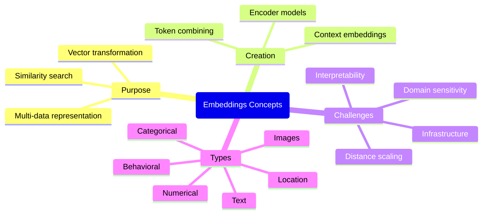
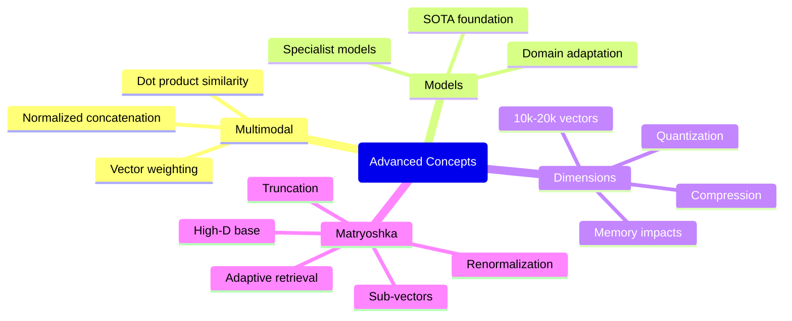
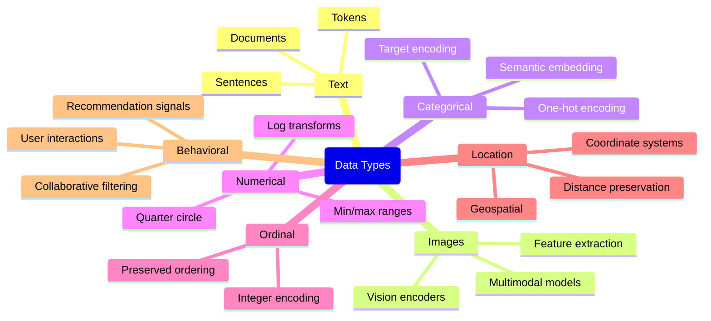

# Embeddings in Search/RAG

This repository provides a visual exploration of embeddings concepts in Search and Retrieval Augmented Generation (RAG) systems through a series of focused, interactive mindmaps.

## Core Embeddings Concepts

## Advanced Embeddings Concepts

## Embedding Data Types

## Understanding Embeddings in Search/RAG

### What are Embeddings?

Embeddings are vector representations of data (text, images, etc.) that capture semantic meaning in a mathematical space. These vectors allow computers to understand similarities and relationships between different pieces of information by measuring their distance or angle in a high-dimensional space.

### The Purpose of Embeddings

- **Vector transformation**: Converting text and other data into numerical vectors that algorithms can process
- **Similarity search**: Finding related content through vector space operations (cosine similarity, dot products)
- **Multi-data representation**: Creating a unified mathematical framework for different types of information

### How Embeddings are Created

Embeddings are typically created through:

- **Encoder models**: Neural networks that transform input data into fixed-dimensional vectors
- **Context embeddings**: Representations that account for surrounding information (unlike older bag-of-words approaches)
- **Token combining**: Methods like CLS token extraction, averaging, or pooling to create document-level vectors

### Challenges in Working with Embeddings

Working with embeddings presents several considerations:

- **Interpretability**: Vector dimensions often lack clear semantic meaning
- **Domain sensitivity**: Performance degradation when handling out-of-domain data
- **Distance scaling**: Ensuring proper similarity measurements across different data types
- **Infrastructure**: Managing computational and storage requirements at scale

### Advanced Embedding Concepts

#### Multimodal Embeddings

Combining different data types in a unified embedding space:

- **Normalized concatenation**: Joining vectors while balancing their influence
- **Vector weighting**: Giving different importance to various components
- **Dot product similarity**: Enabling flexible measurement of relatedness

#### Embedding Dimensions

The size and structure of embedding spaces:

- **10k-20k vectors**: Trend toward higher-dimensional representations
- **Memory impacts**: Storage requirements in vector databases
- **Quantization**: Techniques to reduce precision while maintaining quality
- **Compression**: Creating efficient representation spaces

#### Matryoshka Embeddings

An innovative approach to embedding architecture:

- **High-dimensional base**: Comprehensive vector representations
- **Sub-vectors**: Nested embeddings at multiple scales
- **Truncation**: Using subsets of dimensions for different tasks
- **Renormalization**: Post-processing after dimension reduction
- **Adaptive retrieval**: Adjusting embedding size based on computational constraints

### Applications in Search and RAG

Embeddings are foundational to modern search and RAG systems:

1. **Semantic search**: Finding relevant information beyond keyword matching
2. **Cross-modal retrieval**: Searching images with text queries or vice versa
3. **Knowledge representation**: Encoding relationships between entities
4. **RAG context selection**: Identifying the most relevant information to augment LLM generation

## Further Reading

- [Retrieval-Augmented Generation (RAG)](https://arxiv.org/abs/2312.10997)
- [Matryoshka Representation Learning](https://arxiv.org/abs/2205.13147)
- [Sentence Transformers Documentation](https://www.sbert.net/)
- [OpenAI Embeddings Documentation](https://platform.openai.com/docs/guides/embeddings)

## Contributing

Contributions to improve or expand these visualizations are welcome! Please submit a pull request with your suggested changes.

## License

This project is licensed under the MIT License - see the LICENSE file for details.
